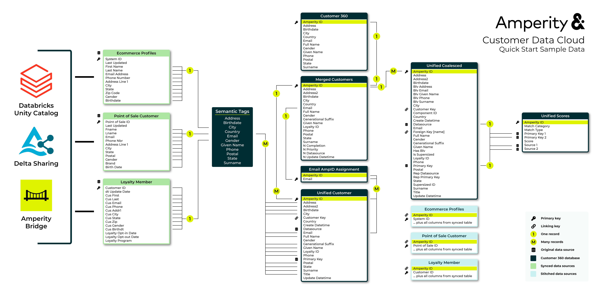

.. https://docs.amperity.com/reference/

.. meta::
    :description lang=en:
        Use Amperity to build robust unified datasets and durable customer profiles that support all of your brand's use cases.

.. meta::
    :content class=swiftype name=body data-type=text:
        Use Amperity to build robust unified datasets and durable customer profiles that support all of your brand's use cases.

.. meta::
    :content class=swiftype name=title data-type=string:
        Identity resolution agent

==================================================
Identity resolution agent
==================================================

.. article-info::
   :avatar: _static/amperity_circle.png
   :avatar-link: https://docs.amperity.com/reference/start.html
   :avatar-outline: muted
   :author: Identity resolution agent
   :date: |today|
   :read-time: 10 min read. ~1 hour to complete
   :class-container: sd-p-2 sd-outline-muted sd-rounded-1

.. start-overview-start

Amperity specializes in using AI to turn raw data into a growing library of robust unified datasets and durable customer profiles that are available to support all of your brand's use cases.

By the end of this guide you will know how to do the following:

#. Sync data from a data warehouse to Amperity.
#. Apply semantic tags to your data sources using AmpAI.
#. Build an identity graph that links disparate profile records together using a unique and persistent identifier.

.. start-overview-end

.. start-free-trial-start

.. admonition:: Sign up for a free trial of Amperity.

   `Sign up for a free trial <https://amperity.com/trial>`__ |ext_link| to see how your brand can use Amperity to build robust unified datasets and durable customer profiles that support all of your brand's use cases. You may use trial data provided by Amperity or you may upload samples of your own customer data.

.. start-free-trial-end

.. _start-data-model:

Identity resolution agent data model
==================================================

.. start-data-model-start

The following diagram shows the data model for the sample data that is part of the identity resolution agent. Color coded sections identify which groups of tables are associated with source customer profiles, stitched domain tables, and unified tables.

.. start-data-model-end

.. data-tables-data-model-tables-note-start

.. note:: Click this diagram to open it in your full browser window. `Open this diagram <https://docs.amperity.com/reference/_images/quickstart_sample_erd.png>`__ |ext_link| in a new tab or right-click that link to save a copy to your computer.

.. data-tables-data-model-tables-note-end

.. _start-prerequisites:

Prerequisites
==================================================

.. start-prerequisites-start

To follow-along with this guide you need:

#. Access to an Amperity account.
#. Approximately ~1 hour of time to complete all of the steps within the guide.\
#. Source data. Amperity provides a set of sample data that can be used to complete the steps in this guide. You may provide your own data with customer profiles.

   .. note:: Amperity sample data contains ~10 million customer records.

.. start-prerequisites-end

.. _start-login:

Connect to data sources
==================================================

.. start-login-start

To connect Amperity to data sources, do the following:

#. Log in to `Amperity <https://app.amperity.com>`__.
#. Open the **Quick start** page. This is located in the left-side menu at the top.
#. Under **Identity resolution** click **Add datasource**.
#. Select one of the following options: **More sources ...**, and then choose **Sample data**.

   This opens a page that will walk you through steps for connecting to Amperity to sample customer profiles.

.. start-login-end

.. _start-connect:

Example: Sample data
==================================================

.. start-connect-start

Use Amperity Bridge to connect to sample customer profile data using sample customer profiles provided by Amperity.

.. start-connect-end

**To connect to Amperity sample data**

.. start-connect-steps-start

.. list-table::
   :widths: 10 90
   :header-rows: 0

   * - .. image:: ../../images/steps-01.png
          :width: 60 px
          :alt: Step one.
          :align: center
          :class: no-scaled-link
     - In **Identity resolution**, next to **Inbound sharing data** click **Add bridge**.

       .. image:: ../../images/bridge-inbound-choose-amperity-sample-data.png
          :width: 320 px
          :alt: Add a bridge for a sync.
          :align: left
          :class: no-scaled-link

       This opens the **Add bridge** dialog box.

       Choose **Sample data**. This opens the **Select tables** dialog box.

   * - .. image:: ../../images/steps-02.png
          :width: 60 px
          :alt: Step two.
          :align: center
          :class: no-scaled-link
     - Use the **Select tables to share** dialog box to select the sample data from "amperity-trial/trial-data".

       .. image:: ../../images/quick-start-bridge-databases-sample-data.png
          :width: 420 px
          :alt: Select schemas and tables to be shared.
          :align: left
          :class: no-scaled-link

       When finished, click **Create**. This opens the **Domain table mapping** dialog box.

   * - .. image:: ../../images/steps-03.png
          :width: 60 px
          :alt: Step three.
          :align: center
          :class: no-scaled-link
     - In the **Sample data** dialog, review the table names, and then click **Save and sync**.

       .. image:: ../../images/quick-start-bridge-inbound-sample-data.png
          :width: 420 px
          :alt: Map inbound synced tables to domain tables.
          :align: left
          :class: no-scaled-link

       This will start the sync between Amperity and the sample data source. Wait for the sync to finish before continuing to the next step. Amperity sample data should sync in about three minutes.

.. start-connect-steps-end

.. _start-semantics:

Add semantic tags
--------------------------------------------------

.. start-semantics-start

Semantic tags are applied to fields in incoming data sources to indicate the type of data that is contained within those fields.

The semantic tag tells Amperity how to treat the data, regardless of how the data is formatted, named, or originally stored.

For example, a field named **evar_15** contains email addresses. This field should have the **email** semantic tag applied to it. This tag tells Amperity that the contents of the **evar_15** field are

* Email addresses
* Personally identifiable information (PII)

Email addresses are an important part of the identity resolution process. Using a semantic tag to tell Amperity which fields in your data sources contain email addresses saves you a lot of time because you do not have to do any data processing, ETLs, or data modeling before making that data source available to Amperity.

Connect the data, apply the semantic tag, and build customer profiles.

You have two options:

#. Let **AmpAI** apply semantic tags
#. `Manually apply semantic tags <https://docs.amperity.com/operator/semantics.html>`__

.. start-semantics-end

**To let AmpAI apply semantic tags**

.. start-semantics-steps-start

.. list-table::
   :widths: 10 90
   :header-rows: 0

   * - .. image:: ../../images/steps-01.png
          :width: 60 px
          :alt: Step one.
          :align: center
          :class: no-scaled-link
     - In **Identity resolution**, if you are using Amperity sample data, next to **Identity tables**, click **AmpAI select**.

       **AmpAI** will analyze the sample data and identify which tables contain PII, and then idenfity which semantic tags should be applied. You may change the tags **AmpAI** assigns to fields.

       Click **Continue**. Wait for the **AmpAI** to finish applying semantic tags before continuing to the next step. This process takes up to 5 minutes to complete.

   * - .. image:: ../../images/steps-02.png
          :width: 60 px
          :alt: Step two.
          :align: center
          :class: no-scaled-link
     - When **AmpAI** is finished applying semantic tags, next to **Identify your fields**, click **Edit**.

       This opens the **Semantic tag** editor. For each table that **AmpAI** applied semantic tags a list of fields, field types, and semantic tags are shown.

       **AmpAI** will correctly assign semantic tags to all of the sample data tables, so you can click the **Save** button in the top right.

       .. important:: **AmpAI** will apply semantic tags for PII correctly most of the time, but it is good to double-check and be sure. If you think they are wrong, just remove the tag **AmpAI** applied and find the correct semantic tag.

.. start-semantics-end

.. _start-run-stitch:

Run Stitch
--------------------------------------------------

.. start-run-stitch-start

After all of the source tables to which semantic tags should be applied have semantic tags applied you are ready to run Stitch.

.. start-run-stitch-end

**To build the identity graph**

.. start-run-stitch-steps-start

.. list-table::
   :widths: 10 90
   :header-rows: 0

   * - .. image:: ../../images/steps-01.png
          :width: 60 px
          :alt: Step one.
          :align: center
          :class: no-scaled-link
     - In **Identity resolution**, next to **Generate Amperity IDs**, click **Run Stitch**.

       Wait for the Stitch to finish running before continuing to the next step. This process will 20-30 minutes to complete for Amperity sample data.

       .. note:: The amount of time it takes to complete against your own data depends on the volume of data that is made available to Stitch, the number of unique data sources with PII, and the complexity of matching individual records across data with unique customer profiles.

   * - .. image:: ../../images/steps-02.png
          :width: 60 px
          :alt: Step two.
          :align: center
          :class: no-scaled-link
     - The identity resolution agent will refresh to show high-level results of identity resolution similar to:

       .. image:: ../../images/quick-start-identity-resolution-results.png
          :width: 320 px
          :alt: Results of identity resolution.
          :align: left
          :class: no-scaled-link

       Click the box to open the **Identity resolution** page. This page shows a summary, a collection of benchmarks, along with access to the configuration that was used to get these results.

   * - .. image:: ../../images/steps-03.png
          :width: 60 px
          :alt: Step three.
          :align: center
          :class: no-scaled-link
     - The **Summary** tab shows a comparison of domain tables and the record pairs identified both within each data source and across all data sources. This is presented as an UpSet Plot chart with links to the underlying data sources.

   * - .. image:: ../../images/steps-04.png
          :width: 60 px
          :alt: Step four.
          :align: center
          :class: no-scaled-link
     - The **Benchmark** tab shows the results of a series of tests that are run by Amperity, grouped by "Optimal" and "Abnormal".

       Optimal benchmarks are shown when test results are within the typical range for most brands.

       .. image:: ../../images/quick-start-benchmarks-optimal.png
          :width: 420 px
          :alt: Optimal benchmark results.
          :align: left
          :class: no-scaled-link

       Abnormal benchmarks are shown when test results are above or below the typical range for most brands.

       .. image:: ../../images/quick-start-benchmarks-high.png
          :width: 420 px
          :alt: Optimal benchmark results.
          :align: left
          :class: no-scaled-link

       For each test with abnormal results:

       #. Step through and grade the result as a "Good example" or "Poor example". When benchmark grading is finished click **Next**.,
       #. Review the list of steps you can take to improve customer profile quality.

       .. note:: Amperity sample data shows abnormal benchmarks. This is because the data is generated and does not represent real customer profile data. If you used your own customer profile data you should expect to see more optimal benchmarks and fewer abnormal benchmarks.

.. start-run-stitch-steps-end

.. _start-create-database:

Create database
--------------------------------------------------

.. include:: ../../shared/terms.rst
   :start-after: .. term-customer-360-database-start
   :end-before: .. term-customer-360-database-end

**To create a Customer Profile database**

.. start-create-database-steps-start

.. list-table::
   :widths: 10 90
   :header-rows: 0

   * - .. image:: ../../images/steps-01.png
          :width: 60 px
          :alt: Step one.
          :align: center
          :class: no-scaled-link
     - Open the **Customer 360** page, select the **Databases** tab, and then click **Create Database**.

       Give the database a name, set the value for **Template** to "Customer 360". You can keep the default "Admin" permissions. Click **Create**.

   * - .. image:: ../../images/steps-02.png
          :width: 60 px
          :alt: Step two.
          :align: center
          :class: no-scaled-link
     - The **Database Editor** page opens.

       The following tables is in the customer profile database:

       * **Customer Profiles**. A standardized table with the most complete set of customer profile data that is built from merge rules with a single row for each unique Amperity ID.
       * **Identity Graph**. A linking table for Amperity IDs, data sources, customer keys, and primary keys.
       * **Merged Customers**. A standardized table that contains configurable merge rules.
       * **Unified Coalesced**. A standardized table that contains all original data used to build the identity graph.
       * **Unified Scores**. A standardized table that contains the edges of the identity graph with confidence scores for each linked record.

       Click **Activate**. This will return you to the **Customer 360** page.

   * - .. image:: ../../images/steps-03.png
          :width: 60 px
          :alt: Step three.
          :align: center
          :class: no-scaled-link
     - For the database you just created click **Run**. This will load records to each of the customer profile database tables.

       Wait for the data to finish loading before continuing to the next step. This process will 3-5 minutes to complete for Amperity sample data.

.. start-create-database-steps-end

.. _start-merge-policy:

Merge policy
--------------------------------------------------

.. merge-policy-intro-start

Merge policy defines how the **Merged Customers** table is maintained by Amperity. The **Merged Customers** table collects PII data from all source datasets, and then collapses the best data into single row that is unique by Amperity ID. Each row in the **Merged Customers** table represents a single customer's best set of profile data.

Use merge policy to tell Amperity which tables are the most reliable sources of customer profile data.

.. merge-policy-intro-end

.. start-merge-policy-steps-start

**To define merge policy**

.. start-merge-policy-steps-start

.. list-table::
   :widths: 10 90
   :header-rows: 0

   * - .. image:: ../../images/steps-01.png
          :width: 60 px
          :alt: Step one.
          :align: center
          :class: no-scaled-link
     - Source priority can be defined for names, physical addresses, email addresses, phone numbers, birthdates, and gender.

       To configure source priority for profile attributes open the **Profile Builder**. For each profile attribute, use the |fa-drag| icon to move the list of tables into the desired order, and then click **Save**.

       .. admonition:: How source priority works

          Tables A, B, and C all contain a field with email addresses to which the **email** semantic tag is applied. They are ranked 1) table A, 2) table B, and 3) table C.

          If the value in table A is "justin@email.com" then the priority for email address is table A and the value "justin@email.com".

          If the value in table A is NULL and the value in table B is "justinc@email.com" then the priority for email address is table B and the value "justinc@email.com".

          If the values in tables A and B are NULL and the value in table C is "justin.c@email.com" then the priority for email address is table C and the value "justin.c@email.com".

   * - .. image:: ../../images/steps-02.png
          :width: 60 px
          :alt: Step two.
          :align: center
          :class: no-scaled-link
     - Source table precedence can also be defined for data sources that contain semantic tags that are not grouped by profile attribute. Precedence determines which tables are more likely to contain high quality customer profile data, as determined by your brand.

       The list of domain tables under **Source_Priority** must contain *at least one* domain table that has been made available to Stitch *and* contains fields to which profile semantic tags have been applied.

       To configure source table precedence, open the **Profile Builder**. Under **Source table precedence**, use the |fa-drag| icon to move the list of tables into the desired order, and then click **Save**.

.. start-merge-policy-steps-end
