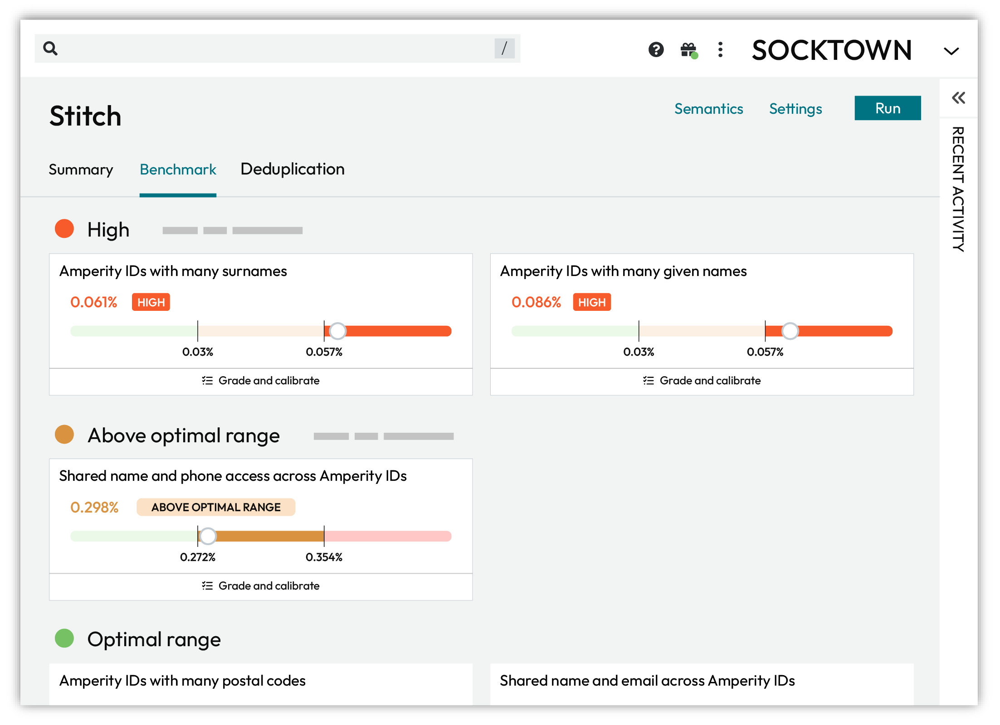

.. https://docs.amperity.com/operator/

.. meta::
    :description lang=en:
        Stitch benchmarks are heuristic scores that define the expectations for the quality of customer profiles that are output by Stitch.

.. meta::
    :content class=swiftype name=body data-type=text:
        Stitch benchmarks are heuristic scores that define the expectations for the quality of customer profiles that are output by Stitch.

.. meta::
    :content class=swiftype name=title data-type=string:
        Stitch benchmarks

==================================================
About Stitch benchmarks
==================================================

.. include:: ../../amperity_reference/source/benchmarks.rst
   :start-after: .. stitch-benchmark-checks-start
   :end-before: .. stitch-benchmark-checks-end

.. _benchmarks-about-results:

About benchmark results
==================================================

.. TODO: Don't change the reference link name. It is shared with /reference/benchmarks.rst.

.. include:: ../../amperity_reference/source/benchmarks.rst
   :start-after: .. stitch-benchmark-results-start
   :end-before: .. stitch-benchmark-results-end

.. _stitch-benchmark-results-optimal:

Optimal
---------------------------------------------------

.. TODO: Don't change the reference link name. It is shared with /reference/benchmarks.rst.

.. include:: ../../amperity_reference/source/benchmarks.rst
   :start-after: .. stitch-benchmark-results-optimal-start
   :end-before: .. stitch-benchmark-results-optimal-end

.. _stitch-benchmark-results-above-optimal:

Above optimal range
---------------------------------------------------

.. TODO: Don't change the reference link name. It is shared with /reference/benchmarks.rst.

.. include:: ../../amperity_reference/source/benchmarks.rst
   :start-after: .. stitch-benchmark-results-above-optimal-start
   :end-before: .. stitch-benchmark-results-above-optimal-end

.. _stitch-benchmark-results-high:

High
---------------------------------------------------

.. TODO: Don't change the reference link name. It is shared with /reference/benchmarks.rst.

.. include:: ../../amperity_reference/source/benchmarks.rst
   :start-after: .. stitch-benchmark-results-high-start
   :end-before: .. stitch-benchmark-results-high-end

.. _benchmarks-review:

Review interpretations
==================================================

.. include:: ../../amperity_reference/source/benchmarks.rst
   :start-after: .. stitch-benchmark-cards-interpretations-start
   :end-before: .. stitch-benchmark-cards-interpretations-end

.. _benchmarks-grade:

Grade and calibrate
==================================================

.. include:: ../../amperity_reference/source/benchmarks.rst
   :start-after: .. stitch-benchmark-cards-grade-and-calibrate-start
   :end-before: .. stitch-benchmark-cards-grade-and-calibrate-end

.. TODO: Need mockup here that shows one of the review/grade pages.

.. include:: ../../amperity_reference/source/benchmarks.rst
   :start-after: .. stitch-benchmark-cards-grade-and-calibrate-howitworks-start
   :end-before: .. stitch-benchmark-cards-grade-and-calibrate-howitworks-end

.. _benchmarks-revisit-benchmarks:

Revisit benchmarks
==================================================

.. benchmarks-revisit-benchmarks-start

You should revisit benchmark scores on a regular basis. The frequency is determined by the current state of your tenant. For example:

#. A newly-configured tenant should have benchmark scores reviewed after every Stitch run. Reduce the frequency when you are satisfied with each benchmark score.
#. Review benchmark scores after adding a data source that contains customer profile data that is used with identity resolution.
#. On a production tenant with consistent data sources you may revisit benchmark scores less frequently.

.. benchmarks-revisit-benchmarks-end

.. _stitch-benchmark-categories:

Benchmark categories
==================================================

.. include:: ../../amperity_reference/source/benchmarks.rst
   :start-after: .. stitch-benchmark-categories-start
   :end-before: .. stitch-benchmark-categories-end

.. _stitch-benchmark-category-overclustering:

Overclustering
---------------------------------------------------

.. include:: ../../shared/terms.rst
   :start-after: .. term-overcluster-start
   :end-before: .. term-overcluster-end

.. include:: ../../amperity_reference/source/benchmarks.rst
   :start-after: .. stitch-benchmark-category-overclustering-start
   :end-before: .. stitch-benchmark-category-overclustering-end

.. _stitch-benchmark-category-many-given-names:

Many given names
++++++++++++++++++++++++++++++++++++++++++++++++++

.. include:: ../../amperity_reference/source/benchmarks.rst
   :start-after: .. stitch-benchmark-category-many-given-names-start
   :end-before: .. stitch-benchmark-category-many-given-names-end

.. _stitch-benchmark-category-many-postal-codes:

Many postal codes
++++++++++++++++++++++++++++++++++++++++++++++++++

.. include:: ../../amperity_reference/source/benchmarks.rst
   :start-after: .. stitch-benchmark-category-many-postal-codes-start
   :end-before: .. stitch-benchmark-category-many-postal-codes-end

.. _stitch-benchmark-category-many-surnames:

Many surnames
++++++++++++++++++++++++++++++++++++++++++++++++++

.. include:: ../../amperity_reference/source/benchmarks.rst
   :start-after: .. stitch-benchmark-category-many-surnames-start
   :end-before: .. stitch-benchmark-category-many-surnames-end

.. _stitch-benchmark-category-underclustering:

Underclustering
---------------------------------------------------

.. include:: ../../shared/terms.rst
   :start-after: .. term-undercluster-start
   :end-before: .. term-undercluster-end

.. include:: ../../amperity_reference/source/benchmarks.rst
   :start-after: .. stitch-benchmark-category-underclustering-start
   :end-before: .. stitch-benchmark-category-underclustering-end

.. _stitch-benchmark-category-shared-names-and-emails:

Shared names and emails
++++++++++++++++++++++++++++++++++++++++++++++++++

.. include:: ../../amperity_reference/source/benchmarks.rst
   :start-after: .. stitch-benchmark-category-shared-names-and-emails-start
   :end-before: .. stitch-benchmark-category-shared-names-and-emails-end

.. _stitch-benchmark-category-shared-names-and-phones:

Shared names and phones
++++++++++++++++++++++++++++++++++++++++++++++++++

.. include:: ../../amperity_reference/source/benchmarks.rst
   :start-after: .. stitch-benchmark-category-shared-names-and-phones-start
   :end-before: .. stitch-benchmark-category-shared-names-and-phones-end

.. _stitch-benchmark-category-shared-names-and-addresses:

Shared names and addresses
++++++++++++++++++++++++++++++++++++++++++++++++++

.. include:: ../../amperity_reference/source/benchmarks.rst
   :start-after: .. stitch-benchmark-category-shared-names-and-addresses-start
   :end-before: .. stitch-benchmark-category-shared-names-and-addresses-end
