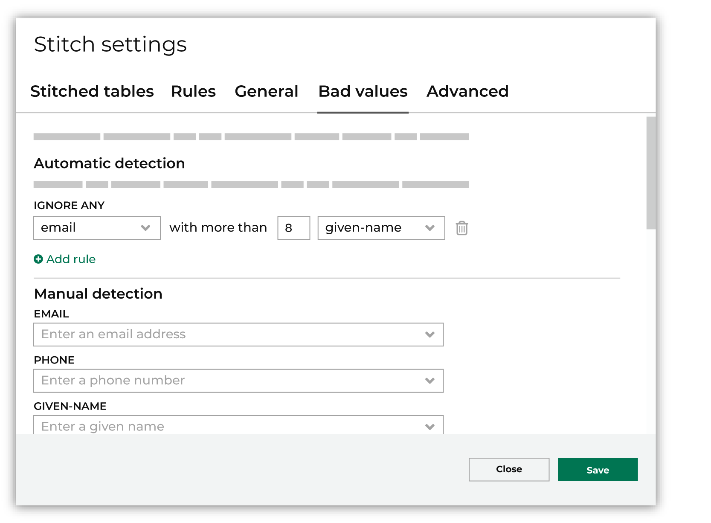
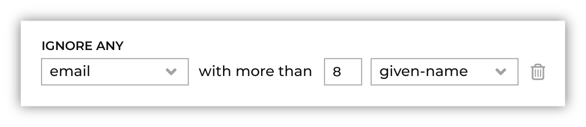

.. https://docs.amperity.com/operator/

.. meta::
    :description lang=en:
        Build and maintain your tenant's bad-values blocklist.

.. meta::
    :content class=swiftype name=body data-type=text:
        Build and maintain your tenant's bad-values blocklist.

.. meta::
    :content class=swiftype name=title data-type=string:
        Bad-values blocklist

==================================================
Bad-values blocklist
==================================================

.. blocklist-bad-values-start

Some values can be very common in data sets. These values may have been entered into the data for the purpose of testing, but often they were entered with a goal of intentionally providing bad data. This pattern is especially common with phone numbers, email addresses, and physical addresses. For example, bad phone numbers like 555-555-5555, 555-1212, and 867-5309 may be provided by individuals instead of their real phone number.

Amperity should be configured to ignore these types of fake values when they appear in columns that are associated with :ref:`certain semantic values for PII data <semantics-profile>`. Especially when they occur at a very high frequency in customer data. By ignoring these values, this prevents the Stitch process from assigning Amperity IDs as if these fake values were real values.

.. blocklist-bad-values-end

.. blocklist-bad-values-important-start

.. important:: The bad-values blocklist supports the following PII semantics: **given-name**, **surname**, **email**, **phone**, and **address** (which is handled as a combination of fields to which the **address**, **address2**, **city**, **state**, and **postal** semantic tags are applied). You do not have to implement all of these semantics as part of the :ref:`query template for automated blocklist values <bad-values-blocklist-sql-example>`. Automated blocklist values will not work for **address2** (standalone), **birthdate**, **city** (standalone), **company**, **full-name**, **gender**, **generational-suffix**, **postal** (standalone), **state** (standalone), **title**, or for any custom semantic.

.. blocklist-bad-values-important-end

.. _bad-values-blocklist-config:

Bad values
==================================================

.. TODO: Sync this with a forthcoming update for the "Stitch settings" dialog box.

.. bad-values-blocklist-config-start

Use the **Bad values** tab in the **Stitch settings** dialog to configure values that should be ignored by Stitch during identity resolution.

Values can be configured to be:

* Detected automatically using a threshold and an association between two fields. The value is ignored when the first field exceeds the configured threshold as it relates to the second field.

  For example, "Ignore any email address with more than 8 given names." where **email** is the first field, the threshold is "8", and the second field is **given-name**. When an email address is associated with more than 8 given names, that email address will be added to the bad-values blocklist and ignored by Stitch, after which it is not used for identity resolution.

  Automatic detection is available for `all fields to which customer profile semantic tags were applied <https://docs.amperity.com/operator/semantics.html#profiles>`__, such as **email**, **phone**, **address**, **given-name** and for fields that contain foreign keys.

* Detected manually. Specific values can be added for email addresses, phone numbers, given names, and surnames.

.. tip:: Review the documentation for managing `bad values <https://docs.amperity.com/operator/blocklist_bad_values.html>`__ for additional options for managing a bad-values blocklist.

.. bad-values-blocklist-config-end

.. _bad-values-blocklist-automatic:

Automatic bad value detection
--------------------------------------------------

.. bad-values-blocklist-automatic-start

Automatic detection uses rules that define thresholds above which values are ignored automatically. Rules can be defined to look for values in fields created by customer profile semantic tags (**address**, **birthdate**, **city**, **company**, **email**, **gender**, **generational-suffix**, **given-name**, **phone**, **postal**, **state**, and **surname**), along with foreign keys (**fk-**) and Post Office boxes.

For example:

will automatically ignore an email address that is associated with 8 or more distinct values for **given_name**.

.. note:: Default thresholds are set for the following combinations:

   #. Ignore any email address with more than 20 given names.
   #. Ignore any email address with more than 20 surnames.
   #. Ignore any phone number with more than 20 given names.
   #. Ignore any physical address with more than 40 given names.

.. bad-values-blocklist-automatic-end

.. _bad-values-blocklist-values-to-ignore:

.. bad-values-blocklist-values-to-ignore-start

Values can be added to the bad-values blocklist manually for email addresses, phone numbers, given names, and surnames. Type the value into the field, and then hit enter to manually add a value to the bad-values blocklist.

.. tip:: If a value needs to be removed from the bad-values blocklist click the "X" icon next to the value.

.. bad-values-blocklist-values-to-ignore-end

.. _bad-values-blocklist-automatic-disable:

Disable automatic bad value detection
--------------------------------------------------

.. bad-values-blocklist-automatic-disable-start

You can disable automatic bad-value blocklists by updating the configuration to add the following setting with empty square brackets:

.. code-block:: clojure

   :amperity.stitch.settings/badvalues-config []

.. bad-values-blocklist-automatic-disable-end

.. _bad-values-blocklist-stitch-badvalues:

Stitch_BadValues table
==================================================

.. include:: ../../amperity_reference/source/data_tables.rst
   :start-after: .. data-tables-stitch-bad-values-start
   :end-before: .. data-tables-stitch-bad-values-end

.. bad-values-blocklist-stitch-badvalues-howitworks-start

.. admonition:: How to understand rows in the Stitch_BadValues table

   For a configuration of:

   .. code-block:: clojure

      {:threshold 20, :proxy "given-name", :semantic "email"}

   A row in the **Stitch BadValues** table may contain the following values:

   .. code-block:: mysql

      ----- ---------- ----------- ------------ -----------  -----
       ...   semantic   value       num_values   num_proxy    ...
      ----- ---------- ----------- ------------ -----------  -----
             email      a@aol.com   189          91
      ----- ---------- ----------- ------------ -----------  -----

   This means that the email address "a@aol.com" was discovered 189 times with 91 different **given-name** proxies, which means this email address is associated with a large number of individuals. This exceeds the threshold of "20" and is added to the bad-values blocklist. 

.. bad-values-blocklist-stitch-badvalues-howitworks-end

.. include:: ../../amperity_reference/source/data_tables.rst
   :start-after: .. data-tables-stitch-bad-values-table-about-start
   :end-before: .. data-tables-stitch-bad-values-table-about-end

.. include:: ../../amperity_reference/source/data_tables.rst
   :start-after: .. data-tables-stitch-bad-values-table-start
   :end-before: .. data-tables-stitch-bad-values-table-end

.. _bad-values-blocklist-global-values:

Global blocklist values
==================================================

.. bad-values-blocklist-global-values-start

Amperity uses a global blocklist to automatically remove a set of known bad values from the data to prevent them from being used to identify clusters.

.. bad-values-blocklist-global-values-end

.. bad-values-blocklist-global-values-list-start

.. vale off

.. list-table::
   :widths: 200 400
   :header-rows: 1

   * - Semantic
     - Values
   * - **All semantics**
     - The following values are ignored by Stitch when performing identity resolution:

       * BLOCKED
       * COLLECT
       * DECLINE
       * DECLINED
       * DECLINES
       * DENIED
       * EMPTY
       * INFO
       * N/A
       * NAME
       * NONE
       * NONE GIVEN
       * NO VALUE
       * NOT AVAILABLE
       * NOT GIVEN
       * NOTAVAILABLE
       * NULL
       * REFUSED
       * TBD
       * TDB
       * TRAVEL
       * UNKNOWN

   * - **address**
     - The following values associated with the **address** semantic are ignored by Stitch when performing identity resolution:

       * GENERAL DELIVERY
       * NEED ADDRESS
       * NO ADDRESS GIVEN
       * P O BOX
       * PO BOX
       * UNLISTED
       * YOUR STREET ADDRESS

   * - **birthdate**
     - The following values associated with the **birthdate** semantic are ignored by Stitch when performing identity resolution:

       * 1899-12-31
       * 1900-01-01
       * 1920-01-01

   * - **city**
     - The following values associated with the **city** semantic are ignored by Stitch when performing identity resolution:

       * NA
       * NAN
       * NEED CITY
       * NO
       * NO ADDRESS

   * - **email**
     - Stitch will automatically blocklist email address values that do not contain an @ symbol.

       .. include:: ../../amperity_operator/source/configure_stitch.rst
          :start-after: .. configure-stitch-advanced-profile-email-address-patterns-start
          :end-before: .. configure-stitch-advanced-profile-email-address-patterns-end

       .. warning:: Stitch may be configured to ignore a partial list of :ref:`generic email addresses <configure-stitch-advanced-profile-email>`. When Stitch is configured to ignore a partial list of generic email addresses, additional work to update the bad-values blocklist may be necessary.

   * - **full-name**
     - The following values associated with the **full-name** semantic are ignored by Stitch when performing identity resolution:

       * DEFAULT CUSTOMER
       * PREPAID CARDHOLDER
       * RED CARD
       * RED CARDS
       * RESERVED GUEST
       * RESERVED GUESTS
       * TEST TEST

   * - **given-name**
     - The following values associated with the **given-name** semantic are ignored by Stitch when performing identity resolution:

       * BLOCK
       * CONTACT
       * GUEST
       * GUESTS
       * NO NAME
       * RESERVED
       * USE

   * - **phone**
     - The following values associated with the **phone** semantic are ignored by Stitch when performing identity resolution:

       * 0000000000
       * 0000000001
       * 1111111111
       * 1234567890
       * 1234567891
       * 2222222222
       * 3333333333
       * 4444444444
       * 5555555555
       * 6666666666
       * 7777777777
       * 8888888888
       * 9999999999

   * - **postal**
     - The following values associated with the **postal** semantic are ignored by Stitch when performing identity resolution:

       * 00000
       * 11111
       * 1111
       * 111
       * 11
       * 1
       * NA
       * NAN
       * NO

   * - **state**
     - The following values associated with the **state** semantic are ignored by Stitch when performing identity resolution:

       * NA
       * NAN
       * NEED STATE
       * NO

   * - **surname**
     - The following values associated with the **surname** semantic are ignored by Stitch when performing identity resolution:

       * CONTACT
       * GUESTS
       * NO NAME
       * RESERVED
       * USE

.. vale on

.. bad-values-blocklist-global-values-list-start

.. _bad-values-blocklist-configure:

Managed bad-value blocklists
==================================================

.. include:: ../../shared/terms.rst
   :start-after: .. term-bad-values-blocklist-start
   :end-before: .. term-bad-values-blocklist-end

.. bad-values-blocklist-configure-links-start

In addition to using the default behavior of the bad-values blocklist, you may configure custom workflows for managing bad-values in your tenant's blocklist:

#. :ref:`Add a query <bad-values-blocklist-add-sql-query>` for automated blocklist values.
#. :ref:`Run the query <bad-values-blocklist-run-query>`, and then validate the results.
#. :ref:`Download the results as a CSV file <bad-values-blocklist-download-csv>`.
#. :ref:`Add a feed to ingest the CSV file <bad-values-blocklist-add-feed>`.
#. :ref:`Run Stitch <bad-values-blocklist-run-stitch>`.
#. :ref:`Edit Unified Coalesced table <bad-values-blocklist-update-coalesced-merged>`.
#. :ref:`Update the Merged Customers table <bad-values-blocklist-update-unified-merged>`.
#. :ref:`Update Stitch QA queries <bad-values-blocklist-update-stitch-qa>`.
#. :ref:`Automate blocklist <bad-values-blocklist-automate>`.

.. bad-values-blocklist-configure-links-end

.. bad-values-blocklist-configure-note-start

.. note:: These steps describe how to add a bad-values blocklist. They show examples for only the **email** and **phone** semantics. Use the :ref:`example SQL query <bad-values-blocklist-sql-example>` if you want to add the **address** semantic. If you want to also add **given-name** and **surname** they both follow the same pattern, but be sure to associate the proxy for **given-name** to some other semantic to ensure the validation process can compare the results alongside some other column.

.. bad-values-blocklist-configure-note-start
 

.. _bad-values-blocklist-add-sql-query:

Add SQL query
--------------------------------------------------

.. include:: ../../shared/terms.rst
   :start-after: .. term-query-start
   :end-before: .. term-query-end

.. bad-values-blocklist-add-sql-query-start

The easiest way to build a bad-values blocklist is to :ref:`define a SQL query that returns a list of values associated with specific Amperity semantics <bad-values-blocklist-sql-example>`. This list should only return common values that appear over a certain threshold.

.. bad-values-blocklist-add-sql-query-end

.. bad-values-blocklist-add-sql-query-requirements-start

This query must do the following:

* Use SELECT to get data from a table in the customer 360 database.
* Specify the associated Amperity semantic for that column.
* Specify the column in which potential bad values are located.
* Apply a count threshold, over which a value is returned for inclusion in the bad-values blocklist.
* Return the data into columns named datasource, semantic, and values, one unique value per row.

.. important:: Only the PII semantic fields **email**, **phone**, **given-name**, **surname**, and **address** have corresponding **_blv** columns added to the **Unified Coalesced** table, but any semantic may be added to the blocklist.

The name of the query should contain the word "blocklist" to help identify its purpose. For example: "Bad-values Blocklist".

.. bad-values-blocklist-add-sql-query-requirements-end

.. bad-values-blocklist-run-query-example-start

For example, a SQL query that returns values that appear more than 20 times for **email** and **phone** is similar to:

.. code-block:: sql
   :linenos:

   WITH

   bad_emails AS (
     SELECT * FROM (
       SELECT
         UPPER(REGEXP_REPLACE(email,'(?:\.|\+.*)(?=.*?@.+\..+)','')) AS value
         ,'email' AS semantic
         ,datasource AS domain_table
         ,UPPER(given_name) AS proxy
       FROM Unified_Coalesced)
     WHERE value IS NOT null
     AND value <> ''),

   bad_phones AS (
     SELECT * FROM (
       SELECT
         UPPER(phone) AS value
         ,'phone' AS semantic
         ,datasource AS domain_table
         ,UPPER(given_name) AS proxy
       FROM Unified_Coalesced)
     WHERE value IS NOT null
     AND value <> '')

   SELECT
     *
     ,TO_HEX(MD5(TO_UTF8(CONCAT(domain_table,semantic,value)))) AS pk
   FROM (
     SELECT
       '*' AS datasource
       ,semantic
       ,value
       ,COUNT(value) AS num_values
       ,COUNT(DISTINCT proxy) AS num_proxy
       ,'' AS domain_table
     FROM bad_emails
     GROUP BY 1,2,3,6
     HAVING COUNT(DISTINCT proxy) > 20

     UNION

     SELECT
       '*' AS datasource
       ,semantic
       ,value
       ,COUNT(value) AS num_values
       ,COUNT(DISTINCT proxy) AS num_proxy
       ,'' AS domain_table
     FROM bad_phones
     GROUP BY 1,2,3,6
     HAVING COUNT(DISTINCT proxy) > 20

     ORDER BY datasource, semantic, num_proxy desc
   )

.. bad-values-blocklist-run-query-example-end

.. _bad-values-blocklist-run-query:

Run query
--------------------------------------------------

.. bad-values-blocklist-run-query-start

Run the query from the SQL **Query Editor** to validate the syntax and to verify the output. Fix any errors that may be returned. If the values in the returned output do not seem correct, update the threshold for values counts to see if that improves the results.

.. tip:: The goal of the bad-values blocklist is not to catch every single bad value, but rather to remove from the Stitch process the most comon bad values.

.. bad-values-blocklist-run-query-end

.. _bad-values-blocklist-download-csv:

Download CSV
--------------------------------------------------

.. bad-values-blocklist-download-csv-start

After the bad-values blocklist query has been validated and run successfully, download the results as a CSV file.

The bad-values blocklist output is a table similar to:

.. code-block:: mysql

   ----- ------------ ------------ ----------------------------
    row   datasource   semantic     value
   ----- ------------ ------------ ----------------------------
    1     MTK          email        internaltest@matchstik.com
    2     MTK          phone        555-555-5555
    4     MTK          fk           172fdr9HpTafWNpQmyVR
   ----- ------------ ------------ ----------------------------

Each row associates a bad value to an Amperity semantic and a customer data source. The CSV file itself would be similar to:

.. code-block:: none

   datasource,semantic,value
   MTK,email,internaltest@matchstik.com
   MTK,phone,555-555-5555
   MTK,fk,172fdr9HpTafWNpQmyVR

Each row associates a bad value to an Amperity semantic and a customer data source.

.. bad-values-blocklist-download-csv-end

.. _bad-values-blocklist-add-feed:

Add feed
--------------------------------------------------

.. include:: ../../shared/terms.rst
   :start-after: .. term-feed-start
   :end-before: .. term-feed-end

**To add a feed for blocklist values**

.. bad-values-blocklist-add-feed-about-labels-steps-start

#. Click the **Sources** page.
#. Add a data source named "Amperity" if one does not already exist.
#. Add a feed named "Blocklist".
#. Upload the bad-values blocklist CSV file that was previously downloaded from the **Queries** page.
#. Set all field types to string.
#. Set labels for fields in the CSV file.

   The downloaded CSV file for the bad-values blocklist has three columns: **datasource**, **semantic**, and **value**.

   These columns must be associated with specific labels in the feed for the bad-values blocklist. When these columns are associated in a feed, the **SEMANTIC** must be mapped to specific labels:

   The following labels are required:

   .. list-table::
      :widths: 150 150
      :header-rows: 1

      * - Incoming Field
        - Blocklist Semantic
      * - **datasource**
        - **blv/data-source**
      * - **semantic**
        - **blv/semantic**
      * - **value**
        - **blv/value**

   .. note:: This is different from how semantics are applied to a non-blocklist feed. This is because the actual data source, actual semantic, and actual values are in the data source itself, as they were output from the customer 360 data as CSV data, and then re-ingested as CSV data in the feed created for the bad-values blocklist. This round-trips output from the customer 360 database as a CSV file that creates a new domain table for use during the Stitch process.
#. Define the primary key. This is required by the Stitch process, but for the purpose of creating the bad-values blocklist is not important. Use any row ID.
#. Uncheck the **Make available to Stitch** option.
#. Activate the feed.

.. bad-values-blocklist-add-feed-about-labels-steps-end

.. _bad-values-blocklist-run-stitch:

Run Stitch
--------------------------------------------------

.. bad-values-blocklist-run-stitch-start

Run the Stitch process to update the results for the bad-values blackist.

#. On the **Stitch** page, click **Run**.
#. Re-run each data table in the customer 360 database that contains data that could be affected by the bad-values blocklist. This adds the results of the most recent Stitch run to these data tables, including adding a series of columns that indicate the presence of bad-values.

   .. include:: ../../shared/terms.rst
      :start-after: .. term-has-blv-start
      :end-before: .. term-has-blv-end

.. bad-values-blocklist-run-stitch-end

.. _bad-values-blocklist-update-coalesced-merged:

Edit Unified Coalesced table
--------------------------------------------------

.. include:: ../../shared/terms.rst
   :start-after: .. term-unified-coalesced-table-start
   :end-before: .. term-unified-coalesced-table-end

.. bad-values-blocklist-update-coalesced-merged-start

The **Unified Coalesced** table is :ref:`preconfigured in the Stitch QA database <qa-stitch-enable-steps-add-database>`. When a passthrough table is added to a database all of the columns in that table are selected by default.

.. important:: If a column is removed from the **Unified Coalesced** table, it will be removed automatically from the passthrough table. If a column is added to the **Unified Coalesced** table, you must edit the passthrough table in the Stitch QA database to select the added columns.

For example, the bad-values blocklist is typically configured *after* the initial customer 360 and Stitch QA databases. After the bad-values blocklist is configured, a collection of columns are added to the **Unified Coalesced** table that is output by Stitch. These columns are not enabled automatically within the **Unified Coalesced** table. You must edit the **Unified Coalesced** table, select these columns, activate the table, and then rerun the Stitch QA database to ensure that bad-values blocklist data is available to the Stitch QA database.

.. bad-values-blocklist-update-coalesced-merged-end

**To edit the Unified Coalesced table**

.. bad-values-blocklist-update-coalesced-merged-steps-start

#. From the **Customer 360** page, under **All Databases**, open the menu for the Stitch QA database, and then select **View**. The **Database Editor** page opens.
#. Under **Database Tables**, open the menu for the **Unified Coalesced** table, and then select **Edit**. The **Database Table** page opens.
#. Click **Next** to open the **Database Table** page, and then find and select the following columns: **blv_address**, **blv_email**, **blv_given_name**, **blv_phone**, and **blv_surname**.
#. Click **Save**. This returns you to the **Database Editor** page for the Stitch QA database.
#. Click **Activate**. Run the database.

  .. tip:: If these changes also affect the **Merged Customers** table, update both tables before running the Stitch QA database.

.. bad-values-blocklist-update-coalesced-merged-steps-end

.. _bad-values-blocklist-update-unified-merged:

Update Merged Customers table
--------------------------------------------------

.. bad-values-blocklist-update-merged-customers-start

When using the bad-values blocklist, you must update the **Merged Customers** table to include the bad-values blocklist items in the merge rules.

.. bad-values-blocklist-update-merged-customers-end

**To update the Merged Customers table**

.. bad-values-blocklist-update-merged-customers-steps-start

.. vale off

#. From the **Customer 360** page, under **All Databases**, open the menu for the customer 360 database, and then select **Edit**.
#. Open the menu for the **Merged Customers** table and select **Edit**.
#. Find the **Unified_Prioritized** section, and then update the first value blocks for **email** and **phone** to add the **.blv** entries:

   .. code-block:: sql
      :linenos:
      :emphasize-lines: 5,15

      ,FIRST_VALUE(email_struct)
        OVER (
          PARTITION BY amperity_id
          ORDER BY email_struct.completion DESC
                   ,email_struct.blv
                   ,email_struct.priority
                   ,email_struct.update_dt DESC
                   ,email_struct.pk
        ) AS email_struct

      ,FIRST_VALUE(phone_struct)
        OVER (
          PARTITION BY amperity_id
          ORDER BY phone_struct.completion DESC
                   ,phone_struct.blv
                   ,phone_struct.priority
                   ,phone_struct.update_dt DESC
                   ,phone_struct.pk
        ) AS phone_struct

#. Find the SELECT statement that builds the **Merged Customers** table, and then add the columns for **email_internal**:

   .. code-block:: sql
      :linenos:
      :emphasize-lines: 6,14

      ,up.email_struct.email
      ,up.email_struct.pk AS `email_pk`
      ,up.email_struct.update_dt AS `email_update_dt`
      ,up.email_struct.datasource AS `email_datasource`
      ,up.email_struct.priority AS `email_priority`
      ,up.email_struct.blv AS `email_blv`
      ,up.email_struct.completion AS `email_completion`

      ,up.phone_struct.phone
      ,up.phone_struct.pk AS `phone_pk`
      ,up.phone_struct.update_dt AS `phone_update_dt`
      ,up.phone_struct.datasource AS `phone_datasource`
      ,up.phone_struct.priority AS `phone_priority`
      ,up.phone_struct.blv AS `phone_blv`
      ,up.phone_struct.completion AS `phone_completion`

#. Validate the query.
#. Click **Next**. This opens the **Database Table Definition** page.
#. Verify these settings, and then click **Save**.
#. Run the customer 360 database.

.. note:: If you add other PII semantics to the bad-values blocklist, such as for addresses, be sure to make the same changes to the structs.

.. vale on

.. bad-values-blocklist-update-merged-customers-steps-end

.. _bad-values-blocklist-add-stitch-blocklistvalues-table:

Add Stitch BlocklistValues table
--------------------------------------------------

.. include:: ../../amperity_operator/source/table_stitch_blocklistvalues.rst
   :start-after: .. table-stitch-blocklistvalues-add-start
   :end-before: .. table-stitch-blocklistvalues-add-end

**To add the Stitch BlocklistValues table**

.. include:: ../../amperity_operator/source/table_stitch_blocklistvalues.rst
   :start-after: .. table-stitch-blocklistvalues-add-steps-start
   :end-before: .. table-stitch-blocklistvalues-add-steps-end

.. _bad-values-blocklist-update-stitch-qa:

Update Stitch QA queries
--------------------------------------------------

.. bad-values-blocklist-update-stitch-qa-detailed-examples-start

Update the :doc:`detailed examples Stitch QA <stitch_qa_detailed_examples>` query to uncomment all of the fields that contain **_blv**, and then run it to verify the results.

.. bad-values-blocklist-update-stitch-qa-detailed-examples-end

.. bad-values-blocklist-update-stitch-qa-start

The following Stitch QA queries can be configured to exclude values for the bad-values blocklist:

#. :doc:`Common values <stitch_qa_common_values>`
#. :doc:`Detailed examples <stitch_qa_detailed_examples>`
#. :doc:`Many Amperity IDs <stitch_qa_many_amperity_ids>`
#. :doc:`Split clusters <stitch_qa_split_clusters>`
#. :doc:`Unmatched semantic values <stitch_qa_unmatched_semantic_values>`

After configuring the bad-values blocklist, examine each of the Stitch QA queries and determine which bad values should be excluded from the query.

.. bad-values-blocklist-update-stitch-qa-end

.. _bad-values-blocklist-automate:

Automate blocklist
--------------------------------------------------

.. bad-values-blocklist-automate-start

The bad-values blocklist must be refreshed on a daily basis. To do this, configure a destination to send the results of the :ref:`bad-values blocklist query <bad-values-blocklist-run-query>` to the cloud-based storage location that is included with your tenant -- :doc:`Amazon S3 <destination_amazon_s3>` *or* :doc:`Microsoft Azure Blob Storage <destination_azure_blob_storage>`. Update your courier to pull the bad-values blocklist from that location, and then configure the end-to-end workflow to run automatically.

.. bad-values-blocklist-automate-end

.. bad-values-blocklist-automate-courier-group-tip-start

.. tip:: The following settings are recommended whenever the bad-values blocklist belongs to a courier group:

   #. Set **Notify when missing?** to "Disabled".
   #. Set **Abort when missing?** to "Disabled".
   #. Configure data to load 1 day older than the scheduled date and time.

.. bad-values-blocklist-automate-courier-group-tip-end

.. _bad-values-blocklist-advanced:

Advanced options
==================================================

.. bad-values-blocklist-advanced-start

Blocklists can do any of the following advanced options:

* :ref:`Per-data source <bad-values-blocklist-advanced-per-data-source>`
* :ref:`Per-database <bad-values-blocklist-advanced-per-database>`
* :ref:`Expand returned values <bad-values-blocklist-advanced-expand-returned-values>`
* :ref:`Custom CSV files <bad-values-blocklist-advanced-custom-csv>`
* :ref:`Upload new data to existing feed <bad-values-blocklist-advanced-update-existing-blocklist>`

.. bad-values-blocklist-advanced-end

.. _bad-values-blocklist-advanced-per-data-source:

By data source
--------------------------------------------------

.. bad-values-blocklist-advanced-per-data-source-start

You can create a group of bad-values queries, with one query per data source. This allows you to tune the SQL query results to a specific data set for both semantic associations and thresholds. Use the existing SQL query as a template and the create a unique query for each bad-values blocklist you want to build based on results in the customer 360 database.

.. bad-values-blocklist-advanced-per-data-source-end

.. _bad-values-blocklist-advanced-per-database:

By database
--------------------------------------------------

.. bad-values-blocklist-advanced-per-database-start

You could use a single SQL query that is run against the customer 360 database to return a bad-values blocklist that is global and not specific to a single data table. Download that as a CSV file. Then follow the same steps.

.. bad-values-blocklist-advanced-per-database-end

.. _bad-values-blocklist-advanced-expand-returned-values:

Expand returned values
--------------------------------------------------

.. bad-values-blocklist-advanced-expand-returned-values-start

In situations where multiple values exist for phone numbers or email addresses and the field in the **Unified Coalesced** table is a comma-separated concatenation of all values, the automated blocklist SQL query may fail to catch individual bad values for phones or email addresses because the query looks at occurrances of the whole concatenated value.

.. bad-values-blocklist-advanced-expand-returned-values-end

.. include:: ../../amperity_reference/source/sql_presto.rst
   :start-after: .. sql-presto-unnest-clause-example-expand-email-address-start
   :end-before: .. sql-presto-unnest-clause-example-expand-email-address-end

.. _bad-values-blocklist-advanced-addresses:

Addresses
--------------------------------------------------

.. bad-values-blocklist-advanced-addresses-intro-start

The profile (PII) semantics to which a bad-values blocklist can be applied are **email**, **phone**, **given-name**, **surname**, and **address**.

When **address** is added to the bad-values blocklist, be sure to verify that real values, such as university addresses, apartment complex addresses, and condominium addresses are not being added to the bad-values blocklist.

.. bad-values-blocklist-advanced-addresses-intro-end

.. bad-values-blocklist-advanced-addresses-admonition-start

.. tip:: Stitch processes addresses in a bad-values blocklist in this order:

   #. Each record is normalized, and the **address** and **address2** are concatenated together into a single address field.
   #. Each blocklist entry is processed for the normalized address.
   #. Values are removed from the preprocessed record if they occur in any preprocessed blocklist record.

   A blocklist cannot define independent **address** and **address2** semantics. When the values in **address2** must be part of the bad-values blocklist, the value of the address in its post-processed concatenated state is the best value to use in the blocklist.

.. bad-values-blocklist-advanced-addresses-admonition-end

.. bad-values-blocklist-advanced-addresses-context-start

An effective bad-values blocklist for **address** often requires tuning and validation of the results to ensure that the right level of values are removed from the data. Start with a high threshold--at least "40", but higher if necessary--for **address**, verify the results, and then adjust the threshold until the desired level of accuracy is achieved. Use an Internet search to help verify each address that is blocklisted as part of the verification process.

When the bad-values blocklist is applied to **address** keep in mind that it also considers **city** and **state** along with **address** before determining if the threshold is met. This group--**address**, **city**, and **state**--does not replace the **address** value in the **Stitch_BadValues** table. The same address value may appear multiple times for each city and state pair. When |apply_ordinals_to_address_groups|, the address group for each ordinal is checked.

.. bad-values-blocklist-advanced-addresses-context-end

.. _bad-values-blocklist-advanced-addresses-address2:

address2 fields
++++++++++++++++++++++++++++++++++++++++++++++++++

.. bad-values-blocklist-advanced-addresses-address2-start

The **address** field may be used in the bad-values blocklist as part of a complete, normalized address. 

.. caution:: The fields associated with this semantic can follow many patterns and contain many types of values. Applying a bad-values blocklist to them is more difficult and the results are less accurate.

.. important:: The **address2** field should never be used in the bad-values blocklist in isolation.

In certain situations, the **address2** field is the source of a value that may need to be added to the bad-values blocklist. Do one of the following:

#. :ref:`Remove a single address <bad-values-blocklist-advanced-addresses-address2-remove>`.
#. :ref:`Concatenate address and address2 <bad-values-blocklist-advanced-addresses-address2-concatenate>`.

.. caution:: Both approaches require visual inspection of the results to verify that the blocklist values are being applied correctly and only to the intended fields and not to a more global set of fields.

.. bad-values-blocklist-advanced-addresses-address2-end

.. _bad-values-blocklist-advanced-addresses-address2-remove:

Remove address
++++++++++++++++++++++++++++++++++++++++++++++++++

.. bad-values-blocklist-advanced-addresses-address2-remove-start

To remove a single address from post-processed output, add SQL similar to the following to the bad-values blocklist query to remove a single address value. Be sure to use the post-processed, normalized format for the data as the value to be removed:

.. code-block:: none

   semantic="address", value="123 MAIN ST STE 500"

.. bad-values-blocklist-advanced-addresses-address2-remove-end

.. _bad-values-blocklist-advanced-addresses-address2-concatenate:

Concatenate address
++++++++++++++++++++++++++++++++++++++++++++++++++

.. bad-values-blocklist-advanced-addresses-address2-concatenate-start

To concatenate the **address** and **address2** fields in the bad-values blocklist, update the following line in the **bad_addresses** block from:

.. code-block:: none

   UPPER(address) AS value

to:

.. code-block:: none

   CASE
     WHEN address2 IS null
     THEN UPPER(address)
     ELSE UPPER(CONCAT(address,' ',address2))
   END AS value

.. caution:: This approach should not be used when the **address** field is known to contain a high volume of bad addresses that should be removed, and also the **address2** fields within that subset of records contains a variety of junk values. Updating the **bad_address** block in this scenario may cause addresses to be missed as the blocklist values are applied.

.. bad-values-blocklist-advanced-addresses-address2-concatenate-end

.. _bad-values-blocklist-advanced-custom-csv:

Custom CSV files
--------------------------------------------------

.. bad-values-blocklist-advanced-custom-csv-start

You may create a CSV file to use for custom bad-value blocklists. The table structure of this CSV file must be contain the following columns:

* datasource
* semantic
* value

.. vale off

and then must contain a unique value per row, associated to a single Amperity semantic. Use a wildcard value (``*``) to associate a value with all data sources:

.. vale on

.. code-block:: mysql

   ----- ------------ ----------- ----------------------------
    row   datasource   semantic    value
   ----- ------------ ----------- ----------------------------
    1     ACME         email       internaltest@matchstik.com
    2     ACME         email       externaltext@matchstik.com
    3     ACME         email       foo@matchstik.com
    4     ACME         phone       555-555-5555
    5     ACME         phone       555-1212
    6     *            phone       867-5309
    7     ACME         phone       111-111-1111
    8     *            address     One Infinite Loop
    9     ACME         fk          172fdr9HpTafWNpQmyVR
   ----- ------------ ----------- ----------------------------

The CSV file itself would be similar to:

.. code-block:: none

   datasource,semantic,value
   ACME,email,internaltest@matchstik.com
   ACME,email,externaltext@matchstik.com
   ACME,email,foo@matchstik.com
   ACME,phone,555-555-5555
   ACME,phone,555-1212
   *,phone,867-5309
   ACME,phone,111-111-1111
   *,address,One Infinite Loop
   ACME,fk,172fdr9HpTafWNpQmyVR

.. bad-values-blocklist-advanced-custom-csv-end

**To use a custom CSV file to blocklist birthdates**

.. bad-values-blocklist-advanced-custom-csv-steps-start

#. Use a custom CSV file to blocklist birthdates that exist across multiple data sources. For example:

   .. code-block:: none

      datasource,semantic,value
      *,birthdate,0001-01-03
      *,birthdate,0001-01-01
      *,birthdate,1901-12-13

#. Import this CSV file as a feed.
#. Set the **semantic** and **value** fields as a primary key.
#. Uncheck the **Make available to Stitch** setting.

.. tip:: This example shows how to use a CSV file to provide custom values that should be blocklisted. However, adding birthdates to a custom blocklist is often unnecessary because Amperity will not use birthdate values to cluster two individuals with distinct names. The likelihood of distinct individuals with very similar PII, such as both having the same name and email address, along with having the same birthdate is very low.

   Before adding values to a custom blocklist, first verify if any of these values have created false-positive clusters in the Stitch results.

.. bad-values-blocklist-advanced-custom-csv-steps-end

.. _bad-values-blocklist-advanced-custom-domain-tables:

Custom domain tables
--------------------------------------------------

.. bad-values-blocklist-advanced-custom-domain-tables-start

The bad-values blocklist uses a regular expression to identify domain tables. Domain tables are built using a **source:feed** pattern, whereas custom domain tables use a SQL-safe pattern that uses underscores (``_``) instead of a colon (``:``) as a delimiter. When custom domain table names are present, the default regular expression will not identify the underscores and any related custom domain tables, and may return **NULL** values.

If a blocklist returns NULL values and if custom domain tables are present, update the regular expression in the **SELECT** statements for the following sections:

* **bad_addresses**
* **bad_emails**
* **bad_phones**

For each **SELECT** statement, change:

.. code-block:: none

   REGEXP_EXTRACT(datasource, '.+?(?=:)') AS datasource,

to:

.. code-block:: none

   COALESCE(REGEXP_EXTRACT(datasource, '.+?(?=:)'), '*') AS datasource,

This update allows these **SELECT** statements to continue using a regular expression to find domain tables, and then use ``*`` to find custom domain tables and prevents **NULL** values from being returned.

.. bad-values-blocklist-advanced-custom-domain-tables-end

.. _bad-values-blocklist-advanced-external-blocklist:

External blocklists
--------------------------------------------------

.. bad-values-blocklist-advanced-external-blocklist-start

A blocklist does not need to be round-tripped as CSV output from the customer 360 database back into Amperity via a feed to a domain table. A blocklist may come from any source, including external sources that contain known bad values. The only requirement for this approach is the table structure must contain fields for **datasource**, **semantic**, and **values**.

.. bad-values-blocklist-advanced-external-blocklist-end

.. _bad-values-blocklist-advanced-update-existing-blocklist:

Update existing blocklist
--------------------------------------------------

.. bad-values-blocklist-advanced-update-existing-blocklist-start

You can upload new data to an existing blocklist feed as long as the schema for the uploaded data matches the schema that already exists in the blocklist feed. Select the feed menu options, and then choose **Load new data**. In the dialog box, select the **Upload new** option and click **Upload** to select a file. The table may be truncated on load. Then load the file.

.. bad-values-blocklist-advanced-update-existing-blocklist-end

.. _bad-values-blocklist-derived-semantics:

Derived semantics
==================================================

.. bad-values-blocklist-derived-semantics-start

A bad-values blocklist works best for email addresses, physical addresses, and phone numbers. That said, other Amperity PII semantics may be added to the blocklist.

The bad-values blocklist operates against pre-processed semantic rows, and not against raw customer data. When adding blocklist values, consider which semantics are best to target rather than which fields to target, even if they are often the same.

.. caution:: Blocklist values are pre-processed using the same semantic configuration as the targeted data source. This is intentional, in part to ensure the individual who creates the bad-values blocklist does not have to understand what the customer data will look like after it has been pre-processed.

   This can be a problem with derived semantics.

   .. include:: ../../shared/terms.rst
      :start-after: .. term-derived-semantic-start
      :end-before: .. term-derived-semantic-end

   If the targeted data source is configured to derive **given-name** and **surname** semantics from the **full-name** semantic, values in the **full-name** semantic should never be added to a bad-values blocklist.

   For example, if ``BLACK BLACK`` were added to the bad-values blocklist via the **full-name** semantic, then ``BLACK`` for both **given-name** and **surname** semantics would be blocklisted too. This type of situation is not common, but must be considered when deciding which semantics to use for building the bad-values blocklist.

.. bad-values-blocklist-derived-semantics-end

.. _bad-values-blocklist-sql-example:

SQL query example
==================================================

.. bad-values-blocklist-sql-example-start

This SQL query provides a working example of a bad-values blocklist that looks for common values that exceed defined thresholds for physical addresses, email addresses, and phone numbers. Use this as a template for defining a bad-values query against your data.

.. TODO: The following example for addresses does NOT include postal because city and state are equivalently precise, but postal can come in 5 & 9 digit forms while representing the same address.

.. code-block:: sql
   :linenos:

   -- QUERY NAME: Blocklist Values
   -- DESCRIPTION: Use this query to verify the presence of blocklisted values.
   -- REQUIREMENTS: Configure for semantics and use `proxy` to assess the quality
   -- of the bad values returned by the query. The recommended proxy is `given_name`.
   -- OPTIONS:
   -- NOTES:
   
   
   WITH bad_addresses AS (
     SELECT *
     FROM (
       SELECT
         CASE
           WHEN address2 IS NULL
           THEN UPPER(address)
           ELSE UPPER(CONCAT(address,' ',address2))
         END AS value
         ,UPPER(REPLACE(CONCAT(
           COALESCE(address,''),
           COALESCE(address2,''),
           COALESCE(city,''),
           COALESCE(state,'')),
           ' ')) AS measured_value
         ,'address' AS semantic
         ,COALESCE(REGEXP_EXTRACT(datasource, '.+?(?=:)'), '*') AS datasource
         ,datasource AS domain_table
         ,UPPER(COALESCE(given_name, SPLIT(full_name,' ')[1])) AS proxy
       FROM Unified_Coalesced
     )
     WHERE value IS NOT NULL
     AND value <> ''
   )
   
   ,bad_emails AS (
     SELECT *
     FROM (
       SELECT
         UPPER(REGEXP_REPLACE(email,'(?:\.|\+.*)(?=.*?@.+\..+)','')) AS value
         ,'email' AS semantic
         ,COALESCE(REGEXP_EXTRACT(datasource, '.+?(?=:)'), '*') AS datasource
         ,datasource AS domain_table
         ,UPPER(COALESCE(given_name, SPLIT(full_name,' ')[1])) AS proxy
       FROM Unified_Coalesced
     )
     WHERE value IS NOT NULL
     AND value <> '')
   
   ,bad_phones AS (
     SELECT *
     FROM (
       SELECT
         UPPER(phone) AS value
         ,'phone' AS semantic
         ,COALESCE(REGEXP_EXTRACT(datasource, '.+?(?=:)'), '*') AS datasource
         ,datasource AS domain_table
         ,UPPER(COALESCE(given_name, SPLIT(full_name,' ')[1])) AS proxy
       FROM Unified_Coalesced
     )
     WHERE value IS NOT NULL
     AND value <> '')
   
   SELECT
     *
     ,TO_HEX(MD5(TO_UTF8(CONCAT(domain_table,semantic,value)))) AS pk
   FROM (
     SELECT
       datasource
       ,semantic
       ,value
       ,SUM(num_values) AS num_values
       ,SUM(num_proxy) AS num_proxy
       ,domain_table
     FROM (
       SELECT
         '*' AS datasource
         ,semantic
         ,value
         ,measured_value
         ,COUNT(value) AS num_values
         ,COUNT(DISTINCT proxy) AS num_proxy
         ,'' AS domain_table
       FROM bad_addresses
       GROUP BY 1,2,3,4,7
       HAVING COUNT(DISTINCT proxy) > 40
     )
     GROUP BY 1,2,3,6
   
     UNION
   
     SELECT
       '*' AS datasource
       ,semantic
       ,value
       ,COUNT(value) AS num_values
       ,COUNT(DISTINCT proxy) AS num_proxy
       ,'' AS domain_table
     FROM bad_emails
     GROUP BY 1,2,3,6
     HAVING COUNT(DISTINCT proxy) > 20
   
     UNION
   
     SELECT
       '*' AS datasource
       ,semantic
       ,value
       ,COUNT(value) AS num_values
       ,COUNT(DISTINCT proxy) AS num_proxy
       ,'' AS domain_table
     FROM bad_phones
     GROUP BY 1,2,3,6
     HAVING COUNT(DISTINCT proxy) > 20
   )

.. bad-values-blocklist-sql-example-end
