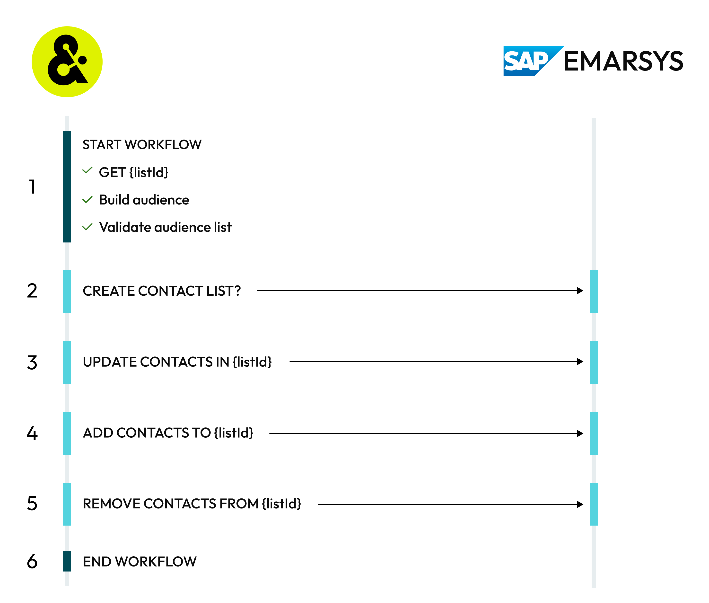

.. https://docs.amperity.com/operator/

.. |destination-name| replace:: SAP Emarsys
.. |destination-api| replace:: Emarsys API
.. |plugin-name| replace:: "SAP Emarsys"
.. |credential-type| replace:: "emarsys"
.. |required-credentials| replace:: "refresh token"
.. |audience-primary-key| replace:: "email"
.. |what-send| replace:: contact lists
.. |where-send| replace:: |destination-name|
.. |filter-the-list| replace:: "emar"

.. meta::
    :description lang=en:
        Configure Amperity to send campaigns with contact lists to SAP Emarsys.

.. meta::
    :content class=swiftype name=body data-type=text:
        Configure Amperity to send campaigns with contact lists to SAP Emarsys.

.. meta::
    :content class=swiftype name=title data-type=string:
        Configure campaigns for SAP Emarsys

==================================================
Configure campaigns for SAP Emarsys
==================================================

.. include:: ../../amperity_operator/source/destination_sap_emarsys.rst
   :start-after: .. destination-sap-emarsys-about-start
   :end-before: .. destination-sap-emarsys-about-end

.. include:: ../../amperity_operator/source/destination_sap_emarsys.rst
   :start-after: .. destination-sap-emarsys-configure-start
   :end-before: .. destination-sap-emarsys-configure-end

.. _campaign-sap-emarsys-howitworks:

How this destination works
==================================================

.. include:: ../../amperity_operator/source/destination_sap_emarsys.rst
   :start-after: .. destination-sap-emarsys-howitworks-start
   :end-before: .. destination-sap-emarsys-howitworks-end

.. include:: ../../amperity_operator/source/destination_sap_emarsys.rst
   :start-after: .. destination-sap-emarsys-howitworks-table-start
   :end-before: .. destination-sap-emarsys-howitworks-table-end

.. _campaign-sap-emarsys-get-details:

Get details
==================================================

.. include:: ../../shared/destination_settings.rst
   :start-after: .. setting-common-get-details-start
   :end-before: .. setting-common-get-details-end

.. campaign-sap-emarsys-get-details-table-start

.. list-table::
   :widths: 10 90
   :header-rows: 0

   * - .. image:: ../../images/steps-check-off-black.png
          :width: 60 px
          :alt: Detail 1.
          :align: center
          :class: no-scaled-link
     - **OAuth credential settings**

       Configure the client ID and client secret for |destination-name| to allow Amperity to use OAuth while managing client lists.

       **Client ID and secret**

          |checkmark-required| **Required**

          .. include:: ../../shared/credentials_settings.rst
             :start-after: .. setting-sap-emarsys-client-id-and-secret-start
             :end-before: .. setting-sap-emarsys-client-id-and-secret-end

   * - .. image:: ../../images/steps-check-off-black.png
          :width: 60 px
          :alt: Detail 2.
          :align: center
          :class: no-scaled-link
     - **Required configuration settings**

       .. include:: ../../shared/destination_settings.rst
          :start-after: .. setting-sap-emarsys-list-exists-start
          :end-before: .. setting-sap-emarsys-list-exists-end

   * - .. image:: ../../images/steps-check-off-black.png
          :width: 60 px
          :alt: Detail 3.
          :align: center
          :class: no-scaled-link
     - **Profile attributes and custom fields**

       .. include:: ../../shared/destination_settings.rst
          :start-after: .. setting-sap-emarsys-contact-identifier-start
          :end-before: .. setting-sap-emarsys-contact-identifier-end

.. campaign-sap-emarsys-get-details-end

.. _campaign-sap-emarsys-credentials:

Configure credentials
==================================================

.. include:: ../../shared/credentials_settings.rst
   :start-after: .. credential-configure-first-start
   :end-before: .. credential-configure-first-end

.. include:: ../../shared/credentials_settings.rst
   :start-after: .. credential-snappass-start
   :end-before: .. credential-snappass-end

**To configure credentials for SAP Emarsys**

.. campaign-sap-emarsys-credentials-steps-start

.. list-table::
   :widths: 10 90
   :header-rows: 0

   * - .. image:: ../../images/steps-01.png
          :width: 60 px
          :alt: Step one.
          :align: center
          :class: no-scaled-link
     - .. include:: ../../shared/credentials_settings.rst
          :start-after: .. credential-steps-add-credential-start
          :end-before: .. credential-steps-add-credential-end

   * - .. image:: ../../images/steps-02.png
          :width: 60 px
          :alt: Step two.
          :align: center
          :class: no-scaled-link
     - .. include:: ../../shared/credentials_settings.rst
          :start-after: .. credential-steps-select-type-start
          :end-before: .. credential-steps-select-type-end

   * - .. image:: ../../images/steps-03.png
          :width: 60 px
          :alt: Step three.
          :align: center
          :class: no-scaled-link
     - .. include:: ../../shared/credentials_settings.rst
          :start-after: .. credential-steps-settings-intro-start
          :end-before: .. credential-steps-settings-intro-end

       Configure the client ID and client secret for |destination-name| to allow Amperity to use OAuth while managing client lists.

       **Client ID and secret**

          |checkmark-required| **Required**

          .. include:: ../../shared/credentials_settings.rst
             :start-after: .. setting-sap-emarsys-client-id-and-secret-start
             :end-before: .. setting-sap-emarsys-client-id-and-secret-end

.. campaign-sap-emarsys-credentials-steps-end

.. _campaign-sap-emarsys-add:

Add destination
==================================================

.. include:: ../../shared/destination_settings.rst
   :start-after: .. setting-common-sandbox-recommendation-start
   :end-before: .. setting-common-sandbox-recommendation-end

**To add a destination for SAP Emarsys**

.. campaign-sap-emarsys-add-steps-start

.. list-table::
   :widths: 10 90
   :header-rows: 0

   * - .. image:: ../../images/steps-01.png
          :width: 60 px
          :alt: Step one.
          :align: center
          :class: no-scaled-link
     - .. include:: ../../shared/destination_settings.rst
          :start-after: .. campaigns-steps-add-destinations-start
          :end-before: .. campaigns-steps-add-destinations-end

       .. image:: ../../images/mockup-destinations-add-01-select-destination-common.png
          :width: 380 px
          :alt: Add 
          :align: left
          :class: no-scaled-link

       .. include:: ../../shared/destination_settings.rst
          :start-after: .. campaigns-steps-add-destinations-select-start
          :end-before: .. campaigns-steps-add-destinations-select-end

   * - .. image:: ../../images/steps-02.png
          :width: 60 px
          :alt: Step two.
          :align: center
          :class: no-scaled-link
     - .. include:: ../../shared/destination_settings.rst
          :start-after: .. campaigns-steps-select-credential-start
          :end-before: .. campaigns-steps-select-credential-end

       .. tip::

          .. include:: ../../shared/destination_settings.rst
             :start-after: .. campaigns-steps-test-connection-start
             :end-before: .. campaigns-steps-test-connection-end

   * - .. image:: ../../images/steps-03.png
          :width: 60 px
          :alt: Step three.
          :align: center
          :class: no-scaled-link
     - .. include:: ../../shared/destination_settings.rst
          :start-after: .. campaigns-steps-name-and-description-start
          :end-before: .. campaigns-steps-name-and-description-end

       .. admonition:: Configure business user access

          .. include:: ../../shared/destination_settings.rst
             :start-after: .. setting-common-business-user-access-allow-start
             :end-before: .. setting-common-business-user-access-allow-end

          .. include:: ../../shared/destination_settings.rst
             :start-after: .. setting-common-business-user-access-restrict-pii-start
             :end-before: .. setting-common-business-user-access-restrict-pii-end

   * - .. image:: ../../images/steps-04.png
          :width: 60 px
          :alt: Step four.
          :align: center
          :class: no-scaled-link
     - .. include:: ../../shared/destination_settings.rst
          :start-after: .. campaigns-steps-settings-start
          :end-before: .. campaigns-steps-settings-end

       **Contact identifier**

          .. include:: ../../shared/destination_settings.rst
             :start-after: .. setting-sap-emarsys-contact-identifier-start
             :end-before: .. setting-sap-emarsys-contact-identifier-end

       **Create contact?**

          .. include:: ../../shared/destination_settings.rst
             :start-after: .. setting-sap-emarsys-create-contact-start
             :end-before: .. setting-sap-emarsys-create-contact-end

       **Campaign file settings**

          .. include:: ../../shared/destination_settings.rst
             :start-after: .. campaigns-steps-campaign-settings-start
             :end-before: .. campaigns-steps-campaign-settings-end

   * - .. image:: ../../images/steps-05.png
          :width: 60 px
          :alt: Step five.
          :align: center
          :class: no-scaled-link
     - .. include:: ../../shared/destination_settings.rst
          :start-after: .. campaigns-steps-business-users-start
          :end-before: .. campaigns-steps-business-users-end

   * - .. image:: ../../images/steps-06.png
          :width: 60 px
          :alt: Step six.
          :align: center
          :class: no-scaled-link
     - .. include:: ../../shared/destination_settings.rst
          :start-after: .. destinations-steps-validate-audience-start
          :end-before: .. destinations-steps-validate-audience-end

.. campaign-sap-emarsys-add-steps-end

.. _campaign-sap-emarsys-attributes-and-fields:

Profile attributes and custom fields
==================================================

.. include:: ../../shared/destination_settings.rst
   :start-after: .. setting-sap-emarsys-attributes-and-fields-start
   :end-before: .. setting-sap-emarsys-attributes-and-fields-end
