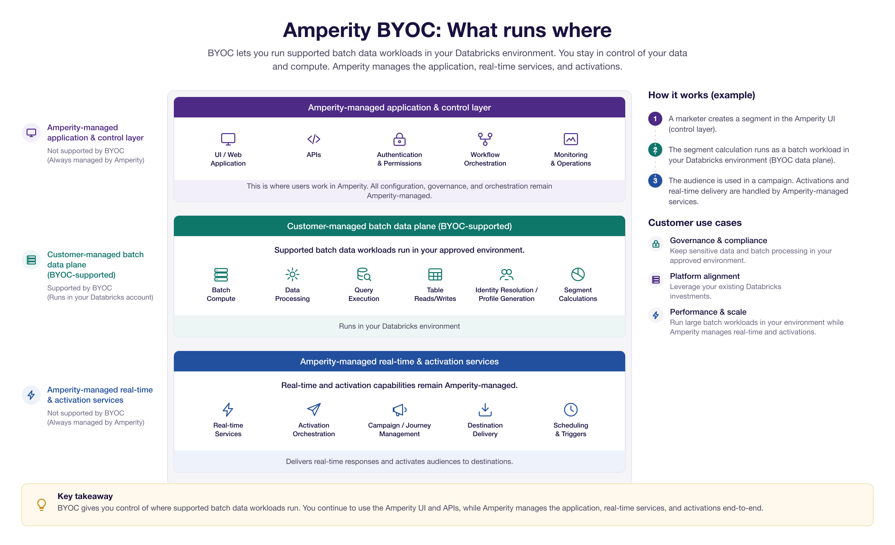

.. https://docs.amperity.com/operator/

.. meta::
    :description lang=en:
        Run Amperity workloads on a Databricks account that is owned and managed by your brand.

.. meta::
    :content class=swiftype name=body data-type=text:
        Run Amperity workloads on a Databricks account that is owned and managed by your brand.

.. meta::
    :content class=swiftype name=title data-type=string:
        About compute

==================================================
About compute
==================================================

.. compute-about-start

Amperity runs data processing workloads -- such as Stitch, customer profile (database) generation, customer attribute (CDT) builds, queries, and segmentation -- on compute resources. By default, these workloads run on compute that is managed by Amperity.

**Bring Your Own Compute (BYOC)** allows your brand to run Amperity workloads on a data platform that is owned and managed by your brand, such as Databricks. Compute runs within your brand's account, against data that is stored in your brand's :ref:`storage location <storage-configure-location>`, while Amperity continues to manage the control plane: the user interface, workflow orchestration, and managed connectors.

.. compute-about-end

.. compute-about-note-start

.. note:: BYOC and :ref:`Bring Your Own Storage (BYOS) <storage-configure-location>` are independent -- you can enable either one on its own. Brands that use both keep the storage *and* the processing of their data within infrastructure that they own and manage.

.. compute-about-note-end

.. compute-about-related-start

For more information about connections between Amperity and other data storage and compute environments, see :doc:`Amperity Bridge <bridge>`.

.. TODO(docs): add a "Supported architectures" link here once a target topic exists.
.. TODO(docs): add a "Networking requirements" link here once a target is confirmed
   (candidate: reference/infrastructure.html#infrastructure-allowlists, "IP addresses for allowlists").

.. compute-about-related-end

.. _compute-what-runs-where:

What runs on your compute
==================================================

.. compute-what-runs-where-start

When BYOC is enabled for Databricks, the following workloads run on your brand's Databricks account:

* Source transformations -- customer attributes (CDTs) -- and domain tables
* Stitch, which runs on an on-demand Spark cluster
* Customer profile (database) generation
* Queries and segments

The following capabilities continue to run on Amperity-managed compute:

* Activation, including campaigns and journeys, and workflow orchestration
* Bridge and data ingest
* Real-time profiles and the Profile API
* Predictive models, AmpIQ, and the AI Assistant
* Control-plane operations: the user interface, monitoring, and managed connectors

.. compute-what-runs-where-end

.. compute-what-runs-where-note-start

.. note:: Each workload runs against a single compute provider and a single SQL dialect; splitting one workload across providers is not supported. During the current public preview period, workloads are enabled in stages -- Stitch is enabled separately from the other supported workloads -- so a tenant may run some workloads on your Databricks account and the rest on Amperity-managed compute. Amperity confirms which workloads are enabled for your tenant.

.. compute-what-runs-where-note-end

.. _compute-databricks:

Run Amperity workloads on your own Databricks
==================================================

.. compute-databricks-start

.. note:: Running Amperity workloads on Databricks is in public preview. Functionality is added in phases, and BYOC is enabled for your tenant by Amperity.

Configure a tenant to run Amperity workloads on a Databricks workspace that is owned and managed by your brand. Amperity connects to your workspace using a service principal, provisions the `Unity Catalog <https://docs.databricks.com/aws/en/data-governance/unity-catalog/>`__ |ext_link| objects that it needs, and runs compute against data in your storage location.

Amperity does not require unmanaged access to your infrastructure. You provision or approve the workspace; Amperity is granted only the permissions it needs to orchestrate supported workloads; jobs are initiated from Amperity and execute in your workspace; and results, metadata, and logs flow back to Amperity for monitoring and support.

.. compute-databricks-end

.. _compute-databricks-prerequisites:

Account prerequisites
--------------------------------------------------

.. compute-databricks-prerequisites-start

Before you connect Amperity to your Databricks workspace, verify the following.

.. list-table::
   :widths: 30 70
   :header-rows: 1

   * - Prerequisite
     - Description

   * - **Storage**
     - BYOC works with either Amperity-managed storage or :ref:`Bring Your Own Storage <storage-configure-location>`. Databricks is where compute happens; the source and destination for business data remain in the configured storage location. Brands that need both data residency and compute governance use Bring Your Own Storage and BYOC together.

   * - **Unity Catalog**
     - Your workspace must be enabled for `Unity Catalog <https://docs.databricks.com/aws/en/data-governance/unity-catalog/>`__ |ext_link|. Amperity creates a catalog for its workloads and does not require a default (managed) storage location to be set on the metastore.

   * - **Account administrator**
     - The person who completes the integration must be a Databricks *account* administrator (not only a workspace administrator). Account-administrator access is required to read the account ID, create a service principal, and generate access tokens.

   * - **Region**
     - Your Databricks workspace and your Amperity storage location should be in the same cloud region. Running compute and storage in different regions causes slower jobs, additional networking charges, and harder troubleshooting.

   * - **Network capacity**
     - The workspace network must have enough available IP addresses for Stitch to start on-demand Spark clusters. Databricks assigns two IP addresses per node, so size the subnet for the largest cluster a Stitch run will use.

.. compute-databricks-prerequisites-end

.. compute-databricks-prerequisites-warning-start

.. important:: BYOC is enabled by Amperity for your tenant. If the **Databricks compute** section does not appear under **Settings** > **Integrations**, contact `Amperity Support <https://support.amperity.com/>`__ |ext_link| to enable it.

.. compute-databricks-prerequisites-warning-end

.. _compute-databricks-ansi-mode:

Configure ANSI mode
--------------------------------------------------

.. compute-databricks-ansi-mode-start

Databricks SQL warehouses run with an `ANSI mode <https://docs.databricks.com/aws/en/sql/language-manual/parameters/ansi_mode>`__ |ext_link| setting that changes how SQL resolves data types. For example, ``COALESCE(<integer>, <string>)`` returns a string when ANSI mode is off, but coerces numerically -- or raises an error -- when ANSI mode is on.

Amperity expects **ANSI mode to be off** so that type resolution matches how Amperity analyzes and builds SQL. For Databricks accounts created on or after October 19, 2022, ANSI mode is on by default, so this setting must be changed deliberately during onboarding.

.. compute-databricks-ansi-mode-end

.. compute-databricks-ansi-mode-steps-start

Set ANSI mode at the workspace level so that it applies to every SQL warehouse in the workspace, including the warehouse Amperity provisions. A session-level ``SET`` statement applies only to the session that runs it and does not carry over to the connections Amperity opens.

#. Check the current value from the Databricks SQL editor:

   .. code-block:: sql

      SET ANSI_MODE;

#. If ANSI mode is on, sign in to your Databricks workspace as a workspace administrator, click your username in the top bar, and select **Settings**.

#. Click **Compute**, then click **Manage** next to **SQL warehouses and serverless compute**.

#. In the **SQL Configuration Parameters** box, add the following on its own line, then save:

   .. code-block:: text

      ANSI_MODE false

   Each parameter is a name and a value separated by a space, one per line. Saving restarts any running SQL warehouse in the workspace.

#. Run ``SET ANSI_MODE;`` again to confirm that it now reports ``false``.

.. compute-databricks-ansi-mode-steps-end

.. compute-databricks-ansi-mode-warning-start

.. warning:: Changing ANSI mode after onboarding can change the results of existing queries and customer attributes. Review the `Databricks ANSI mode documentation <https://docs.databricks.com/aws/en/sql/language-manual/parameters/ansi_mode>`__ |ext_link| before adjusting this setting.

.. compute-databricks-ansi-mode-warning-end

.. _compute-databricks-integration:

Integration steps
--------------------------------------------------

.. compute-databricks-integration-start

Amperity provisions all of the Databricks resources that it needs automatically. You provide a small number of connection details, and Amperity creates the service principal, storage credentials, external locations, catalog, volumes, cluster policy, and SQL warehouse for you.

.. compute-databricks-integration-end

**To connect Amperity to your Databricks workspace**

.. compute-databricks-integration-steps-start

.. list-table::
   :widths: 10 90
   :header-rows: 0

   * - .. image:: ../../images/steps-01.png
          :width: 60 px
          :alt: Step 1.
          :align: center
          :class: no-scaled-link
     - **Gather workspace details**

       Sign in to your Databricks account as an account administrator and collect the following values.

       * **Workspace URL**, in the form ``https://<workspace>.cloud.databricks.com`` (AWS) or ``https://<workspace>.azuredatabricks.net`` (Azure). Find it in the Databricks account console under **Workspaces**.
       * **Account ID**, a UUID found in the account console under the user menu.
       * **Workspace ID** (AWS only), a numeric value found in the workspace console under the user menu.

   * - .. image:: ../../images/steps-02.png
          :width: 60 px
          :alt: Step 2.
          :align: center
          :class: no-scaled-link
     - **Generate access tokens**

       Amperity needs a short-lived account access token and a workspace access token to complete provisioning. Generate them using the `Databricks CLI <https://docs.databricks.com/aws/en/dev-tools/cli/>`__ |ext_link|.

       #. Generate an account access token:

          .. code-block:: bash

             databricks auth login --host https://accounts.cloud.databricks.com --account-id <account-id>
             databricks auth token --host https://accounts.cloud.databricks.com --account-id <account-id>

       #. Generate a workspace access token:

          .. code-block:: bash

             databricks auth login --host <workspace-url>
             databricks auth token --host <workspace-url>

       .. important:: OAuth tokens are valid for one hour. If provisioning fails with an authorization error, the token may have expired. Generate fresh tokens and try again.

   * - .. image:: ../../images/steps-03.png
          :width: 60 px
          :alt: Step 3.
          :align: center
          :class: no-scaled-link
     - **Add the workspace in Amperity**

       #. In Amperity, go to **Settings** > **Integrations**.
       #. In the **Databricks compute** section, click **Add workspace**.
       #. Enter the **Workspace URL**, **Account ID**, **Account access token**, **Workspace access token**, and -- on AWS -- the **Workspace ID**.
       #. Click **Connect** to start provisioning.

       .. TODO(docs): add a screenshot of the "Add Databricks workspace" dialog.
          image:: ../../images/compute-databricks-add-workspace.png
             :width: 600 px
             :alt: The Add Databricks workspace dialog.

   * - .. image:: ../../images/steps-04.png
          :width: 60 px
          :alt: Step 4.
          :align: center
          :class: no-scaled-link
     - **Wait for provisioning to finish**

       Amperity provisions resources in your workspace and reports the current step and status as it works. Provisioning creates:

       * A service principal with OAuth credentials
       * Storage credentials for your tenant data and for Amperity build artifacts
       * External locations for data and artifact access
       * A Unity Catalog catalog and a default schema for Amperity compute
       * A volume for compute artifacts (the bootstrap JAR) and a volume for cluster logs
       * A cluster policy for compute jobs and a SQL warehouse
       * Grants that scope the service principal to only the resources above

       Provisioning takes a few minutes. Leave the page open until it reports that it is complete.

       .. TODO(docs): add a screenshot of the provisioning progress and status.
          image:: ../../images/compute-databricks-provisioning-status.png
             :width: 600 px
             :alt: Provisioning progress for a Databricks workspace.

   * - .. image:: ../../images/steps-05.png
          :width: 60 px
          :alt: Step 5.
          :align: center
          :class: no-scaled-link
     - **Run workloads on Databricks**

       After provisioning completes, configure Amperity to run workloads on the connected workspace.

       #. Open **Stitch**, then open **Stitch settings**.
       #. Under **Databricks workspace**, select the workspace you connected. When only one workspace is configured, it is selected for you and the list is read-only.
       #. Run Stitch, build customer profiles, and run queries as usual. These workloads now run on your Databricks account.

       .. TODO(docs): add a screenshot of the Databricks workspace setting in Stitch settings.
          image:: ../../images/compute-databricks-stitch-workspace.png
             :width: 600 px
             :alt: The Databricks workspace setting in Stitch settings.

.. compute-databricks-integration-steps-end

.. _compute-databricks-sync:

Re-sync a workspace
--------------------------------------------------

.. compute-databricks-sync-start

Use **Sync** to re-apply the provisioning pipeline to a connected workspace -- for example, after an Amperity update adds a new Unity Catalog resource or grant. Syncing:

* Provisions any new Unity Catalog resources
* Re-applies grants for the existing service principal
* Keeps the existing service principal and *does not* rotate its credentials

To sync, open the actions menu on the workspace row under **Settings** > **Integrations** > **Databricks compute**, click **Sync**, and provide a current **Workspace access token** (and, on Azure, the optional **Azure access connector ID**, in the form ``/subscriptions/.../accessConnectors/...``, when the workspace uses an Azure managed identity for storage access).

To rotate the service principal's credentials, remove the workspace with **Delete** and add it again; syncing does not rotate them.

.. TODO(docs): add a screenshot of the workspace row and its Sync action.
   image:: ../../images/compute-databricks-sync.png
      :width: 600 px
      :alt: The Sync action on a connected Databricks workspace.

.. compute-databricks-sync-end

.. _compute-databricks-security:

Security and access
--------------------------------------------------

.. compute-databricks-security-start

BYOC follows a least-privilege model and a shared responsibility model.

.. _compute-databricks-shared-responsibility:

**Shared responsibility model.** When workloads run in your brand's Databricks account, responsibility for security is shared between Amperity and your brand.

.. list-table::
   :widths: 50 50
   :header-rows: 1

   * - Amperity is responsible for
     - Your brand is responsible for

   * - * Creating and scoping the service principal, storage credentials, external locations, catalog, and grants to the minimum required.
       * Storing the service principal secret securely and not returning it after creation.
       * Orchestrating supported workloads and providing recommended compute-sizing guidance.
       * The Amperity control plane: the user interface, workflow orchestration, and managed connectors.
     - * Security of your Databricks account and workspace, including user and administrator access.
       * Network and access controls on the workspace, such as IP access lists and token lifetimes.
       * Provisioning and scaling compute capacity -- cluster and warehouse policies, cloud quotas, and subnet capacity -- to meet Amperity's workload requirements.
       * Security and access controls on your storage location, including any PII redaction or column-level permissions.
       * Reviewing the resources and grants Amperity provisions, and the ANSI mode setting, before running production workloads.

.. note:: Activation and downstream delivery run on Amperity-managed compute, not on your Databricks account. Confirm the :ref:`boundaries of what runs where <compute-what-runs-where>` with your Amperity representative.

* **Scoped service principal.** Amperity creates a dedicated service principal per tenant. It is granted access only to the catalog, schemas, external locations, and volumes that Amperity provisions for that tenant. It has no access to other catalogs or data in your workspace.

* **Scoped storage credentials.** Storage credentials are scoped to your tenant's storage location. The service principal cannot reach storage outside the locations Amperity provisions, and Amperity build artifacts are mounted **read-only**.

* **Credential management.** The service principal's OAuth secret is stored by Amperity in a secrets manager and is never returned after creation. Syncing a workspace does not rotate the credential. Review the `Databricks recommendations for service principals and tokens <https://docs.databricks.com/aws/en/admin/users-groups/service-principals>`__ |ext_link|, including token lifetimes and IP access lists.

* **Audit logging.** Activity is logged in both systems. `Activity logs in Amperity <https://docs.amperity.com/reference/settings.html#about-activity-logs>`__ records user actions and workflow history; Databricks records `account and workspace audit events <https://docs.databricks.com/aws/en/admin/account-settings/audit-logs>`__ |ext_link| for activity performed by the service principal.

* **Do not embed secrets in configuration.** Do not place encryption keys, credentials, or other secrets in customer-attribute (CDT) definitions or query text, where they can appear in logs. Reference secrets by credential instead.

.. compute-databricks-security-end

Manual provisioning
--------------------------------------------------

.. compute-manual-pointer-start

Amperity provisions the Databricks resources described here automatically during :ref:`integration <compute-databricks-integration>`. To provision them by hand, or to review exactly what Amperity creates, see :doc:`Manual provisioning <compute_manual_provisioning>`.

.. compute-manual-pointer-end

.. _compute-databricks-debugging:

Debugging steps
--------------------------------------------------

.. compute-databricks-debugging-start

.. list-table::
   :widths: 35 65
   :header-rows: 1

   * - Symptom
     - Resolution

   * - The **Databricks compute** section does not appear under **Settings** > **Integrations**.
     - BYOC is not yet enabled for your tenant. Contact `Amperity Support <https://support.amperity.com/>`__ |ext_link|.

   * - Provisioning fails with an authorization or access-denied error.
     - The account or workspace access token expired. OAuth tokens last one hour -- generate fresh tokens (Step 2) and try again.

   * - Provisioning fails while creating the catalog, with a cloud-storage "forbidden" or invalid-credential-trust-policy error.
     - The IAM role trust policy that grants Databricks access to your storage is still propagating. Amperity retries automatically; if the error persists, re-run provisioning after a few minutes.

   * - A Databricks workload fails and Amperity shows a generic "Workload failed, see run output for details" message.
     - The detailed error is written to the Databricks run output. Open the corresponding run in your Databricks workspace -- the Stitch run name has the form ``st-<timestamp>-<random>`` -- to see the underlying error and stack trace.

   * - A customer profile (database) build fails with an error that a multipart table is not supported.
     - Customer profile generation on Databricks does not accept multipart input tables, such as a campaign recipient table (CRT). The error names the table; remove it from the database or contact `Amperity Support <https://support.amperity.com/>`__ |ext_link|.

   * - A Stitch job fails partway through with an S3 ``403`` (access denied).
     - This usually indicates a storage-credential propagation or token-expiry issue. Re-sync the workspace and re-run the job.

   * - Stitch fails to start with an "insufficient free addresses in subnet" error.
     - The workspace network does not have enough available IP addresses for the Spark cluster. Work with your cloud or Databricks administrator to add or migrate to a larger subnet or approved network configuration, then re-run.

.. compute-databricks-debugging-end

.. _compute-faq:

FAQ
==================================================

.. _compute-faq-what-runs-where:

For Bring Your Own Compute, what runs where?
--------------------------------------------------

.. compute-faq-what-runs-where-start

BYOC lets your brand run supported batch data jobs in your own approved environment, such as Databricks. Amperity continues to manage the application experience, workflow orchestration, real-time services, and activation workflows.

In short:

* Your environment runs supported batch data processing.
* Amperity runs the application and service layers.

Under BYOC, the following supported batch data jobs run in your approved environment:

* Batch compute
* Data processing
* Queries
* Table reads and writes
* Stitch
* Customer profile (database) generation
* Segments

.. compute-faq-what-runs-where-end

.. _compute-faq-batch-data-plane:

What is the batch data plane?
--------------------------------------------------

.. compute-faq-batch-data-plane-start

The batch data plane is the part of the system that performs supported batch data work in your approved environment -- the part that BYOC supports. It covers the supported batch data jobs listed under :ref:`what runs where <compute-faq-what-runs-where>`.

.. compute-faq-batch-data-plane-end

.. _compute-faq-application-control-layer:

What is the application and control layer?
--------------------------------------------------

.. compute-faq-application-control-layer-start

The application and control layer is the part of Amperity that users interact with and that coordinates the overall product experience. It remains Amperity-managed and includes:

* User interface
* APIs
* Authentication and permissions
* Workflow orchestration
* Monitoring and operations

.. compute-faq-application-control-layer-end

.. _compute-faq-real-time-activation:

What are real-time and activation services?
--------------------------------------------------

.. compute-faq-real-time-activation-start

Real-time and activation services are Amperity-managed services that support downstream customer engagement and delivery. They are not part of the BYOC-supported batch data plane, and include:

* Real-time profiles
* Activation
* Campaigns and journeys
* Destination delivery
* Scheduling and triggers

.. compute-faq-real-time-activation-end

.. _compute-faq-move-application:

Does Bring Your Own Compute move the Amperity application into my cloud?
------------------------------------------------------------------------

.. compute-faq-move-application-start

No. BYOC does not move the full Amperity application stack into your environment. The :ref:`application and control layer <compute-faq-application-control-layer>` and the :ref:`real-time and activation services <compute-faq-real-time-activation>` remain Amperity-managed. BYOC moves only supported batch data jobs into your approved environment.

.. compute-faq-move-application-end

.. _compute-faq-support-real-time:

Does Bring Your Own Compute support real-time and activations?
--------------------------------------------------------------

.. compute-faq-support-real-time-start

No -- not as part of the BYOC-supported batch data plane. Real-time and activation services remain Amperity-managed. Segmentation can run in BYOC, but campaigns, activations, and real-time delivery still run through Amperity-managed services.

.. compute-faq-support-real-time-end

.. _compute-faq-in-practice:

How does this work in practice?
--------------------------------------------------

.. compute-faq-in-practice-start

Consider a segment that is used in a campaign:

#. A marketer creates a segment in the Amperity UI.
#. The underlying segment calculation runs in your BYOC environment.
#. The segment is then used by Amperity-managed campaign, activation, or real-time services.

You create the audience in Amperity, the batch data work can run in your environment, and Amperity manages the downstream activation experience.

.. compute-faq-in-practice-end

.. toctree::
   :caption: Choose compute
   :maxdepth: 2
   :hidden:

   Manual provisioning <compute_manual_provisioning>
