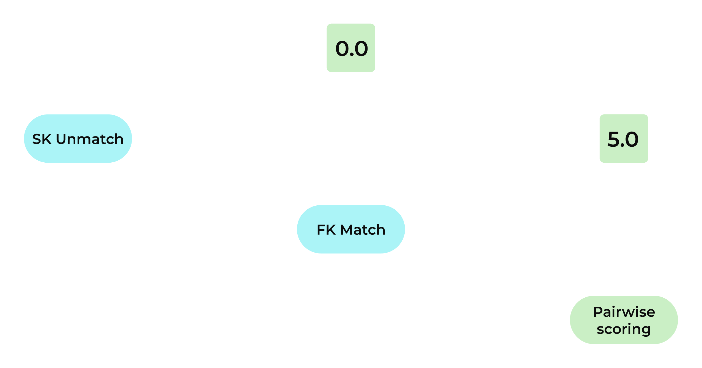

.. https://docs.amperity.com/operator/

.. meta::
    :description lang=en:
        Configure a variety of settings that are available to Stitch. These settings typically do not require changes and you should consult with your Amperity representative before changing them.

.. meta::
    :content class=swiftype name=body data-type=text:
        Configure a variety of settings that are available to Stitch. These settings typically do not require changes and you should consult with your Amperity representative before changing them.

.. meta::
    :content class=swiftype name=title data-type=string:
        Configure Stitch

==================================================
Configure Stitch
==================================================

.. TODO: This section title is required by a tooltip in the Stitch configuration dialog in Amperity. Do not change this title without also taking steps to ensure the link from the dialog is also updated.

.. include:: ../../shared/terms.rst
   :start-after: .. term-stitch-start
   :end-before: .. term-stitch-end

.. configure-stitch-settings-start

Stitch configuration is defined from a list of settings in the **Stitch settings** dialog box, which is available from the **Stitch** page in Amperity. Stitch settings can be accessed by users who are assigned to the **DataGrid Administrator** policy.

The default settings are recommended for most situations.

.. important:: Changes to settings are not required, but may help improve data quality and clustering results. Validate changes in a sandbox before promoting them to your production tenant.

.. configure-stitch-settings-end

.. _configure-stitch-tables:

Stitched tables
==================================================

.. TODO: Do not change this title; may be linked to from a tooltip in the application and also the left-side navigation.

.. TODO: Compare this to reference/stitch_results and sync up. Also image is updated.

.. stitch-run-select-tables-start

Stitch only runs against selected domain tables. A domain table is made available to Stitch by the **Make available to Stitch** configuration setting in the **Feed Editor**.

A domain table that is made available to Stitch *must also be selected* from the list of domain tables on the **Stitched tables** tab in the **Stitch settings** dialog box.

Each selected table is processed and compared for identity resolution, after which Amperity IDs are assigned to each of your unique customers that are discovered across all domain tables that are included in the Stitch run.

.. stitch-run-select-tables-end

**To add tables to the Stitch run**

.. stitch-run-select-tables-steps-start

From the **Stitch** tab, click **Settings**. This opens the **Stitch settings** dialog box. On the **Stitched tables** tab, select each of the tables to include in Stitch results, and then click **Save**.

.. image:: ../../images/mockup-stitch-settings-stitched-tables.png
   :width: 520 px
   :alt: The Stitched tables tab in the Stitch settings dialog box.
   :align: left
   :class: no-scaled-link

After you have selected the list of tables to include in Stitch results, return to the **Stitch** page, and then click **Run**.

.. stitch-run-select-tables-steps-end

.. stitch-run-select-tables-note-start

.. note:: Only tables with the **Make available to Stitch** setting enabled in the **Feed Editor** are available for selection from the **Stitched tables** tab in the **Stitch settings** dialog box.

.. stitch-run-select-tables-note-end

.. _configure-stitch-tables-interactions:

Interaction tables
--------------------------------------------------

.. TODO: If at all possible, edit this down. It's correct, but wordy.

.. configure-stitch-tables-interactions-start

Domain tables that contain interactions, such as customer orders, loyalty profiles, website clicks, and so on, are generally not made available to Stitch.

Use foreign keys to associate unique identifiers in tables that **DO NOT** contain interactions to unique identifiers in tables that **DO** contain customer profile data.

When foreign keys are present in tables that contain interactions that match foreign keys in tables that contain customer profile data an Amperity ID is assigned to each row in the table that contains interactions.

The list of tables that contain interactions and in which rows of data are associated with an Amperity ID is found on the **Stitched tables** tab under **Interaction tables**.

.. configure-stitch-tables-interactions-end

.. _configure-stitch-tables-configuration:

Configuration tables
--------------------------------------------------

.. TODO: "Configuration tables" is the title, but the examples are lists or individual overrides, so are the examples tables or dunno. Paragraph has the wrong format for links, but for now that ensures they work.

.. configure-stitch-tables-configuration-start

Configuration tables affect how Stitch operates. For example, `bad values to be ignored <https://docs.amperity.com/operator/blocklist_bad_values.html>`__, `custom nicknames <https://docs.amperity.com/operator/stitch_nicknames.html>`__, or `specific overrides of Stitch behavior <https://docs.amperity.com/operator/stitch_labels.html>`__.

.. configure-stitch-tables-configuration-end

.. _configure-stitch-rules:

Rules
==================================================

.. configure-stitch-rules-start

Use the **Rules** tab to define a prioritized collection of rules that are used for deterministic identity resolution. Rules are evaluated in order (top-to-bottom), starting from the first rule defined in this tab, until a rule returns true.

An individual rule defines when a set of records should be clustered together or be separated.

.. configure-stitch-rules-end

.. _configure-stitch-rules-cluster:

Cluster records
--------------------------------------------------

.. configure-stitch-rules-cluster-start

Rules can be configured to cluster records together when personally identifiable information (PII) matches or with matching foreign keys.

For example:

.. configure-stitch-rules-cluster-end

.. _configure-stitch-rules-separate:

Separate records
--------------------------------------------------

.. configure-stitch-rules-separate-start

Rules can be configured to separate records together when values differ or when specific types of PII are similar, but do not match.

For example:

.. configure-stitch-rules-separate-end

.. _configure-stitch-rules-order:

Rules can be in any order
--------------------------------------------------

.. configure-stitch-rules-order-start

Rules can be put in any order you want. Click the |fa-drag| icon, and then drag the rule into the desired position. For example:

.. configure-stitch-rules-order-end

.. _configure-stitch-rules-remaining:

Remaining records
--------------------------------------------------

.. TODO: Is this the old clustering algorithm setting? :hierarchical vs. :nil?

.. configure-stitch-rules-remaining-start

For records that do not match any of the prioritized collection of rules there are two options:

#. Recommended. Allow Stitch to evaluate these records, discover connections, and then use those connections to build clusters.

#. Use only the prioritized collection of rules to build clusters. Records that do not match one of the rules will not be included in a cluster.

.. configure-stitch-rules-remaining-end

.. _configure-stitch-rules-code:

Visual vs. Code views
--------------------------------------------------

.. configure-stitch-rules-code-start

Use the **Visual** view to configure a prioritized collection of rules that are used for deterministic identity resolution. Use the **Code** view to configure advanced seettings or to override general settings.

The **Code** view uses Extensible Data Notation (EDN) formatting and is similar to:

::

   {:amperity.stitch.settings/enable-staple? false,
    :amperity.stitch.settings/parallelism 2,
    :amperity.stitch.settings/pre-processing-profiles
    #{:normalize-gender :prioritize-src-gender},
    :amperity.stitch.settings/sk-given-name-version 1,
    :amperity.stitch.settings/soft-trivial-dupe-semantic-exclusions #{},
    :amperity.stitch.settings/soft-trivial-dupe-size-threshold 10,
    :amperity.stitch.settings/staple-semantics #{"fk" "phone"},
    :amperity.stitch.settings/supersized-cluster-min-size 500,
    :amperity.stitch.settings/supersized-partition-max-depth 4}

.. configure-stitch-rules-code-end

.. _configure-stitch-general:

General settings
==================================================

.. TODO: Do not change this title; may be linked to from a tooltip in the application and also the left-side navigation.

.. configure-stitch-general-start

The **General** settings tab contains a series of configuration settings that may be modified based on analysis of the data in your tenant to help improve data quality and clustering results.

.. image:: ../../images/mockup-stitch-settings-general.png
   :width: 520 px
   :alt: The General tab in the Stitch settings dialog box.
   :align: left
   :class: no-scaled-link

General settings are divided into the following categories:

* :ref:`configure-stitch-general-allowed-empty-tables`
* :ref:`configure-stitch-general-performance-history`
* :ref:`configure-stitch-general-stitch-force`
* :ref:`configure-stitch-general-stitch-ignore-jitter`
* :ref:`configure-stitch-general-one-to-one`
* :ref:`configure-stitch-general-stitch-skip-changes`
* :ref:`configure-stitch-general-stitch-skip-scores`
* :ref:`configure-stitch-general-stitch-stable-id`

.. configure-stitch-general-end

.. _configure-stitch-general-allowed-empty-tables:

Allowed empty tables
--------------------------------------------------

.. TODO: Do not change this title; may be linked to from a tooltip in the application and also the left-side navigation.

.. tooltip-stitch-config-allowed-empty-tables-start

Stitch may be configured to allow tables to be empty. For example, some CCPA and GDPR workflows run as part of the Stitch workflow, but do not always contain data, such as when zero customers have made a data subject access request (DSAR) request.

.. tooltip-stitch-config-allowed-empty-tables-end

.. configure-stitch-general-performance-empty-tables-start

To allow empty tables, open the **Stitch** page, and then click **Stitch settings**. In the list of settings, under **Performance**, from the **Allow empty tables** dropdown, select one (or more) tables:

.. image:: ../../images/mockup-stitch-settings-general-allow-empty-tables.png
   :width: 380 px
   :alt: The General tab in the Stitch settings dialog box.
   :align: left
   :class: no-scaled-link

The list of tables will match the list of domain tables that have been defined in the **Sources** page.

.. configure-stitch-general-performance-empty-tables-end

.. _configure-stitch-general-performance-history:

Days of recorded history
--------------------------------------------------

.. TODO: Do not change this title; may be linked to from a tooltip in the application and also the left-side navigation.

.. tooltip-stitch-config-days-of-recorded-history-start

Amperity stores up to 365 days of history for tables that contain all changes to clusters and primary keys between the current and previous Stitch run. Changing this setting will not recreate table histories that have already been dropped.

.. tooltip-stitch-config-days-of-recorded-history-end

.. configure-stitch-general-performance-history-start

You can configure the number of days that are stores for the **Unified Changes PKs** and **Unified Changes Clusters** tables. The default is 365 days.

To update the days of recorded history, open the **Stitch** page, and then click **Stitch settings**. In the list of settings, under **Performance**, update the value of the **Recorded days** field:

.. image:: ../../images/mockup-stitch-settings-general-recorded-days.png
   :width: 380 px
   :alt: The General tab in the Stitch settings dialog box.
   :align: left
   :class: no-scaled-link

.. note:: Changes to this setting will not recreate history that has already been dropped.

.. configure-stitch-general-performance-history-end

.. _configure-stitch-general-stitch-force:

Force Stitch to run
--------------------------------------------------

.. TODO: Do not change this title; may be linked to from a tooltip in the application and also the left-side navigation. Tooltip is paraphrased version of this.

.. configure-stitch-general-stitch-force-start

Stitch will run when domain tables contain updates to data that is used by Stitch for identity resolution. Stitch will not run when updates are not present.

To force Stitch to run, open the **Stitch** page, and then click **Stitch settings**. In the list of settings, under **Stitch processing**, enable the **Force Stitch to run** setting:

.. image:: ../../images/mockup-stitch-settings-general-force-stitch.png
   :width: 380 px
   :alt: The General tab in the Stitch settings dialog box.
   :align: left
   :class: no-scaled-link

.. configure-stitch-general-stitch-force-end

.. configure-stitch-general-stitch-force-note-start

.. note:: When this setting is enabled, the :ref:`one-to-one Stitch setting <configure-stitch-general-one-to-one>` is forced to be disabled.

.. configure-stitch-general-stitch-force-note-end

.. _configure-stitch-general-stitch-ignore-jitter:

Ignore jitter alerts
--------------------------------------------------

.. TODO: Do not change this title; may be linked to from a tooltip in the application and also the left-side navigation.

.. tooltip-stitch-config-jitter-alerts-start

Jitter tracks changes to Amperity IDs across Stitch runs. You may configure Stitch to ignore jitter, such as during the initial configuration phase for your tenant or when running a tenant in training and/or demonstration use cases.

.. tooltip-stitch-config-jitter-alerts-end

.. configure-stitch-general-stitch-ignore-jitter-rates-start

.. note:: The rates at which jitter may occur is when large numbers of customer records are added to or removed from your tenant or when two percent (or greater) of all customer records are assigned an updated Amperity ID.

.. configure-stitch-general-stitch-ignore-jitter-rates-end

.. configure-stitch-general-stitch-ignore-jitter-start

For example, if you are using a tenant for training purposes or if you are loading a very large and complex set of data to an established tenant. In these situations a high jitter rate is common, but not unexpected.

To ignore jitter alerts, open the **Stitch** page, and then click **Stitch settings**. In the list of settings, under **Stitch processing**, enable the **Ignore jitter alerts** setting:

.. image:: ../../images/mockup-stitch-settings-general-ignore-jitter-alerts.png
   :width: 380 px
   :alt: The General tab in the Stitch settings dialog box.
   :align: left
   :class: no-scaled-link

This setting as **false** in your production tenant as often as possible.

.. configure-stitch-general-stitch-ignore-jitter-end

.. _configure-stitch-general-one-to-one:

One-to-one Stitch
--------------------------------------------------

.. TODO: Do not change this title; may be linked to from a tooltip in the application and also the left-side navigation.

.. tooltip-stitch-config-one-to-one-start

You may configure Stitch to assign Amperity IDs to customers that are identified by a unique (and consistent) customer key. (This configuration option is sometimes referred to as "deterministic Stitch". You should not expect your Amperity IDs to be persistent when this mode is enabled.)

.. tooltip-stitch-config-one-to-one-end

.. configure-stitch-general-one-to-one-start

.. important:: If Stitch has already been run in standard mode, and then if one-to-one mode is enabled, there will be 100% jitter. Amperity IDs are not expected to be the same between standard and one-to-one Stitch runs.

Use the following steps to configure your tenant for one-to-one Stitch:

#. Ensure that each table that is made available to Stitch applies the **ck** semantic tag to the field that contains the existing customer ID.

   .. tip:: You may apply the **ck** semantic tag from a feed or from a custom domain table.

#. Apply all other semantic tags -- customer profile, foreign key, primary key, orders and items -- to the correct fields in all of your data sources. These tags will have no effect when running one-to-one Stitch, but are required for customer profiles, transactions, segment insights, and predictive modeling.

#. To configure Amperity for one-to-one Stitch, open the **Stitch** page, and then click **Stitch settings**. In the list of settings, under **Bypass Stitch**, move the slider for the **Run 1:1 Stitch** setting to the right:

   .. image:: ../../images/mockup-stitch-settings-general-run-1-1-stitch.png
      :width: 380 px
      :alt: The General tab in the Stitch settings dialog box.
      :align: left
      :class: no-scaled-link

#. Run Stitch.

   When the run is complete, each unique customer ID will be associated with an Amperity ID.

.. configure-stitch-general-one-to-one-end

**Outcome of one-to-one Stitch**

.. configure-stitch-general-one-to-one-outcome-start

The following table describes the changes you will see in your tenant after it is configured for one-to-one Stitch.

.. list-table::
   :widths: 200 400
   :header-rows: 1

   * - Tab
     - Changes
   * - **Stitch**
     - The overview page will show a 0.0% deduplication rate. The Amperity ID will align to the total source IDs provided by the **ck**.

       The **Data Explorer** disables the tabs for **Cluster Graph** and **Pairwise Comparison**. These tabs are not available when one-to-one Stitch mode is configured.

       .. note:: The Amperity ID that is generated in one-to-one Stitch mode is based on customer keys (and not on stable clusters of customer records).

   * - **Customer 360**
     - The **Unified Scores** table is not generated.

       The following fields are removed from the **Unified Coalesced** table: **component_id**, **is_supersized**, **rep_ds**, **rep_pk**, and **supersized_id**.

       Fields related to the bad-values blocklist are not available, including **has_blv**, **blv_address**, **blv_email**, **blv_given_name**, **blv_phone**, and **blv_surname**.

       All standard tables will contain a **ck** field.

       The Stitch QA database template is not needed.
   * - **Queries**
     - The Stitch QA queries template is not needed.

.. configure-stitch-general-one-to-one-outcome-end

.. _configure-stitch-general-stitch-skip-changes:

Skip unified changes
--------------------------------------------------

.. TODO: Do not change this title; may be linked to from a tooltip in the application and also the left-side navigation.

.. tooltip-stitch-config-skip-changes-start

Unified changes tables contain all of the changes to clusters and primary keys between the current and previous Stitch runs. These tables are resource intensive and may be skipped.

.. tooltip-stitch-config-skip-changes-end

.. configure-stitch-general-stitch-skip-changes-start

The **Unified Changes Clusters** and **Unified Changes PKs** tables may be resource intensive because they contain all of the changes to clusters and primary keys between the current and previous Stitch run.

* .. include:: ../../shared/terms.rst
     :start-after: .. term-unified-changes-clusters-table-start
     :end-before: .. term-unified-changes-clusters-table-end

* .. include:: ../../shared/terms.rst
     :start-after: .. term-unified-changes-pks-table-start
     :end-before: .. term-unified-changes-pks-table-end

The default configuration for Stitch always builds these tables, but you can configure Stitch to skip building scores.

To skip building the unified changes tables, open the **Stitch** page, and then click **Stitch settings**. In the list of settings, under **Stitch processing**, enable the **Skip unified changes output** setting:

.. image:: ../../images/mockup-stitch-settings-general-skip-unified-changes.png
   :width: 380 px
   :alt: The General tab in the Stitch settings dialog box.
   :align: left
   :class: no-scaled-link

.. configure-stitch-general-stitch-skip-changes-end

.. _configure-stitch-general-stitch-skip-scores:

Skip unified scores
--------------------------------------------------

.. TODO: Do not change this title; may be linked to from a tooltip in the application and also the left-side navigation.

.. tooltip-stitch-config-skip-scores-start

The unified scores table contains all of the scoring between record pairs for the previous Stitch run. This table is resource intensive and may be skipped.

.. tooltip-stitch-config-skip-scores-end

.. include:: ../../shared/terms.rst
   :start-after: .. term-unified-scores-table-start
   :end-before: .. term-unified-scores-table-end

.. configure-stitch-general-stitch-skip-scores-start

The **Unified Scores** tables may be resource intensive. The default configuration for Stitch always builds this table, but you can configure Stitch to skip building it.

To skip building unified scores, open the **Stitch** page, and then click **Stitch settings**. In the list of settings, under **Stitch processing**, enable the **Skip unified scores output** setting:

.. image:: ../../images/mockup-stitch-settings-general-skip-unified-scores.png
   :width: 380 px
   :alt: The General tab in the Stitch settings dialog box.
   :align: left
   :class: no-scaled-link

.. configure-stitch-general-stitch-skip-scores-end

.. _configure-stitch-general-stitch-stable-id:

Stable IDs
--------------------------------------------------

.. TODO: Do not change this title; may be linked to from a tooltip in the application and also the left-side navigation.

.. include:: ../../shared/terms.rst
   :start-after: .. term-amperity-id-start
   :end-before: .. term-amperity-id-end

.. TODO: Keep the following in sync with a paragraph from the "stable ID assignment" section in /stitch.html; this is customized to link back to that section, but otherwise should have the same words.

.. configure-stitch-general-stitch-stable-id-explore-start

As new data is input to Amperity, the Stitch process identifies when new or changed data applies to existing clusters of customer records, and then updates those records, maintains the cluster, and `retains a stable Amperity ID assignment <https://docs.amperity.com/stitch.html#stable-id-assignment>`__. A new Amperity ID is only created when new individuals are identified.

.. configure-stitch-general-stitch-stable-id-explore-end

.. configure-stitch-general-stitch-stable-id-start

Stable ID assignment can be a resource-intensive process, in particular when:

#. Adding data sources that contain large numbers of rows (100+ million rows) of customer records.
#. Updating existing data sources with large numbers of rows on a periodic (monthly, quarterly, etc.) basis.
#. Data contains a very large number of duplicate values, such as 400k+ instances of an email address that is associated to a common business process.

.. configure-stitch-general-stitch-stable-id-end

.. configure-stitch-general-stitch-stable-id-links-start

You can configure the stable ID assignment process in the following ways:

#. :ref:`Disable stable IDs <configure-stitch-general-stitch-stable-id-disable>`
#. :ref:`Increase the number of partitions that are available to stable ID assignment <configure-stitch-general-stitch-stable-id-partitions>`
#. :ref:`Stop building the Unified Changes table (temporarily) <configure-stitch-general-stitch-skip-changes>`

.. configure-stitch-general-stitch-stable-id-links-end

.. _configure-stitch-general-stitch-stable-id-disable:

Disable stable IDs
++++++++++++++++++++++++++++++++++++++++++++++++++

.. tooltip-stitch-config-stable-id-start

You may disable stable ID assignment to improve performance during the initial configuration phase for your tenant. Be sure to re-enable stable ID assignment before you start the Stitch QA process.

.. tooltip-stitch-config-stable-id-end

.. configure-stitch-general-stitch-stable-id-disable-start

To disable stable IDs, open the **Stitch** page, and then click **Stitch settings**. In the list of settings, under **Stitch processing**, enable the **Disable stable IDs** setting:

.. image:: ../../images/mockup-stitch-settings-general-disable-stable-ids.png
   :width: 380 px
   :alt: The General tab in the Stitch settings dialog box.
   :align: left
   :class: no-scaled-link

.. important:: Be sure to disable this setting before you start to analyze and validate production-quality Stitch results or when performing any level of Stitch QA.

.. configure-stitch-general-stitch-stable-id-disable-end

.. _configure-stitch-general-stitch-stable-id-partitions:

Increase partitions
++++++++++++++++++++++++++++++++++++++++++++++++++

.. configure-stitch-general-stitch-stable-id-partitions-start

When large differences are present between clusters of records for the current and previous Stitch runs you can increase the number of partitions that are used by Stitch during stable ID assignment. This situation can occur when data sources provide periodic updates, such as monthly, quarterly, etc., that contain a very large number of rows.

By default, stable ID assignment is based on the edges that exist between current and previous clusters of customer records, weighted by the number of shared primary keys. The shared primary keys are sorted in descending order, after which ties are broken by sorting the cluster IDs in ascending order. Edges are removed when higher-ranked edges are associated to identical clusters of customer records. Edges that survive this ranking are then used to map current cluster IDs to previous cluster IDs. Changes to stable ID assignment are captured in the **Unified Changes Clusters** and **Unified Changes PKs** tables.

In some cases, the differences between the current and previous clusters of customer records is very large, requiring access to a large amount of memory to complete the stable ID assignment process. In this type of situation Stitch processes may take a very long time, or even appear to be stuck; in some cases the Stitch job has run out of memory and will need to be rerun. In these situations, do the following:

#. Look for unusual values, such as a large set of identical email address, that appear in the **Unified Coalesced** table. This can sometimes be the cause of slow stable ID assignment. Mitigate the presence of these unusual values, and then run Stitch again.
#. Increase the number of partitions that are available to Stitch during the stable ID assignment process. You can increase the value of **stable-id-partition-count** to a value between 2-10 to improve the performance of Stitch during stable ID assigment.

This setting should be used temporarily, but for some tenants it may need to be left at a non-default value. Changing partitions may only be done using an advanced configuration setting:

.. code-block:: clojure

   :amperity.stitch.settings/stable-id-partition-count 6

.. configure-stitch-general-stitch-stable-id-partitions-end

.. _configure-stitch-bad-values:

Bad values
==================================================

.. TODO: Gotta update the automatic bad value detection section in https://docs.amperity.com/operator/blocklist_bad_values.html along with any references to manual detection.

.. TODO: Update the link below to be an internal doc link.

.. configure-stitch-bad-values-start

Use the **Bad values** tab in the **Stitch settings** dialog to configure values that should be ignored by Stitch during identity resolution.

.. image:: ../../images/mockup-stitch-settings-bad-values.png
   :width: 520 px
   :alt: The Bad values tab in the Stitch settings dialog box.
   :align: left
   :class: no-scaled-link

Values can be configured to be:

* Detected automatically using a threshold and an association between two fields. The value is ignored when the first field exceeds the configured threshold as it relates to the second field.

  For example, "Ignore any email address with more than 8 given names." where **email** is the first field, the threshold is "8", and the second field is **given-name**. When an email address is associated with more than 8 given names, that email address will be added to the bad-values blocklist and ignored by Stitch, after which it will not be used for identity resolution.

  Automatic detection is available for `all fields to which customer profile semantic tags were applied <https://docs.amperity.com/operator/semantics.html#profiles>`__, such as **email**, **phone**, **address**, **given-name** and for fields that contain foreign keys.

* Detected manually. Specific values can be added for email addresses, phone numbers, given names, and surnames.

.. tip:: Review the documentation for managing `bad values <https://docs.amperity.com/operator/blocklist_bad_values.html>`__ for additional options for managing a bad-values blocklist.

.. configure-stitch-bad-values-end

.. _configure-stitch-bad-values-rules:

Rules for automatic detection
--------------------------------------------------

.. configure-stitch-bad-values-rules-start

Automatic detection uses rules that define thresholds above which values are ignored automatically. Rules can be defined to look for values in fields created by customer profile semantic tags (**address**, **birthdate**, **city**, **company**, **email**, **gender**, **generational-suffix**, **given-name**, **phone**, **postal**, **state**, and **surname**), along with foreign keys (**fk-**) and Post Office boxes.

For example:

will automatically ignore an email address that is associated with 8 (or more) distinct values for **given_name**.

.. note:: Default thresholds are set for the following combinations:

   #. Ignore any email address with more than 20 given names.
   #. Ignore any email address with more than 20 surnames.
   #. Ignore any phone number with more than 20 given names.
   #. Ignore any physical address with more than 40 given names.

.. configure-stitch-bad-values-rules-end

.. _configure-stitch-bad-values-ignore:

Values to ignore
--------------------------------------------------

.. configure-stitch-bad-values-ignore-start

Values can be added to the bad-values blocklist manually for email addresses, phone numbers, given names, and surnames. Type the value into the field, and then hit enter to manually add a value to the bad-values blocklist.

.. tip:: If a value needs to be removed from the bad-values blocklist click the "X" icon next to the value.

.. configure-stitch-bad-values-ignore-end

.. _configure-stitch-advanced:

Advanced settings
==================================================

.. TODO: Do not change this title; may be linked to from a tooltip in the application and also the left-side navigation.

.. configure-stitch-advanced-start

Stitch configuration provides a series of advanced settings.

.. image:: ../../images/mockup-stitch-settings-advanced.png
   :width: 520 px
   :alt: Use the Rules tab to configure deterministic identity resolution.
   :align: left
   :class: no-scaled-link

The following settings are available for advanced configuration of Stitch:

* :ref:`configure-stitch-advanced-clustering-blocking`
* :ref:`configure-stitch-advanced-clustering-case-sensitive`
* :ref:`configure-stitch-advanced-bad-values-disable`
* :ref:`configure-stitch-advanced-clustering-matching-strategy`
* :ref:`configure-stitch-advanced-clustering-matching-thresholds`
* :ref:`configure-stitch-advanced-profiles`
* :ref:`configure-stitch-advanced-staple`
* :ref:`configure-stitch-advanced-reports`
* :ref:`configure-stitch-advanced-profile-supersized-clusters`
* :ref:`configure-stitch-advanced-trivial-duplicates`

.. configure-stitch-advanced-end

.. configure-stitch-advanced-configuration-warning-start

.. note:: The editor for Stitch settings uses Extensible Data Notation (EDN) formatting:

   ::

      {:amperity.stitch.settings/enable-staple? false,
       :amperity.stitch.settings/parallelism 2,
       :amperity.stitch.settings/pre-processing-profiles
       #{:normalize-gender :prioritize-src-gender},
       :amperity.stitch.settings/sk-given-name-version 1,
       :amperity.stitch.settings/soft-trivial-dupe-semantic-exclusions #{},
       :amperity.stitch.settings/soft-trivial-dupe-size-threshold 10,
       :amperity.stitch.settings/staple-semantics #{"fk" "phone"},
       :amperity.stitch.settings/supersized-cluster-min-size 500,
       :amperity.stitch.settings/supersized-partition-max-depth 4}

   Advanced configuration settings are described in more detail below. You may also override general configuration settings.

.. configure-stitch-advanced-configuration-warning-end

.. _configure-stitch-advanced-clustering-blocking:

Blocking strategies
--------------------------------------------------

.. TODO: Do not change this title; may be linked to from a tooltip in the application and also the left-side navigation.

.. tooltip-stitch-config-blocking-strategy-start

Blocking is a non-trivial step for record linking. The default blocking strategy provides a reasonable recall rate for most use cases; work with your Amperity representative to identify the best approaches for tuning your tenant's blocking strategy.

.. tooltip-stitch-config-blocking-strategy-end

.. configure-stitch-advanced-clustering-blocking-start

The combination of blocking keys is what creates the ideal recall rate without compromising the performance of Amperity.

* An overly generous blocking strategy may result in a high recall rate (too many pairs being evaluated) along with negative system performance.
* An overly conservative blocking strategy may result in a low recall rate (too few pairs being evaluated).
* Individual blocking keys may be conservative or generous.

.. configure-stitch-advanced-clustering-blocking-end

.. configure-stitch-advanced-clustering-blocking-default-start

To configure the blocking strategies that are used for your tenant, open the **Stitch** page, and then click **Stitch settings**. In the list of settings, under **Cluster quality**, select one (or more) blocking strategies from the **Blocking Strategies** dropdown:

.. image:: ../../images/mockup-stitch-settings-general-blocking-strategy.png
   :width: 380 px
   :alt: The General tab in the Stitch settings dialog box.
   :align: left
   :class: no-scaled-link

The default blocking strategies are: "dnf1", "dnf3", "dnf4", "dnf5", "dnf6", "dnf7", "dnf8", "email", and "fk". Click the "x" next to the name of any selected blocking strategy to remove it.

.. configure-stitch-advanced-clustering-blocking-default-end

.. configure-stitch-advanced-clustering-blocking-note-start

.. note:: The order in which blocking strategies are listed does not matter. For example:

   ::

      :dnf1 :dnf3 :dnf4 :dnf5

   and:

   ::

      :dnf1 :dnf4 :dnf5 :dnf3

   will be processed in the same way and will return the same results.

.. configure-stitch-advanced-clustering-blocking-note-end

.. configure-stitch-advanced-clustering-blocking-list-start

In nearly all cases for all customers, the default blocking strategy should provide a reasonable recall rate. Each individual blocking strategy looks at various combinations of PII data:

.. list-table::
   :widths: 200 400
   :header-rows: 1

   * - Strategy
     - Key
   * - **:address**
     - Non-default. This blocking strategy groups values associated with the full address using the **address** and **address2** semantics.
   * - **:company**
     - Non-default. This blocking strategy groups values associated with the **company** semantic.
   * - **:dnf1**
     - Default. This blocking strategy groups values associated with the following semantics: the first three characters in **given-name**, the first character in **surname**, and **birthdate**.
   * - **:dnf2**
     - Non-default, use carefully. This blocking strategy groups values associated with the following semantics: the full **given-name** and **email**.
   * - **:dnf3**
     - Default. This blocking strategy groups values associated with the following semantics: the first three characters in **given-name**, the first three characters in **surname**, and **postal**.
   * - **:dnf4**
     - Default. This blocking strategy groups values associated with the following semantics: the first three characters in **given-name** and **address**.
   * - **:dnf5**
     - Default. This blocking strategy groups values associated with the following semantics: the first three characters in **given-name** and **phone**.
   * - **:dnf6**
     - Default. This blocking strategy groups values associated with the following semantics: the first three characters in **given-name**, the first three characters in **surname**, and the local part of an email address in **email**.
   * - **:dnf7**
     - Default. This blocking strategy groups values associated with the following semantics: the first three characters in **given-name** and **company**.
   * - **:dnf8**
     - Default. This blocking strategy groups values associated with the following semantics: the first three characters in **given-name**, the first three characters in **surname**, and PO box values that are derived from **address**.
   * - **:dnf9**
     - Non-default. This blocking strategy groups values associated with the following semantics: the first three characters in **surname** and the full **address**.
   * - **:dnf10**
     - Non-default. This blocking strategy groups values associated with the following semantics: the full **phone** and **postal**.
   * - **:email**
     - Default. This blocking strategy groups values associated with the following semantics: the full email address in **email**.
   * - **:fk**
     - Default. This blocking strategy groups values associated with foreign keys.
   * - **:login-partial**
     - Non-default. This blocking strategy groups values associated with cleaned email addresses derived from **email**. This is used for low-threshold email address matching.
   * - **:login-trimmed**
     - Non-default. This blocking strategy groups values associated with the first five characters of an email addresses derived from **email**. This is used for low-threshold email address matching.
   * - **:name**
     - Non-default, use carefully. This blocking strategy groups values associated with the following semantics: **given-name** and **surname**. The order of **given-name** and **surname** is sorted lexicographically. The blocking key for JOHN SMITH and SMITH JOHN is JOHN:SMITH.
   * - **:phone**
     - Default. This blocking strategy groups values associated with the **phone** semantic.

.. configure-stitch-advanced-clustering-blocking-list-end

.. configure-stitch-advanced-clustering-case-sensitive-config-start

Blocking strategies are configured with the following configuration setting:

.. code-block:: clojure

   :amperity.stitch.settings/blocking-strategies
    #{:dnf1 :dnf3 :dnf4 :dnf5 :dnf6 :dnf7 :dnf8 :email :fk},

.. configure-stitch-advanced-clustering-case-sensitive-config-start

.. _configure-stitch-advanced-clustering-case-sensitive:

Case-sensitive foreign keys
--------------------------------------------------

.. TODO: Do not change this title; may be linked to from a tooltip in the application and also the left-side navigation.

.. tooltip-stitch-config-case-sensitive-fk-start

Values associated with foreign keys are case-insensitive by default. You may configure individual foreign keys to be case-sensitive by adding the name of that foreign key to this list.

.. tooltip-stitch-config-case-sensitive-fk-end

.. configure-stitch-advanced-clustering-case-sensitive-start

To specify which foreign keys are case-sensitive, open the **Stitch** page, and then click **Stitch settings**. In the list of settings, under **Cluster quality**, select one (or more) case-sensitive foreign keys from the **Case-sensitive foreign keys** dropdown:

.. image:: ../../images/mockup-stitch-settings-general-case-sensitive.png
   :width: 380 px
   :alt: The General tab in the Stitch settings dialog box.
   :align: left
   :class: no-scaled-link

The list of available case-sensitive foreign keys will match the list of foreign keys that have been defined for any domain table in the **Sources** page.

.. configure-stitch-advanced-clustering-case-sensitive-end

.. configure-stitch-advanced-clustering-case-sensitive-config-start

Case-sensitive foreign keys are configured with the following configuration setting:

.. code-block:: clojure

   :amperity.stitch.settings/case-sensitive-fks #{},

.. configure-stitch-advanced-clustering-case-sensitive-config-start

.. _configure-stitch-advanced-bad-values-disable:

Disable automatic bad value detection
--------------------------------------------------

.. TODO: Verify, but also updates to bad-values blocklist topic.

.. configure-stitch-advanced-bad-values-disable-start

You can disable automatic bad-value blocklists by updating the configuration to add the following setting with empty square brackets:

.. code-block:: clojure

   :amperity.stitch.settings/badvalues-config []

.. configure-stitch-advanced-bad-values-disable-end

.. _configure-stitch-advanced-clustering-matching-strategy:

Matching strategy
--------------------------------------------------

.. TODO: Do not change this title; may be linked to from a tooltip in the application and also the left-side navigation.

.. tooltip-stitch-config-matching-classifier-start

Amperity prioritizes separation key unmatching over foreign key matching. You may configure Amperity to prioritize foreign key matching over separation key unmatching.

.. tooltip-stitch-config-matching-classifier-end

.. configure-stitch-advanced-clustering-matching-strategy-start

The matching strategy classifier tells Stitch how to apply the results of the blocking strategies, including which groups to analyze and the order in which that analysis should take place, when foreign keys and separation keys are present.

The default behavior prioritizes separation keys over foreign keys.

.. warning:: This value should be changed only after careful consideration. If changed, be sure to validate these results carefully to ensure that any changes to pairwise comparison scoring had the desired outcome.

.. configure-stitch-advanced-clustering-matching-strategy-end

.. configure-stitch-advanced-clustering-matching-strategy-config-start

Matching strategy classifiers are configured with the following configuration setting:

.. code-block:: clojure

   :amperity.stitch.settings/classifier :general-ordinal-fk-priority,

.. configure-stitch-advanced-clustering-matching-strategy-config-start

.. _configure-stitch-advanced-clustering-matching-strategy-fk:

Foreign key matching
++++++++++++++++++++++++++++++++++++++++++++++++++

.. configure-stitch-advanced-clustering-matching-strategy-fk-start

When foreign key matching is the priority, Amperity scores record pairs in the following order:

#. Does the record contain identical foreign key values?
#. If true, assign score 5.0. Stop.
#. If false, does the record contain conflicting separation key values?
#. If true, assign score 0.0. Stop.
#. If false, use pairwise comparison scoring.

.. configure-stitch-advanced-clustering-matching-strategy-fk-end

.. figure:: ../../images/classifier-fk-match.png
   :width: 450 px
   :alt: Separation key matching priority.
   :align: left
   :class: light-only, no-scaled-link

.. figure:: ../../images/classifier-fk-match-dark.png
   :width: 450 px
   :alt: Separation key matching priority.
   :align: left
   :class: dark-only, no-scaled-link

.. _configure-stitch-advanced-clustering-matching-strategy-sk:

Separation key unmatching
++++++++++++++++++++++++++++++++++++++++++++++++++

.. include:: ../../shared/terms.rst
   :start-after: .. term-separation-key-start
   :end-before: .. term-separation-key-end

.. configure-stitch-advanced-clustering-matching-strategy-sk-option-start

By default, Amperity derives separation keys for sk-given-name and sk-generational-suffix. You may configure Amperity to prioritize separation keys over foreign keys.

.. configure-stitch-advanced-clustering-matching-strategy-sk-option-end

.. configure-stitch-advanced-clustering-matching-strategy-sk-start

When separation key unmatching is the priority, Amperity scores record pairs in the following order:

#. Does the record contain conflicting separation key values?
#. If true, assign score 0.0. Stop.
#. If false, does the record contain identical foreign key values?
#. If true, assign score 5.0. Stop.
#. If false, use pairwise comparison scoring.

.. configure-stitch-advanced-clustering-matching-strategy-sk-end

.. figure:: ../../images/classifier-sk-unmatch.png
   :width: 450 px
   :alt: Separation key matching priority.
   :align: left
   :class: light-only, no-scaled-link

.. _configure-stitch-advanced-clustering-matching-thresholds:

Matching thresholds
--------------------------------------------------

.. TODO: Do not change this title; may be linked to from a tooltip in the application and also the left-side navigation.

.. tooltip-stitch-config-matching-thresholds-start

Matching record pairs are included when they score better than this value. A lower value leads to more matches and weaker pairs; a higher value leads to fewer matches and more precise pairs. Five values may be chosen: 1.0 (weak), 2.0 (moderate), 3.0 (high, default and recommended value), 4.0 (excellent), and 5.0 (exact).

.. tooltip-stitch-config-matching-thresholds-end

.. configure-stitch-advanced-clustering-matching-thresholds-start

Based on the precision and recall rate that was observed in the initial Stitch results, the matching threshold can be tuned to achieve better results by updating the weakest match category to can be included in Stitch results.

In general, a lower threshold will lead to more matches and fuzzier matched pairs, whereas a higher threshold will lead to fewer matches and more precise matched pairs. For the default ordinal classifier, five different thresholds can be chosen, and they are defined as follows:

.. list-table::
   :widths: 200 200
   :header-rows: 1

   * - Threshold
     - Weakest Match
   * - 1.0
     - Weak
   * - 2.0
     - Moderate
   * - 3.0 
     - High
   * - 4.0
     - Excellent
   * - 5.0
     - Exact

For each threshold, all the matches that are equal to or stronger than the weakest matching type will be clustered together.

.. tip:: When the threshold is set to "High", any matching pair that belongs to the High, Excellent, and Exact match types will be stitched into a single cluster, assuming all of those pairs pass successfully through the blocking phase.

.. configure-stitch-advanced-clustering-matching-thresholds-end

.. configure-stitch-advanced-clustering-matching-thresholds-start

Matching thresholds are configured with the following configuration setting:

.. code-block:: clojure

   :amperity.stitch.settings/threshold 3

.. configure-stitch-advanced-clustering-matching-thresholds-end

.. _configure-stitch-advanced-profiles:

Pre-processing profiles
--------------------------------------------------

.. TODO: Do not change this title; may be linked to from a tooltip in the application and also the left-side navigation.

.. configure-stitch-advanced-profiles-start

Stitch can be configured to use non-default preprocessing profiles for the following use cases:

#. Australian phone numbers
#. Business email addresses
#. Clean foreign keys
#. Multiple preprocessing profiles
#. Normalize gender

.. important:: Use a non-default preprocessing profile in specific situations only.

The advanced configuration setting for preprocessing profiles is:

.. code-block:: clojure

   :amperity.stitch.settings/pre-processing-profiles #{ default }

.. configure-stitch-advanced-profiles-end

.. _configure-stitch-advanced-profile-australian-phone:

Australian phone numbers
++++++++++++++++++++++++++++++++++++++++++++++++++

.. TODO: Do not change this title; may be linked to from a tooltip in the application and also the left-side navigation.

.. configure-stitch-advanced-profile-australian-phone-start

To use Australian phone numbers, use:

.. code-block:: clojure

   :amperity.stitch.settings/pre-processing-profiles #{ :australian-customer }

.. configure-stitch-advanced-profile-australian-phone-end

.. _configure-stitch-advanced-profile-business-email:

Business email addresses
++++++++++++++++++++++++++++++++++++++++++++++++++

.. TODO: Do not change this title; may be linked to from a tooltip in the application and also the left-side navigation.

.. configure-stitch-advanced-profile-business-email-start

To allow business email addresses, use:

.. code-block:: clojure

   :amperity.stitch.settings/pre-processing-profiles #{ :allow-business-email }

.. configure-stitch-advanced-profile-business-email-end

.. _configure-stitch-advanced-profile-clean-foreign-keys:

Clean foreign keys
++++++++++++++++++++++++++++++++++++++++++++++++++

.. TODO: Do not change this title; may be linked to from a tooltip in the application and also the left-side navigation.

.. configure-stitch-advanced-profile-clean-foreign-keys-start

To clean foreign keys (trim whitespace and update them to uppercase), use:

.. code-block:: clojure

   :amperity.stitch.settings/pre-processing-profiles #{ :clean-fk }

.. configure-stitch-advanced-profile-clean-foreign-keys-end

.. _configure-stitch-advanced-profile-multiple-profiles:

Multiple preprocessing profiles
++++++++++++++++++++++++++++++++++++++++++++++++++

.. TODO: Do not change this title; may be linked to from a tooltip in the application and also the left-side navigation.

.. configure-stitch-advanced-profile-multiple-profiles-start

To apply more than one preprocessing profile, use:

.. code-block:: clojure

   :amperity.stitch.settings/pre-processing-profiles #{ :allow-business-email :clean-fk }

.. configure-stitch-advanced-profile-multiple-profiles-end

.. _configure-stitch-advanced-profile-email:

Email addresses
++++++++++++++++++++++++++++++++++++++++++++++++++

.. TODO: Do not change this title; may be linked to from a tooltip in the application and also the left-side navigation.

.. configure-stitch-advanced-profile-email-start

Many email addresses are not useful for identity resolution. Some of them are generic, such as *info@some-domain.com*, and are often associated with a place of business and are never associated with a unique individual. Other email addresses are bogus, having been entered as a requirement for providing a genuine email address, but are otherwise fake, such as *123@some-domain.com*.

.. configure-stitch-advanced-profile-email-end

.. configure-stitch-advanced-profile-email-address-patterns-start

The following values associated with the **email** semantic are ignored by Stitch when performing identity resolution:

* **@NOEMAIL.COM**
* **@NOMAIL.COM**
* 0000000000
* **123@**
* **1234@**
* **99@**
* **ABC@**
* **ABC123@**
* ADMIN@
* BOOKING@
* CLIENT@
* CLIENTS@
* CONFIRMATION@
* CONFIRMATIONS@
* CONTACT@
* CUSTOMERSERVICE
* CUSTOMERSERVICE@
* CUSTOMERSERVICES
* CUSTOMERSERVICES@
* **DECLINE@**
* **DECLINED@**
* **DENIED@**
* EMAIL@
* @EMAIL.TST
* EXAMPLE@
* **FAKENAME@**
* GUEST@
* GUESTS@
* HELP@
* HELPS@
* HOTELHELP@
* HOTELPARTNER@
* HOTELPARTNERS@
* INFO@
* **JUNK@**
* MAIL@
* ME@
* N@A
* NAME@
* **NO@**
* **NOEMAIL@**
* **NOMAIL@**
* **NONE@**
* **NONENONE@**
* **NOREPLY@**
* **NOTHANKS@**
* **NOTHANKYOU@**
* ONLINERESERVATION
* ONLINERESERVATION@
* ONLINERESERVATIONS
* ONLINERESERVATIONS@
* OPERATION@
* OPERATIONS@
* QUERIES@
* QUERY@
* **REFUSED@**
* RES@
* RESERVAS
* RESERVATION@
* RESERVATIONS@
* ROOMRESERVATION@
* ROOMRESERVATIONS@
* SAMPLE@
* SAMPLES@
* SERVICE@
* SHOP@
* TEST@
* TESTING@
* TESTEMAIL@
* TRAVEL@
* TRAVELS
* VENDOR@
* VENDORS@
* **XXX@**

The values in **bold** are always ignored.

.. configure-stitch-advanced-profile-email-address-patterns-end

.. configure-stitch-advanced-profile-email-update-start

Stitch may be configured to allow certain generic email addresses to be available to Stitch as part of identity resolution when the **pre-processing-profile** configuration setting is set to:

.. code-block:: clojure

   pre-processing-profile :allow-business-email

When this setting is updated, only the following email address patterns are ignored by Stitch:

* @NOEMAIL.COM
* @NOMAIL.COM
* 123@
* 1234@
* 99@
* ABC@
* ABC123@
* DECLINE@
* DECLINED@
* DENIED@
* FAKENAME@
* JUNK@
* NO@
* NOEMAIL@
* NOMAIL@
* NONE@
* NONENONE@
* NOREPLY@
* NOTHANKS@
* NOTHANKYOU@
* REFUSED@
* XXX@

Use a bad-values blocklist to configure Amperity to continue ignoring any of the email address patterns that were removed from the default list of ignored email patterns.

.. TODO: Re-link to the bad-values blocklist page.

.. configure-stitch-advanced-profile-email-update-end

.. _configure-stitch-advanced-profile-normalize-gender:

Normalize gender
++++++++++++++++++++++++++++++++++++++++++++++++++

.. TODO: Do not change this title; may be linked to from a tooltip in the application and also the left-side navigation.

.. configure-stitch-advanced-profile-normalize-gender-start

To configure gender processing preferences, use:

.. code-block:: clojure

   :amperity.stitch.settings/pre-processing-profiles #{ :normalize-gender }
   :amperity.stitch.settings/pre-processing-profiles #{ :skip-derive-gender }
   :amperity.stitch.settings/pre-processing-profiles #{ :prioritize-src-gender }

or:

.. code-block:: clojure

   :amperity.stitch.settings/pre-processing-profiles #{ :normalize-gender }
   :amperity.stitch.settings/pre-processing-profiles #{ :skip-derive-gender }
   :amperity.stitch.settings/pre-processing-profiles #{ :prioritize-derived-gender }

.. configure-stitch-advanced-profile-normalize-gender-end

.. _configure-stitch-advanced-staple:

Staple
--------------------------------------------------

.. configure-stitch-advanced-staple-start

Staple is a feature of Stitch designed to improve recall over sparse interaction data by lowering the threshold for matching certain fields if they only appear in one cluster.

Use the **Advanced** tab to disable staple. Set the following setting to "False"

::

   :amperity.stitch.settings/enable-staple? True

Configure the semantics for which thresholds are lowered using the **staple-semantics** setting. **fk** and **phone** are the default values:

::

   :amperity.stitch.settings/staple-semantics #{"fk" "phone"}

.. configure-stitch-advanced-staple-end

.. _configure-stitch-advanced-reports:

Stitch reports
--------------------------------------------------

.. TODO: Do not change this title; may be linked to from a tooltip in the application and also the left-side navigation.

.. configure-stitch-advanced-reports-start

A Stitch report shows cluster graphs for individuals associated with the Amperity ID. You can configure the Stitch report to include or exclude specific Amperity IDs. Ensuring that certain Amperity IDs are included (or excluded) can help improve the quality of the Stitch report. The Amperity IDs that are included will appear first in the series of individuals shown when exploring Amperity IDs.

Stitch may be configured to include or exclude specific Amperity IDs in the Stitch report.

* Use **:amperity.stitch-report.example/exclude** to define a list of Amperity IDs to be excluded from the report.
* Use **:amperity.stitch-report.example/include** to define a list of Amperity IDs to be included in the report.

.. TODO: Make this an actual task.

These settings are available from the **Stitch** page. Click **Configure**, add the list of Amperity IDs to be included or excluded under **Stitch report configuration**, and then run Stitch.

For example:

.. code-block:: clojure

   {
     :amperity.stitch-report.example/exclude
       [
       "123a456b-439c-145d-345e-123kmc901nju"
       "124a432b-743c-012d-432e-678fgh901cef"
       "125a456b-649c-032d-373e-678afd901ijk"
       "234a456b-459c-532d-346e-345lkd901dcr"
       ...
     ],
    :amperity.stitch-report.example/include
     [
       "723a456b-789c-012d-345e-321fee901lpo"
       "432a456b-789c-567d-876e-678fgh901asd"
       "567a456b-789c-543d-365e-543fda901hcg"
       "987a456b-789c-234d-645e-345plo901ikm"
       ...
     ],
   }

.. configure-stitch-advanced-reports-end

.. _configure-stitch-advanced-profile-supersized-clusters:

Graph partitions
--------------------------------------------------

.. TODO: Do not change this title; may be linked to from a tooltip in the application and also the left-side navigation.

.. include:: ../../amperity_help/source/stitch_config_cluster_size.rst
   :start-after: .. tooltip-stitch-config-graph-partitions-start
   :end-before: .. tooltip-stitch-config-graph-partitions-end

.. configure-stitch-advanced-profile-supersized-clusters-example-start

A supersized cluster typically results from transitive connections spanning what should be unrelated records. For example, individuals named Mary Johnson and Jeffrey Johnson with the following records:

#. Mary Johnson, maryjohnson @gmail.com, 50 1st Avenue, New York, NY, with 50 connected records.
#. Jeffrey Johnson, jeffjohnson @gmail.com, 50 1st Avenue, New York, NY, with 25 connected records.
#. Mary Johnson, mjohnson50 @gmail.com, 50 1st Avenue, New York, NY, with 17 connected records.
#. Jeffrey Johnson, mjohnson50 @gmail.com, 50 1st Avenue, New York, NY, with 8 connected records.

These records are grouped together in the following ways:
   
* Records 1 and 3 block together on name and address.
* Records 2 and 4 block together on name and address.
* Records 3 and 4 block together on email.

All four groups of records transitively connect into a single connected cluster with a size of 100.

.. configure-stitch-advanced-profile-supersized-clusters-example-end

.. configure-stitch-advanced-profile-supersized-clusters-config-start

Amperity defines a supersized cluster as any cluster with 500 (or more) connections. Stitch will partition supersized clusters into separate graph partitions. To change this threshold to a higher or lower value, update the following advanced configuration setting:

.. code-block:: clojure

   :amperity.stitch.settings/supersized-cluster-min-size 64

.. configure-stitch-advanced-profile-supersized-clusters-config-end

.. _configure-stitch-advanced-trivial-duplicates:

Trivial duplicates
--------------------------------------------------

.. TODO: Do not change this title; may be linked to from a tooltip in the application and also the left-side navigation.

.. term-trivial-duplicate-start

A trivial duplicate is a set of nearly-identical records that share enough matching PII to clearly identify a single unique individual. Trivial duplicates are identified by Stitch early in the identity resolution process. Only one of these records is passed downstream for additional Stitch processing; the other records---the trivial duplicates---are not.

.. term-trivial-duplicate-end

.. configure-stitch-advanced-trivial-duplicates-example-start

The following table represents a set of records that contain enough matching PII to associate all of these records to a single unique individual:

.. code-block:: mysql

   ------- ----------- ---------- ----------------- ------ ------------------------
    pk      FirstName   LastName   Address           ...    Email
   ------- ----------- ---------- ----------------- ------ ------------------------
    r-1     Justin      Currie     123 West Elm St   ...    ack192390190@gmail.com
    r-4     Justin      Currie     123 West Elm St   ...    vnbb1109fe12@gmail.com
    r-7     Justin      Currie     123 West Elm St   ...    ack192390190@gmail.com
    r-12    Justin      Currie     123 West Elm St   ...    ack192390190@gmail.com
    r-78    Justin      Currie     123 West Elm St   ...    doi210898r09@appco.com
    r-87    Justin      Currie     123 West Elm St   ...    vnbb1109fe12@gmail.com
    r-204   Justin      Currie     123 West Elm St   ...    vnbb1109fe12@gmail.com
    r-377   Justin      Currie     123 West Elm St   ...    vnbb1109fe12@gmail.com
    r-589   Justin      Currie     123 West Elm St   ...    ffjo19290190@gmail.com
    r-829   Justin      Currie     123 West Elm St   ...    vnbb11095412@gmail.com
    r-911   Justin      Currie     123 West Elm St   ...    ack192390190@gmail.com
   ------- ----------- ---------- ----------------- ------ ------------------------

However, not all of the PII is identical. The email addresses do not match across all of the records. The trivial duplication process will collapse the identical records down, leaving the following set of records:

.. code-block:: mysql

   ------- ----------- ---------- ----------------- ------ ------------------------
    pk      FirstName   LastName   Address           ...    Email
   ------- ----------- ---------- ----------------- ------ ------------------------
    r-1     Justin      Currie     123 West Elm St   ...    ack192390190@gmail.com
    r-78    Justin      Currie     123 West Elm St   ...    doi210898r09@appco.com
    r-589   Justin      Currie     123 West Elm St   ...    ffjo19290190@gmail.com
    r-829   Justin      Currie     123 West Elm St   ...    vnbb11095412@gmail.com
   ------- ----------- ---------- ----------------- ------ ------------------------

The complete set of records (including trivial duplicates) will be available in the **Unified Coalesced** table. The collapsed records will be available in the **Unified Preprocessed Raw** table.

.. configure-stitch-advanced-trivial-duplicates-example-end

.. term-trivial-duplicate-qualified-start

A qualified trivial duplicate is a set of records with enough matching PII to score 3.0 (or greater) and were grouped together.

.. term-trivial-duplicate-qualified-end

.. configure-stitch-advanced-trivial-duplicates-qualified-start

Qualified trivial duplicates are treated as a single record by downstream Stitch processes and are truncated from the **Unified Preprocessed Raw** table.

.. configure-stitch-advanced-trivial-duplicates-qualified-end

.. configure-stitch-advanced-trivial-duplicates-admonition-start

.. admonition:: What are the rep_ds and rep_pk columns?

   Use the **rep_pk** and **rep_ds** columns in the **Unified Coalesced** table to help with situations where it's necessary to understand why two records were not clustered together.

   .. include:: ../../shared/terms.rst
      :start-after: .. term-rep-pk-start
      :end-before: .. term-rep-pk-end

   .. include:: ../../shared/terms.rst
      :start-after: .. term-rep-ds-start
      :end-before: .. term-rep-ds-end

   The combination of **rep_ds** and **rep_pk** represent qualified trivial duplicates that were discovered by Stitch early in the identity resolution process.

.. configure-stitch-advanced-trivial-duplicates-admonition-end

.. configure-stitch-advanced-trivial-duplicates-config-start

The advanced configuration setting for trivial duplicates is:

.. code-block:: clojure

   :amperity.stitch.settings/soft-trivial-dupe-size-threshold 10

An increase to this value will decrease the likelihood that multiple records with trivial differences are collapsable into a single record for the identity resolution process. This setting should only be tuned after understanding the quality of downstream data, including stitched records.

.. configure-stitch-advanced-trivial-duplicates-config-end

.. _configure-stitch-advanced-trivial-duplicates-exclusions:

Semantic exclusions
++++++++++++++++++++++++++++++++++++++++++++++++++

.. configure-stitch-advanced-trivial-duplicates-exclusions-start

Semantic exclusions for trivial duplicates may be specified. When excluded, for the purpose of identifying clusters of records, the values associated with that semantic will be ignored. This should only be done for limited scenarios where certain types of data are known to be of lower quality.

To define an exclusion, add the following advanced configuration setting for Stitch:

.. code-block:: clojure

   :amperity.stitch.settings/soft-trivial-dupe-semantic-exclusions #{"semantic_name"}

where **semantic_name** is a the name of a semantic, such as **email**. (This value is **nil** by default.)

.. configure-stitch-advanced-profile-trivial-duplicates-exclusions-end

.. configure-stitch-advanced-profile-trivial-duplicates-example-start

The following table represents a set of records that contain enough PII that should identify a single unique individual:

.. code-block:: mysql

   ------- ----------- ---------- ----------------- ------ ------------------------
    pk      FirstName   LastName   Address           ...    Email
   ------- ----------- ---------- ----------------- ------ ------------------------
    r-1     Justin      Currie     123 West Elm St   ...    ack192390190@gmail.com
    r-4     Justin      Currie     123 West Elm St   ...    vnbb1109fe12@gmail.com
    r-7     Justin      Currie     123 West Elm St   ...    vnbb11ss0912@gmail.com
    r-12    Justin      Currie     123 West Elm St   ...    fio190912380@cgg.com
    r-78    Justin      Currie     123 West Elm St   ...    doi210898r09@appco.com
    r-87    Justin      Currie     123 West Elm St   ...    vnbb41090912@gmail.com
    r-204   Justin      Currie     123 West Elm St   ...    vnbb11090912@gmail.com
    r-377   Justin      Currie     123 West Elm St   ...    vnbb12290912@gmail.com
    r-589   Justin      Currie     123 West Elm St   ...    dfjo19290190@gmail.com
    r-829   Justin      Currie     123 West Elm St   ...    vnbb11095412@gmail.com
    r-911   Justin      Currie     123 West Elm St   ...    vnbb11450912@gmail.com
   ------- ----------- ---------- ----------------- ------ ------------------------

All of the information is identical, except for variations in email addresses that causes each of them to be unique. Because the email addresses are not identical, Amperity will not collapse them into a single record for identity resolution purposes even when it is obvious that all of these records are the same individual.

The maximum allowed number of records with trivial duplicates is set to "10" by default. When the number of records with trivial duplicates is greater than this value, each individual record will be treated as a single record. Since the previous example shows eleven records for Justin Currie, each with a unique value for the email column, eleven individual records would be created.

Semantic exclusions define a threshold over which records like these will be collapsed into a trivial duplicate. For example, let's say you have defined a semantic exclusion for **email** and left the size threshold at "10".

For each unique combination of PII--excluding email addresses!--the distinct email addresses that are associated with that unique combination of PII are compared. If there are more than 10 distinct email addresses, those records are collapsed into a trivial duplicate.

.. configure-stitch-advanced-trivial-duplicates-example-end

.. configure-stitch-advanced-trivial-duplicates-warning-start

.. warning:: Semantic exclusions should be applied very carefully. Use a sandbox to configure and apply a semantic exclusion, and then carefully review and validate that all downstream processes are not adversely affected by the change prior to applying a semantic change to a production environment.

.. configure-stitch-advanced-trivial-duplicates-warning-end

.. _configure-stitch-advanced-trivial-duplicates-example:

Example: email addresses
++++++++++++++++++++++++++++++++++++++++++++++++++

.. configure-stitch-advanced-profile-trivial-duplicates-example-start

A long-running promotion for a free food item results in a large number of email addresses associated with the same first name, last name, and phone number. This results in a large number of nearly-identical records, each with a unique email address. You can use semantic exclusions to define a threshold over which records like this are collapsed into a trivial duplicate.

Configure Stitch to define a semantic exclusion for email addresses:

::

   :amperity.stitch.settings/soft-trivial-dupe-semantic-exclusions #{"email"}

and then define the threshold:

::

   :amperity.stitch.settings/soft-trivial-dupe-size-threshold 25

For each unique combination of PII--excluding email addresses!--the distinct email addresses that are associated with that unique combination of PII are compared. If there are more than 25 distinct email addresses, those records are collapsed into a trivial duplicate.

.. configure-stitch-advanced-trivial-duplicates-example-end
