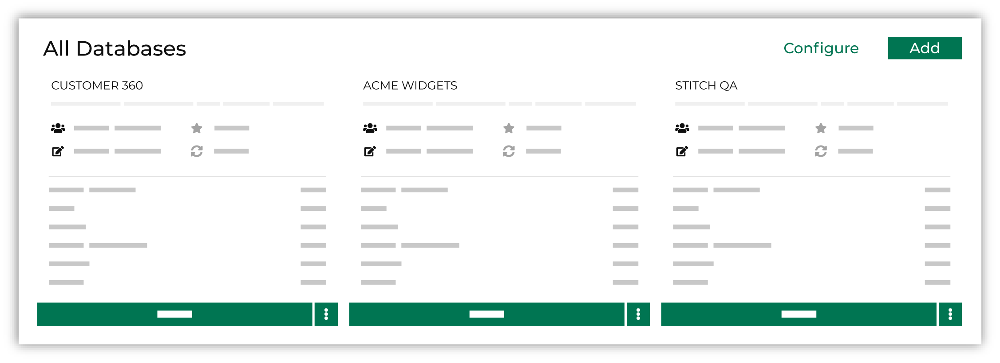

.. https://docs.amperity.com/operator/

.. meta::
    :description lang=en:
        Build and maintain databases in Amperity.

.. meta::
    :content class=swiftype name=body data-type=text:
        Build and maintain databases in Amperity.

.. meta::
    :content class=swiftype name=title data-type=string:
        About databases

==================================================
About the Customer 360 database
==================================================

.. databases-start

The **Customer 360** page allows databases to be created from any combination of stitched output, passed-through domain tables, and custom domain tables. At least one database must be designated as your "Customer 360" database, but there is no limit to the number of databases you may configure for use with any downstream workflow. For example:

* Use a passthrough database to separate raw source data from stitched customer data.
* Use a QA database to build tables for use with validating Stitch quality and for ensuring that interactions records are measured correctly.
* Use a custom database for experimentation.

.. databases-end

.. databases-prerequisites-start

.. important:: Complete the processes for :doc:`adding customer profiles <add_customer_data>` and :doc:`adding transactions <add_transactions>` to Amperity before creating the customer 360 database.

.. databases-prerequisites-start

.. _databases-spark-sql:

About Spark SQL
==================================================

.. include:: ../../shared/terms.rst
   :start-after: .. term-spark-sql-start
   :end-before: .. term-spark-sql-end

.. databases-spark-sql-start

Use |sql_spark| to build database tables.

.. databases-spark-sql-end

.. _databases-table-types:

About table types
==================================================

.. databases-table-types-start

Tables are organized into the following categories:

* :ref:`databases-table-type-standard`
* :ref:`databases-table-type-source-and-custom`
* :ref:`databases-table-type-qa`

.. databases-table-types-end

.. _databases-table-type-standard:

Standard tables
--------------------------------------------------

.. include:: ../../shared/terms.rst
   :start-after: .. term-standard-database-table-start
   :end-before: .. term-standard-database-table-end

.. include:: ../../shared/terms.rst
   :start-after: .. term-standard-database-table-list-start
   :end-before: .. term-standard-database-table-list-end

.. _databases-table-type-source-and-custom:

Source and custom tables
--------------------------------------------------

.. databases-table-type-source-and-custom-start

Source and custom tables make raw source data and custom domain tables available to your customer 360 database as a series of passthrough tables. Source and custom tables vary from tenant to tenant, but typically represent data that can provide useful context to your customer profile data and to support a variety of upstream and downstream workflows, such as:

* Behavioral data
* Clickstream data
* Marketing campaign response data
* Display advertising performance data
* Passthrough tables that contain original customer data

Any domain table or custom domain table can be configured as a passthrough table for any database.

.. databases-table-type-source-and-custom-end

.. _databases-table-type-qa:

QA tables
--------------------------------------------------

.. include:: ../../shared/terms.rst
   :start-after: .. term-qa-database-table-start
   :end-before: .. term-qa-database-table-end

.. include:: ../../shared/terms.rst
   :start-after: .. term-qa-database-table-list-start
   :end-before: .. term-qa-database-table-list-end

.. _databases-customer-profile:

Define customer profile
==================================================

.. databases-customer-profile-start

Customer profile details are pulled from the **Customer 360** table, which represents all of your unified customer profiles, including:

* Names, including first and last names, email addresses, physical addresses, phone numbers
* Transaction details, including first purchases, last purchases, and total purchases
* Other custom profile values that are unique to your company

You can choose to summarize these customer profile details directly on the **Customer 360** page.

.. image:: ../../images/mockup-customer360-tab-customer-profile.png
   :width: 600 px
   :alt: Customer 360 page, customer profile
   :align: left
   :class: no-scaled-link

Customer profile details are displayed in the following order:

#. Fields with an associated icon
#. Fields marked as a favorite
#. Fields without an associated icon or not marked as a favorite

.. note:: Profile details that appear in the **Customer Profile** section are selected during the **Configure and Save** step when configuring the **Customer 360** table.

.. databases-customer-profile-end

.. _databases-manage:

Manage databases
==================================================

.. databases-manage-start

The **Customer 360** page may define any number of individual databases, in addition to your customer 360 database. For example, it is common to add a dedicated database from which you can manage the Stitch QA process.

The **All Databases** section of the **Customer 360** page lists all of the databases that are available, including both active and inactive databases.

.. note:: Only databases in an **Active** state may be run.

.. databases-manage-end

.. _databases-manage-add-empty:

Add empty database
--------------------------------------------------

.. databases-manage-add-empty-start

An empty database contains no tables. Use any combination of :ref:`passthrough <databases-tables-add-passthrough>`, :ref:`SQL <databases-tables-add-sql>`, or :ref:`SQL template <databases-tables-add-sql>` tables to build a custom database.

.. databases-manage-add-empty-end

**To add an empty database**

.. databases-manage-add-empty-steps-start

#. From the **Customer 360** page click **Create Database**.
#. Enter the name of the database.
#. Click **Create**.

.. databases-manage-add-empty-steps-end

.. _databases-manage-add-from-template:

Add database from template
--------------------------------------------------

.. databases-manage-add-from-template-start

Use the :ref:`Customer 360 <databases-manage-add-from-template-c360>`, :ref:`Passthrough <databases-manage-add-from-template-passthrough>`, or :ref:`Stitch QA <databases-manage-add-from-template-stitch-qa>` database templates to add a database that contains the set of tables for use with that type of database.

.. databases-manage-add-from-template-end

**To add a database from a template**

.. databases-manage-add-from-template-steps-start

#. From the **Customer 360** page click **Create Database**.
#. Enter the name of the database.
#. From the **Template** dropdown, select "Customer 360", "Passthrough", or "Stitch QA".
#. Click **Create**.

.. databases-manage-add-from-template-steps-end

.. _databases-manage-add-from-template-c360:

Customer 360 template
++++++++++++++++++++++++++++++++++++++++++++++++++

.. databases-manage-add-from-template-c360-start

The "Customer 360" template adds tables based on the types of records that are available to Stitch. It is recommended to use this template *after* at least one data source for customer records *and* interactions records have been configured in the **Sources** page.

.. databases-manage-add-from-template-c360-end

.. databases-manage-add-from-template-c360-customer-records-start

The following tables are added by the "Customer 360" template when profile semantic tags are applied to customer records:

* **Customer 360**
* **Merged Customers**
* **Unified Coalesced**
* **Unified Customer**
* **Unified Scores**

.. databases-manage-add-from-template-c360-customer-records-end

.. databases-manage-add-from-template-c360-interaction-records-start

The following tables are added by the "Customer 360" template when transaction and itemized transaction semantic tags are applied to interactions records:

* **Customer Attributes**
* **Transaction Attributes Extended**
* **Unified Itemized Transactions**
* **Unified Transactions**

These tables link brand interactions to customer profiles and are a specific requirement for segments and campaigns.

.. databases-manage-add-from-template-c360-interaction-records-end

.. databases-manage-add-from-template-c360-customer-manual-start

If the "Customer 360" template is used to create the customer 360 database before interactions records are also available, you must add those tables to the customer 360 database manually.

.. databases-manage-add-from-template-c360-customer-manual-end

.. _databases-manage-add-from-template-passthrough:

Passthrough template
++++++++++++++++++++++++++++++++++++++++++++++++++

.. databases-manage-add-from-template-passthrough-start

A database that is created using the passthrough template adds a table for each domain table or custom domain table that can be passed through to the database.

.. databases-manage-add-from-template-passthrough-end

.. _databases-manage-add-from-template-stitch-qa:

Stitch QA template
++++++++++++++++++++++++++++++++++++++++++++++++++

.. databases-manage-add-from-template-stitch-qa-start

The following tables are added by the "Customer 360" template when profile semantic tags are applied to customer records:

* **Detailed Examples**
* **Unified Changes Clusters**
* **Unified Changes PKS**
* **Unified Coalesced**
* **Unified Preprocessed Raw**
* **Unified Scores**

Use this database to :doc:`validate the quality of Stitch output <qa_stitch>`.

.. databases-manage-add-from-template-stitch-qa-end

.. _databases-multiple:

Use multiple databases
--------------------------------------------------

.. databases-multiple-start

You may configure more than one database to be a customer 360 database. Each customer 360 database contains a set of standard tables, and then may have an optional set of source and custom tables added as passthrough tables.

.. databases-multiple-end

.. image:: ../../images/use-cases-c360-multiple-alt.png
   :width: 600 px
   :alt: Customer 360 tab, multiple databases, alternate
   :align: left
   :class: no-scaled-link

.. _databases-flexible-merge-rules:

Apply flexible merge rules
--------------------------------------------------

.. databases-flexible-merge-rules-start

Amperity allows multiple databases to exist within the same tenant. Each database may define its own unique set of rules for merging customer profile data. These merge rules are configured using Spark SQL and each field within the merge rules can be customized.

For example, a tenant may have data sources from call centers, online transactions, and email platforms that may contain slightly different sets of customer profile data:

.. image:: ../../images/use-cases-c360-flexible-merge-rules.png
   :width: 600 px
   :alt: Use flexible merge rules to support many customer 360 databases.
   :align: left
   :class: no-scaled-link

After loading this data to Amperity and assigning the Amperity ID to each of your customers, you can use flexible merge rules to support multiple customer 360 databases.

* Your operations teams can combine prioritizing the most common values for each customer with deterministic matching
* Your email marketing team can combine prioritizing customer profile values from your email platform with probabilistic matching
* Your paid media team can combine all possible values to improve match rates on platforms like Google Ads and Facebook

.. tip:: Ask your Amperity implementation team for recommendations and best practices for how you can configure flexible merge rules to support all of your use cases.

.. databases-flexible-merge-rules-end

.. _databases-tables-manage:

Manage tables
==================================================

.. databases-tables-manage-start

Use any of the following methods to add tables to databases:

* :ref:`Add as passthrough <databases-tables-add-passthrough>`
* :ref:`Add as SQL <databases-tables-add-sql>`
* :ref:`Add from SQL template <databases-tables-add-sql>`

.. databases-tables-manage-end

.. _databases-tables-add-passthrough:

Add as passthrough
--------------------------------------------------

.. include:: ../../shared/terms.rst
   :start-after: .. term-passthrough-360-table-start
   :end-before: .. term-passthrough-360-table-end

.. databases-tables-add-passthrough-start

If a table already contains an Amperity ID, you may use a passthrough table.

.. databases-tables-add-passthrough-end

**To add a table as a passthrough table**

.. databases-tables-add-passthrough-steps-start

#. From the **Customer 360** page, under **All Databases**, open the menu for a database, and then click **Edit**.
#. Click **Add Table**.
#. Set **Build Mode** to "Passthrough", and then select a table from the dropdown menu.

   .. note:: The name of the table is assigned automatically and defaults to the name of the table as shown in the dropdown menu. You may change the name of the table after selecting a table.
#. Update the name of the passthrough table, if necessary.
#. Verify semantic tags and ensure that fields that contain PII are marked correctly. 
#. Make the table available to the **Segment** editor by selecting the **Make available in Visual Segment Editor** option.

   .. note:: Only tables that contain an Amperity ID may be made available to the **Segment** editor and used with campaigns.
#. Click **Activate** to update the database with your changes.

.. databases-tables-add-passthrough-steps-end

.. _databases-tables-add-sql:

Add as SQL
--------------------------------------------------

.. include:: ../../shared/terms.rst
   :start-after: .. term-sql-360-table-start
   :end-before: .. term-sql-360-table-end

.. databases-tables-add-sql-note-start

.. note:: If a table was not stitched or does not have an Amperity ID, you must use SQL to associate the unique ID in that table to the Amperity ID. For example, CCUST associates the unique ID in a table to the Amperity ID:

   .. code-block:: sql

      SELECT
        CCUST.amperity_id
        ,CTX.customer_id
        ,CTX.orderid
        ,CTX.purchasedate
        ,CTX.transactiontotal
        ,CTX.pointsearned
        ,CTX.numberofitems
        ,CTX.avgitemprice
        ,CTX.productcode
        ,CTX.productcategory
        ,CTX.storeorwebid
      FROM POS_transactions AS CTX
      LEFT JOIN POS_customers AS CCUST ON (CCUST.customer_id = CTX.customer_id)

.. databases-tables-add-sql-note-end

**To add a table as a SQL table**

.. databases-add-table-sql-steps-start

#. From the **Customer 360** page, under **All Databases**, open the menu for a database, and then click **Edit**.
#. Click **Add Table**.
#. Set **Build Mode** to "SQL", and then define a SQL query using Spark SQL.
#. Click **Validate** to verify that the SQL query runs correctly.
#. Verify semantic tags and ensure that fields that contain PII are marked correctly. 
#. Make the table available to the **Segment** editor by selecting the **Make available in Visual Segment Editor** option.

   .. note:: Only tables that contain an Amperity ID may be made available to the **Segment** editor and used with campaigns.
#. Click **Activate** to update the database with your changes.

.. databases-add-table-sql-steps-end

.. _databases-tables-add-table-template:

Add from table template
--------------------------------------------------

.. databases-tables-add-table-template-start

Use table templates to add tables to your database that use Amperity standard tables as their starting points. Each template provides complete SQL that matches the default use case for the table. Some templates require additional configuration within the SQL, including a series of steps that are required for using table templates with multi-brand databases.

.. databases-tables-add-table-template-end

**To add a table using a SQL template**

.. databases-tables-add-table-template-steps-start

#. From the **Customer 360** page, under **All Databases**, open the menu for a database, and then click **Edit**.
#. Click **Add Table**.
#. Set **Build Mode** to "SQL", open the **Apply template** dropdown menu, and then select a table template.
#. Update the name of the table template, if necessary.
#. Update the SQL in the table template to support your use case.

   .. important:: Refer to the individual topic for each :ref:`standard table template <databases-tables-add-table-template-standard>` for more information about how to configure any required or recommended steps.
#. Verify semantic tags and ensure that fields that contain PII are marked correctly.
#. Make the table available to the **Segment** editor by selecting the **Make available in Visual Segment Editor** option.

   .. note:: Only tables that contain an Amperity ID may be made available to the **Segment** editor and used with campaigns.
#. Click **Activate** to update the database with your changes.

.. databases-tables-add-table-template-steps-end

.. _databases-tables-add-table-template-standard:

Standard table templates
++++++++++++++++++++++++++++++++++++++++++++++++++

.. databases-tables-add-table-template-standard-start

Table templates are available for all standard tables:

* :doc:`Customer360 <table_customer_360>`
* :doc:`Customer Attributes <table_customer_attributes>`
* :doc:`Email Engagement Attributes <table_email_engagement_attributes>`
* :doc:`Merged Customers <table_merged_customers>`
* :doc:`Transaction Attributes Extended <table_transaction_attributes_extended>`
* :doc:`Unified Coalesced <table_unified_coalesced>`
* :doc:`Unified Customer <table_unified_customers>`
* :doc:`Unified Itemized Transactions <table_unified_itemized_transactions>`
* :doc:`Unified Scores <table_unified_scores>`
* :doc:`Unified Transactions <table_unified_transactions>`

.. databases-tables-add-table-template-standard-end

.. _databases-tables-add-table-template-other:

Other templates
++++++++++++++++++++++++++++++++++++++++++++++++++

.. databases-tables-add-table-template-other-start

Table templates are available for other tables:

* :doc:`Customer360 <table_customer_360>` that joins **Transaction Attributes Extended**
* :doc:`Detailed Examples <table_detailed_examples>`
* :doc:`Merged Households <table_merged_households>`; this table requires access to address standardization lookup tables.

.. databases-tables-add-table-template-other-end

.. _databases-validation-alerts:

Validation alerts
--------------------------------------------------

.. databases-validation-alerts-start

The SQL editor shows a validation alert when syntax is detected in your query that has the potential to cause performance issues with database generation, the length of time it may take to complete running a query, or situations where you can improve the quality of your SQL syntax.

.. admonition:: What should I do if my query has a validation alert?

   A validation alert does not mean your SQL is invalid. If your query has a validation alert, review the alert, review your SQL, and consider alternates that can help you avoid potential performance issues or avoid the situation the alert describes. There are situations where the SQL you need is the SQL that is causing the validation warning. You may activate a query even when it contains a validation alert.

Examples of validation alerts include:

#. :ref:`Implicit CROSS JOIN <databases-validation-alert-implicit-cross-join>`
#. :ref:`OVER without PARTITION BY <databases-validation-alert-over-without-partition-by>`
#. :ref:`Unescaped backslashes <databases-validation-alert-unescaped-backslashes>`
#. :ref:`Unintentional broadcast joins <databases-validation-alert-unintentional-broadcast-joins>`

.. databases-validation-alerts-end

.. _databases-validation-alert-implicit-cross-join:

Implicit CROSS JOIN
++++++++++++++++++++++++++++++++++++++++++++++++++

.. databases-validation-alert-implicit-cross-join-start

An implicit **CROSS JOIN** occurs when a query unintentionally returns a Cartesian product. A Cartesian product combines every item in the first table with every item in the second. For example, if table A has three items and table B has three items, the Cartesian product is 9 pairs.

A Cartesian product in Amperity between any two tables is often a very, very large number of pairs and, as a result, is an expensive operation. It is recommended to optimize your Spark SQL queries to avoid an implicit **CROSS JOIN**.

The database editor shows a validation alert for an implicit **CROSS JOIN** in situations like:

#. A join statement does not use an **ON()** or **USING()** clause to specify one or more column names as the join criteria.

#. A **SELECT** statement returns too many columns from two tables. For example, using

   ::

      SELECT * FROM Table_A, Table_B

   can behave like a **CROSS JOIN**. In this situation you should first filter out **NULL** values to avoid performance issues, or refactor your query to be more specific about which columns from which tables are to be joined.

.. databases-validation-alert-implicit-cross-join-end

.. _databases-validation-alert-over-without-partition-by:

OVER without PARTITION BY
++++++++++++++++++++++++++++++++++++++++++++++++++

.. databases-validation-alert-over-without-partition-by-start

A window function with an **OVER** statement that does not include a **PARTITION BY** clause often leads to performance issues when the **OVER** statement is asked to run across a large number of rows.

If you see this alert, add the **PARTITION BY** clause to your window function.

.. databases-validation-alert-over-without-partition-by-end

.. _databases-validation-alert-unescaped-backslashes:

Unescaped backslashes in regular expressions
++++++++++++++++++++++++++++++++++++++++++++++++++

.. databases-validation-alert-unescaped-backslashes-start

Unescaped backslashes can cause errors with functions that use regular expressions, such as **RLIKE()**, that are difficult to diagnose.

.. databases-validation-alert-unescaped-backslashes-end

.. include:: ../../amperity_reference/source/sql_spark.rst
   :start-after: .. sql-spark-function-rlike-caution-start
   :end-before: .. sql-spark-function-rlike-caution-end

.. _databases-validation-alert-unintentional-broadcast-joins:

Unintentional broadcast joins
++++++++++++++++++++++++++++++++++++++++++++++++++

.. databases-validation-alert-unintentional-broadcast-joins-start

A broadcast join sends the smaller table in a join operation to all Spark executors, and then evaluates the larger table across each executor's partitions. A small broadcast join runs faster, but above a certain threshold a broadcast join causes performance issues.

A broadcast join often looks like:

::

   WHERE column_name NOT IN values

When **values** is not a small list of constants a broadcast join may occur.

.. note:: In some situations you may want to use a **LEFT ANTI JOIN**, which returns values from the left-side table when they do not have matches on the right-side table. Use a **LEFT ANTI JOIN** to avoid performance issues with broadcast joins.

.. databases-validation-alert-unintentional-broadcast-joins-end

.. _databases-extend:

Extend databases
==================================================

.. databases-extend-start

Extend databases to support any use case or requirement.

The following topics represent starting points for some of the ways you can extend your customer 360 database:

#. :doc:`Add graph database <graph_database>`
#. :doc:`Add householding <householding>`
#. :doc:`Add PII table <table_pii>`
#. :ref:`Add SHA-256 hashed PII columns to the Customer360 table <table-customer360-add-hashed-columns>`
#. :doc:`Calculate the nearest store <calculate_nearest_store>`
#. :doc:`Predict gender <predict_gender>`
#. :doc:`Use first-party data <data_first_party>`
#. :doc:`Use third-party data <data_third_party>`

This list represents a small percentage of the use cases you can enable with Amperity. Ask your Amperity representative about how you can best enable these types of use cases for your tenant.

.. databases-extend-end

.. _databases-export:

Export databases and tables
==================================================

.. databases-export-start

A database may be configured to export one or more tables or even the entire database from Amperity. Each database export must be assigned a unique name, and then is configured to select one or more tables to be included in the export. A database export must be associated with a configured destination and must be added to an orchestration.

.. databases-export-end

**To add a database export**

.. databases-export-steps-start

#. From the **Customer 360** page click **Configure Exports**. This opens the **Database Exports** page.
#. Click **Create New Export**. This opens the **Add Export** dialog box.
#. Add the name of the database export, and then click **Add**. This adds a draft database export to the **Database Exports** page.
#. Open the menu for the draft database export, and then select **Edit**.
#. From the **Database** dropdown, select a database.
#. From the **Entities** list, select one or more database tables to add to the database export.

   For a single table, click the table. For multiple tables, use click + command for each table to be selected. For all tables click the first table, hold shift, and then click the last table.

#. Click **Activate**.
#. Assign the database export to an orchestration.

.. databases-export-steps-end
