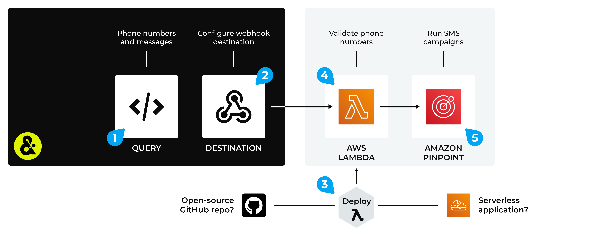

.. https://docs.amperity.com/operator/

.. |destination-name| replace:: Amazon Pinpoint
.. |plugin-namex| replace:: Amazon Pinpoint
.. |what-send| replace:: phone numbers and SMS message strings
.. |filter-the-list| replace:: "ama"
.. |data-template-name| replace:: |destination-name|
.. |data-template-description| replace:: Send |what-send| to |destination-name|.
.. |data-template-config-settings-list| replace:: settings required by |destination-name| were
.. |data-template-config-settings-list-them-vs-it| replace:: them
.. |sendto-link| replace:: |sendto_amazon_pinpoint|

.. meta::
    :description lang=en:
        Configure Amperity to send data to Amazon Pinpoint.

.. meta::
    :content class=swiftype name=body data-type=text:
        Configure Amperity to send data to Amazon Pinpoint.

.. meta::
    :content class=swiftype name=title data-type=string:
        Configure destinations for Amazon Pinpoint

==================================================
Configure destinations for Amazon Pinpoint
==================================================

.. term-amazon-pinpoint-start

Amazon Pinpoint is a flexible and scalable communications service for inbound and outbound marketing. Use Amazon Pinpoint to connect with your customers over SMS channels.

.. term-amazon-pinpoint-end

.. destination-amazon-pinpoint-steps-to-send-start

.. include:: ../../shared/destinations.rst
   :start-after: .. destinations-overview-list-intro-start
   :end-before: .. destinations-overview-list-intro-end

#. :ref:`Get details <destination-amazon-pinpoint-get-details>`
#. :ref:`Configure Amazon Pinpoint <destination-amazon-pinpoint-configure>`
#. :ref:`Add webhook destination <destination-amazon-pinpoint-add-destination>`
#. :ref:`Add data template <destination-amazon-pinpoint-add-data-template>`

.. destination-amazon-pinpoint-steps-to-send-end

.. _destination-amazon-pinpoint-howitworks:

How this destination works
==================================================

.. destination-amazon-pinpoint-howitworks-start

Use the Amazon Pinpoint destination to send phone numbers and promotional messages from Amperity to a Lambda function that validates each phone number, after which a message is sent to each valid phone number.

.. destination-amazon-pinpoint-howitworks-end

.. destination-amazon-pinpoint-howitworks-callouts-start

An Amazon Pinpoint destination works like this:

#. Use a query to return a list of phone numbers, along with associated messages. For example:

   .. code-block:: sql

      SELECT
        phone AS "phone_number"
        ,CONCAT('Hello ', given_name) AS "message"
      FROM Merged_Customers

#. Configure a webhook destination to send data to a Lambda function that is running in AWS Lambda.
#. Deploy a Lambda function to AWS Lambda. The Lambda function may be deployed as a serverless application (recommended) or it may be a custom Lambda function that you have built using the open source toolkit provided by Amperity, and then uploaded to AWS Lambda.
#. Configure the Lambda function to run against the data that is sent from Amperity. The Lambda function will validate each phone number.
#. The Lambda function sends validated results to Amazon Pinpoint, after which a message is sent to each valid phone number.

.. destination-amazon-pinpoint-howitworks-callouts-end

.. _destination-amazon-pinpoint-get-details:

Get details
==================================================

.. destination-amazon-pinpoint-get-details-start

|destination-name| requires the following configuration details:

.. list-table::
   :widths: 10 90
   :header-rows: 0

   * - .. image:: ../../images/steps-check-off-black.png
          :width: 60 px
          :alt: Detail one.
          :align: center
          :class: no-scaled-link
     - Amazon Pinpoint must be enabled in your Amazon AWS account and be configured to send SMS messages to your customers. (SMS messages are configured to be sent using the PROMOTIONAL message type in Amazon Pinpoint.)

   * - .. image:: ../../images/steps-check-off-black.png
          :width: 60 px
          :alt: Detail two.
          :align: center
          :class: no-scaled-link
     - A Lambda function must be uploaded to AWS Lambda that is running in your Amazon AWS account, and then configured to be available to Amperity.

   * - .. image:: ../../images/steps-check-off-black.png
          :width: 60 px
          :alt: Detail three.
          :align: center
          :class: no-scaled-link
     - A webhook destination that is configured in your Amperity tenant that sends query results to a Lambda function running in AWS Lambda.

.. destination-amazon-pinpoint-get-details-end

.. _destination-amazon-pinpoint-configure:

Configure Amazon Pinpoint
==================================================

.. destination-amazon-pinpoint-configure-start

To configure Amazon Pinpoint, you must complete one of the following series of steps:

#. :ref:`Use the pre-built serverless application <destination-amazon-pinpoint-serverless>`
#. :ref:`Manual configuration <destination-amazon-pinpoint-manual>`

.. destination-amazon-pinpoint-configure-end

.. _destination-amazon-pinpoint-serverless:

Serverless application
--------------------------------------------------

.. term-amazon-serverless-repository-start

The `AWS Serverless Application Repository <https://serverlessrepo.aws.amazon.com/applications>`__ |ext_link| is a managed repository for pre-built serverless applications. Find an application, configure it, and then deploy it to your Amazon AWS account.

.. term-amazon-serverless-repository-end

.. destination-amazon-pinpoint-configure-serverless-start

Amperity manages a pre-built serverless application for Amazon Pinpoint. Use this application to send valid phone numbers and messages from Amperity to Amazon Pinpoint.

.. destination-amazon-pinpoint-configure-serverless-end

**To deploy a serverless application**

.. destination-amazon-pinpoint-configure-serverless-steps-start

#. Log in to your Amazon AWS account.
#. Open the `AWS Serverless Application Repository <https://serverlessrepo.aws.amazon.com/applications>`__ |ext_link|.
#. Search for the `amperity-amazon-pinpoint-runner <https://serverlessrepo.aws.amazon.com/applications/us-east-1/884752987182/amperity-amazon-pinpoint-runner>`__ |ext_link|, and then open it. On the "amperity-amazon-pinpoint-runner" page, click **Deploy** to deploy the application to your Amazon AWS account.
#. Open the AWS Lambda console, and then open the "amperity-amazon-pinpoint-runner" Lambda function, and then click **Configure**.
#. On the **Configuration** page, click **Environment variables**, and then click **Edit**.
#. Add the following values for each key-pair:

   .. list-table::
      :widths: 200 400
      :header-rows: 1

      * - Key
        - Description
      * - PINPOINT_APP_ID
        - The project ID for Amazon Pinpoint. For example: "Ab1CD2eF3hI4JKLmNo5".
      * - PINPOINT_ORIGINATION_NUMBER
        - The Amazon Pinpoint origination number. For example: "+12137897890".
      * - PINPOINT_REGION
        - The region in which Amazon Pinpoint is located. For example: "us-east-1".

#. Click **Save**.

.. destination-amazon-pinpoint-configure-serverless-steps-end

.. _destination-amazon-pinpoint-manual:

Manual configuration
--------------------------------------------------

.. destination-amazon-pinpoint-configure-manual-start

A manual configuration requires more steps than deploying a serverless application, but enables the use of a custom Lambda function and the ability to define inline policies.

.. destination-amazon-pinpoint-configure-manual-end

.. destination-amazon-pinpoint-configure-manual-steps-start

To manually configure Amazon Pinpoint, do each of the following steps:

#. :ref:`Add basic function to your AWS Lambda console <destination-amazon-pinpoint-manual-add-function>`
#. :ref:`Get Lambda function template <destination-amazon-pinpoint-manual-get-template>`
#. :ref:`Upload function to AWS Lambda <destination-amazon-pinpoint-manual-upload-function>`
#. :ref:`Configure function in AWS Lambda <destination-amazon-pinpoint-manual-configure-function>`
#. :ref:`Add the API gateway <destination-amazon-pinpoint-manual-add-gateway>`
#. :ref:`Set AWS Lambda environment variables <destination-amazon-pinpoint-manual-set-variables>`
#. :ref:`Define inline policy <destination-amazon-pinpoint-manual-define-policy>`

.. destination-amazon-pinpoint-configure-manual-steps-end

.. _destination-amazon-pinpoint-manual-add-function:

Add function to AWS Lambda
++++++++++++++++++++++++++++++++++++++++++++++++++

.. destination-amazon-pinpoint-manual-add-function-start

Add a basic function to your AWS Lambda console using only the default function without any customization.

**To add a function to AWS Lambda**

#. Log in to your Amazon AWS account.
#. Open the AWS Lambda console, and then click **Create function**.
#. Select **Author from scratch**.
#. Under **Basic information**, specify the function name, runtime, and architecture. For example:

   **Function name** "Amperity function for Amazon Pinpoint"

   **Runtime** "Python 3.9"

   **Architecture** "x86_64"

#. Click **Save**.

.. destination-amazon-pinpoint-manual-add-function-end

.. _destination-amazon-pinpoint-manual-get-template:

Get Lambda function template
++++++++++++++++++++++++++++++++++++++++++++++++++

.. destination-amazon-pinpoint-manual-get-template-start

Amperity provides a pre-built collection of Lambda functions that is available from an open-source repository on GitHub.

.. note:: Lambda functions are built using Python. Amazon AWS provides runtimes for Python that include an SDK, along with credentials from an AWS Identity and Access Management (IAM) role that you manage.

**To get the Lambda function template**

#. Clone the open source **amperity-lambda-runner** repository or download it as a ZIP file.
#. In the repo, navigate to "/src/lambdas/lambda_handlers/", and then open "amazon_pinpoint.py".
#. You may use this file directly, requiring only configuration updates, or you may customize it to support your desired workflow.

.. destination-amazon-pinpoint-manual-get-template-end

.. _destination-amazon-pinpoint-manual-upload-function:

Upload function to AWS Lambda
++++++++++++++++++++++++++++++++++++++++++++++++++

.. destination-amazon-pinpoint-manual-upload-function-start

You must upload the application code and any dependencies to AWS Lambda as a ZIP file archive.

**To upload a Lambda function to AWS Lambda**

#. Add the application code and dependencies to a ZIP file archive.

   .. tip:: To build the ZIP file for Amazon Pinpoint, run the following command from your **amperity-lambda-runner** directory:

      .. code-block:: python

         sh util/lambda-build.sh filename=amazon_pinpoint.py

      This creates a ZIP file that contains the following files: **amazon_pinpoint.py**, **amperity_runner.py**, and **helpers.py**.

#. Open the AWS Lambda console, and then open the **Code** tab.
#. Click **Upload from**, and then click **ZIP file**.
#. Find the ZIP file archive that contains the application code and any dependencies, and then click **Upload**.
#. Click **Save**.

.. destination-amazon-pinpoint-manual-upload-function-end

.. _destination-amazon-pinpoint-manual-configure-function:

Configure function in AWS Lambda
++++++++++++++++++++++++++++++++++++++++++++++++++

.. destination-amazon-pinpoint-manual-configure-function-start

AWS Lambda must be updated for the name of the Amazon Pinpoint application and to specify a timeout value.

**To configure the Lambda function in AWS Lambda**

#. Open the AWS Lambda console, and then open the **Code** tab.
#. Under **Runtime settings**, select **Edit**.
#. Under **Handler**, add "app.amazon_pinpoint", and then click **Save**.
#. In the AWS Lambda console, open the **Configuration** tab.
#. Under **General configuration**, select **Edit**.
#. Set the **Timeout** value to "15 min 0 sec", and then click **Save**.

.. destination-amazon-pinpoint-manual-configure-function-end

.. _destination-amazon-pinpoint-manual-add-gateway:

Add the API gateway
++++++++++++++++++++++++++++++++++++++++++++++++++

.. destination-amazon-pinpoint-manual-add-gateway-start

`Amazon API Gateway <https://docs.aws.amazon.com/lambda/latest/dg/services-apigateway.html>`__ |ext_link| provides tools for creating and documenting web APIs that route HTTP requests to AWS Lambda functions. An API gateway is required to use webhook destinations.

**To add an API gateway**

#. Open the AWS Lambda console.
#. Open the Lambda function for Amazon Pinpoint.
#. Click **Add trigger**.
#. From the dropdown menu, select "API Gateway", and then select the following:

   .. list-table::
      :widths: 200 400
      :header-rows: 1

      * - Setting
        - Value
      * - Intent
        - Create a new API
      * - API type
        - REST API
      * - Security
        - API Key

#. Click **Add**.

   You need these values when configuring the webhook destination in Amperity.

.. destination-amazon-pinpoint-manual-add-gateway-end

.. _destination-amazon-pinpoint-manual-set-variables:

Set AWS Lambda environment variables
++++++++++++++++++++++++++++++++++++++++++++++++++

.. destination-amazon-pinpoint-manual-set-variables-start

Use AWS Lambda environment variables provide to the Lambda function the name of the project, the origination number, and the region.

**To set environment variables**

#. Open the AWS Lambda console.
#. Open the Lambda function for Amazon Pinpoint.
#. Click **Configuration**.
#. On the **Configuration** page, click **Environment variables**, and then click **Edit**.
#. Click **Add environment variable**, and then set the following key-value pairs:

   .. list-table::
      :widths: 200 400
      :header-rows: 1

      * - Key
        - Description
      * - PINPOINT_APP_ID
        - The project ID for Amazon Pinpoint. For example: "Ab1CD2eF3hI4JKLmNo5".
      * - PINPOINT_ORIGINATION_NUMBER
        - The Amazon Pinpoint origination number. For example: "+12137897890".
      * - PINPOINT_REGION
        - The region in which Amazon Pinpoint is located. For example: "us-east-1".

#. Click **Save**.

.. destination-amazon-pinpoint-manual-set-variables-end

.. _destination-amazon-pinpoint-manual-define-policy:

Define inline policy
++++++++++++++++++++++++++++++++++++++++++++++++++

.. destination-amazon-pinpoint-manual-define-policy-start

You can `use inline policies <https://docs.aws.amazon.com/lambda/latest/dg/security-iam.html#security_iam_access-manage>`__ |ext_link| to manage access to the Lambda function in AWS Lambda.

**To define an inline policy**

#. Open the AWS Lambda console.
#. Open the Lambda function for Amazon Pinpoint.
#. Click **Configuration**.
#. On the **Configuration** page, under **Execution role**, and then click the name of the role to be used with this Lambda function.
#. Click **Add permissions**, and then click **Create inline policy**.
#. Select the following values:

   .. list-table::
      :widths: 200 400
      :header-rows: 1

      * - Service
        - Amazon Pinpoint
      * - Actions
        - ``All Pinpoint actions (mobiletargeting:*)``
      * - Resources
        - ``All resources``

#. Click **Review policy**, add a name for the policy (like "Amperity Amazon Pinpoint"), and then click **Create policy**.

.. destination-amazon-pinpoint-manual-define-policy-end

.. _destination-amazon-pinpoint-add-destination:

Add webhook destination
==================================================

.. include:: ../../shared/destinations.rst
   :start-after: .. destinations-add-destinations-webhook-intro-start
   :end-before: .. destinations-add-destinations-webhook-intro-end

**To add a destination**

.. include:: ../../shared/destinations.rst
   :start-after: .. destinations-add-destinations-webhook-start
   :end-before: .. destinations-add-destinations-webhook-end

.. _destination-amazon-pinpoint-add-data-template:

Add data template
==================================================

.. include:: ../../shared/terms.rst
   :start-after: .. term-data-template-start
   :end-before: .. term-data-template-end

**To add a data template**

.. destination-amazon-pinpoint-add-data-template-steps-start

.. list-table::
   :widths: 10 90
   :header-rows: 0

   * - .. image:: ../../images/steps-01.png
          :width: 60 px
          :alt: Step one.
          :align: center
          :class: no-scaled-link
     - .. include:: ../../shared/destinations.rst
          :start-after: .. destinations-data-template-open-template-start
          :end-before: .. destinations-data-template-open-template-end

       .. image:: ../../images/mockup-data-template-tab-add-01-details.png
          :width: 500 px
          :alt: Add details.
          :align: left
          :class: no-scaled-link

       .. include:: ../../shared/destinations.rst
          :start-after: .. destinations-data-template-open-template-name-start
          :end-before: .. destinations-data-template-open-template-name-end

   * - .. image:: ../../images/steps-02.png
          :width: 60 px
          :alt: Step two.
          :align: center
          :class: no-scaled-link
     - .. include:: ../../shared/destinations.rst
          :start-after: .. destinations-data-template-business-users-start
          :end-before: .. destinations-data-template-business-users-end

       .. image:: ../../images/mockup-data-template-tab-add-02-allow-access.png
          :width: 500 px
          :alt: Allow access.
          :align: left
          :class: no-scaled-link

       .. include:: ../../shared/destinations.rst
          :start-after: .. destinations-data-template-business-users-access-not-configured-start
          :end-before: .. destinations-data-template-business-users-access-not-configured-end

   * - .. image:: ../../images/steps-03.png
          :width: 60 px
          :alt: Step three.
          :align: center
          :class: no-scaled-link
     - .. include:: ../../shared/destinations.rst
          :start-after: .. destinations-data-template-verify-config-settings-start
          :end-before: .. destinations-data-template-verify-config-settings-end

       .. important:: Under **Webhook settings**, if **Webhook Settings** is empty, set it to empty curly braces: {}.

       .. image:: ../../images/mockup-data-template-tab-add-03-settings.png
          :width: 500 px
          :alt: Verify settings for the data template.
          :align: left
          :class: no-scaled-link

       .. include:: ../../shared/destinations.rst
          :start-after: .. destinations-data-template-verify-config-settings-note-start
          :end-before: .. destinations-data-template-verify-config-settings-note-end

   * - .. image:: ../../images/steps-04.png
          :width: 60 px
          :alt: Step four.
          :align: center
          :class: no-scaled-link
     - .. include:: ../../shared/destinations.rst
          :start-after: .. destinations-data-template-save-start
          :end-before: .. destinations-data-template-save-end

       .. image:: ../../images/mockup-destinations-tab-add-05-save.png
          :width: 500 px
          :alt: Save the data template.
          :align: left
          :class: no-scaled-link

       .. include:: ../../shared/destinations.rst
          :start-after: .. destinations-data-template-save-after-queries-only-start
          :end-before: .. destinations-data-template-save-after-queries-only-end

.. destination-amazon-pinpoint-add-data-template-steps-end
