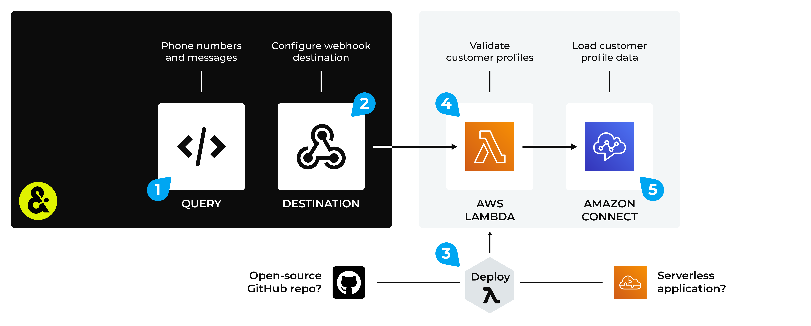

.. https://docs.amperity.com/operator/

.. |destination-name| replace:: AWS Connect
.. |plugin-namex| replace:: AWS Connect
.. |what-send| replace:: customer profiles
.. |filter-the-list| replace:: "aws"
.. |data-template-name| replace:: |destination-name|
.. |data-template-description| replace:: Send |what-send| to |destination-name|.
.. |data-template-config-settings-list| replace:: settings required by |destination-name| were
.. |data-template-config-settings-list-them-vs-it| replace:: them
.. |sendto-link| replace:: |sendto_aws_connect|

.. meta::
    :description lang=en:
        Configure Amperity to send data to AWS Connect.

.. meta::
    :content class=swiftype name=body data-type=text:
        Configure Amperity to send data to AWS Connect.

.. meta::
    :content class=swiftype name=title data-type=string:
        Configure destinations for AWS Connect

==================================================
Configure destinations for AWS Connect
==================================================

.. include:: ../../shared/terms.rst
   :start-after: .. term-aws-connect-start
   :end-before: .. term-aws-connect-end

.. destination-aws-connect-steps-to-send-start

.. include:: ../../shared/destinations.rst
   :start-after: .. destinations-overview-list-intro-start
   :end-before: .. destinations-overview-list-intro-end

#. :ref:`Get details <destination-aws-connect-get-details>`
#. :ref:`Configure AWS Connect <destination-aws-connect-configure>`
#. :ref:`Add webhook destination <destination-aws-connect-add-destination>`

.. destination-aws-connect-steps-to-send-end

.. _destination-aws-connect-howitworks:

How this destination works
==================================================

.. destination-aws-connect-howitworks-start

Use |destination-name| to send |what-send| from Amperity to a Lambda function, after which it is loaded to |destination-name|.

.. destination-aws-connect-howitworks-end

.. destination-aws-connect-howitworks-callouts-start

An |destination-name| destination works like this:

#. Use a query to return customer profiles. For example:

   .. code-block:: sql

      SELECT
        given_name AS "First Name"
        surname AS "Last Name"
        postal AS "Zip Code"
        email AS "Email Address"
        phone AS "Phone Number"
      FROM Merged_Customers

#. Configure a webhook destination to send data to a Lambda function that is running in AWS Lambda.
#. Deploy a Lambda function to AWS Lambda. The Lambda function may be deployed as a serverless application (recommended) or it may be a custom Lambda function that you have built using the open source toolkit provided by Amperity, and then uploaded to AWS Lambda.
#. Configure the Lambda function to run against the data that is sent from Amperity.
#. The Lambda function sends validated results to |destination-name|.

.. destination-aws-connect-howitworks-callouts-end

.. _destination-aws-connect-get-details:

Get details
==================================================

.. destination-aws-connect-get-details-start

|destination-name| requires the following configuration details:

.. list-table::
   :widths: 10 90
   :header-rows: 0

   * - .. image:: ../../images/steps-check-off-black.png
          :width: 60 px
          :alt: Detail one.
          :align: center
          :class: no-scaled-link
     - |destination-name| must be enabled in your Amazon AWS account.

   * - .. image:: ../../images/steps-check-off-black.png
          :width: 60 px
          :alt: Detail two.
          :align: center
          :class: no-scaled-link
     - A Lambda function must be uploaded to AWS Lambda that is running in your Amazon AWS account, and then configured to be available to Amperity.

   * - .. image:: ../../images/steps-check-off-black.png
          :width: 60 px
          :alt: Detail three.
          :align: center
          :class: no-scaled-link
     - A webhook destination that is configured in your Amperity tenant that sends query results to a Lambda function running in AWS Lambda.

.. destination-aws-connect-get-details-end

.. _destination-aws-connect-configure:

Configure AWS Connect
==================================================

.. destination-aws-connect-configure-start

To configure |destination-name|, you must complete one of the following series of steps:

#. :ref:`Use the pre-built serverless application <destination-aws-connect-serverless>`
#. :ref:`Manual configuration <destination-aws-connect-manual>`

.. destination-aws-connect-configure-end

.. _destination-aws-connect-serverless:

Serverless application
--------------------------------------------------

.. term-amazon-serverless-repository-start

The `AWS Serverless Application Repository <https://serverlessrepo.aws.amazon.com/applications>`__ |ext_link| is a managed repository for pre-built serverless applications. Find an application, configure it, and then deploy it to your Amazon AWS account.

.. term-amazon-serverless-repository-end

.. destination-aws-connect-configure-serverless-start

Amperity manages a pre-built serverless application for |destination-name|. Use this application to send valid phone numbers and messages from Amperity to |destination-name|.

.. destination-aws-connect-configure-serverless-end

**To deploy a serverless application**

.. destination-aws-connect-configure-serverless-steps-start

#. Log in to your Amazon AWS account.
#. Open the `AWS Serverless Application Repository <https://serverlessrepo.aws.amazon.com/applications>`__ |ext_link|.
#. Search for the `amperity-aws-connect-runner <https://serverlessrepo.aws.amazon.com/applications/us-east-1/884752987182/amperity-aws-connect-runner>`__ |ext_link|, and then open it. On the "amperity-aws-connect-runner" page, click **Deploy** to deploy the application to your Amazon AWS account.
#. Open the AWS Lambda console, and then open the "amperity-aws-connect-runner" Lambda function, and then click **Configure**.
#. Click **Save**.

.. destination-aws-connect-configure-serverless-steps-end

.. _destination-aws-connect-manual:

Manual configuration
--------------------------------------------------

.. destination-aws-connect-configure-manual-start

A manual configuration requires more steps than deploying a serverless application, but enables the use of a custom Lambda function and the ability to define inline policies.

.. destination-aws-connect-configure-manual-end

.. destination-aws-connect-configure-manual-steps-start

To manually configure AWS Connect, do each of the following steps:

#. :ref:`Add basic function to your AWS Lambda console <destination-aws-connect-manual-add-function>`
#. :ref:`Get Lambda function template <destination-aws-connect-manual-get-template>`
#. :ref:`Upload function to AWS Lambda <destination-aws-connect-manual-upload-function>`
#. :ref:`Configure function in AWS Lambda <destination-aws-connect-manual-configure-function>`
#. :ref:`Add the API gateway <destination-aws-connect-manual-add-gateway>`
#. :ref:`Set AWS Lambda environment variables <destination-aws-connect-manual-set-variables>`
#. :ref:`Define inline policy <destination-aws-connect-manual-define-policy>`

.. destination-aws-connect-configure-manual-steps-end

.. _destination-aws-connect-manual-add-function:

Add function to AWS Lambda
++++++++++++++++++++++++++++++++++++++++++++++++++

.. destination-aws-connect-manual-add-function-start

Add a basic function to your AWS Lambda console using only the default function without any customization.

**To add a function to AWS Lambda**

#. Log in to your Amazon AWS account.
#. Open the AWS Lambda console, and then click **Create function**.
#. Select **Author from scratch**.
#. Under **Basic information**, specify the function name, runtime, and architecture. For example:

   **Function name** "Amperity function for AWS Connect"

   **Runtime** "Python 3.9"

   **Architecture** "x86_64"

#. Click **Save**.

.. destination-aws-connect-manual-add-function-end

.. _destination-aws-connect-manual-get-template:

Get Lambda function template
++++++++++++++++++++++++++++++++++++++++++++++++++

.. destination-aws-connect-manual-get-template-start

Amperity provides a pre-built collection of Lambda functions that is available from an open-source repository on GitHub.

.. note:: Lambda functions are built using Python. Amazon AWS provides runtimes for Python that include an SDK, along with credentials from an AWS Identity and Access Management (IAM) role that you manage.

**To get the Lambda function template**

#. Clone the open source **amperity-lambda-runner** repository or download it as a ZIP file.
#. In the repo, navigate to "/src/lambdas/lambda_handlers/", and then open "amazon_pinpoint.py".
#. You may use this file directly, requiring only configuration updates, or you may customize it to support your desired workflow.

.. destination-aws-connect-manual-get-template-end

.. _destination-aws-connect-manual-upload-function:

Upload function to AWS Lambda
++++++++++++++++++++++++++++++++++++++++++++++++++

.. destination-aws-connect-manual-upload-function-start

You must upload the application code and any dependencies to AWS Lambda as a ZIP file archive.

**To upload a Lambda function to AWS Lambda**

#. Add the application code and dependencies to a ZIP file archive.

   .. tip:: To build the ZIP file for AWS Connect, run the following command from your **amperity-lambda-runner** directory:

      .. code-block:: python

         sh util/lambda-build.sh filename=amazon_aws_connect.py

      This creates a ZIP file that contains the following files: **amazon_aws_connect.py**, **amperity_runner.py**, and **helpers.py**.

#. Open the AWS Lambda console, and then open the **Code** tab.
#. Click **Upload from**, and then click **ZIP file**.
#. Find the ZIP file archive that contains the application code and any dependencies, and then click **Upload**.
#. Click **Save**.

.. destination-aws-connect-manual-upload-function-end

.. _destination-aws-connect-manual-configure-function:

Configure function in AWS Lambda
++++++++++++++++++++++++++++++++++++++++++++++++++

.. destination-aws-connect-manual-configure-function-start

AWS Lambda must be updated for the name of the AWS Connect application and to specify a timeout value.

**To configure the Lambda function in AWS Lambda**

#. Open the AWS Lambda console, and then open the **Code** tab.
#. Under **Runtime settings**, select **Edit**.
#. Under **Handler**, add "app.amazon_aws_connect", and then click **Save**.
#. In the AWS Lambda console, open the **Configuration** tab.
#. Under **General configuration**, select **Edit**.
#. Set the **Timeout** value to "15 min 0 sec", and then click **Save**.

.. destination-aws-connect-manual-configure-function-end

.. _destination-aws-connect-manual-add-gateway:

Add the API gateway
++++++++++++++++++++++++++++++++++++++++++++++++++

.. destination-aws-connect-manual-add-gateway-start

`Amazon API Gateway <https://docs.aws.amazon.com/lambda/latest/dg/services-apigateway.html>`__ |ext_link| provides tools for creating and documenting web APIs that route HTTP requests to AWS Lambda functions. An API gateway is required to use webhook destinations.

**To add an API gateway**

#. Open the AWS Lambda console.
#. Open the Lambda function for AWS Connect.
#. Click **Add trigger**.
#. From the dropdown menu, select "API Gateway", and then select the following:

   .. list-table::
      :widths: 200 400
      :header-rows: 1

      * - Setting
        - Value
      * - Intent
        - Create a new API
      * - API type
        - REST API
      * - Security
        - API Key

#. Click **Add**.

   You need these values when configuring the webhook destination in Amperity.

.. destination-aws-connect-manual-add-gateway-end

.. _destination-aws-connect-manual-set-variables:

Set AWS Lambda environment variables
++++++++++++++++++++++++++++++++++++++++++++++++++

.. destination-aws-connect-manual-set-variables-start

Use AWS Lambda environment variables provide to the Lambda function the name of the project, the origination number, and the region.

**To set environment variables**

#. Open the AWS Lambda console.
#. Open the Lambda function for AWS Connect.
#. Click **Configuration**.
#. On the **Configuration** page, click **Environment variables**, and then click **Edit**.
#. Click **Save**.

.. destination-aws-connect-manual-set-variables-end

.. _destination-aws-connect-manual-define-policy:

Define inline policy
++++++++++++++++++++++++++++++++++++++++++++++++++

.. destination-aws-connect-manual-define-policy-start

You can `use inline policies <https://docs.aws.amazon.com/lambda/latest/dg/security-iam.html#security_iam_access-manage>`__ |ext_link| to manage access to the Lambda function in AWS Lambda.

**To define an inline policy**

#. Open the AWS Lambda console.
#. Open the Lambda function for AWS Connect.
#. Click **Configuration**.
#. On the **Configuration** page, under **Execution role**, and then click the name of the role to be used with this Lambda function.
#. Click **Add permissions**, click **Attach policy**, and then **Create policy**.
#. Select the following values:

   Select **Profile** as the service.

   Under **List** select **ListProfiles**.

   Under **Read** select **SearchProfiles**.

   Under **Write** select **CreateProfile**, **DeleteProfile**, and **UpdateProfile**.

#. Click **Review policy**, add a name for the policy (like "Amperity AWS Connect"), and then click **Create policy**.

.. destination-aws-connect-manual-define-policy-end

.. _destination-aws-connect-add-destination:

Add webhook destination
==================================================

.. include:: ../../shared/destinations.rst
   :start-after: .. destinations-add-destinations-webhook-intro-start
   :end-before: .. destinations-add-destinations-webhook-intro-end

**To add a destination**

.. include:: ../../shared/destinations.rst
   :start-after: .. destinations-add-destinations-webhook-start
   :end-before: .. destinations-add-destinations-webhook-end
