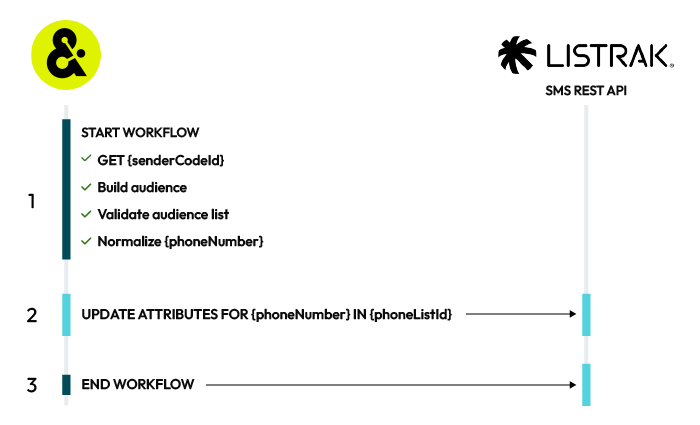

.. https://docs.amperity.com/operator/

.. |destination-name| replace:: Listrak SMS
.. |plugin-name| replace:: "Listrak SMS--Profile updates"
.. |credential-type| replace:: "listrak-sms"
.. |required-credentials| replace:: "refresh token"
.. |audience-primary-key| replace:: "phone"
.. |what-send| replace:: phone numbers and SMS profile attributes
.. |where-send| replace:: |destination-name|
.. |filter-the-list| replace:: "list"

.. meta::
    :description lang=en:
        Configure destinations for Listrak SMS profile updates.

.. meta::
    :content class=swiftype name=body data-type=text:
        Configure destinations for Listrak SMS profile updates.

.. meta::
    :content class=swiftype name=title data-type=string:
        Configure destinations for Listrak SMS profile updates

=======================================================
Configure destinations for Listrak SMS profile updates
=======================================================

.. destination-listrak-sms-profile-about-start

|destination-name| is an automation platform for audience activation through mobile messaging campaigns and personalized SMS marketing.

.. destination-listrak-sms-profile-about-end

.. destination-listrak-sms-profile-updates-only-start

.. important:: This destination only updates existing profiles in |destination-name|. This connector does not create, delete, subscribe, or unsubscribe contacts. Use the :doc:`Listrak SMS--List management <destination_listrak_sms>` destination to create, delete, subscribe or unsubscribe contacts.

.. destination-listrak-sms-profile-updates-only-end

.. include:: ../../shared/destination_settings.rst
   :start-after: .. setting-listrak-sms-optin-start
   :end-before: .. setting-listrak-sms-optin-end

.. destination-listrak-sms-profile-context-start

Use the `Listrak SMS REST API <https://api.listrak.com/sms>`__ |ext_link| to update SMS profile attributes for contacts that already exist in |destination-name|.

Amperity uses the `Start a Contact Update Import <https://api.listrak.com/sms#operation/Contact_PostImportFileResource>`__ |ext_link| endpoint to update an audience member's information by **{phoneNumber}**.

.. destination-listrak-sms-profile-context-end

.. _destination-listrak-sms-profile-howitworks:

How this destination works
==================================================

.. destination-listrak-sms-profile-howitworks-start

This destination updates SMS profile attributes for existing contacts in |destination-name|. It does not create new contacts, does not add contacts to lists, and does not change subscription status.

Audience members whose phone numbers do not already exist in |destination-name| are silently dropped by the API.

.. destination-listrak-sms-profile-howitworks-end

.. destination-listrak-sms-profile-howitworks-optin-start

.. important:: To avoid sending SMS messages to people who did not consent to receiving them, ensure only consented phone numbers are included in the data provided to Amperity, or maintain consent status as a separate attribute.

   For example, bring Listrak subscriber status to Amperity as a data source, and then use that data source with the **SMS Opt Status** table to help ensure customers are filterable by subscriber status in queries and segments.

   SMS opt-in requirements are different from email opt-in requirements and require separate consent tracking.

.. destination-listrak-sms-profile-howitworks-optin-end

.. destination-listrak-sms-profile-howitworks-endpoints-start

Amperity uses a specific endpoint in the `Listrak SMS REST API <https://api.listrak.com/sms>`__ |ext_link| to update SMS profiles in |destination-name|.

.. destination-listrak-sms-profile-howitworks-endpoints-end

.. destination-listrak-sms-profile-howitworks-table-start

A |destination-name| profile update destination works like this:

.. list-table::
   :widths: 10 90
   :header-rows: 0

   * - .. image:: ../../images/steps-01.png
          :width: 60 px
          :alt: Step one.
          :align: center
          :class: no-scaled-link
     - **START WORKFLOW**

       After the workflow starts, Amperity:

       #. Gets the value for the **{senderCodeId}** from Amperity configuration. This destination stores this value in the **Sender Code ID** field. Amperity replaces the "{senderCodeId}" value in the path to Listrak SMS API endpoints with this value.

       #. Amperity builds the audience list for the query or segment.

       #. Amperity validates the audience list.

       #. Amperity normalizes phone numbers for each audience member. SMS audience members are referred to as "contacts" in Listrak documentation.

   * - .. image:: ../../images/steps-02.png
          :width: 60 px
          :alt: Step two.
          :align: center
          :class: no-scaled-link
     - **UPDATE ATTRIBUTES FOR {phoneNumber}**

       All members of an audience in Listrak must have a phone number.

       In addition to phone numbers, you may send email addresses, first and last names, birthdates, and postal codes.

       Custom attributes may also be defined.

       When attributes for existing audience members change, Amperity will update the profile to match the updated attributes. For example, a custom attribute for "Most recent purchase" has an existing value of "Socktown 5-pack ankle" and Amperity updates the attribute to "Socktown 5-pack mid-calf".

       Amperity uses the `Start a Contact Update Import <https://api.listrak.com/sms#operation/Contact_PostImportFileResource>`__ |ext_link| endpoint to update an audience member's information by **{phoneNumber}**. All system fields (**phone**, **email**, **first_name**, **last_name**, **birthdate**, and **postal_code**) and custom fields are updated for all customers. Amperity does not change an audience member's opt status.

       .. important:: This destination only updates profile attributes for contacts that already exist in |destination-name|. Audience members whose phone numbers do not exist in |destination-name| are silently dropped. This destination never creates new contacts and never changes subscription status.

   * - .. image:: ../../images/steps-03.png
          :width: 60 px
          :alt: Step three.
          :align: center
          :class: no-scaled-link
     - **END WORKFLOW**

       The workflow ends when all attributes are updated for existing audience members.

.. destination-listrak-sms-profile-howitworks-table-end

.. _destination-listrak-sms-profile-get-details:

Get details
==================================================

.. include:: ../../shared/destination_settings.rst
   :start-after: .. setting-common-get-details-start
   :end-before: .. setting-common-get-details-end

.. destination-listrak-sms-profile-get-details-table-start

.. list-table::
   :widths: 10 90
   :header-rows: 0

   * - .. image:: ../../images/steps-check-off-black.png
          :width: 60 px
          :alt: Detail 1.
          :align: center
          :class: no-scaled-link
     - **Credential settings**

       You must configure this destination for SMS profiles:

       **SMS client ID and client secret**

          .. include:: ../../shared/credentials_settings.rst
             :start-after: .. credential-listrak-sms-client-id-secret-start
             :end-before: .. credential-listrak-sms-client-id-secret-end

          .. include:: ../../shared/credentials_settings.rst
             :start-after: .. credential-listrak-client-id-secret-location-start
             :end-before: .. credential-listrak-client-id-secret-location-end

   * - .. image:: ../../images/steps-check-off-black.png
          :width: 60 px
          :alt: Detail 2.
          :align: center
          :class: no-scaled-link
     - **Define custom SMS profile attributes**

       `Custom SMS profile attributes <https://help.listrak.com/en/articles/1852936-sms-profile-fields-and-personalization-guide>`__ |ext_link| must be created in |destination-name| before Amperity can send custom attributes.

       * Up to fifty custom attributes may be defined in |destination-name|.

         .. include:: ../../shared/destination_settings.rst
            :start-after: .. setting-listrak-sms-enable-segmentation-caveat-start
            :end-before: .. setting-listrak-sms-enable-segmentation-caveat-end

       * Custom attributes are defined in the |destination-name| user interface. Open the **Contacts** menu, and then choose **Profile Fields**. Click **New Profile Field** to add custom attributes.
       * System fields--**Birthday**, **Email Address**, **First Name**, **Last Name**, and **Postal Code**--are pre-defined by |destination-name| and cannot be modified.
       * **Phone Number** is the primary identifier for each SMS profile and is required.

   * - .. image:: ../../images/steps-check-off-black.png
          :width: 60 px
          :alt: Detail 3.
          :align: center
          :class: no-scaled-link
     - **Required configuration settings**

       **Sender code ID**

          |checkmark-required| **Required**

          .. include:: ../../shared/destination_settings.rst
             :start-after: .. setting-listrak-sms-sender-code-id-start
             :end-before: .. setting-listrak-sms-sender-code-id-end

   * - .. image:: ../../images/steps-check-off-black.png
          :width: 60 px
          :alt: Detail 4.
          :align: center
          :class: no-scaled-link
     - **Audience configuration**

       Use a query or a segment to build an audience to send to |destination-name|. The **phone** field must be part of the audience. You may append additional profile attributes to the query or segment.

.. destination-listrak-sms-profile-get-details-end

.. _destination-listrak-sms-profile-attributes:

About Listrak SMS profile attributes
==================================================

.. destination-listrak-sms-profile-attributes-start

|destination-name| uses phone numbers as the primary identifier for each SMS profile.

|destination-name| has the following SMS pre-defined attributes to collect additional information about SMS profiles.

**System fields**

* **Birthday** Use for date-based segmentation.
* **Email Address** A contact attribute.
* **First Name** and **Last Name** Use for personalization.
* **Postal Code** Use for location targeting.

Use system attributes to personalize messages, such as adding a first name to an SMS message, and to filter messages to only those who match certain criteria.

**Custom attributes**

Enable the **Include attributes that match custom profile fields** field to sychronize all profile attributes in Amperity that match custom profile fields defined in |destination-name|.

.. include:: ../../shared/destination_settings.rst
   :start-after: .. setting-listrak-sms-enable-segmentation-caveat-start
   :end-before: .. setting-listrak-sms-enable-segmentation-caveat-end

|destination-name| supports up to fifty custom SMS profile attributes. Use these to define additional SMS profile attributes to support your brand's use cases.

.. important:: Each custom attribute must be defined in |destination-name| before Amperity can send them with SMS profiles.

Custom attributes must be one of the following data types: `Checkbox, Date, Number, or Text <https://help.listrak.com/en/articles/1852936-sms-profile-fields-and-personalization-guide#custom-profile-fields>`__ |ext_link|. Any custom attributes sent from Amperity must match one of these data types.

.. destination-listrak-sms-profile-attributes-end

.. _destination-listrak-sms-profile-credentials:

Configure credentials
==================================================

.. include:: ../../shared/credentials_settings.rst
   :start-after: .. credential-configure-first-start
   :end-before: .. credential-configure-first-end

.. include:: ../../shared/credentials_settings.rst
   :start-after: .. credential-snappass-start
   :end-before: .. credential-snappass-end

**To configure credentials for Listrak SMS**

.. destination-listrak-sms-profile-credentials-steps-start

.. list-table::
   :widths: 10 90
   :header-rows: 0

   * - .. image:: ../../images/steps-01.png
          :width: 60 px
          :alt: Step one.
          :align: center
          :class: no-scaled-link
     - .. include:: ../../shared/credentials_settings.rst
          :start-after: .. credential-steps-add-credential-start
          :end-before: .. credential-steps-add-credential-end

   * - .. image:: ../../images/steps-02.png
          :width: 60 px
          :alt: Step two.
          :align: center
          :class: no-scaled-link
     - .. include:: ../../shared/credentials_settings.rst
          :start-after: .. credential-steps-select-type-start
          :end-before: .. credential-steps-select-type-end

   * - .. image:: ../../images/steps-03.png
          :width: 60 px
          :alt: Step three.
          :align: center
          :class: no-scaled-link
     - .. include:: ../../shared/credentials_settings.rst
          :start-after: .. credential-steps-settings-intro-start
          :end-before: .. credential-steps-settings-intro-end

       You must configure this destination for SMS profiles:

       **SMS client ID and client secret**

          .. include:: ../../shared/credentials_settings.rst
             :start-after: .. credential-listrak-sms-client-id-secret-start
             :end-before: .. credential-listrak-sms-client-id-secret-end

          .. include:: ../../shared/credentials_settings.rst
             :start-after: .. credential-listrak-client-id-secret-location-start
             :end-before: .. credential-listrak-client-id-secret-location-end

.. destination-listrak-sms-profile-credentials-steps-end

.. _destination-listrak-sms-profile-add:

Add destination
==================================================

.. include:: ../../shared/destination_settings.rst
   :start-after: .. setting-common-sandbox-recommendation-start
   :end-before: .. setting-common-sandbox-recommendation-end

**To add a destination for Listrak SMS profile updates**

.. destination-listrak-sms-profile-add-steps-start

.. list-table::
   :widths: 10 90
   :header-rows: 0

   * - .. image:: ../../images/steps-01.png
          :width: 60 px
          :alt: Step one.
          :align: center
          :class: no-scaled-link
     - .. include:: ../../shared/destination_settings.rst
          :start-after: .. destinations-steps-add-destinations-start
          :end-before: .. destinations-steps-add-destinations-end

       .. image:: ../../images/mockup-destinations-add-01-select-destination-common.png
          :width: 380 px
          :alt: Add
          :align: left
          :class: no-scaled-link

       .. include:: ../../shared/destination_settings.rst
          :start-after: .. destinations-steps-add-destinations-select-start
          :end-before: .. destinations-steps-add-destinations-select-end

   * - .. image:: ../../images/steps-02.png
          :width: 60 px
          :alt: Step two.
          :align: center
          :class: no-scaled-link
     - .. include:: ../../shared/destination_settings.rst
          :start-after: .. destinations-steps-select-credential-start
          :end-before: .. destinations-steps-select-credential-end

       .. tip::

          .. include:: ../../shared/destination_settings.rst
             :start-after: .. destinations-steps-test-connection-start
             :end-before: .. destinations-steps-test-connection-end

   * - .. image:: ../../images/steps-03.png
          :width: 60 px
          :alt: Step three.
          :align: center
          :class: no-scaled-link
     - .. include:: ../../shared/destination_settings.rst
          :start-after: .. destinations-steps-name-and-description-start
          :end-before: .. destinations-steps-name-and-description-end

       .. admonition:: Configure business user access

          .. include:: ../../shared/destination_settings.rst
             :start-after: .. setting-common-business-user-access-allow-start
             :end-before: .. setting-common-business-user-access-allow-end

          .. include:: ../../shared/destination_settings.rst
             :start-after: .. setting-common-business-user-access-restrict-pii-start
             :end-before: .. setting-common-business-user-access-restrict-pii-end

   * - .. image:: ../../images/steps-04.png
          :width: 60 px
          :alt: Step four.
          :align: center
          :class: no-scaled-link
     - .. include:: ../../shared/destination_settings.rst
          :start-after: .. destinations-steps-settings-start
          :end-before: .. destinations-steps-settings-end

       **Sender code ID**

          |checkmark-required| **Required**

          .. include:: ../../shared/destination_settings.rst
             :start-after: .. setting-listrak-sms-sender-code-id-start
             :end-before: .. setting-listrak-sms-sender-code-id-end

       **Audience primary key**

          .. include:: ../../shared/destination_settings.rst
             :start-after: .. setting-common-audience-primary-key-start
             :end-before: .. setting-common-audience-primary-key-end

       **Include attributes that match custom profile fields**

          .. include:: ../../shared/destination_settings.rst
             :start-after: .. setting-listrak-sms-enable-segmentation-start
             :end-before: .. setting-listrak-sms-enable-segmentation-end

          .. include:: ../../shared/destination_settings.rst
             :start-after: .. setting-listrak-sms-enable-segmentation-caveat-start
             :end-before: .. setting-listrak-sms-enable-segmentation-caveat-end

   * - .. image:: ../../images/steps-05.png
          :width: 60 px
          :alt: Step five.
          :align: center
          :class: no-scaled-link
     - .. include:: ../../shared/destination_settings.rst
          :start-after: .. destinations-steps-business-users-start
          :end-before: .. destinations-steps-business-users-end

   * - .. image:: ../../images/steps-06.png
          :width: 60 px
          :alt: Step six.
          :align: center
          :class: no-scaled-link
     - .. include:: ../../shared/destination_settings.rst
          :start-after: .. destinations-steps-validate-audience-start
          :end-before: .. destinations-steps-validate-audience-end

.. destination-listrak-sms-profile-add-steps-end
