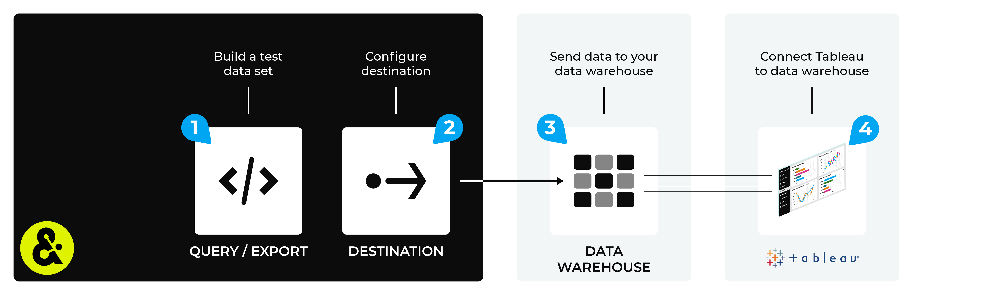

.. https://docs.amperity.com/operator/

.. meta::
    :description lang=en:
        Configure Amperity to send data to Tableau.

.. meta::
    :content class=swiftype name=body data-type=text:
        Configure Amperity to send data to Tableau.

.. meta::
    :content class=swiftype name=title data-type=string:
        Configure destinations for Tableau

==================================================
Configure destinations for Tableau
==================================================

.. destination-tableau-start

Many organizations use Tableau to enable its users -- data analysts, data scientists, and business users -- to explore data, discover insights, and share the results in a visual way across the organization.

Tableau connects to Amperity data indirectly. You must first configure Amperity to send the results of a query or a database export to any of the following cloud-based data warehouses:

* :doc:`Amazon Redshift <destination_tableau_amazon_redshift>`
* :doc:`Azure Synapse Analytics <destination_tableau_azure_synapse_analytics>`
* :doc:`Databricks <bridge_databricks>`
* :doc:`Google BigQuery <destination_tableau_google_big_query>`
* :doc:`Snowflake <bridge_snowflake>`

after which you can connect Tableau to that data, and then start building dashboards and charts, analyzing data, defining stories, and enabling any other data visualization use case your organization requires.

All workflows that make data available to Tableau should be configured to update automatically on a daily or weekly schedule. This ensures that users in your organization who will work in Tableau always have access to the latest data.

.. destination-tableau-end
