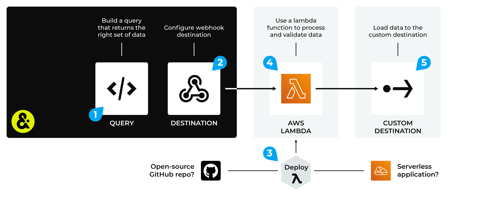

.. https://docs.amperity.com/operator/

.. |destination-name| replace:: custom destination
.. |plugin-namex| replace:: custom destination
.. |what-send| replace:: query results
.. |filter-the-list| replace:: "web"
.. |data-template-name| replace:: |destination-name|
.. |data-template-description| replace:: Send |what-send| to |destination-name|.
.. |data-template-config-settings-list| replace:: settings required by the custom Webhook destination were
.. |data-template-config-settings-list-them-vs-it| replace:: them
.. |sendto-link| replace:: send query results to a custom destination

.. meta::
    :description lang=en:
        Configure Amperity to send data to any webhook.

.. meta::
    :content class=swiftype name=body data-type=text:
        Configure Amperity to send data to any webhook.

.. meta::
    :content class=swiftype name=title data-type=string:
        Configure destination for Webhook

==================================================
Configure destination for Webhook
==================================================

.. term-webhook-destination-start

A webhook destination enables the development of custom integrations with any downstream application or workflow. This destination sends query results to AWS S3 storage and triggers an AWS Lambda function running in any AWS account.

A webhook destination tracks the AWS Lambda function runs and monitors for success using the same tooling as other Amperity-developed integrations. The AWS Lambda function is a template with which you can write custom code, and then send data to your preferred destination.

.. term-webhook-destination-end

.. destination-webhook-steps-to-send-start

This topic describes the steps that are required to send query results to a custom destination using a webhook:

#. :ref:`Use serverless destinations <destination-webhook-serverless>`
#. :ref:`Configure custom destination <destination-webhook-custom>`
#. :ref:`Add webhook destination <destination-webhook-add-destination>`
#. :ref:`Add data template <destination-webhook-add-data-template>`
#. :ref:`Extend the AWS Lambda function <destination-webhook-extend-function>`

.. destination-webhook-steps-to-send-end

.. _destination-webhook-howitworks:

How a webhook destination works
==================================================

.. destination-webhook-howitworks-start

The webhook destination is a broad purpose destination that generates a file in NDJSON format, publishes to Amazon S3, and then provides a pre-signed URL from which that NDJSON file may be downloaded.

After the NDJSON file is generated, the destination will send a request to an AWS Lambda endpoint that exists outside of the Amperity virtual private cloud (VPC).

The Lambda function is built to process and publish the data however it needs. To ensure that Amperity can track the Lambda function, a public endpoint is available, to which regular updates from the Lambda function must be provided.

.. destination-webhook-howitworks-end

.. destination-webhook-howitworks-callouts-start

A webhook destination works like this:

#. Use a query to build a table with data that matches rows, columns, and/or data types that are required by the custom destination.
#. Configure a webhook destination to send data to a Lambda function that is running in AWS Lambda.
#. Deploy a Lambda function to AWS Lambda. The Lambda function may be deployed as a :ref:`serverless application (recommended) <destination-webhook-serverless>` or it may be :ref:`a custom Lambda function that you have built using the open source toolkit provided by Amperity <destination-webhook-custom>`, and then uploaded to AWS Lambda.
#. Configure a webhook destination to send data to a function that runs in AWS Lambda.
#. The Lambda function sends validated results to the custom destination.

.. destination-webhook-howitworks-callouts-end

.. _destination-webhook-serverless:

Serverless destinations
==================================================

.. destination-webhook-serverless-start

Amperity provides a `AWS Serverless Application Repository <https://serverlessrepo.aws.amazon.com/applications>`__ |ext_link| that encapsulates all of the configuration to build your own custom destination.

This template enables two use cases:

#. A serverless application that is deployed directly to your AWS Lambda instance from the `AWS Serverless Application Repository <https://serverlessrepo.aws.amazon.com/applications>`__ |ext_link|. **This is the recommended use case when a serverless application is available for the destination.**
#. A starting point from which you may build a custom Lambda function that is uploaded to your AWS Lambda instance.

Amperity also provides a set of Lambda functions developed using this model that you can use for the following destinations:

* :doc:`Amazon Pinpoint <destination_amazon_pinpoint>`
* :doc:`Amazon Redshift <destination_amazon_redshift>`
* :doc:`Microsoft Dataverse <destination_microsoft_dataverse>`

.. destination-webhook-serverless-end

.. _destination-webhook-custom:

Custom destinations
==================================================

.. destination-webhook-configure-manual-start

A custom destination is configured using a webhook destination and Lambda function. The Lambda function must be able to perform all actions that are required to move the data from Amperity to the custom destination, including validations and/or pre-processing that is required by the custom destination, and including any services, such as Amazon S3, that may be needed in-between Amperity and the custom destination.

.. destination-webhook-configure-manual-end

.. destination-webhook-configure-manual-ndjson-start

.. note:: Amperity sends data to the Lambda function in NDJSON format. This data is staged to an Amazon S3 bucket, after which it is made available to the Lambda function.

.. destination-webhook-configure-manual-ndjson-end

.. destination-webhook-configure-manual-steps-start

To manually configure a custom webhook destination, do each of the following steps:

#. :ref:`Add basic function to your AWS Lambda console <destination-webhook-manual-add-function>`
#. :ref:`Get Lambda function template <destination-webhook-manual-get-template>`
#. :ref:`Upload function to AWS Lambda <destination-webhook-manual-upload-function>`
#. :ref:`Configure function in AWS Lambda <destination-webhook-manual-configure-function>`
#. :ref:`Add the API gateway <destination-webhook-manual-add-gateway>`
#. :ref:`Set AWS Lambda environment variables <destination-webhook-manual-set-variables>`
#. :ref:`Attach policies <destination-webhook-manual-attach-policy>`

.. destination-webhook-configure-manual-steps-end

.. destination-webhook-configure-manual-important-start

.. important:: Your custom destination may require additional steps and/or modifications to the steps described in this topic.

.. destination-webhook-configure-manual-important-end

.. _destination-webhook-manual-add-function:

Add function to AWS Lambda
--------------------------------------------------

.. destination-webhook-manual-add-function-start

Add a basic function to your AWS Lambda console using only the default function without any customization.

**To add a function to AWS Lambda**

#. Log in to your Amazon AWS account.
#. Open the AWS Lambda console, and then click **Create function**.
#. Select **Author from scratch**.
#. Under **Basic information**, specify the function name, runtime, and architecture. For example:

   **Function name** "Amperity function for [custom destination]"

   **Runtime** "Python 3.9"

   **Architecture** "x86_64"

#. Click **Save**.

.. destination-webhook-manual-add-function-end

.. _destination-webhook-manual-get-template:

Get Lambda function template
--------------------------------------------------

.. destination-webhook-manual-get-template-start

Amperity provides a pre-built collection of Lambda functions that is available from an open-source repository on GitHub.

.. note:: Lambda functions are built using Python. Amazon AWS provides runtimes for Python that include an SDK, along with credentials from an AWS Identity and Access Management (IAM) role that you manage.

**To get the Lambda function template**

#. Clone the open source `amperity-lambda-runner <https://github.com/amperity/amperity-lambda-runner>`__ |ext_link| repository or download it as a ZIP file.
#. In the repo, navigate to "/src/lambdas/lambda_handlers/", and then open "template.py".
#. You may use this file as a starting point to support your desired workflow.

.. destination-webhook-manual-get-template-end

.. _destination-webhook-manual-upload-function:

Upload function to AWS Lambda
--------------------------------------------------

.. destination-webhook-manual-upload-function-start

You must upload the application code (and any dependencies) to AWS Lambda as a ZIP file archive.

**To upload a Lambda function to AWS Lambda**

#. Add the application code and dependencies to a ZIP file archive.

   .. tip:: To build a ZIP file, run the following command from your **amperity-lambda-runner** directory:

      .. code-block:: python

         sh util/lambda-build.sh filename=application_name.py

      This will create a ZIP file that contains the following files: **application_name.py**, **amperity_runner.py**, and **helpers.py**, where "application_name" is the name of your Lambda function.

#. Open the AWS Lambda console, and then open the **Code** tab.
#. Click **Upload from**, and then click **ZIP file**.
#. Find the ZIP file archive that contains the application code (and any dependencies), and then click **Upload**.
#. Click **Save**.

.. destination-webhook-manual-upload-function-end

.. _destination-webhook-manual-configure-function:

Configure function in AWS Lambda
--------------------------------------------------

.. destination-webhook-manual-configure-function-start

AWS Lambda must be updated for the name of the custom destination application and to specify a timeout value.

**To configure the Lambda function in AWS Lambda**

#. Open the AWS Lambda console, and then open the **Code** tab.
#. Under **Runtime settings**, select **Edit**.
#. Under **Handler**, add "app.application_name" (where "application_name" is replaced with the name of your application), and then click **Save**.
#. In the AWS Lambda console, open the **Configuration** tab.
#. Under **General configuration**, select **Edit**.
#. Set the **Timeout** value to "15 min 0 sec", and then click **Save**.

.. destination-webhook-manual-configure-function-end

.. _destination-webhook-manual-add-gateway:

Add the API gateway
--------------------------------------------------

.. destination-webhook-manual-add-gateway-start

`Amazon API Gateway <https://docs.aws.amazon.com/lambda/latest/dg/services-apigateway.html>`__ |ext_link| provides tools for creating and documenting web APIs that route HTTP requests to AWS Lambda functions. An API gateway is required to use webhook destinations.

**To add an API gateway**

#. Open the AWS Lambda console.
#. Open the Lambda function for the custom destination.
#. Click **Add trigger**.
#. From the dropdown menu, select "API Gateway", and then select the following:

   .. list-table::
      :widths: 200 400
      :header-rows: 1

      * - Setting
        - Value
      * - Intent
        - Create a new API
      * - API type
        - REST API
      * - Security
        - API Key

#. Click **Add**.

   You will need these values when configuring the webhook destination in Amperity.

.. destination-webhook-manual-add-gateway-end

.. _destination-webhook-manual-set-variables:

Set AWS Lambda environment variables
--------------------------------------------------

.. destination-webhook-manual-set-variables-start

Use AWS Lambda environment variables to provide configuration settings and details to your custom Lambda function.

**To set environment variables**

#. Open the AWS Lambda console.
#. Open the Lambda function for Amazon Redshift.
#. Click **Configuration**.
#. On the **Configuration** page, click **Environment variables**, and then click **Edit**.
#. Click **Add environment variable**, and then define environment variables as key-value pairs.
#. Click **Save**.

.. destination-webhook-manual-set-variables-end

.. _destination-webhook-manual-attach-policy:

Define policies
++++++++++++++++++++++++++++++++++++++++++++++++++

.. destination-webhook-manual-attach-policy-start

When custom destination workflows use services that exist entirely within Amazon AWS you can define inline policies or attach policies.

**To define an inline policy**

#. Open the AWS Lambda console.
#. Open the Lambda function for your custom destination.
#. Click **Configuration**.
#. On the **Configuration** page, under **Execution role**, and then click the name of the role to be used with this Lambda function.
#. Click **Add permissions**, and then click **Create inline policy**, and then define the values for the inline policy.
#. Click **Review policy**, add a name for the policy (like "Amperity Amazon Pinpoint"), and then click **Create policy**.

**To attach policies**

#. Open the AWS Lambda console.
#. Open the Lambda function for your custom destination.
#. Click **Configuration**.
#. On the **Configuration** page, under **Execution role**, and then click the name of the role to be used with this Lambda function.
#. Click **Add permissions**, and then click **Attach policies**, and then select the policies to be attached to this custom destination.
#. Click **Attach policies**.

.. destination-webhook-manual-attach-policy-end

.. _destination-webhook-add-destination:

Add destination
==================================================

.. include:: ../../shared/destinations.rst
   :start-after: .. destinations-add-destinations-webhook-intro-start
   :end-before: .. destinations-add-destinations-webhook-intro-end

**To add a destination**

.. destination-webhook-add-destination-steps-start

#. From the **Destinations** page, open the menu for a destination that is configured for |destination-name|, and then select **Add data template**.

   This opens the **Add Data Template** dialog box.
#. Enter the name of the data template and a description. For example: "|destination-name|" and "Send |what-send| to |destination-name|."

#. Under **Webhook** settings, add the **Label Name**. For example: "|destination-name|".

   .. important:: For custom webhooks, **Webhook Settings** must specify all settings that are required by your Lambda function as JSON. For example:

      ::

         {
           "setting1" : "value",
           "setting2" : "value"
         }

      If your Lambda function does not have any settings *OR* when your Lambda function is deployed as a serverless application, use empty curly braces: "{}".

#. Enable the **Allow customers to use this data template** option, and then enable the **Make available to campaigns** option. This allows users to send campaign results from Amperity to |destination-name|.
#. Verify all template settings and make any required updates.
#. Click **Save**.

.. destination-webhook-add-destination-steps-end

.. _destination-webhook-add-data-template:

Add data template
==================================================

.. include:: ../../shared/terms.rst
   :start-after: .. term-data-template-start
   :end-before: .. term-data-template-end

.. include:: ../../shared/destinations.rst
   :start-after: .. destinations-add-data-template-overview-webhook-orchestrations-start
   :end-before: .. destinations-add-data-template-overview-webhook-orchestrations-end

**To add a data template for orchestrations**

.. destination-webhook-add-data-template-steps-start

.. list-table::
   :widths: 10 90
   :header-rows: 0

   * - .. image:: ../../images/steps-01.png
          :width: 60 px
          :alt: Step 1.
          :align: left
          :class: no-scaled-link
     - .. include:: ../../shared/destinations.rst
          :start-after: .. destinations-data-template-open-template-start
          :end-before: .. destinations-data-template-open-template-end

       .. image:: ../../images/mockup-data-template-tab-add-01-details.png
          :width: 500 px
          :alt: Step 1
          :align: left
          :class: no-scaled-link

       .. include:: ../../shared/destinations.rst
          :start-after: .. destinations-data-template-open-template-name-start
          :end-before: .. destinations-data-template-open-template-name-end

   * - .. image:: ../../images/steps-02.png
          :width: 60 px
          :alt: Step 2.
          :align: left
          :class: no-scaled-link
     - .. include:: ../../shared/destinations.rst
          :start-after: .. destinations-data-template-business-users-start
          :end-before: .. destinations-data-template-business-users-end

       .. image:: ../../images/mockup-data-template-tab-add-02-allow-access.png
          :width: 500 px
          :alt: Step 2.
          :align: left
          :class: no-scaled-link

       .. include:: ../../shared/destinations.rst
          :start-after: .. destinations-data-template-business-users-access-not-configured-start
          :end-before: .. destinations-data-template-business-users-access-not-configured-end

   * - .. image:: ../../images/steps-03.png
          :width: 60 px
          :alt: Step 3.
          :align: left
          :class: no-scaled-link
     - .. include:: ../../shared/destinations.rst
          :start-after: .. destinations-data-template-verify-config-settings-start
          :end-before: .. destinations-data-template-verify-config-settings-end

       .. note:: Serverless destinations (such as :doc:`Amazon Pinpoint <destination_amazon_pinpoint>`, :doc:`Amazon Redshift <destination_amazon_redshift>`, and :doc:`AWS Connect <destination_aws_connect>`) use empty webhook settings: "{ }". A custom webhook will often need to specify a JSON object.

       .. image:: ../../images/mockup-data-template-tab-add-03-settings.png
          :width: 500 px
          :alt: Verify settings for the data template.
          :align: left
          :class: no-scaled-link

       .. include:: ../../shared/destinations.rst
          :start-after: .. destinations-data-template-verify-config-settings-note-start
          :end-before: .. destinations-data-template-verify-config-settings-note-end

   * - .. image:: ../../images/steps-04.png
          :width: 60 px
          :alt: Step 4.
          :align: left
          :class: no-scaled-link
     - .. include:: ../../shared/destinations.rst
          :start-after: .. destinations-data-template-save-start
          :end-before: .. destinations-data-template-save-end

       .. image:: ../../images/mockup-destinations-tab-add-05-save.png
          :width: 500 px
          :alt: Save the data template.
          :align: left
          :class: no-scaled-link

       .. include:: ../../shared/destinations.rst
          :start-after: .. destinations-data-template-save-after-queries-only-start
          :end-before: .. destinations-data-template-save-after-queries-only-end

.. destination-webhook-add-data-template-steps-end

.. _destination-webhook-extend-function:

Extend the AWS Lambda function
==================================================

.. destination-webhook-extend-function-start

Amperity provides an open source toolkit that you can use as a reference when building AWS Lambda functions. This toolkit contains example AWS Lambda functions, an AWS Lambda function you can use as a template, a helper class, and a tools that help you set up and configure your local environment.

**To extend the AWS Lambda function using the Amperity open source toolkit**

#. Open the Amperity open source toolkit: `amperity-lambda-runner <https://github.com/amperity/amperity-lambda-runner>`__ |ext_link|.
#. Follow the steps in the README to configure your environment.
#. Extend your AWS Lambda function to support your custom workflow using Python. You are not required to use the Amperity template as your starting point. You may replace the helper class with your own.
#. Build your AWS Lambda into a ZIP file archive, and then :ref:`upload it AWS Lambda <destination-webhook-manual-upload-function>`.
#. Test the AWS Lambda using a small file and verify the workflow runs as intended.

When the custom destination makes a request to your AWS Lambda function, you should receive a response similar to:

.. code-block:: javascript

   {
     'settings': {},
     'label_name': '',
     'access_token': '',
     'webhook_id': '',
     'callback_url': '',
     'data_url': ''
   }

.. destination-webhook-extend-function-end
