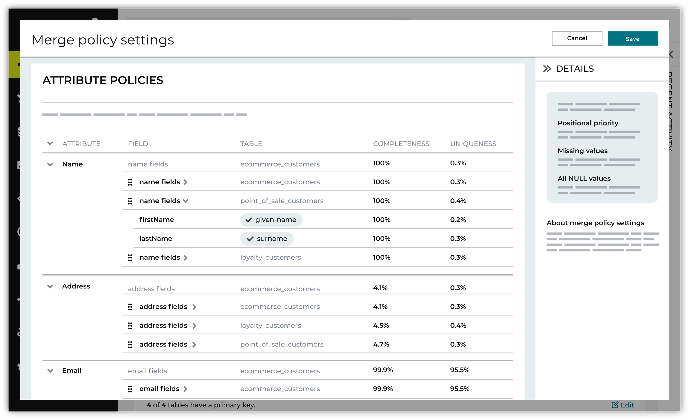

.. https://docs.amperity.com/operator/

.. meta::
    :description lang=en:
        Merge policy defines how the Merged Customers table is maintained by Amperity.

.. meta::
    :content class=swiftype name=body data-type=text:
        Merge policy defines how the Merged Customers table is maintained by Amperity.

.. meta::
    :content class=swiftype name=title data-type=string:
        Merge policy

==================================================
About merge policy
==================================================

.. merge-policy-intro-start

Merge policy defines how the **Merged Customers** table is maintained by Amperity. The **Merged Customers** table collects personally identifiable information (PII) data from all source datasets, and then collapses the best data into a single row that is unique by Amperity ID. Each row in the **Merged Customers** table represents a single customer's best set of profile data.

Use the **Merge policy settings** editor to rank tables with the most reliable sources of customer profile data highest.

.. merge-policy-intro-end

.. _merge-policy-attributes:

Profile attributes
==================================================

.. merge-policy-attributes-start

Source priority can be defined for names, physical addresses, email addresses, phone numbers, birthdates, and gender. Source priority is grouped into the following profile attribute groups.

.. list-table::
   :widths: 30 70
   :header-rows: 1

   * - Profile attribute
     - Semantic tags
   * - **Address**
     - **address**, **address2**, **city**, **state**, **postal**, and **country**

   * - **Birthdate**
     - **birthdate**
   * - **Email**
     - **email**
   * - **Gender**
     - **gender**
   * - **Name**
     - **full-name**, **given-name**, **surname**
   * - **Phone**
     - **phone**

Data sources that contain fields to which profile semantic tags were applied can be assigned a source priority for each profile attribute group. Source priority means that higher ranked data sources will be preferred over lower ranked data sources during the identity resolution process.

.. admonition:: How source priority works

   Tables A, B, and C all contain a field with email addresses to which the **email** semantic tag is applied. They are ranked 1) table A, 2) table B, and 3) table C.

   If the value in table A is "justin@email.com" then the priority for email address is table A and the value "justin@email.com".

   If the value in table A is **NULL** and the value in table B is "justinc@email.com" then the priority for email address is table B and the value "justinc@email.com".

   If the values in tables A and B are **NULL** and the value in table C is "justin.c@email.com" then the priority for email address is table C and the value "justin.c@email.com".

.. merge-policy-attributes-end

**To configure source priority for profile attributes**

.. merge-policy-attributes-steps-start

#. Open the **Profile Builder**
#. For each profile attribute, use the |fa-drag| icon to move the list of tables into the desired order.
#. Click **Save**.

.. merge-policy-attributes-steps-end

.. _merge-policy-source-precedence:

Source table precedence
==================================================

.. merge-policy-source-precedence-start

Source table precedence can also be defined for data sources that contain semantic tags that are not grouped by profile attribute. Precedence determines which tables are more likely to contain high quality customer profile data, as determined by your brand.

The list of domain tables under **Source_Priority** must contain *at least one* domain table that has been made available to Stitch *and* contains fields to which profile semantic tags have been applied.

.. merge-policy-source-precedence-end

**To configure source table precedence**

.. merge-policy-source-priority-steps-start

#. Open the **Profile Builder**
#. Under **Source table precedence**, use the |fa-drag| icon to move the list of tables into the desired order.
#. Click **Save**.

.. merge-policy-source-precedence-steps-end
