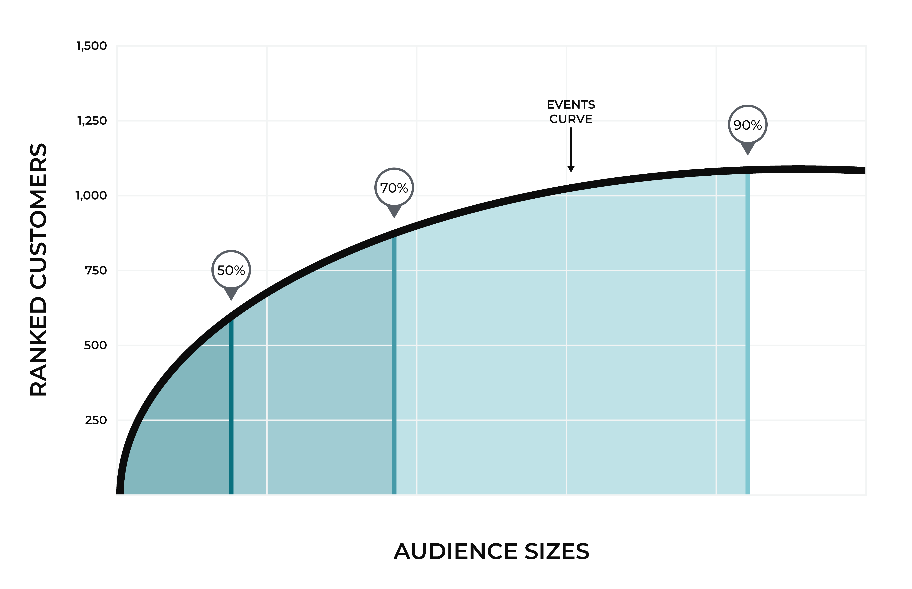

.. https://docs.amperity.com/operator/

.. meta::
    :description lang=en:
        What is the likelihood that a customer will perform a target event within the next 30 days?

.. meta::
    :content class=swiftype name=body data-type=text:
        What is the likelihood that a customer will perform a target event within the next 30 days?

.. meta::
    :content class=swiftype name=title data-type=string:
        Event propensity

==================================================
Event Propensity model
==================================================

.. include:: ../../shared/terms.rst
   :start-after: .. term-event-propensity-start
   :end-before: .. term-event-propensity-end

.. model-event-propensity-about-start

Use event propensity modeling to associate individual customers to specific events that, depending on the type of event, are most likely to lead to engagement with your brand. Customers are grouped by audience size and by ranking.

.. model-event-propensity-about-end

.. _model-event-propensity-use-cases:

Use cases
==================================================

.. model-event-propensity-use-cases-start

The event propensity model enables support for marketing campaigns that benefit from knowing a customer's likelihood to perform a target event, including:

* :ref:`Recommended audience sizes <model-event-propensity-use-cases-recommended-audiences>`
* :ref:`Ranking customers by propensity <model-event-propensity-use-cases-customer-ranking>`

.. model-event-propensity-use-cases-end

.. _model-event-propensity-use-cases-recommended-audiences:

Recommended audience sizes
--------------------------------------------------

.. include:: ../../shared/terms.rst
   :start-after: .. term-recommended-audience-size-events-start
   :end-before: .. term-recommended-audience-size-events-end

.. include:: ../../amperity_reference/source/model_event_propensity.rst
   :start-after: .. model-event-propensity-use-cases-recommended-audiences-about-start
   :end-before: .. model-event-propensity-use-cases-recommended-audiences-about-end

.. include:: ../../amperity_reference/source/model_event_propensity.rst
   :start-after: .. model-event-propensity-recommended-audiences-usecase-start
   :end-before: .. model-event-propensity-recommended-audiences-usecase-end

.. include:: ../../amperity_reference/source/model_event_propensity.rst
   :start-after: .. model-event-propensity-use-cases-recommended-audiences-attributes-start
   :end-before: .. model-event-propensity-use-cases-recommended-audiences-attributes-end

.. _model-event-propensity-use-cases-customer-ranking:

Customer ranking
--------------------------------------------------

.. include:: ../../amperity_reference/source/model_event_propensity.rst
   :start-after: .. model-event-propensity-use-cases-customer-ranking-start
   :end-before: .. model-event-propensity-use-cases-customer-ranking-end

.. include:: ../../amperity_reference/source/model_event_propensity.rst
   :start-after: .. model-event-propensity-use-cases-customer-ranking-attribute-start
   :end-before: .. model-event-propensity-use-cases-customer-ranking-attribute-end

.. _model-event-propensity-configure:

Build an event propensity model
==================================================

.. model-event-propensity-configure-start

You can build event propensity models from the **Predictive models** page. Any database that has a **Merged Customers** table may be configured for event propensity modeling. Unlike churn propensity, predicted CLV, and product affinity, event propensity does not require the **Unified Transactions** or **Unified Itemized Transactions** tables. Instead, you select the event tables to use during model setup. You may build any number of event propensity models in a database.

.. model-event-propensity-configure-end

.. important::

   .. include:: ../../amperity_operator/source/models.rst
      :start-after: .. models-fields-used-by-epm-start
      :end-before: .. models-fields-used-by-epm-end

.. _model-event-propensity-configure-model-types:

Choose a model type
--------------------------------------------------

.. model-event-propensity-configure-model-types-start

When you add an event propensity model you first choose a model type. The four preset types come pre-filled with a name and description, use AmpAI to identify the target event table for you, and set the prediction audience automatically. Choose **Custom event** when the event you want to predict doesn't match a preset; you then provide the target event, prediction audience, and inputs yourself.

.. list-table::
   :widths: 25 45 30
   :header-rows: 1

   * - Model type
     - Predicts
     - Prediction audience
   * - **Loyalty signups**
     - The likelihood that each customer signs up for a loyalty program.
     - One-time event
   * - **Repeat bookings**
     - The likelihood that a customer makes a repeat booking or purchase.
     - Repeat event
   * - **Credit card signups**
     - The likelihood that each customer signs up for a credit card.
     - One-time event
   * - **Email signups**
     - The likelihood that each customer signs up for an email list.
     - One-time event
   * - **Custom event**
     - How likely each customer is to perform an event that you define.
     - Repeat event or one-time event (you choose)

.. model-event-propensity-configure-model-types-end

**To build an event propensity model**

.. model-event-propensity-configure-steps-start

.. list-table::
   :widths: 10 90
   :header-rows: 0

   * - .. image:: ../../images/steps-01.png
          :width: 60 px
          :alt: Step one.
          :align: center
          :class: no-scaled-link
     - Open the **Customer 360** page, and then select the **Predictive models** tab. This opens the **Predictive models** page.

   * - .. image:: ../../images/steps-02.png
          :width: 60 px
          :alt: Step two.
          :align: center
          :class: no-scaled-link
     - Click **Add model**. In the **Select model type** dialog, choose an event propensity model type--**Loyalty signups**, **Repeat bookings**, **Credit card signups**, **Email signups**, or **Custom event**--and then continue. See :ref:`Choose a model type <model-event-propensity-configure-model-types>`.

   * - .. image:: ../../images/steps-03.png
          :width: 60 px
          :alt: Step three.
          :align: center
          :class: no-scaled-link
     - In the **New model** dialog, enter the model details:

       #. Enter a **Name** for the model.

       #. For a preset type, enter a **Symbolic name**--an identifier used to name the model's output tables. For a **Custom event** model, enter a **Target event name**, a descriptive identifier for the event being predicted (for example, ``loyalty_signup`` or ``hotel_booking``).

       #. Optionally, enter a **Description**.

       #. Under **Target event**, select the **Event table** that contains the target event and the **Event date field** that records when the event occurred. Click **Select with AmpAI** to have AmpAI identify the target event table for you.

          .. note:: Only tables that contain an **amperity_id** field and at least one date (or datetime) field are eligible to use as the target event table.

       #. For a **Custom event** model, choose a **Prediction audience**:

          * **Customers who have completed this action at least once** (a repeat event)
          * **Customers who have not yet completed this action** (a one-time event)

          For preset types the prediction audience is set automatically.

       Click **Create**. This opens the **New version** dialog.

   * - .. image:: ../../images/steps-04.png
          :width: 60 px
          :alt: Step four.
          :align: center
          :class: no-scaled-link
     - On the **General** tab of the **New version** dialog, enter a version **Name** and an optional **Note** to document the version.

   * - .. image:: ../../images/steps-05.png
          :width: 60 px
          :alt: Step five.
          :align: center
          :class: no-scaled-link
     - Configure **Input events**. Add revenue fields and additional events to improve predictions. For each input event:

       #. Select a **Table**. The table must contain one row per event occurrence.
       #. Select an **Event date** field. This must be a date or datetime field.
       #. (Optional) Select a **Revenue field**, a numeric field that captures the revenue generated by the event. Revenue-generating events improve predictions.
       #. (Optional) Select a **Realization date** for events where revenue is generated at one point in time but realized at another, such as a booking (generation) versus a stay (realization).
       #. (Optional) Add **Properties**--string fields used to generate categorical features for the model (for example, max, mean, most recent, and most common values).

       Click **Add input event** to add another event.

       .. note:: At least one input event is required for one-time-event models and is recommended for repeat-event models.

   * - .. image:: ../../images/steps-06.png
          :width: 60 px
          :alt: Step six.
          :align: center
          :class: no-scaled-link
     - (Optional) Open the **Advanced** tab to configure:

       * **Customer exclusions**: Exclude customers based on boolean fields in the **Customer Attributes** table. For example, exclude employees of your brand or resellers of products within your brand's product catalog.

       * **Alert when evaluation is complete**: Send an email to one or more addresses when the evaluation workflow finishes.

   * - .. image:: ../../images/steps-07.png
          :width: 60 px
          :alt: Step seven.
          :align: center
          :class: no-scaled-link
     - Click **Evaluate**. Amperity creates the model version and starts an evaluation workflow that backtests the model and reports the average recall and precision improvement for the version.

.. model-event-propensity-configure-steps-end

.. model-event-propensity-configure-output-start

After a model version passes evaluation, activate the model to begin generating predictions. See :ref:`predictive model how-tos <models-howtos>` for the steps to activate a model.

An active model produces a **Predicted Propensity** table named ``Predicted_Propensity_{EventName}``, where ``{EventName}`` is generated based on the target event name provided during model creation. The fields in this table are :ref:`available in segments <model-event-propensity-segments>`.

.. model-event-propensity-configure-output-end

.. _model-event-propensity-configure-examples:

Examples
--------------------------------------------------

.. model-event-propensity-configure-examples-start

The following examples show how to set up the four preset model types and several custom events, including the example tables and fields to use for each (note: some of these tables and fields are optional). Every event table must have one row per event occurrence and must contain an ``amperity_id`` field and a date field. Date fields do not need a specific name--you select the date column during setup.

.. _model-event-propensity-configure-examples-loyalty:

Loyalty sign-ups
~~~~~~~~~~~~~~~~~~~~~~~~~~~~~~~~~~~~~~~~~~~~~~~~~~~~

Predicts the likelihood that each customer signs up for a loyalty program.

* **Model type:** Loyalty sign-ups (preset)
* **Prediction audience:** One-time event

Use a target event table with one row per loyalty sign-up:

.. list-table:: ``Loyalty_Signups`` (target event)
   :widths: 25 25 25 25
   :header-rows: 1

   * - amperity_id
     - signup_date
     - loyalty_tier
     - signup_channel
   * - abc-123
     - 2025-03-15
     - Gold
     - web
   * - def-456
     - 2025-04-02
     - Silver
     - in_store
   * - ghi-789
     - 2025-04-18
     - Gold
     - mobile_app

At least one input event is required. An input event that includes revenue data works well:

.. list-table:: ``Flight_Bookings`` (input event)
   :widths: 20 20 20 20 20
   :header-rows: 1

   * - amperity_id
     - booking_date
     - fare_amount
     - seat_class
     - booking_channel
   * - abc-123
     - 2025-01-08
     - 420.00
     - economy
     - web
   * - abc-123
     - 2025-02-22
     - 1250.00
     - business
     - mobile_app
   * - def-456
     - 2025-03-10
     - 380.00
     - economy
     - call_center

**Recommended for better predictions:**

* Revenue fields on input events where available (for example, ``fare_amount`` or an ancillary ``purchase_amount``).
* String properties on the target event (for example, ``loyalty_tier``, ``signup_channel``) and on input events (for example, ``seat_class``, ``booking_channel``).
* Other input events to consider: ancillary purchases, email engagement, check-ins, cancellations, upgrades, lounge visits, in-flight purchases, mobile app sessions, customer service interactions, survey responses, and co-brand credit card transactions.

.. _model-event-propensity-configure-examples-repeat-bookings:

Repeat bookings
~~~~~~~~~~~~~~~~~~~~~~~~~~~~~~~~~~~~~~~~~~~~~~~~~~~~

Predicts the likelihood that a customer makes a repeat booking or purchase.

* **Model type:** Repeat bookings (preset)
* **Prediction audience:** Repeat event

Use a target event table with one row per booking. Because bookings generate revenue, add a revenue field:

.. list-table:: ``Hotel_Bookings`` (target event)
   :widths: 18 18 18 18 18
   :header-rows: 1

   * - amperity_id
     - booking_date
     - property_type
     - booking_channel
     - booking_revenue
   * - abc-123
     - 2025-01-10
     - resort
     - web
     - 450.00
   * - abc-123
     - 2025-06-22
     - urban
     - mobile_app
     - 220.00
   * - def-456
     - 2025-03-05
     - resort
     - phone
     - 380.00

Input events are optional for repeat-event models, but recommended:

.. list-table:: ``Loyalty_Activity`` (input event)
   :widths: 25 25 25 25
   :header-rows: 1

   * - amperity_id
     - activity_date
     - activity_type
     - points_earned
   * - abc-123
     - 2025-02-15
     - points_redemption
     - -500
   * - abc-123
     - 2025-04-01
     - tier_upgrade
     - 0
   * - def-456
     - 2025-01-20
     - points_earn
     - 200

**Recommended for better predictions:**

* A revenue field on the target event table (for example, ``booking_revenue``).
* String properties on the target event (for example, ``property_type``, ``booking_channel``) and on input events (for example, ``activity_type``).
* Other input events to consider: restaurant or spa reservations, room service orders, room upgrades, loyalty point redemptions, email engagement, website browsing sessions, mobile app check-ins, customer service interactions, and guest reviews.

.. _model-event-propensity-configure-examples-credit-card:

Credit card sign-ups
~~~~~~~~~~~~~~~~~~~~~~~~~~~~~~~~~~~~~~~~~~~~~~~~~~~~

Predicts the likelihood that each customer signs up for a credit card.

* **Model type:** Credit card sign-ups (preset)
* **Prediction audience:** One-time event

Use a target event table with one row per credit card sign-up:

.. list-table:: ``Credit_Card_Signups`` (target event)
   :widths: 33 33 33
   :header-rows: 1

   * - amperity_id
     - signup_date
     - card_type
   * - abc-123
     - 2025-02-20
     - rewards
   * - def-456
     - 2025-05-11
     - cashback

At least one input event is required. A transactions table works well:

.. list-table:: ``Transactions`` (input event)
   :widths: 25 25 25 25
   :header-rows: 1

   * - amperity_id
     - transaction_date
     - transaction_amount
     - payment_method
   * - abc-123
     - 2025-01-12
     - 210.00
     - debit
   * - abc-123
     - 2025-03-05
     - 75.00
     - debit
   * - def-456
     - 2025-02-28
     - 320.00
     - credit

**Recommended for better predictions:**

* A revenue field on the input event table (for example, ``transaction_amount``).
* String properties on the target event (for example, ``card_type``) and on input events (for example, ``payment_method``).
* Other input events to consider: purchase history, store visits, website browsing sessions, mobile app sessions, email engagement, customer service interactions, loyalty program activity, and financial product inquiries.

.. _model-event-propensity-configure-examples-email:

Email sign-ups
~~~~~~~~~~~~~~~~~~~~~~~~~~~~~~~~~~~~~~~~~~~~~~~~~~~~

Predicts the likelihood that each customer signs up for an email list.

* **Model type:** Email sign-ups (preset)
* **Prediction audience:** One-time event

Use a target event table with one row per email sign-up:

.. list-table:: ``Email_Signups`` (target event)
   :widths: 25 25 25 25
   :header-rows: 1

   * - amperity_id
     - signup_date
     - signup_source
     - email_list
   * - abc-123
     - 2025-01-05
     - checkout
     - weekly_deals
   * - def-456
     - 2025-02-14
     - homepage_banner
     - new_arrivals

At least one input event is required. An orders table works well:

.. list-table:: ``Orders`` (input event)
   :widths: 25 25 25 25
   :header-rows: 1

   * - amperity_id
     - order_date
     - order_revenue
     - product_category
   * - abc-123
     - 2024-11-25
     - 55.00
     - home_goods
   * - def-456
     - 2025-01-03
     - 89.00
     - apparel
   * - def-456
     - 2025-02-10
     - 112.00
     - electronics

**Recommended for better predictions:**

* A revenue field on the input event table (for example, ``order_revenue``).
* String properties on the target event (for example, ``signup_source``, ``email_list``) and on input events (for example, ``product_category``).
* Other input events to consider: purchase history, website browsing sessions, mobile app sessions, store visits, account creation events, SMS opt-ins, loyalty program activity, cart abandonment events, and product reviews.

.. _model-event-propensity-configure-examples-custom:

Custom events
~~~~~~~~~~~~~~~~~~~~~~~~~~~~~~~~~~~~~~~~~~~~~~~~~~~~

Use the **Custom event** model type when the event you want to predict doesn't match a preset. You provide the target event name, target event table, prediction audience, and all input events yourself.

**Subscription renewal**--predict whether existing subscribers will renew.

* **Prediction audience:** Repeat event
* **Target event name:** ``subscription_renewal``

.. list-table:: ``Subscription_Renewals`` (target event)
   :widths: 25 25 25 25
   :header-rows: 1

   * - amperity_id
     - renewal_date
     - plan_type
     - renewal_channel
   * - abc-123
     - 2025-01-15
     - annual
     - auto
   * - abc-123
     - 2026-01-15
     - annual
     - auto
   * - def-456
     - 2025-06-01
     - monthly
     - manual

Recommended input events: an ``Orders`` table (with ``order_revenue`` and ``product_category``) and a ``Support_Tickets`` table (with a ``ticket_category`` property).

**Store visit**--predict which customers are likely to visit a physical store for the first time.

* **Prediction audience:** One-time event
* **Target event name:** ``store_visit``

.. list-table:: ``Store_Visits`` (target event)
   :widths: 33 33 33
   :header-rows: 1

   * - amperity_id
     - visit_date
     - store_region
   * - abc-123
     - 2025-03-10
     - northeast
   * - def-456
     - 2025-04-22
     - west

Recommended input event: an ``Online_Orders`` table with ``order_revenue`` and a ``fulfillment_type`` property.

**Webinar attendance**--predict which customers are likely to attend a webinar.

* **Prediction audience:** Repeat event (for customers who have attended before) or one-time event (for first-time attendees)
* **Target event name:** ``webinar_attendance``

.. list-table:: ``Webinar_Attendance`` (target event)
   :widths: 33 33 33
   :header-rows: 1

   * - amperity_id
     - attendance_date
     - webinar_topic
   * - abc-123
     - 2025-02-01
     - product_demo
   * - abc-123
     - 2025-04-15
     - best_practices
   * - def-456
     - 2025-03-10
     - onboarding

.. model-event-propensity-configure-examples-end

.. _model-event-propensity-configure-tips:

Tips
--------------------------------------------------

.. model-event-propensity-configure-tips-start

* **Start small and iterate.** Begin with the minimum required data--the target event and one input event--to deliver value quickly, and then add inputs to improve performance.
* **More data is better.** Adding input events meaningfully improves predictions. Events that include revenue data are especially valuable.
* **Add string properties.** Fields like brand, category, channel, or region give the model categorical signal. Add them as properties when available.
* **Check date field types.** Event date fields must be a date or datetime type. If a date is stored as a string, cast it in the table schema first.
* **Use one row per event.** Event tables must have one row per event occurrence, not one row per customer. Data that is aggregated to the customer level cannot be used as an event table.
* **Use one table per event type.** Each event type must have its own table. For example, keep flight bookings and seat upgrades in separate tables.
* **Use a preset when it fits.** Preset model types auto-identify the target event table with AmpAI, which saves setup time. Use **Custom event** only when no preset matches.

.. model-event-propensity-configure-tips-end

.. _model-event-propensity-segments:

Use in segments
==================================================

.. model-event-propensity-segments-start

The following table describes the fields that are available when using event propensity modeling in segments.

.. model-event-propensity-segments-end

.. include:: ../../amperity_reference/source/data_tables.rst
   :start-after: .. data-tables-event-propensity-table-start
   :end-before: .. data-tables-event-propensity-table-end
