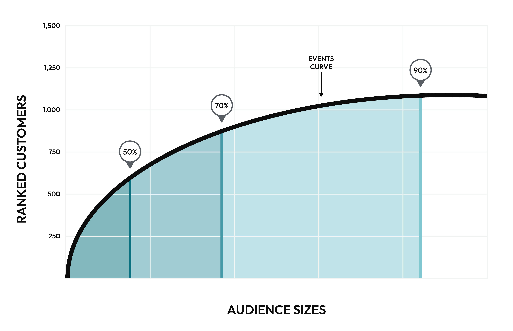

.. https://docs.amperity.com/internal/

.. meta::
    :description lang=en:
        What is the likelihood that a customer will perform a revenue-generating event within the next 30 days?

.. meta::
    :content class=swiftype name=body data-type=text:
        What is the likelihood that a customer will perform a revenue-generating event within the next 30 days?

.. meta::
    :content class=swiftype name=title data-type=string:
        Event propensity

==================================================
Event propensity model
==================================================

.. include:: ../../shared/terms.rst
   :start-after: .. term-event-propensity-start
   :end-before: .. term-event-propensity-end

.. model-event-propensity-about-start

Use event propensity modeling to associate individual customers to specific events that, depending on the type of event, are most likely to lead to engagement with your brand. Customers are grouped by audience size and by ranking.

.. model-event-propensity-about-end

.. TODO: This whole model seems kinda broken. Or very non-intuitive. If I just follow what the config asks me to do, say select UIT table or Transaction Attributes table, there's a datetime field and then I have to pick the same table again and use the same fields why? but then I can't actually start the validation so dunno. I don't know how this one is supposed to work at all and I can't imagine a customer muddling their way through the current config. Docs won't save them.

.. TODO: This aligns to the old Custora "“Predict Anything” (General Event-based Modeling): Custora uses an autonomous machine learning pipeline to predict any binary behavior (e.g., opening a store credit card, joining the loyalty program). This approach consists of maintaining a basket of different probabilistic models, which are automatically fitted on the incoming data stream – and dynamically evaluated for accuracy and model performance." no?

.. _model-event-propensity-use-cases:

Use cases
==================================================

.. model-event-propensity-use-cases-start

The event propensity model enables support for marketing campaigns that benefit from knowing a customer's likelihood to perform a revenue-generating event, including:

#. :ref:`Recommended audience sizes <model-event-propensity-use-cases-recommended-audiences>`
#. :ref:`Ranking customers by propensity <model-event-propensity-use-cases-customer-ranking>`

.. model-event-propensity-use-cases-end

.. _model-event-propensity-use-cases-recommended-audiences:

Recommended audience sizes
--------------------------------------------------

.. include:: ../../shared/terms.rst
   :start-after: .. term-recommended-audience-size-start
   :end-before: .. term-recommended-audience-size-end

.. model-event-propensity-use-cases-recommended-audiences-about-start

Recommended audience sizes are calculated for 30-day window. An event curve is generated, along with corresponding audience sizes that show what size audience is required to capture 50%, 70%, and 90% of purchases for a given revenue-generating event during the previous 30 days.

Audience sizes are inclusive of all smaller audience sizes.

* A medium audience size (70%) includes all of your customers who are in the small audience size (50%).
* A large audience size (90%) includes all of your customers who are in the small and medium audiences.

.. model-event-propensity-use-cases-recommended-audiences-about-end

.. model-event-propensity-recommended-audiences-usecase-start

Recommended audience sizes for event propensity modeling identify customers who are most likely to perform a revenue-generating event. Use recommended audience sizes to find customers who are likely to:

* Join your brand's loyalty program
* Sign up for your brand's credit card
* Make a repeat booking for a car rental, airline ticket, or hotel stay

.. model-event-propensity-recommended-audiences-usecase-end

.. model-event-propensity-use-cases-recommended-audiences-attributes-start

Attributes for recommended audience sizes are available from the **Event Propensity** table:

.. list-table::
   :widths: 35 65
   :header-rows: 1

   * - Attribute Name
     - Description
   * - **Audience Size Small**
     - A small audience is predicted to incude ~50% of customers who are likely to perform a revenue-generating event.
   * - **Audience Size Medium**
     - A medium audience is predicted to include ~70%of customers who are likely to perform a revenue-generating event
   * - **Audience Size Large**
     - A large audience is predicted to include ~90%of customers who are likely to perform a revenue-generating event

Combine these attributes with the **Target Event** attribute to build audiences for a specific revenue-generating event. You can access these attributes directly from the segment editor.

.. model-event-propensity-use-cases-recommended-audiences-attributes-end

.. _model-event-propensity-use-cases-customer-ranking:

Customer ranking
--------------------------------------------------

.. model-event-propensity-use-cases-customer-ranking-start

Use customer ranking to define an audience using the top N customers. Use customer ranking as an alternate to recommended audience sizes when an audience is too large (or small) or if a recommended audience size is unavailable for a specific event.

.. model-event-propensity-use-cases-customer-ranking-end

.. model-event-propensity-use-cases-customer-ranking-attribute-start

The **Ranking** attribute in the **Event Propensity** table ranks customer scores by event. A rank that is less than or equal to X will provide the top N customers with a propensity for this event. Combine this attribute with the **Target Event** attribute to build customer rankings for a specific revenue-generating event. You can access this attribute directly from the segment editor.

.. model-event-propensity-use-cases-customer-ranking-attribute-end

.. _model-event-propensity-configure:

Build an event propensity model
==================================================

.. model-event-propensity-configure-start

You can build an event propensity model from the **Customer 360** page. Each database that is a "customer 360" database and contains the **Merged Customers**, **Unified Itemized Transactions**, and **Unified Transactions** tables may be configured for predictive modeling. You may use other tables in that database that are unique by Amperity ID to extend predictive models.

.. model-event-propensity-configure-end

.. important:: 

   .. include:: ../../amperity_operator/source/models.rst
      :start-after: .. models-fields-used-by-epm-start
      :end-before: .. models-fields-used-by-epm-end

**To build an event propensity model**

.. model-event-propensity-configure-steps-start

.. list-table::
   :widths: 10 90
   :header-rows: 0

   * - .. image:: ../../images/steps-01.png
          :width: 60 px
          :alt: Step 1.
          :align: left
          :class: no-scaled-link
     - Open the **Customer 360** page, select a database, and then open the bottom (|fa-kebab|) menu and select **Predictive models**. This opens the **Predictive models page**.

   * - .. image:: ../../images/steps-02.png
          :width: 60 px
          :alt: Step 2.
          :align: left
          :class: no-scaled-link
     - Next to **Event propensity**, click **Add model**.

       Assign a name to the event for which event propensity modeling will be built, and then click **Continue**. This opens the **Predictive enablement** page for predicted CLV models.

   * - .. image:: ../../images/steps-03.png
          :width: 60 px
          :alt: Step 3.
          :align: left
          :class: no-scaled-link
     - Configure the target event.

       #. From the **Target event table** dropdown, select the table in which the event for which event propensity modeling will be built.
       #. From the **Target event date** dropdown, select the field that contains the date on which the target event occurs.
       #. If this event is a repeating event enable the **Repeat event** checkbox.

   * - .. image:: ../../images/steps-04.png
          :width: 60 px
          :alt: Step 4.
          :align: left
          :class: no-scaled-link
     - Use the **Customer exclusions** field to use fields in the **Customer Attributes** table to identify customers who have purchase patterns that should be excluded from event propensity modeling.

       For example, use cases for customer exclusions include:

       #. Ensuring that employees of your brand or resellers of products within your brand's product catalog are excluded.

       #. Excluding customers who do not have a contactable email address or contactable physical address from direct mail campaigns.

       .. note:: The list of fields in the **Customer Attributes** table that may be used for pCLV modeling are listed in the dropdown. Not all fields in the **Customer Attributes** table may be used with pCLV modeling.

   * - .. image:: ../../images/steps-05.png
          :width: 60 px
          :alt: Step 5.
          :align: left
          :class: no-scaled-link
     - Configure revenue events.

       #. From the **Revenue event table** dropdown, select the table in which revenue-generating events are located.
       #. From the **Revenue event date** dropdown, select the field that contains the date on which the regenue-generating event occurs.
       #. From the **Revenue event realization date** dropdown, select the field that differentiates between revenue generation and realization. For example, a hotel booking (generation) and a hotel stay (realization).
       #. From the **Event revenue** dropdown, select the field that captures the revenue from the realized event date.

   * - .. image:: ../../images/steps-06.png
          :width: 60 px
          :alt: Step 6.
          :align: left
          :class: no-scaled-link
     - Use the **Additional event** field to add more events to the event propensity model.

       For each additional event, select an event table, and event date field, and additional features in that table that should be associated to the event.

   * - .. image:: ../../images/steps-07.png
          :width: 60 px
          :alt: Step 7.
          :align: left
          :class: no-scaled-link
     - Click **Start validation**.

.. model-event-propensity-configure-steps-end

.. _model-event-propensity-segments:

Use in segments
==================================================

.. model-event-propensity-segments-start

The following table describes the fields that are available when using event propensity modeling in segments.

.. model-event-propensity-segments-end

.. include:: ../../amperity_reference/source/data_tables.rst
   :start-after: .. data-tables-event-propensity-table-start
   :end-before: .. data-tables-event-propensity-table-end
