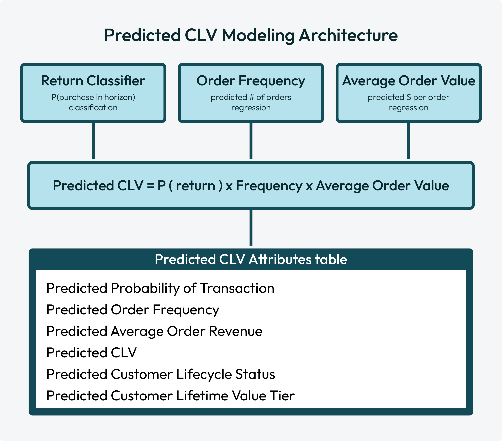

.. https://docs.amperity.com/operator/

.. meta::
    :description lang=en:
        Predicted CLV modeling predicts expected revenue, likelihood of purchase, and customer value using a return classifier and regressions for order frequency and average order value.

.. meta::
    :content class=swiftype name=body data-type=text:
        Predicted CLV modeling predicts expected revenue, likelihood of purchase, and customer value using a return classifier and regressions for order frequency and average order value.

.. meta::
    :content class=swiftype name=title data-type=string:
        Predicted CLV model

==================================================
Predicted CLV model
==================================================

.. include:: ../../shared/terms.rst
   :start-after: .. term-pclv-start
   :end-before: .. term-pclv-end

.. _model-predicted-clv-about:

About predicted CLV models
==================================================

.. model-predicted-clv-about-start

The predicted CLV model predicts the expected revenue for each customer, likelihood of purchasing, and their value relative to other customers over a future time window (the "prediction horizon," typically the next 365 days). Rather than relying on a single model for this complex prediction, pCLV breaks the problem into three simpler, independently trained machine learning models that are then combined to produce the final prediction.

A customer's future value is a function of three questions:

#. **Will they come back?** The Return Classifier predicts the probability that a customer will make at least one purchase during the prediction horizon.
#. **How often will they buy?** The Order Frequency Regressor predicts how many orders a returning customer will place during the prediction horizon.
#. **How much will they spend per order?** The Average Order Value Regressor predicts the average revenue per order for the customer.

.. model-predicted-clv-about-end

.. _model-predicted-clv-howitworks:

How predicted CLV works
==================================================

.. model-predicted-clv-howitworks-start

The predicted CLV model is an `ensemble learning method <https://en.wikipedia.org/wiki/Ensemble_learning>`__ |ext_link| with three independently trained submodels: a :ref:`return classifier <model-predicted-clv-howitworks-return-classifier>`, an :ref:`order frequency regression <model-predicted-clv-howitworks-order-frequency>`, and an :ref:`average order value regression <model-predicted-clv-howitworks-aov>`. Each individual model contributes independently to the predicted CLV model's output: :ref:`predicted CLV scores <model-predicted-clv-howitworks-scores>`.

.. model-predicted-clv-howitworks-end

.. _model-predicted-clv-howitworks-return-classifier:

Return classifier
--------------------------------------------------

.. model-predicted-clv-howitworks-return-classifier-start

The return classifier submodel predicts the probability that a customer will make at least one purchase during the prediction horizon. This is a binary classification: will a customer return or not return? The prediction is output as a probability score between 0 and 1.

.. note:: Customers with a very low return probability have a low predicted CLV regardless of other factors.

.. model-predicted-clv-howitworks-return-classifier-end

.. _model-predicted-clv-howitworks-order-frequency:

Order frequency regression
--------------------------------------------------

.. model-predicted-clv-howitworks-order-frequency-start

The order frequency regression submodel predicts how many orders a returning customer will place during the prediction horizon, and then outputs a continuous number. For example: 3.2.

.. model-predicted-clv-howitworks-order-frequency-end

.. _model-predicted-clv-howitworks-aov:

Average order value regression
--------------------------------------------------

.. model-predicted-clv-howitworks-aov-start

The average order value regression submodel predicts the average revenue per order for the customer, and then outputs a dollar amount. For example: "$85.40".

.. model-predicted-clv-howitworks-aov-end

.. _model-predicted-clv-howitworks-scores:

Predicted CLV scores
--------------------------------------------------

.. model-predicted-clv-howitworks-scores-start

The :ref:`return classifier <model-predicted-clv-howitworks-return-classifier>`, :ref:`order frequency regression <model-predicted-clv-howitworks-order-frequency>`, and :ref:`average order value regression <model-predicted-clv-howitworks-aov>` submodels are combined with a multiplicative ensemble:

.. code-block:: none

   Predicted CLV = P(return) x Predicted Order Frequency x Predicted Avg Order Value

A customer with a high probability of return but low order frequency and modest order value have a moderate CLV, while a customer who is likely to return and spend has a high CLV.

After raw scores are computed, a sigmoid rescaling step compresses extreme outlier predictions to produce a smoother distribution of values.

Use predicted CLV modeling to build high-value audiences that identify:

* Which customers have the highest predicted value?
* Which customers are better candidates for winback offers?
* Which customers are candidates for cultivating customer value?

.. model-predicted-clv-howitworks-scores-end

.. _model-predicted-clv-use-cases:

Use cases
==================================================

.. model-predicted-clv-use-cases-start

The predicted CLV model helps you identify your highest value customers by year or by value tier:

#. :ref:`How much will customers spend in the next year? <model-predicted-clv-use-case-spend>`
#. :ref:`Which customers are your most valuable customers? <model-predicted-clv-use-cases-most-valuable>`

.. model-predicted-clv-use-cases-end

.. _model-predicted-clv-use-case-spend:

How much will customers spend?
--------------------------------------------------

.. model-predicted-clv-use-cases-spend-start

The **Predicted CLV Next 365 Days** attribute in the **Predicted CLV Attributes** table has the total predicted customer spend over the next 365 days. You can access this attribute directly from the **Segment Editor**.

After you select this attribute you can specify the type of values you want to use for this audience, such as:

* Predicted CLV is greater than $100
* Predicted CLV is less than $400
* Predicted CLV is between $100 and $400

.. model-predicted-clv-use-cases-spend-end

.. _model-predicted-clv-use-cases-most-valuable:

Which customers are the most valuable?
--------------------------------------------------

.. usecase-predicted-top-10-percent-start

When predictive modeling is enabled for your tenant you can use output from the |predicted customer lifetime value (CLV) model|, which helps you identify your highest value customers by value tier. Each tier represents a percentile grouping of customers by predicted value:

* Platinum represents the top 1%
* Gold represents customers who fall between 1% and 5%
* Silver represents customers who fall between 5% and 10%

Select all three of these predicted value tiers to build an audience that has customers who are predicted to be in your top 10% (inclusive) high value customers.

.. usecase-predicted-top-10-percent-end

.. _model-predicted-clv-build:

Build a predicted CLV model
==================================================

.. model-predicted-clv-build-start

You can build a predicted CLV model from the **Customer 360** page. Any database that has the **Merged Customers**, **Unified Itemized Transactions**, and **Unified Transactions** tables may be configured for predictive modeling.

.. model-predicted-clv-build-end

.. important::

   .. include:: ../../amperity_operator/source/models.rst
      :start-after: .. models-fields-used-by-all-models-table-start
      :end-before: .. models-fields-used-by-all-models-table-end

**To build a predicted CLV model**

#. :ref:`Select model, create version <model-predicted-clv-build-create-version>`
#. :ref:`Choose lookback window <model-predicted-clv-build-lookback>`
#. :ref:`Configure global hyperparameters <model-predicted-clv-build-hyperparameters-global>`
#. :ref:`Configure hyperparameters for submodels <model-predicted-clv-build-hyperparameters>`
#. :ref:`Evaluate versions <model-predicted-clv-build-evaluate-version>`
#. :ref:`Choose version <model-predicted-clv-build-choose-version>`

.. _model-predicted-clv-build-create-version:

Select model, create version
--------------------------------------------------

.. model-predicted-clv-build-create-version-start

Open the **Customer 360** page, and then select the **Predictive models** tab. This opens the **Predictive models** page.

Click the **Add model** button and select **Predicted customer lifetime value (pCLV)**. In the **New model** dialog assign a name to the model and add a description.

From the **Prediction horizon** dropdown select the number of days into the future for which predictions are made: **90 days**, **180 days**, or **365 days** (default).

.. model-predicted-clv-build-create-version-end

.. _model-predicted-clv-build-lookback:

Choose lookback window
--------------------------------------------------

.. model-predicted-clv-build-lookback-start

The lookback window defines the number of years of historical data to use for training the predicted CLV model. Choose one of **4 years**, **5 years**, or **6 years**.

.. model-predicted-clv-build-lookback-end

.. _model-predicted-clv-build-hyperparameters-global:

Configure global hyperparameters
--------------------------------------------------

.. model-predicted-clv-version-settings-start

Select the **Advanced** tab to configure the global hyperparameters.

.. important:: Global hyperparameters for predicted CLV modeling are *only* configurable during initial version setup.

**Max training size** defines the maximum number of customer records to use when training the model. Larger values increase processing time.

Enable **Balance labels** to downsample the majority class and upsample the minority class.

Enable **Filter outliers** to exclude outliers from model training.

Use the **Customer exclusions** dropdown to configure a list of fields from the :doc:`Customer Attributes table <table_customer_attributes>`. Customer profiles that match a selected field from the **Customer Attributes** table are excluded from predictive CLV modeling output.

.. model-predicted-clv-version-settings-end

.. _model-predicted-clv-build-hyperparameters:

Configure hyperparameters for submodels
--------------------------------------------------

.. model-predicted-clv-build-hyperparameters-start

Hyperparameters for submodels are configured from the **Advanced** tab. Expand **Predicted probability of transaction**, **Predicted order frequency**, and **Predicted average order value** to configure hyperparameters for each submodel. When finished, click **Evaluate**.

.. important:: Hyperparameters for submodels are *only* configurable during initial version setup.

.. model-predicted-clv-build-hyperparameters-end

.. model-predicted-clv-build-hyperparameters-settings-start

Components of predictive CLV modeling have the following hyperparameters:

.. list-table::
   :widths: 20 20 60
   :header-rows: 1

   * - Parameter
     - Default
     - Description

   * - **Elastic net parameter**
     - 0.0
     - Applies to **Logistic regression** model types.

       Controls the mixing ratio for L1 regularization, also known as `LASSO <https://en.wikipedia.org/wiki/Lasso_(statistics)>`__ |ext_link|, and L2 regularization, also known as `ridge regression <https://en.wikipedia.org/wiki/Ridge_regression>`__ |ext_link| applied to `elastic net regression <https://en.wikipedia.org/wiki/Elastic_net_regularization>`__ |ext_link|.

       Range: 0.0 to 1.0.

       * A value of "0.0" applies only L2 regularization. Weights are penalized proportional to their square, which shrinks weights toward zero.
       * Values between 0.0 and 1.0 blend L1 and L2 regularization. A value closer to "0.0" encourages a smaller and more even distribution of weights. A value closer to "1.0" leads to sparse models.
       * A value of "1.0" applies only L1 regularization. Weights are penalized proportional to their absolute value.

   * - **Feature subset strategy**
     - Auto
     - Applies to **Random forest** and **Gradient boosted trees** model types.

       The random forest model is intentionally trained on a random subset of features at each split to ensure that each tree within the random forest is different.

       The value for **Feature subset strategy** determines how features are split into random subsets.

       Possible values:

       .. list-table::
          :widths: 30 70
          :header-rows: 1

          * - Strategy
            - Description

          * - **All**
            - All features are in all splits. Use only for small feature sets or to ensure random forest classifier outputs are not random.

          * - **Auto**
            - Default. Allow the random forest classifier to choose the feature subset strategy.

          * - **Log2**
            - Use a base 2 `binary logarithm <https://en.wikipedia.org/wiki/Binary_logarithm>`__ |ext_link| to determine the split. For example, if there are 100 features, the split is ~7.

          * - **One third**
            - Use one third of features to determine the split. For example, if there are 100 features, the split is 33.

          * - **Square root**
            - Use the square root of features to determine the split. For example, if there are 100 features, the split is 10.

   * - **Fit intercept**
     - Enabled
     - Applies to **Logistic regression** model types.

       Enable **Fit intercept** to include a bias term, which is a constant added to predictive CLV modeling regardless of feature values.

       When **Fit intercept** is disabled the predictive CLV modeling predicts zero when all features are zero. 

   * - **Impurity**
     - Gini
     - Applies to **Random forest** model types for the **Predicted probability of transaction** submodel.

       The predictive CLV model uses impurity to evaluate the quality of a candidate split at each node.

       For example: "Customers with more than 3 orders in the last 90 days" go into one branch of the split and "Everyone else" goes into the other. Impurity measures if the split produces more homogenous groups than the parent node did. A good split pushes customers who will return into one branch and customers who will not into the other.

       The predictive CLV model picks the branch with the greatest reduction in impurity.

       Use "Gini" to measure the probability of misclassifying a randomly chosen customer. Gini favors splits that isolate the single largest class and is well-suited for imbalanced datasets where non-returners outnumber returners.

       Use "Entropy" to measure the average amount of information needed to describe a randomly chosen customer. Entropy produces more balanced splits and finds patterns when returners contain meaningful subgroups.

   * - **Loss type**
     - Squared
     - Applies to **Gradient boosted trees** model types.

       Defines what is minimized by a model during training.

       Use "Squared" to minimize mean squared errors common to predicting order frequency and average order value. Squared can be sensitive to large errors from outlier orders.

       Use "Absolute" to minimize mean absolute errors.

       For **Predicted order frequency** and **Predicted average order value** submodels switch from "Squared" to "Absolute" when average order value or order frequency data has extreme high-value outliers that distort predictions.

   * - **Max bins**
     - 102
     - Applies to **Gradient boosted trees** and **Random forest** model types.

       The maximum number of bins for `discretization of continuous features <https://en.wikipedia.org/wiki/Discretization_of_continuous_features>`__ |ext_link|.

       Before a tree is split on a continuous feature the random forest model must decide *where* to try splitting. This setting defines the maximum number of candidate thresholds within a dataset the random forest model is allowed to evaluate before splitting data.

       For example, with a very low number of bins, such as 10, the random forest model may try for ten evenly spaced splits. More bins gives the random forest model more ways to find precise splits.

       **Max bins** is the maximum number of bins available. Some values are grouped together when the number of possible splits exceeds the maximum number of bins.

       Range: 2 to 256.

       If a feature has fewer unique values than the **Max bins** value, the bin count is irrelevant. The random forest model evaluates every unique value as a candidate for splitting. The **Max bins** value constrains features with high cardinality or features that are truly continuous. Setting **Max bins** to 256 for a feature with 12 unique values results in 12 candidates for splitting.

   * - **Max depth**
     - 10
     - Applies to **Gradient boosted trees** and **Random forest** model types.

       The maximum depth of each tree in the random forest classifier.

       Range: 1 to 30.

       This setting controls the levels of splits a tree is allowed to make. At each level a yes or no question is asked and, depending on the answer, the data is split into two groups. For example:

       .. code-block:: none

          Tree: Age > 30?
          |__ Yes. Purchases > 3?                  < depth 1
          |   |__ Yes. Socks?                      < depth 2
          |   |   |__ Yes. Brand = Socktown?       < depth 3
          |   |   |   |__ Yes.                     < depth 4
          |   |   |   |   |__ Yes. Color = blue?   < depth 5
          |   |   |   |   |__ No.                  < depth 5
          |   |   |   |
          |   |   |   |__ No.                      < depth 4
          |   |   |
          |   |   |__ No.                          < depth 3
          |   |
          |   |__ No.                              < depth 2
          |
          |__ No.                                  < depth 

   * - **Max iterations**
     - 100
     - Applies to **Gradient boosted trees** and **Logistic regression** model types.

       The maximum number of sequential boosting rounds. Each boosting round fits a new tree to correct residual errors for all previous trees.

       More iterations allow more training data to be fit more precisely.

       Range: 1 to 1000 for **Logistic regression** models and 1 to 500 for **Gradient boosted trees** models.

       .. tip:: Modify the values of **Max iterations** and **Step size** together. A smaller step size requires more iterations. When a predictive CLV model is underfitting increase the value of **Max iterations** and decrease the value of **Step size**.

   * - **Min info gain**
     - 0
     - Applies to **Random forest** model types.

       The minimum information gain required for a split.

       A split is only made when it reduces **Impurity** by at least the value of **Min info gain**. At zero the model considers every possible split regardless of improvement and produces more complex trees.

       A value greater than zero prunes away weak splits early and leads to less complex trees that train faster and generalize better. Increase this value to limit tree depth when training has low-value splits.

   * - **Min instances per node**
     - 1
     - Applies to **Gradient boosted trees** and **Random forest** model types.

       The minimum number of training instances required before a leaf node split is allowed.

       Increase this value when training data has a long tail of unusual customers, the predictive CLV model overfits, or when predictions are based on broad patterns instead of individual behavior.

   * - **Model type**
     - **Random forest**
     - All models have **Gradient boosted trees** and **Random forest** options. The **Predicted probability of transaction** model has an option for **Logistic regression**.

       * A **Random forest** model builds many independent decision trees and averages their predictions.
       * A **Gradient boosted trees** model builds trees sequentially, with each new tree correcting the errors of the previous ones. Can be more powerful than a **Random forest** model, but is more sensitive to tuning.
       * A **Logistic regression** model predicts probabilities by fitting a linear decision boundary through a sigmoid function. A **Logistic regression** model is faster to train than tree-based models and is more interpretable, but less able to capture complex nonlinear patterns.

   * - **Number of trees**
     - 100
     - Applies to **Random forest** model types.

       The number of individual trees available to the random forest classifier.

       More trees create more stable and more accurate random forest classifier outcomes. Start with 100 trees and increase or decrease this number during model evaluation to determine which number creates the best outcomes.

       The maximum number of trees is 500.

   * - **Regularization**
     - 0.0
     - Applies to **Logistic regression** model types.

       The strength of the regularization penality applied to coefficient weights. Higher values push weights closer to zero and prevent predictive CLV modeling from relying too heavily on any single feature.

       Increase this value to reduce overfitting.

       Range: 0.0 or greater.

   * - **Standardize features**
     - Enabled
     - Applies to **Logistic regression** model types.

       Enable **Standardize features** to rescale each feature to have zero mean and zero unit variance before training. Standardizing features ensures regularization is applied evenly across all features.

       Only disable **Standardize features** when features are already standardized upstream or if feature scale carries meaningful signal you don't want removed.

   * - **Step size**
     - 0.1
     - Applies to **Gradient boosted trees** model types.

       The learning rate. At each boosting round a tree's contribution is scaled by the value of **Step size**, after which the tree is added to the ensemble.

       A smaller step size leads to more cautious models. Each tree has less influence. More trees are required.

       A larger step size converges faster, but at the risk of overfitting.

       Range: 0.01 to 1.0.

       The default value is a conservative starting point. Decrease this value to improve model quality at the cost of longer training times.

   * - **Subsampling rate**
     - 1.0
     - Applies to **Gradient boosted trees** and **Random forest** model types.

       The fraction of training records randomly sampled without replacement when building each tree.

       The range for this value is between 0.1 and 1.0.

       At 1.0 every tree sees the full training set. Values below 1.0 ensure each tree sees a different subset and ensure random sampling among trees.

.. model-predicted-clv-build-hyperparameters-settings-end

.. _model-predicted-clv-build-evaluate-version:

Evaluate versions
--------------------------------------------------

.. model-predicted-clv-build-evaluate-version-start

Each version must be evaluated before it can be selected for use with predicted CLV modeling.

.. model-predicted-clv-build-evaluate-version-end

.. model-predicted-clv-validation-metrics-table-start

.. list-table::
   :widths: 30 70
   :header-rows: 1

   * - Metric
     - Description

   * - **Architecture**
     - The combination of models used by the submodels of predictive CLV modeling displayed as a slash-separated abbreviated string in the following order: return classifier / order frequency regression / average order value regression.

       * RF is random forest
       * GBT is gradient boosted trees
       * LR is logistic regression

       For example: RF/RF/RF.

   * - **Brier score**
     - A Brier score measures prediction accuracy for the return classifier submodel and displays as an improvement percentage relative to a 90-day naive baseline. A lower score is better. 

   * - **Evaluation**
     - Did model evaluation pass or fail?

   * - **Last ran**
     - The date and time at which the model's validation run completed.

   * - **Lookback window**
     - The number of years of historical transaction data used to train the predicted CLV model.

   * - **MAE**
     - Mean absolute error (MAE) measures the average dollar error between predicted CLV and actual CLV across all customers.

       **MAE** shows the percentage improvement over baseline and displays as actual versus predicted average spend amounts. A lower value is better. A large value indicates imprecise predictions even if rankings are good.

   * - **Spearman's rank**
     - A Spearman's rank measures how well a model ranks customers by predicted lifetime value relative to their actual lifetime value and displays as an improvement percentage over a naive baseline ranking. A higher value is better and indicates a greater percentage of high-value customers who are predicted to purchase.

   * - **Status**
     - The current state of the model version's training and evaluation run.

.. model-predicted-clv-validation-metrics-table-end

.. _model-predicted-clv-build-choose-version:

Choose version
--------------------------------------------------

.. model-predicted-clv-build-choose-version-start

Choose the version that performs best for predicted CLV modeling, and then click the **Edit** button.

On the **Schedule** page:

#. Set **Status** to **Active**.

   .. important:: Only activate a version that performs best for your marketing use cases.

#. From the **Courier group** dropdown select a courier group. Active predicted CLV models must be attached to a courier group.

#. Inference cadence is the frequency at which predictions are generated. Under **Inference refresh** set the frequency. The default value is 1, which refreshes predictions daily.

#. Training cadence is the frequency at which predicted CLV modeling is retrained with new data. Under **Training refresh** set the frequency. The default value is 14, which retrains with new data every two weeks.

#. Click **Save** to activate the predicted CLV model. A full workflow starts that trains the model, runs inference, and then adds :ref:`predicted CLV output tables <model-predicted-clv-output-tables>` to the database.

.. model-predicted-clv-build-choose-version-end

.. _model-predicted-clv-output-tables:

Predicted CLV output tables
==================================================

.. vale off

.. model-predicted-clv-output-tables-start

The **Predicted CLV Attributes** table has the output of predicted CLV modeling.

.. note:: Field names use "365d" as the default prediction horizon. If a predicted CLV model uses a different prediction horizon, such as "90 days" or "180 days", column names in the database table are not updated. The data in the table rows always matches the value for the lookback window.

.. model-predicted-clv-output-tables-end

.. vale on

.. include:: ../../amperity_reference/source/data_tables.rst
   :start-after: .. data-tables-predicted-clv-attributes-table-about-start
   :end-before: .. data-tables-predicted-clv-attributes-table-about-end

.. include:: ../../amperity_reference/source/data_tables.rst
   :start-after: .. data-tables-predicted-clv-attributes-table-start
   :end-before: .. data-tables-predicted-clv-attributes-table-end

.. _model-predicted-clv-export-validation:

Export validation results
==================================================

.. model-predicted-clv-export-validation-start

Export model results to :ref:`Databricks <bridge-databricks-sync-with-databricks>`, :ref:`Google BigQuery <bridge-google-bigquery-sync-with-google-bigquery>`, or :ref:`Snowflake <bridge-snowflake-sync-with-snowflake>` using an outbound bridge.

Configure an outbound bridge, and then select the **predictive_tables** dataset. The validation export includes actual customer spend and churn status for all customers in the holdout dataset and the scores from the model and comparison baseline.

.. model-predicted-clv-export-validation-end

.. model-predicted-clv-export-validation-table-start

.. list-table::
   :widths: 50 50
   :header-rows: 1

   * - Column name
     - Description
   * - **amperity_id**
     - The unique customer identifier.
   * - **predicted_probability_of_transaction_next_365d**
     - The predicted likelihood (0-1) of a customer transacting in the prediction horizon.
   * - **predicted_order_frequency_next_365d**
     - Assuming a customer will transact, the predicted number of orders they will make in the prediction horizon.
   * - **predicted_average_order_revenue_next_365d**
     - Assuming a customer will transact, the predicted average value per order for any orders in the prediction horizon.
   * - **predicted_clv_next_365d**
     - The total predicted spend over the prediction horizon, calculated as predicted_probability_of_transaction_next_365d * predicted_order_frequency_next_365d * predicted_average_order_revenue_next_365d.
   * - **historical_order_frequency_lifetime**
     - The customer's lifetime number of orders as of the start of the evaluation window.
   * - **days_since_last_order**
     - The days since the customer's last order, as of the start of the evaluation window.
   * - **naive_predicted_clv_next_365d**
     - The total expected spend over the prediction horizon, using the naive baseline. The baseline carries forward a customer's spend during the preceding period equal to the prediction horizon and assumes they will do the same in the prediction horizon.
   * - **predicted_customer_lifecycle_status**
     - Customer lifecycle segment: Lost, Highly at risk, At risk, Cooling down, or Active.
   * - **predicted_customer_lifetime_value_tier**
     - Value tier based on CLV percentile: Low, Medium, Bronze, Silver, Gold, or Platinum.
   * - **_actual_returned**
     - The customer's actual transaction status in the evaluation window. 1 for return, 0 for churn.
   * - **_actual_order_freq**
     - The customer's actual order amount in the evaluation window.
   * - **_actual_average_order_value**
     - The customer's actual average order value in the evaluation window.
   * - **_actual_clv**
     - The customer's actual spend in the evaluation window.

.. model-predicted-clv-export-validation-table-end
