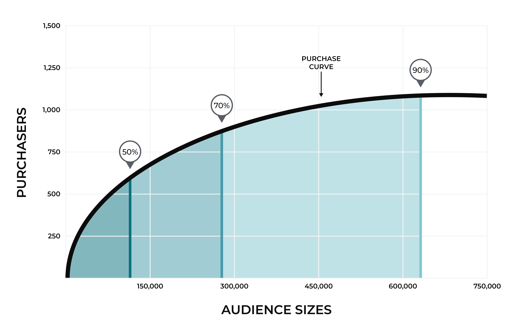

.. https://docs.amperity.com/operator/

.. meta::
    :description lang=en:
        The product affinity model predicts which products each customer is most likely to purchase next using a Random Forest Classifier and Beta-Geometric Model ensemble.

.. meta::
    :content class=swiftype name=body data-type=text:
        The product affinity model predicts which products each customer is most likely to purchase next using a Random Forest Classifier and Beta-Geometric Model ensemble.

.. meta::
    :content class=swiftype name=title data-type=string:
        Product affinity model

==================================================
Product affinity model
==================================================

.. include:: ../../shared/terms.rst
   :start-after: .. term-product-affinity-start
   :end-before: .. term-product-affinity-end

.. model-product-affinity-about-start

The Amperity Product Affinity model predicts which products each customer is most likely to purchase next. Given a product attribute (e.g., product category, brand, or subcategory), the model scores every customer-product pair and ranks products for each customer by affinity. It also recommends audience sizes for each product based on how well the model's predictions match actual purchase behavior.

It is recommended that you select product attributes with 10-2,000 unique values for best performance. The model combines two components:

#. **Random Forest Classifier** --- For each customer, the model predicts the probability of purchasing each product attribute value within the prediction window. The output is a score between 0 and 1 for each customer-product pair. The hyperparameters for this model can be modified.
#. **Beta-Geometric Model** --- A statistical model that estimates the probability that a customer will place any order within the next 30 days, based on their purchase recency and frequency. This acts as a calibration layer. The hyperparameters for this model cannot be modified.

The final affinity score for each customer-product pair is:

.. code-block:: none

   Score = P(purchase product | customer) x P(order in next 30 days)

Customers are then ranked by score for each product, and the top-ranked customers are assigned to recommended audience tiers.

.. model-product-affinity-about-end

.. _model-product-affinity-how-it-works:

How the model works
==================================================

.. model-product-affinity-how-it-works-start

The product affinity model is an ensemble of two independently trained models. Each model contributes to the final affinity score.

.. model-product-affinity-how-it-works-end

.. _model-product-affinity-random-forest:

Random Forest Classifier
--------------------------------------------------

.. model-product-affinity-random-forest-start

The Random Forest Classifier predicts the probability of each customer purchasing each product attribute value (e.g., "Shoes", "Outerwear") within the prediction window. It learns patterns from the customer's historical purchases: which products they've bought before, how recently, through which channels, and how those products relate to what similar customers buy. The output is a score between 0 and 1 for each customer-product pair.

.. model-product-affinity-random-forest-end

.. _model-product-affinity-beta-geometric:

Beta-Geometric Model
--------------------------------------------------

.. model-product-affinity-beta-geometric-start

The Beta-Geometric Model estimates the probability that a customer will place any order within the next 30 days, based on their purchase recency and frequency. This acts as a calibration layer: a customer who hasn't purchased in two years will have their product affinity scores scaled down, even if their historical product preferences are strong.

.. note:: The Beta-Geometric Model's hyperparameters cannot be modified and are not visible in the UI.

.. model-product-affinity-beta-geometric-end

.. _model-product-affinity-audience-sizes:

Audience size recommendations
--------------------------------------------------

.. model-product-affinity-audience-sizes-start

For each product attribute value, the model recommends three audience sizes based on target hit rates. A "hit rate" is the percentage of customers in an audience who actually purchase the product. The model finds the audience size at which the predicted hit rate meets each target:

* **Small audience**: target 50% hit rate (high precision, fewer customers)
* **Medium audience**: target 70% hit rate
* **Large audience**: target 90% hit rate (broad reach, lower precision)

These targets are configurable.

.. model-product-affinity-audience-sizes-end

.. _model-product-affinity-choosing-attribute:

Choosing a product attribute
==================================================

.. model-product-affinity-choosing-attribute-start

Selecting a quality product attribute is an important step in model setup. The product affinity model is best used to expand an audience beyond past purchasers and narrow an audience to only the customers likeliest to purchase. Select product attributes that align to planned marketing campaigns related to new product launches or product-specific sales and promotions.

It is recommended that you select product attributes with 10-2,000 unique values for best performance. To see the unique values for a given product attribute, view the unique values count in the database data explorer.

.. model-product-affinity-choosing-attribute-end

.. _model-product-affinity-selecting-values:

Selecting values for inclusion
--------------------------------------------------

.. model-product-affinity-selecting-values-start

When adding a new model version, you can select values for inclusion alongside a table containing the number of purchasers over the last year and 30 days. A product must meet minimum purchaser volumes of more than 100 in the last 30 days and more than 250 in the last year to be eligible for inclusion.

There are two approaches to value selection:

#. **Rules-based** --- Select the top N (default 50) by purchaser volume in the last 365 days.
#. **Manual** --- Select individual values for inclusion. The inclusion list will default to the top N when switched to manual.

If a new value is added to your selected product attribute, it will need to be manually added to the active model version. You can duplicate the active model version, select the new value, run a model evaluation to ensure performance remains consistent, then activate the new model version.

.. note:: In some cases, a value may drop out of the modeling outputs if it falls below the required minimum purchase volumes. If the value has not been manually removed, it will receive predictions as part of the output table when it once again meets the minimum purchaser thresholds.

.. model-product-affinity-selecting-values-end

.. _model-product-affinity-use-cases:

Use cases
==================================================

.. model-product-affinity-use-cases-start

The product affinity model enables support for marketing campaigns that benefit from knowing a customer's preferences across product categories, including:

#. :ref:`Recommended audience sizes <model-product-affinity-use-cases-recommended-audiences>`
#. :ref:`Ranking customers by affinity <model-product-affinity-use-cases-customer-ranking>`

.. model-product-affinity-use-cases-end

.. _model-product-affinity-use-cases-recommended-audiences:

Recommended audience sizes
--------------------------------------------------

.. include:: ../../shared/terms.rst
   :start-after: .. term-recommended-audience-size-start
   :end-before: .. term-recommended-audience-size-end

.. model-product-affinity-use-cases-recommended-audiences-about-start

Recommended audience sizes are calculated using customer transaction data over a 30-day window. A purchase curve is generated, along with corresponding audience sizes that show what size audience would have been required to capture 50%, 70%, and 90% of purchases for a given product over the previous 30 days.

Audience sizes are inclusive of all smaller audience sizes.

* A medium audience size (70%) includes all of your customers who are in the small audience size (50%).
* A large audience size (90%) includes all of your customers who are in the small and medium audiences.

.. model-product-affinity-use-cases-recommended-audiences-about-end

.. model-product-affinity-recommended-audiences-usecase-start

Recommended audience sizes identify customers who are most likely to purchase. Use recommended audience sizes to:

* Engage with customers for product-specific sends, such as clearance sale and new arrival announcements
* Define more valuable campaigns to grow revenue for specific product categories
* Drive up conversion rates
* Drive down opt-outs
* Determine categories, products, and trends that resonate with key segments

.. model-product-affinity-recommended-audiences-usecase-end

.. model-product-affinity-use-cases-recommended-audiences-attributes-start

Attributes for recommended audience sizes are available from the **Predicted Affinity** table:

.. list-table::
   :widths: 35 65
   :header-rows: 1

   * - Attribute Name
     - Description
   * - **Audience Size Small**
     - A small audience is predicted to include ~50% of future purchasers, while including the fewest non-purchasers. Use a small audience size to help prevent wasted spend and reduce opt-outs.
   * - **Audience Size Medium**
     - A medium audience is predicted to include ~70% of future purchasers, though it may also include a moderate number of non-purchasers.
   * - **Audience Size Large**
     - A large audience is predicted to include ~90% of future purchasers, while also including a high number of non-purchasers.

Combine these attributes with the **Product Attribute** attribute to build audiences for a specific product category, class, or brand. You can access these attributes directly from the **Segment Editor**.

.. model-product-affinity-use-cases-recommended-audiences-attributes-end

.. _model-product-affinity-use-cases-customer-ranking:

Customer ranking
--------------------------------------------------

.. model-product-affinity-use-cases-customer-ranking-start

Use customer ranking to define an audience using the top N customers. Use customer ranking as an alternate to recommended audience sizes when an audience is too large (or small) or if a recommended audience size is unavailable for a specific product or category.

.. model-product-affinity-use-cases-customer-ranking-end

.. model-product-affinity-use-cases-customer-ranking-topn-start

Customer ranking identifies the top N customers who are most likely to purchase. Use customer ranking to:

* Provide an alternative to a recommended audience size, such as when a recommended audience size is unavailable for a specific product or category
* Serve targeted product messages to defined audiences
* Identify first-time buyer personas
* Drive up conversion rates
* Drive down opt-outs

.. model-product-affinity-use-cases-customer-ranking-topn-end

.. model-product-affinity-use-cases-customer-ranking-attribute-start

The **Ranking** attribute in the **Predicted Affinity** table ranks customer scores by product. A rank that is less than or equal to X provides the top N customers with an affinity for this product. Combine this attribute with the **Product Attribute** attribute to build customer rankings for a specific product category, class, or brand. You can access this attribute directly from the **Segment Editor**.

.. model-product-affinity-use-cases-customer-ranking-attribute-end

.. _model-product-affinity-configure:

Build a product affinity model
==================================================

.. model-product-affinity-configure-start

You can build a product affinity model from the **Customer 360** page. Each database that contains the **Merged Customers**, **Unified Itemized Transactions**, and **Unified Transactions** tables may be configured for predictive modeling.

.. model-product-affinity-configure-end

.. important::

   .. include:: ../../amperity_operator/source/models.rst
      :start-after: .. models-fields-used-by-all-models-start
      :end-before: .. models-fields-used-by-all-models-end

**To build a product affinity model**

.. model-product-affinity-configure-steps-start

.. list-table::
   :widths: 10 90
   :header-rows: 0

   * - .. image:: ../../images/steps-01.png
          :width: 60 px
          :alt: Step one.
          :align: center
          :class: no-scaled-link
     - Open the **Customer 360** page, select a database, and then open the bottom--|fa-kebab|--menu and select **Predictive models**. This opens the **Predictive models** page.

   * - .. image:: ../../images/steps-02.png
          :width: 60 px
          :alt: Step two.
          :align: center
          :class: no-scaled-link
     - Click **Add model** and select **Product Affinity**. Select the **product group**, which is the field from **Unified Itemized Transactions** to predict on (e.g., product_category, product_subcategory, brand).

       .. note:: The product group is set at model creation and cannot be changed.

   * - .. image:: ../../images/steps-03.png
          :width: 60 px
          :alt: Step three.
          :align: center
          :class: no-scaled-link
     - Create and evaluate model versions. Each version contains value selection settings (rules-based or manual), hyperparameters, customer exclusions, and audience size settings. When selecting values, products must meet minimum purchaser thresholds of more than 100 in the last 30 days and more than 250 in the last year.

       Evaluate a version to run a validation job. Review the validation results, which include metrics such as Precision Improvement, Recall Improvement, and Audience Outperformance.

       .. tip:: You can create multiple versions with different settings and compare their evaluation results to find the best-performing version for your data.

   * - .. image:: ../../images/steps-04.png
          :width: 60 px
          :alt: Step four.
          :align: center
          :class: no-scaled-link
     - When you are satisfied with a version's performance, click **Activate**. During activation:

       #. Select a **version** to activate. It is recommended that you select the best performing version for your use cases.
       #. Select a **courier group**. The model must be attached to a courier group to activate.
       #. Set the **training cadence**, which is how often the model is retrained with new data. The default is every 2 weeks.
       #. Set the **inference cadence**, which is how often predictions are generated. The default is daily.

       Click **Activate** to start a full workflow that trains the model, runs inference, and adds the model output tables to the database.

.. model-product-affinity-configure-steps-end

.. _model-product-affinity-output-tables:

Output tables
==================================================

.. model-product-affinity-output-tables-start

When a product affinity model is activated, a training and inference workflow will begin. When complete, the generated output table (one row per customer-product pair) will be automatically added to the database. Table names include your database name and the product group in PascalCase, using the pattern **Predicted_Affinity<ProductGroup>** (e.g., Predicted_AffinityProductCategory).

.. model-product-affinity-output-tables-end

.. model-product-affinity-output-tables-table-start

.. list-table::
   :widths: 25 10 65
   :header-rows: 1

   * - Field
     - Type
     - Description
   * - **product_attribute**
     - String
     - The product attribute value (e.g., "Shoes", "Outerwear"). Only values that meet the minimum purchaser thresholds and are selected in the activated model version are included in the output.
   * - **amperity_id**
     - String
     - Unique customer identifier.
   * - **score**
     - Float
     - Affinity score (0-1). Higher means stronger predicted affinity. Combines product-specific affinity with general purchase likelihood. **The score should only be used in relation to other customers for the same product attribute value and should not be used in absolute terms. It is strongly recommended to use the ranking instead.**
   * - **ranking**
     - Integer
     - This product's rank for the customer (1 = highest affinity product). **Using either the audience size attributes or customer rankings are strongly recommended for product affinity segmentation.**
   * - **audience_size_small**
     - Boolean
     - Whether this customer falls within the small recommended audience for this product attribute value (target 50% hit rate by default). These customers have the highest likelihood of purchasing the product attribute value.
   * - **audience_size_medium**
     - Boolean
     - Whether this customer falls within the medium recommended audience for this product attribute value (target 70% hit rate by default).
   * - **audience_size_large**
     - Boolean
     - Whether this customer falls within the large recommended audience for this product attribute value (target 90% hit rate by default).

.. model-product-affinity-output-tables-table-end

.. _model-product-affinity-export-validation:

Export validation results
==================================================

.. model-product-affinity-export-validation-start

After running a model validation, you can export the results to Databricks, Snowflake, or Google BigQuery. Create an outbound bridge, then select the **predictive_tables** dataset. The validation export includes per-product metrics: total hit count, naive baseline performance, and model performance at each audience size tier with hit rate and precision improvement percentages.

.. model-product-affinity-export-validation-end

.. _model-product-affinity-validation-metrics:

Validation metrics
==================================================

.. model-product-affinity-validation-metrics-start

The following metrics are computed during model validation and shown in the evaluation report:

.. model-product-affinity-validation-metrics-end

.. model-product-affinity-validation-metrics-table-start

.. list-table::
   :widths: 30 70
   :header-rows: 1

   * - Metric
     - Description
   * - **Precision Improvement**
     - How much more accurately the model identifies purchasers compared to random sampling. Shown as a percentage improvement.
   * - **Recall Improvement**
     - How much better the model captures actual purchasers compared to a naive baseline of historical purchasers. Shown as a percentage improvement.
   * - **Audience Outperformance**
     - Percentage of product audiences where the model's recommendations outperform the naive historical-purchasers baseline.

A model is recommended for deployment when precision and recall improvements are at least 10% and at least 75% of product audiences outperform the naive baseline.

.. model-product-affinity-validation-metrics-table-end

.. _model-product-affinity-advanced-settings:

Advanced settings
==================================================

.. model-product-affinity-advanced-settings-start

The following settings are available on the **Advanced** tab.

.. model-product-affinity-advanced-settings-end

.. model-product-affinity-advanced-settings-table-start

.. list-table::
   :widths: 25 15 60
   :header-rows: 1

   * - Parameter
     - Default
     - Description
   * - **RF Num Trees**
     - 100
     - Number of trees in the Random Forest.
   * - **RF Max Depth**
     - 5
     - Maximum depth of each tree.
   * - **RF Max Bins**
     - 700
     - Number of bins for discretizing continuous features.
   * - **RF Feature Subset Strategy**
     - sqrt
     - Number of features considered at each split.
   * - **Customer Exclusions**
     - is_outlier, is_test_account
     - Boolean fields from the customer attributes table used to exclude specific customers.

.. model-product-affinity-advanced-settings-table-end

.. _model-product-affinity-segments:

Use in segments
==================================================

.. model-product-affinity-segments-start

The following table describes the fields that are available when using product affinity modeling in segments.

.. model-product-affinity-segments-end

.. TODO: Need to bespoke this by fields for this specific modeling use case?

.. include:: ../../amperity_reference/source/data_tables.rst
   :start-after: .. data-tables-affinity-table-start
   :end-before: .. data-tables-affinity-table-end
