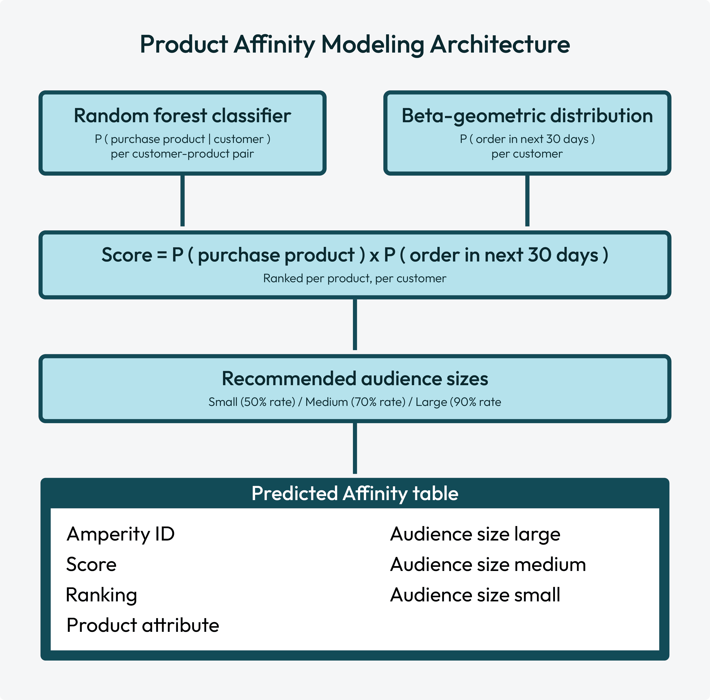

.. https://docs.amperity.com/operator/

.. meta::
    :description lang=en:
        Product affinity modeling predicts which products customers are most likely to purchase next using a random forest classifier and beta-geometric distribution ensemble.

.. meta::
    :content class=swiftype name=body data-type=text:
        Product affinity modeling predicts which products customers are most likely to purchase next using a random forest classifier and beta-geometric distribution ensemble.

.. meta::
    :content class=swiftype name=title data-type=string:
        Product affinity model

==================================================
Product affinity model
==================================================

.. include:: ../../shared/terms.rst
   :start-after: .. term-product-affinity-start
   :end-before: .. term-product-affinity-end

.. _model-product-affinity-about:

About product affinity models
==================================================

.. model-product-affinity-about-start

Product affinity models predict which products customers are most likely to purchase next. The model combines two components: a :ref:`random forest classifier <model-product-affinity-howitworks-random-forest>` and a :ref:`beta-geometric distribution <model-product-affinity-howitworks-beta-geometric>`.

For each product attribute, such as a product category, brand, or product subcategory, the model scores every customer-product pair, and then:

#. Ranks products for each customer by product affinity.
#. Recommends :ref:`audience sizes for each product <model-product-affinity-howitworks-audience-sizes>` based on how model predictions match actual purchase behaviors.

.. model-product-affinity-about-end

.. _model-product-affinity-howitworks:

How product affinity works
==================================================

.. model-product-affinity-howitworks-start

The product affinity model is an `ensemble learning method <https://en.wikipedia.org/wiki/Ensemble_learning>`__ |ext_link| with two independently trained submodels: a :ref:`random forest classifier <model-product-affinity-howitworks-random-forest>` and a :ref:`beta-geometric distribution <model-product-affinity-howitworks-beta-geometric>`. Each individual model contributes to the product affinity model's output: :ref:`product affinity scores <model-product-affinity-howitworks-score>`.

.. model-product-affinity-howitworks-end

.. _model-product-affinity-howitworks-random-forest:

Random forest classifier
--------------------------------------------------

.. include:: ../../shared/terms.rst
   :start-after: .. term-random-forest-classifier-start
   :end-before: .. term-random-forest-classifier-end

.. model-product-affinity-howitworks-random-forest-start

The random forest classifier for predictive affinity modeling predicts the probability of each customer purchasing each product attribute value, such as "shoes", "outerwear", or "shirts", within the prediction window.

The random forest classifier learns patterns from historical customer purchases, such as:

* What products were purchased?
* When was the most recent purchase?
* Through which channel was a purchase made?
* How do the products purchased relate to products purchased by similar customers?

The random forest classifier outputs a score between 0 and 1 for each customer-product pair.

.. model-product-affinity-howitworks-random-forest-end

.. model-product-affinity-howitworks-random-forest-hyperparameters-start

.. note:: Hyperparameters for the random forest classifier are :ref:`configured during model version setup <model-product-affinity-build-hyperparameters>`.

.. model-product-affinity-howitworks-random-forest-hyperparameters-end

.. _model-product-affinity-howitworks-beta-geometric:

Beta-geometric distribution
--------------------------------------------------

.. include:: ../../shared/terms.rst
   :start-after: .. term-beta-geometric-distribution-start
   :end-before: .. term-beta-geometric-distribution-end

.. model-product-affinity-howitworks-beta-geometric-calibration-start

The calibration layer helps ensure that customers without purchases during the previous 2 years have scaled-down product affinity scores, even when their historical product preferences are strong.

.. model-product-affinity-howitworks-beta-geometric-calibration-end

.. model-product-affinity-howitworks-beta-geometric-hyperparameters-start

.. note:: Hyperparameters for beta-geometric distribution cannot be modified.

.. model-product-affinity-howitworks-beta-geometric-hyperparameters-end

.. _model-product-affinity-howitworks-score:

Product affinity scores
--------------------------------------------------

.. model-product-affinity-howitworks-score-start

Every customer-product pair is assigned a product affinity score, where:

.. code-block:: none

   Score = P ( purchase product | customer ) x P ( order in next 30 days )

Customers are ranked by score for each product. Top-ranked customers are assigned to recommended audiences.

.. model-product-affinity-howitworks-score-end

.. _model-product-affinity-howitworks-audience-sizes:

Audience size predictions
--------------------------------------------------

.. model-product-affinity-howitworks-audience-sizes-start

Top-ranked customers are assigned to :ref:`recommended audiences <model-product-affinity-use-cases-recommended-audiences>` as an output of product affinity scoring.

.. image:: ../../images/use-cases-recommended-audience-size-all.png
   :width: 600 px
   :alt: All audience sizes and the purchase curve.
   :align: left
   :class: no-scaled-link

.. include:: ../../shared/terms.rst
   :start-after: .. term-recommended-audience-size-start
   :end-before: .. term-recommended-audience-size-end

The percentages for audience sizes are configurable as :ref:`hyperparameters during initial model version setup <model-product-affinity-build-hyperparameters>`.

.. model-product-affinity-howitworks-audience-sizes-end

.. _model-product-affinity-use-cases:

Use cases
==================================================

.. model-product-affinity-use-cases-start

Product affinity modeling enables support for marketing campaigns that would benefit from knowing customer preferences across product categories with:

#. :ref:`Recommended audience sizes <model-product-affinity-use-cases-recommended-audiences>`
#. :ref:`Ranking customers by affinity <model-product-affinity-use-cases-customer-ranking>`

.. model-product-affinity-use-cases-end

.. _model-product-affinity-use-cases-recommended-audiences:

Audience sizes
--------------------------------------------------

.. include:: ../../shared/terms.rst
   :start-after: .. term-recommended-audience-size-start
   :end-before: .. term-recommended-audience-size-end

.. include:: ../../amperity_reference/source/model_product_affinity.rst
   :start-after: .. model-product-affinity-use-cases-recommended-audiences-about-start
   :end-before: .. model-product-affinity-use-cases-recommended-audiences-about-end

.. image:: ../../images/use-cases-recommended-audience-size-all.png
   :width: 600 px
   :alt: The purchase curve.
   :align: left
   :class: no-scaled-link

.. include:: ../../amperity_reference/source/model_product_affinity.rst
   :start-after: .. model-product-affinity-recommended-audiences-usecase-start
   :end-before: .. model-product-affinity-recommended-audiences-usecase-end

.. include:: ../../amperity_reference/source/model_product_affinity.rst
   :start-after: .. model-product-affinity-use-cases-recommended-audiences-attributes-start
   :end-before: .. model-product-affinity-use-cases-recommended-audiences-attributes-end

.. _model-product-affinity-use-cases-customer-ranking:

Customer ranking
--------------------------------------------------

.. include:: ../../amperity_reference/source/model_product_affinity.rst
   :start-after: .. model-product-affinity-use-cases-customer-ranking-start
   :end-before: .. model-product-affinity-use-cases-customer-ranking-end

.. include:: ../../amperity_reference/source/model_product_affinity.rst
   :start-after: .. model-product-affinity-use-cases-customer-ranking-topn-start
   :end-before: .. model-product-affinity-use-cases-customer-ranking-topn-end

.. include:: ../../amperity_reference/source/model_product_affinity.rst
   :start-after: .. model-product-affinity-use-cases-customer-ranking-attribute-start
   :end-before: .. model-product-affinity-use-cases-customer-ranking-attribute-end

.. _model-product-affinity-build:

Build a product affinity model
==================================================

.. model-product-affinity-build-start

You can build a product affinity model from the **Customer 360** page. Any database that has the **Merged Customers**, **Unified Itemized Transactions**, and **Unified Transactions** tables may be configured for predictive modeling.

.. model-product-affinity-build-end

.. important::

   .. include:: ../../amperity_operator/source/models.rst
      :start-after: .. models-fields-used-by-all-models-table-start
      :end-before: .. models-fields-used-by-all-models-table-end

**To build a product affinity model**

#. :ref:`Select model, create version <model-product-affinity-build-create-version>`
#. :ref:`Choose field for predictions <model-product-affinity-build-choose-field>`
#. :ref:`Define version settings <model-product-affinity-build-version-settings>`
#. :ref:`Configure hyperparameters for random forest classifier <model-product-affinity-build-hyperparameters>`
#. :ref:`Evaluate version <model-product-affinity-build-evaluate-version>`
#. :ref:`Choose version for product affinity modeling <model-product-affinity-build-choose-version>`

.. _model-product-affinity-build-create-version:

Select model, create version
--------------------------------------------------

.. model-product-affinity-build-create-version-start

Open the **Customer 360** page, and then select the **Predictive models** tab. This opens the **Predictive models** page.

Click the **Add model** button and select **Product Affinity**. In the **New model** dialog assign a name to the model and add a description.

.. model-product-affinity-build-create-version-end

.. _model-product-affinity-build-choose-field:

Choose field for predictions
--------------------------------------------------

.. model-product-affinity-build-choose-field-start

Product affinity modeling helps expand audiences by focusing on customers who are most likely to purchase. Choose product attributes aligned to marketing campaigns for new product launches or product-specific sales and promotions.

Product affinity modeling uses a single field to predict customer preferences. The field for predicting customer preferences may be used with a single product affinity model.

In the **New model** dialog, from the **Product group** dropdown select a field from the **Unified Itemized Transactions** table for predicting customer preferences. For example, **Product Category**, **Product Subcategory**, or **Brand**.

.. caution:: The value for **Product group** is set at model creation and cannot be changed. Create a new model to change the value for **Product group**.

After choosing a field for predicting customer preferences, click **Create**. This opens the **New version** dialog.

.. model-product-affinity-build-choose-field-end

.. _model-product-affinity-build-version-settings:

Define version settings
--------------------------------------------------

.. model-product-affinity-build-version-settings-start

The **New version** dialog has two tabs: **General** and **Advanced**.

Select the **General** tab to configure the list of values for predicting product affinity. The list of values can be managed by rules or be managed manually.

.. list-table::
   :widths: 15 85
   :header-rows: 1

   * - Option
     - Description

   * - **Use rules**
     - Select **Rules** to build a list of values automatically up to the configured maximum number of values.

       Use the **Max product groups** field to configure the maximum number of values for the selected field. The default value is "50". Values must have at least 100 purchases during the previous 30 days *and* at least 250 purchases during the previous 365 days to be included in product affinity model output.

       .. tip:: Use the **Show ineligible** slider to view values that do not meet the minimum thresholds for rules-based inclusion in product affinity modeling output.

   * - **Manually**
     - Select **Manual** to choose the list of values included in model output. Only selected values with at least 100 purchases during the previous 30 days *and* at least 250 purchases during the previous 365 days are included in product affinity modeling output.

.. caution:: Do not click **Evaluate** until after :ref:`hyperparameters for the random forest classifier <model-product-affinity-build-hyperparameters>` are configured unless you intend to use the default values for hyperparameters.

.. model-product-affinity-build-version-settings-end

.. _model-product-affinity-build-hyperparameters:

Configure hyperparameters
--------------------------------------------------

.. include:: ../../shared/terms.rst
   :start-after: .. term-random-forest-classifier-start
   :end-before: .. term-random-forest-classifier-end

.. model-product-affinity-build-hyperparameters-start

Select the **Advanced** tab to configure hyperparameters for the random forest classifier. When finished, click **Evaluate**.

.. important:: Hyperparameters for the random forest classifier are *only* configurable during initial version setup.

The random forest classifier has the following hyperparameters:

.. list-table::
   :widths: 20 20 60
   :header-rows: 1

   * - Parameter
     - Default
     - Description

   * - **Audience size definitions**
     - 0.5, 0.7, 0.9
     - The sizes for small (0.5), medium (0.7), and large (0.9) audiences.

       Expand **Audience size definition** to change these definitions.

   * - **Customer exclusions**
     - None
     - A list of fields from the :doc:`Customer Attributes table <table_customer_attributes>`. Customer profiles that match a selected field from the **Customer Attributes** table are excluded from recommended audiences.

   * - **Feature subset strategy**
     - Square root
     - The random forest classifier is intentionally trained on a random subset of features at each split to ensure that each tree within the random forest is different.

       The value for **Feature subset strategy** determines how features are split into random subsets.

       Possible values:

       .. list-table::
          :widths: 30 70
          :header-rows: 1

          * - Strategy
            - Description

          * - **All**
            - All features are in all splits. Use only for small feature sets or to ensure random forest classifier outputs are not random.

          * - **Auto**
            - Allow the random forest classifier to choose the feature subset strategy.

          * - **Log2**
            - Use a base 2 `binary logarithm <https://en.wikipedia.org/wiki/Binary_logarithm>`__ |ext_link| to determine the split. For example, if there are 100 features, the split is ~7.

          * - **One third**
            - Use one third of features to determine the split. For example, if there are 100 features, the split is 33.

          * - **Square root**
            - Default. Use the square root of features to determine the split. For example, if there are 100 features, the split is 10.

   * - **Max bins**
     - 700
     - The maximum number of bins for `discretization of continuous features <https://en.wikipedia.org/wiki/Discretization_of_continuous_features>`__ |ext_link|.

       Before a tree is split on a continuous feature, such as **Product Subcategory**, the random forest classifier must decide *where* to try splitting. This setting defines the maximum number of candidate thresholds within a dataset the random forest classifier is allowed to evaluate before splitting data.

       For example, with a very low number of bins, such as 10, the random forest classifier may try for ten evenly spaced splits. More bins gives the random forest classifier more ways to find precise splits.

       **Max bins** is the maximum number of bins available. Some values are grouped together when the number of possible splits exceeds the maximum number of bins.

       If a feature has fewer unique values than the **Max bins** value, the bin count is irrelevant. The random forest classifier evaluates every unique value as a candidate for splitting. The **Max bins** value constrains features with high cardinality or features that are truly continuous. Leaving **Max bins** set to 700 for a feature with 12 unique values results in 12 candidates for splitting.

       .. note:: The maximum number of distinct values for a feature is 695, which is below the default **Max bins** value of 700.

   * - **Max depth**
     - 5
     - The maximum depth of each tree in the random forest classifier.

       This setting controls the levels of splits a tree is allowed to make. At each level a yes or no question is asked and, depending on the answer, the data is split into two groups. For example:

       .. code-block:: none

          Tree: Age > 30?
          |__ Yes. Purchases > 3?                  < depth 1
          |   |__ Yes. Socks?                      < depth 2
          |   |   |__ Yes. Brand = Socktown?       < depth 3
          |   |   |   |__ Yes.                     < depth 4
          |   |   |   |   |__ Yes. Color = blue?   < depth 5
          |   |   |   |   |__ No.                  < depth 5
          |   |   |   |
          |   |   |   |__ No.                      < depth 4
          |   |   |
          |   |   |__ No.                          < depth 3
          |   |
          |   |__ No.                              < depth 2
          |
          |__ No.                                  < depth 1

   * - **Number of trees**
     - 100
     - The number of individual trees available to the random forest classifier.

       More trees create more stable and more accurate random forest classifier outcomes. Start with 100 trees and increase or decrease this number during model evaluation to determine which number creates the best outcomes.

.. model-product-affinity-build-hyperparameters-end

.. _model-product-affinity-build-evaluate-version:

Evaluate versions
--------------------------------------------------

.. model-product-affinity-build-evaluate-version-start

Each version must be evaluated before it can be selected for use with product affinity modeling.

.. tip:: Review the validation results, especially for improvements to precision, recall, and outperformance for audience sizes. A model version should not be deployed when precision is less than 10% or when three out of four recall values underperform the naive baseline of historical purchasers.

.. model-product-affinity-build-evaluate-version-end

.. model-product-affinity-validation-metrics-table-start

.. list-table::
   :widths: 30 70
   :header-rows: 1

   * - Metric
     - Description
   * - **Evaluation**
     - Did model evaluation pass or fail?

   * - **Precision**
     - A percentage that shows how this model version compares to random sampling.

   * - **Recall**
     - A percentage that shows how actual purchasers in this model version compare to the naive baseline of historical purchasers.

       .. note:: The naive baseline of historical purchasers is everyone who has previously purchased the product within the 450-day training window.

       Recall is shown for the model version and by audience size when recommended audiences outperform the naive baseline by capturing lookalike buyers who have no prior purchase history.

       * **SM recall** is for small audience sizes
       * **MD recall** is for medium audience sizes
       * **LG recall** is for large audience sizes

.. model-product-affinity-validation-metrics-table-end

.. _model-product-affinity-build-choose-version:

Choose version
--------------------------------------------------

.. model-product-affinity-build-choose-version-start

Choose the version that performs best for product affinity modeling, and then click the **Edit** button.

On the **Schedule** page:

#. Set **Status** to **Active**.

   .. important:: Only activate a version that performs best for your marketing use cases.

#. From the **Courier group** dropdown select a courier group. Active product affinity models must be attached to a courier group.

#. Inference cadence is the frequency at which predictions are generated. Under **Inference refresh** set the frequency. The default value is 1, which refreshes predictions daily.

#. Training cadence is the frequency at which product affinity modeling is retrained with new data. Under **Training refresh** set the frequency. The default value is 14, which retrains with new data every two weeks.

#. Click **Save** to activate the product affinity model. A full workflow starts that trains the model, runs inference, and then adds :ref:`product affinity output tables <model-product-affinity-output-tables>` to the database.

.. model-product-affinity-build-choose-version-end

.. _model-product-affinity-output-tables:

Product affinity output tables
==================================================

.. model-product-affinity-output-tables-start

When you activate a product affinity model a training and inference workflow begins. The product affinity model trains on 450 days of historical purchase data. The random forest classifier applies a 365-day `exponential half-life decay <https://en.wikipedia.org/wiki/Exponential_decay>`__ |ext_link| for historical purchases to ensure that more recent purchases count more.

When the training and inference workflow finishes, an output table is generated with one row for each customer-product pair, and then added automatically to the database.

The name of the output table includes the table name--**Predicted_Affinity**--followed by the name of the :ref:`field used for predicting customer preferences <model-product-affinity-build-choose-field>` in Pascal case and separated by an underscore. For example, if the field used for predicting customer preferences is **Product Category** the name of the table is **Predicted_Affinity_ProductCategory**.

.. model-product-affinity-output-tables-end

.. include:: ../../amperity_reference/source/data_tables.rst
   :start-after: .. data-tables-affinity-table-about-start
   :end-before: .. data-tables-affinity-table-about-end

.. include:: ../../amperity_reference/source/data_tables.rst
   :start-after: .. data-tables-affinity-table-start
   :end-before: .. data-tables-affinity-table-end

.. _model-product-affinity-export-validation:

Export validation results
==================================================

.. model-product-affinity-export-validation-start

Export model results to :ref:`Databricks <bridge-databricks-sync-with-databricks>`, :ref:`Google BigQuery <bridge-google-bigquery-sync-with-google-bigquery>`, or :ref:`Snowflake <bridge-snowflake-sync-with-snowflake>` using an outbound bridge.

Configure an outbound bridge, and then select the **predictive_tables** dataset. The validation export includes per-product metrics such as total hit count, naive baseline performance, model performance at each audience size tier, along with hit rate and precision improvement percentages.

.. model-product-affinity-export-validation-end
