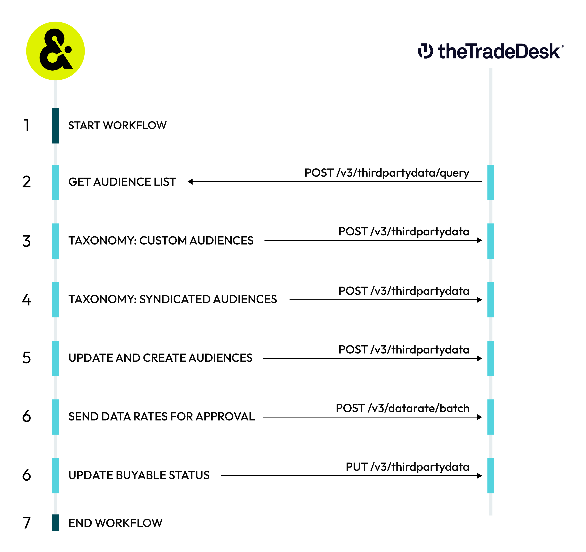

.. https://docs.amperity.com/operator/

:orphan:

.. |destination-name| replace:: The Trade Desk Data Marketplace
.. |plugin-name| replace:: "The Trade Desk Data Marketplace"
.. |credential-type| replace:: "tradedesk-audience-monetization"
.. |required-credentials| replace:: "advertiser ID", "advertiser secret", "provider ID", and "platform API token"
.. |what-send| replace:: UID2 tokens
.. |where-send| replace:: |destination-name|
.. |duration| replace:: (in days)
.. |duration-value| replace:: "0" - "180"
.. |filter-the-list| replace:: "trade"
.. |allow-for-what| replace:: audiences
.. |allow-for-duration| replace:: up to 48 hours

.. meta::
    :description lang=en:
        Configure Amperity to send audiences to The Trade Desk Data Marketplace.

.. meta::
    :content class=swiftype name=body data-type=text:
        Configure Amperity to send audiences to The Trade Desk Data Marketplace.

.. meta::
    :content class=swiftype name=title data-type=string:
        Configure destinations for The Trade Desk Data Marketplace

=================================================================
Configure destinations for The Trade Desk Data Marketplace
=================================================================

.. include:: ../../shared/terms.rst
   :start-after: .. term-thetradedesk-start
   :end-before: .. term-thetradedesk-end

.. include:: ../../shared/terms.rst
   :start-after: .. term-thetradedesk-marketplace-start
   :end-before: .. term-thetradedesk-marketplace-end

.. destination-the-trade-desk-marketplace-about-start

Use this destination to monetize your brand's UID 2.0-based audiences by making them available for purchase by advertisers various rates in |destination-name|.

.. destination-the-trade-desk-marketplace-about-end

.. include:: ../../amperity_operator/source/destination_the_trade_desk.rst
   :start-after: .. destination-the-trade-desk-whatis-20-start
   :end-before: .. destination-the-trade-desk-whatis-20-end

.. _destination-the-trade-desk-marketplace-howitworks:

How this destination works
==================================================

.. destination-the-trade-desk-marketplace-howitworks-start

Send audiences to |destination-name| using the `The Trade Desk Partner API <https://partner.thetradedesk.com/v3/portal/api/overview>`__ |ext_link| to make ID-based audiences available to advertisers for more granular targeting.

.. destination-the-trade-desk-marketplace-howitworks-end

.. destination-the-trade-desk-marketplace-howitworks-table-start

|destination-name| destination works like this:

.. list-table::
   :widths: 10 90
   :header-rows: 0

   * - .. image:: ../../images/steps-01.png
          :width: 60 px
          :alt: Step one.
          :align: center
          :class: no-scaled-link
     - **START WORKFLOW**

       A workflow starts on the configured schedule, such as "every 2 weeks at 4:00 PM UTC starting March 20, 2026".

       Amperity uses specific endpoints in the The Trade Desk Platform API for this workflow:

       #. `POST /v3/thirdpartydata/query <https://partner.thetradedesk.com/v3/portal/api/ref/post-thirdpartydata-query>`__ |ext_link|
       #. `POST /v3/thirdpartydata <https://partner.thetradedesk.com/v3/portal/api/ref/post-thirdpartydata>`__ |ext_link|
       #. `PUT /v3/thirdpartydata <https://partner.thetradedesk.com/v3/portal/api/ref/put-thirdpartydata>`__ |ext_link|
       #. `POST /v3/datarate/batch <https://partner.thetradedesk.com/v3/portal/api/ref/post-datarate-batch>`__ |ext_link|

   * - .. image:: ../../images/steps-02.png
          :width: 60 px
          :alt: Step two.
          :align: center
          :class: no-scaled-link
     - **AUDIENCE LIST**

       Amperity uses the `POST /v3/thirdpartydata/query <https://partner.thetradedesk.com/v3/portal/api/ref/post-thirdpartydata-query>`__ |ext_link| endpoint to retrieve a filterable list of audiences for a specific data provider. The status for each existing audience is returned, including `taxonomy compliance status <https://partner.thetradedesk.com/v3/portal/data/doc/ThirdPartyDataManagement#check-status>`__ |ext_link|, if the `audience is buyable <https://partner.thetradedesk.com/v3/portal/data/doc/ThirdPartyDataManagement>`__ |ext_link|, the number of `active and received IDs <https://partner.thetradedesk.com/v3/portal/api/doc/Audience>`__ |ext_link|, and the time at which the audience was last updated.

   * - .. image:: ../../images/steps-03.png
          :width: 60 px
          :alt: Step three.
          :align: center
          :class: no-scaled-link
     - **TAXONOMY FOR CUSTOM AUDIENCES**

       Amperity uses the `POST /v3/thirdpartydata <https://partner.thetradedesk.com/v3/portal/api/ref/post-thirdpartydata>`__ |ext_link| endpoint to identify the taxonomy location and buyable status for custom audiences. New custom audiences are added to the taxonomy starting at a custom location and must be buyable.

   * - .. image:: ../../images/steps-04.png
          :width: 60 px
          :alt: Step four.
          :align: center
          :class: no-scaled-link
     - **TAXONOMY FOR SYNDICATED AUDIENCES**

       Amperity uses the `POST /v3/thirdpartydata <https://partner.thetradedesk.com/v3/portal/api/ref/post-thirdpartydata>`__ |ext_link| endpoint to identify the taxonomy location and buyable status for syndicated audiences. New syndicated audiences are added to the taxonomy starting at the root of the taxonomy and must be buyable.

   * - .. image:: ../../images/steps-05.png
          :width: 60 px
          :alt: Step five.
          :align: center
          :class: no-scaled-link
     - **UPDATE AND CREATE AUDIENCES**

       Amperity uses the `POST /v3/thirdpartydata <https://partner.thetradedesk.com/v3/portal/api/ref/post-thirdpartydata>`__ |ext_link| endpoint to update and create audiences in |destination-name|.

       If an audience does not exist Amperity will create it. If an error occurs while creating an audience Amperity will retry using a custom taxonomy location at the root of the taxonomy.

   * - .. image:: ../../images/steps-06.png
          :width: 60 px
          :alt: Step six.
          :align: center
          :class: no-scaled-link
     - **SEND DATA RATES FOR APPROVAL**

       All buyable audiences `must have an approved rate <https://partner.thetradedesk.com/v3/portal/data/doc/ThirdPartyDataManagement#approval-criteria>`__ |ext_link|.

       .. note:: The first syndicated rate submission for a brand requires approval.

       .. tip:: Hybrid rates are recommended for all audiences.

          An effective hybrid rate establishes a percent of media cost value that scales across media channels. As the value of an audience scales into premium high-cost channels audiences yield higher vaules.

          A rate cap protects against excessive costs, especially on premium channels. An effective cap exceeds the desired average cost per thousand, should be seen more often in high cost environments, and should be met about twenty percent of the time, where percent of media costs are the other eighty percent.

       Amperity uses the `POST /v3/datarate/batch <https://partner.thetradedesk.com/v3/portal/api/ref/post-datarate-batch>`__ |ext_link| endpoint to send data rates for processing and approval.

       The following settings define the data rates sent for approval. Depending on the type of audience--custom or syndicated--and the intended consumer--partner or advertiser--some combination of the following settings define the data rate sent for approval.

       **Cost per thousand (CPM)**

          A cost per thousand (CPM) rate defines a maximum rate to prevent runaway costs for an audience. A CPM rate must be in United States dollars (USD) and must be an amount, such as $5.50 or $3.00.

          .. note:: CPM rates lower than $5 require approval by |destination-name|.

       **Percent of media cost**

          A percent of media cost rate defines a percentage applied to impressions that scales with the cost of media across channels. Apply a **CPM cap** in conjunction with a percent of media cost rate to prevent runaway costs. A percent of media cost rate must be a decimal, such as 0.12 or 0.25, which represents 12% or 25%.

          .. note:: Percentages of media cost below 0.10 require approval by |destination-name|.

       **Rate level**

          Amperity assigns rate levels automatically depending on the type of audience sent to |destination-name|:

          **System**
             A system rate level is assigned automatically to a syndicated audience.

          **Partner**
             A partner rate level is assigned to custom audiences intended for specific partners and their advertisers. A partner rate level is assigned to a specific **Partner ID**, which allows that partner to access the audience at the configured data rate.

             .. note:: Use |destination-name| **Platform ID** for a partner to configure the value of **Partner ID** in this destination.

                The value of **Partner ID** may not be empty for partner rate levels.

          **Advertiser**
             An advertiser rate level is assigned to custom audiences intended for specific advertisers. An advertiser rate level is assigned to a specific **Advertiser ID**, which allows an advertiser to access the audience at the configured data rate.

             .. note:: Use |destination-name| **Platform ID** for an advertiser to configure the value of **Advertiser ID** in this destination.

                The value of **Advertiser ID** may not be empty for advertiser rate levels.

       **Rate type**

          The rate type defines the pricing model for an audience and establishes a consistent relative value for advertising impressions while keeping audience pricing scalable across channels.

          **CPM**
             A cost per thousand (CPM) rate defines a maximum rate to prevent runaway costs for an audience.

          **Hybrid**
             A hybrid rate blends a rate that scales with the cost of media across ad environments with a maximum rate that prevents runaway costs. All audiences sent from Amperity should be configured with a hybrid data rate.

             .. note:: All syndicated audiences are assigned a hybrid rate type. A cost per thousand (CPM) rate *and* a percent of media cost rate must be provided.

          **Percent of media cost**
             A percent of media cost rate defines a percentage applied to impressions that scales with the cost of media across channels. Apply a **CPM cap** in conjunction with a percent of media cost rate to prevent runaway costs.

             .. note:: The value for percent of media costs may be $0.00.

   * - .. image:: ../../images/steps-07.png
          :width: 60 px
          :alt: Step seven.
          :align: center
          :class: no-scaled-link
     - **UPDATE BUYABLE STATUS**

       All audiences are buyable by default when managed by Amperity.

       Non-buyable audiences cannot appear in |destination-name|. Any audience in Amperity can be made non-buyable. Open the segment in the **Audience monetization** page, and then click **Make not buyable**.

       Amperity uses the `PUT /v3/thirdpartydata <https://partner.thetradedesk.com/v3/portal/api/ref/put-thirdpartydata>`__ |ext_link| endpoint to update an audience's buyable status.

       .. note:: A buyable audience without a rate or without assigned users is a non-buyable audience and cannot appear in |destination-name|.

   * - .. image:: ../../images/steps-08.png
          :width: 60 px
          :alt: Step seven.
          :align: center
          :class: no-scaled-link
     - **END WORKFLOW**

       After Amperity has created or updated all audiences for membership, data rates, and buyable status, the workflow ends.

.. destination-the-trade-desk-marketplace-howitworks-table-end

.. _destination-the-trade-desk-marketplace-get-details:

Get details
==================================================

.. include:: ../../shared/destination_settings.rst
   :start-after: .. setting-common-get-details-start
   :end-before: .. setting-common-get-details-end

.. destination-the-trade-desk-marketplace-get-details-table-start

.. list-table::
   :widths: 10 90
   :header-rows: 0

   * - .. image:: ../../images/steps-check-off-black.png
          :width: 60 px
          :alt: Detail 1.
          :align: center
          :class: no-scaled-link
     - .. include:: ../../amperity_reference/source/uid2.rst
          :start-after: .. uid2-overview-start
          :end-before: .. uid2-overview-end

       .. include:: ../../amperity_reference/source/uid2.rst
          :start-after: .. uid2-prerequisite-get-access-start
          :end-before: .. uid2-prerequisite-get-access-end

       .. include:: ../../amperity_reference/source/uid2.rst
          :start-after: .. uid2-prerequisite-participate-start
          :end-before: .. uid2-prerequisite-participate-end

       .. include:: ../../amperity_reference/source/uid2.rst
          :start-after: .. uid2-prerequisite-get-credentials-start
          :end-before: .. uid2-prerequisite-get-credentials-end

   * - .. image:: ../../images/steps-check-off-black.png
          :width: 60 px
          :alt: Detail 3.
          :align: center
          :class: no-scaled-link
     - A `marketplace agreement <https://partner.thetradedesk.com/v3/portal/data/doc/DataGetStarted3pProviderAudience#initial-setup>`__ |ext_link|. After the marketplace agreement is in place a **Brand ID**, **Provider ID**, and **Provider secret** is assigned.

   * - .. image:: ../../images/steps-check-off-black.png
          :width: 60 px
          :alt: Detail 3.
          :align: center
          :class: no-scaled-link
     - **Credential settings**

       **Brand ID**

          |checkmark-required| **Required**

          .. include:: ../../shared/credentials_settings.rst
             :start-after: .. credential-the-trade-desk-marketplace-brand-id-start
             :end-before: .. credential-the-trade-desk-marketplace-brand-id-end

       **Provider ID**

          |checkmark-required| **Required**

          .. include:: ../../shared/credentials_settings.rst
             :start-after: .. credential-the-trade-desk-marketplace-provider-id-start
             :end-before: .. credential-the-trade-desk-marketplace-provider-id-end

       **Provider secret**

          |checkmark-required| **Required**

          .. include:: ../../shared/credentials_settings.rst
             :start-after: .. credential-the-trade-desk-marketplace-provider-secret-start
             :end-before: .. credential-the-trade-desk-marketplace-provider-secret-end

       **Platform API token**

          |checkmark-required| **Required**

          .. include:: ../../shared/credentials_settings.rst
             :start-after: .. credential-the-trade-desk-marketplace-platform-api-token-start
             :end-before: .. credential-the-trade-desk-marketplace-platform-api-token-end

   * - .. image:: ../../images/steps-check-off-black.png
          :width: 60 px
          :alt: Detail 4.
          :align: center
          :class: no-scaled-link
     - **Taxonomy**

       |destination-name| recommends `designing and building a flat taxonomy <https://partner.thetradedesk.com/v3/portal/data/doc/DataTaxonomyDesign>`__ |ext_link|, where all segments exist as children under the **ROOT** node, with segment names representing the full path.

       * The display name of each segment defines the path hierarchy and taxonomy structure.
       * The location of a segment in a taxonomy defines its full path, which always starts at the root level.
       * The taxonomy hierarchy always starts with the **ROOT** element.
       * The **ROOT** element is created for you and does appear in |destination-name| for advertisers in the platform. For example, "Interest > Technology > Computers" appears as "Computers".

   * - .. image:: ../../images/steps-check-off-black.png
          :width: 60 px
          :alt: Detail 5.
          :align: center
          :class: no-scaled-link
     - **Partner ID**

       .. note:: A **Partner ID** is required when **Partner** is selected as the **Rate level**.

   * - .. image:: ../../images/steps-check-off-black.png
          :width: 60 px
          :alt: Detail 6.
          :align: center
          :class: no-scaled-link
     - **Advertiser ID**

       .. include:: ../../shared/credentials_settings.rst
          :start-after: .. credential-the-trade-desk-advertiser-id-start
          :end-before: .. credential-the-trade-desk-advertiser-id-end

       .. note:: An **Advertiser ID** is required when **Advertiser** is selected as the **Rate level**.

.. destination-the-trade-desk-marketplace-get-details-end

.. _destination-the-trade-desk-marketplace-credentials:

Configure credentials
==================================================

.. include:: ../../shared/credentials_settings.rst
   :start-after: .. credential-configure-first-start
   :end-before: .. credential-configure-first-end

.. include:: ../../shared/credentials_settings.rst
   :start-after: .. credential-snappass-start
   :end-before: .. credential-snappass-end

**To configure credentials for The Trade Desk Data Marketplace**

.. destination-the-trade-desk-marketplace-credentials-steps-start

.. list-table::
   :widths: 10 90
   :header-rows: 0

   * - .. image:: ../../images/steps-01.png
          :width: 60 px
          :alt: Step one.
          :align: center
          :class: no-scaled-link
     - .. include:: ../../shared/credentials_settings.rst
          :start-after: .. credential-steps-add-credential-start
          :end-before: .. credential-steps-add-credential-end

   * - .. image:: ../../images/steps-02.png
          :width: 60 px
          :alt: Step two.
          :align: center
          :class: no-scaled-link
     - .. include:: ../../shared/credentials_settings.rst
          :start-after: .. credential-steps-select-type-start
          :end-before: .. credential-steps-select-type-end

   * - .. image:: ../../images/steps-03.png
          :width: 60 px
          :alt: Step three.
          :align: center
          :class: no-scaled-link
     - .. include:: ../../shared/credentials_settings.rst
          :start-after: .. credential-steps-settings-intro-start
          :end-before: .. credential-steps-settings-intro-end

       **Brand ID**

          |checkmark-required| **Required**

          .. include:: ../../shared/credentials_settings.rst
             :start-after: .. credential-the-trade-desk-marketplace-brand-id-start
             :end-before: .. credential-the-trade-desk-marketplace-brand-id-end

       **Provider ID**

          |checkmark-required| **Required**

          .. include:: ../../shared/credentials_settings.rst
             :start-after: .. credential-the-trade-desk-marketplace-provider-id-start
             :end-before: .. credential-the-trade-desk-marketplace-provider-id-end

       **Provider secret**

          |checkmark-required| **Required**

          .. include:: ../../shared/credentials_settings.rst
             :start-after: .. credential-the-trade-desk-marketplace-provider-secret-start
             :end-before: .. credential-the-trade-desk-marketplace-provider-secret-end

       **Platform API token**

          |checkmark-required| **Required**

          .. include:: ../../shared/credentials_settings.rst
             :start-after: .. credential-the-trade-desk-marketplace-platform-api-token-start
             :end-before: .. credential-the-trade-desk-marketplace-platform-api-token-end

.. destination-the-trade-desk-marketplace-credentials-steps-end

.. _destination-the-trade-desk-marketplace-add:

Add destination
==================================================

.. include:: ../../shared/destination_settings.rst
   :start-after: .. setting-common-sandbox-recommendation-start
   :end-before: .. setting-common-sandbox-recommendation-end

**To add a destination for The Trade Desk Data Marketplace**

.. destination-the-trade-desk-marketplace-add-steps-start

.. TODO: Sync with /reference/monetize # add and blend them as needed

.. list-table::
   :widths: 10 90
   :header-rows: 0

   * - .. image:: ../../images/steps-01.png
          :width: 60 px
          :alt: Step one.
          :align: center
          :class: no-scaled-link
     - Open **Audience monetization** page.

   * - .. image:: ../../images/steps-02.png
          :width: 60 px
          :alt: Step two.
          :align: center
          :class: no-scaled-link
     - Click **Create**

   * - .. image:: ../../images/steps-03.png
          :width: 60 px
          :alt: Step three.
          :align: center
          :class: no-scaled-link
     - SEGMENTS

   * - .. image:: ../../images/steps-04.png
          :width: 60 px
          :alt: Step four.
          :align: center
          :class: no-scaled-link
     - MARKETPLACE

   * - .. image:: ../../images/steps-05.png
          :width: 60 px
          :alt: Step five.
          :align: center
          :class: no-scaled-link
     - RATES AND TAXONOMY AND BUYABLE

   * - .. image:: ../../images/steps-06.png
          :width: 60 px
          :alt: Step six.
          :align: center
          :class: no-scaled-link
     - END

.. destination-the-trade-desk-marketplace-add-steps-end
