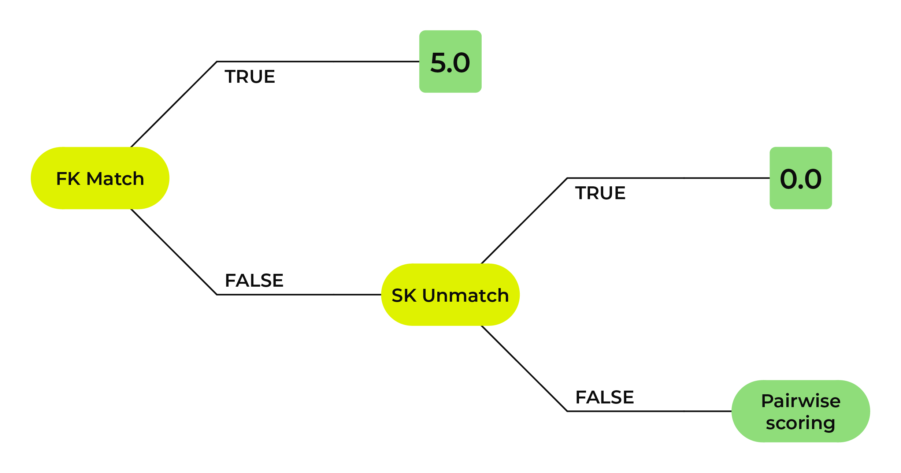
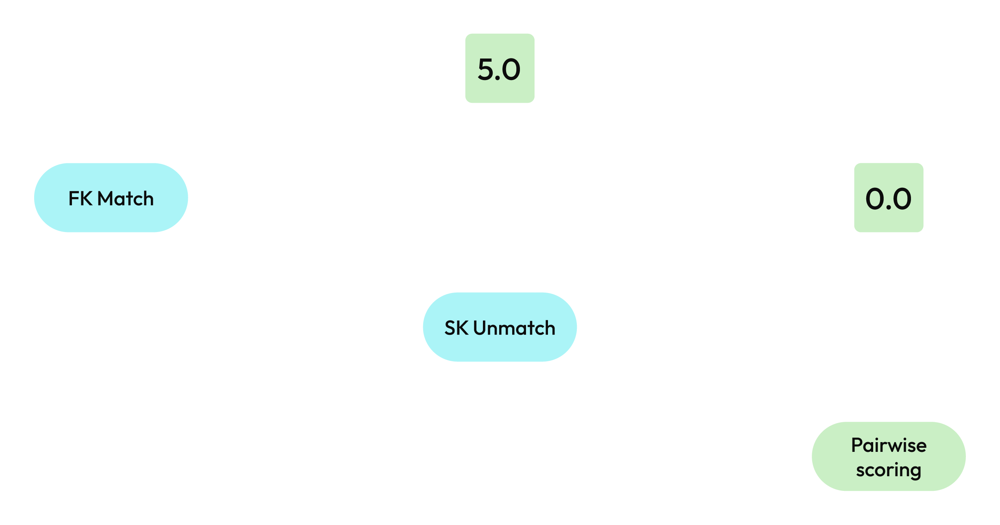
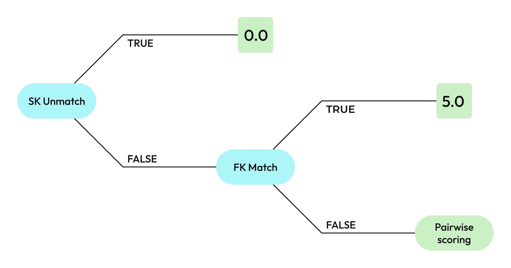
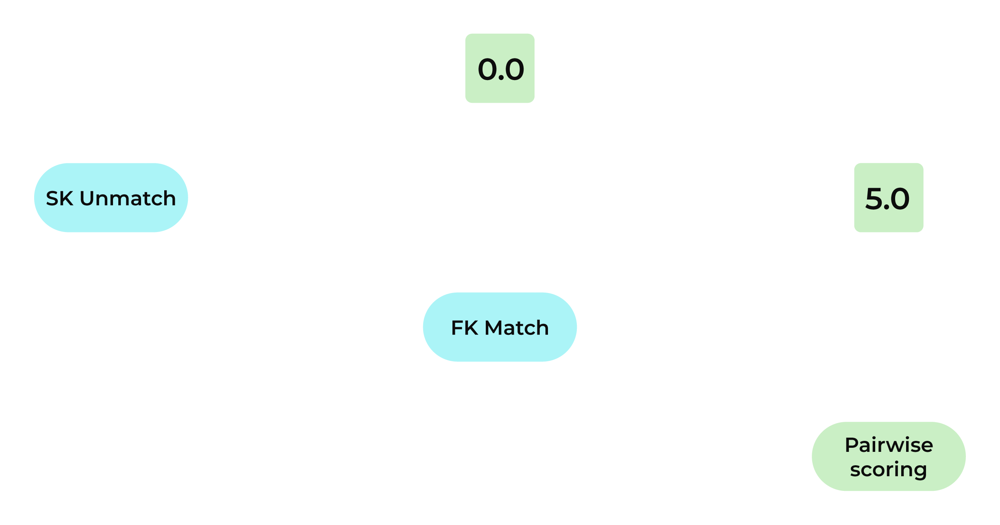

.. https://docs.amperity.com/operator/

.. meta::
    :description lang=en:
        Use the Stitch QA process to improve the quality of customer profiles.

.. meta::
    :content class=swiftype name=body data-type=text:
        Use the Stitch QA process to improve the quality of customer profiles.

.. meta::
    :content class=swiftype name=title data-type=string:
        Stitch QA

==================================================
Stitch QA
==================================================

.. qa-stitch-about-start

Stitch QA is an optional process that uses a dedicated database and a series of SQL queries to monitor the quality of Stitch results.

Stitch QA has three components: a Stitch QA database, a set of queries to run against the Stitch QA database, and a prescribed workflow to follow while analyzing the results of those queries.

Use these results to identify over- and underclustering, to identify values to be blocklisted or labeled, or to discover situations where tuning Stitch to match your tenant's data is necessary.

.. qa-stitch-about-end

.. _qa-stitch-enable:

Enable Stitch QA
==================================================

.. qa-stitch-enable-start

The Stitch QA workflow requires a collection of database tables and a collection of queries that are run against those tables. These collections are added in two steps:

#. :ref:`qa-stitch-enable-steps-add-database`
#. :ref:`qa-stitch-enable-steps-add-queries`

.. qa-stitch-enable-end

.. _qa-stitch-enable-steps-add-database:

Add Stitch QA database
--------------------------------------------------

.. qa-stitch-enable-steps-add-database-start

The recommended way to add the Stitch QA database to your tenant is to use the "Stitch QA" database template.

.. qa-stitch-enable-steps-add-database-end

**To add the Stitch QA database**

.. qa-stitch-enable-steps-add-database-steps-start

#. From the **Customer 360** page click **Create Database**.
#. Name the database "Stitch QA".
#. From the **Template** dropdown, select **Stitch QA**.
#. Click **Create**. This opens the **Database Editor** page and shows a list of preconfigured database tables.
#. Under **Database Type**, ensure that **Amp360** and **AmpIQ** are not selected.
#. Click the **Activate** button.
#. Open the menu for the activated Stitch QA database, and then select **Run**.
#. Take a few minutes to review the tables that are added by the "Stitch QA" database template.
#. Click **Activate**.
#. From the **Customer 360** page, under **All Databases**, open the menu for the Stitch QA database, select**Run Options**, **Normal**, and then **Run**.

.. qa-stitch-enable-steps-add-database-steps-end

.. qa-stitch-enable-steps-add-database-tables-start

The Stitch QA database is preconfigured with the following tables:

.. tip:: The following links open standalone pages for each table. This topic discusses how each of these tables fits within the recommended Stitch QA workflow.

* :doc:`Detailed Examples <table_detailed_examples>`
* :doc:`Unified Changes Clusters <table_unified_changes_clusters>`
* :doc:`Unified Changes PKS <table_unified_changes_pks>`
* :doc:`Unified Coalesced <table_unified_coalesced>`
* :doc:`Unified Preprocessed Raw <table_unified_preprocessed_raw>`
* :doc:`Unified Scores <table_unified_scores>`

.. qa-stitch-enable-steps-add-database-tables-end

.. qa-stitch-enable-steps-add-database-tables-uc-and-upr-start

.. tip:: The **Unified Coalesced** and **Unified Preprocessed Raw** tables are frequently used together during Stitch QA because many investigation patterns will compare the values in one table to the values in the other.

.. qa-stitch-enable-steps-add-database-tables-uc-and-upr-end

.. _qa-stitch-enable-steps-add-queries:

Add Stitch QA queries
--------------------------------------------------

.. qa-stitch-enable-steps-add-queries-start

The recommended way to add Stitch QA queries to your tenant is to use the "Stitch QA" query template. You can do this after you have added the Stitch QA database.

.. qa-stitch-enable-steps-add-queries-end

**To add Stitch QA queries**

.. qa-stitch-enable-steps-add-queries-steps-start

#. From the **Queries** page click **Create**, and then select **Add Folder**. This opens the **Create Folder** dialog box.
#. Name the folder "Stitch QA".
#. From the **Template** dropdown, select **Stitch QA**.
#. Click **Create**. This will create a folder, into which a collection of draft Stitch QA queries are added.
#. Take a few minutes to review the queries that are added by the "Stitch QA" query template.

.. qa-stitch-enable-steps-add-queries-steps-end

.. qa-stitch-enable-steps-add-queries-tables-start

The Stitch QA folder is preconfigured with the following queries:

.. tip:: The following links open standalone pages for each query. This topic discusses how each of these queries fits within the recommended Stitch QA workflow.

* :doc:`Bad foreign keys <stitch_qa_bad_foreign_keys>`
* :doc:`Cluster scores <stitch_qa_cluster_scores>`
* :doc:`Cluster size distribution <stitch_qa_cluster_size_distribution>`
* :doc:`Combined statistics <stitch_qa_combined_statistics>`
* :doc:`Common values <stitch_qa_common_values>`
* :doc:`Connections across sources <stitch_qa_connections_across_sources>`
* :doc:`Dedupe keys per Amperity ID <stitch_qa_dedupe_keys_per_amperity_id>`
* :doc:`Denormalized records <stitch_qa_denormalized_records>`
* :doc:`Foreign key validation <stitch_qa_fk_validation>`
* :doc:`Many Amperity IDs <stitch_qa_many_amperity_ids>`
* :doc:`Many semantic values <stitch_qa_many_semantic_values>`
* :doc:`NULL Amperity IDs <stitch_qa_null_amperity_ids>`
* :doc:`Separated statistics <stitch_qa_separated_statistics>`
* :doc:`Source cluster distribution <stitch_qa_source_cluster_distribution>`
* :doc:`Split clusters <stitch_qa_split_clusters>`
* :doc:`Unmatched semantic values <stitch_qa_unmatched_semantic_values>`
* :doc:`Weakest match <stitch_qa_weakest_match>`

.. note:: You should expect to customize and extend many of these queries to match the Stitch QA workflow requirements for your tenant. You may add queries to your Stitch QA workflow, as necessary.

.. qa-stitch-enable-steps-add-queries-tables-end

.. _qa-stitch-extend:

Extend Stitch QA
==================================================

.. qa-stitch-extend-start

The Stitch QA database should be extended to support the use of the bad-values blocklist and to **JOIN** the **Unified Preprocessed Raw** table to the **Unified Coalesced** table.

#. :ref:`Add Stitch BlocklistValues table <qa-stitch-extend-add-stitch-blocklistvalues>`.
#. :ref:`JOIN the Unified Preprocessed Raw table to Unified Coalesced table <qa-stitch-extend-update-unified-preprocessed-raw>`

.. qa-stitch-extend-end

.. _qa-stitch-extend-add-stitch-blocklistvalues:

Add Stitch BlocklistValues
--------------------------------------------------

.. include:: ../../amperity_operator/source/table_stitch_blocklistvalues.rst
   :start-after: .. table-stitch-blocklistvalues-add-start
   :end-before: .. table-stitch-blocklistvalues-add-end

**To add the Stitch BlocklistValues table**

.. include:: ../../amperity_operator/source/table_stitch_blocklistvalues.rst
   :start-after: .. table-stitch-blocklistvalues-add-steps-start
   :end-before: .. table-stitch-blocklistvalues-add-steps-end

.. _qa-stitch-extend-update-unified-preprocessed-raw:

Update Unified Preprocessed Raw
--------------------------------------------------

.. include:: ../../shared/terms.rst
   :start-after: .. term-unified-preprocessed-raw-table-start
   :end-before: .. term-unified-preprocessed-raw-table-end

.. include:: ../../amperity_operator/source/table_unified_preprocessed_raw.rst
   :start-after: .. table-unified-preprocessed-raw-cleaned-vs-uncleaned-start
   :end-before: .. table-unified-preprocessed-raw-cleaned-vs-uncleaned-end

.. include:: ../../amperity_operator/source/table_unified_preprocessed_raw.rst
   :start-after: .. table-unified-preprocessed-raw-cleaned-vs-uncleaned-sql-start
   :end-before: .. table-unified-preprocessed-raw-cleaned-vs-uncleaned-sql-end

.. qa-stitch-extend-update-unified-preprocessed-raw-start

Review the scenarios for :ref:`using cleaned vs. uncleaned data during Stitch QA <table-unified-preprocessed-raw-cleaned-vs-uncleaned>`, including :ref:`comparing semantic values <table-unified-preprocessed-raw-cleaned-vs-uncleaned-compare>`, :ref:`exploring cleaned values <table-unified-preprocessed-raw-cleaned-vs-uncleaned-explore>`, and :ref:`filtering by Amperity ID <table-unified-preprocessed-raw-cleaned-vs-uncleaned-filter>`.

.. qa-stitch-extend-update-unified-preprocessed-raw-end

.. _qa-stitch-what-to-look-for:

What to look for?
==================================================

.. qa-stitch-what-to-look-for-start

It is important to review the quality of Stitch results. The general process for reviewing these results, also referred to as Stitch QA, is to use a series of SQL queries to pull back results that identify issues like overclustering, underclustering, or supersized clusters that indicate areas within the customer data that need more attention.

These issues are most likely caused by values within the data itself, such as from the presence of nicknames or common values that are associated with business addresses, unmonitored email accounts, and so on. In most cases, additional configuration within Amperity, such as adding values to a blocklist, will resolve the issue. In some cases, updating configuration settings in Amperity will be the best approach for fine-tuning the quality of Stitch results.

* :ref:`Anomalies in Stitch output <qa-stitch-look-for-anomalies>`
* :ref:`Blocking keys <qa-stitch-look-for-blocking-keys>`
* :ref:`Customer keys <qa-stitch-look-for-customer-keys>`
* :ref:`Foreign keys <qa-stitch-look-for-foreign-keys>`
* :ref:`Overclustering <qa-stitch-look-for-overclustering>`
* :ref:`Problematic nicknames <qa-stitch-look-for-problematic-nicknames>`
* :ref:`Record pairs and scores <qa-stitch-look-for-record-pairs-scores>`
* :ref:`Review cluster details <qa-stitch-look-for-review-cluster-details>`
* :ref:`Semantic tags <qa-stitch-look-for-semantic-tags>`
* :ref:`Supersized clusters <qa-stitch-look-for-supersized-clusters>`
* :ref:`Underclustering <qa-stitch-look-for-underclustering>`
* :ref:`Values to blocklist <qa-stitch-look-for-values-to-blocklist>`

.. important:: Every tenant is different and the values, thresholds, and outcomes will be unique. Stitch QA starts with a generalized approach, but often requires tenant-specific changes to SQL queries and configuration settings within Amperity, such as for how to handle issues related to dedupe keys, data source quality, foreign keys, and PII. You should not take any tenant-specific steps until you have built the Stitch QA database, completed adding the Stitch QA SQL queries, and reviewed the initial results.

.. qa-stitch-what-to-look-for-end

.. _qa-stitch-look-for-anomalies:

Anomalies in Stitch output
--------------------------------------------------

.. qa-stitch-look-for-anomalies-start

It's important to look for anomalies in Stitch output.

.. qa-stitch-look-for-anomalies-end

**What to look for**

.. qa-stitch-look-for-anomalies-what-start

#. Run the :doc:`NULL Amperity IDs <stitch_qa_null_amperity_ids>` query to discover if **NULL** Amperity IDs are present in the customer 360 database. Investigate any records that are returned with **NULL** Amperity IDs.

   .. important:: The number of **NULL** Amperity IDs that should be present is zero.

#. Use the :doc:`Detailed Examples table <table_detailed_examples>` to review a detailed set of examples that show you what is in your customer 360 database.

   Use this data to identify which types of features lead to scores with the largest effects on overall Stitch results, including how they are associated to various fields that contain profile (PII) data.

   .. important:: The **Detailed Examples** table :ref:`must be configured to match the customer profile fields, blocklist values, and foreign keys <table-detailed-examples-use-with-stitch-qa>` that are in your tenant.

#. Identify values that can be added to the :doc:`bad-values blocklist <blocklist_bad_values>`, which prevents values from being part of the Stitch process.

.. qa-stitch-look-for-anomalies-what-end

.. _qa-stitch-look-for-blocking-keys:

Blocking keys
--------------------------------------------------

.. include:: ../../shared/terms.rst
   :start-after: .. term-bk-start
   :end-before: .. term-bk-end

.. include:: ../../shared/terms.rst
   :start-after: .. term-blocking-start
   :end-before: .. term-blocking-end

.. include:: ../../shared/terms.rst
   :start-after: .. term-blocking-strategy-start
   :end-before: .. term-blocking-strategy-end

**What to look for**

.. qa-stitch-look-for-blocking-keys-what-start

#. The blocking size limit for blocking keys is 100. When blocking returns a group of records that exceeds this limit the group is split apart.

   In some cases, large clusters are split even with matching PII because of this limit. For example:

   .. code-block:: sql
      :linenos:

      SELECT
        COUNT(*)
      FROM Unified_Preprocessed_Raw
      WHERE LOWER(email) = 'someone@email.com'

   For example, the following query returns 185 rows:

   .. code-block:: sql
      :linenos:

      SELECT COUNT(*)
      FROM Unified_Preprocessed_Raw
      WHERE LOWER(email) = 'derek@amperity.com'

   185 rows exceeds the blocking limit of 100. It is likely that this email address should not be assocated with 185 distinct records.

#. Use similar queries to return values that exceed the blocking limit. Look for values that should not be associated with high numbers of distinct records and that exceed the blocking size limit threshold. Add these values to the :doc:`bad-values blocklist <blocklist_bad_values>` as necessary.

.. qa-stitch-look-for-blocking-keys-what-end

.. _qa-stitch-look-for-customer-keys:

Customer keys
--------------------------------------------------

.. include:: ../../shared/terms.rst
   :start-after: .. term-customer-key-start
   :end-before: .. term-customer-key-end

**What to look for**

.. qa-stitch-look-for-customer-keys-what-start

#. Run the :doc:`dedupe keys per Amperity ID <stitch_qa_dedupe_keys_per_amperity_id>` query to return a rough distribution of dedupe keys to Amperity ID. Customer keys are interesting because they show before and after for entity distribution.

   Update this query to use customer keys, and then run the query. You should not expect obvious "good" or "bad" results, instead focus on clusters that return 2 or more dedupe keys.

.. qa-stitch-look-for-customer-keys-what-end

.. _qa-stitch-look-for-foreign-keys:

Foreign keys
--------------------------------------------------

.. include:: ../../shared/terms.rst
   :start-after: .. term-foreign-key-start
   :end-before: .. term-foreign-key-end

.. include:: ../../shared/terms.rst
   :start-after: .. term-fk-start
   :end-before: .. term-fk-end

.. include:: ../../amperity_reference/source/semantics.rst
   :start-after: .. semantics-key-foreign-start
   :end-before: .. semantics-key-foreign-end

**What to look for**

.. qa-stitch-look-for-foreign-keys-what-start

#. Look for records where :ref:`the Amperity ID and a foreign key. <qa-stitch-look-for-foreign-keys-bad-matches>`  are equal, but one or more values associated with **email**, **given-name**, and **surname** are not.
#. :ref:`Compare foreign keys across data sources. <qa-stitch-look-for-foreign-keys-compare>`
#. Return a rough distribution of :ref:`deduplicated foreign keys <qa-stitch-look-for-foreign-keys-deduplicated-distribution>`, and then look for clusters of records 2 or more.
#. Investigate if blocking size limits for :ref:`foreign keys caused splits <qa-stitch-look-for-foreign-keys-limit>` to groups of records.
#. Are foreign keys being :ref:`prioritized over separation keys <qa-stitch-look-for-foreign-keys-prioritization>` correctly?
#. Look for records that :ref:`score at 5.0 <qa-stitch-look-for-foreign-keys-trivial-duplicates>`, but do not have foreign keys in common.

.. qa-stitch-look-for-foreign-keys-what-end

.. _qa-stitch-look-for-foreign-keys-bad-matches:

Bad foreign key matches
++++++++++++++++++++++++++++++++++++++++++++++++++

.. qa-stitch-look-for-foreign-keys-bad-matches-start

Run the :doc:`bad foreign key matches <stitch_qa_bad_foreign_keys>` query to return records where the Amperity ID and a foreign key are equal, but one or more values associated with **email**, **given-name**, and **surname** are not equal.

.. qa-stitch-query-bad-foreign-key-matches-tip-start

.. tip:: Foreign keys are matched deterministically which can lead to incorrect matches or overclustering.

.. qa-stitch-query-bad-foreign-key-matches-tip-end

The presence of bad foreign key matches is an indicator of :ref:`overclustering <qa-stitch-look-for-overclustering>`.

.. qa-stitch-look-for-foreign-keys-bad-matches-end

.. _qa-stitch-look-for-foreign-keys-compare:

Compare foreign keys
++++++++++++++++++++++++++++++++++++++++++++++++++

.. qa-stitch-look-for-foreign-keys-compare-start

Run the :doc:`foreign key validation <stitch_qa_fk_validation>` query and compare coverage and distribution results for foreign keys across data sources.

.. note:: The foreign key validation query is not added by the "Stitch QA" queries template.

.. qa-stitch-look-for-foreign-keys-compare-end

.. qa-stitch-query-fk-validation-use-start

.. important:: The foreign key validation query is a series of small **SELECT** statements that can help focus on and narrow-down specific use cases for validating foreign keys. Use this query to:

   #. Look for :ref:`name IDs with multiple Amperity IDs <stitch-qa-query-fk-validation-name-ids-with-multiple-amperity-ids>`.
   #. Look for :ref:`name IDs with different Amperity IDs <stitch-qa-query-fk-validation-name-ids-with-different-amperity-ids>`.
   #. Inspect :ref:`name IDs across tables <stitch-qa-query-fk-validation-inspect-name-ids>`.
   #. Check for :ref:`foreign keys with multiple Amperity IDs <stitch-qa-query-fk-validation-multiple-amperity-ids>` across tables.
   #. Check for :ref:`foreign keys with different Amperity IDs <stitch-qa-query-fk-validation-different-amperity-ids>` across tables.
   #. Inspect :ref:`foreign keys across tables <stitch-qa-query-fk-validation-inspect-between-tables>`.

.. qa-stitch-query-fk-validation-use-end

.. _qa-stitch-look-for-foreign-keys-deduplicated-distribution:

Deduplicated distribution
++++++++++++++++++++++++++++++++++++++++++++++++++

.. qa-stitch-look-for-foreign-keys-dedupe-distribution-start

Run the :doc:`dedupe keys per Amperity ID <stitch_qa_dedupe_keys_per_amperity_id>` query to return a rough distribution of dedupe keys to Amperity ID.

Foreign keys are interesting because Amperity deterministically matches on them in most situations. When there are 2 or more dedupe keys related to foreign keys, this is an indicator that records were connected beyond what could have been connected deterministically.

Update the query to use foreign keys, and then run the query. You should not expect obvious "good" or "bad" results, instead focus on clusters that return 2 or more dedupe keys. Evidence of records that are connected, but were previously independent, is :ref:`an indicator of overclustering <qa-stitch-look-for-overclustering>`.

.. tip:: Use concatenated values, such as "datasource + fk", to focus the results on a per-source level.

.. qa-stitch-look-for-foreign-keys-dedupe-distribution-end

.. _qa-stitch-look-for-foreign-keys-limit:

Foreign key limits
++++++++++++++++++++++++++++++++++++++++++++++++++

.. include:: ../../shared/terms.rst
   :start-after: .. term-blocking-start
   :end-before: .. term-blocking-end

.. qa-stitch-look-for-foreign-keys-blocking-limit-start

The size limit for foreign keys is 1000. When blocking returns a group of records that exceeds this limit the group is split apart.

In some cases, large clusters are split even with matching PII because of this limit. This most often occurs with data sourced from interaction records, test accounts, booking agents, common addresses, and other values that appear at high rates within data. Use the :doc:`bad-values blocklist <blocklist_bad_values>` to remove these values, and then rerun Amperity and review the updated Stitch results.

.. qa-stitch-look-for-foreign-keys-blocking-limit-end

.. _qa-stitch-look-for-foreign-keys-prioritization:

Foreign key prioritization
++++++++++++++++++++++++++++++++++++++++++++++++++

.. qa-stitch-look-for-foreign-keys-prioritization-start

Are foreign keys being prioritized over separation keys?

.. qa-stitch-look-for-foreign-keys-prioritization-end

.. configure-stitch-advanced-matching-strategy-fk-start

When foreign key matching is the priority, Amperity scores record pairs in the following order:

#. Does the record contain identical foreign key values?
#. If true, assign score 5.0. Stop.
#. If false, does the record contain conflicting separation key values?
#. If true, assign score 0.0. Stop.
#. If false, use pairwise comparison scoring.

.. configure-stitch-advanced-matching-strategy-fk-end

.. configure-stitch-advanced-matching-strategy-start

Amperity is configured by default to prioritize foreign key matching over separation key unmatching.

.. configure-stitch-advanced-matching-strategy-end

.. _qa-stitch-look-for-foreign-keys-trivial-duplicates:

Presence of trivial duplicates
++++++++++++++++++++++++++++++++++++++++++++++++++

.. include:: ../../shared/terms.rst
   :start-after: .. term-trivial-duplicate-start
   :end-before: .. term-trivial-duplicate-end

.. qa-stitch-look-for-foreign-keys-trivial-duplicates-start

In some cases, more than one nearly-identical record is passed to downstream Stitch processes. These nearly-identical records are referred to as "trivial duplicates".

For example, a situation where a high number of records are associated to the same foreign key, the same email address, and the same name, but many individual record are associated to a unique physical address.

In this case, the address field is consistently unreliable. A semantic exclusion configured for **address**, **city**, **state**, and **postal** would cause these unique address fields to be ignored when collapsing trivial duplicates.

This approach can help records survive blocking by ensuring groups of records are more likely to be under the blocking size limit. The **address**, **city**, **state**, and **postal** fields are not ignored during pairwise comparison scoring.

.. qa-stitch-look-for-foreign-keys-trivial-duplicates-end

**What to look for**

.. qa-stitch-look-for-foreign-keys-trivial-duplicates-what-start

#. Use a combination of the :doc:`Unified Coalesced <table_unified_coalesced>` and :doc:`Unified Preprocessed Raw <table_unified_preprocessed_raw>` tables to review and compare the data that is associated with these records to help understand why groups of records were matched or why certain records were assigned to a cluster.

   .. tip:: The **Unified Coalesced** table contains two useful columns that help identify trivial duplicates: **rep_ds** and **rep_pk**.

      * **rep_pk** is an identifier that represents the first grouping of records done by Stitch. This grouping is based on identical semantic patterns.
      * **rep_ds** is the datasource that is associated with the **rep_pk** column.

      The combination of **rep_ds** and **rep_pk** represent nearly-identical records that were grouped together by Stitch early in the identity resolution process. (These nearly-identical records are also referred to as a "trivial duplicate".) All of these nearly-identical records are treated as a single record by downstream Stitch processes.

   .. include:: ../../amperity_reference/source/semantics.rst
      :start-after: .. semantics-key-foreign-trivial-duplicates-start
      :end-before: .. semantics-key-foreign-trivial-duplicates-end

#. Look for records that score at 5.0, but do not have foreign keys in common. One (or both) records likely have a trivial duplicate with another record with a different foreign key, causing there to be a foreign key match between two groups of trivial duplicates.
#. If a trivial duplicate is identified, :ref:`configure Stitch to use a semantic exclusion <configure-stitch-advanced-trivial-duplicates-exclusions>`.

.. qa-stitch-look-for-foreign-keys-trivial-duplicates-what-end

.. include:: ../../amperity_operator/source/configure_stitch.rst
   :start-after: .. configure-stitch-advanced-trivial-duplicates-warning-start
   :end-before: .. configure-stitch-advanced-trivial-duplicates-warning-end

.. _qa-stitch-look-for-overclustering:

Overclustering
--------------------------------------------------

.. include:: ../../shared/terms.rst
   :start-after: .. term-overcluster-start
   :end-before: .. term-overcluster-end

.. qa-stitch-look-for-overclustering-important-start

.. important:: The presence of overclustering has the greatest effect on Stitch quality!

.. qa-stitch-look-for-overclustering-important-end

.. qa-stitch-look-for-overclustering-start

For example, two records with the same Amperity ID look as if they should be two records with different Amperity IDs because:

* They do not have common profile (PII) values.
* They were linked together by a foreign key, but without a hard conflict.
* They were :ref:`assigned a 5.0 score by foreign key matching priority <qa-stitch-look-for-foreign-keys-prioritization>`.

.. qa-stitch-look-for-overclustering-end

**What to look for**

.. qa-stitch-look-for-overclustering-what-start

#. Run the :doc:`bad foreign key matches <stitch_qa_bad_foreign_keys>` query to return records where the Amperity ID and a foreign key are equal, but one or more values associated with **email**, **given-name**, and **surname** are not equal.
#. Run the :doc:`many semantic values <stitch_qa_many_semantic_values>` query to explore cases where a single Amperity ID is associated with many different semantic values or associated with combinations of semantic values that are generally good identifiers.
#. Run the :doc:`cluster size distribution <stitch_qa_cluster_size_distribution>` query and look for a long-tail of supersized clusters.
#. Run the :doc:`dedupe keys per Amperity ID <stitch_qa_dedupe_keys_per_amperity_id>` query to return a rough distribution of dedupe keys to Amperity ID.

   :ref:`Foreign keys <qa-stitch-look-for-foreign-keys-deduplicated-distribution>` are interesting because Amperity deterministically matches on them in most situations. :ref:`Customer keys <qa-stitch-look-for-customer-keys>` are interesting because they show before and after for entity distribution.

   You should not expect obvious "good" or "bad" results, instead focus on clusters that return 2 or more dedupe keys.

#. Run the :doc:`common values <stitch_qa_common_values>` query to return common values across semantics in a single view that shows cardinality for semantic values and the context for values that occur across records and clusters.

#. .. include:: ../../shared/terms.rst
      :start-after: .. term-hard-conflict-start
      :end-before: .. term-hard-conflict-end

   If you identify values with a hard conflict, use :doc:`Stitch labels <stitch_labels>`.

#. Investigate the :ref:`record pairs for the source of the 5.0 score <qa-stitch-look-for-record-pairs-scores>`. Are there any transitive connections between the two records caused by the foreign key?

   .. include:: ../../shared/terms.rst
      :start-after: .. term-transitive-connection-start
      :end-before: .. term-transitive-connection-end

#. Are :ref:`trivial duplicates <qa-stitch-look-for-foreign-keys-trivial-duplicates>` present?

   .. include:: ../../shared/terms.rst
      :start-after: .. term-trivial-duplicate-start
      :end-before: .. term-trivial-duplicate-end

#. Use a combination of the :doc:`Unified Coalesced <table_unified_coalesced>` and :doc:`Unified Preprocessed Raw <table_unified_preprocessed_raw>` tables to review and compare the values associated overclustering.

.. qa-stitch-look-for-overclustering-what-end

.. _qa-stitch-look-for-problematic-nicknames:

Problematic nicknames
--------------------------------------------------

.. qa-stitch-look-for-problematic-nicknames-start

Nicknames can affect the results of blocking and clustering when they prevent obvious matches from being matched. For example, Mike is a nickname for Michael. :ref:`Blocking strategies <configure-stitch-advanced-clustering-blocking>` that include **given-name** use the first three characters to match records.

In this example, "Mik" and "Mic" do not match, but :ref:`depending the presence of foreign keys and other profile values <configure-stitch-advanced-clustering-matching-strategy>` (like **email**, **surname**, **phone**, and **address**), these records may still be scored together.

Amperity pre-loads a set of common nicknames to your tenant in the form of a static CSV file. This file has thousands of nicknames, including all of the most common nicknames, along with many variations. You can :doc:`upload your own static CSV files to extend the list of common nicknames to add and/or remove nicknames <stitch_nicknames>` as needed for your tenant.

.. qa-stitch-look-for-problematic-nicknames-end

.. _qa-stitch-look-for-record-pairs-scores:

Record pairs and scores
--------------------------------------------------

.. qa-stitch-look-for-record-pairs-scores-start

The quality of record pairs and their associated pairwise comparison scores should be investigated, starting with low-scoring record pairs in each cluster. At the start of the Stitch QA process it is not uncommon for low-scoring record pairs in a cluster to fall below threshold for pairwise comparison scoring.

Each cluster of records will contain high-scoring record pairs with transitive connections to other high-scoring record pairs. A low-scoring record pair often does not show a transitive connection to a high-scoring record pair.

Each cluster with low-scoring record pairs should be investigated to confirm if those pairs were accurately clustered and to determine if transitive connections to other high-scoring record pairs do exist.

.. note:: As the Stitch QA process moves forward you should expect to see a notable decline over time for the number of clusters in which low-scoring record pairs fall below threshold for pairwise comparison scoring.

.. qa-stitch-look-for-record-pairs-scores-end

**What to look for**

.. qa-stitch-look-for-record-pairs-scores-what-start

#. Run the :doc:`weakest match <stitch_qa_weakest_match>` query and examine low-scoring record pairs to confirm if those records were accurately clustered.
#. Run the :doc:`cluster scores <stitch_qa_cluster_scores>` query to investigate pairwise comparison scores for individual clusters or for a set of clusters.
#. Nicknames (unusual or less common) can be a reason for a low-scoring record pair.
#. Consider tuning Stitch to :ref:`raise or lower the pairwise comparison scoring threshold <configure-stitch-advanced-clustering-matching-thresholds>`. The default threshold is 3.0.

   .. important:: The default threshold is recommended, regardless of data quality or volume of data or quality of your current Stitch results. A lower threshold leads to more matches and fuzzier matched pairs, whereas a higher threshold will lead to fewer matches and more precise matched pairs. The default threshold is the right balance. Look for ways to resolve low-scoring record pairs without changing the pairwise comparison scoring threshold.

.. qa-stitch-look-for-record-pairs-scores-what-end

.. _qa-stitch-look-for-review-cluster-details:

Review cluster details
--------------------------------------------------

.. qa-stitch-look-for-review-cluster-details-start

You should periodically review at a high level cluster sizes and source cluster distributions across all clusters, along with a count of clusters comprised of records that span data sources.

.. qa-stitch-look-for-review-cluster-details-end

**What to look for**

.. qa-stitch-look-for-review-cluster-details-start

#. Run the :doc:`cluster size distribution <stitch_qa_cluster_size_distribution>` query to identify if distinct entities are clustered together, if :ref:`clusters are supersized <qa-stitch-look-for-supersized-clusters>`, or for other :ref:`indicators of overclustering <qa-stitch-look-for-overclustering>`.
#. Run the :doc:`source cluster distribution <stitch_qa_source_cluster_distribution>` query to return a breakdown of record-to-cluster size distribution by datasource.
#. Run the :doc:`connections across sources <stitch_qa_connections_across_sources>` query to return a count of clusters that are comprised of records across various combinations of datasources.
#. Run the :doc:`combined statistics <stitch_qa_combined_statistics>` query to return an overview of Stitch statistics that contains the number of records, accounts, Amperity IDs, singletons, clusters with more than one record, overall deduplication rate, and the deduplication rate across all data sources.
#. Run the :doc:`separated statistics <stitch_qa_separated_statistics>` query to return an overview of Stitch statistics, separated by dedupe keys and tables.

.. qa-stitch-look-for-review-cluster-details-end

.. _qa-stitch-look-for-semantic-tags:

Semantic tags
--------------------------------------------------

.. qa-stitch-look-for-semantic-tags-start

Be sure to apply semantic tags consistently across data sources, in particular for :ref:`profile (PII) <semantics-profile>` and :ref:`keys (customer, blocking, foreign, and separation) <semantics-keys>`. Semantic tags that are not applied correctly may be ignored by Stitch, be recognized as custom semantic tags, or may provide unexpected results.

.. qa-stitch-look-for-semantic-tags-end

.. table-unified-preprocessed-raw-use-with-qa-stitch-tags-keys-start

Use the **Customer 360** page to verify that rows with profile semantic tags and foreign keys are selected to be available to the **Queries** page. Has the list of profile and/or foreign key semantics changed since the last time you have performed Stitch QA? This will occur when a data source is added that requires a new foreign key *or* in a situation where one of the less frequently used profile semantic tags is applied to a new data source.

Open the table in the **Database Explorer** and verify that all rows in the table that are associated with a semantic tag or a foreign key have a checkmark in the left column. Rows without a checkmark will not make the associated **FIELD** available to the **Queries** page. If rows do not have a checkmark, edit the table and apply the checkmark, save the table, activate the Stitch QA database, and then run the database to refresh the table.

.. table-unified-preprocessed-raw-use-with-qa-stitch-tags-keys-end

.. qa-stitch-look-for-semantic-tags-tip-start

.. tip:: Be precise with email addresses, phone numbers, and physical addresses that require ordinal or namespace semantic tags. If these tags are inconsistent or inaccurate, the values may be ignored by Stitch.

   Use the **Unified Preprocessed Raw** table to verify if data was used by the Stitch process. For example, if two phone numbers were tagged, one with **phone** and one with a ordinal or namespace, but did not appear in the **Unified Preprocessed Raw** table, that is an indicator that the orginal or namespace semantic tagging was done improperly.

   For the correct way to apply ordinal or namespace semantic tags, see:

   * :ref:`Email addresses <semantics-profile-type-email>`
   * :ref:`Phone numbers <semantics-profile-type-phone>`
   * :ref:`Physical addresses <semantics-profile-type-address>`

.. qa-stitch-look-for-semantic-tags-tip-end

**What to look for**

.. qa-stitch-look-for-semantic-tags-what-start

#. The output of semantic tags is discoverable from the :doc:`Unified Preprocessed Raw <table_unified_preprocessed_raw>` and :doc:`Unified Coalesced <table_unified_coalesced>` tables.

   Look for inconsistencies in the results of semantic tagging and, if discovered, edit them to apply consistent tagging patterns, rerun Stitch, and then re-review the results.

#. Run the :doc:`split clusters <stitch_qa_split_clusters>` query to investigate patterns in split clusters that lack transitive connections for names, email addresses, and/or post office boxes, and for semantic tagging issues that may arise when using multiple, ordinal, or namespaced semantics.
#. Run the :doc:`many Amperity IDs <stitch_qa_many_amperity_ids>` query to look for underclustering. The results of this query help identify incorrectly split entities, explain the cardinality of semantic values, and identify values to add to the :doc:`bad-values blocklist <blocklist_bad_values>`.
#. Run the :doc:`many semantic values <stitch_qa_many_semantic_values>` query to explore cases where a single Amperity ID is associated with many different semantic values or associated with combinations of semantic values that are generally good identifiers.
#. Run the :doc:`unmatched semantic values <stitch_qa_unmatched_semantic_values>` query and look for situations where unique semantic values are equal, but Amperity IDs are not.

   This query has a :ref:`variety of use cases focused on individual semantic values <stitch-qa-query-unmatched-semantic-values-use>`, such as running against only **email**, **phone**, or **address** semantic values, combinations of semantic values, frequency limits, and so on.

.. qa-stitch-look-for-semantic-tags-what-end

.. _qa-stitch-look-for-supersized-clusters:

Supersized clusters
--------------------------------------------------

.. include:: ../../shared/terms.rst
   :start-after: .. term-supersized-cluster-start
   :end-before: .. term-supersized-cluster-end

.. configure-stitch-advanced-configuration-supersized-clusters-example-start

A supersized cluster is created when multiple transitive connections are present. For example, a couple named Mary Johnson and Jeffrey Johnson with the following records:

#. Mary Johnson, maryjohnson @gmail.com, 50 1st Avenue, New York, NY, with 50 connected records.
#. Jeffrey Johnson, jeffjohnson @gmail.com, 50 1st Avenue, New York, NY, with 25 connected records.
#. Mary Johnson, mjohnson50 @gmail.com, 50 1st Avenue, New York, NY, with 17 connected records.
#. Jeffrey Johnson, mjohnson50 @gmail.com, 50 1st Avenue, New York, NY, with 8 connected records.

These records block together in the following ways:
   
* Records 1 and 3 block together on name and address.
* Records 2 and 4 block together on name and address.
* Records 3 and 4 block together on email.

All four groups of records transitively connect into a single connected cluster with a size of 100.

.. configure-stitch-advanced-configuration-supersized-clusters-example-end

**What to look for**

.. qa-stitch-look-for-supersized-clusters-what-start

#. Run the :doc:`cluster size distribution <stitch_qa_cluster_size_distribution>` query and look for a long-tail of supersized clusters.
#. Look at the **is_supersized** and **supersized_id** columns in the :doc:`Unified Coalesced <table_unified_coalesced>` table, and then compare with the **supersized_id** column in the :doc:`Unified Preprocessed Raw <table_unified_preprocessed_raw>` table.
#. The presence of supersized clusters is a strong indicator of :ref:`overclustering <qa-stitch-look-for-overclustering>`.
#. Consider tuning Stitch to :ref:`raise or lower the threshold at which a supersized cluster is defined <configure-stitch-advanced-profile-supersized-clusters>`. The default threshold is "64".

.. qa-stitch-look-for-supersized-clusters-what-end

.. _qa-stitch-look-for-underclustering:

Underclustering
--------------------------------------------------

.. include:: ../../shared/terms.rst
   :start-after: .. term-undercluster-start
   :end-before: .. term-undercluster-end

**What to look for**

.. qa-stitch-look-for-underclustering-what-start

#. Run the :doc:`unmatched semantic values <stitch_qa_unmatched_semantic_values>` query and look for situations where unique semantic values are equal, but Amperity IDs are not.

   This query has a :ref:`variety of use cases focused on individual semantic values <stitch-qa-query-unmatched-semantic-values-use>`, such as running against only **email**, **phone**, or **address** semantic values, combinations of semantic values, frequency limits, and so on.

#. Run the :doc:`common values <stitch_qa_common_values>` query to return common values across semantics in a single view that shows cardinality for semantic values and the context for values that occur across records and clusters.
#. Run the :doc:`many Amperity IDs <stitch_qa_many_amperity_ids>` query to look for underclustering. The results of this query help identify incorrectly split entities, explain the cardinality of semantic values, and identify values to add to the :doc:`bad-values blocklist <blocklist_bad_values>`.
#. Look for two records that have been assigned different Amperity IDs, but should have been assigned the same Amperity ID. Do they share a foreign key? Do they have profile (PII) values in common?
#. Determine if your :ref:`foreign key matching vs. separation key unmatching <configure-stitch-advanced-clustering-matching-strategy>` strategy needs to be modified. 
#. Are larger clusters part of a :ref:`supersized cluster <qa-stitch-look-for-supersized-clusters>`?
#. Look at the first names. Are they similar to the human eye, but potentially different based on edit distance? Should they be added to the :ref:`list of common nicknames <qa-stitch-look-for-problematic-nicknames>`?
#. Open the :doc:`Unified Coalesced <table_unified_coalesced>` and :doc:`Unified Preprocessed Raw <table_unified_preprocessed_raw>` tables and compare values in the **component_id** column. Did these records block together?

   .. include:: ../../shared/terms.rst
      :start-after: .. term-component-id-different-start
      :end-before: .. term-component-id-different-end

#. Were :ref:`blocking size limits <qa-stitch-look-for-blocking-keys>` exceeded? Does your tenant have the right set of :ref:`blocking strategies <configure-stitch-advanced-clustering-blocking>` configured?
#. Are :ref:`trivial duplicates <qa-stitch-look-for-foreign-keys-trivial-duplicates>` present?
#. Do business email addresses need to be allowed? Update the Stitch :ref:`preprocessing profiles <configure-stitch-advanced-profiles>` configuration setting to **allow-business-email**.

.. qa-stitch-look-for-underclustering-what-end

.. _qa-stitch-look-for-values-to-blocklist:

Values to blocklist
--------------------------------------------------

.. include:: ../../shared/terms.rst
   :start-after: .. term-bad-values-blocklist-start
   :end-before: .. term-bad-values-blocklist-end

**What to look for**

.. qa-stitch-look-for-values-to-blocklist-what-start

#. Verify that the :ref:`Stitch BlocklistValues table is configured for use in the Stitch QA database <bad-values-blocklist-add-stitch-blocklistvalues-table>`.
#. Review the values in the :doc:`bad-values blocklist <blocklist_bad_values>`, including :ref:`global blocklist values <bad-values-blocklist-global-values>`.
#. Values to blocklist are often identified as an outcome of using Stitch QA to look for :ref:`looking for general anomalies <qa-stitch-look-for-anomalies>`, :ref:`inconsistent foreign keys <qa-stitch-look-for-foreign-keys>`, :ref:`inconsistent blocking keys <qa-stitch-look-for-blocking-keys>`, and :ref:`underclustering <qa-stitch-look-for-underclustering>`. 

   .. tip:: If your starting point in Stitch QA is the bad-values blocklist, run the following Stitch QA queries:

   #. Run the :doc:`common values <stitch_qa_common_values>` query to return common values across semantics in a single view that shows cardinality for semantic values and the context for values that occur across records and clusters.
   #. Run the :doc:`many Amperity IDs <stitch_qa_many_amperity_ids>` query to identify values to add to the :doc:`bad-values blocklist <blocklist_bad_values>`.
   #. Run the :doc:`unmatched semantic values <stitch_qa_unmatched_semantic_values>` query and look for situations where unique semantic values are equal, but Amperity IDs are not.

      The unmatched semantic values query has a :ref:`variety of use cases focused on individual semantic values <stitch-qa-query-unmatched-semantic-values-use>`, such as running against only **email**, **phone**, or **address** semantic values, combinations of semantic values, frequency limits, and so on.

#. Use a combination of the :doc:`Unified Coalesced <table_unified_coalesced>` and :doc:`Unified Preprocessed Raw <table_unified_preprocessed_raw>` tables to review and compare the values associated with **blv_** columns in the **Unified Coalesced** table. Are these values in the :doc:`Stitch BlocklistValues table <table_stitch_blocklistvalues>`?

   .. tip:: The **Unified Preprocessed Raw** table is the best source for verifying if profile (PII) data was removed by the bad-values blocklist.

#. Add values to the bad-values blocklist that should be ignored by Stitch.

   .. note:: If you identify values that should be processed by Stitch, but not made available to the customer 360 database, use :doc:`Stitch labels <stitch_labels>`.

.. qa-stitch-look-for-values-to-blocklist-what-end
