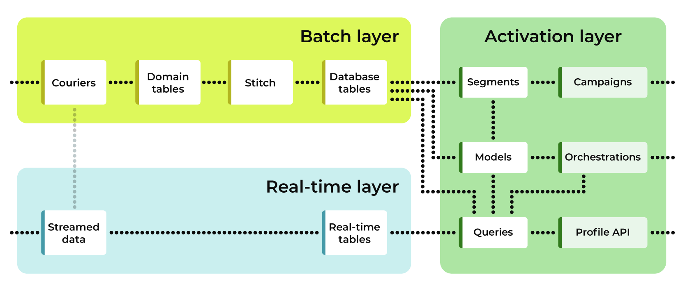
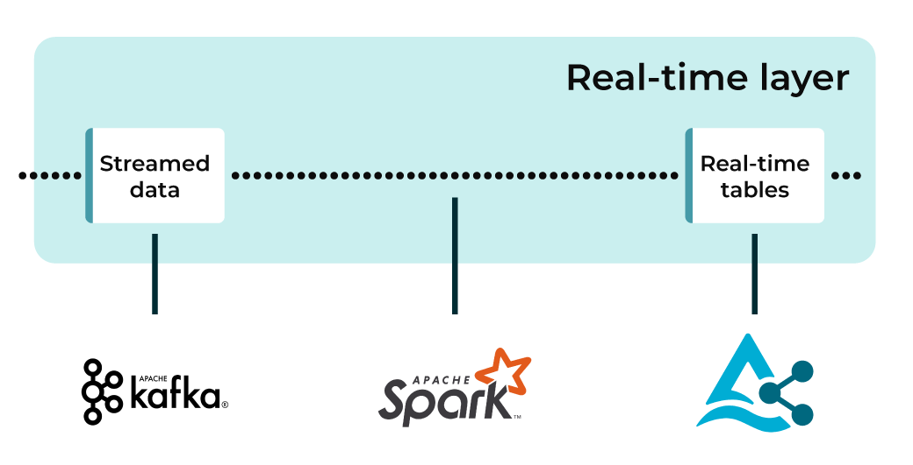

.. https://docs.amperity.com/operator/

.. meta::
    :description lang=en:
        Real-time tables enable use cases that require the use of time-sensitive data.

.. meta::
    :content class=swiftype name=body data-type=text:
        Real-time tables enable use cases that require the use of time-sensitive data.

.. meta::
    :content class=swiftype name=title data-type=string:
        Real-time tables

==================================================
Real-time tables
==================================================

.. real-time-about-start

Real-time tables contain data that is streamed to Amperity. Real-time tables are available alongside customer profiles in your brand's customer 360 database. Real-time tables complement the daily batch process that builds and maintains complete and durable customer profiles over longer timeframes by enabling use cases that require the use of time-sensitive data that is updated more frequently.

.. real-time-about-end

.. _realtime-howitworks:

How real-time tables work
==================================================

.. realtime-howitworks-start

Amperity uses a batch layer to build and maintain customer profiles that are durable and complete over longer timeframes. The batch layer is typically run and refreshed on a daily basis.

Amperity uses a streaming layer to support use cases that require data that is updated or refreshed more than once per day.

These layers are shown in the following diagram:

The batch layer builds and maintains customer profiles that are durable and complete over long timeframes. The batch layer uses semantic tagging to standardize data into a collection of standard output tables for customer profiles, transactions, loyalty programs, product catalogs, and other types of data that your brand has made available to Amperity.

The streaming layer makes data available for use alongside those profiles to support use cases that cannot wait for the batch layer to finish maintaining customer profiles. To support real-time use cases, configure a real-time table for each stream, add real-time tables to a database as passthrough tables, and then use a query to build a profile API endpoint that can be accessed programmatically by downstream workflows.

.. note:: The batch layer may also contain data that has arrived through the streaming layer. To support adding streamed data to your brand's customer profiles, configure a courier to pull the streamed data into the workflow.

.. realtime-howitworks-end

.. _realtime-howitworks-details:

Architectural details
--------------------------------------------------

.. realtime-howitworks-details-start

Amperity uses the following components to enable real-time tables: Apache Kafka, Apache Spark Structured Streaming, and Delta Tables.

1. `Apache Kafka <https://kafka.apache.org/>`__ |ext_link| reliably handles real-time events and acts as the queuing and persistence layer for real-time tables.

2. `Apache Spark Structured Streaming <https://spark.apache.org/streaming/>`__ |ext_link| moves data from Apache Kafka queues to the Amperity platform in real-time using fault-tolerant, low-latency stream processing that handles real-time data with precision.

3. Real-time tables are stored as `Delta Lake tables <https://delta.io/>`__ |ext_link| and expose real-time data to the Amperity Activation layer.

.. realtime-howitworks-details-end

.. _realtime-howitworks-limitations:

Real-time table limitations
--------------------------------------------------

.. realtime-howitworks-limitations-start

Real-time tables have the following limitations:

#. Streamed data takes up to 2 minutes to appear in a real-time table.
#. Events that partially match the schema for a real-time table appears in a real-time table; events that do not match the schema will not.
#. The Streaming Ingest API is the only supported data source for real-time tables.
#. Data is loaded to real-time tables as an append; data may not be deleted from a real-time table.
#. Real-time table schemas cannot be updated. Create a new real-time table, and then connect that table to the stream that contains the updated schema. (This may be the same Streaming Ingest API endpoint.)
#. Real-time tables may be used with the Profile API, but data that is available from a Profile API endpoint is only as current as of the most recent refresh of the index for that Profile API endpoint.

.. realtime-howitworks-limitations-end

.. _realtime-failed-events:

Failed events
--------------------------------------------------

.. realtime-failed-events-start

Events that fail to process into a real-time table are added to a table with the same name as the real-time table that is appended with ``_failed``. For example, a real-time table named **Reservations** will capture failed events in a table named **Reservations_failed**.

.. realtime-failed-events-end

.. _realtime-enable:

Enable real-time workflows
==================================================

.. realtime-enable-start

Real-time workflows are designed to make data available to real-time use cases. Real-time workflows collect data that is streamed to Amperity, and then made available as tables in a database, from which you can use queries against real-time tables to make specific sets of data available to downstream real-time use cases.

To enable a real-time workflow:

#. :ref:`Add streaming endpoint <realtime-add-streaming-endpoint>`
#. :ref:`Configure real-time table <realtime-configure-real-time-table>`
#. :ref:`Create API key and access token <realtime-configure-api-key-access-token>`
#. :ref:`Configure the POST request <realtime-configure-post-request>`
#. :ref:`Add real-time tables to database as passthrough table <realtime-add-passthrough-tables>`
#. :ref:`Run each database for which the streaming endpoint is included <realtime-run-database>`
#. :ref:`Start streaming data to the streaming endpoint <realtime-stream-data>`
#. :ref:`Build a query against the real-time table, and then verify data is returned <realtime-build-query>`
#. :ref:`Make data available to real-time use cases <realtime-make-data-available>`

.. realtime-enable-end

.. _realtime-add-streaming-endpoint:

Add streaming endpoint
--------------------------------------------------

.. realtime-add-streaming-endpoint-start

Streaming endpoints are managed from the **Sources** page.

.. note:: Each streaming endpoint requires an `API key and access token <https://docs.amperity.com/operator/api_streaming.html#api-keys-and-jwts>`__. Use the API key and access token within the POST request that is made by the upstream programmatic workflow.

.. realtime-add-streaming-endpoint-end

.. TODO: Gotta update api_streaming.rst with a "Send to real-time tables" section.

.. TODO: Gotta update api_streaming.rst to say "#. JSON (preferred), which converts streaming data to NDJSON; required for real-time tables" instead of "#. JSON (preferred), which converts streaming data to NDJSON"

.. TODO: Link to api_streaming page, and then add admonition about setting up the keys. Just link to each section.

.. TODO: Update part of step two with this: ":ref:`Use this identifier in the path for the POST request <streaming-ingest-rest-api-streams>` when sending data to the Streaming Ingest API endpoint."

**To configure a streaming endpoint**

.. realtime-add-streaming-endpoint-steps-start

.. list-table::
   :widths: 10 90
   :header-rows: 0

   * - .. image:: ../../images/steps-01.png
          :width: 60 px
          :alt: Step 1.
          :align: left
          :class: no-scaled-link
     - Open the **Sources** page.

   * - .. image:: ../../images/steps-02.png
          :width: 60 px
          :alt: Step 2.
          :align: left
          :class: no-scaled-link
     - Under **Streaming Ingest** click **Add stream**.

       .. image:: ../../images/api-streaming-ingest-add-stream.png
          :width: 500 px
          :alt: Add a Streaming Ingest API endpoint.
          :align: left
          :class: no-scaled-link

       Give the stream a name and description, and then click **Save**. This will return you to the **Sources** page.

       .. important:: Be sure the name clearly indicates how the stream is to be used within Amperity by your brand.

       .. image:: ../../images/api-streaming-ingest-add-stream-name-desc.png
          :width: 420 px
          :alt: Add a name and description for the Streaming Ingest API endpoint.
          :align: left
          :class: no-scaled-link

   * - .. image:: ../../images/steps-03.png
          :width: 60 px
          :alt: Step 3.
          :align: left
          :class: no-scaled-link
     - For the stream that was just created, open the |fa-kebab| menu and click **Copy URL**.

       The URL for the stream is similar to:

       ::

          https://app.amperity.com/stream/v0/data/is-2hzqsgX1E

       Click **Copy ID**.

       The ID for the stream is located at the end of the URL and is similar to:

       ::

          is-2hzqsgX1E

       Save these two values. You need them to :ref:`configure the POST request <realtime-configure-post-request>` to the streaming endpoint and to configure streamed data to :ref:`be part of the daily batched workflow <realtime-add-to-batch-workflow>`.

       The ID for the Streaming Ingest API endpoint is also available from the **Stream ID** column:

       .. image:: ../../images/api-streaming-ingest-stream-ids.png
          :width: 500 px
          :alt: Get the ID for the Streaming Ingest API endpoint.
          :align: left
          :class: no-scaled-link

   * - .. image:: ../../images/steps-04.png
          :width: 60 px
          :alt: Step 4.
          :align: left
          :class: no-scaled-link
     - To add streamed data to the daily batch processing workflow, use a courier, and then use the stream ID to identify which stream's data will be added to the daily workflow.

.. realtime-add-streaming-endpoint-steps-end

.. _realtime-configure-real-time-table:

Configure real-time table
--------------------------------------------------

.. realtime-configure-real-time-table-start

.. TODO: This intro is likely too short.

A real-time table collects data that is streamed to Amperity, and then makes that streamed data available to databases and queries.

.. realtime-configure-real-time-table-end

**To configure a real-time table**

.. realtime-configure-real-time-table-steps-start

.. list-table::
   :widths: 10 90
   :header-rows: 0

   * - .. image:: ../../images/steps-01.png
          :width: 60 px
          :alt: Step 1.
          :align: left
          :class: no-scaled-link
     - Open the **Customer 360** page, and then select the **Real-time tables** tab.

       Click **Add table**.

   * - .. image:: ../../images/steps-02.png
          :width: 60 px
          :alt: Step 2.
          :align: left
          :class: no-scaled-link
     - In the **Create real-time table** dialog, do the following:

       Ensure that the real-time table is set to **Active**.

       Give the real-time table a name. Use a naming convention that associates the real-time table with its related streaming endpoint, and then identifies the type of data in the real-time table and/or the use case.

       .. image:: ../../images/mockup-databases-table-realtime-add-01.png
          :width: 420 px
          :alt: Batch and streaming layers.
          :align: left
          :class: no-scaled-link

       Select the streaming endpoint that will stream data to the real-time table. The streaming endpoint must already exist and be available from the dropdown list.

       Choose the data format for streaming data to the real-time table: "JSON" or "XML". If "XML" is selected a **Row tag** must be specified, which must identify a single row of XML data.

       .. note:: If your data has complex types, such as nested JSON, choose **string** as the type. This allows the real-time table to process the complex object and make it available for querying purposes.

       Define the schema for the real-time table. Click **+ Add field** too add a field. Give the field a name and choose a data type. Drag-and-drop the fields into the order you want:

       .. image:: ../../images/mockup-databases-table-realtime-add-02.png
          :width: 380 px
          :alt: Drag-and-drop schema elements into the desired order.
          :align: left
          :class: no-scaled-link

       Each field in the schema must exist in the fields that are streamed to Amperity by the streaming source for this real-time table. The field names in the real-time table must match the fields that are defined for the streamed endpoint. If you have an existing feed configured for streaming purposes, you may refer to the feed for schema details.

       .. note:: The schema for every real-time table contains the following additional fields at the query layer:

          * **_received_at** The time at which data arrived at the streaming endpoint.
          * **_written_at** The time at which data was written to the real-time table.
          * **_request_id** The unique ID that is assigned by Amperity to the event.

       Use these fields to support filtering for recent data to join with data in batch layer database tables.

       Click **Save**.

   * - .. image:: ../../images/steps-03.png
          :width: 60 px
          :alt: Step 3.
          :align: left
          :class: no-scaled-link

     - Run any database to make the real-time table available for querying. When this step is complete, open the **Queries** page and verify that the real-time table is available for queries and that data in the real-time table can be returned in the results.

.. realtime-configure-real-time-table-steps-end

.. _realtime-configure-api-key-access-token:

Create API key and access token
--------------------------------------------------

.. TODO: Update the links in the following paragraph to be reference links.

.. realtime-configure-api-key-access-token-start

Configure a Streaming Ingest API endpoint to collect data that will be streamed to Amperity, including creating an `API key and access token <https://docs.amperity.com/operator/api_streaming.html#api-keys-and-jwts>`__. Each endpoint has a unique stream ID that is used to associate the stream to a real-time table.

.. realtime-configure-api-key-access-token-end

.. _realtime-configure-post-request:

Configure the POST request
--------------------------------------------------

.. realtime-configure-post-request-start

Before you can stream data to Amperity using the Streaming Ingest API you must configure an `API key and access token <https://docs.amperity.com/operator/api_streaming.html#api-keys-and-jwts>`__ for that endpoint. Each endpoint is assigned a unique stream ID that is used to associate the stream to a real-time table.

The stream ID, API access key, and access token are required to ensure that your upstream workflow is sending data to the correct streaming endpoint (stream ID) and is authorized to stream data to Amperity (access token).

For example, a cURL request is similar to:

::

   curl --location --request \
     POST 'https://<tenant>.amperity.com/stream/v0/data/<stream>' \
     --header 'x-amperity-tenant: <tenant>' \
     --header 'Content-Type: application/json' \
     --header 'Authorization: <Bearer token>' \
     --data-raw '{ \
         "order_id": "1234567890--2024-11-24web", \
         "email": "justinc@email.com", \
         "order_revenue": "79.99", \
         "order_datetime": "2024-11-24T04:40:00Z" \
       }'

where ``<stream>`` represents the unique stream ID, ``<token>`` represents the full Bearer token, and ``<tenant>`` represents the unique ID for your Amperity tenant.

The ``--data-raw`` section contains the list of fields and field values that are sent by the upstream system to the streaming endpoint. The schema that is sent to the streaming endpoint must match the :ref:`schema that is defined for the real-time table <realtime-configure-real-time-table>`.

.. note:: You may use any of the following `cURL command line options <https://curl.se/docs/manpage.html>`__ |ext_link| to define the set of fields that are sent to the streaming endpoint: ``-d``, ``-data-binary``, and ``--data-raw``.

.. realtime-configure-post-request-end

.. _realtime-add-passthrough-tables:

Add passthrough tables
--------------------------------------------------

.. realtime-add-passthrough-tables-start

Add real-time tables to databases as passthrough tables. Open a database in edit mode. For each real-time table, set the build mode to "Passthrough" and select the real-time table from the **Source tables** dropdown. Select all of the fields in the real-time table. Click **Next** and then **Save**.

.. realtime-add-passthrough-tables-end

.. _realtime-run-database:

Run database
--------------------------------------------------

.. realtime-run-database-start

Run each of the databases from which the real-time table will be available to queries. Use the **Normal** run option, which will refresh the database and make the real-time table available to accept data from the streaming endpoint.

.. realtime-run-database-end

.. _realtime-stream-data:

Stream data to streaming endpoint
--------------------------------------------------

.. realtime-stream-data-start

Configure the upstream workflow to use the :ref:`POST request <realtime-configure-post-request>`, and then stream data to Amperity from the upstream data source. If data is being received correctly by the streaming endpoint you will be able to see data in the real-time table about ~2 minutes after it has been accepted by the streaming endpoint.

.. realtime-stream-data-end

.. _realtime-build-query:

Build query
--------------------------------------------------

.. realtime-build-query-start

After data is streaming to the real-time table you can build a query against it and validate that returns data that was streamed to the real-time table.

Open the **Queries** page. Real-time tables are shown in the list of tables in the lower right-side of the **Query Editor**.

You may build queries that reference real-time tables *and* other database tables in the same query.

To make a query that references real-time tables available to the segments and campaigns ensure that the query results return an Amperity ID. You may join the results to a table that already contains an Amperity ID.

For example, a query that returns data from a real-time table named **Winback_Suppressions** can be joined to the **Customer 360** table:

.. code-block:: sql
   :linenos:

   SELECT
     c360.amperity_id
     ,wb.*
   FROM
     winback_suppressions wb
     JOIN Customer360 c360 ON wb.email = c360.email

.. realtime-build-query-end

.. _realtime-make-data-available:

Make data available to real-time use cases
--------------------------------------------------

.. realtime-make-data-available-start

Data from real-time tables can be made available to any type of workflow in Amperity, depending on the needs for your use cases. Use queries to orchestrate results from Amperity to downstream workflows. Use the Profile API to build narrow indexes that support real-time use cases.

.. realtime-make-data-available-end

.. _realtime-examples:

Example use cases
==================================================

.. realtime-examples-start

Real-time tables support many different types of use cases, including:

* :ref:`realtime-example-behavioral`
* :ref:`realtime-example-personalization`
* :ref:`realtime-example-redemption-reminders`
* :ref:`realtime-example-suppress-recent-transactions`
* :ref:`realtime-example-suppression`

.. realtime-examples-end

.. _realtime-example-behavioral:

Behavioral
--------------------------------------------------
.. realtime-example-behavioral-start

Behavioral use cases include:

* Following-up cart abandonments based on products a customer has viewed.
* Sending communications after a transaction has occurred.
* Sending an upsell or cross-sell based on browsing activity.

.. realtime-example-behavioral-end

.. _realtime-example-personalization:

Personalization
--------------------------------------------------

.. realtime-example-personalization-start

Personalization use cases include:

* Personalized email or push notifications that contain the most recent profile information.
* Combine real-time inventory data and profile preferences to upsell or cross-sell distressed inventory.
* Ensure that support centers have the latest set of transactions that are associated with a profile.

.. realtime-example-personalization-end

.. _realtime-example-redemption-reminders:

Redemption reminders
--------------------------------------------------

.. realtime-example-redemption-reminders-start

A retailer offers gifts to customers who belong to their loyalty program. Customers are sent the offer two weeks before their birthday with periodic reminders sent up to one week after their birthday.

Use real-time tables to capture birthday redemptions, and then use the real-time table to exclude customers who have redeemed their birthday gift from being sent additional reminders.

.. realtime-example-redemption-reminders-end

.. _realtime-example-suppress-recent-transactions:

Suppress recent transactions
--------------------------------------------------

.. realtime-example-suppress-recent-transactions-start

A winback campaign is an important part of a retailer's marketing strategy. Customers who have not purchased within a specific date range are sent a series of offers in an attempt to get those customers back into an active state.

Use real-time tables to capture recent transactions, and then use the real-time table to exclude customers who have purchased recently from the winback campaign.

.. realtime-example-suppress-recent-transactions-end

.. _realtime-example-suppression:

Suppression
--------------------------------------------------

.. realtime-example-suppression-start

Suppression use cases include:

* Suppressing customers from an audience after they have made a purchase.
* Suppressing customers who have cancelled recently to ensure they do not receive pre-trip reminders.
* Suppressing customers who have received specific targeted offers from receiving a better offer within a certain timeframe.

.. realtime-example-suppression-end

.. _realtime-add-to-batch-workflow:

Add to batch workflow
==================================================

.. realtime-add-to-batch-workflow-start

To include data that is streamed to Amperity in your batch workflow, such as including customer profile updates or certain transaction details, do the following:

#. Add a custom domain table.

#. Use the following SQL to bring the real-time data into the batch layer:

   .. code-block::

      SELECT * FROM realtime_table

   where ``realtime_table`` is the name of the real-time table from which data is pulled into the batch layer.

#. Make this table available to Stitch. You may also semantically tag fields for Stitch to process.

The real-time table data will be snapshotted and included as an input to Stitch whenever Stitch is run. Any events that arrive after a snapshot is taken for a current run of Stitch will only be included in the next Stitch run.

.. realtime-add-to-batch-workflow-end
