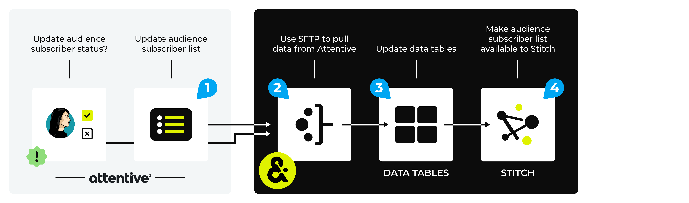

.. https://docs.amperity.com/operator/

.. |source-name| replace:: Attentive
.. |plugin-name| replace:: Attentive
.. |feed-name| replace:: Subscribers
.. |example-filename| replace:: filename_YYYY-MM-DD.csv
.. |domain-table-name| replace:: |source-name|:|feed-name|
.. |credential-type| replace:: **attentive-mobile**
.. |sftp-hostname| replace:: **sftp.attentivemobile.com**
.. |what-pull| replace:: audience subscriber lists
.. |filter-the-list| replace:: "att"

.. meta::
    :description lang=en:
        Configure Amperity to pull data from Attentive.

.. meta::
    :content class=swiftype name=body data-type=text:
        Configure Amperity to pull data from Attentive.

.. meta::
    :content class=swiftype name=title data-type=string:
        Pull from Attentive

==================================================
Pull from Attentive
==================================================

.. include:: ../../shared/terms.rst
   :start-after: .. term-attentive-mobile-start
   :end-before: .. term-attentive-mobile-end

.. include:: ../../amperity_operator/source/source_sftp.rst
   :start-after: .. source-sftp-common-start
   :end-before: .. source-sftp-common-end

.. source-attentive-mobile-steps-to-pull-start

.. include:: ../../shared/sources.rst
   :start-after: .. sources-overview-list-intro-start
   :end-before: .. sources-overview-list-intro-end

#. :ref:`Get details <source-attentive-mobile-get-details>`
#. :ref:`Add data source <source-attentive-mobile-add-data-source>`

.. source-attentive-mobile-steps-to-pull-end

.. _source-attentive-mobile-howitworks:

How this source works
==================================================

.. source-attentive-mobile-howitworks-start

Amperity can pull |what-pull| from |source-name|.

.. source-attentive-mobile-howitworks-end

.. source-attentive-mobile-howitworks-callouts-start

A |source-name| data source works like this:

#. Configure Amperity to pull audience subscriber lists from |source-name| using SFTP. These lists are available from the **/downloads** subdirectory in the |source-name| SFTP site.

   .. important:: |source-name| is the source of truth for audience subscriber status. You may pull audience subscriber status data to Amperity using SFTP, and then use it to identify customers who have opted-in when building queries and segments, but you cannot update audience subscriber status in |source-name| with Amperity data.

      Amperity is the source of truth for audience subscriber lists. Use the :doc:`Attentive Mobile destination <destination_attentive_mobile>` to update audience subscriber lists in |source-name|.

#. Amperity pulls audience subscriber lists from |source-name| using SFTP, and then loads this data to Amperity as a feed. Apply customer profile semantic tags to the audience subscriber list.

   .. tip:: Use a foreign key to associate the email address in an audience subscriber list with the email address associated with audience subscriber status to ensure your customer 360 database links the subscriber to their subscriber status in |source-name|.
#. Domain tables within Amperity are refreshed.
#. Audience subscriber lists are made available to Stitch. All data is passed to your customer 360 database. The Amperity ID links records across data sources for each unique customer.

.. source-attentive-mobile-howitworks-callouts-note-end

.. _source-attentive-mobile-get-details:

Get details
==================================================

.. source-attentive-mobile-get-details-start

The |source-name| data source requires the following configuration details:

.. list-table::
   :widths: 10 90
   :header-rows: 0

   * - .. image:: ../../images/steps-check-off-black.png
          :width: 60 px
          :alt: Detail one.
          :align: center
          :class: no-scaled-link
     - The hostname for the SFTP site from which data is pulled. For example: |sftp-hostname|.

   * - .. image:: ../../images/steps-check-off-black.png
          :width: 60 px
          :alt: Detail two.
          :align: center
          :class: no-scaled-link
     - The username and passphrase.

   * - .. image:: ../../images/steps-check-off-black.png
          :width: 60 px
          :alt: Detail three.
          :align: center
          :class: no-scaled-link
     - The host public key if encryption is configured.

   * - .. image:: ../../images/steps-check-off-black.png
          :width: 60 px
          :alt: Detail four.
          :align: center
          :class: no-scaled-link
     - A private key when the "private-key" credential type is selected.

   * - .. image:: ../../images/steps-check-off-black.png
          :width: 60 px
          :alt: Detail five.
          :align: center
          :class: no-scaled-link
     - The public key to use for PGP encryption.

   * - .. image:: ../../images/steps-check-off-black.png
          :width: 60 px
          :alt: Detail six.
          :align: center
          :class: no-scaled-link
     - The remote folder from which Amperity will pull data.

       .. important:: A "/" (forward slash) must be used as the first character for this value. For example: "/folder/name".

       The location must contain the list of files by filename and file type to be pulled to Amperity. For example: "accounts.csv", "customers.csv", and "email-list.csv". A sample of each file is used during feed creation.

       .. include:: ../../amperity_reference/source/format_csv.rst
          :start-after: .. format-csv-file-sizes-start
          :end-before: .. format-csv-file-sizes-end

   * - .. image:: ../../images/steps-check-off-black.png
          :width: 60 px
          :alt: Detail seven.
          :align: center
          :class: no-scaled-link
     - Conversions data pulled from |source-name| has a field named **message_text** that contains the lines of an SMS message using **\n** to separate each line of the message.

       Remove the **\n** prior to pulling this data to Amperity.

       For example:

       ::

          SELECT
            client_id
            ,phone
            ,message_id
            ,message_name
            ,REGEXP_REPLACE(message_text,"\n","") AS message_text
            ...
          FROM AttentiveTable

.. source-attentive-mobile-get-details-end

.. _source-attentive-mobile-add-data-source:

Add data source and feed
==================================================

.. include:: ../../shared/sources.rst
   :start-after: .. sources-steps-00-intro-start
   :end-before: .. sources-steps-00-intro-end

**To add a data source for any SFTP site**

.. source-attentive-mobile-add-data-source-steps-start

.. list-table::
   :widths: 10 90
   :header-rows: 0

   * - .. image:: ../../images/steps-01.png
          :width: 60 px
          :alt: Step one.
          :align: center
          :class: no-scaled-link
     - .. include:: ../../shared/sources.rst
          :start-after: .. sources-steps-01-open-dialog-start
          :end-before: .. sources-steps-01-open-dialog-end

       .. image:: ../../images/mockup-sources-add-01-select-source-sftp.png
          :width: 380 px
          :alt: Add 
          :align: left
          :class: no-scaled-link

       .. include:: ../../shared/sources.rst
          :start-after: .. sources-steps-01-select-source-start
          :end-before: .. sources-steps-01-select-source-end

   * - .. image:: ../../images/steps-02.png
          :width: 60 px
          :alt: Step two.
          :align: center
          :class: no-scaled-link
     - .. include:: ../../shared/credentials.rst
          :start-after: .. credentials-sources-configure-already-configured-start
          :end-before: .. credentials-sources-configure-already-configured-end

       .. tip::

          .. include:: ../../shared/credentials.rst
             :start-after: .. credentials-sources-configure-already-configured-tip-intro-start
             :end-before: .. credentials-sources-configure-already-configured-tip-intro-end

          .. image:: ../../images/mockup-credentials-add-02-credential-status-sftp.png
             :width: 380 px
             :alt: Add 
             :align: left
             :class: no-scaled-link

   * - .. image:: ../../images/steps-03.png
          :width: 60 px
          :alt: Step three.
          :align: center
          :class: no-scaled-link
     - .. include:: ../../shared/sources.rst
          :start-after: .. sources-steps-03-select-file-start
          :end-before: .. sources-steps-03-select-file-end

       .. image:: ../../images/mockup-sources-add-03-file-settings.png
          :width: 380 px
          :alt: Add 
          :align: left
          :class: no-scaled-link

       .. include:: ../../shared/sources.rst
          :start-after: .. sources-steps-03-browse-start
          :end-before: .. sources-steps-03-browse-end

       .. include:: ../../shared/sources.rst
          :start-after: .. sources-steps-03-browse-note-start
          :end-before: .. sources-steps-03-browse-note-end

       .. image:: ../../images/mockup-sources-add-03-file-browser-sftp.png
          :width: 500 px
          :alt: Add 
          :align: left
          :class: no-scaled-link

       .. include:: ../../shared/sources.rst
          :start-after: .. sources-steps-03-pgp-start
          :end-before: .. sources-steps-03-pgp-end

       .. image:: ../../images/mockup-sources-add-03-pgp-credential.png
          :width: 500 px
          :alt: Add 
          :align: left
          :class: no-scaled-link

   * - .. image:: ../../images/steps-04.png
          :width: 60 px
          :alt: Step four.
          :align: center
          :class: no-scaled-link
     - .. include:: ../../shared/sources.rst
          :start-after: .. sources-steps-04-review-start
          :end-before: .. sources-steps-04-review-end

       .. image:: ../../images/mockup-sources-add-03-file-formatting.png
          :width: 380 px
          :alt: Add 
          :align: left
          :class: no-scaled-link

       .. include:: ../../shared/sources.rst
          :start-after: .. sources-steps-04-review-contents-start
          :end-before: .. sources-steps-04-review-contents-end

       .. include:: ../../shared/sources.rst
          :start-after: .. sources-steps-04-review-pgp-start
          :end-before: .. sources-steps-04-review-pgp-end

       .. include:: ../../shared/sources.rst
          :start-after: .. sources-steps-04-review-formatting-details-start
          :end-before: .. sources-steps-04-review-formatting-details-end

   * - .. image:: ../../images/steps-05.png
          :width: 60 px
          :alt: Step five.
          :align: center
          :class: no-scaled-link
     - .. include:: ../../shared/sources.rst
          :start-after: .. sources-steps-05-feed-options-start
          :end-before: .. sources-steps-05-feed-options-end

       **New feed**

       .. include:: ../../shared/sources.rst
          :start-after: .. sources-steps-05-feed-new-start
          :end-before: .. sources-steps-05-feed-new-end

       **Existing feed**

       .. include:: ../../shared/sources.rst
          :start-after: .. sources-steps-05-feed-existing-start
          :end-before: .. sources-steps-05-feed-existing-end

       **Pull data**

       .. include:: ../../shared/sources.rst
          :start-after: .. sources-steps-05-load-types-start
          :end-before: .. sources-steps-05-load-types-end

       .. image:: ../../images/mockup-sources-add-04-feed-load-type.png
          :width: 380 px
          :alt: Add 
          :align: left
          :class: no-scaled-link

       .. include:: ../../shared/sources.rst
          :start-after: .. sources-steps-05-load-type-upsert-start
          :end-before: .. sources-steps-05-load-type-upsert-end

       .. include:: ../../shared/sources.rst
          :start-after: .. sources-steps-05-load-type-truncate-start
          :end-before: .. sources-steps-05-load-type-truncate-end

       .. include:: ../../shared/sources.rst
          :start-after: .. sources-steps-05-load-types-note-start
          :end-before: .. sources-steps-05-load-types-note-end

   * - .. image:: ../../images/steps-06.png
          :width: 60 px
          :alt: Step six.
          :align: center
          :class: no-scaled-link
     - .. include:: ../../shared/sources.rst
          :start-after: .. sources-steps-06-feed-editor-start
          :end-before: .. sources-steps-06-feed-editor-end

   * - .. image:: ../../images/steps-07.png
          :width: 60 px
          :alt: Step seven.
          :align: center
          :class: no-scaled-link
     - .. include:: ../../shared/sources.rst
          :start-after: .. sources-steps-07-courier-start
          :end-before: .. sources-steps-07-courier-end

       .. image:: ../../images/mockup-courier-add-07-menu-run.png
          :width: 380 px
          :alt: Add 
          :align: left
          :class: no-scaled-link

       .. include:: ../../shared/sources.rst
          :start-after: .. sources-steps-07-calendar-start
          :end-before: .. sources-steps-07-calendar-end

       .. image:: ../../images/mockup-courier-add-07-menu-load-data.png
          :width: 380 px
          :alt: Add 
          :align: left
          :class: no-scaled-link

       .. include:: ../../shared/sources.rst
          :start-after: .. sources-steps-07-run-start
          :end-before: .. sources-steps-07-run-end

.. source-attentive-mobile-add-data-source-steps-end

.. _source-attentive-mobile-workflow-actions:

Workflow actions
==================================================

.. include:: ../../shared/workflow-actions.rst
   :start-after: .. workflow-actions-common-table-intro-start
   :end-before: .. workflow-actions-common-table-intro-end

.. source-attentive-mobile-workflow-actions-start

.. list-table::
   :widths: 10 90
   :header-rows: 0

   * - .. image:: ../../images/steps-01.png
          :width: 60 px
          :alt: Step one.
          :align: center
          :class: no-scaled-link
     - .. include:: ../../shared/workflow-actions.rst
          :start-after: .. workflow-actions-common-table-section-one-a-source-start
          :end-before: .. workflow-actions-common-table-section-one-a-source-end

       .. image:: ../../images/mockup-destinations-tab-workflow-error-sources.png
          :width: 500 px
          :alt: Review a notifications error.
          :align: left
          :class: no-scaled-link

       .. include:: ../../shared/workflow-actions.rst
          :start-after: .. workflow-actions-common-table-section-one-b-start
          :end-before: .. workflow-actions-common-table-section-one-b-end

   * - .. image:: ../../images/steps-02.png
          :width: 60 px
          :alt: Step two.
          :align: center
          :class: no-scaled-link
     - .. include:: ../../shared/workflow-actions.rst
          :start-after: .. workflow-actions-common-table-section-two-start
          :end-before: .. workflow-actions-common-table-section-two-end

       .. image:: ../../images/mockups-workflow-failed.png
          :width: 500 px
          :alt: The workflow tab, showing a workflow with errors.
          :align: left
          :class: no-scaled-link

   * - .. image:: ../../images/steps-03.png
          :width: 60 px
          :alt: Step three.
          :align: center
          :class: no-scaled-link
     - .. include:: ../../shared/workflow-actions.rst
          :start-after: .. workflow-actions-common-table-section-three-a-start
          :end-before: .. workflow-actions-common-table-section-three-a-end

       .. image:: ../../images/workflow-actions-sftp-unavailable.png
          :width: 300 px
          :alt: Choose a workflow action from the list of actions.
          :align: left
          :class: no-scaled-link

       .. include:: ../../shared/workflow-actions.rst
          :start-after: .. workflow-actions-common-table-section-three-b-start
          :end-before: .. workflow-actions-common-table-section-three-b-end

       Amperity provides a series of workflow actions that can help resolve specific issues that may arise with |source-name|, including:

       * :ref:`source-attentive-mobile-workflow-actions-bad-archive`
       * :ref:`source-attentive-mobile-workflow-actions-invalid-credentials`
       * :ref:`source-attentive-mobile-workflow-actions-missing-file`
       * :ref:`source-attentive-mobile-workflow-actions-sftp-unavailable`
       * :ref:`source-attentive-mobile-workflow-actions-pgp-error`
       * :ref:`source-attentive-mobile-workflow-actions-unable-to-decompress-archive`

   * - .. image:: ../../images/steps-04.png
          :width: 60 px
          :alt: Step four.
          :align: center
          :class: no-scaled-link
     - .. include:: ../../shared/workflow-actions.rst
          :start-after: .. workflow-actions-common-table-section-four-a-start
          :end-before: .. workflow-actions-common-table-section-four-a-end

       .. image:: ../../images/workflow-actions-sftp-unavailable-steps.png
          :width: 300 px
          :alt: Choose a workflow action from the list of actions.
          :align: left
          :class: no-scaled-link

       .. include:: ../../shared/workflow-actions.rst
          :start-after: .. workflow-actions-common-table-section-four-b-start
          :end-before: .. workflow-actions-common-table-section-four-b-end

.. source-attentive-mobile-workflow-actions-end

.. _source-attentive-mobile-workflow-actions-bad-archive:

Bad archive
--------------------------------------------------

.. include:: ../../shared/workflow-actions.rst
   :start-after: .. workflow-actions-files-generic-bad-archive-start
   :end-before: .. workflow-actions-files-generic-bad-archive-end

.. _source-attentive-mobile-workflow-actions-invalid-credentials:

Invalid credentials
--------------------------------------------------

.. include:: ../../shared/workflow-actions.rst
   :start-after: .. workflow-actions-generic-invalid-credentials-source-start
   :end-before: .. workflow-actions-generic-invalid-credentials-source-end

.. _source-attentive-mobile-workflow-actions-missing-file:

Missing file
--------------------------------------------------

.. include:: ../../shared/workflow-actions.rst
   :start-after: .. workflow-actions-files-generic-missing-file-start
   :end-before: .. workflow-actions-files-generic-missing-file-end

.. _source-attentive-mobile-workflow-actions-pgp-error:

PGP error
--------------------------------------------------

.. include:: ../../shared/workflow-actions.rst
   :start-after: .. workflow-actions-generic-pgp-error-start
   :end-before: .. workflow-actions-generic-pgp-error-end

.. _source-attentive-mobile-workflow-actions-sftp-unavailable:

SFTP site unavailable
--------------------------------------------------

.. include:: ../../shared/workflow-actions.rst
   :start-after: .. workflow-actions-sftp-generic-unavailable-start
   :end-before: .. workflow-actions-sftp-generic-unavailable-end

.. _source-attentive-mobile-workflow-actions-unable-to-decompress-archive:

Unable to decompress archive
--------------------------------------------------

.. include:: ../../shared/workflow-actions.rst
   :start-after: .. workflow-actions-files-unable-to-decompress-file-start
   :end-before: .. workflow-actions-files-unable-to-decompress-file-end
