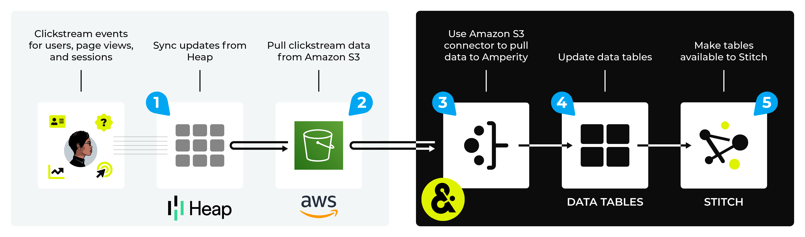

.. https://docs.amperity.com/operator/

.. |source-name| replace:: Heap
.. |plugin-name| replace:: Amazon S3
.. |feed-name| replace:: Users
.. |credential-type| replace:: **iam-credential**
.. |example-filename| replace:: filename_YYYY-MM-DD.csv
.. |domain-table-name| replace:: |source-name|:|feed-name|
.. |what-pull| replace:: clickstream events for users, page views, and sessions
.. |filter-the-list| replace:: "ama"

.. meta::
    :description lang=en:
        Configure Amperity to pull data from Heap.

.. meta::
    :content class=swiftype name=body data-type=text:
        Configure Amperity to pull data from Heap.

.. meta::
    :content class=swiftype name=title data-type=string:
        Pull from Heap

==================================================
Pull from Heap
==================================================

.. include:: ../../shared/terms.rst
   :start-after: .. term-heap-start
   :end-before: .. term-heap-end

.. source-heap-steps-to-pull-start

.. include:: ../../shared/sources.rst
   :start-after: .. sources-overview-list-intro-start
   :end-before: .. sources-overview-list-intro-end

#. :ref:`Get details <source-heap-get-details>`
#. :ref:`Add data source and feed <source-heap-add-data-source>`

.. source-heap-steps-to-pull-end

.. _source-heap-howitworks:

How this source works
==================================================

.. source-heap-howitworks-start

Amperity can pull |what-pull| from |source-name|.

.. source-heap-howitworks-end

.. source-heap-howitworks-callouts-start

A |source-name| data source works like this:

#. Clickstream data is generated when your customers visit your websites and apps.

   |source-name| is configured to capture this data, and then make it available for use outside of |source-name| using the Heap Connector for S3.
#. Clickstream data is loaded to a customer-managed Amazon S3 bucket.
#. Amperity pulls data from the customer-managed Amazon S3 bucket, assigning semantic tags for clickstream events and for customer profile data.
#. Domain tables within Amperity are refreshed.
#. Customer profiles are made available to Stitch. All data is passed to your customer 360 database. The Amperity ID links records across data sources for each unique customer.

.. source-heap-howitworks-callouts-note-end

.. _source-heap-get-details:

Get details
==================================================

.. source-heap-get-details-start

Amperity can be configured to pull data from |source-name| using Amazon S3. This requires the following configuration details:

#. |source-name| must be configured to use `Heap Connect for S3 <https://help.heap.io/hc/en-us/articles/18700055185308-S3-Integration>`__ |ext_link|. This sends data from |source-name| to a customer-managed Amazon S3 bucket.
#. The Amazon Resource Name (ARN) for a role with cross-account access.
#. The name of the customer-managed Amazon S3 bucket.
#. A list of objects by filename and file type in the customer-managed Amazon S3 bucket to be pulled to Amperity. 
#. A sample for each file to simplify feed creation.

.. include:: ../../shared/sources.rst
   :start-after: .. sources-add-courier-amazon-s3-cross-account-start
   :end-before: .. sources-add-courier-amazon-s3-cross-account-end

.. source-heap-get-details-end

.. _source-heap-add-data-source:

Add data source and feed
==================================================

.. include:: ../../shared/sources.rst
   :start-after: .. sources-steps-00-intro-start
   :end-before: .. sources-steps-00-intro-end

**To add a data source for Heap**

.. source-heap-add-data-source-steps-start

.. list-table::
   :widths: 10 90
   :header-rows: 0

   * - .. image:: ../../images/steps-01.png
          :width: 60 px
          :alt: Step one.
          :align: center
          :class: no-scaled-link
     - .. include:: ../../shared/sources.rst
          :start-after: .. sources-steps-01-open-dialog-start
          :end-before: .. sources-steps-01-open-dialog-end

       .. include:: ../../shared/sources.rst
          :start-after: .. sources-steps-01-select-source-start
          :end-before: .. sources-steps-01-select-source-end

   * - .. image:: ../../images/steps-02.png
          :width: 60 px
          :alt: Step two.
          :align: center
          :class: no-scaled-link
     - .. include:: ../../shared/credentials.rst
          :start-after: .. credentials-sources-configure-already-configured-start
          :end-before: .. credentials-sources-configure-already-configured-end

       .. tip::

          .. include:: ../../shared/credentials.rst
             :start-after: .. credentials-sources-configure-already-configured-tip-intro-start
             :end-before: .. credentials-sources-configure-already-configured-tip-intro-end

          .. image:: ../../images/mockup-credentials-add-02-credential-status-s3.png
             :width: 380 px
             :alt: Add 
             :align: left
             :class: no-scaled-link

   * - .. image:: ../../images/steps-03.png
          :width: 60 px
          :alt: Step three.
          :align: center
          :class: no-scaled-link
     - .. include:: ../../shared/sources.rst
          :start-after: .. sources-steps-03-select-file-start
          :end-before: .. sources-steps-03-select-file-end

       .. image:: ../../images/mockup-sources-add-03-file-settings.png
          :width: 380 px
          :alt: Add 
          :align: left
          :class: no-scaled-link

       .. include:: ../../shared/sources.rst
          :start-after: .. sources-steps-03-browse-start
          :end-before: .. sources-steps-03-browse-end

       .. include:: ../../shared/sources.rst
          :start-after: .. sources-steps-03-browse-note-start
          :end-before: .. sources-steps-03-browse-note-end

       .. image:: ../../images/mockup-sources-add-03-file-browser-sftp.png
          :width: 500 px
          :alt: Add 
          :align: left
          :class: no-scaled-link

       .. include:: ../../shared/sources.rst
          :start-after: .. sources-steps-03-pgp-start
          :end-before: .. sources-steps-03-pgp-end

       .. image:: ../../images/mockup-sources-add-03-pgp-credential.png
          :width: 500 px
          :alt: Add 
          :align: left
          :class: no-scaled-link

   * - .. image:: ../../images/steps-04.png
          :width: 60 px
          :alt: Step four.
          :align: center
          :class: no-scaled-link
     - .. include:: ../../shared/sources.rst
          :start-after: .. sources-steps-04-review-start
          :end-before: .. sources-steps-04-review-end

       .. image:: ../../images/mockup-sources-add-03-file-formatting.png
          :width: 380 px
          :alt: Add 
          :align: left
          :class: no-scaled-link

       .. include:: ../../shared/sources.rst
          :start-after: .. sources-steps-04-review-contents-start
          :end-before: .. sources-steps-04-review-contents-end

       .. include:: ../../shared/sources.rst
          :start-after: .. sources-steps-04-review-pgp-start
          :end-before: .. sources-steps-04-review-pgp-end

       .. include:: ../../shared/sources.rst
          :start-after: .. sources-steps-04-review-formatting-details-start
          :end-before: .. sources-steps-04-review-formatting-details-end

   * - .. image:: ../../images/steps-05.png
          :width: 60 px
          :alt: Step five.
          :align: center
          :class: no-scaled-link
     - .. include:: ../../shared/sources.rst
          :start-after: .. sources-steps-05-feed-options-start
          :end-before: .. sources-steps-05-feed-options-end

       **New feed**

       .. include:: ../../shared/sources.rst
          :start-after: .. sources-steps-05-feed-new-start
          :end-before: .. sources-steps-05-feed-new-end

       **Existing feed**

       .. include:: ../../shared/sources.rst
          :start-after: .. sources-steps-05-feed-existing-start
          :end-before: .. sources-steps-05-feed-existing-end

       **Pull data**

       .. include:: ../../shared/sources.rst
          :start-after: .. sources-steps-05-load-types-start
          :end-before: .. sources-steps-05-load-types-end

       .. image:: ../../images/mockup-sources-add-04-feed-load-type.png
          :width: 380 px
          :alt: Add 
          :align: left
          :class: no-scaled-link

       .. include:: ../../shared/sources.rst
          :start-after: .. sources-steps-05-load-type-upsert-start
          :end-before: .. sources-steps-05-load-type-upsert-end

       .. include:: ../../shared/sources.rst
          :start-after: .. sources-steps-05-load-type-truncate-start
          :end-before: .. sources-steps-05-load-type-truncate-end

       .. include:: ../../shared/sources.rst
          :start-after: .. sources-steps-05-load-types-note-start
          :end-before: .. sources-steps-05-load-types-note-end

   * - .. image:: ../../images/steps-06.png
          :width: 60 px
          :alt: Step six.
          :align: center
          :class: no-scaled-link
     - .. include:: ../../shared/sources.rst
          :start-after: .. sources-steps-06-feed-editor-start
          :end-before: .. sources-steps-06-feed-editor-end

   * - .. image:: ../../images/steps-07.png
          :width: 60 px
          :alt: Step seven.
          :align: center
          :class: no-scaled-link
     - .. include:: ../../shared/sources.rst
          :start-after: .. sources-steps-07-courier-start
          :end-before: .. sources-steps-07-courier-end

       .. image:: ../../images/mockup-courier-add-07-menu-run.png
          :width: 380 px
          :alt: Add 
          :align: left
          :class: no-scaled-link

       .. include:: ../../shared/sources.rst
          :start-after: .. sources-steps-07-calendar-start
          :end-before: .. sources-steps-07-calendar-end

       .. image:: ../../images/mockup-courier-add-07-menu-load-data.png
          :width: 380 px
          :alt: Add 
          :align: left
          :class: no-scaled-link

       .. include:: ../../shared/sources.rst
          :start-after: .. sources-steps-07-run-start
          :end-before: .. sources-steps-07-run-end

.. source-heap-add-data-source-steps-end
