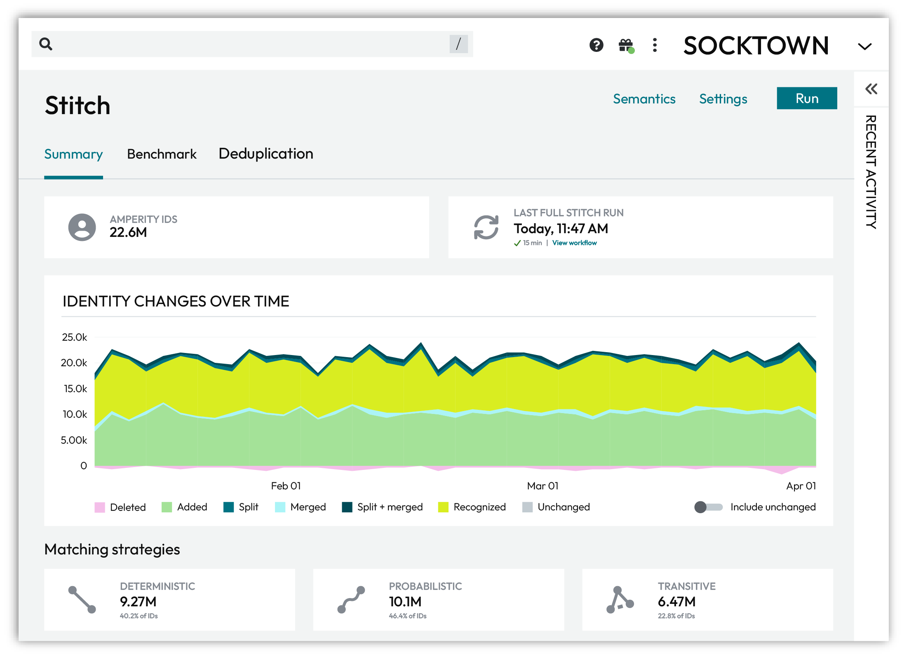
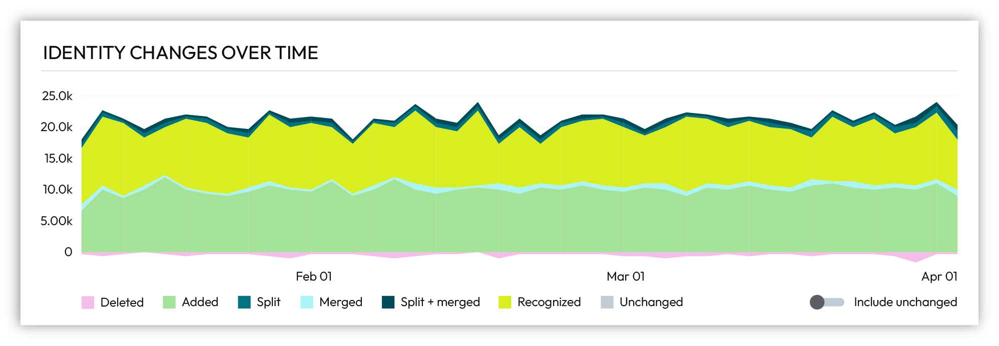
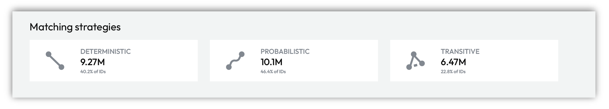
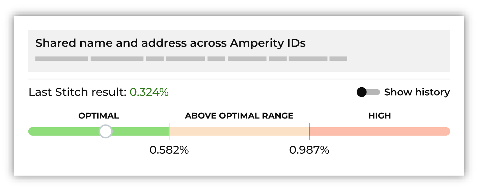
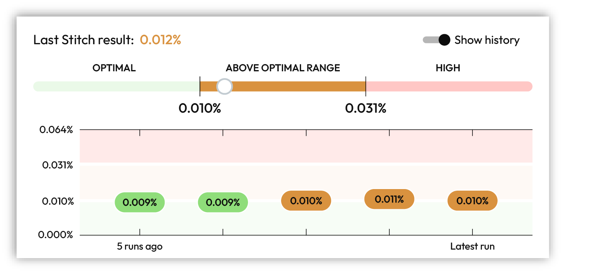
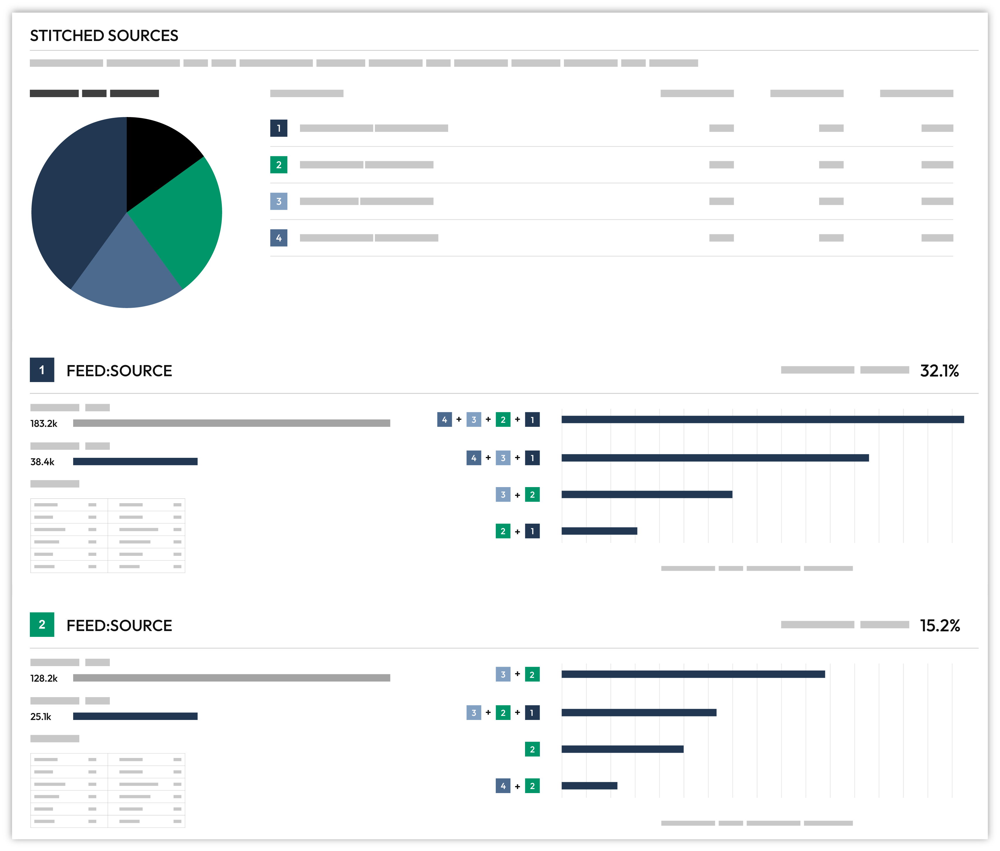
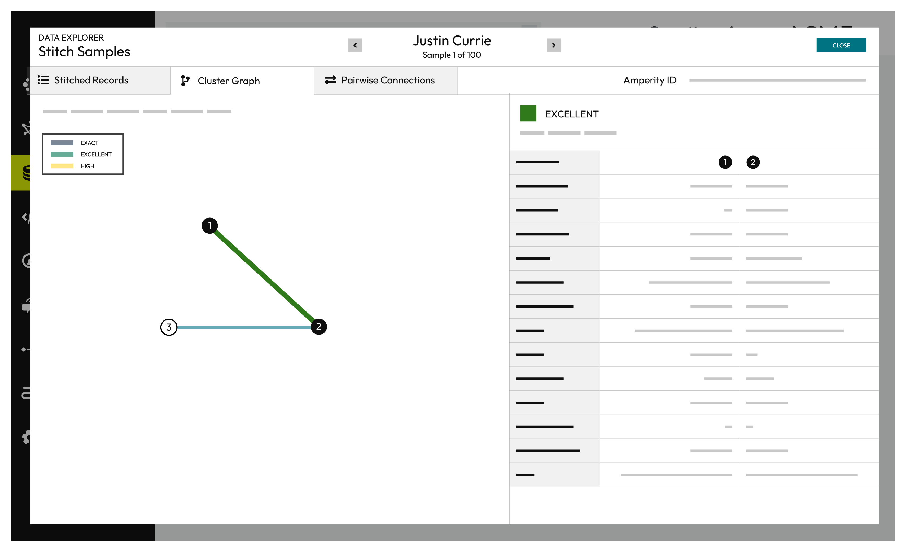
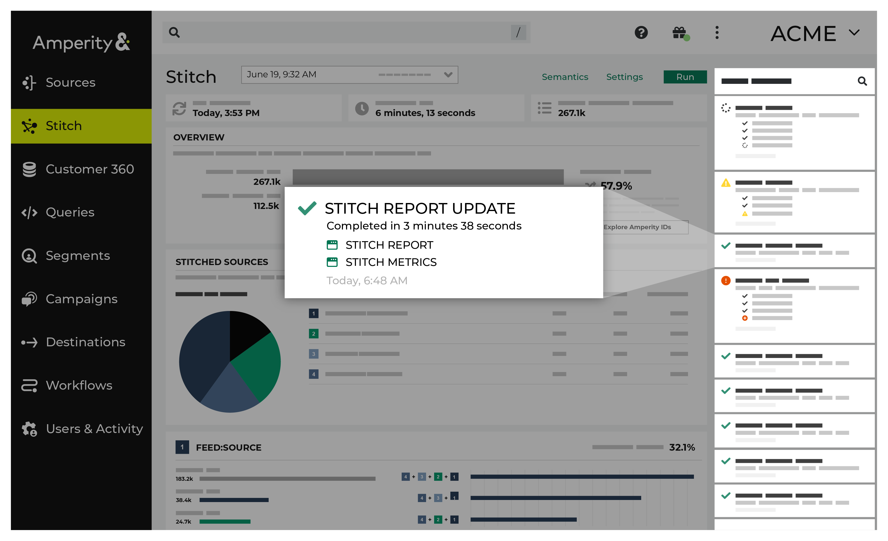
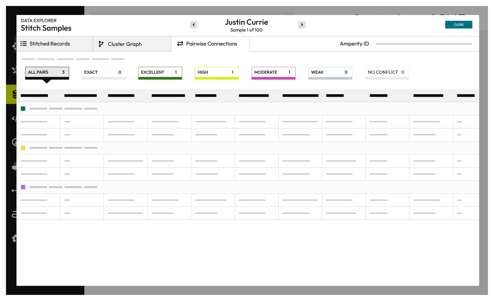
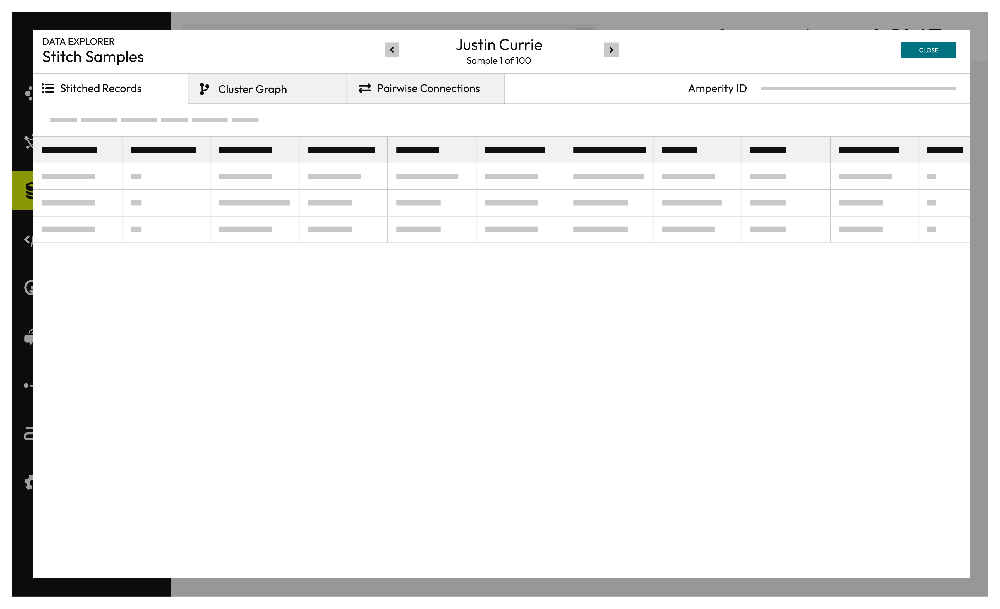

.. https://docs.amperity.com/operator/

.. meta::
    :description lang=en:
        Review ID resolution and the results of the Stitch process.

.. meta::
    :content class=swiftype name=body data-type=text:
        Review ID resolution and the results of the Stitch process.

.. meta::
    :content class=swiftype name=title data-type=string:
        Review ID resolution

==================================================
Review ID resolution
==================================================

.. include:: ../../shared/terms.rst
   :start-after: .. term-identity-resolution-start
   :end-before: .. term-identity-resolution-end

.. include:: ../../amperity_reference/source/stitch.rst
   :start-after: .. stitch-stages-of-identity-resolution-start
   :end-before: .. stitch-stages-of-identity-resolution-end

.. _stitch-results-summary:

Identity resolution summary
==================================================

.. include:: ../../shared/terms.rst
   :start-after: .. term-identity-resolution-start
   :end-before: .. term-identity-resolution-end

.. include:: ../../shared/terms.rst
   :start-after: .. term-stitch-summary-tab-start
   :end-before: .. term-stitch-summary-tab-end

.. include:: ../../amperity_reference/source/stitch_summary.rst
   :start-after: .. stitch-summary-tab-about-start
   :end-before: .. stitch-summary-tab-about-end

.. _stitch-summary-tab-identity-changes:

Identity changes over time
--------------------------------------------------

.. include:: ../../shared/terms.rst
   :start-after: .. term-adaptive-identity-start
   :end-before: .. term-adaptive-identity-end

.. include:: ../../amperity_reference/source/stitch_summary.rst
   :start-after: .. stitch-summary-tab-identity-changes-table-start
   :end-before: .. stitch-summary-tab-identity-changes-table-end

.. include:: ../../shared/terms.rst
   :start-after: .. term-record-pair-start
   :end-before: .. term-record-pair-end

.. image:: ../../images/mockup-stitch-identity-changes-hover.png
   :width: 600 px
   :alt: Hover over the graph to view detailed identity changes over time
   :align: left
   :class: no-scaled-link

.. include:: ../../amperity_reference/source/stitch_summary.rst
   :start-after: .. stitch-summary-tab-identity-changes-hover-start
   :end-before: .. stitch-summary-tab-identity-changes-hover-end

.. include:: ../../amperity_reference/source/stitch_summary.rst
   :start-after: .. stitch-summary-tab-identity-changes-unchanged-start
   :end-before: .. stitch-summary-tab-identity-changes-unchanged-end

.. _stitch-summary-tab-matching-strategies:

Matching strategies
--------------------------------------------------

.. include:: ../../shared/terms.rst
   :start-after: .. term-identity-graph-start
   :end-before: .. term-identity-graph-end

.. include:: ../../amperity_reference/source/stitch_summary.rst
   :start-after: .. stitch-summary-tab-matching-strategies-context-start
   :end-before: .. stitch-summary-tab-matching-strategies-context-end

.. include:: ../../amperity_reference/source/stitch_summary.rst
   :start-after: .. stitch-summary-tab-matching-strategies-tries-start
   :end-before: .. stitch-summary-tab-matching-strategies-tries-end

.. include:: ../../amperity_reference/source/stitch_summary.rst
   :start-after: .. stitch-summary-tab-matching-strategies-percentages-start
   :end-before: .. stitch-summary-tab-matching-strategies-percentages-end

.. include:: ../../amperity_reference/source/stitch_summary.rst
   :start-after: .. stitch-summary-tab-matching-strategies-percentages-context-start
   :end-before: .. stitch-summary-tab-matching-strategies-percentages-context-end

.. _stitch-summary-tab-matching-strategy-deterministic:

Deterministic matching
++++++++++++++++++++++++++++++++++++++++++++++++++

.. include:: ../../shared/terms.rst
   :start-after: .. term-deterministic-connection-start
   :end-before: .. term-deterministic-connection-end

.. include:: ../../amperity_reference/source/stitch_summary.rst
   :start-after: .. stitch-summary-tab-matching-strategy-deterministic-context-start
   :end-before: .. stitch-summary-tab-matching-strategy-deterministic-context-end

.. _stitch-summary-tab-matching-strategy-probabilistic:

Probabilistic matching
++++++++++++++++++++++++++++++++++++++++++++++++++

.. include:: ../../shared/terms.rst
   :start-after: .. term-probabilistic-connection-start
   :end-before: .. term-probabilistic-connection-end

.. include:: ../../amperity_reference/source/stitch_summary.rst
   :start-after: .. stitch-summary-tab-matching-strategy-probabilistic-context-start
   :end-before: .. stitch-summary-tab-matching-strategy-probabilistic-context-end

.. _stitch-summary-tab-matching-strategy-transitive:

Transitive matching
++++++++++++++++++++++++++++++++++++++++++++++++++

.. include:: ../../shared/terms.rst
   :start-after: .. term-transitive-connection-start
   :end-before: .. term-transitive-connection-end

.. include:: ../../amperity_reference/source/stitch_summary.rst
   :start-after: .. stitch-summary-tab-matching-strategy-transitive-context-start
   :end-before: .. stitch-summary-tab-matching-strategy-transitive-context-end

.. _stitch-summary-tab-match-categories:

About match categories
++++++++++++++++++++++++++++++++++++++++++++++++++

.. include:: ../../shared/terms.rst
   :start-after: .. term-match-category-start
   :end-before: .. term-match-category-end

.. include:: ../../shared/terms.rst
   :start-after: .. term-match-type-start
   :end-before: .. term-match-type-end

.. _stitch-summary-tab-scoring-record-pairs:

About scoring record pairs
--------------------------------------------------

.. include:: ../../amperity_reference/source/stitch_summary.rst
   :start-after: .. stitch-summary-tab-scoring-record-pairs-start
   :end-before: .. stitch-summary-tab-scoring-record-pairs-end

.. _stitch-summary-tab-scoring-record-pairs-rules:

Rules-based scoring
++++++++++++++++++++++++++++++++++++++++++++++++++

.. include:: ../../amperity_reference/source/stitch_summary.rst
   :start-after: .. stitch-summary-tab-scoring-record-pairs-rules-start
   :end-before: .. stitch-summary-tab-scoring-record-pairs-rules-end

.. include:: ../../shared/terms.rst
   :start-after: .. term-pairwise-connection-score-start
   :end-before: .. term-pairwise-connection-score-end

.. include:: ../../amperity_reference/source/stitch_summary.rst
   :start-after: .. stitch-summary-tab-scoring-record-pairs-rules-note-start
   :end-before: .. stitch-summary-tab-scoring-record-pairs-rules-note-end

.. _stitch-summary-tab-scoring-record-pairs-default:

Default model scoring
++++++++++++++++++++++++++++++++++++++++++++++++++

.. include:: ../../amperity_reference/source/stitch_summary.rst
   :start-after: .. stitch-summary-tab-scoring-record-pairs-default-start
   :end-before: .. stitch-summary-tab-scoring-record-pairs-default-end

.. _stitch-summary-tab-scoring-record-pairs-default-ampai:

Amperity AI
^^^^^^^^^^^^^^^^^^^^^^^^^^^^^^^^^^^^^^^^^^^^^^^^^^

.. include:: ../../shared/terms.rst
   :start-after: .. term-stitch-start
   :end-before: .. term-stitch-end

.. include:: ../../amperity_reference/source/stitch_summary.rst
   :start-after: .. stitch-summary-tab-scoring-record-pairs-default-ampai-start
   :end-before: .. stitch-summary-tab-scoring-record-pairs-default-ampai-end

.. _stitch-summary-tab-scoring-record-pairs-default-none:

No matching model
^^^^^^^^^^^^^^^^^^^^^^^^^^^^^^^^^^^^^^^^^^^^^^^^^^

.. include:: ../../shared/terms.rst
   :start-after: .. term-no-matching-model-start
   :end-before: .. term-no-matching-model-end

.. include:: ../../amperity_reference/source/stitch_summary.rst
   :start-after: .. stitch-summary-tab-scoring-record-pairs-default-none-start
   :end-before: .. stitch-summary-tab-scoring-record-pairs-default-none-end

.. _stitch-summary-tab-identity-complexity:

Identity complexity
--------------------------------------------------

.. include:: ../../amperity_reference/source/stitch_summary.rst
   :start-after: .. stitch-summary-tab-identity-complexity-start
   :end-before: .. stitch-summary-tab-identity-complexity-end

.. image:: ../../images/mockup-stitch-identity-complexity.png
   :width: 600 px
   :alt: Review the complexity of the identity graph broken down by number of records in profiles
   :align: left
   :class: no-scaled-link

.. include:: ../../amperity_reference/source/stitch_summary.rst
   :start-after: .. stitch-summary-tab-identity-complexity-table-start
   :end-before: .. stitch-summary-tab-identity-complexity-table-end

.. _stitch-results-benchmarks:

About benchmarks
==================================================

.. include:: ../../amperity_reference/source/stitch_benchmarks.rst
   :start-after: .. stitch-benchmarks-start
   :end-before: .. stitch-benchmarks-end

.. include:: ../../amperity_reference/source/stitch_benchmarks.rst
   :start-after: .. stitch-benchmarks-incremental-match-note-start
   :end-before: .. stitch-benchmarks-incremental-match-note-end

.. _stitch-benchmarks-status:

Benchmark status page
--------------------------------------------------

.. include:: ../../amperity_reference/source/stitch_benchmarks.rst
   :start-after: .. stitch-benchmarks-status-start
   :end-before: .. stitch-benchmarks-status-end

.. _stitch-benchmarks-checks:

Benchmark checks
--------------------------------------------------

.. include:: ../../amperity_reference/source/stitch_benchmarks.rst
   :start-after: .. stitch-benchmarks-checks-start
   :end-before: .. stitch-benchmarks-checks-end

.. include:: ../../amperity_reference/source/stitch_benchmarks.rst
   :start-after: .. stitch-benchmarks-checks-important-start
   :end-before: .. stitch-benchmarks-checks-important-end

.. _stitch-benchmarks-results:

Benchmark results
--------------------------------------------------

.. include:: ../../amperity_reference/source/stitch_benchmarks.rst
   :start-after: .. stitch-benchmarks-results-start
   :end-before: .. stitch-benchmarks-results-end

.. _stitch-benchmarks-results-optimal:

Optimal
++++++++++++++++++++++++++++++++++++++++++++++++++

.. include:: ../../amperity_reference/source/stitch_benchmarks.rst
   :start-after: .. stitch-benchmarks-results-optimal-start
   :end-before: .. stitch-benchmarks-results-optimal-end

.. _stitch-benchmarks-results-above-optimal:

Above optimal range
++++++++++++++++++++++++++++++++++++++++++++++++++

.. include:: ../../amperity_reference/source/stitch_benchmarks.rst
   :start-after: .. stitch-benchmarks-results-above-optimal-start
   :end-before: .. stitch-benchmarks-results-above-optimal-end

.. _stitch-benchmarks-results-high:

High
++++++++++++++++++++++++++++++++++++++++++++++++++

.. include:: ../../amperity_reference/source/stitch_benchmarks.rst
   :start-after: .. stitch-benchmarks-results-high-start
   :end-before: .. stitch-benchmarks-results-high-end

.. _stitch-benchmarks-cards:

About benchmark cards
--------------------------------------------------

.. include:: ../../amperity_reference/source/stitch_benchmarks.rst
   :start-after: .. stitch-benchmarks-cards-start
   :end-before: .. stitch-benchmarks-cards-end

.. _stitch-benchmarks-cards-details:

Benchmark details
++++++++++++++++++++++++++++++++++++++++++++++++++

.. include:: ../../amperity_reference/source/stitch_benchmarks.rst
   :start-after: .. stitch-benchmarks-cards-details-start
   :end-before: .. stitch-benchmarks-cards-details-end

.. _stitch-benchmarks-cards-history:

History
++++++++++++++++++++++++++++++++++++++++++++++++++

.. include:: ../../amperity_reference/source/stitch_benchmarks.rst
   :start-after: .. stitch-benchmarks-cards-history-start
   :end-before: .. stitch-benchmarks-cards-history-end

.. _stitch-benchmarks-cards-interpretations:

Interpretations
++++++++++++++++++++++++++++++++++++++++++++++++++

.. include:: ../../amperity_reference/source/stitch_benchmarks.rst
   :start-after: .. stitch-benchmarks-cards-interpretations-start
   :end-before: .. stitch-benchmarks-cards-interpretations-end

.. _stitch-benchmarks-cards-grade-and-calibrate:

Grade and calibrate
++++++++++++++++++++++++++++++++++++++++++++++++++

.. include:: ../../amperity_reference/source/stitch_benchmarks.rst
   :start-after: .. stitch-benchmarks-cards-grade-and-calibrate-start
   :end-before: .. stitch-benchmarks-cards-grade-and-calibrate-end

.. include:: ../../amperity_reference/source/stitch_benchmarks.rst
   :start-after: .. stitch-benchmarks-cards-grade-and-calibrate-howitworks-start
   :end-before: .. stitch-benchmarks-cards-grade-and-calibrate-howitworks-end

.. _stitch-benchmarks-check-update-config:

Update Stitch configuration
++++++++++++++++++++++++++++++++++++++++++++++++++

.. include:: ../../amperity_reference/source/stitch_benchmarks.rst
   :start-after: .. stitch-benchmarks-check-update-config-start
   :end-before: .. stitch-benchmarks-check-update-config-end

.. _stitch-benchmarks-categories:

Benchmark categories
--------------------------------------------------

.. include:: ../../amperity_reference/source/stitch_benchmarks.rst
   :start-after: .. stitch-benchmarks-categories-start
   :end-before: .. stitch-benchmarks-categories-end

.. _stitch-benchmarks-category-overclustering:

Overclustering
++++++++++++++++++++++++++++++++++++++++++++++++++

.. include:: ../../shared/terms.rst
   :start-after: .. term-overcluster-start
   :end-before: .. term-overcluster-end

.. include:: ../../amperity_reference/source/stitch_benchmarks.rst
   :start-after: .. stitch-benchmarks-category-overclustering-start
   :end-before: .. stitch-benchmarks-category-overclustering-end

.. _stitch-benchmarks-category-many-given-names:

Many given names
^^^^^^^^^^^^^^^^^^^^^^^^^^^^^^^^^^^^^^^^^^^^^^^^^^

.. include:: ../../amperity_reference/source/stitch_benchmarks.rst
   :start-after: .. stitch-benchmarks-category-many-given-names-start
   :end-before: .. stitch-benchmarks-category-many-given-names-end

.. _stitch-benchmarks-category-many-postal-codes:

Many postal codes
^^^^^^^^^^^^^^^^^^^^^^^^^^^^^^^^^^^^^^^^^^^^^^^^^^

.. include:: ../../amperity_reference/source/stitch_benchmarks.rst
   :start-after: .. stitch-benchmarks-category-many-postal-codes-start
   :end-before: .. stitch-benchmarks-category-many-postal-codes-end

.. _stitch-benchmarks-category-many-surnames:

Many surnames
^^^^^^^^^^^^^^^^^^^^^^^^^^^^^^^^^^^^^^^^^^^^^^^^^^

.. include:: ../../amperity_reference/source/stitch_benchmarks.rst
   :start-after: .. stitch-benchmarks-category-many-surnames-start
   :end-before: .. stitch-benchmarks-category-many-surnames-end

.. _stitch-benchmarks-category-underclustering:

Underclustering
++++++++++++++++++++++++++++++++++++++++++++++++++

.. include:: ../../shared/terms.rst
   :start-after: .. term-undercluster-start
   :end-before: .. term-undercluster-end

.. include:: ../../amperity_reference/source/stitch_benchmarks.rst
   :start-after: .. stitch-benchmarks-category-underclustering-start
   :end-before: .. stitch-benchmarks-category-underclustering-end

.. _stitch-benchmarks-category-shared-names-and-emails:

Shared names and emails
^^^^^^^^^^^^^^^^^^^^^^^^^^^^^^^^^^^^^^^^^^^^^^^^^^

.. include:: ../../amperity_reference/source/stitch_benchmarks.rst
   :start-after: .. stitch-benchmarks-category-shared-names-and-emails-start
   :end-before: .. stitch-benchmarks-category-shared-names-and-emails-end

.. _stitch-benchmarks-category-shared-names-and-phones:

Shared names and phones
^^^^^^^^^^^^^^^^^^^^^^^^^^^^^^^^^^^^^^^^^^^^^^^^^^

.. include:: ../../amperity_reference/source/stitch_benchmarks.rst
   :start-after: .. stitch-benchmarks-category-shared-names-and-phones-start
   :end-before: .. stitch-benchmarks-category-shared-names-and-phones-end

.. _stitch-benchmarks-category-shared-names-and-addresses:

Shared names and addresses
^^^^^^^^^^^^^^^^^^^^^^^^^^^^^^^^^^^^^^^^^^^^^^^^^^

.. include:: ../../amperity_reference/source/stitch_benchmarks.rst
   :start-after: .. stitch-benchmarks-category-shared-names-and-addresses-start
   :end-before: .. stitch-benchmarks-category-shared-names-and-addresses-end

.. _stitch-results-deduplication:

About deduplication
==================================================

.. include:: ../../amperity_reference/source/stitch_deduplication.rst
   :start-after: .. stitch-deduplication-status-start
   :end-before: .. stitch-deduplication-status-start

.. _stitch-deduplication-explore-by-amperity-id:

Data Explorer
--------------------------------------------------

.. include:: ../../shared/terms.rst
   :start-after: .. term-amperity-id-start
   :end-before: .. term-amperity-id-end

.. include:: ../../amperity_reference/source/stitch_deduplication.rst
   :start-after: .. stitch-deduplication-explore-by-amperity-id-start
   :end-before: .. stitch-deduplication-explore-by-amperity-id-end

.. include:: ../../shared/terms.rst
   :start-after: .. term-amperity-id-format-start
   :end-before: .. term-amperity-id-format-end

.. include:: ../../amperity_reference/source/stitch_deduplication.rst
   :start-after: .. stitch-deduplication-explore-by-amperity-id-continued-start
   :end-before: .. stitch-deduplication-explore-by-amperity-id-continued-end

**To explore data**

.. include:: ../../amperity_reference/source/stitch_deduplication.rst
   :start-after: .. stitch-deduplication-explore-by-amperity-id-steps-start
   :end-before: .. stitch-deduplication-explore-by-amperity-id-steps-end

.. _stitch-deduplication-explore-by-data-source:

Explore by data source
--------------------------------------------------

.. include:: ../../amperity_reference/source/stitch_deduplication.rst
   :start-after: .. stitch-deduplication-explore-by-data-source-start
   :end-before: .. stitch-deduplication-explore-by-data-source-end

.. include:: ../../amperity_reference/source/stitch_deduplication.rst
   :start-after: .. stitch-deduplication-explore-by-data-source-upset-plot-start
   :end-before: .. stitch-deduplication-explore-by-data-source-upset-plot-end

.. include:: ../../amperity_reference/source/stitch_deduplication.rst
   :start-after: .. stitch-deduplication-explore-by-data-source-upset-plot-explanation-start
   :end-before: .. stitch-deduplication-explore-by-data-source-upset-plot-explanation-end

**To explore by data source**

.. include:: ../../amperity_reference/source/stitch_deduplication.rst
   :start-after: .. stitch-deduplication-explore-by-data-source-steps-start
   :end-before: .. stitch-deduplication-explore-by-data-source-steps-end

.. _stitch-deduplication-explore-previous-stitch-results:

Explore previous Stitch results
--------------------------------------------------

.. include:: ../../amperity_reference/source/stitch_deduplication.rst
   :start-after: .. stitch-deduplication-explore-previous-stitch-results-start
   :end-before: .. stitch-deduplication-explore-previous-stitch-results-end

.. _stitch-deduplication-explore-semantics:

Explore semantics
--------------------------------------------------

.. include:: ../../shared/terms.rst
   :start-after: .. term-semantic-start
   :end-before: .. term-semantic-end

.. include:: ../../amperity_reference/source/stitch_deduplication.rst
   :start-after: .. stitch-deduplication-explore-semantics-start
   :end-before: .. stitch-deduplication-explore-semantics-end

**To explore semantics**

.. include:: ../../amperity_reference/source/stitch_deduplication.rst
   :start-after: .. stitch-deduplication-explore-semantics-steps-start
   :end-before: .. stitch-deduplication-explore-semantics-steps-end

.. _stitch-deduplication-explore-cluster-graph:

View cluster graph
--------------------------------------------------

.. include:: ../../shared/terms.rst
   :start-after: .. term-clustering-start
   :end-before: .. term-clustering-end

.. include:: ../../shared/terms.rst
   :start-after: .. term-cluster-graph-start
   :end-before: .. term-cluster-graph-end

.. include:: ../../amperity_reference/source/stitch_deduplication.rst
   :start-after: .. stitch-deduplication-explore-cluster-graph-start
   :end-before: .. stitch-deduplication-explore-cluster-graph-end

**To view the cluster graph**

.. include:: ../../amperity_reference/source/stitch_deduplication.rst
   :start-after: .. stitch-deduplication-explore-cluster-graph-steps-start
   :end-before: .. stitch-deduplication-explore-cluster-graph-steps-end

.. _stitch-deduplication-explore-deduplication-rate:

View deduplication rate
--------------------------------------------------

.. include:: ../../shared/terms.rst
   :start-after: .. term-deduplication-rate-start
   :end-before: .. term-deduplication-rate-end

**Example**

.. include:: ../../amperity_reference/source/stitch_deduplication.rst
   :start-after: .. stitch-deduplication-explore-deduplication-rate-example-start
   :end-before: .. stitch-deduplication-explore-deduplication-rate-example-end

**To view deduplication rate**

.. include:: ../../amperity_reference/source/stitch_deduplication.rst
   :start-after: .. stitch-deduplication-explore-deduplication-rate-steps-start
   :end-before: .. stitch-deduplication-explore-deduplication-rate-steps-end

.. _stitch-deduplication-view-notifications:

View notifications
--------------------------------------------------

.. include:: ../../amperity_reference/source/stitch_deduplication.rst
   :start-after: .. stitch-deduplication-view-notifications-start
   :end-before: .. stitch-deduplication-view-notifications-end

.. include:: ../../amperity_reference/source/stitch_deduplication.rst
   :start-after: .. stitch-deduplication-view-notifications-context-start
   :end-before: .. stitch-deduplication-view-notifications-context-end

.. _stitch-deduplication-explore-pairwise-connections:

View pairwise connections
--------------------------------------------------

.. include:: ../../shared/terms.rst
   :start-after: .. term-pairwise-connection-start
   :end-before: .. term-pairwise-connection-end

.. include:: ../../amperity_reference/source/stitch_deduplication.rst
   :start-after: .. stitch-deduplication-explore-pairwise-connections-start
   :end-before: .. stitch-deduplication-explore-pairwise-connections-end

.. include:: ../../shared/terms.rst
   :start-after: .. term-pairwise-connection-score-start
   :end-before: .. term-pairwise-connection-score-end

**To view pairwise connections**

.. include:: ../../amperity_reference/source/stitch_deduplication.rst
   :start-after: .. stitch-deduplication-explore-pairwise-connections-steps-start
   :end-before: .. stitch-deduplication-explore-pairwise-connections-steps-end

.. _stitch-deduplication-explore-stitch-metrics:

View Stitch metrics
--------------------------------------------------

.. include:: ../../amperity_reference/source/stitch_deduplication.rst
   :start-after: .. stitch-deduplication-explore-stitch-metrics-start
   :end-before: .. stitch-deduplication-explore-stitch-metrics-end

.. include:: ../../amperity_reference/source/stitch_deduplication.rst
   :start-after: .. stitch-deduplication-explore-stitch-metrics-context-start
   :end-before: .. stitch-deduplication-explore-stitch-metrics-context-end

.. _stitch-deduplication-explore-stitched-records:

View stitched records
--------------------------------------------------

.. include:: ../../shared/terms.rst
   :start-after: .. term-stitched-record-start
   :end-before: .. term-stitched-record-end

.. include:: ../../amperity_reference/source/stitch_deduplication.rst
   :start-after: .. stitch-deduplication-explore-stitched-records-start
   :end-before: .. stitch-deduplication-explore-stitched-records-end

**To view stitched records**

.. include:: ../../amperity_reference/source/stitch_deduplication.rst
   :start-after: .. stitch-deduplication-explore-stitched-records-steps-start
   :end-before: .. stitch-deduplication-explore-stitched-records-steps-end

View profile attributes and interactions
--------------------------------------------------

.. include:: ../../amperity_reference/source/stitch_deduplication.rst
   :start-after: .. stitch-deduplication-profile-attributes-interactions-start
   :end-before: .. stitch-deduplication-profile-attributes-interactions-end

**To view profile attributes**

.. include:: ../../amperity_reference/source/stitch_deduplication.rst
   :start-after: .. stitch-deduplication-configure-profile-attributes-start
   :end-before: .. stitch-deduplication-configure-profile-attributes-end
