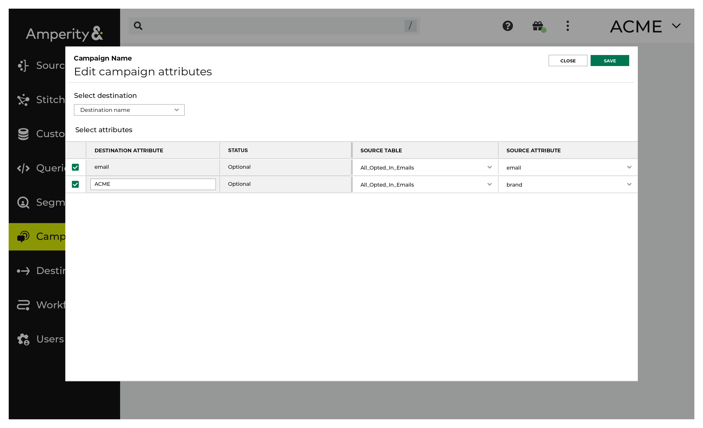

.. https://docs.amperity.com/operator/

.. meta::
    :description lang=en:
        Configure and manage the All Opted-In Emails table.

.. meta::
    :content class=swiftype name=body data-type=text:
        Configure and manage the All Opted-In Emails table.

.. meta::
    :content class=swiftype name=title data-type=string:
        All Opted-In Emails table

==================================================
All Opted-In Emails table
==================================================

.. include:: ../../shared/terms.rst
   :start-after: .. term-all-opted-in-emails-table-start
   :end-before: .. term-all-opted-in-emails-table-end

.. _table-all-opted-in-emails-use-in-segments:

Use in segments
==================================================

.. table-all-opted-in-emails-use-in-segments-start

Use the **contactable_email** attribute from the **Customer Attributes** table when building segments.

.. table-all-opted-in-emails-use-in-segments-end

.. table-all-opted-in-emails-use-in-campaigns-start

For each sub-audience in a campaign, to send only email addresses that have opted in, open **Edit Attributes** and use the **email** attribute in the **All Opted-In Emails** table.

For example:

You may use other attributes in the **All Opted-In Emails** table, if they are available, to apply additional filters to the sub-audience.

.. table-all-opted-in-emails-use-in-campaigns-end

.. table-all-opted-in-emails-use-in-segments-note-start

.. note:: The **email** attribute in the **All Opted-In Emails** table may represent more than one opted-in email address for the same customer. This is not uncommon and you may notice a difference between the number of records in the segment versus the (typically higher) number of records that were delivered by the campaign.

.. table-all-opted-in-emails-use-in-segments-note-start

.. table-all-opted-in-emails-use-in-segments-warning-start

.. warning:: The **All Opted-In Emails** table *is not unique* by Amperity ID and should not be used within the **Segment Editor**.

.. table-all-opted-in-emails-use-in-segments-warning-end

.. _table-all-opted-in-emails-add-table:

Add table
==================================================

.. table-all-opted-in-emails-add-table-start

The **All Opted-In Emails** table requires the **Email Opt Status** table, after which you can extend support for additional requirements.

.. table-all-opted-in-emails-add-table-end

**To add the All Opted-In Emails table**

.. table-all-opted-in-emails-add-table-steps-start

#. From the **Database Editor**, click **Add Table**.
#. Name the table "All Opted-In Emails".
#. Set the build mode to **SQL**.
#. Click **Apply template**, and then select **All Opted-In Emails**.

   The minimum requirement for this table is to SELECT all attributes from the **Email Opt Status** table:

   .. code-block:: sql
      :linenos:

      SELECT
        *
      FROM Email_Opt_Status
      WHERE is_email_opted_in

#. Click **Validate** to verify the SQL runs without error.
#. Click **Next**. This opens the **Database Table Definition** page.
#. Add a table description. This enables a tooltip that is visible from other areas in Amperity.
#. Select **Make available in Visual Segment Editor**. This ensures the table is available from the **Edit Attributes** dialog in the campaign editor.

   .. important:: You should not use attributes in this table to build segments.
#. Leave the **Table Semantics** dropdown empty.
#. Click **Save**.

.. table-all-opted-in-emails-add-table-steps-end

.. _table-all-opted-in-emails-extend-sql:

Extend table
--------------------------------------------------

.. table-all-opted-in-emails-extend-sql-start

You can extend the **All Opted-In Emails** table to contain specific sets of attributes. For example:

* A brand
* A region
* The name of your email program
* The frequency at which your customers allow emails to be sent
* Language preference

For example, to extend the **All Opted-In Emails** table to support a single brand in Europe, update the SQL for the **All Opted In Emails** table:

.. code-block:: sql
   :linenos:

   SELECT
     *
   FROM Email_Opt_Status
   WHERE is_email_opted_in
   AND brand = ACME
   AND region = Europe

You can use an AND clause for any of the individual fields in the :doc:`Email Opt Status <table_email_opt_status>` table.

.. table-all-opted-in-emails-extend-sql-end

.. _table-all-opted-in-emails-brand-specific:

Add brand-specific table
--------------------------------------------------

.. table-all-opted-in-emails-extend-sql-start

You can add brand-specific tables :ref:`using the same steps for adding the All Opted In Emails <table-all-opted-in-emails-add-table>` table. Append the name of your brand *after* the name of the table. For example: "All_Opted_In_Emails_ACME".

.. table-all-opted-in-emails-extend-sql-end

.. _table-all-opted-in-emails-reference:

Column reference
==================================================

.. include:: ../../amperity_reference/source/data_tables.rst
   :start-after: .. data-tables-all-opted-in-emails-context-start
   :end-before: .. data-tables-all-opted-in-emails-context-end

.. include:: ../../amperity_reference/source/data_tables.rst
   :start-after: .. data-tables-optin-status-email-table-start
   :end-before: .. data-tables-optin-status-email-table-end
