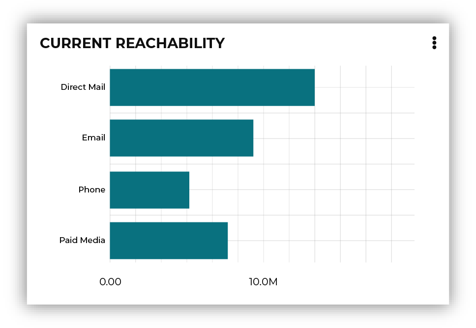

.. https://docs.amperity.com/operator/

.. meta::
    :description lang=en:
        Configure and manage the Customer Attributes table.

.. meta::
    :content class=swiftype name=body data-type=text:
        Configure and manage the Customer Attributes table.

.. meta::
    :content class=swiftype name=title data-type=string:
        Customer Attributes table

==================================================
Customer Attributes table
==================================================

.. include:: ../../shared/terms.rst
   :start-after: .. term-customer-attributes-table-start
   :end-before: .. term-customer-attributes-table-end

.. table-customer-attributes-start

After the **Customer Attributes** table is configured you can extend it to be more specific to the use cases that are required by your tenant.

.. note:: The data in your tenant must have the following types of data already configured:

   #. Customer profile data sources, such as names, addresses, email addresses, and phone numbers. This data is made available from the **Merged Customers** table and is required by the **Customer Attributes** table.
   #. Customer interactions, such as orders and items. This data is made available from the **Transaction Attributes Extended** table and is optional.
   #. Customer consent data for email address and SMS/phone opt-in to receiving communication from your brand. This data is made available from the **Email Opt Status** and **SMS Opt Status** tables and is optional.

.. table-customer-attributes-end

.. table-customer-attributes-important-start

.. important:: Many columns in the **Customer Attributes** table are built to enable specific features within Amperity, such as segment insights, predictive scoring, and churn prevention campaigns.

   Any column that exists in the :ref:`column reference <table-customer-attributes-reference>` must maintain the exact column name and data type, even if your tenant requires custom SQL to enable the feature.

   This table may be extended to support additional use cases. The implementation for these types of use cases are always tenant-specific, but should follow a similar approach as the :ref:`recommended <table-customer-attributes-recommended-updates>` and :ref:`optional <table-customer-attributes-optional>` extensions. Custom fields are not used by segment insights and predictive scoring, but may be used by workflows that you build within your tenant, and then enable downstream.

.. table-customer-attributes-important-end

.. _table-customer-attributes-start-here:

Start here
==================================================

.. table-customer-attributes-start-here-start

The **Customer Attributes** table has a small number of specific requirements, which are described below. A series of recommended and optional configurations are also available. You may enable any of the optional configurations for your tenant. In some cases, an optional configuration has its own set of specific requirements.

.. table-customer-attributes-start-here-end

**Required configuration**

.. table-customer-attributes-start-here-requirements-start

The **Customer Attributes** table has the following requirements:

* PII semantic tags are applied consistently, including assigning the correct data types, to all feeds that contain the following types of customer records: email addresses, phone numbers, and physical addresses.
* The **Merged Customers** table is extended to support :ref:`custom email <table-merged-customers-extend-pii-semantic-email>` or :ref:`custom phone <table-merged-customers-extend-pii-semantic-phone>` semantics that may be present when individual data sources provide multiple email addresses or phone numbers.
* The **Merged Customers** table is extended to :doc:`exclude common or "bad" email, phone, or physical address values <blocklist_bad_values>`.

.. table-customer-attributes-start-here-requirements-end

**Recommended configuration**

.. table-customer-attributes-start-here-recommended-start

The **Customer Attributes** table should have access to transactions and customer consent tables for email addresses, SMS, and phone numbers. These tables are enabled within the SQL that shows the :ref:`recommended starting point <table-customer-attributes-recommended-starting-sql>` for the **Customer Attributes** table.

.. note:: You can comment out the SQL for :ref:`table-customer-attributes-recommended-update-transaction-attributes`, :ref:`table-customer-attributes-recommended-update-email-optin`, and :ref:`table-customer-attributes-recommended-update-sms-optin` if you do not plan to use these features within your tenant.

.. table-customer-attributes-start-here-recommended-end

**Optional configurations**

.. table-customer-attributes-start-here-optional-start

The following options may be configured in your tenant:

#. :ref:`table-customer-attributes-optional-non-customer-emails`
#. :ref:`table-customer-attributes-optional-households`
#. :ref:`table-customer-attributes-optional-churn-prevention`
#. :ref:`table-customer-attributes-optional-classifications`
#. :ref:`table-customer-attributes-optional-contactability`

.. table-customer-attributes-start-here-optional-end

.. _table-customer-attributes-add-table:

Add table
==================================================

.. include:: ../../shared/terms.rst
   :start-after: .. term-customer-attributes-table-start
   :end-before: .. term-customer-attributes-table-end

**To add the Customer Attributes table**

.. table-customer-attributes-add-steps-start

#. From the **Database Editor**, click **Add Table**.
#. Name the table "Customer Attributes".
#. Set the build mode to **SQL**.
#. Click **Apply template**, and then select **Customer Attributes**.
#. Review the :ref:`required updates <table-customer-attributes-required-updates>`, and then make any adjustments that are necessary for your tenant.

   .. tip:: Review the :ref:`recommended starting point <table-customer-attributes-recommended-starting-sql>` and then review each of the optional sections, including:
   
   #. Non-customer email addresses for :ref:`businesses <table-customer-attributes-optional-email-categories-business>`, :ref:`employees <table-customer-attributes-optional-email-categories-employees>`, :ref:`gift givers <table-customer-attributes-optional-email-categories-gift-givers>`, :ref:`outliers <table-customer-attributes-optional-email-categories-outliers>`, :ref:`resellers <table-customer-attributes-optional-email-categories-resellers>`, and :ref:`test accounts <table-customer-attributes-optional-email-categories-test-accounts>`.
   #. :ref:`Households and primary buyers <table-customer-attributes-optional-households>`.
   #. :ref:`Churn prevention campaigns <table-customer-attributes-optional-churn-prevention>`.
   #. :ref:`Customer classifications <table-customer-attributes-optional-classifications>`.

#. Click **Validate** to verify the SQL runs without error.
#. Click **Next**. This opens the **Database Table Definition** page.
#. Add a table description. This enables a tooltip that is visible from other areas in Amperity.
#. Verify that the **db/required** and **db/unique** database field semantics were applied to the **amperity_id** column.
#. From the **Table Semantics** dropdown, select **Customer Attributes**.
#. Click **Save**.

.. table-customer-attributes-add-steps-end

.. _table-customer-attributes-sql-template:

About the SQL query template
--------------------------------------------------

.. table-customer-attributes-sql-template-start

The **Customer Attributes** SQL template is available from the database editor and is the starting point for building out the **Customer Attributes** table for your tenant.

This table is designed to consolidate various data points about your customers into a single table and is customizable to match the use cases and requirements of your tenant.

.. table-customer-attributes-sql-template-end

.. table-customer-attributes-sql-template-important-start

.. important:: Review the :ref:`column reference <table-customer-attributes-reference>` to familiarize yourself with the table schema. If you extend or custommize this table you **must** use column names that match the names of columns that are in the defined table schema.

   For example, email and SMS opt-in status **must** return a Boolean value for **is_email_opted_in** and **is_sms_opted_in**.

   You may extend or customize this table for columns that are not defined in the schema.

.. table-customer-attributes-sql-template-important-end

.. _table-customer-attributes-recommended-starting-sql:

Recommended starting SQL
--------------------------------------------------

.. table-customer-attributes-recommended-starting-sql-start

The following SQL represents a recommended starting point for the **Customer Attributes** table and assumes that you have already has the :doc:`SMS Opt Status <table_sms_opt_status>`, :doc:`Email Opt Status <table_email_opt_status>`, and :doc:`Transaction Attributes Extended <table_transaction_attributes_extended>` tables configured in your tenant.

.. table-customer-attributes-recommended-starting-sql-end

.. table-customer-attributes-recommended-starting-sql-note-start

.. note:: If your tenant is not using transactions or if your tenant does not have email or SMS opt-in status, make some or all of the following changes to the recommended starting SQL for the **Customer Attributes** table:

   #. Remove the "Extend for transaction attributes" section, along with the **LEFT JOIN tae_cte ta** line in the "Extend for classifications" common table expression (CTE).
   #. Remove the "Extend for email opt-in status" section.
   #. Remove the "Extend for SMS opt-in status" section.
   #. Remove the LEFT JOINs for email and SMS opt-in status in the "Extend for customer contactability" section.

   If your tenant has the **Transaction Attributes Extended**, **Email Opt Status**, and **SMS Opt Status** tables, you should be able to copy and paste the following SQL statement, and then validate it within your customer 360 database.

   The **contactable_phone**, **contactable_email**, **contactable_address**, **contactable_paid_social** and **contactable_global** attributes are required. These attributes :ref:`populate the Reachability card on the segment insights page <table-customer-attributes-optional-contactability>` in the Amperity user interface. When data cannot be made available to these fields they still must exist, but should be **NULL**.

.. table-customer-attributes-recommended-starting-sql-note-end

.. table-customer-attributes-recommended-starting-sql-tip-start

.. tip:: Add the **Customer Attributes** table using the SQL template option to load a version of this table that does not have the **Transaction Attributes Extended**, **Email Opt Status**, and **SMS Opt Status** tables pre-configured. You may copy and paste the following example into the SQL editor to use it as a pre-configured starting point.

.. table-customer-attributes-recommended-starting-sql-tip-end

.. table-customer-attributes-recommended-starting-sql-code-start

.. code-block:: sql
   :linenos:

   WITH mc_cte AS (
     SELECT
       amperity_id AS amperity_id
       ,email
       ,phone
       ,address
       ,address_completion
       ,phone_completion
       ,email_completion
       ,name_completion
     FROM Merged_Customers
   )

   -- -------------------------------------------------------
   -- Extend for transaction attributes extended
   -- -------------------------------------------------------

   ,tae_cte AS (
     SELECT 
       amperity_id
       ,lifetime_order_frequency
       ,lifetime_order_revenue
       ,latest_order_datetime
       ,first_order_datetime
     FROM Transaction_Attributes_Extended 
   )

   -- -------------------------------------------------------
   -- Email opt-in status
   -- -------------------------------------------------------

   ,email_opt_status AS (
     SELECT 
       amperity_id
       ,email
       ,is_email_opted_in
     FROM Email_Opt_Status eo
   )

   -- -------------------------------------------------------
   -- SMS opt-in status
   -- -------------------------------------------------------

   ,sms_opt_status AS (
     SELECT 
       amperity_id
       ,phone
       ,is_sms_opted_in
     FROM SMS_Opt_Status so
   )

   -- -------------------------------------------------------
   -- Extend for non-customer email addresses
   -- -------------------------------------------------------

   -- is_business

   -- is_employee

   -- is_gift_giver

   -- is_outlier

   -- is_reseller

   -- is_test_account

   -- -------------------------------------------------------
   -- Extend for households
   -- -------------------------------------------------------

   -- -------------------------------------------------------
   -- Extend for churn prevention
   -- -------------------------------------------------------

   -- -------------------------------------------------------
   -- Extend for classifications
   -- -------------------------------------------------------

   ,classification_config AS (
     SELECT
       mc.amperity_id AS amperity_id
       ,CASE
         WHEN ta.lifetime_order_frequency >= 1
         THEN true
         ELSE false
       END AS is_purchaser
       ,CASE
         WHEN ta.lifetime_order_frequency < 1
         OR ta.lifetime_order_frequency IS NULL
         THEN true
         ELSE false
       END AS is_prospect
       ,CASE
         WHEN DATEDIFF(CURRENT_DATE,ta.first_order_datetime) <= 30 THEN 'New'
         WHEN DATEDIFF(CURRENT_DATE, ta.latest_order_datetime) <= 365 THEN 'Active'
         WHEN DATEDIFF(CURRENT_DATE, ta.latest_order_datetime) > 365
         AND DATEDIFF(CURRENT_DATE, ta.latest_order_datetime) <= 730 THEN 'Lapsed'
         WHEN DATEDIFF(CURRENT_DATE, ta.latest_order_datetime) > 730 THEN 'Dormant'
         WHEN ta.latest_order_datetime IS NULL AND ta.first_order_datetime IS NULL THEN 'Prospect'
       END AS historical_purchaser_lifecycle_status
     FROM mc_cte mc
     LEFT JOIN tae_cte ta ON mc.amperity_id = ta.amperity_id
   )

   -- -------------------------------------------------------
   -- Extend for contactability
   -- -------------------------------------------------------

   ,contactability_config AS (
     SELECT
       mc.amperity_id
       ,eo.is_email_opted_in AS contactable_email
       ,so.is_sms_opted_in AS contactable_phone
       ,CASE
         WHEN mc.address_completion = 4
         THEN true
         ELSE false
       END AS contactable_address
       ,CASE
         WHEN mc.phone_completion > 0
         OR mc.email_completion > 0
         THEN true
         ELSE false
       END AS contactable_paid_social
       ,CASE
         WHEN mc.phone_completion = 0
         AND mc.email_completion = 0
         AND mc.address_completion = 0
         AND mc.name_completion = 0
         THEN true
         ELSE false
       END AS is_no_pii_amperity_id
       ,CASE
         WHEN mc.phone_completion = 0
         AND mc.email_completion = 0
         AND mc.address_completion = 0
         AND mc.name_completion = 0
         THEN false
         ELSE true
       END AS contactable_global
     FROM mc_cte mc
     LEFT JOIN email_opt_status eo ON mc.amperity_id = eo.amperity_id
     AND COALESCE(mc.email, mc.amperity_id) = eo.email
     LEFT JOIN sms_opt_status so ON mc.amperity_id = so.amperity_id
     AND COALESCE(mc.phone, mc.amperity_id) = so.phone
   )

   -- -------------------------------------------------------
   -- Extend for customer attributes
   -- -------------------------------------------------------

   ,customer_attributes_final AS (
     SELECT DISTINCT
       cl.amperity_id AS amperity_id
       ,cl.is_purchaser
       ,cl.is_prospect
       ,co.contactable_address
       ,co.contactable_email
       ,co.contactable_global
       ,co.contactable_paid_social
       ,co.contactable_phone
       ,co.is_no_pii_amperity_id
     FROM classification_config cl
     LEFT JOIN contactability_config co
     ON cl.amperity_id = co.amperity_id
   )

   SELECT * FROM customer_attributes_final

.. table-customer-attributes-recommended-starting-sql-code-end

.. _table-customer-attributes-required-updates:

Required updates
==================================================

.. table-customer-attributes-required-updates-start

The **Customer Attributes** table builds a list of customers who are contactable. A contactable customer has at least one of the following:

#. A complete email address
#. A valid phone number
#. A complete physical address

If a customer has a complete email address *and* phone number they are considered to be contactable on social media.

The **Merged Customers** table is the "source of truth" for this data within your customer 360 database and is required by the **Customer Attributes** table. Customers for which you do not have *any* personally identifiable information (PII) are also identified.

.. note:: When the **Email Opt Status** and **SMS Opt Status** tables are available and are configured in this table, the **contactable_email** and **contactable_phone** records are updated to be email addresses and phone numbers that are complete in the **Merged Customers** table *and also* belong to customers who have given their consent to be contacted by your brand at their email address or phone number.

.. table-customer-attributes-required-updates-end

.. _table-customer-attributes-recommended-updates:

Recommended updates
==================================================

.. table-customer-attributes-recommended-updates-start

Most brands have transaction data histories, along with data that indicates if your customers have given consent to be contacted at their email address or phone number.

The following sections describe these features and also show you how to comment them out of the **Customer Attributes** table to disable them:

* :ref:`table-customer-attributes-recommended-update-transaction-attributes`
* :ref:`table-customer-attributes-recommended-update-email-optin`
* :ref:`table-customer-attributes-recommended-update-sms-optin`

.. table-customer-attributes-recommended-updates-end

.. _table-customer-attributes-recommended-update-transaction-attributes:

Transaction attributes
--------------------------------------------------

.. table-customer-attributes-recommended-update-transaction-attributes-start

The **Customer Attributes** table can be extended to provide status for customers based on their history and recency of interactions with your brand. The **Customer Attributes** table defines this as "Historical Purchaser Lifecycle Status" and it makes available the following values:

Customer states are typically defined as "new", "active", "lapsed", "dormant", and "prospect" and are based on purchase behaviors assigned across a 5-year window. A customer who has purchased within the previous 365 days (1 year) is assigned to "active" and within the previous 730 days (2 years) is assigned to "lapsed". A customer who has not purchased within 2 years is assigned to "dormant".

A customer who has never interacted with your brand--never made a purchase--is assigned the value of "prospect".

.. note:: The :doc:`Transaction Attributes Extended <table_transaction_attributes_extended>` table should be available in the customer 360 database. The **Customer Attributes** table should enable the **historical_purchaser_lifecycle_status** feature. You can comment out the following SQL if you do not plan to provide transaction data to the **Customer Attributes** table.

.. code-block:: sql
   :linenos:

   -- -------------------------------------------------------
   -- Extend for transaction attributes
   -- -------------------------------------------------------

   -- ,tae_cte AS (
   --   SELECT 
   --     amperity_id
   --     ,lifetime_order_frequency
   --     ,lifetime_order_revenue
   --     ,latest_order_datetime
   --     ,first_order_datetime
   --   FROM Transaction_Attributes_Extended 
   -- )

   ...

   -- -------------------------------------------------------
   -- Extend for classifications
   -- -------------------------------------------------------

   ,classification_config AS (
     SELECT
       mc.amperity_id AS amperity_id
   --     ,CASE
   --       WHEN DATEDIFF(CURRENT_DATE,ta.first_order_datetime) <= 30 THEN 'New'
   --       WHEN DATEDIFF(CURRENT_DATE, ta.latest_order_datetime) <= 365 THEN 'Active'
   --       WHEN DATEDIFF(CURRENT_DATE, ta.latest_order_datetime) > 365
   --       AND DATEDIFF(CURRENT_DATE, ta.latest_order_datetime) <= 730 THEN 'Lapsed'
   --       WHEN DATEDIFF(CURRENT_DATE, ta.latest_order_datetime) > 730 THEN 'Dormant'
   --       WHEN ta.latest_order_datetime IS NULL AND ta.first_order_datetime IS NULL THEN 'Prospect'
   --     END AS historical_purchaser_lifecycle_status
     FROM mc_cte mc
   --   LEFT JOIN tae_cte ta ON mc.amperity_id = ta.amperity_id
   )

.. table-customer-attributes-recommended-update-transaction-attributes-end

.. table-customer-attributes-recommended-update-transaction-attributes-tip-start

.. tip:: Historical purchaser lifecycle status values are configurable and can be aligned to the ranges and names that are used within your organization. For example, instead of:

   .. code-block:: sql

      AND DATEDIFF(CURRENT_DATE, ta.latest_order_datetime) <= 730 THEN 'Lapsed'
      WHEN DATEDIFF(CURRENT_DATE, ta.latest_order_datetime) > 730 THEN 'Dormant'

   you could modify the query to add a third status:

   .. code-block:: sql

      AND DATEDIFF(CURRENT_DATE, ta.latest_order_datetime) <= 730 THEN 'Lapsed'
      WHEN DATEDIFF(CURRENT_DATE, ta.latest_order_datetime) <= 1095 THEN 'Dormant'
      WHEN DATEDIFF(CURRENT_DATE, ta.latest_order_datetime) > 1095 THEN 'Lost'

.. table-customer-attributes-recommended-update-transaction-attributes-tip-end

.. _table-customer-attributes-recommended-update-email-optin:

Email opt-in status
--------------------------------------------------

.. table-customer-attributes-recommended-update-email-optin-start

The **Customer Attributes** table provides a list of customers who have complete and contactable email addresses. You can upgrade this list to only be a list of customers who have given consent to your brand sending them emails by using the **Email Opt Status** table.

.. include:: ../../shared/terms.rst
   :start-after: .. term-email-opt-status-table-start
   :end-before: .. term-email-opt-status-table-end

.. tip:: The **Email Opt Status** table is generated when |semantics_email_optin| semantic tags are applied to feeds that contain records that indicate which of your customers have given their consent to receive email messages from your brand.

.. note:: The **Email Opt Status** table should be available to your customer 360 database and that it is included in the **Customer Attributes** table. You can comment out the following SQL if you do not plan to provide to Amperity data sources that contain customer consent status regarding the use of their email address with your marketing campaigns.

.. code-block:: sql
   :linenos:

   -- -------------------------------------------------------
   -- Email opt-in status
   -- -------------------------------------------------------

   -- ,email_opt_status AS (
   --   SELECT 
   --     amperity_id
   --     ,email
   --     ,is_email_opted_in
   --   FROM Email_Opt_Status eo
   -- )

.. table-customer-attributes-recommended-update-email-optin-end

.. _table-customer-attributes-recommended-update-sms-optin:

SMS opt-in status
--------------------------------------------------

.. table-customer-attributes-recommended-update-sms-optin-start

The **Customer Attributes** table provides a list of customers who have complete and contactable phone numbers. You can upgrade this list to only be a list of customers who have given consent to your brand sending them SMS or text messages by using the **SMS Opt Status** table.

.. include:: ../../shared/terms.rst
   :start-after: .. term-sms-opt-status-table-start
   :end-before: .. term-sms-opt-status-table-end

.. tip:: The **SMS Opt Status** table is generated when |semantics_sms_optin| semantic tags are applied to feeds that contain records that indicate which of your customers have given their consent to receive SMS messages from your brand.

.. note:: The **SMS Opt Status** table should be available to your customer 360 database and that it is included in the **Customer Attributes** table. You can comment out the following SQL if you do not plan to provide to Amperity data sources that contain customer consent status regarding the use of their phone number with your marketing campaigns.

.. code-block:: sql
   :linenos:

   -- -------------------------------------------------------
   -- SMS opt-in status
   -- -------------------------------------------------------

   -- ,sms_opt_status AS (
   --   SELECT 
   --     amperity_id
   --     ,phone
   --     ,is_sms_opted_in
   --   FROM SMS_Opt_Status so
   -- )

.. table-customer-attributes-recommended-update-sms-optin-end

.. _table-customer-attributes-optional:

Optional updates
==================================================

.. table-customer-attributes-optional-start

A series of optional updates are available in the **Customer Attributes** table:

* :ref:`table-customer-attributes-optional-custom-inputs`
* :ref:`table-customer-attributes-optional-households`
* :ref:`table-customer-attributes-optional-churn-prevention`
* :ref:`table-customer-attributes-optional-classifications`
* :ref:`table-customer-attributes-optional-contactability`
* :ref:`table-customer-attributes-optional-non-customer-emails`

.. table-customer-attributes-optional-end

.. _table-customer-attributes-optional-custom-inputs:

Custom inputs
--------------------------------------------------

.. table-customer-attributes-optional-custom-inputs-start

If your tenant has a table or a set of tables that represents the value your customers have to your brand you may configure those tables to provide attributes to the **Customer Attributes** table. Use a pattern similar to how the :ref:`Transaction Attributes <table-customer-attributes-recommended-update-transaction-attributes>` table is configured.

.. table-customer-attributes-optional-custom-inputs-end

.. _table-customer-attributes-optional-non-customer-emails:

Non-customer email addresses
--------------------------------------------------

.. table-customer-attributes-optional-non-customer-emails-start

The following sections may be added to the **Customer Attributes** table to update how your brand wants to handle non-customer email addresses:

* :ref:`table-customer-attributes-optional-email-categories-business`
* :ref:`table-customer-attributes-optional-email-categories-employees`
* :ref:`table-customer-attributes-optional-email-categories-gift-givers`
* :ref:`table-customer-attributes-optional-email-categories-outliers`
* :ref:`table-customer-attributes-optional-email-categories-resellers`
* :ref:`table-customer-attributes-optional-email-categories-test-accounts`

.. important:: Add the utility queries for optional updates to the **Customer Attributes** table. This is done from the **Queries** page. Click **Create**, select **Folder**, and then choose "Utility Queries: Customer Attributes".

Each of these options follows a similar series of steps:

#. Use a utility query in the **Queries** page to fine-tune the logic for your tenant
#. Add that query to the SQL for **Customer Attributes** table
#. Use a LEFT JOIN to include it with the **classification_config** CTE
#. Update the list in the **customer_attributes_final** CTE

.. note:: Refer to the :ref:`businesses <table-customer-attributes-optional-email-categories-business>` section to see a more complete walkthrough of the series of steps required to add each of the non-customer email address sections to the **Customer Attributes** table. The other sections highlight important details within the utility queries for :ref:`employees <table-customer-attributes-optional-email-categories-employees>`, :ref:`gift givers <table-customer-attributes-optional-email-categories-gift-givers>`, :ref:`outliers <table-customer-attributes-optional-email-categories-outliers>`, :ref:`resellers <table-customer-attributes-optional-email-categories-resellers>`, and :ref:`test accounts <table-customer-attributes-optional-email-categories-test-accounts>`.

.. table-customer-attributes-optional-non-customer-emails-end

.. _table-customer-attributes-optional-email-categories-business:

Businesses
++++++++++++++++++++++++++++++++++++++++++++++++++

.. table-customer-attributes-optional-email-categories-businesses-start

Use the "is_business" utility query to identify customer records that likely belong to a business. This query selects street addresses, first names, and last names from the **Merged Customers** table, and then builds a list of strings that are indicators a name or address may belong to a business.

Review the utility query, and then configure it to identify likely business email addresses. There are two locations in this query that must be updated for your tenant.

The first is the **likely_business** CTE. Update the values in the CASE statement to match known business address patterns that exist in your tenant:

.. code-block:: sql
   :linenos:

   ,CASE
     WHEN given_name LIKE 'inc'
     OR given_name LIKE 'srl'
     OR given_name LIKE 'llc'
     OR given_name LIKE 'service'
     OR given_name LIKE 'business'
     OR surname LIKE 'inc'
     OR surname LIKE 'srl'
     OR surname LIKE 'llc'
     OR surname LIKE 'service'
     OR surname LIKE 'business'
     OR address LIKE 'suite'
     OR address LIKE 'space'
     OR address LIKE 'floor'
     OR address2 LIKE 'suite'
     OR address2 LIKE 'space'
     OR address2 LIKE 'floor'
     THEN true
     ELSE false
   END AS is_likely_business

The second is for when you need to define exceptions for names that should not match known business address patterns:

.. code-block:: sql
   :linenos:

   ,CASE
     WHEN given_name IN ('name1','name2','name3','...') THEN true
     WHEN surname IN ('name1','name2','name3','...') THEN true
     WHEN address IN ('address1','address2','address3','...') THEN true
     WHEN address2 IN ('address21','address22','address23','...') THEN true
     ELSE false
   END AS is_exception

After you have defined business address patterns and exceptions, return the list of likely businesses:

.. code-block:: sql
   :linenos:

   SELECT
     *
   FROM likely_businesses
   WHERE is_likely_business
   AND NOT is_exception
   ORDER BY is_likely_business, is_exception

Run the query to validate the results. For example, a query that defines an exception for given name "Dallas" and surname "Good" will return a list of likely businesses similar to:

.. code-block:: mysql

   ------------- ------------ --------- ---------------- ---------- ------------- --------------
    amperity_id   given_name   surname   address          address2  is_business   is_exception
   ------------- ------------ --------- ---------------- ---------- ------------- --------------
    abc123-...    Dallas       Box Co.   123 Main St.     LLC       true          false
    def456-...    Dallas       Good      12 5th Ave       Floor 2   false         true
    ghi789-...    Shug's       Bagels    20 Robin Lane              true          false
   ------------- ------------ --------- ---------------- ---------- ------------- --------------

When the query is ready, under the following section in the **Customer Attributes** SQL template:

.. code-block:: sql

   -- -------------------------------------------------------
   -- Extend for non-customer email addresses
   -- -------------------------------------------------------

add the updated **is_likely_business** query:

.. code-block:: sql
   :linenos:

   -- -------------------------------------------------------
   -- Extend for business email addresses
   -- -------------------------------------------------------

   WITH mc_processed AS (
     SELECT
       mc.amperity_id
       ,TRIM(LOWER(mc.address)) address
       ,TRIM(LOWER(mc.address2)) address2
       ,TRIM(LOWER(mc.given_name)) given_name
       ,TRIM(LOWER(mc.surname)) surname
     FROM Merged_Customers mc
   )

   ,likely_businesses as (
     SELECT
       mc_processed.amperity_id
       ,mc_processed.given_name
       ,mc_processed.surname
       ,mc_processed.address
       ,mc_processed.address2
       ,CASE
         WHEN given_name LIKE 'inc'
         OR given_name LIKE 'srl'
         OR given_name LIKE 'llc'
         OR given_name LIKE 'service'
         OR given_name LIKE 'business'
         OR surname LIKE 'inc'
         OR surname LIKE 'srl'
         OR surname LIKE 'llc'
         OR surname LIKE 'service'
         OR surname LIKE 'business'
         OR address LIKE 'suite'
         OR address LIKE 'space'
         OR address LIKE 'floor'
         OR address2 LIKE 'suite'
         OR address2 LIKE 'space'
         OR address2 LIKE 'floor'
         THEN true
         ELSE false
       END AS is_likely_business
       ,CASE
         WHEN given_name IN ('name1','name2','name3','...') THEN true
         WHEN surname IN ('name1','name2','name3','...') THEN true
         WHEN address IN ('address1','address2','address3','...') THEN true
         WHEN address2 IN ('address21','address22','address23','...') THEN true
         ELSE false
       END AS is_exception
     FROM mc_processed
   )

   SELECT
     *
   FROM likely_businesses
   WHERE is_likely_business
   AND NOT is_exception
   ORDER BY is_likely_business, is_exception

Extend **classification_config** by adding a CASE statement and a LEFT JOIN similar to:

.. code-block:: sql
   :linenos:

   ,classification_config AS (
     SELECT
       mc.amperity_id AS amperity_id
       ,CASE
         WHEN DATEDIFF(CURRENT_DATE,ta.first_order_datetime) <= 30 THEN 'New'
         WHEN DATEDIFF(CURRENT_DATE, ta.latest_order_datetime) <= 365 THEN 'Active'
         WHEN DATEDIFF(CURRENT_DATE, ta.latest_order_datetime) > 365
         AND DATEDIFF(CURRENT_DATE, ta.latest_order_datetime) <= 730 THEN 'Lapsed'
         WHEN DATEDIFF(CURRENT_DATE, ta.latest_order_datetime) > 730 THEN 'Dormant'
         WHEN ta.latest_order_datetime IS NULL AND ta.first_order_datetime IS NULL THEN 'Prospect'
       END AS historical_purchaser_lifecycle_status
       ,CASE
         WHEN likely_businesses.is_likely_business
         AND NOT likely_businesses.is_exception
         THEN true
         ELSE false
       END AS is_likely_business
     FROM mc_cte mc
     LEFT JOIN tae_cte ta ON mc.amperity_id = ta.amperity_id
     LEFT JOIN likely_businesses ON likely_businesses.amperity_id=mc.amperity_id
   )

Add the likely businesses to **customer_attributes_final**:

.. code-block:: sql
   :linenos:

   ,customer_attributes_final AS (
     SELECT DISTINCT
       cl.amperity_id AS amperity_id
       ,co.contactable_address
       ,co.contactable_email
       ,co.contactable_global
       ,co.contactable_paid_social
       ,co.contactable_phone
       ,co.is_no_pii_amperity_id
       ,cl.is_business
     FROM classification_config cl
     LEFT JOIN contactability_config co
     ON cl.amperity_id = co.amperity_id
   )

Run and validate the **Customer Attributes** table and make any necessary adjustments.

.. table-customer-attributes-optional-email-categories-businesses-end

.. _table-customer-attributes-optional-email-categories-employees:

Employees
++++++++++++++++++++++++++++++++++++++++++++++++++

.. table-customer-attributes-optional-email-categories-employees-start

A customer is an employee when they are employed or were employed by your brand. You may choose to include employees within your marketing campaigns, but often it's preferable to exclude them. Use this extension to identify employees of your brand within your customer profile data.

.. note:: This utility query follows steps that are similar to ones described in the :ref:`businesses <table-customer-attributes-optional-email-categories-business>` utility query: build the utility query in **Queries** page, add the updated query to the **Customer Attributes** table, extend the **classification_config** section, and then update the **customer_attributes_final** section.

Review the **is_employee** utility query, and then configure it to identify customers who have an email address that is associated with your brand.

.. code-block:: sql
   :linenos:

   ,CASE
     WHEN email LIKE '%domain.com'
     THEN true
     ELSE false
   END AS is_email

and then allows you to define exceptions:

.. code-block:: sql
   :linenos:

   ,CASE
     WHEN email IN ('email1','email2','email3','...') THEN true
     ELSE false
   END AS is_exception

Run the query and validate the results. When the query is ready, under the following section in the **Customer Attributes** SQL template:

.. code-block:: sql

   -- -------------------------------------------------------
   -- Extend for non-customer email addresses
   -- -------------------------------------------------------

add the updated **is_employee** query, extend **classification_config** by adding a CASE statement and a LEFT JOIN, and then add **is_employee** to **customer_attributes_final**.

.. table-customer-attributes-optional-email-categories-employees-end

.. _table-customer-attributes-optional-email-categories-gift-givers:

Gift givers
++++++++++++++++++++++++++++++++++++++++++++++++++

.. table-customer-attributes-optional-email-categories-gift-givers-start

A gift giver is a customer who purchased an item for someone else.

.. note:: This utility query follows steps that are similar to ones described in the :ref:`businesses <table-customer-attributes-optional-email-categories-business>` utility query: build the utility query in **Queries** page, add the updated query to the **Customer Attributes** table, extend the **classification_config** section, and then update the **customer_attributes_final** section.

The **is_gift_giver** utility query returns product descriptions from the **Unified Itemized Transactions** table, and then analyzes those descriptions for indicators of product purchases that were gifts. Review the **is_gift_giver** utility query, and then configure it to match the approaches your brand uses to identify purchases that are gifts.

.. code-block:: sql
   :linenos:

   ,CASE
     WHEN product_description LIKE '%gift%'
     THEN true
     ELSE false
   END AS likely_gift_purchase

and then allows you to define exceptions:

.. code-block:: sql
   :linenos:

   ,CASE
     WHEN product_description IN ('description1','description2','description3','...') THEN true
     ELSE false
   END AS is_exception

Run the query and validate the results. When the query is ready, under the following section in the **Customer Attributes** SQL template:

.. code-block:: sql

   -- -------------------------------------------------------
   -- Extend for non-customer email addresses
   -- -------------------------------------------------------

add the updated **is_gift_giver** query, extend **classification_config** by adding a CASE statement and a LEFT JOIN, and then add **is_gift_giver** to **customer_attributes_final**.

.. table-customer-attributes-optional-email-categories-gift-givers-end

.. _table-customer-attributes-optional-email-categories-outliers:

Outliers
++++++++++++++++++++++++++++++++++++++++++++++++++

.. table-customer-attributes-optional-email-categories-outliers-start

An outlier is a customer with lifetime order revenue greater than a configurable threshold. Customers who meet this threshold should be excluded from your marketing campaign activities.

.. note:: This utility query follows steps that are similar to ones described in the :ref:`businesses <table-customer-attributes-optional-email-categories-business>` utility query: build the utility query in **Queries** page, add the updated query to the **Customer Attributes** table, extend the **classification_config** section, and then update the **customer_attributes_final** section.

Review the **is_outlier** utility query, and then configure it to identify customers who have outlier lifetime order revenue amounts that exceed a configurable threshold.

The query starts by defining the revenue outlier threshold:

.. code-block:: sql
   :linenos:

   WITH outlier_param AS (
     SELECT
       995 AS percentile
   )

.. note:: The outlier threshold is 0-1000, where 1000 is 100% and 995 is 99.5%.

The query builds a list of outliers by comparing records that exceed the record count threshold to lifetime order revenue. The outlier threshold is "995" which returns a list of customers whose lifetime revenue is in your top 0.5%.

Run the query and validate the results. When the query is ready, under the following section in the **Customer Attributes** SQL template:

.. code-block:: sql

   -- -------------------------------------------------------
   -- Extend for non-customer email addresses
   -- -------------------------------------------------------

add the updated **is_outlier** query, extend **classification_config** by adding a CASE statement and a LEFT JOIN, and then add **is_outlier** to **customer_attributes_final**.

.. table-customer-attributes-optional-email-categories-outliers-end

.. _table-customer-attributes-optional-email-categories-resellers:

Resellers
++++++++++++++++++++++++++++++++++++++++++++++++++

.. table-customer-attributes-optional-email-categories-resellers-start

A reseller is a customer who purchases large quantities of items from your brand for the purpose of reselling them. Customers who meet this threshold should be excluded from your marketing campaign activities.

.. note:: This utility query follows steps that are similar to ones described in the :ref:`businesses <table-customer-attributes-optional-email-categories-business>` utility query: build the utility query in **Queries** page, add the updated query to the **Customer Attributes** table, extend the **classification_config** section, and then update the **customer_attributes_final** section.

Review the **is_reseller** utility query, and then configure it to identify customers who are likely resellers. This query returns a list of supersized clusters from the **Unified Coalesced** table that have a record count that exceeds a configurable threshold, and then uses the **Transaction Attributes Extended** table to associate those records with a configurable top percentage of revenue. A reseller is identified when they belong to that configurable percentage *and* are a supersized cluster with a record count that exceeds the configurable threshold.

The query starts by defining the revenue outlier threshold:

.. code-block:: sql
   :linenos:

   WITH outlier_param AS (
     SELECT
       990 AS percentile
   )

.. note:: The outlier threshold is 0-1000, where 1000 is 100% and 990 is 99%.

The following CTE identifies supersized clusters that exceed the defined threshold. In the following example, the threshold is "50":

.. code-block:: sql
   :linenos:

   ,uc_cte AS (
     SELECT 
       amperity_id
       ,is_supersized
       ,COUNT(*) record_count
     FROM Unified_Coalesced
     GROUP BY amperity_id ,is_supersized
     having count(*) > 50
   )

The query builds a list of likely resellers by comparing supersized cluster records that exceed the record count threshold to lifetime order revenue that exceeds the configured revenue threshold. The supersized records threshold is "50" and the revenue threshold is "990" which returns a list of supersized clusters whose lifetime revenue is in your top 1%.

Run the query and validate the results. When the query is ready, under the following section in the **Customer Attributes** SQL template:

.. code-block:: sql

   -- -------------------------------------------------------
   -- Extend for non-customer email addresses
   -- -------------------------------------------------------

add the updated **is_reseller** query, extend **classification_config** by adding a CASE statement and a LEFT JOIN, and then add **is_reseller** to **customer_attributes_final**.

.. table-customer-attributes-optional-email-categories-resellers-end

.. _table-customer-attributes-optional-email-categories-test-accounts:

Test accounts
++++++++++++++++++++++++++++++++++++++++++++++++++

.. table-customer-attributes-optional-email-categories-test-accounts-start

A test account is an email address that does not belong to a customer, such as ``test@acme.com`` or ``support@yourbrand.com``. Email addresses that are identified as test accounts should be excluded from your marketing campaign activities.

.. note:: This utility query follows steps that are similar to ones described in the :ref:`businesses <table-customer-attributes-optional-email-categories-business>` utility query: build the utility query in **Queries** page, add the updated query to the **Customer Attributes** table, extend the **classification_config** section, and then update the **customer_attributes_final** section.

Review the **is_test_accounts** utility query, and then configure it to identify email addresses that do not belong to a customer and are likely test email accounts. Use a CASE statement to define the patterns that identify test accounts. For example:

.. code-block:: sql
   :linenos:

   CASE
     WHEN given_name LIKE 'test'
     OR given_name LIKE 'default'
     OR surname LIKE 'test'
     OR surname LIKE 'default'
     OR full_name LIKE 'test'
     OR full_name LIKE 'default'
     OR email LIKE 'test'
     OR email LIKE 'test%'
     OR email LIKE 'default'
     OR email LIKE 'default%'
     THEN true
     ELSE false
   END AS is_likely_test_account

and then allows you to define exceptions:

.. code-block:: sql
   :linenos:

   ,CASE
     WHEN given_name IN ('name1','name2','...') THEN true
     WHEN surname IN ('name1','name2','...') THEN true
     WHEN full_name IN ('full_name1','full_name2','...') THEN true  
     WHEN email IN ('email1','email2','...') THEN true 
     ELSE false
   END AS is_exception

Run the query and validate the results. When the query is ready, under the following section in the **Customer Attributes** SQL template:

.. code-block:: sql

   -- -------------------------------------------------------
   -- Extend for non-customer email addresses
   -- -------------------------------------------------------

add the updated **is_test_account** query, extend **classification_config** by adding a CASE statement and a LEFT JOIN, and then add **is_test_account** to **customer_attributes_final**.

.. table-customer-attributes-optional-email-categories-test-accounts-end

.. _table-customer-attributes-optional-households:

Households
--------------------------------------------------

.. table-customer-attributes-optional-households-start

.. include:: ../../shared/terms.rst
   :start-after: .. term-merged-households-table-start
   :end-before: .. term-merged-households-table-end

.. note::

   .. include:: ../../amperity_operator/source/table_merged_households.rst
      :start-after: .. table-merged-households-start
      :end-before: .. table-merged-households-end

You can configure the **Customer Attributes** table to use specific columns from the **Merged Households** and **Transaction Attributes Extended** tables to identify the primary buyer within a household.

Under the following section in the **Customer Attributes** SQL template:

.. code-block:: sql

   -- -------------------------------------------------------
   -- Extend for households
   -- -------------------------------------------------------

configure the following SQL:

.. code-block:: sql
   :linenos:

   -- -------------------------------------------------------
   -- Extend for households
   -- -------------------------------------------------------

   ,primary_buyer_logic AS (
     SELECT 
       mh.amperity_id AS amperity_id
       ,mh.household_id
       ,mh.household_size
       ,ta.lifetime_order_revenue
       ,ROW_NUMBER() OVER(PARTITION BY mh.household_id ORDER BY ta.lifetime_order_revenue desc) AS buyer_rank
     FROM (
       SELECT 
         amperity_id
         ,household_id
         ,household_size
       FROM merged_households 
     ) mh 
     INNER JOIN transaction_attributes_extended ta 
     ON mh.amperity_id = ta.amperity_id
   )

   ,primary_buyer_cte AS (
     SELECT distinct
       amperity_id
     FROM primary_buyer_logic 
     WHERE buyer_rank = 1
   )

and then extend **classification_config** for primary buyers:

.. code-block:: sql
   :linenos:

   ,CASE
     WHEN pb.amperity_id IS NULL
     THEN false
     ELSE true
   END AS is_primary_buyer_household

   ...

   LEFT JOIN primary_buyer_cte pb
   ON mc.amperity_id=pb.amperity_id

.. table-customer-attributes-optional-households-end

.. _table-customer-attributes-optional-churn-prevention:

Churn prevention
--------------------------------------------------

.. include:: ../../amperity_user/source/churn_prevention.rst
   :start-after: .. churn-prevention-about-start
   :end-before: .. churn-prevention-about-about-end

.. table-customer-attributes-optional-churn-prevention-start

Each churn prevention campaign is unique, but they all have something in common: a series of messages that are sent when customers enter or exit specific stages within that churn prevention campaign. Each stage is associated with a threshold that defines a customer's current churn status.

The **Customer Attributes** table can be configured to provide your customers' current churn status -- one of "active", "cooling down", "at risk", "highly at risk", or "lost" -- along with the date on which your customers were assigned to that status.

.. important:: The **Customer Attributes** table should track churn prevention events from the customer 360 database. The name of this table may be unique to your tenant. For example: **Churn Events**.

You have two choices for defining churn events for this table:

#. Use predicted modeling to define your customers' current churn status. This option is available when your tenant has predictive modeling enabled and a :doc:`Churn Events <table_predicted_clv_attributes>` table is configured for use in your tenant.

   .. note:: Churn status classifications for predictive modeling results in the **Churn Events** table are not configurable.

      .. include:: ../../shared/models.rst
         :start-after: .. models-churn-propensitity-tiers-repeat-start
         :end-before: .. models-churn-propensitity-tiers-repeat-end

      .. include:: ../../shared/models.rst
         :start-after: .. models-churn-propensitity-tiers-onetime-start
         :end-before: .. models-churn-propensitity-tiers-onetime-end

#. Use historical order history to define your customers' churn status. For example, you could configure the **Customer Attributes** table to define churn status as "active" as "within the past 60 days", "at risk" as "within the past 365 days", and so on, using SQL similar to:

   .. code-block:: sql
      :linenos:

      ,historical_churn_classification AS (
        SELECT
          mc.amperity_id AS amperity_id
          ,CASE
            WHEN DATEDIFF(CURRENT_DATE, ta.latest_order_datetime) <= 60 THEN 'active'
            WHEN DATEDIFF(CURRENT_DATE, ta.latest_order_datetime) <= 120 THEN 'cooling down'
            WHEN DATEDIFF(CURRENT_DATE, ta.latest_order_datetime) <= 240 THEN 'at risk'
            WHEN DATEDIFF(CURRENT_DATE, ta.latest_order_datetime) <= 365 THEN 'highly at risk'
            WHEN DATEDIFF(CURRENT_DATE, ta.latest_order_datetime) <= 730 THEN 'lost'
          END AS historical_churn_status
        FROM mc_cte mc
        LEFT JOIN tae_cte ta ON mc.amperity_id = ta.amperity_id
      )

   Update the values for each threshold to align to your products and customer purchase histories and to the stages your brand uses within churn prevention campaigns.

If your brand uses the **Customer Attributes** table as part of your churn prevention campaign activities, replace the following SQL:

.. code-block:: sql

   -- -------------------------------------------------------
   -- Extend for churn prevention
   -- -------------------------------------------------------

with:

.. code-block:: sql
   :linenos:

   -- -------------------------------------------------------
   -- Extend for churn prevention
   -- -------------------------------------------------------

   ,churn_events_cte AS (
     SELECT
       amperity_id
       ,CONCAT(current_event_status,' event') AS churn_event
       ,event_status_start_datetime AS churn_event_start_datetime
     FROM Churn_Events

and then update the list of customer attributes to include historical churn status.

.. table-customer-attributes-optional-churn-prevention-end

.. _table-customer-attributes-optional-classifications:

Classifications
--------------------------------------------------

.. table-customer-attributes-optional-classifications-start

The recommended starting SQL configures using the **Transaction Attributes Extended** table. This enables two flags that differentiate your customers into "purchasers" and "prospects". These flags are enabled by the following SQL in **classification_config**:

.. code-block:: sql
   :linenos:

   ,CASE
     WHEN ta.lifetime_order_frequency >= 1
     THEN true
     ELSE false
   END AS is_purchaser
   ,CASE
     WHEN ta.lifetime_order_frequency < 1
     OR ta.lifetime_order_frequency IS NULL
     THEN true
     ELSE false
   END AS is_prospect

and both attributes must be available in the list of customer attributes:

.. code-block:: sql
   :linenos:

   -- -------------------------------------------------------
   -- Extend for customer attributes
   -- -------------------------------------------------------

   ,customer_attributes_final AS (
     SELECT DISTINCT
       ...
       ,cl.is_purchaser
       ,cl.is_prospect
       ...
     FROM classification_config cl
   )

.. table-customer-attributes-optional-classifications-end

.. _table-customer-attributes-optional-contactability:

Contactability
--------------------------------------------------

.. table-customer-attributes-optional-contactability-start

A customer is considered to be "contactable" when they have a complete email address, phone number, or physical address, including all of street address, city, state, postal code, in the **Merged Customers** table.

When a customer has a complete email address **and** phone number they are considered to be contactable on paid social media.

When the **Email Opt Status** and **SMS Opt Status** tables are available to the **Customer Attributes** table, contactable email addresses and phone numbers are updated to be only those for which customers have given consent to your brand to use for marketing activities.

The **contactable_phone**, **contactable_email**, **contactable_address**, **contactable_paid_social** and **contactable_global** attributes provide input to the **Reachability** card in segment insights, similar to:

The following example shows the configuration for contactability, including for when customer consent for email addresses and phone numbers is available:

.. code-block:: sql
   :linenos:

   -- -------------------------------------------------------
   -- Extend for contactability
   -- -------------------------------------------------------

   ,contactability_config AS (
     SELECT
       mc.amperity_id
       ,eo.is_email_opted_in AS contactable_email
       ,so.is_sms_opted_in AS contactable_phone
       ,CASE
         WHEN mc.address_completion = 4
         THEN true
         ELSE false
       END AS contactable_address
       ,CASE
         WHEN mc.phone_completion > 0
         OR mc.email_completion > 0
         THEN true
         ELSE false
       END AS contactable_paid_social
       ,CASE
         WHEN mc.phone_completion = 0
         AND mc.email_completion = 0
         AND mc.address_completion = 0
         AND mc.name_completion = 0
         THEN true
         ELSE false
       END AS is_no_pii_amperity_id
       ,CASE
         WHEN mc.phone_completion = 0
         AND mc.email_completion = 0
         AND mc.address_completion = 0
         AND mc.name_completion = 0
         THEN false
         ELSE true
       END AS contactable_global
     FROM mc_cte mc
     LEFT JOIN email_opt_status eo ON mc.amperity_id = eo.amperity_id
     AND COALESCE(mc.email, mc.amperity_id) = eo.email
     LEFT JOIN sms_opt_status so ON mc.amperity_id = so.amperity_id
     AND COALESCE(mc.phone, mc.amperity_id) = so.phone
   )

.. table-customer-attributes-optional-contactability-end

.. table-customer-attributes-no-consent-status-start

.. note:: If your tenant does not have access to email and SMS consent status, update the configuration for the **contactable_email** and **contactable_phone** columns to:

   .. code-block:: sql
      :linenos:

      ,CASE
        WHEN mc.email_completion = 1
        THEN true
        ELSE false
      END AS contactable_email
      ,CASE
        WHEN mc.phone_completion = 1
        THEN true
        ELSE false
      END AS contactable_phone

.. table-customer-attributes-no-consent-status-end

.. _table-customer-attributes-extend-customer-attributes:

Extended customer attributes
==================================================

.. table-customer-attributes-extend-customer-attributes-start

The list of customer attributes must be extended to include all of the updates you have made. Review the section for :ref:`business email addresses <table-customer-attributes-optional-email-categories-business>` for an example of adding an attribute to this list.

.. code-block:: sql
   :linenos:

   -- -------------------------------------------------------
   -- Extend for customer attributes
   -- -------------------------------------------------------

   ,customer_attributes_final AS (
     SELECT DISTINCT
       cl.amperity_id AS amperity_id
       ,co.contactable_address
       ,co.contactable_email
       ,co.contactable_global
       ,co.contactable_paid_social
       ,co.contactable_phone
       ,co.is_no_pii_amperity_id
     FROM classification_config cl
     LEFT JOIN contactability_config co 
     ON cl.amperity_id = co.amperity_id
   )

.. table-customer-attributes-extend-customer-attributes-end

.. _table-customer-attributes-reference:

Column reference
==================================================

.. include:: ../../amperity_reference/source/data_tables.rst
   :start-after: .. data-tables-customer-attributes-table-about-start
   :end-before: .. data-tables-customer-attributes-table-about-end

.. include:: ../../amperity_reference/source/data_tables.rst
   :start-after: .. data-tables-customer-attributes-table-start
   :end-before: .. data-tables-customer-attributes-table-end
