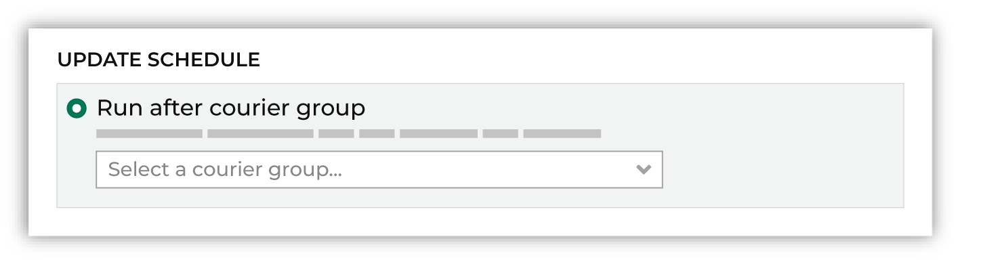
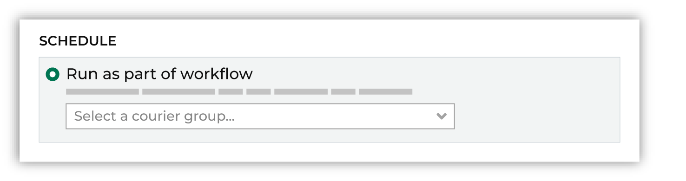

.. https://docs.amperity.com/operator/

.. meta::
    :description lang=en:
        Automate end-to-end workflows within Amperity.

.. meta::
    :content class=swiftype name=body data-type=text:
        Automate end-to-end workflows within Amperity.

.. meta::
    :content class=swiftype name=title data-type=string:
        Automate workflows

==================================================
Automate workflows
==================================================

.. include:: ../../shared/terms.rst
   :start-after: .. term-workflow-start
   :end-before: .. term-workflow-end

.. workflows-about-start

For example, many workflows are end-to-end process that:

#. Use a courier to pull data to Amperity.
#. Standardize data using semantic tags and feeds.
#. Add data to domain tables.
#. Build databases.
#. Run queries and segments to return results and audiences for use with downstream workflows.
#. Send results to destinations using orchestrations and campaigns.

An automated workflow is configured to run these steps automatically, and then send workflow alerts when warnings and errors within a workflow are detected.

.. workflows-about-end

.. _workflows-configure-scheduled:

Scheduled workflows
==================================================

.. workflows-configure-scheduled-start

A workflow can be configured to run at defined intervals, such as daily or weekly, and then can be configured to run specific couriers, bridges, and activations.

.. workflows-configure-scheduled-end

.. _workflows-configure-activate:

Activate
--------------------------------------------------

.. courier-groups-setting-activate-start

A courier group must be activated in order for it to run on an end-to-end schedule that pulls data to Amperity using couriers, syncs data using bridges, runs Stitch, refreshes databases, and then runs any orchestration, orchestration group, campaign, or profile API endpoint that is associated with the courier group.

A courier group that is deactivated may be run manually.

.. courier-groups-setting-activate-end

.. _workflows-configure-name:

Name
--------------------------------------------------

.. workflows-configure-name-start

Give the workflow a clear and succinct name that is meaningful. This name will appear in various locations, including other locations within the Amperity user interface, error messages related to the workflow, and potentially in downstream applications and workflows.

.. workflows-configure-name-end

.. _workflows-configure-schedule:

Schedule
--------------------------------------------------

.. include:: ../../shared/terms.rst
   :start-after: .. term-courier-group-schedule-start
   :end-before: .. term-courier-group-schedule-end

.. include:: ../../shared/terms.rst
   :start-after: .. term-cron-start
   :end-before: .. term-cron-end

.. include:: ../../shared/terms.rst
   :start-after: .. term-crontab-syntax-start
   :end-before: .. term-crontab-syntax-end

.. courier-groups-schedules-start

Amperity uses cron syntax to schedule the time at which a courier group is available for transferring files from a customer data source location to Amperity. A courier group that is scheduled runs automatically. Schedules are in UTC.

.. courier-groups-schedules-end

.. courier-groups-schedules-note-start

.. note:: Scheduling a courier group is optional. When a courier group is not assigned a schedule, it may be run manually on an ad hoc basis.

.. courier-groups-schedules-note-end

.. courier-groups-schedules-context-start

A courier group that is scheduled to run on a daily basis will check for files on a daily basis.

A courier group that runs less frequently, such as weekly, bi-weekly, monthly, or quarterly, will (by default) look for files on each day that has passed since the last time the courier group ran.

When a courier group is configured to run less frequently, you can also configure that courier group to only look for files on a specific day.

To use this approach, it is recommended to configure your upstream systems to make their files available to the courier group on a schedule that ensures they will be available to the courier group within a 24-hour window. This window is based on the schedule that is defined for the courier group.

Configure the courier group to run at the end of that 24-hour window, and then enable the **Only retrieve files dropped in the past day?** option, which forces the courier group to only look for files that were made available within the previous 24 hours.

.. courier-groups-schedules-context-end

.. courier-groups-schedules-tip-start

.. tip:: Daylight savings time can affect a schedule. Be sure to set the schedule to be stable and not require changes over time. For example: if a schedule is set to 12:30 AM, and then you fall back, the schedule may become 11:30 PM (fall back) or 1:30 AM (spring forward).

.. courier-groups-schedules-tip-end

.. _workflows-configure-alerts:

Alerts
--------------------------------------------------

.. workflows-configure-alerts-start

The following alerts can be configured:

#. A workflow succeeds.
#. A workflow's runtime has exceeded a configurable number of hours.

.. workflows-configure-alerts-end

.. _workflows-configure-run-type:

Run type
--------------------------------------------------

.. courier-groups-run-types-start

A courier group can be configured with any of the following run types:

**Full**
   A full workflow refreshes domain tables, runs Stitch, refreshes your customer 360 database, and then runs every activation that is configured to run as part of this courier group workflow.

**Refresh**
   A refresh workflow refreshes domain tables, runs Stitch, refreshes your customer 360 database, but does not run any activations.

   .. important:: Use partial workflows in sandboxes to ensure that data in your sandbox is not inadvertently sent to downstream destinations.

**Source**
   An source workflow refreshes domain tables, but does not run Stitch.

.. courier-groups-run-types-end

.. _workflows-couriers:

Couriers
==================================================

.. include:: ../../shared/terms.rst
   :start-after: .. term-courier-group-start
   :end-before: .. term-courier-group-end

.. note::

   .. include:: ../../amperity_reference/source/courier_groups.rst
      :start-after: .. courier-groups-context-start
      :end-before: .. courier-groups-context-end

.. _workflows-courier-group-duration-thresholds:

Duration thresholds
--------------------------------------------------

.. include:: ../../amperity_reference/source/courier_groups.rst
   :start-after: .. courier-groups-howto-notify-slow-start
   :end-before: .. courier-groups-howto-notify-slow-end

**To configure a workflow alert for a courier group**

.. include:: ../../amperity_reference/source/courier_groups.rst
   :start-after: .. courier-groups-howto-notify-slow-steps-start
   :end-before: .. courier-groups-howto-notify-slow-steps-end

.. _workflows-courier-group-missing-files:

Missing files
--------------------------------------------------

.. workflows-courier-group-missing-files-start

A courier group can be configured to send email and Slack alerts when files are missing, and then:

#. :ref:`Continue processing even if files are missing <workflows-courier-group-missing-files-notify-continue>`
#. :ref:`Stop processing <workflows-courier-group-missing-files-notify-stop>`

.. workflows-courier-group-missing-files-end

.. _workflows-courier-group-missing-files-notify-continue:

Notify and continue
++++++++++++++++++++++++++++++++++++++++++++++++++

.. include:: ../../amperity_reference/source/courier_groups.rst
   :start-after: .. courier-groups-howto-add-courier-alert-start
   :end-before: .. courier-groups-howto-add-courier-alert-end

.. include:: ../../amperity_reference/source/courier_groups.rst
   :start-after: .. courier-groups-howto-add-courier-alert-tip-start
   :end-before: .. courier-groups-howto-add-courier-alert-tip-end

**To send a workflow notification, and then continue the workflow**

.. include:: ../../amperity_reference/source/courier_groups.rst
   :start-after: .. courier-groups-howto-add-courier-alert-steps-start
   :end-before: .. courier-groups-howto-add-courier-alert-steps-end

.. _workflows-courier-group-missing-files-notify-stop:

Notify and stop
++++++++++++++++++++++++++++++++++++++++++++++++++

.. include:: ../../amperity_reference/source/courier_groups.rst
   :start-after: .. courier-groups-howto-add-courier-stop-start
   :end-before: .. courier-groups-howto-add-courier-stop-end

**To send a workflow notification, and then stop the workflow**

.. include:: ../../amperity_reference/source/courier_groups.rst
   :start-after: .. courier-groups-howto-add-courier-stop-steps-start
   :end-before: .. courier-groups-howto-add-courier-stop-steps-end

.. _workflows-courier-group-missing-files-wait:

Wait for missing files
++++++++++++++++++++++++++++++++++++++++++++++++++

.. include:: ../../amperity_reference/source/courier_groups.rst
   :start-after: .. courier-groups-wait-for-missing-files-start
   :end-before: .. courier-groups-wait-for-missing-files-end

.. include:: ../../amperity_reference/source/courier_groups.rst
   :start-after: .. courier-groups-source-courier-alerts-start
   :end-before: .. courier-groups-source-courier-alerts-end

.. _workflows-bridges:

Bridges
==================================================

.. workflows-bridges-start

A bridge may be configured to run as part of a scheduled workflow. Use the **Bridges** tab in the **Scheduled workflows** dialog to add one or more bridges.

.. workflows-bridges-end

.. _workflows-activations:

Activations
==================================================

Activations are orchestrations, campaigns, and Profile API indexes that are configured to be run as part of a scheduled workflow.

.. _workflows-orchestrations:

Orchestrations
--------------------------------------------------

.. TODO: Set this to be an include.

.. orchestrations-run-automatic-start

An orchestration can be configured to run after a courier when the run mode is set to **Automatic** and an active courier group is selected from the drop-down menu.

.. image:: ../../images/mockup-activation-scheduled-orchestration.png
   :width: 420 px
   :alt: Add an orchestration to a scheduled workgroup.
   :align: center
   :class: no-scaled-link

.. orchestrations-run-automatic-start

.. _workflows-profile-api:

Profile API indexes
--------------------------------------------------

.. TODO: Set this to be an include.

.. profile-api-enable-run-as-workflow-start

A Profile API index can be configured to be refreshed as part of a scheduled workflow when the schedule is set to **Run after courier group** and an active courier group is selected from the drop-down menu.

.. profile-api-enable-run-as-workflow-end

.. _workflows-campaigns:

Recurring campaigns
--------------------------------------------------

.. TODO: Set this to be an include.

.. campaigns-run-as-part-of-workflow-start

A recurring campaign can be configured to run as part of a scheduled workflow when the schedule is set to **Run as part of workflow** and an active courier group is selected from the drop-down menu.

.. campaigns-run-as-part-of-workflow-end
