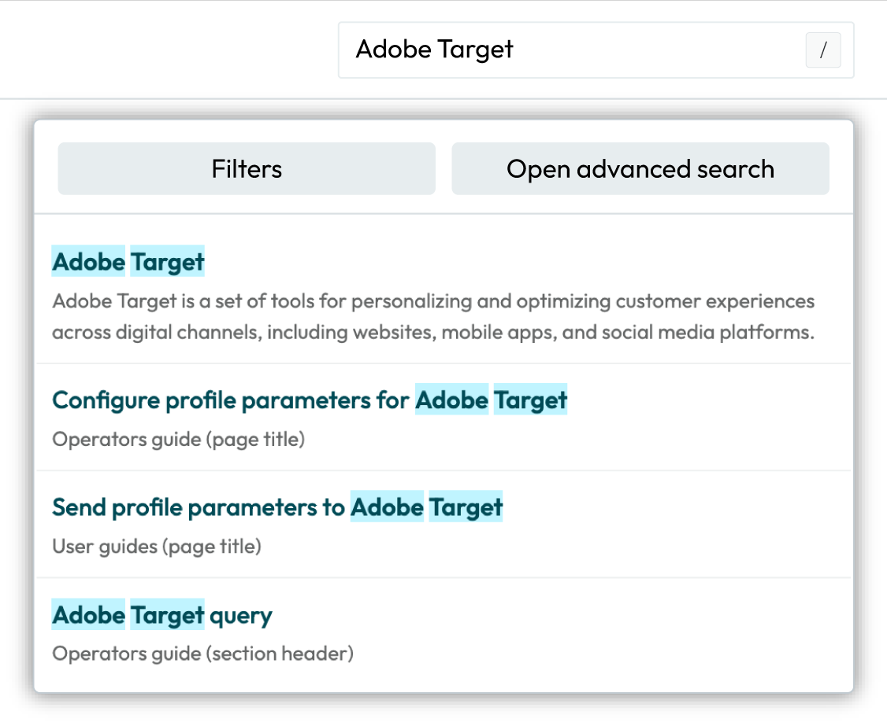
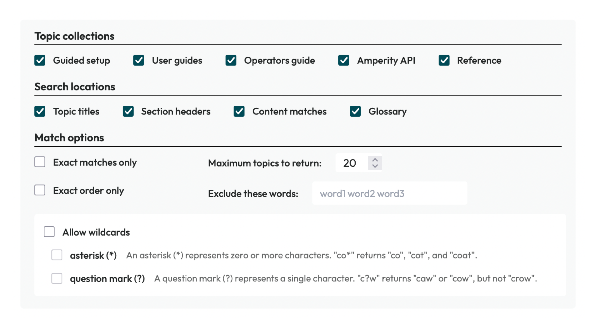

.. https://docs.amperity.com/reference/

==================================================
Search the docs
==================================================

.. .. search-navigation-start

There are three ways to search for information on the Amperity docs site:

#. :ref:`Search from navigation <search-navigation>`
#. :ref:`Open advanced search <search-advanced>`
#. Use the :ref:`COMMAND + F keyboard combination <search-command-f>` on a page to search directly

.. search-navigation-end

.. _search-navigation:

Search from navigation
==================================================

.. search-navigation-start

Navigation search is pinned at the top of every page in the Amperity docs site.

**To use navigation search**

#. Select the search bar in the top navigation of the Amperity docs site.

   .. tip:: Use the forward slash key (/) on your keyboard to move the cursor directly to the navigation search box.

#. Start typing a search term. Amperity search is not case sensitive.

   Matching results are shown as you type and are updated as the search term changes.

   Results are prioritized by page title, then section header, and then content matches within sections.

   When a glossary entry exactly matches the search term the glossary entry is shown as the first search result.

.. note:: If you don't quickly find what you are looking for:

   #. Filter by :ref:`topic collection <search-advanced-filters-collections>`. All topic collections are selected by default. Deselect one or more topic collections to narrow your search.

   #. Open :ref:`advanced search <search-advanced>` for additional filter options.

.. search-navigation-end

.. _search-advanced:

Advanced search
==================================================

.. search-advanced-start

Advanced search works the same as navigation search, but provides additional filtering options to help you narrow down search results.

Access advanced search from the navigation bar by clicking the filter icon to the right of the navigation search box *or* after using navigation search click the **Open advanced search** button.

Start typing a search term. Amperity search is not case sensitive.

.. search-advanced-end

.. _search-advanced-filters:

Advanced search filters
--------------------------------------------------

.. search-advanced-filters-start

Advanced search provides additional filters for returning more precise search results. Access filters from the **Filters** menu.

Filter options include:

* Topic collections
* Sections within topics
* Exact matches
* Exact word order
* Setting the maximum number of topics to show
* Excluding words
* Allowing the use of wildcards

Single words, complete names, and multiword searches set to match exactly often work best. For example: **Adobe**, **Adobe Target**, and **Adobe Target** (set to **Exact matches only**) return different numbers of results.

.. tip:: Avoid phrases or questions, such as **How to configure ...?** or "Where is the customer 360 database?".

.. tip:: Use the **Exact matches only** and **Exact order only** options instead of quotation marks within the search term.

Matching results are shown as you type and are prioritized by topic title, then section header, and then content matches within sections. When a glossary term matches exactly the term is shown as the first search result.

.. search-advanced-filters-end

.. _search-advanced-filters-collections:

Topic collections
++++++++++++++++++++++++++++++++++++++++++++++++++

.. search-advanced-filters-collections-start

Use the **Topic collections** filter to choose which topic collections to include in search results. All topic collections begin selected by default. As you filter, at least one topic collection must be selected to return any results. 

Amperity documentation has the following topic collections:

* **Guided setup**

  A series of guided workflows for configuring identity resolution and customer profiles.

* **User guides**

  A series of topics for the marketer for using audiences, campaigns, journeys, and activations along with common use cases like churn prevention, offline events, one-time buyers, paid media, and people-based measurement.

  A series of topics for the analyst, including Presto SQL and using queries to build audiences and shape data before sending that data to downstream use cases using orchestrations.

* **Operators Guide**

  A series of topics about how to configure, analyze, and maintain your Amperity tenant. Topics include configuring connections, managing customer profiles, maintaining your tenant, enabling privacy rights workflows, enabling predictive models, configuring Stitch, and using sandboxes to safely make changes to your production tenant.

* **Amperity API**

  A collection of endpoints that enable programmatic access to your Amperity tenant, including production and sandbox.

* **Reference**

  A complete reference of everything that is in Amperity, arranged alphabetically with coverage from A to Z.

.. search-advanced-filters-collections-end

.. _search-advanced-filters-locations:

Search locations
++++++++++++++++++++++++++++++++++++++++++++++++++

.. search-advanced-filters-locations-start

Use the **Search locations** filter to include or exclude headers within topics that are assigned a level two, level three, or level four header.

.. note:: Level two, three, and four headers are visible in the right-side navigation pane under **ON THIS PAGE** in all topics. The topic title is the first entry, after which all other visible links are level two, three, or four headers.

.. search-advanced-filters-locations-end

.. _search-advanced-filters-exact-match:

Exact matches only
++++++++++++++++++++++++++++++++++++++++++++++++++

.. search-advanced-filters-exact-match-start

Use the **Exact matches only** filter to limit search results to topics that match the search term exactly.

.. search-advanced-filters-exact-match-end

.. _search-advanced-filters-exact-order:

Exact order only
++++++++++++++++++++++++++++++++++++++++++++++++++

.. search-advanced-filters-exact-order-start

Use the **Exact order only** filter to limit search results to topics in which a string matches the exact order as the search term.

For example, a search term of ``silon tar`` set to **Exact order only** will return topics about Epsilon Targeting.

.. search-advanced-filters-exact-order-end

.. _search-advanced-filters-maximum-topics:

Maximum topics to return
++++++++++++++++++++++++++++++++++++++++++++++++++

.. search-advanced-filters-maximum-topics-start

Use the **Maximum topics to return** filter to increase or decrease the number of topics shown in search results. The minimum number of topics is 1. The maximum number of topics is 100. The default is 20.

.. search-advanced-filters-maximum-topics-end

.. _search-advanced-filters-exclude:

Exclude these words
++++++++++++++++++++++++++++++++++++++++++++++++++

.. search-advanced-filters-exclude-start

Use the **Exclude these words** filter to exclude words that match strings defined in that field. Do not use commas to separate these words.

For example: "targ" will exclude from search results "target", "targeted", and "targeting".

.. search-advanced-filters-exclude-end

.. _search-advanced-filters-wildcards:

Allow wildcards
++++++++++++++++++++++++++++++++++++++++++++++++++

.. search-advanced-filters-wildcards-start

Use the **Allow wildcards** filter to enable the use of asterisks and question marks as wildcards. Each wildcard may be enabled or disabled.

* An asterisk (*) represents zero or more characters. "co*" returns "co", "cot", and "coat".
* A question mark (?) represents a single character. "c?w" returns "caw" or "cow", but not "crow".

Both wildcards can be enabled and used in the same search term. For example: ``E*n Ad??e`` will return topics about Experian, Epsilon, and Adobe.

.. important:: The search box does not support wildcards unless this option is enabled.

.. search-advanced-filters-wildcards-end

.. _search-command-f:

COMMAND + F
==================================================

.. search-command-f-start

Press the **COMMAND** + **F** keys simultaneously on your keyboard to open your browser's in-page search functionality.

In the box that appears type the search term you want to find, and then use the up or down arrows to move through the topic.

This is a good way to find the specific locations on a page with the search term you are trying to find.

.. search-command-f-end
