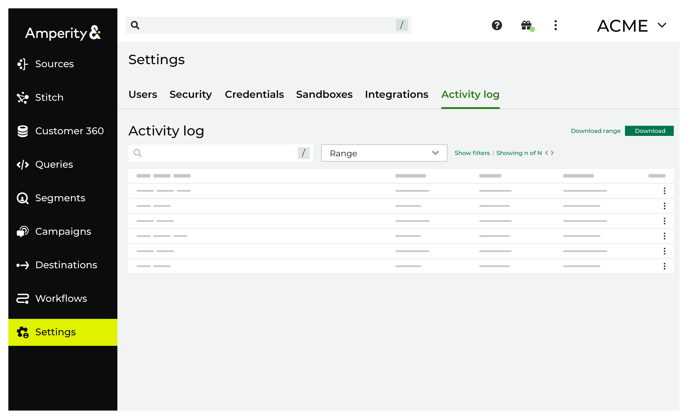

.. https://docs.amperity.com/reference/

.. meta::
    :description lang=en:
        Activity logs keep track of user activity that leads to configuration changes.

.. meta::
    :content class=swiftype name=body data-type=text:
        Activity logs keep track of user activity that leads to configuration changes.

.. meta::
    :content class=swiftype name=title data-type=string:
        Activity logs

==================================================
About activity logs
==================================================

.. settings-user-activity-logs-about-start

Amperity maintains records of user activity that occured in your tenant. For example:

* A user makes a configuration change to the Amperity platform
* A user creates a sandbox
* A user views personally identifiable information (PII)
* A workflow was stopped by a user
* A user configured a destination
* A user created an API key
* A user was assigned to a resource group

.. settings-user-activity-logs-about-end

.. settings-user-activity-logs-start

All activity may be :ref:`downloaded <settings-user-activity-logs-download>` to a CSV file and individual event, user, and object IDs may be copied.

.. important:: Activity logs are retained for audit and compliance purposes and cannot be deleted.

.. note:: The **Users** section of the **Users and Activity** page requires the user to be assigned the **Allow user administration** policy option.

.. settings-user-activity-logs-end

.. settings-user-activity-logs-list-start

The activity list displays the following columns:

* **Date** The date and time of the action (displayed in your local time-zone).
* **User** The user who took the action. For most users, this is that user's friendly name or email address.

  An auth token is displayed for users that accesses Amperity programatically.
* **Action** The action taken in the application. Generally this takes the form of "action type/action". For example, activating a segment appears as "segment/activate" and running a segment for download appears as "query.exec/download".

  .. note:: A few actions in the list are not user-initiated. For example, when a user is granted a new authorization policy, both the grant and the receipt appear on separate rows.
* **Object** The object against which the action occurred.

  For example, if a user ran a segment, that segment's name is displayed. If a user sent a segment to a destination, both the name of the segment and the destination name will be displayed. If the user was the recipient of a new authorization policy, the policy name will be displayed.

.. settings-user-activity-logs-list-end

.. _settings-user-activity-logs-download:

Download user activity
==================================================

.. settings-user-activity-logs-download-start

The Amperity user interface shows the most recent 1000 user activity events. You can download a CSV file that contains events for any date range for which user events are available.

.. settings-user-activity-logs-download-end

**To download user activity**

.. settings-user-activity-logs-download-steps-start

#. From the ellipses menu in the top right, click **Settings**, and then select **Activity log**.
#. Under **Activity** click **Download**.
#. A CSV file named **events-yyyy-mm-dd-timestamp.csv** is downloaded.

.. settings-user-activity-logs-download-steps-end

**Column names in the user activity CSV file**

.. settings-user-activity-logs-download-column-names-start

The first row of the user activity file contains the following column headers, and then a row for each tracked event:

.. list-table::
   :widths: 35 65
   :header-rows: 1

   * - column name
     - Description

   * - **event-id**
     - The Amperity internal identifier for the event. This can be used to request additional information about the event, if needed.

   * - **event-type**
     - The :ref:`type of event <settings-user-activity-logs-event-types>`.

       This value is also available from the **Action** column under **Users** on the **Users and Activity** page.

   * - **external-id**
     - Internal value only; this value will be NULL in downloaded log files.

   * - **happened-at**
     - The date and time at which the action occurred. Dates and times are in |ext_iso_8601| format and in UTC.

       This value is also available from the **Date** column under **Users** on the **Users and Activity** page.

       .. note:: The downloaded date and time are in GMT; the Amperity user interface shows the date and time in your local timezone.

   * - **object**
     - The identifier for the object against which the action occurred.

   * - **object-name**
     - A composed string that describes the objects for which the action occurred.

       This value is also available from the **Object** column under **Users** on the **Users and Activity** page.

   * - **origin-ip**
     - The IP address that is associated with the user who initiated the action.

   * - **principal-email**
     - The email address for the user who initiated the action.

       This value may be NULL when the user is an API key.

   * - **principal-id**
     - The identifier for the user who initiated the action. This user may be an API key or a non-human user.

   * - **principal-name**
     - The friendly name of the user associated with the activity, if available, otherwise the email address or API key.

       This value is also available from the **User** column under **Users** on the **Users and Activity** page.

   * - **recorded-at**
     - The time at which the system recorded the action. May be slightly different than the value of **happened-at** due to the asynchronous nature of Amperity.

   * - **source**
     - The component within Amperity that added the log entry.

.. settings-user-activity-logs-download-column-names-end

.. _settings-user-activity-logs-event-types:

User activity event types
==================================================

.. settings-user-activity-logs-event-types-start

The following table lists the most common event types, grouped by the component or area within Amperity that is most closely associated with the event type.

.. note:: Many events are prefixed with a dot-delimited string that typically starts with "amperity". The specific event is located after a slash ("/"). The following table lists the events by the strings immediately before and after the slash.

   For example, the following event:

   **:amperity.plugin.destination/created**

   is shown in the following table as:

   **destination/created**

   If your tenant shows an event that is not listed in this table, its purpose can often be inferred by the string and the event after the trailing slash. You may open a support ticket to request more information about an event that is not shown in this table. Ask your Amperity support representative for more information about the event, and then request also that this reference be updated.

.. list-table::
   :widths: 35 65
   :header-rows: 1

   * - Event grouping
     - Description

   * - **AI Assistant**
     - The following events are associated with the AI Assistant:

       ``assistant/send-user-message``
          A user sent a question to the AI Assistant. The audit event may include the response from the AI assistant.

       ``query.exec/sampled``
          A set of sample data was provided to the AI Assistant.

          .. note:: More detail about AI Assistant data sharing policies, how the model stores data, and what types of data is sent (or not sent), is available from the |ext_amperity_assistant_privacy_faq|.

   * - **API keys**
     - The following events are associated with API keys:

       ``api-key/created``
          An API key was created.

       ``api-key/deleted``
          An API key was deleted.

       ``api-key/issue``
          An API token issuer was created.

          .. note:: This event is always associated with the following events:

             ``policy/attached``

             and

             ``policy/attached-to``

       ``api-key/updated``
          An API key was updated.

   * - **BI Connect**
     - The following events are associated with BI Connect:

       ``warehouse/user-added``
          A user was added to BI Connect.

       ``warehouse/user-removed``
          A user was removed from BI Connect.

       ``warehouse/user-renewed``
          A user was allowed to continue accessing BI Connect.

   * - **Credentials**
     - The following events are associated with credentials:

       ``credential/created``
          A credential was created.

       ``credential/deleted``
          A credential was deleted.

       ``credential/updated``
          A credential was updated.

   * - **Destinations**
     - The following events are associated with destinations:

       ``destination/cloned``
          A user created a destination by copying an existing destination.

       ``destination/created``
          A user created a destination.

       ``destination/deleted``
          A user deleted a destination.

       ``destination/updated``
          A user updated a destination.

   * - **Domain tables**
     - The following events are associated with domain tables:

       ``workflow/domain-data-records-deletion-started``
          A user deleted records from a domain table.

   * - **Orchestrations**
     - The following events are associated with orchestrations and orchestration groups:

       ``orchestration/run``
          A user initiated a manual run for an orchestration.

       ``orchestration.group/run``
          A user initiated a manual run for an orchestration group.

   * - **Policies**
     - The following events are associated with policies:

       ``policy/attached`` and ``policy/attached-to``
          A policy was was attached to an object that was created within Amperity.

          For example, when a new API token issuer is created, the ``policy/attached`` and ``policy/attached-to`` events are logged and are associated with the name of the API issuer token.

       ``policy/created``
          A policy was created.

       ``policy/deleted``
          A policy was created.

       ``policy/detached`` and ``policy/detached-from``
          A policy was was detached from an object that exists within Amperity.

       ``policy/updated``
          A policy was updated.

       .. important:: Occasionally members of your Amperity team will access your tenant. This is always done as a full administrator.

          In situations where they are helping to troubleshoot an issue, answer a question with more detail, and so on, they will often switch their view to match the policy settings associated with your tenant.

          For example, if the view is switched to "DataGrid Operator", that action is logged using the following event type:

          ``amperity.auth.token/user-switched-policies``

   * - **Privacy rights**
     - The following events are associated with privacy rights workflows:

       ``workflow/domain-ccpa-deletion-started``
          The CCPA delete workflow has started.

   * - **Queries**
     - The following events are associated with the **Queries** page:

       ``query/activated``
          A query was activated.

       ``query/created``
          A query was created.

       ``query/deleted``
          A query was deleted.

       ``query/moved``
          A query was moved from one folder into another.

       ``query.draft/discarded``
          A query in a draft state was discarded.

       ``query.folder/created``
          A folder on the **Queries** page was created.

       ``query.folder/deleted``
          A folder on the **Queries** page was deleted.

   * - **Resource groups**
     - The following events are associated with resource groups:

       ``resource-group/assigned``
          A user was assigned to a resource group.

       ``resource-group/created``
          A resource group was created.

       ``resource-group/deleted``
          A resource group was deleted.

       ``resource-group/updated``
          A resource group was updated.

   * - **Sandboxes**
     - The following events are associated with sandboxes:

       ``tenant/created``
          A sandbox was created.

       ``tenant/deleted``
          A sandbox was deleted.

       ``tenant/updated``
          A sandbox was updated.

       .. note:: These events appear within the sandbox and are followed by the ``policy/attached-to`` and ``policy/attached`` events to allow the user who created the sandbox to access the sandbox as a **DataGrid Administrator**.

   * - **Single Sign-on**
     - The following events are associated with single sign-on (SSO):

       ``group-mapping/created``
          An SSO group mapping was created.

       ``group-mapping/deleted``
          An SSO group mapping was deleted.

       ``group-mapping/updated``
          An SSO group mapping was updated.

   * - **User activity**
     - The following events are associated with the the **Users** section within the **Users and Activity** page:

       ``audit.user-activity/download``
          A user downloaded user activity into a CSV file to view offline.

   * - **Users**
     - The following events are associated with Amperity user accounts that are managed from the **Users and Activity** page:

       ``user/created``
          A user was created.

       ``user/deleted``
          A user was deleted.

       ``user/sent-password-reset-email``
          A user was sent an email to they can reset their password.

   * - **Workflow alerts**
     - The following events are associated with workflow alerts:

       ``audience/created``
          An audience for a workflow alert was created.

          .. note:: This event shows *only* the first time an email addresss or Slack channel is configured to receive workflow alerts for courier groups, scheduled orchestration groups, or campaigns. All subsequent events related to workflow alerts shows the ``audience/updated`` event.

       ``audience/updated``
          The membership of an audience for a workflow alert was updated. This includes adding or removing email addresses and/or Slack channels to or from a workflow alert.

   * - **Workflows**
     - The following events are associated with workflows:

       ``workflow/cancel``
          A workflow resolution was stopped by a user.

       ``workflow/retry``
          A workflow resolution was opened, after which a specific resolution option was selected, and then the workflow was retried.

       ``workflow/skip``
          A user opened a workflow resolution, and then skipped the task that caused the workflow failure.

.. settings-user-activity-logs-event-types-end
