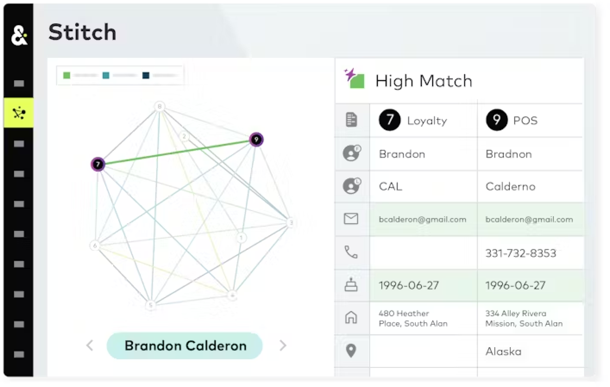
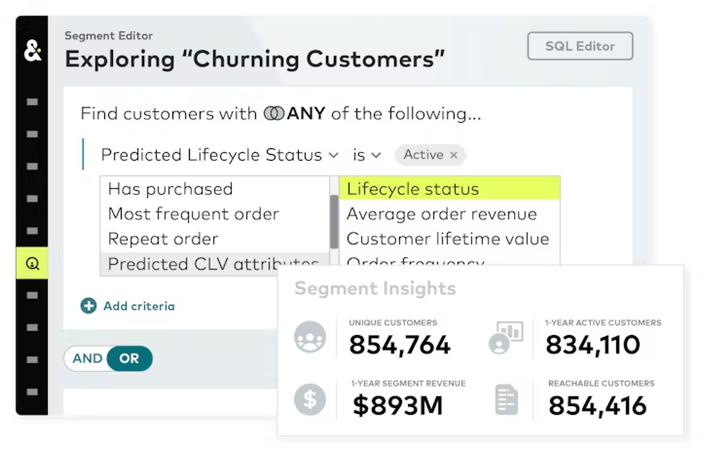

.. 
.. https://docs.amperity.com/reference/
.. 

.. meta::
    :description lang=en:
        AmpAi provides marketers, analysts, and data engineers with an AI-powered toolkit for smarter decision-making.

.. meta::
    :content class=swiftype name=body data-type=text:
        AmpAi provides marketers, analysts, and data engineers with an AI-powered toolkit for smarter decision-making.

.. meta::
    :content class=swiftype name=title data-type=string:
        AmpAi

==================================================
AmpAi
==================================================

.. ampai-overview-start

AmpAi provides marketers, analysts, and data engineers with an AI-powered toolkit for smarter decision-making.

.. ampai-overview-end

.. note:: Talk with your Amperity representative to learn more about how your brand can enable AmpAi for use across your tenant.

.. _ampai-stitch:

Stitch
==================================================

.. include:: ../../shared/terms.rst
   :start-after: .. term-stitch-start
   :end-before: .. term-stitch-end

.. ampai-stitch-start

Stitch builds high-quality customer profiles for use with all of your brand's marketing use cases.

* Ingest, clean, and normalize data with AI that learns how to group data the way you need it.
* Connect the customer journey even when contact information, households, or channels change.
* Learn why and how Stitch merged your customer data into a unified profile.

.. ampai-stitch-end

.. _ampai-assist:

Assist
==================================================

.. include:: ../../amperity_reference/source/assistant.rst
   :start-after: .. assistant-overview-start
   :end-before: .. assistant-overview-end

.. image:: ../../images/ampai-assist.png
   :width: 500 px
   :alt: Assist
   :align: left
   :class: no-scaled-link

.. include:: ../../amperity_reference/source/assistant.rst
   :start-after: .. assistant-usecases-start
   :end-before: .. assistant-usecases-end

.. _ampai-predict:

Predict
==================================================

.. include:: ../../shared/terms.rst
   :start-after: .. term-predictive-models-start
   :end-before: .. term-predictive-models-end

.. ampai-predict-start

Unlock hidden revenue, acquire new customers, increase conversion rates, improve customer lifetime value, and retain more revenue.

* Build high-value lookalike audiences using your best customers as seed data.
* Use event propensity scoring to help move your customers through the funnel.
* Identify high-value customers using scores that predict customer lifetime value.
* Identify customers who are cooling down and at risk of churn.

.. ampai-predict-end
