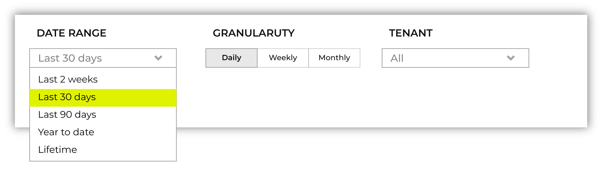
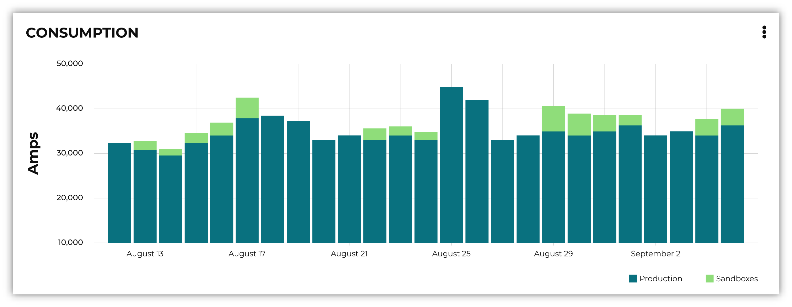
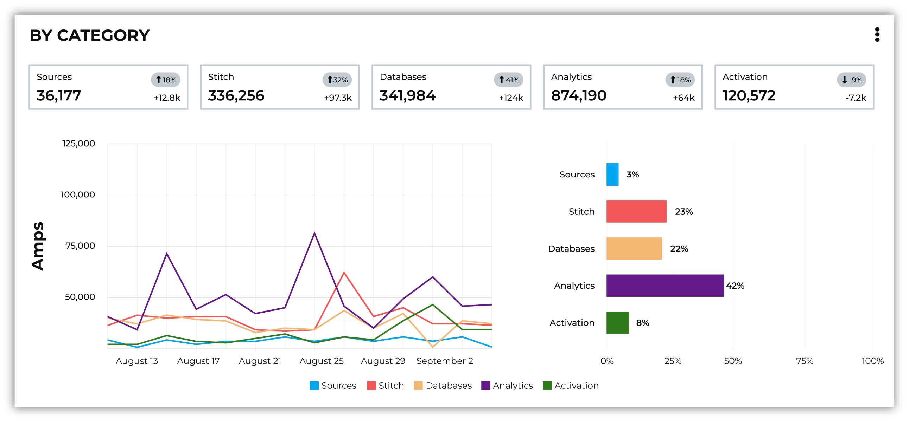
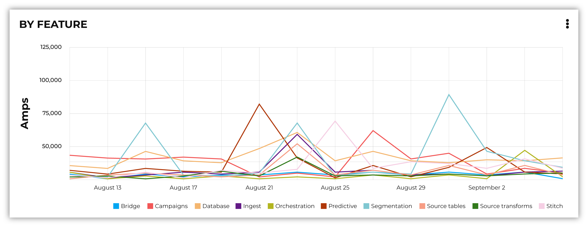

.. https://docs.amperity.com/reference/

.. meta::
    :description lang=en:
        Amps are a normalized unit that measure total consumption across categories and features within the Amperity platform.

.. meta::
    :content class=swiftype name=body data-type=text:
        Amps are a normalized unit that measure total consumption across categories and features within the Amperity platform.

.. meta::
    :content class=swiftype name=title data-type=string:
        Amps consumption

==================================================
About Amps consumption
==================================================

.. amps-consumption-start

Consumption is measured in Amps and Storage (TB). Amps consumption is measured across your entire production and sandbox environments. Actions such as running workflows and querying data will consume Amps. Amps consumption is assigned to the day on which consumption started. Monitor your Amps and Storage (TB) consumption in the :ref:`amps-review-consumption-dashboard`.

.. amps-consumption-end

.. _amps-consumption-overview:

Consumption overview
==================================================

.. amps-review-consumption-start

Consumption is measured in Amps and Storage (TB).
Amps measure the amount of compute resources that are used within the Amperity platform, such as running workflows or sending campaigns.
The storage that is required to support those compute resources is measured in terabytes (TB).

Some examples of consumption drivers are:

* The amount of data that is processed.
* The amount of data that is stored.
* The complexity of operations, such as complex SQL join operations, and the memory that is required to complete those operations.
* The amount of time it takes to run a workflow.
* The size of the compute resources that are available in your tenant.

.. amps-review-consumption-end

.. _amps-review-consumption-compute:

Amps consumption
--------------------------------------------------

.. amps-review-consumption-compute-start

Some features consume more Amps than others. Compute-intensive features, such as running Spark SQL and Presto SQL queries, processing data, and algorithms, such as Stitch or predictive models, will consume Amps at a higher rate. Compute includes actions like loading data, querying data, running databases, refreshing predictive models, and running Stitch. Consumption of Amps based on compute depends on the features that are in use, the frequency at which they are run, and the amount of time it takes for the process to finish. Compute consumption can vary from day to day.

The following features have configurable compute settings:

* Ingest
* Source transforms
* Stitch
* Stitch reports
* Databases
* Spark SQL queries

Your brand can explicitly set the compute sizes for these tasks in your workflows. Changes to compute settings will affect Amps consumption. Contact your Amperity representative with questions around how to best configure compute resource sizing within your tenant.

.. amps-review-consumption-compute-end

.. _amps-review-consumption-storage:

Storage consumption
--------------------------------------------------

.. amps-review-consumption-storage-start

The rate at which source tables consume Amps is a combination of how much data is being loaded to Amperity and the file type for that data. For example, a large CSV file consumes more Amps than an Apache Parquet file when both tables contain similar record counts.

More data--more rows, more fields, more complete data--will drive Amps consumption. Source tables that are transformed in Amperity prior to Stitch will consume Amps based on the complexity of Spark SQL that is used to perform the transformation.

Storage is typically stable after the implementation period has completed. Storage (by itself) typically consumes Amps at a lower rate when compared to running workflows and processing data.

.. note:: Storage is not a significant driver of Amps consumption and should be a small percentage (<5%) of overall Amps consumption.

.. important:: A sandbox is a replica of your production environment. It starts as an exact duplicate of the configuration of your production tenant at the time it is created. It starts with access to the same data that is stored in your production tenant. If new data is ingested into the sandbox, added storage increases your Amps consumption.

.. amps-review-consumption-storage-end

.. _amps-review-consumption-dashboard:

Consumption dashboard
--------------------------------------------------

.. amps-review-consumption-dashboard-start

The Amps consumption dashboard shows your brand's total Amps and storage (TB) consumption across configurable time periods along with a breakdown of Amps consumption by category and by feature.

You can access the **Amps** dashboard from the |fa-kebab| menu that is located in the top-level navigation next to the name of your Amperity tenant.

.. note:: The dashboard may exclude up to 24 hours of data, to allow time for data processing and validation.

.. amps-review-consumption-dashboard-end

.. _amps-review-consumption-dashboard-summary:

Current contract
++++++++++++++++++++++++++++++++++++++++++++++++++

.. amps-review-consumption-dashboard-summary-start

The **Current contract** section shows the state of the tenant for the current contract period. It displays the following information:

#. Capacity consumed against the total capacity purchased
#. Time remaining in the current contract period
#. Overall Amps vs storage (TB) breakdown
#. Consumption broken down by environment

.. amps-review-consumption-dashboard-summary-end

.. _amps-review-consumption-dashboard-breakdown:

Consumption breakdown
++++++++++++++++++++++++++++++++++++++++++++++++++

.. amps-review-consumption-dashboard-breakdown-start

The **Consumption breakdown** section shows Amps consumption by category and by feature. You can choose to view the dashboared for Amps or Storage (TB) in the filter bar. You can also filter by time period, view Amps at daily, weekly, or monthly scales, and filter by production tenant or by sandbox.

The **Consumption breakdown** can be filtered by date range, by tenant type, shown daily, weekly, or monthly.

Each option is set independently:

* Use the **Date range** dropdown to select one of the following values: **Last 2 weeks**, **Last 30 days**, **Last 90 days**, **Year to date**, **Current contract period**, or **Lifetime**.
* Use the **Granularity** field to set the granularity of the charts shown for Amps consumption. Choose one of **Daily**, **Weekly**, or **Monthly**.
* Use the **Type** field to set the unit of information that the dashboard displays. Choose one of **Amps** or **Storage (TB)**.
* Use the **Category** dropdown to view the dashboard for a selected product category. Choose one of **All**, **Sources**, **Stitch**, **Databases**, **Analytics**, or **Activation**.
* Use the **Environment** field to view the dashboard for all tenants, only your production tenant, only sandboxes, or a specific sandbox. Choose one of **All**, **Production**, or **Sandbox**.

For example, set the date range to "Last 90 days", and then choose "weekly" and "sandboxes" to view Amps consumption for all sandboxes during the last 90 days, with consumption shown by week.

.. amps-review-consumption-dashboard-breakdown-end

.. _amps-review-consumption-dashboard-default:

Default view
^^^^^^^^^^^^^^^^^^^^^^^^^^^^^^^^^^^^^^^^^^^^^^^^^^

.. amps-review-consumption-dashboard-default-start

The default view shows total Amps, including your production tenant and all sandboxes. Filters are applied to all categories and features within the **Consumption breakdown** section.

.. amps-review-consumption-dashboard-default-end

.. _amps-review-consumption-dashboard-category:

By category
^^^^^^^^^^^^^^^^^^^^^^^^^^^^^^^^^^^^^^^^^^^^^^^^^^

.. amps-review-consumption-dashboard-category-start

Consumption breakdown by category shows which category--Sources, Stitch, Databases, Analytics, or Activation--has changed the most between the current and previous time periods, along with the distribution of Amps consumption within the current time period.

.. amps-review-consumption-dashboard-category-end

.. _amps-review-consumption-dashboard-feature:

By feature
^^^^^^^^^^^^^^^^^^^^^^^^^^^^^^^^^^^^^^^^^^^^^^^^^^

.. amps-review-consumption-dashboard-feature-start

Consumption breakdown by category shows which feature--BI Connect, Bridge, Campaigns, Databases, Ingest, Orchestrations, Predictive modeling, Profile API, Segmentation, Source Tables, Source Transforms, or Stitch--has changed the most between the current and previous time periods, along with the distribution of Amps consumption within the current time period.

.. amps-review-consumption-dashboard-feature-end

.. _amps-consumption-categories:

Consumption categories
--------------------------------------------------

.. amps-consumption-categories-start

Amps and storage (TB) consumption is tracked in 5 categories--Sources, Stitch, Databases, Analytics, and Activation--and is further broken down into product features.

.. list-table::
   :widths: 30 70
   :header-rows: 1

   * - Category
     - Feature areas

   * - **Activation**
     - Building audiences for campaigns

       Building audiences for journeys

       Building audiences for orchestrations

       Sending data to cloud storage

       Sending data to managed connectors

       Profile API

   * - **Analytics**
     - BI Connect

       Predictive modeling

       Queries

       Segments

       Spark SQL sessions

   * - **Databases**
     - Databases

   * - **Sources**
     - Amperity Bridge

       Ingest

       Tables

       Transformations

   * - **Stitch**
     - Stitch

       Stitch Report

.. amps-consumption-categories-end

.. _amps-consumption-features:

Consumption by feature
--------------------------------------------------

.. amps-consumption-features-start

This section describes each feature in-depth, and what actions you can take to influence your Amps and storage consumption. It includes information on what specifically drives consumption in that area, and areas of the product where you can monitor your tenant's Amps consumption by feature.

.. amps-consumption-features-end

.. _amps-consumption-features-sources:

Sources features
++++++++++++++++++++++++++++++++++++++++++++++++++

.. amps-consumption-features-sources-start

Sources features include the following Amps categories:

* :ref:`Bridge <amps-consumption-feature-bridge>`
* :ref:`Ingest <amps-consumption-feature-ingest>`
* :ref:`Tables <amps-consumption-feature-source-tables>`
* :ref:`Transformations <amps-consumption-feature-source-transforms>`

.. amps-consumption-features-sources-end

.. _amps-consumption-feature-bridge:

Bridge
^^^^^^^^^^^^^^^^^^^^^^^^^^^^^^^^^^^^^^^^^^^^^^^^^^

.. amps-consumption-feature-bridge-start

Amps consumption for the **Amperity Bridge** feature is determined by:

* The volume of data that is synced with Amperity
* The amount of time required for each sync data and process views
* The frequency of syncs

Monitor Amps consumption for the **Amperity Bridge** feature by:

* Reviewing the aggregate number of records ingested from the **Usage** page
* Monitoring sync times from the **Workflows** page
* Verifying the number of times data has been synced from the **Workflows** page

.. amps-consumption-feature-bridge-end

.. _amps-consumption-feature-ingest:

Ingest
^^^^^^^^^^^^^^^^^^^^^^^^^^^^^^^^^^^^^^^^^^^^^^^^^^

.. amps-consumption-feature-ingest-start

Amps consumption for the **Ingest** feature is determined by:

* The frequency at which data is loaded to Amperity
* The amount of time it takes to ingest data.

  Time affects Amps consumption more than volume or frequency because large file formats take longer to load than partitioned files of the same size.

* The use of ingest queries that preprocess data prior to ingest

Storage for the **Ingest** feature is determined by:
* The volume of data that is loaded to Amperity

Monitor consumption for the **Ingest** feature by:

* Monitoring the aggregate number of records ingested from the **Usage** page
* Monitoring ingest runtimes from the **Workflows** page
* Preferring file formats that are partitioned, such as Apache Parquet, over file formats that are not, such as CSV
* Using Amperity Bridge to sync large volumes of data instead of loading that same volume as a flat file
* Review ingest queries to help ensure they are simple and efficient; complex or inefficient SQL within an ingest query increases Amps consumption
* Configuring courier groups to ingest files only when necessary; for example, some files must be ingested daily, but others might only need to be ingested weekly or monthly

.. amps-consumption-feature-ingest-end

.. _amps-consumption-feature-source-tables:

Tables
^^^^^^^^^^^^^^^^^^^^^^^^^^^^^^^^^^^^^^^^^^^^^^^^^^

.. amps-consumption-feature-source-tables-start

Amps consumption for the **Source tables** feature is determined by:

* The amount of data stored in source tables and the outputs of source transforms
* The number if fields in source tables
* The density of records in source tables

Monitor Amps consumption for the **Source tables** feature by:

* Monitoring the total number of records from the **Sources** page
* Reviewing the number of records that are ingested per day from the **Usage** page

.. amps-consumption-feature-source-tables-end

.. _amps-consumption-feature-source-transforms:

Transformations
^^^^^^^^^^^^^^^^^^^^^^^^^^^^^^^^^^^^^^^^^^^^^^^^^^

.. amps-consumption-feature-source-transforms-start

Amps consumption for the **Transformations** feature is determined by:

* The frequency at which transformations are run
* The volume of data that is processed for transformations
* Complex SQL in transformations may cause longer runtimes
* Changes to transformations runtimes often cause variable Amps consumption
* Larger compute resources

.. note:: Transformations are also referred to as "custom domain tables".

Monitor Amps consumption for the **Transformations** feature by:

* Monitoring the history of runtime durations for transformations from the **Workflows** page
* Count the number of transformations that are run from the **Workflows** page
* Using version history to monitor changes to SQL queries for transformations

.. amps-consumption-feature-source-transforms-end

.. _amps-consumption-features-stitch:

Stitch features
++++++++++++++++++++++++++++++++++++++++++++++++++

.. amps-consumption-features-stitch-start

Stitch features include the following Amps categories:

* :ref:`Stitch <amps-consumption-feature-stitch>`
* :ref:`Stitch report <amps-consumption-feature-stitch-report>`

.. amps-consumption-features-stitch-end

.. _amps-consumption-feature-stitch:

Stitch
^^^^^^^^^^^^^^^^^^^^^^^^^^^^^^^^^^^^^^^^^^^^^^^^^^

.. amps-consumption-feature-stitch-start

Amps consumption for the **Stitch** feature is determined by:

* Adding more inputs to Stitch, such as additional data sources that contain customer profile data, can increase Amps consumption. This is highly dependent on the types of records that are made available to Stitch. Sparse records with low connectivity will consume fewer Amps. Rich records with high connectivity will consume more Amps
* Poorly configured foreign keys (FKs) can lead to higher frequencies of interconnected records, which may increase the duration of the Stitch run
* Bad values that are not added to the bad-values blocklist may increase the duration of the Stitch run
* Larger compute resources

Monitor Amps consumption for the **Stitch** feature by:

* Monitoring the duration of Stitch runs from the **Workflows** page
* Viewing the number of profiles that are stitched over time from the **Usage** page

.. admonition:: Stitch configuration and Amps consumption?

   * Forcing Stitch to run increases Amps consumption because Stitch does not use cached results with that run mode.
   * Skipping unified changes output can lower Amps consumption.
   * Disabling stable IDs can lower Amps consumption, but also makes it more likely that Amperity ID assignment for profiles changes more often over time.
   * Using 1:1 Stitch has the lowest Amps consumption, but that is because Stitch does not perform identity resolution with that run option.
   * The size of graph partitions, also referred to as supersized clusters, can affect Amps consumption.
   * A high threshold at which trivial duplicates are treated as a single record can affect Amps consumption.

.. amps-consumption-feature-stitch-end

.. _amps-consumption-feature-stitch-report:

Stitch Report
^^^^^^^^^^^^^^^^^^^^^^^^^^^^^^^^^^^^^^^^^^^^^^^^^^

.. amps-consumption-feature-stitch-report-start

Amps consumption for the **Stitch Report** feature is determined by the amount of time it takes to build the report after Stitch is done processing data for identity resolution. The amount of time it takes to build the report is determined by the complexity of the Stitch run.

.. amps-consumption-feature-stitch-report-end

.. _amps-consumption-features-databases:

Databases
++++++++++++++++++++++++++++++++++++++++++++++++++

.. amps-consumption-feature-databases-start

Amps consumption for the **Databases** feature is determined by:

* The frequency at which a database is run
* The length of time it takes to run the database
* Calculating extended transactions attributes
* Larger compute settings for SQL resources

Storage for the **Databases** feature is determined by:

* The number of tables in a database
* The number of custom tables that are used by analytics and marketing activities
* The number of records in each table

Monitor consumption for the **Databases** feature by:

* Monitoring the database runtime and run history
* Monitoring individual table runtimes and histories
* Monitoring record counts over time by table, especially after updates are made to SQL queries
* Comparing runtimes over time will help identify tables that contain inefficient or complex SQL.

  Reducing cluster size may reduce Amps consumption for Spark processing, but may increase the overall runtime.

* Inefficient and complex SQL will consume more Amps at a higher rate than data quantity or data complexity.

  Duplication and skew in **JOIN** operations or window functions affects how the table is partitioned by Spark.

.. amps-consumption-feature-databases-end

.. _amps-consumption-features-analytics:

Analytics features
++++++++++++++++++++++++++++++++++++++++++++++++++

.. amps-consumption-features-analytics-start

Analytics features include the following Amps categories:

* :ref:`BI Connect <amps-consumption-feature-bi-connect>`
* :ref:`Predictive modeling <amps-consumption-feature-predictive-modeling>`
* :ref:`Queries <amps-consumption-feature-queries>`
* :ref:`Segments <amps-consumption-feature-segments>`
* :ref:`Spark SQL sessions <amps-consumption-feature-spark-sql-sessions>`

.. amps-consumption-features-analytics-end

.. _amps-consumption-feature-bi-connect:

BI Connect
^^^^^^^^^^^^^^^^^^^^^^^^^^^^^^^^^^^^^^^^^^^^^^^^^^

.. amps-consumption-feature-bi-connect-start

Amps consumption for the **BI Connect** feature is determined by the frequency at which data is sent to BI Connect, is orchestrated from BI Connect, along with the amount of data that is stored in BI Connect.

.. tip:: Work with your Amperity representative to better understand your brand's Amps consumption rates when using BI Connect.

   Migrating BI Connect workflows to Amperity Bridge will lower Amps consumption.

.. amps-consumption-feature-bi-connect-end

.. _amps-consumption-feature-predictive-modeling:

Predictive modeling
^^^^^^^^^^^^^^^^^^^^^^^^^^^^^^^^^^^^^^^^^^^^^^^^^^

.. amps-consumption-feature-predictive-modeling-start

Amps consumption for the **Predictive modeling** feature is determined by:

* The frequency at which predictions (including training and inference) are run
* The number of courier groups that are associated with predictive modeling
* The number of predictive models that are enabled. Adding models increases Amps consumption.
* The size of the dataset that is made available to predictive modeling.

Storage for the **Predictive modeling** feature is determined by:

* The amount of data that is configured and made available to predictive modeling

  .. note:: Amperity trains models every two weeks; Amps consumption for predictive modeling increases during model training.

Monitor consumption for the **Predictive modeling** feature by:

* Monitoring workflows that contain predictive modeling tasks from the **Workflows** page
* Reviewing the record count for tables that are used by predictive modeling
* Consider the frequency at which models are run. Less frequent training or inference will lower Amps consumption, but will decrease the accuracy of the models.
* Ensuring that each model has the correct inputs. Use the **Predictive models** page that is available for each database to review the inputs to each model in your customer 360 database
* Review each predictive modeling job, including when the next inference and training jobs runs. Use the **Predictive models** page to access individual jobs for each predictive model that is enabled in your tenant

.. amps-consumption-feature-predictive-modeling-end

.. _amps-consumption-feature-queries:

Queries
^^^^^^^^^^^^^^^^^^^^^^^^^^^^^^^^^^^^^^^^^^^^^^^^^^

.. amps-consumption-feature-queries-start

Amps consumption for the **Queries** feature is determined by:

* The number of ad-hoc queries
* The complexity of each query as measured by the number of bytes scanned
* The size of the dataset that is available to the query

Monitor Amps consumption for the **Queries** feature by:

* Monitoring the number of queries that are executed from the **Usage** page
* Verifying the amount of data scanned by a query
* Review Spark SQL queries with high Amps consumption for :ref:`skew <sql-spark-skew>`.

.. amps-consumption-feature-queries-end

.. _amps-consumption-feature-segments:

Segments
^^^^^^^^^^^^^^^^^^^^^^^^^^^^^^^^^^^^^^^^^^^^^^^^^^

.. amps-consumption-feature-segments-start

Amps consumption for the **Segments** feature is determined by:

* The number of tracked segments that are run
* The complexity of tracked segments as measured by the number of bytes scanned

.. amps-consumption-feature-segments-end

.. _amps-consumption-feature-spark-sql-sessions:

Spark SQL sessions
^^^^^^^^^^^^^^^^^^^^^^^^^^^^^^^^^^^^^^^^^^^^^^^^^^

.. amps-consumption-feature-spark-sql-sessions-start

Amps consumption for the **Spark SQL sessions** feature is determined by:

* The size of the compute settings for the Spark SQL session
* The number of Spark SQL sessions that are run
* The length of each session

.. amps-consumption-feature-spark-sql-sessions-end

.. _amps-consumption-features-activation:

Activation features
++++++++++++++++++++++++++++++++++++++++++++++++++

.. amps-consumption-features-activation-start

Activation features include the following Amps categories:

* :ref:`Audiences for campaigns <amps-consumption-feature-campaigns>`
* :ref:`Audiences for journeys <amps-consumption-feature-journeys>`
* :ref:`Audiences for orchestrations <amps-consumption-feature-orchestrations>`
* :ref:`Data sent to cloud storage <amps-consumption-feature-cloud-storage>`
* :ref:`Data sent to managed connectors <amps-consumption-feature-managed-connectors>`
* :ref:`Profile API <amps-consumption-feature-profile-api>`

.. amps-consumption-features-activation-end

.. _amps-consumption-feature-campaigns:

Audiences for campaigns
^^^^^^^^^^^^^^^^^^^^^^^^^^^^^^^^^^^^^^^^^^^^^^^^^^

.. amps-consumption-feature-campaigns-start

Amps consumption for the **Campaigns** feature is determined by:

* The frequency at which campaigns are run
* The complexity of SQL queries that are used by a campaign
* The number of individual segments that are run within each campaign; a campaign starts with a top-level audience, applies exclusions, uses additional segments to apply subaudiences by destination and use case, then finally appends relevant fields to the output; each segment that is run within a campaign will consume Amps
* The amount of data being sent from Amperity to a downstream location

Storage for the **Campaigns** feature is primarily determined by:

* The size of the campaigns activation state and **Campaign Recipients** tables

Monitor consumption for the **Campaigns** feature by:

* Reviewing audience sizes; larger segments take longer to analyze and campaigns that have more subaudiences, criteria, or configured attributes takes longer to run and will consume more Amps
* Monitoring workflows that contain recurring campaigns from the **Workflows** page
* Monitoring the frequency and runtime duration for campaigns that are run automatically from the **Usage** page
* Reviewing the customer profiles and records sent from the **Usage** page
* Limiting the number of records that are maintained in the campaigns activation state and **Campaign Recipients** tables by ensuring that campaigns sent from Amperity are actively used by your brand's downstream use cases

.. amps-consumption-feature-campaigns-end

.. _amps-consumption-feature-journeys:

Audiences for journeys
^^^^^^^^^^^^^^^^^^^^^^^^^^^^^^^^^^^^^^^^^^^^^^^^^^

.. amps-consumption-feature-journeys-start

Amps consumption for the **Journeys** feature is determined by:

* The frequency at which journeys are run
* The complexity of SQL queries that are used by a journey
* The frequency at which audiences are split into different pathways within a journey
* The number of individual segments that are run within each journey
* The size of each audience within the journey

Monitor consumption for the **Journeys** feature by:

* Reviewing audience sizes; larger segments take longer to analyze and journeys that have many branching paths takes longer to run and will consume more Amps
* Limiting the number of records that are maintained in the journeys activation state table by ensuring that journeys sent from Amperity are actively used by your brand's downstream use cases

.. amps-consumption-feature-journeys-end

.. _amps-consumption-feature-orchestrations:

Audiences for orchestrations
^^^^^^^^^^^^^^^^^^^^^^^^^^^^^^^^^^^^^^^^^^^^^^^^^^

.. amps-consumption-feature-orchestrations-start

Amps consumption for the **Orchestrations** feature is determined by:

* The frequency at which orchestrations are run
* The complexity of SQL queries that are used with each orchestration
* The amount of data being sent from Amperity to a downstream location

Monitor Amps consumption for the **Orchestrations** feature by:

* Monitoring workflows that contain queries that are run automatically from the **Workflows** page
* Monitoring the frequency and runtime duration for queries that are run automatically from the **Usage** page

.. amps-consumption-feature-orchestrations-end

.. _amps-consumption-feature-cloud-storage:

Data sent to cloud storage
^^^^^^^^^^^^^^^^^^^^^^^^^^^^^^^^^^^^^^^^^^^^^^^^^^

.. amps-consumption-feature-cloud-storage-start

Amps consumption for cloud storage--Amazon S3, Google Cloud Storage, Microsoft Azure, and SFTP--is determined by the amount of data sent from Amperity cloud storage.

.. note:: Amps consumption for data sent to :ref:`managed connectors <amps-consumption-feature-managed-connectors>` is its own category.

Monitor Amps consumption for cloud storage by:

* Reviewing the size of datasets
* Reviewing the number of records sent
* Monitoring the frequency at which data is sent to cloud storage

.. amps-consumption-feature-cloud-storage-end

.. _amps-consumption-feature-managed-connectors:

Data sent to managed connectors
^^^^^^^^^^^^^^^^^^^^^^^^^^^^^^^^^^^^^^^^^^^^^^^^^^

.. amps-consumption-feature-managed-connectors-start

Amps consumption for managed connectors--campaigns, journeys, and orchestrations--is determined by the amount of data sent from Amperity to `downstream marketing applications <../../destinations.html>`__.

.. note:: Data sent to :ref:`cloud storage <amps-consumption-feature-cloud-storage>` is its own Amps category.

Monitor Amps consumption for managed connectors by:

* Reviewing campaign audience sizes
* Monitoring the frequency at which campaigns and journeys run
* Reviewing customer profiles
* Reviewing the number of records sent in orchestrations

.. amps-consumption-feature-managed-connectors-end

.. _destinations-premium-connectors:

Premium connectors
^^^^^^^^^^^^^^^^^^^^^^^^^^^^^^^^^^^^^^^^^^^^^^^^^^

.. destinations-premium-connectors-start

Some connectors have an additional amps charge to use. This charge is a flat fee and it is measured per month: 25K amps per connector per month.

For example, if you use 3 premium connectors in one month and 4 the next, that consumes 75K amps in the first month and 100K amps the second month. Premium connectors do not consume storage.

This applies to the following connectors:

* Amazon Ads
* Criteo Audience API
* Criteo Retail Audience API
* Facebook
* Google Ads
* Google Customer Match
* Google Enhanced Conversions
* LiveRamp
* Meta Ads Offline Events
* Microsoft Ads
* Microsoft Invest
* Neustar
* Pinterest
* Snapchat
* The Trade Desk
* The Trade Desk 3P Marketplace
* The Trade Desk Offline Events
* TikTok Ads
* TikTok Ads Offline Events
* Yahoo DSP

.. destinations-premium-connectors-end

.. _amps-consumption-feature-profile-api:

Profile API
^^^^^^^^^^^^^^^^^^^^^^^^^^^^^^^^^^^^^^^^^^^^^^^^^^

.. amps-consumption-feature-profile-api-start

Amps consumption for the **Profile API** feature is determined by the number of individual Profile API indexes that are enabled in your tenant. Each index is made available from an endpoint that is always available to downstream workflows that make API requests to that endpoint.

Monitor Amps consumption for the **Profile API** feature by ensuring that your tenant generates Profile API indexes that are necessary to support your downstream workflows.

.. amps-consumption-feature-profile-api-end

.. _amps-reduce:

Reduce Amps consumption
==================================================

.. amps-reduce-start

You should review your Amps consumption on a regular basis to ensure that your brand is getting the most value out of Amperity to support all of your brand's use cases.

.. amps-reduce-end

.. _amps-reduce-category:

By category
--------------------------------------------------

.. amps-reduce-category-start

The following sections describe approaches your brand can take to help optimize your Amps consumption by category: **Activation**, **Analytics**, **Databases**, **Sources**, and **Stitch**.

.. amps-reduce-category-end

.. _amps-reduce-category-activation:

Activation
++++++++++++++++++++++++++++++++++++++++++++++++++

.. amps-reduce-category-activation-start

To reduce Amps consumption for the **Activation** category:

* Review SQL used in orchestrated queries. Complex operations over large datasets tend to consume more Amps.

* Review segments used for campaigns. Complex operations over large datasets tend to consume more Amps.

.. amps-reduce-category-activation-end

.. _amps-reduce-category-analytics:

Analytics
++++++++++++++++++++++++++++++++++++++++++++++++++

.. amps-reduce-category-analytics-start

To reduce Amps consumption for the **Analytics** category:

* Predictive modeling can have a high Amps consumption rate, especially on days where the models are being trained against your customer data profiles. Please ask your Amperity representative for assistance with adjusting compute resourcing for predictive modeling.

.. amps-reduce-category-analytics-end

.. _amps-reduce-category-databases:

Databases
++++++++++++++++++++++++++++++++++++++++++++++++++

.. amps-reduce-category-databases-start

To reduce Amps consumption for the **Databases** category:

* Databases and source transforms run on Apache Spark and use Spark SQL. Review the run history to identify the longest-running tables.

* Complex SQL over large datasets tends to consume more Amps. Consider opportunities to simplify the logic and filter or pre-aggregate incoming data.

* Spark performance suffers in the presence of "skew", or poorly-distributed data that is used for joins, aggregations, or window function partitions. Check the distribution of values used in joining keys.

* Duplication in joins can result in higher Amps consumption, as later operations must process a larger amount of data. Check for uniqueness in joining keys, and consider aggregating before joining to prevent duplication. 

* Review compute settings. Please ask your Amperity representative for assistance with adjusting compute resourcing for the **Databases** category.

.. amps-reduce-category-databases-end

.. _amps-reduce-category-sources:

Sources
++++++++++++++++++++++++++++++++++++++++++++++++++

.. amps-reduce-category-sources-start

To reduce Amps consumption for the **Sources** category:

* Use Amperity Bridge to sync data to Amperity. A sync is more efficient and typically consumes Amps at a lower rate than loading files. Amperity Bridge connects to your Lakehouse quickly and efficiently.

* Partitioned CSV files, when available, can be ingested in parallel, running more quickly than non-partitioned CSV files. Modern file formats, such as Apache Parquet, can be processed even more quickly.

* Ingesting data incrementally is faster than ingesting full historical data.

* Remove unused source tables. The amount of data that is stored will consume Amps. While storage costs do not typically lead to high Amps consumption, deleting unused source tables can help reduce Amps consumption.

  .. note:: Amperity maintains a short buffer period to ensure data can be restored, should it need to be. After deleting unused source tables lower Amps consumption shows in the dashboard after the buffer period has been passed.

* Remove older records. Processing smaller tables consumes fewer Amps.

* Source transforms (previously referred to as "custom domain tables") can be difficult to optimize. Refer to the **Database** section for tips on how to improve Spark SQL performance, or ask your Amperity representative for assistance.

.. amps-reduce-category-sources-end

.. _amps-reduce-category-stitch:

Stitch
++++++++++++++++++++++++++++++++++++++++++++++++++

.. amps-reduce-category-stitch-start

To reduce Amps consumption for the **Stitch** category:

* Review bad-value blocklist settings. Bad values can lead to overclustering, and increased Amps consumption.

* Review all of the foreign keys (FKs) that are applied to all source tables that are made available to Stitch. Poorly configured foreign keys (FKs) can lead to higher frequencies of interconnected records, which may increase the duration of the Stitch run and lead to higher Amps consumption. Consider adding automated bad-value detection for foreign keys.

* As your brand adds more records Amps consumption will change. More complete records typically consume more Amps than sparse records. Depending on the type of data added, it may be helpful to adjust the compute resourcing. Please ask your Amperity representative for assistance with adjusting compute resourcing for the **Stitch** category.

.. amps-reduce-category-stitch-end

.. _amps-reduce-adjust-compute:

Adjust compute settings
--------------------------------------------------

.. amps-reduce-adjust-compute-start

Compute settings control the amount of compute resources, such as CPU and memory, that are available to a category. Increasing compute resource sizes increases the rate at which Amps are consumed per hour. This rate varies by feature and may be affected by other configurations within your tenant. Please ask Amperity Support for assistance with questions before adjusting compute resources.

You can adjust the compute settings for your tenant for the following categories:

* **Source transforms**
* **Stitch**
* **Databases**
* **Stitch reports**
* **Spark SQL engine**

Compute settings for each category may be adjusted to one of XS (smallest), S, M, L, XL, and XXL (largest). Open the **Compute settings** page from the Amperity |fa-kebab| menu (next to your tenant's brand logo), use the sliders to adjust the compute resource size, and then click **Save**

.. note:: The compute resources for the **Ingest** category cannot be adjusted because ingest dynamically scales to the type and amount of data that is being pulled into the Amperity platform.

Fine-tuning compute resource sizes is a balance between speed and cost. For well-distributed jobs, increasing compute resources might reduce runtime while consuming Amps at the same rate. For inefficient SQL operations, increasing compute resources may increase Amps consumption significantly, without significant runtime reduction. All changes to compute resources should be made in a sandbox and fully tested before promoting them to your production tenant.

.. important:: Only a **Datagrid Administrator** can modify compute resource sizes. Please ask your Amperity representative for assistance with any questions around adjusting compute resources.

.. amps-reduce-adjust-compute-end
