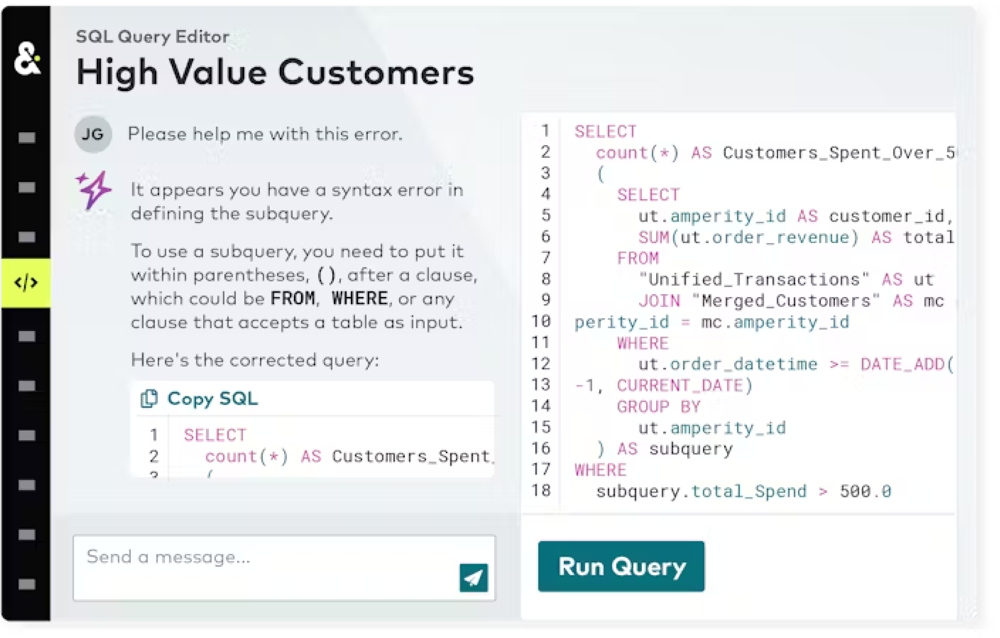

.. https://docs.amperity.com/reference/

.. meta::
    :description lang=en:
        AmpAI assistants help author SQL queries and create customer segments from natural language commands.

.. meta::
    :content class=swiftype name=body data-type=text:
        AmpAI assistants help author SQL queries and create customer segments from natural language commands.

.. meta::
    :content class=swiftype name=title data-type=string:
        AmpAI assistants

==================================================
About AmpAI assistants
==================================================

.. assistant-overview-start

**AmpAI** assistants include the following:

* **Amp Insights** helps users understand Amps usage and consumption
* **Journeys AI Assistant** helps users build and personalize multi-touch journeys
* **Queries AI Assistant** helps users author SQL queries and resolve errors
* **Segments AI Assistant** helps users build segments
* Explains workflow task errors inline on the **Workflows** page
* Generates field descriptions for database tables in the table editor
* Formats SQL in the custom table editor, with optional custom instructions

These assistants are generative AI features within Amperity that use natural language as input commands.

.. assistant-overview-end

.. assistant-usecases-start

Use **Amp Insights** in the **Amps** dashboard to:

* Investigate spikes or changes in Amps consumption
* Get a breakdown of how Amps are spent across product features (identity resolution, activations, etc.) as well as environments (production and individual sandboxes)
* Identify which activities consume the most Amps

Use the **Journeys AI Assistant** in the **Journeys** canvas to:

* Create customer journeys starting from natural language, such as "Create a welcome series for new customers"
* Add, edit, or remove journey steps, such as delays, emails, and splits
* Personalize journeys based on customer segments, behaviors, or attributes

Use the **Queries AI Assistant** in the SQL **Query Editor** to:

* Create SQL queries starting from natural language, such as "Who are my top 100 customers by lifetime spend?" or "Show me everyone who shopped in-store over the last 30 days."
* Ask for help while resolving a SQL error
* Get advice on how to improve a query
* Ask questions about SQL syntax, such as "What is the syntax for a window function?" 

Use the **Segments AI Assistant** in the **Segment Editor** to:

* Generate customer segments
* Refine customer segments
* Get advice on building better customer segments to meet campaign goals

When a workflow task fails, click **Explain this error** on the **Workflows** page to get an AI-generated plain-language explanation of why the task failed.

When editing a database table, click **Generate field descriptions** in the table settings panel to have AmpAI write descriptions for any fields that do not yet have one.

When editing a custom SQL table, use **Format SQL** to reformat the SQL in the editor. Choose **Custom format** to provide specific formatting instructions, such as adding explanatory comments to each CTE.

.. assistant-usecases-end

.. assistant-overview-important-start

.. important:: As with all generative AI capabilities, the outputs of **AmpAI** assistants are probabilistic. Users should double check outputs for accuracy.

   Review the |support_ai_assistant_privacy_faq| to learn more about how the **AmpAI Assistant** interacts with LLMs and the Microsoft Azure OpenAI Service.

.. assistant-overview-important-end

.. assistant-learning-lab-start

.. admonition:: Amperity Learning Lab

   The **AmpAI** assistants are generative AI features that can help you build better SQL queries, generate customer segments, and structure journeys based on the data in your Amperity tenant.

   Open **Learning Lab** to learn more about how `the Amperity AI Assistant <https://amperity.com/learning-lab/the-amperity-ai-assistant>`__ |ext_link| and the `Segments AI Assistant <https://amperity.com/learning-lab/ai-assisted-segment-creation>`__ |ext_link| can help you build better queries, segments, and journeys. Registration is required.

.. assistant-learning-lab-end

.. _assistant-enable-disable:

Enable or disable AmpAI assistants
==================================================

.. assistant-enable-disable-start

AmpAI features, including **AmpAI** assistants, may be enabled (or disabled) by a user who is assigned the **DataGrid Operator** or **DataGrid Administrator** policy.

.. assistant-enable-disable-end

**To disable AmpAI assistants**

.. include:: ../../amperity_reference/source/ampai_settings.rst
   :start-after: .. settings-user-ampai-steps-start
   :end-before: .. settings-user-ampai-steps-end

.. _assistant-howitworks:

How AmpAI assistants work
==================================================

.. assistant-howitworks-start

**AmpAI** assistants are powered by LLMs on a private instance of Azure OpenAI Service.

Amperity passes information on the schema information, query and segment examples, results, errors, table usage, and performs a series of research tool calls to improve the quality of results. While working, the assistant shows each step with a running, succeeded, or failed indicator so you can follow its progress.

.. note:: More detail about how **AmpAI** assistants work, including data sharing policies, how the model stores data, and what types of data is sent (or not sent), is available from the |ext_amperity_assistant_privacy_faq|.

.. assistant-howitworks-end

.. assistant-workflow-errors-start

When a workflow task fails with a system-level error, an **Explain this error** link appears in the task error panel on the **Workflows** page. Click it to send the error details to AmpAI and receive a plain-language explanation of what went wrong. The explanation appears inline, directly below the error message.

.. note:: The **Explain this error** link is available for system-level errors only. Errors caused by customer configuration do not show this option.

.. assistant-workflow-errors-end

.. assistant-generate-field-descriptions-start

In the table editor, a **Generate field descriptions** link appears in the **Description** settings group on the right side panel. Click it to have AmpAI write descriptions for any fields that do not already have one. When the table is defined by a SQL query, AmpAI queries the upstream schema to improve the accuracy of the generated descriptions. Generation may take a few minutes depending on the number of fields. Fields that already have descriptions are left unchanged.

.. assistant-generate-field-descriptions-end

.. assistant-format-sql-start

In the SQL editor for a custom database table, a **Format SQL** button appears in the toolbar. It offers two modes. **Standard format** reformats the SQL using default style rules. **Custom format** opens a dialog where you can provide additional instructions. For example: "Add a comment explaining the content of each CTE" that AmpAI applies on top of standard formatting. The editor is read-only while formatting is in progress.

.. assistant-format-sql-end

.. _amp-insights-examples:

Amp Insights examples
==================================================

.. amp-insights-examples-start

Use **Amp Insights** to ask natural language questions and understand your tenant's Amps usage and consumption. It is embedded in the **Amps** dashboard, which you can access by clicking the |fa-kebab| menu next to your tenant name at the top right of the Amperity interface and selecting **Amps**.

.. amp-insights-examples-end

.. vale off

.. amp-insights-examples-list-start

The following examples show some of the questions you can ask while working in the **Amps** dashboard:

* "What caused my Amps spike on Jan 12th?"

* "Give me a breakdown of how I am spending my Amps."

* "Which campaign consumes the most Amps?"

.. amp-insights-examples-list-end

.. vale on

.. _assistant-journey-examples:

Journey examples
==================================================

.. assistant-journey-examples-start

The following examples show some of the ways you can use the **Journeys AI Assistant** while working in the **Journeys** canvas.

* :ref:`assistant-journey-example-natural-language`
* :ref:`assistant-journey-example-refine`
* :ref:`assistant-journey-example-personalize`

.. note:: The answers to these questions within your tenant will depend on the journey configuration, schema, results, and error information that was provided to the model and may be different than the examples shown.

.. tip:: Review the steps generated by the **AmpAI Assistant** to ensure they align with your campaign strategy before activating the journey.

.. assistant-journey-examples-end

.. _assistant-journey-example-natural-language:

Build natural language journeys
--------------------------------------------------

.. assistant-journey-example-natural-language-start

You can use natural language to ask the **Journeys AI Assistant** to build a journey based on the goals of your campaign.

**Question**
   "Create a welcome series for new customers."

**Answer**
   The **Journeys AI Assistant** will respond similar to:

   .. image:: ../../images/assistant-journeys-example-welcome-series-dialog.png
      :width: 400 px
      :alt: Build natural language journeys, dialog
      :align: left
      :class: no-scaled-link

   .. image:: ../../images/assistant-journeys-example-welcome-series-canvas.png
      :width: 400 px
      :alt: Build natural language journeys, canvas
      :align: left
      :class: no-scaled-link

.. assistant-journey-example-natural-language-end

.. _assistant-journey-example-refine:

Refine a journey
--------------------------------------------------

.. assistant-journey-example-refine-start

You can ask the **Journeys AI Assistant** to add, edit, or remove steps within an existing journey flow.

**Question**
   "Add a split based on email engagement to differentiate the path for highly engaged users."

**Answer**
   The **Journeys AI Assistant** will respond similar to:

   .. image:: ../../images/assistant-journeys-example-split-dialog.png
      :width: 400 px
      :alt: Refine a journey, dialog
      :align: left
      :class: no-scaled-link

   .. image:: ../../images/assistant-journeys-example-split-canvas.png
      :width: 400 px
      :alt: Refine a journey, canvas
      :align: left
      :class: no-scaled-link

.. assistant-journey-example-refine-end

.. _assistant-journey-example-personalize:

Personalize a journey
--------------------------------------------------

.. assistant-journey-example-personalize-start

You can ask the **Journeys AI Assistant** to update journey logic to better target specific audiences or behaviors.

**Question**
   "Update the inclusion logic to target first time customers whose purchase was over $100."

**Answer**
   The **Journeys AI Assistant** will respond similar to:

   .. image:: ../../images/assistant-journeys-example-personalize-dialog.png
      :width: 400 px
      :alt: Personalize a journey, dialog
      :align: left
      :class: no-scaled-link

   .. image:: ../../images/assistant-journeys-example-personalize-canvas.png
      :width: 400 px
      :alt: Personalize a journey, canvas
      :align: left
      :class: no-scaled-link

.. assistant-journey-example-personalize-end

.. _assistant-journey-prompt-patterns:

Effective prompt patterns
--------------------------------------------------

.. assistant-journey-effective-prompt-patterns-start

To get the best results from the **Journeys AI Assistant**, use specific, clear commands that identify node types, criteria, and destinations.

Good prompts (specific and clear)
++++++++++++++++++++++++++++++++++++++++++++++++++

The following prompts provide the necessary context for the assistant to build accurate steps:

* "Create a split for high value customers, send them to Salesforce Marketing Cloud, and then everyone else to S3"
* "Add a 7-day delay after the welcome email activation"
* "Split by gender, then for each path split by loyalty tier, such as gold, silver, or bronze"
* "Merge the two email paths and send a final survey email to everyone"
* "Use Club Members as the inclusion segment"

Why these work:

* **Specific node types** Identifies splits, delays, activations, or merges.
* **Clear criteria** Defines the logic, such as high value, gender, or loyalty tier.
* **Explicit destinations** Names the downstream systems, such as Salesforce Marketing Cloud or Amazon S3.
* **Explicit segments** Names the segment, such as "Club Members"
* **Sequential structure** Outlines the order of operations.

Bad prompts (vague or ambiguous)
++++++++++++++++++++++++++++++++++++++++++++++++++

The following prompts may result in generic or incorrect journey steps because they lack detail:

* "Build me a journey"
   (What kind of journey? What segments? What destinations?)
* "Make it better"
   (Better how? What should change?)
* "Add personalization"
   (Personalize by what attribute? Where in the journey?)
* "Do the usual thing"
   (The AI does not know your specific preferences or history)

Why these fail:

* **No specific actions** The assistant does not know which nodes to add.
* **Ambiguous goals** Terms like "better" or "personalization" are subjective without context.
* **Missing information** Lacks segments, destinations, or split criteria.

.. assistant-journey-effective-prompt-patterns-start

.. _assistant-query-examples:

Query examples
==================================================

.. assistant-query-examples-start

The following examples show some of the ways you can use the **Queries AI Assistant** while working in the SQL **Query Editor**.

* :ref:`assistant-query-example-natural-language`
* :ref:`assistant-query-example-errors`
* :ref:`assistant-query-example-syntax`

.. note:: The answers to these questions within your tenant will depend on the query, schema, results, and error information that was provided to the model and may be different than the examples shown.

.. assistant-query-examples-end

.. _assistant-query-example-natural-language:

Build natural language queries
--------------------------------------------------

.. assistant-query-example-natural-language-start

You can use natural language--the same types of sentences you use when talking to co-workers and friends--to ask the **AmpAI Assistant** to help you build queries against any database in the **Customer 360** page.

.. assistant-query-example-natural-language-end

.. _assistant-query-example-natural-language-lifetime-spend:

Customers by lifetime spend
++++++++++++++++++++++++++++++++++++++++++++++++++

.. assistant-example-natural-language-lifetime-spend-start

**Question**
   "Who are my top 100 customers by lifetime spend?"

**Answer**
   The **Queries AI Assistant** will respond similar to:

   .. image:: ../../images/assistant-example-syntax-natural-language.png
      :width: 400 px
      :alt: Build natural language queries
      :align: left
      :class: no-scaled-link

   .. tip:: When "Tables and fields are valid" is shown for the SQL returned by the **AmpAI Assistant** you can try running the query in the SQL **Query Editor**.

      Click the **Copy SQL** link in the response from the **AmpAI Assistant**, paste the SQL into the SQL **Query Editor**, click the **Run query** button, and then (after the query is finished running) you can view the results.

.. assistant-query-example-natural-language-lifetime-spend-end

.. _assistant-query-example-natural-language-in-store-shoppers:

In-store shoppers
++++++++++++++++++++++++++++++++++++++++++++++++++

.. assistant-example-natural-language-in-store-shoppers-start

**Question**
   "Show me everyone who shopped in-store over the last 30 days."

**Answer**
   The **Queries AI Assistant** will respond similar to:

   .. image:: ../../images/assistant-example-syntax-thirty-days.png
      :width: 400 px
      :alt: Build natural language queries
      :align: left
      :class: no-scaled-link

.. assistant-query-example-natural-language-in-store-shoppers-end

.. _assistant-query-example-errors:

Ask for help resolving errors
--------------------------------------------------

.. assistant-query-example-errors-start

When you have an error in your query syntax you can ask the **AmpAI Assistant** for help resolving the error.

**Question**
   "Can you help me resolve this error?"

**Answer**
   The **Queries AI Assistant** will respond similar to:

   .. image:: ../../images/assistant-example-errors.png
      :width: 400 px
      :alt: Ask for help resolving errors
      :align: left
      :class: no-scaled-link

.. assistant-query-example-errors-end

.. _assistant-query-example-syntax:

Ask questions about syntax
--------------------------------------------------

.. assistant-query-example-syntax-start

You can ask the **AmpAI Assistant** to help you understand how specific types of syntax work in a SQL query.

**Question**
   "What is the syntax for a CASE statement?"

**Answer**
   The **Queries AI Assistant** will respond similar to:

   .. image:: ../../images/assistant-example-syntax.png
      :width: 400 px
      :alt: Ask questions about syntax
      :align: left
      :class: no-scaled-link

.. note:: Amperity uses :doc:`Presto SQL syntax <sql_presto>` within the SQL **Query Editor**.

.. assistant-query-example-syntax-end

.. _assistant-segment-examples:

Segment examples
==================================================

The following examples show some of the ways you can use the **Segments AI Assistant** while working in the **Segment Editor**.

* :ref:`ampai-segments-example-create-segment`
* :ref:`ampai-segments-example-refine-segment`
* :ref:`ampai-segments-example-get-advice-on-segment`

.. note:: The answers to these questions within your tenant will depend on the query, schema, results, and error information that was provided to the model and may be different than the examples shown.

.. _ampai-segments-example-create-segment:

Create a segment
--------------------------------------------------

.. assistant-segments-example-create-segment-start

You can ask the **Segments AI Assistant** to build a segment based on the criteria you lay out.

**Question**
   "Build a segment of my highest value customers based on customer lifetime value."

**Answer**
  The **Segments AI Assistant** will respond similar to:
  
..  .. image:: ../../images/assistant-segments-example-create-segment.png
     :width: 600 px
     :alt: Build natural language queries
     :align: left
     :class: no-scaled-link

.. tip:: Be sure to check that the segment created matches what you were looking for, and if not you can guide the **AmpAI Assistant** on how to try again.

   For example, if you ask for a segment of your highest value customers without specifying customer lifetime value as the criteria, you may get a segment based on highest spend over the past year. 

   In cases like this, prompt the **AmpAI Assistant** again and specify how you want to measure value. 

.. ampai-segments-example-create-segment-end

.. _ampai-segments-example-refine-segment:

Refine a segment
--------------------------------------------------

.. ampai-segments-example-refine-segment-start

You can ask the **Segments AI Assistant** to add additional conditions to your segment. 

**Question**
   "Narrow it down to high value customers who have a product preference for jeans and have not purchased in the last month."

**Answer**
  The **Segments AI Assistant** will respond similar to:

..  .. image:: ../../images/assistant-segments-example-refine-segment.png
     :width: 600 px
     :alt: Build natural language queries
     :align: left
     :class: no-scaled-link

.. ampai-segments-example-refine-segment-end

.. _ampai-segments-example-get-advice-on-segment:

Get advice on your segment
--------------------------------------------------

.. ampai-segments-example-get-advice-on-segment-start

You can ask the **Segments AI Assistant** for guidance on how else you might design your segment to meet the goals of your campaign.

**Question**
   "What other criteria should I consider adding to the segment in order to attract high-value customers who have not recently purchased to buy new offerings in the jeans category?"

**Answer**
  The **Segments AI Assistant** will respond similar to:
  
.. TODO: make this image or delete

..  .. image:: ../../images/assistant-segments-example-get-segment-advice.png
..     :width: 600 px
..     :alt: Build natural language queries
..     :align: left
..     :class: no-scaled-link

.. code-block:: none

   "To make your segment even more effective for targeting high-value customers
   who have not recently purchased (especially with the goal of promoting new 
   jeans offerings), you might consider adding additional criteria."

Answers will include suggestions similar to:

#. Predicted Affinity for Related Categories:

   Include customers who also have a demonstrated or predicted interest in complementary categories, such as "Tops and T-shirts" or "Accessories," which pair well with jeans.

#. Preferred Channel or Brand:

   Focus on customers who prefer a specific purchase channel or brand, if your new jeans offerings are exclusive or more prominent in certain channels or under specific brands.

#. Contactability:

   Ensure that customers are opted into email or SMS marketing, so your campaigns can actually reach them.

#. Geographic Proximity:

   Filter for customers living in regions where jeans sales or promotions are planned or more likely and in areas with upcoming in-store events.

#. Previous Buyers of Premium Jeans:

   Target customers who have purchased higher-value or premium jeans in the past, as they are more likely to be interested in new, similar offerings.

#. Lapsed but Historically Loyal Customers:

   Identify customers who have bought jeans in the past but have not purchased any recently. They may respond well to a "welcome back" campaign for new jeans.

#. Customer Lifecycle Status:

   Pay attention to customers with a "likely to return" or "at-risk" predicted lifecycle, as they could be nudged toward purchase with targeted messaging.

.. ampai-segments-example-get-advice-on-segment-end