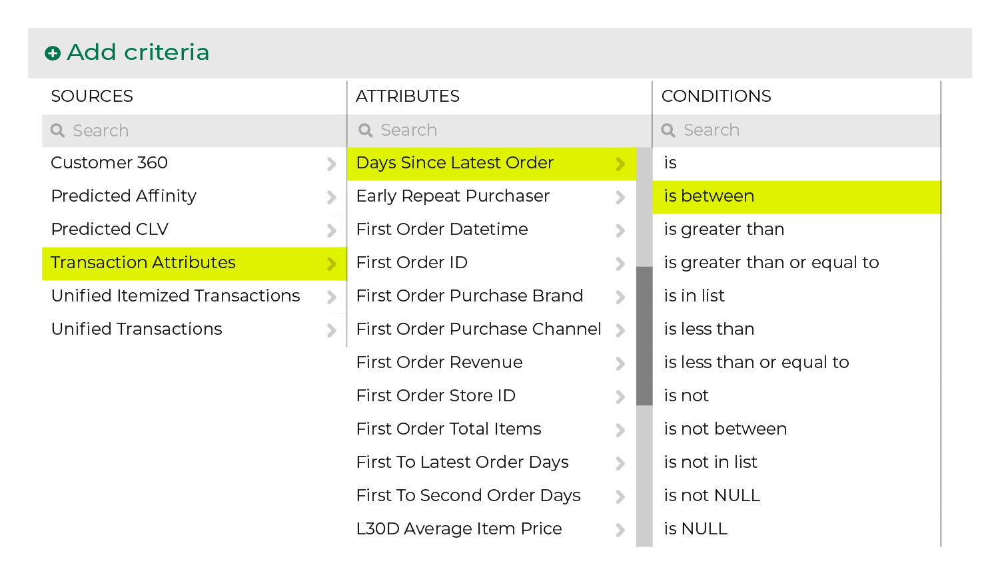

.. 
.. https://docs.amperity.com/reference/
.. 

.. meta::
    :description lang=en:
        How many days have elapsed since a customer's most recent order?

.. meta::
    :content class=swiftype name=body data-type=text:
        How many days have elapsed since a customer's most recent order?

.. meta::
    :content class=swiftype name=title data-type=string:
        Days since latest order

==================================================
Days since latest order
==================================================

.. include:: ../../shared/terms.rst
   :start-after: .. term-days-since-last-order-start
   :end-before: .. term-days-since-last-order-end

.. _attribute-days-between-orders-segment:

Use in segments
==================================================

.. attribute-days-between-orders-start

To find the number of days that have elapsed since a customer's most recent order, start with the **Days Since Latest Order** attribute in the **Transaction Attributes Extended** table, and then set its condition to **is between**.

.. attribute-days-between-orders-end

.. attribute-days-between-orders-filters-start

After the attribute appears in your segment, specify the number of days. For example, to find customers for whom 90 days have elapsed since their latest order:

.. attribute-days-between-orders-filters-end

.. _attribute-days-between-orders-conditions:

Available conditions
==================================================

.. attribute-days-between-orders-conditions-start

The following table lists the conditions that are available to this attribute.

.. note:: This attribute has a Integer data type. All Integer data types share the same set of conditions. Recommended conditions for this attribute are identified with "|attribute-recommended| **More useful**" and conditions with more limited use cases are identified with "|attribute-stop| **Less useful**".

.. list-table::
   :widths: 35 65
   :header-rows: 1

   * - Condition
     - Description
   * - **is**
     - Returns customer records with dates that match the specified date.

   * - **is between**
     - |attribute-recommended| **More useful**

       Returns customer records with dates that are between the specified dates, not including the specified date.

       .. tip::

          A churn prevention campaign must measure the time that has elapsed since a customer's most recent order and the current date.

          Use the **in between** operator along with relative date ranges to associate customers to specific stages within your churn prevention campaign.

          For example: if your churn prevention campaign has stages at 14 days and 1 month after the customer's most recent purchase, add the following criteria to the 14-day segment:

          .. code-block:: none

             "Days Since Latest Order" is between 0 and 14

          and the following criteria to the 1-month segment

          .. code-block:: none

             "Days Since Latest Order" is between 0 and 30

   * - **is greater than**
     - Returns customer records with dates that are greater than the specified date, not including the specified date.

   * - **is greater than or equal to**
     - Returns customer records with dates that are greater than or equal to the specified date, including the specified date.

   * - **is in list**
     - Returns customer records with dates that match the dates that are specified in the list.

   * - **is less than**
     - |attribute-recommended| **More useful**

       Returns customer records with dates that are less than the specified date, not including the specified date.

   * - **is less than or equal to**
     - |attribute-recommended| **More useful**

       Returns customer records with dates that are less than or equal to the specified date, including the specified date.

   * - **is not**
     - |attribute-stop| **Less useful**

       Returns customer records with date that do not match the specified date.

   * - **is not between**
     - |attribute-stop| **Less useful**

       Returns customer records with dates that are not between the specified dates, not including the specified date.

   * - **is not in list**
     - |attribute-stop| **Less useful**

       Returns customer records with dates that do not match the dates that are specified in the list.

   * - **is not NULL**
     - Returns customer records that have a value.

   * - **is NULL**
     - Returns customer records that do not have a value.

.. attribute-days-between-orders-conditions-end
