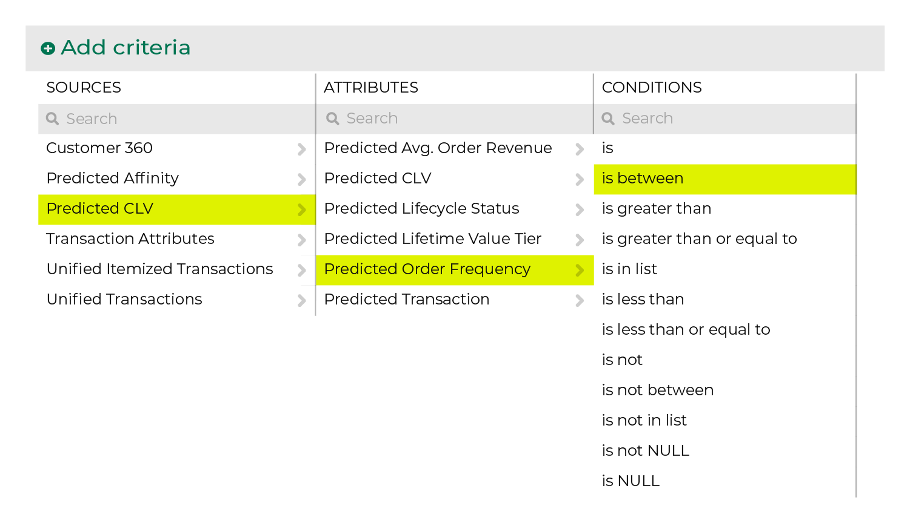
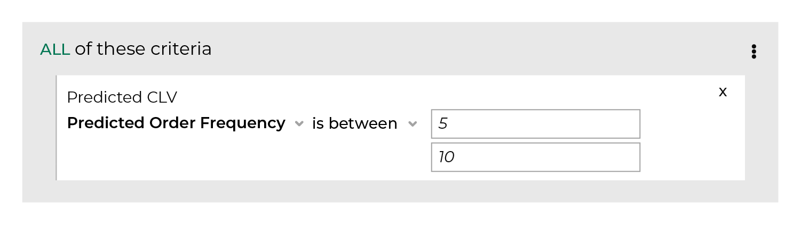

.. 
.. https://docs.amperity.com/reference/
.. 

.. meta::
    :description lang=en:
        The number of orders a customer is predicted to make if they return to make another purchase during the next 365 days.

.. meta::
    :content class=swiftype name=body data-type=text:
        The number of orders a customer is predicted to make if they return to make another purchase during the next 365 days.

.. meta::
    :content class=swiftype name=title data-type=string:
        Predicted order frequency

==================================================
Predicted order frequency
==================================================

.. include:: ../../shared/terms.rst
   :start-after: .. term-predicted-order-frequency-start
   :end-before: .. term-predicted-order-frequency-end

.. attribute-predicted-order-frequency-start

Use predicted order frequency to:

#. Identify customers who are predicted to be high-value customers.
#. Identify customers who should be reactivated based on their predicted ordering behavior.

Each prediction is represented by a number, where a higher number represents an increase in the number or orders a customer will make during the next 365 days: a ``1.00`` score is a likelihood of 1 order, a ``2.34`` score is a likelihood of 2-3 orders (but closer to 2), and a ``7.87`` score is a likelihood of 7-8 orders (but closer to 8).

.. attribute-predicted-order-frequency-end

.. _attribute-predicted-order-frequency-about-clv:

About predicted CLV attributes
==================================================

.. attribute-predicted-order-frequency-about-clv-start

Amperity provides a set of attributes that predict customer lifetime value (CLV) during the next 365 days.

#. :doc:`Predicted CLV <attribute_predicted_clv>` represents the total value of all orders a customer is predicted to make *if they return to make another purchase* during the next 365 days.

   .. note:: Predicted CLV is the multiplication of three columns: 1) predicted probability of return, 2) predicted order frequency, and 3) predicted average order value.

      Each component of predicted CLV is also available as an individual score:

      #. :doc:`Predicted probability of transaction <attribute_predicted_transactions>` represents the likelihood that a customer will return to make another purchase during the next 365 days.
      #. Predicted order frequency represents the number of orders a customer is predicted to make *if they return to make another purchase* during the next 365 days.
      #. :doc:`Predicted average order revenue <attribute_predicted_average_order_revenue>` represents the average value of each order a customer is predicted to make *if they return to make another purchase* during the next 365 days.

#. :doc:`Predicted value tiers <attribute_predicted_value_tier>` group customers by pCLV: Platinum (top 1%),  Gold (top 1%-5%),  Silver (top 5%-10%),  Bronze (top 10%-25%),  Medium (top 25%-50%), and Low (bottom 50%).

Use a combination of predicted CLV attributes to identify high-value audiences for use with campaigns that focus on winning repeat customers, such as churn prevention, winback, and one-time buyer campaigns.

.. attribute-predicted-order-frequency-about-clv-end

.. attribute-predicted-order-frequency-about-clv-example-start

For example:

#. Start with predicted frequency of transaction to identify customers with a higher likelihood of return.
#. Add predicted order frequency to identify which of those customers are the most likely to order more than once if they become a repeat customer.

.. attribute-predicted-order-frequency-about-clv-example-end

.. _attribute-predicted-order-frequency-segment:

Use in segments
==================================================

.. attribute-predicted-order-frequency-segment-start

To find predicted order frequency, start with the **Predicted Order Frequency Next 365** attribute in the **Predicted CLV Attributes** table, and then select a condition.

.. attribute-predicted-order-frequency-segment-end

.. attribute-predicted-order-frequency-filters-start

After the attribute appears in your segment, specify a frequency for predicted average order revenue that aligns to the condition you selected. For example, to find customers who are predicted to purchase between 5 and 10 times:

.. attribute-predicted-order-frequency-filters-end

.. attribute-predicted-order-frequency-modeling-enabled-note-start

.. note:: Predicted order frequency is available when predictive modeling is enabled for your tenant.

.. attribute-predicted-order-frequency-modeling-enabled-note-end

.. _attribute-predicted-order-frequency-conditions:

Available conditions
==================================================

.. attribute-predicted-order-frequency-conditions-start

The following table lists the conditions that are available to this attribute.

.. note:: This attribute has a Decimal data type. All Decimal data types share the same set of conditions. Recommended conditions for this attribute are identified with "|attribute-recommended| **More useful**" and conditions with more limited use cases are identified with "|attribute-stop| **Less useful**".

.. list-table::
   :widths: 35 65
   :header-rows: 1

   * - Condition
     - Description
   * - **is**
     - |attribute-stop| **Less useful**

       Returns a specific frequency of transaction, such as "1.2", "40.6", or "50.0".

       .. tip:: Use the following conditions to return a range of frequencies instead of a specific frequency: **is between**, **is greater than**, **is greater than or equal to**, **is less than**, and **is less than or equal to**.

   * - **is between**
     - |attribute-recommended| **More useful**

       Returns a range of frequencies that are between the specified predicted frequency.

   * - **is greater than**
     - |attribute-recommended| **More useful**

       Returns frequencies that are greater than the specified predicted frequency.

   * - **is greater than or equal to**
     - |attribute-recommended| **More useful**

       Returns frequencies that are greater than or equal to the specified frequency.

       Use this condition to find customers who are predicted to purchase from your brand during the next year. For example, to find customers who are predicted to make 3 (or more) purchases:

       .. code-block:: none

          "Predicted Order Frequency Next 365" is greater than or equal to "3"

   * - **is in list**
     - |attribute-stop| **Less useful**

       Avoid using the **is in list** condition; individual frequencies are not typically made available in a list.

   * - **is less than**
     - |attribute-recommended| **More useful**

       Returns frequencies that are less than the specified predicted frequency.

   * - **is less than or equal to**
     - |attribute-recommended| **More useful**

       Returns frequencies that are less than or equal to the specified predicted frequency.

   * - **is not**
     - |attribute-stop| **Less useful**

       Avoid using the **is not** condition.

       For example, if you specified "50.0" then any frequency that is less than or equal to "49.99" and any frequency that is greater than or equal to "50.01" would be returned.

   * - **is not between**
     - |attribute-stop| **Less useful**

       Discovers outlier frequencies.

       For example, if most of your frequencies are between "30.0" and "40.0", use "30.0" and "40.0" to return frequencies that were less than and greater than those values.

   * - **is not in list**
     - |attribute-stop| **Less useful**

       Avoid using the **is not in list** condition when individual frequencies are not made available as a list.

   * - **is not NULL**
     - Returns customer records that have a value, such as ".50", "59.99", and "100.0", but also " " (a space) and "0" (zero). If the record has *any* value it will be returned.

   * - **is NULL**
     - Returns customer records that do not have a value.

.. attribute-predicted-order-frequency-conditions-end
