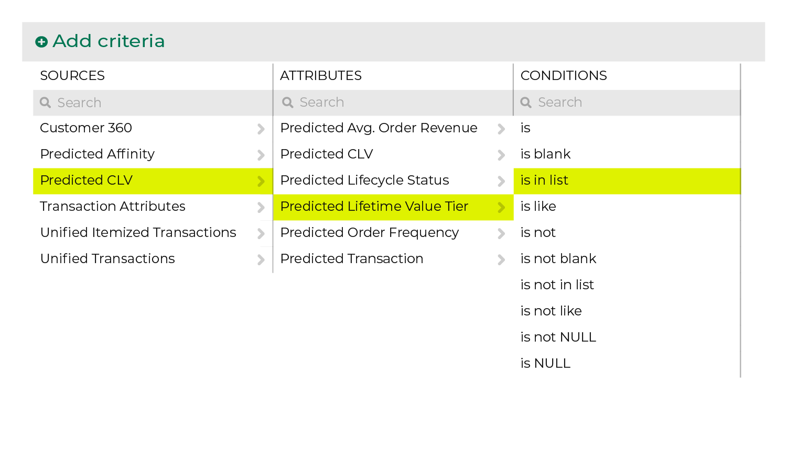
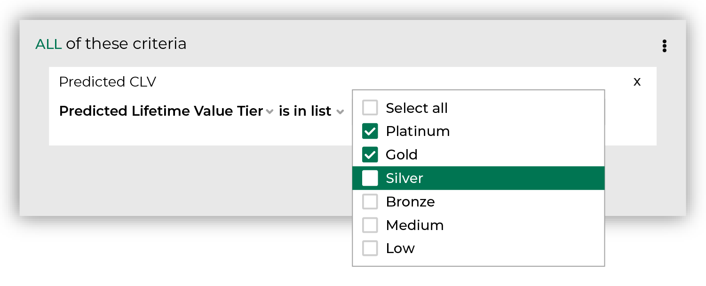

.. 
.. https://docs.amperity.com/reference/
.. 

.. meta::
    :description lang=en:
        Percentile grouping of customers by predicted customer lifetime value (pCLV), including top 1%, 1%-5%, 5%-10%, and 10%-25%.

.. meta::
    :content class=swiftype name=body data-type=text:
        Percentile grouping of customers by predicted customer lifetime value (pCLV), including top 1%, 1%-5%, 5%-10%, and 10%-25%.

.. meta::
    :content class=swiftype name=title data-type=string:
        Predicted value tiers

==================================================
Predicted value tiers
==================================================

.. TODO: Make this a glossary term? Update.

.. attribute-predicted-value-tier-start

Predicted customer value tiers represent a percentile grouping of customers by predicted customer lifetime value (pCLV). Value tier groupings include:

* Platinum: top 1% of customers
* Gold: top 1%-5% of customers
* Silver: top 5%-10% of customers
* Bronze: top 10%-25% of customers
* Medium: top 25%-50% of customers
* Low: bottom 50% of customers

.. attribute-predicted-value-tier-end

.. _attribute-predicted-value-tier-about-clv:

About predicted CLV attributes
==================================================

.. attribute-predicted-value-tier-about-clv-start

Amperity provides a set of attributes that predict customer lifetime value (CLV) during the next 365 days.

Each of these attributes provides a score that is independent of other predicted CLV attributes:

#. :doc:`Predicted CLV <attribute_predicted_clv>` represents the total value of all orders a customer is predicted to make *if they return to make another purchase* during the next 365 days.

   .. note:: Predicted CLV is the multiplication of three columns: 1) predicted probability of return, 2) predicted order frequency, and 3) predicted average order value.

      Each component of predicted CLV is also available as an individual score:

      #. :doc:`Predicted probability of transaction <attribute_predicted_transactions>` represents the likelihood that a customer will return to make another purchase during the next 365 days.
      #. :doc:`Predicted order frequency <attribute_predicted_order_frequency>` represents the number of orders a customer is predicted to make *if they return to make another purchase* during the next 365 days.
      #. :doc:`Predicted average order revenue <attribute_predicted_average_order_revenue>` represents the average value of each order a customer is predicted to make *if they return to make another purchase* during the next 365 days.

#. Predicted value tiers group customers by pCLV: Platinum (top 1%),  Gold (top 1%-5%),  Silver (top 5%-10%),  Bronze (top 10%-25%),  Medium (top 25%-50%), and Low (bottom 50%).

.. attribute-predicted-value-tier-about-clv-end

.. attribute-predicted-value-tier-about-clv-example-start

For example:

#. Start with predicted frequency of transaction to identify customers with a higher likelihood of return, and then identify which of those customers are expected to fall into your top 10%.
#. Add predicted order frequency to identify which of those customers are the most likely to order more than once if they become a repeat customer.

.. attribute-predicted-value-tier-about-clv-example-end

.. _attribute-predicted-value-tier-examples:

Examples
==================================================

.. attribute-predicted-value-tier-examples-start

The following topics contain examples of using predicted value tiers:

* |usecase_customers_high_value_new|

.. attribute-predicted-value-tier-examples-end

.. _attribute-predicted-value-tier-segment:

Use in segments
==================================================

.. attribute-predicted-value-tier-segment-start

To find predicted value tiers, start with the **Predicted Customer Lifetime Value Tier** attribute in the **Predicted CLV Attributes** table, and then set its condition to **is in list**. After the attribute appears in your segment, set the list values to include all of the value tiers you want to use in your segment.

.. attribute-predicted-value-tier-segment-end

.. attribute-predicted-value-tier-segment-list-options-start

Choose the **is in list** attribute, and then set predicted lifetime value tier to **Platinum**, **Gold**, and **Silver**:

.. attribute-predicted-value-tier-segment-list-options-end

.. attribute-predicted-value-tier-modeling-enabled-note-start

.. note:: Predicted order frequency is available to users of Amperity when predictive modeling is enabled for your tenant.

.. attribute-predicted-value-tier-modeling-enabled-note-end

.. _attribute-predicted-value-tier-conditions:

Available conditions
==================================================

.. attribute-predicted-value-tier-conditions-start

The following table lists the conditions that are available to this attribute.

.. note:: This attribute has a String data type. All String data types share the same set of conditions. Recommended conditions for this attribute are identified with "|attribute-recommended| **More useful**" and conditions with more limited use cases are identified with "|attribute-stop| **Less useful**".

.. list-table::
   :widths: 35 65
   :header-rows: 1

   * - Condition
     - Description

   * - **contains**
     - Returns customer records with values that match a string of characters.

   * - **does not contain**
     - Returns customer records with values that do not match a string of characters.

   * - **ends with**
     - Returns customer records with values that end with the specified characters.

   * - **is empty**
     - Returns customer records that do not have a value in this field.

   * - **is exactly**
     - Returns all customer records with values that match the specified characters.

   * - **is not empty**
     - Returns customer records that have a value in this field.

   * - **is not exactly**
     - Returns customer records that do not match the specified characters.

   * - **starts with**
     - Returns customer records that start with the specified characters.

.. attribute-predicted-value-tier-conditions-end
