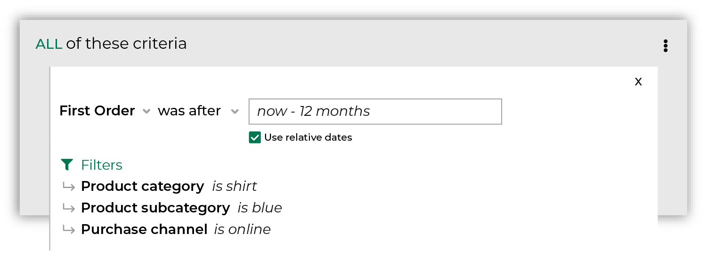
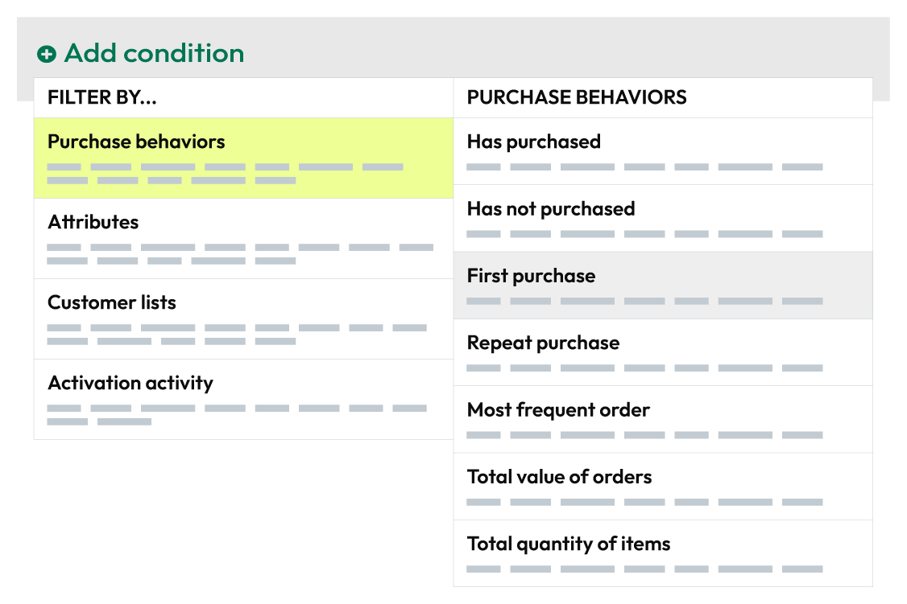

.. https://docs.amperity.com/reference/

.. meta::
    :description lang=en:
        Which customers made their first purchase during the specified date range?

.. meta::
    :content class=swiftype name=body data-type=text:
        Which customers made their first purchase during the specified date range?

.. meta::
    :content class=swiftype name=title data-type=string:
        First purchase

==================================================
First purchase
==================================================

.. attribute-purchase-behavior-first-purchase-start

**First purchase** returns a list of customers who made their first purchase during your chosen date range. For example, return all customers whose first purchase was during the previous 12 months:

After you specify a date range you may apply filters to associate first purchases with specific products, brands, channels, and stores. For example, return all customers who purchased a blue shirt from your website.

.. attribute-purchase-behavior-first-purchase-end

.. _attribute-purchase-behavior-first-purchase-howitworks:

How this attribute works
==================================================

.. attribute-purchase-behavior-first-purchase-howitworks-start

**First purchase** represents a common approach people use when they build segments: find all of my customers who made their first purchase in the past N days, months, or years, and then associate that list of customers to your products and brands.

**First purchase** is a *compound attribute*, which means that it is built from a combination of attributes that already exist in your data, and then appears as a single attribute that you can choose from the **Segment Editor**.

With this attribute, you can focus less on SQL and more on finding answers that align to your marketing goals and strategies. Purchase behavior attributes simplify the number of steps that are required to associate a list of customers to your products, stores, channels, and brands.

.. attribute-purchase-behavior-first-purchase-howitworks-end

.. attribute-purchase-behavior-first-purchase-howitworks-sql-start

.. admonition:: How does the SQL for First purchase work?

   **First purchase** is built from standard columns that are output by Amperity. The following example returns a list of customers whose first purchase was a blue shirt that they purchased online within the previous 12 months:
   
   .. image:: ../../images/attribute-purchase-behavior-first-purchase-example.png
      :width: 500 px
      :alt: Customers who bought a blue shirt within the previous 12 months.
      :align: left
      :class: no-scaled-link

   The SQL for **First purchase** works like this. It uses order datetime from the **Unified Itemized Transactions** table as its starting point:

   ::

      SELECT
        amperity_id
        ,order_datetime
        ,RANK() OVER (PARTITION BY amperity_id ORDER BY order_datetime, order_id) AS order_rank
      FROM Unified_Itemized_Transactions

   then uses the |sql_presto_function_rank| function to identify which of those purchases were a customer's first purchase, and then returns all items that match two conditions: order rank and a date range:

   ::

      WHERE order_rank = 1
      AND order_datetime < DATE_TRUNC('day', CURRENT_TIMESTAMP - interval '12' month)

   In this example, only transactions that occurred within the previous 12 months *and* are a customer's first purchase are returned.

   Returns and cancellations are filtered out automatically, like this:

   ::

      AND (is_return IS NULL OR (NOT is_return))
      AND (is_cancellation IS NULL OR (NOT is_cancellation))

   You may then filter this list of customers more by applying any of the product, purchase, and store filters. When you select these filters, they are added to the WHERE statement, like this:

   ::

      AND product_category = 'shirt'
      AND product_subcategory = 'blue'
      AND purchase_channel = 'online'

   *and* they are added to the SELECT statement, like this:

   ::

      SELECT
        amperity_id
        ,order_datetime
        product_category = 'shirt'
        product_subcategory = 'blue'
        purchase_channel = 'online'
        ,RANK() OVER (PARTITION BY amperity_id ORDER BY order_datetime, order_id) AS order_rank
      FROM Unified_Itemized_Transactions

   Why are these attributes added to the WHERE statement *and* the SELECT statement? They are added to the SELECT statement to ensure that the correct ranking is applied to products, purchases, and stores *before* you apply product, purchase, and store filters to your segment.

.. attribute-purchase-behavior-first-purchase-howitworks-sql-end

.. attribute-purchase-behavior-first-purchase-view-the-real-sql-start

The SQL for **First purchase** is more complex than what is described in the previous section. This is due to the way this attribute returns *only* a list of Amperity IDs, uses a series of common table expressions (CTEs), and takes advantage of workflows that Amperity does behind the scenes to pre-filter the product, purchase, and store attributes.

You can view the full SQL for **First purchase** from the **Segment Editor**. Start a new segment and add only this attribute (along with any required conditions and filter attributes), and then click the **View SQL** link at the top of the page.

.. attribute-purchase-behavior-first-purchase-view-the-real-sql-end

.. _attribute-purchase-behavior-first-purchase-segments:

Add to segments
==================================================

.. attribute-purchase-behavior-first-purchase-segments-start

You can add the **First purchase** behavior to a segment from the **Segment Editor**. Click **Add condition**, choose **Purchase behaviors**, and then select **First purchase**.

After the **First purchase** behavior attribute has been added, select an operator, and then finish defining the conditions for how this attribute should be applied to the segment.

.. attribute-purchase-behavior-first-purchase-segments-end

.. _attribute-purchase-behavior-first-purchase-relative-dates:

About relative dates
--------------------------------------------------

.. include:: ../../amperity_reference/source/segment_editor.rst
   :start-after: .. segments-editor-relative-dates-start
   :end-before: .. segments-editor-relative-dates-end

**Relative date values**

.. include:: ../../amperity_reference/source/segment_editor.rst
   :start-after: .. segments-editor-relative-date-values-start
   :end-before: .. segments-editor-relative-date-values-end

.. _attribute-purchase-behavior-first-purchase-conditions:

Available operators
==================================================

.. attribute-purchase-behavior-first-purchase-conditions-start

The following table lists the operators that are available to this attribute.

.. note:: Recommended operators for this attribute are identified with "|attribute-recommended| **More useful**" and operators with more limited use cases are identified with "|attribute-stop| **Less useful**".

.. list-table::
   :widths: 35 65
   :header-rows: 1

   * - Condition
     - Description
   * - **was after**
     - |attribute-recommended| **More useful**

       Returns a list of customers whose first purchases were after the specified time window.

   * - **was before**
     - |attribute-recommended| **More useful**

       Returns a list of customers whose first purchases were before the specified time window.

   * - **was between**
     - |attribute-recommended| **More useful**

       Returns a list of customers whose first purchases were between two specified time windows.

   * - **was not between**
     - |attribute-stop| **Less useful**

       Returns a list of customers whose first purchases were not between two specified time windows.

   * - **was not on**
     - |attribute-stop| **Less useful**

       Returns a list of customers whose first purchases were not on the specified time.

   * - **was on**
     - Returns a list of customers whose first purchases were on the specified time.

.. attribute-purchase-behavior-first-purchase-conditions-end

.. _attribute-purchase-behavior-first-purchase-filter-attributes:

Filter attributes
==================================================

.. attribute-purchase-behavior-first-purchase-filter-attributes-start

A filter attribute is a standard column that is output by Amperity and is available from the **Unified Itemized Transactions** table. When a filter attribute is associated with a purchase behavior attribute, you may use them to filter the results by specific items in your product catalog, such as by brand, by channel, by store, or by specific details about the items in your product catalog, such as color or SKU. The list of filter attributes that will be available for product catalogs depends on their availability within your **Unified Itemized Transactions** table.

.. attribute-purchase-behavior-first-purchase-filter-attributes-end
