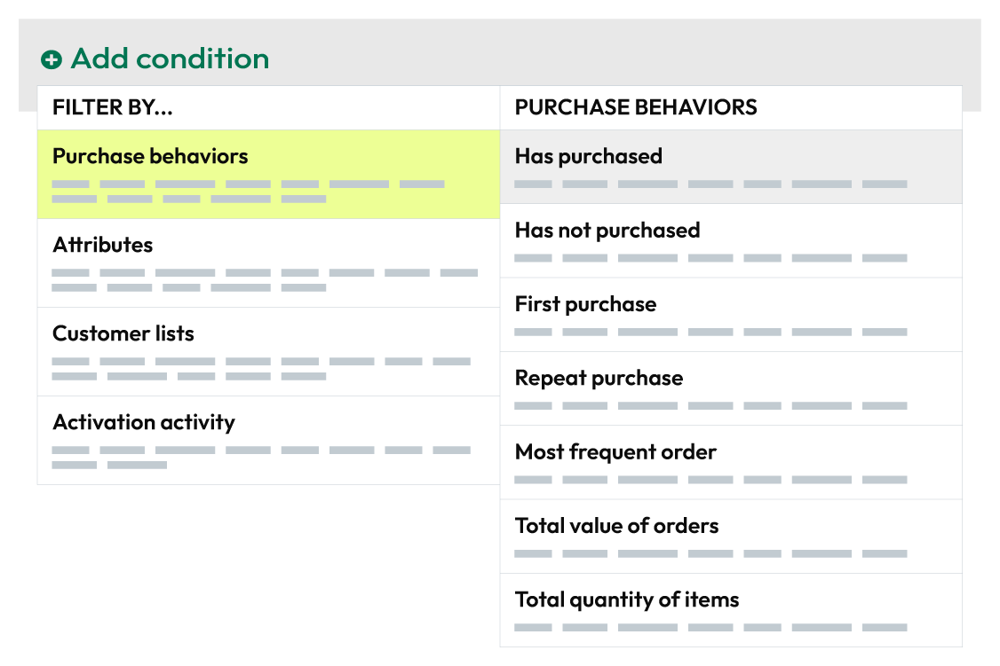

.. https://docs.amperity.com/reference/

.. meta::
    :description lang=en:
        Which customers have purchased N or more items during the specified time period?

.. meta::
    :content class=swiftype name=body data-type=text:
        Which customers have purchased N or more items during the specified time period?

.. meta::
    :content class=swiftype name=title data-type=string:
        Has purchased

==================================================
Has purchased
==================================================

.. attribute-purchase-behavior-has-purchased-start

**Has Purchased** returns a list of orders that meets the threshold that you define--for example, exactly 4, less than 5, more than 2, or between 2 and 10--*and* occurred during your chosen date range. For example, return all customers who have purchased 3 or more times in the previous 2 years:

After you specify a value and date range you may apply filters to associate customers who have purchased with specific products, brands, channels, and stores. For example, return all customers who have purchased wool or cotton socks from your website.

.. attribute-purchase-behavior-has-purchased-end

.. _attribute-purchase-behavior-has-purchased-howitworks:

How this attribute works
==================================================

.. attribute-purchase-behavior-has-purchased-howitworks-start

**Has Purchased** represents a common approach people use when they build segments: start with all orders, and then associate that list of orders to the products and brands your customers purchased.

**Has Purchased** is a *compound attribute*, which means that it is built from a combination of attributes that already exist in your data, and then appears as a single attribute that you can choose from the **Segment Editor**.

With this attribute, you can focus less on SQL and more on finding answers that align to your marketing goals and strategies. Purchase behavior attributes simplify the number of steps that are required to associate a list of customers to your products, stores, channels, and brands.

.. attribute-purchase-behavior-has-purchased-howitworks-end

.. attribute-purchase-behavior-has-purchased-howitworks-sql-start

.. admonition:: How does the SQL for Has Purchased work?

   **Has Purchased** is built from standard columns that are output by Amperity. The following example returns a list of customers who have purchased 3 or more times in the previous 2 years:

   .. image:: ../../images/attribute-purchase-behavior-has-purchased-example.png
      :width: 500 px
      :alt: Find which customers have interacted with products, channels, or brands during the specified date range.
      :align: left
      :class: no-scaled-link

   The SQL for **Has Purchased** works like this. It uses order ID from the **Unified Itemized Transactions** table as its starting point:

   ::

      SELECT
        amperity_id
        ,COUNT(DISTINCT order_id) AS purchase_count
      FROM Unified_Itemized_Transactions

   and finds all of the distinct orders that were made by all customers--the "purchase count"--and then returns all orders that match the date range:

   ::

      WHERE order_datetime < DATE_TRUNC('day', CURRENT_TIMESTAMP - interval '2' year)

   Returns and cancellations are filtered out automatically, like this:

   ::

      AND (is_return IS NULL OR (NOT is_return))
      AND (is_cancellation IS NULL OR (NOT is_cancellation))

   From that list of customers who made a purchase within that date range, **Has Purchased** uses another SELECT statement to return only customers whose purchase count meets the threshold that you defined. For example, more than 2 purchases:

   ::

      SELECT
        *
      FROM total_distinct_orders
      WHERE purchase_count > 2

   This creates a list of customers who made *at least 3 purchases* during a specific time window. From here you can apply additional filters for your products, stores, channels, and brands.

.. attribute-purchase-behavior-has-purchased-howitworks-sql-end

.. attribute-purchase-behavior-has-purchased-view-the-real-sql-start

The SQL for **Has Purchased** is more complex than what is described in the previous section. This is due to the way this attribute returns *only* a list of Amperity IDs, uses a series of common table expressions (CTEs), and takes advantage of workflows that Amperity does behind the scenes to pre-filter the product, purchase, and store attributes.

You can view the full SQL for **Has Purchased** from the **Segment Editor**. Start a new segment and add only this attribute (along with any required conditions and filter attributes), and then click the **View SQL** link at the top of the page.

.. attribute-purchase-behavior-has-purchased-view-the-real-sql-end

.. _attribute-purchase-behavior-has-purchased-segments:

Add to segments
==================================================

.. attribute-purchase-behavior-has-purchased-segments-start

You can add the **Has purchased** purchase behavior to a segment from the **Segment Editor**. Click **Add condition**, choose **Purchase behaviors**, and then select **Has purchased**.

After the **Has purchased** purchase behavior attribute has been added, select an operator, and then finish defining the conditions for how this attribute should be applied to the segment.

.. attribute-purchase-behavior-has-purchased-segments-end

.. _attribute-purchase-behavior-has-purchased-relative-dates:

About relative dates
--------------------------------------------------

.. include:: ../../amperity_reference/source/segments_editor.rst
   :start-after: .. segments-editor-relative-dates-start
   :end-before: .. segments-editor-relative-dates-end

**Relative date values**

.. include:: ../../amperity_reference/source/segments_editor.rst
   :start-after: .. segments-editor-relative-date-values-start
   :end-before: .. segments-editor-relative-date-values-end

.. _attribute-purchase-behavior-has-purchased-conditions:

Available operators
==================================================

.. attribute-purchase-behavior-has-purchased-conditions-start

The following table lists the operators that are available to this attribute.

.. note:: Recommended operators for this attribute are identified with "|attribute-recommended| **More useful**" and operators with more limited use cases are identified with "|attribute-stop| **Less useful**".

.. list-table::
   :widths: 35 65
   :header-rows: 1

   * - Condition
     - Description
   * - **between**
     - Returns a list of customers whose order threshold is in-between two specified values.

   * - **exactly**
     - Returns a list of customers whose order threshold exactly matches specified value.

   * - **less than**
     - Returns a list of customers whose order threshold is less than the specified value.

   * - **more than**
     - Returns a list of customers whose order threshold is more than the specified value.

.. attribute-purchase-behavior-has-purchased-conditions-end

.. _attribute-purchase-behavior-has-purchased-filter-attributes:

Filter attributes
==================================================

.. include:: ../../amperity_reference/source/attribute_purchase_behavior_first_purchase.rst
   :start-after: .. attribute-purchase-behavior-first-purchase-filter-attributes-start
   :end-before: .. attribute-purchase-behavior-first-purchase-filter-attributes-end
