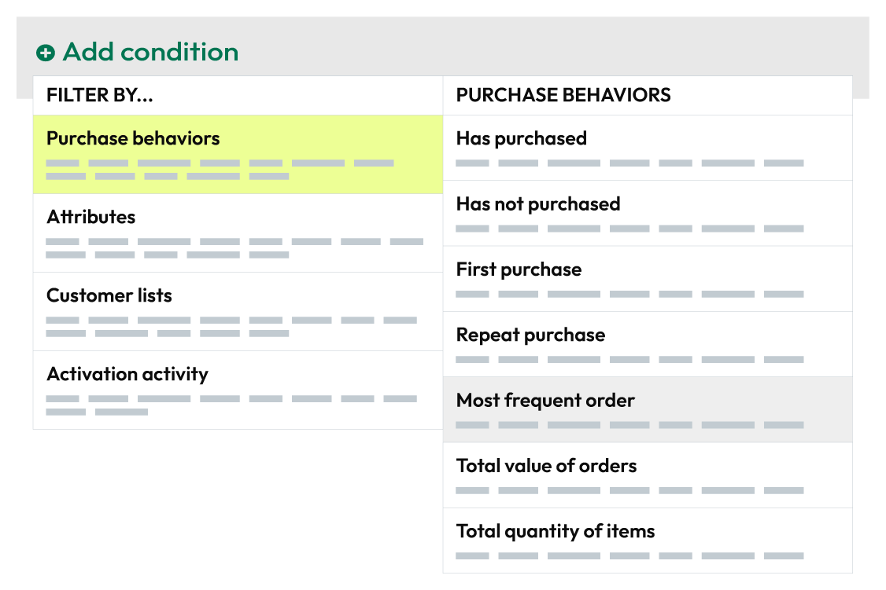

.. https://docs.amperity.com/reference/

.. meta::
    :description lang=en:
        Which products were most frequently ordered by your customers?

.. meta::
    :content class=swiftype name=body data-type=text:
        Which products were most frequently ordered by your customers?

.. meta::
    :content class=swiftype name=title data-type=string:
        Most frequent order

==================================================
Most frequent order
==================================================

.. attribute-purchase-behavior-most-frequent-order-start

**Most Frequent Order** returns the products that each of your customers ordered most frequently during your chosen date range and at the frequency you have defined. For example, return a list of customers whose most frequent purchase within the last 30 days was tacos:

.. important:: You must choose the order datetime value, and then any of category, subcategory, description, gender, and store ID.

After you choose at least one product and specify a date range you may apply filters to associate your customers orders with specific products, brands, channels, and stores. For example, return a list of customers who most frequently ordered deluxe tacos in Goleta, CA.

.. attribute-purchase-behavior-most-frequent-order-end

.. _attribute-purchase-behavior-most-frequent-order-howitworks:

How this attribute works
==================================================

.. attribute-purchase-behavior-most-frequent-order-howitworks-start

**Most Frequent Order** represents a common approach people use when they build segments: figure out what your customers purchased most often within a certain time window, and then associate that list of customers to your marketing campaigns.

**Most Frequent Order** is a *compound attribute*, which means that it is built from a combination of attributes that already exist in your data, and then appears as a single attribute that you can choose from the **Segment Editor**.

With this attribute, you can focus less on SQL and more on finding answers that align to your marketing goals and strategies. Purchase behavior attributes simplify the number of steps that are required to associate a list of customers to your products, stores, channels, and brands.

.. attribute-purchase-behavior-most-frequent-order-howitworks-end

.. attribute-purchase-behavior-most-frequent-order-howitworks-sql-start

.. admonition:: How does the SQL for Most Frequent Order work?

   **Most Frequent Order** is built from standard columns that are output by Amperity. The following example returns a list of customers whose most frequent purchase within the last 30 days was tacos:

   .. image:: ../../images/attribute-purchase-behavior-most-frequent-order-example.png
      :width: 500 px
      :alt: Customers who bought a lot of tacos.
      :align: left
      :class: no-scaled-link

   The SQL for **Most Frequent Order** works like this. It uses a count of distinct order IDs from the **Unified Itemized Transactions** table as its starting point, and requires at least one product category, product subcategory, product gender, or store ID to be selected:

   ::

      SELECT
        amperity_id
        ,product_category
        ,product_subcategory
        ,store_id
        ,RANK() OVER (PARTITION BY amperity_id ORDER BY COUNT(DISTINCT order_id) DESC) AS frequency_rank
      FROM Unified_Itemized_Transactions

   then uses the |sql_presto_function_rank| function to determine order frequency, then ranks them in descending order, and then returns all items that match the date range:

   ::

      WHERE order_datetime < DATE_TRUNC('day', CURRENT_TIMESTAMP - interval '30' day)

   Returns and cancellations are filtered out automatically, like this:

   ::

      AND (is_return IS NULL OR (NOT is_return))
      AND (is_cancellation IS NULL OR (NOT is_cancellation))

   and then results are grouped by Amperity ID and any selected filter attributes:

   ::

      GROUP BY amperity_id, product_category, product_subcategory, store_id

   From that list of customers, **Most Frequent Order** uses another SELECT statement to return only customers who purchased most frequently the combination of filter attributes you provided. For example, more than 2 purchases:

   ::

      SELECT DISTINCT
        amperity_id
      FROM list_of_most_frequent_orders
      WHERE frequency_rank = 1
      AND product_category IN 'tacos'
      AND product_subcategory LIKE 'deluxe'
      AND store_id = '0007 (Goleta, CA)'

   This creates a list of customers who most frequently ordered deluxe tacos from your restaurant in Goleta, CA.

.. attribute-purchase-behavior-most-frequent-order-howitworks-sql-end

.. attribute-purchase-behavior-most-frequent-order-view-the-real-sql-start

The SQL for **Most Frequent Order** is more complex than what is described in the previous section. This is due to the way this attribute returns *only* a list of Amperity IDs, uses a series of common table expressions (CTEs), and takes advantage of workflows that Amperity does behind the scenes to pre-filter the product, purchase, and store attributes.

You can view the full SQL for **Most Frequent Order** from the **Segment Editor**. Start a new segment and add only this attribute (along with any required conditions and filter attributes), and then click the **View SQL** link at the top of the page.

.. attribute-purchase-behavior-most-frequent-order-view-the-real-sql-end

.. _attribute-purchase-behavior-most-frequent-order-segments:

Add to segments
==================================================

.. attribute-purchase-behavior-most-frequent-order-segments-start

You can add the **Most frequent order** purchase behavior to a segment from the **Segment Editor**. Click **Add condition**, choose **Purchase behaviors**, and then select **Most frequent order**.

After the **Most frequent order** purchase behavior attribute has been added, select an operator, and then finish defining the conditions for how this attribute should be applied to the segment.

.. attribute-purchase-behavior-most-frequent-order-segments-end

.. _attribute-purchase-behavior-most-frequent-order-relative-dates:

About relative dates
--------------------------------------------------

.. include:: ../../amperity_reference/source/segment_editor.rst
   :start-after: .. segments-editor-relative-dates-start
   :end-before: .. segments-editor-relative-dates-end

**Relative date values**

.. include:: ../../amperity_reference/source/segment_editor.rst
   :start-after: .. segments-editor-relative-date-values-start
   :end-before: .. segments-editor-relative-date-values-end

.. _attribute-purchase-behavior-most-frequent-order-conditions:

Available operators
==================================================

.. attribute-purchase-behavior-most-frequent-order-conditions-start

The following table lists the operators that are available to this attribute.

.. note:: Recommended operators for this attribute are identified with "|attribute-recommended| **More useful**" and operators with more limited use cases are identified with "|attribute-stop| **Less useful**".

.. list-table::
   :widths: 35 65
   :header-rows: 1

   * - Condition
     - Description
   * - **was after**
     - |attribute-recommended| **More useful**

       Returns a list of customers whose most frequent order was after the specified time window.

   * - **was before**
     - |attribute-recommended| **More useful**

       Returns a list of customers whose most frequent order was before the specified time window.

   * - **was between**
     - |attribute-recommended| **More useful**

       Returns a list of customers whose most frequent order was between two specified time windows.

   * - **was not between**
     - Returns a list of customers whose most frequent order was not between two specified time windows.

   * - **was not on**
     - Returns a list of customers whose most frequent order was not on the specified time.

   * - **was on**
     - Returns a list of customers whose most frequent order was on the specified time.

.. attribute-purchase-behavior-most-frequent-order-conditions-end

.. _attribute-purchase-behavior-most-frequent-order-filter-attributes:

Filter attributes
==================================================

.. include:: ../../amperity_reference/source/attribute_purchase_behavior_first_purchase.rst
   :start-after: .. attribute-purchase-behavior-first-purchase-filter-attributes-start
   :end-before: .. attribute-purchase-behavior-first-purchase-filter-attributes-end
