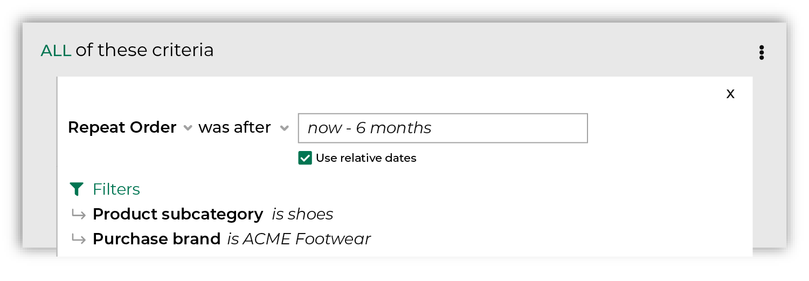

.. https://docs.amperity.com/reference/

.. meta::
    :description lang=en:
        Who made a repeat purchase during the specified date range?

.. meta::
    :content class=swiftype name=body data-type=text:
        Who made a repeat purchase during the specified date range?

.. meta::
    :content class=swiftype name=title data-type=string:
        Repeat purchase

==================================================
Repeat purchase
==================================================

.. attribute-purchase-behavior-repeat-purchase-start

**Repeat purchase** returns a list of customers who have made a repeat purchase during the chosen date range. For example, return all customers who made a repeat purchase within the previous 6 months:

.. important:: **Repeat purchase** identifies a repeat purchase by comparing purchases within the chosen date range to all purchases. For example, a customer who first purchased 2 years ago, and then purchased again last month would be returned by a relative date range "today - 1 month". A customer who first purchased 10 years ago, and then purchased again last month would also be returned. As well as a customer who first purchased 2 months ago, and then purchased again last month.

After you specify a date range you may apply filters to associate repeat orders to specific products, brands, channels, and stores. For example, return all customers who made a repeat purchase of shoes from your ACME Footwear brand.

.. attribute-purchase-behavior-repeat-purchase-end

.. _attribute-purchase-behavior-repeat-purchase-howitworks:

How this attribute works
==================================================

.. attribute-purchase-behavior-repeat-purchase-howitworks-start

**Repeat purchase** represents a common approach people use when they build segments: find customers who have purchased more than one time within a time window, and then associate those customers to specific products and brands.

**Repeat purchase** is a *compound attribute*, which means that it is built from a combination of attributes that already exist in your data, and then appears as a single attribute that you can choose from the **Segment Editor**.

With this attribute, you can focus less on SQL and more on finding answers that align to your marketing goals and strategies. Purchase behavior attributes simplify the number of steps that are required to associate a list of customers to your products, stores, channels, and brands.

.. attribute-purchase-behavior-repeat-purchase-howitworks-end

.. attribute-purchase-behavior-repeat-purchase-howitworks-sql-start

.. admonition:: How does the SQL for Repeat Order work?

   **Repeat purchase** is built from standard columns that are output by Amperity. The following example returns a list of customers who have purchased at least one component of a game during the previous 3 years:

   .. image:: ../../images/attribute-purchase-behavior-repeat-purchase-example.png
      :width: 500 px
      :alt: Customers who own the base game and need to buy an expansion pack.
      :align: left
      :class: no-scaled-link

   The SQL for **Repeat purchase** works like this. It uses two common table expressions (CTEs) to find two lists: a list of first orders and a list of distinct orders.

   To build the list of first orders, **Repeat purchase** uses order datetime from the **Unified Itemized Transactions** table as its starting point:

   ::

      SELECT
        amperity_id
        ,order_datetime AS first_order_datetime
        ,RANK() OVER (PARTITION BY amperity_id ORDER BY order_datetime, order_id) AS order_rank
      FROM Unified_Itemized_Transactions

   then uses the |sql_presto_function_rank| function to identify which of those orders were repeat orders, and then returns all items that match two conditions: order rank and a date range:

   ::

      WHERE order_rank = 1
      AND order_datetime < DATE_TRUNC('day', CURRENT_TIMESTAMP - interval '36' month)

   This returns the first order for all customers who purchased during the previous 3 years.

   Returns and cancellations are filtered out automatically, like this:

   ::

      AND (is_return IS NULL OR (NOT is_return))
      AND (is_cancellation IS NULL OR (NOT is_cancellation))

   To build the list of distinct orders, **Repeat purchase** uses order datetime from the **Unified Itemized Transactions** table to find all of the distinct orders that were made during the same time period:

   ::

      SELECT DISTINCT
        uit.amperity_id
      FROM (
        SELECT
          amperity_id
          ,order_datetime AS distinct_order_datetime
        FROM Unified_Itemized_Transactions
      )

   To identify which customers made a repeat purchase during this time window, the first order CTE is joined to the distinct order CTE:

   ::

      INNER JOIN first_order_datetime
      ON distinct_order_datetime

   (Note that "first_order_datetime" and "distinct_order_datetime" names do not represent the real names of the CTEs that are joined; these names identify the two sources that are joined together as part of the steps within the SQL that identify your repeat customers.)

   Returns and cancellations are then filtered out automatically, like this:

   ::

      AND (
        is_return IS NULL
        OR (NOT is_return)
      )

   You may then filter this list of customers more by applying any of the product, purchase, and store filters. When you select these filters, they are added to the WHERE statement, like this:

   ::

      AND product_category = 'game'
      AND product_subcategory IN ('base', 'expansion', 'pack')
      AND purchase_brand = 'Fearless Creatures'

.. attribute-purchase-behavior-repeat-purchase-howitworks-sql-end

.. attribute-purchase-behavior-repeat-purchase-view-the-real-sql-start

The SQL for **Repeat purchase** is more complex than what is described in the previous section. This is due to the way this attribute returns *only* a list of Amperity IDs, uses a series of common table expressions (CTEs), and takes advantage of workflows that Amperity does behind the scenes to pre-filter the product, purchase, and store attributes.

You can view the full SQL for **Repeat purchase** from the **Segment Editor**. Start a new segment and add only this attribute (along with any required conditions and filter attributes), and then click the **View SQL** link at the top of the page.

.. attribute-purchase-behavior-repeat-purchase-view-the-real-sql-end

.. _attribute-purchase-behavior-repeat-purchase-segments:

Add to segments
==================================================

.. attribute-purchase-behavior-repeat-purchase-segments-start

You can add the **Repeat purchase** behavior to a segment from the **Segment Editor**. Click **Add condition**, choose **Purchase behaviors**, and then select **Repeat purchase**.

After the **Repeat purchase** behavior attribute has been added, select an operator, and then finish defining the conditions for how this attribute should be applied to the segment.

.. attribute-purchase-behavior-repeat-purchase-segments-end

.. _attribute-purchase-behavior-repeat-purchase-relative-dates:

About relative dates
--------------------------------------------------

.. include:: ../../amperity_reference/source/segments_editor.rst
   :start-after: .. segments-editor-relative-dates-start
   :end-before: .. segments-editor-relative-dates-end

**Relative date values**

.. include:: ../../amperity_reference/source/segments_editor.rst
   :start-after: .. segments-editor-relative-date-values-start
   :end-before: .. segments-editor-relative-date-values-end

.. _attribute-purchase-behavior-repeat-purchase-conditions:

Available operators
==================================================

.. attribute-purchase-behavior-repeat-purchase-conditions-start

The following table lists the operators that are available to this attribute.

.. note:: Recommended operators for this attribute are identified with "|attribute-recommended| **More useful**" and operators with more limited use cases are identified with "|attribute-stop| **Less useful**".

.. list-table::
   :widths: 35 65
   :header-rows: 1

   * - Condition
     - Description
   * - **was after**
     - |attribute-recommended| **More useful**

       Returns a list of customers where repeat purchases were after the specified time window.

   * - **was before**
     - |attribute-recommended| **More useful**

       Returns a list of customers where repeat purchases were before the specified time window.

   * - **was between**
     - |attribute-recommended| **More useful**

       Returns a list of customers where repeat purchases were between two specified time windows.

   * - **was not between**
     - |attribute-stop| **Less useful**

       Returns a list of customers where repeat purchases were not between two specified time windows.

   * - **was not on**
     - |attribute-stop| **Less useful**

       Returns a list of customers where repeat purchases were not on the specified date.

   * - **was on**
     - Returns a list of customers where repeat purchases were on the specified date.

.. attribute-purchase-behavior-repeat-purchase-conditions-end

.. _attribute-purchase-behavior-repeat-purchase-filter-attributes:

Filter attributes
==================================================

.. include:: ../../amperity_reference/source/attribute_purchase_behavior_first_purchase.rst
   :start-after: .. attribute-purchase-behavior-first-purchase-filter-attributes-start
   :end-before: .. attribute-purchase-behavior-first-purchase-filter-attributes-end
