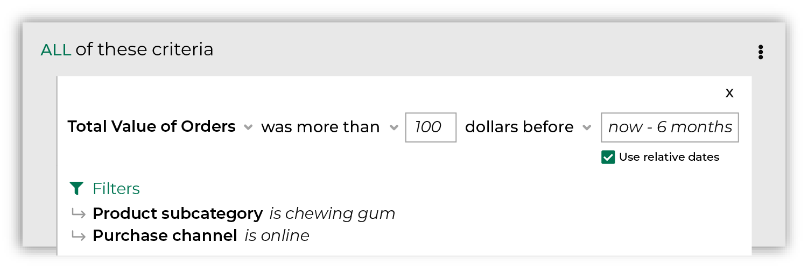
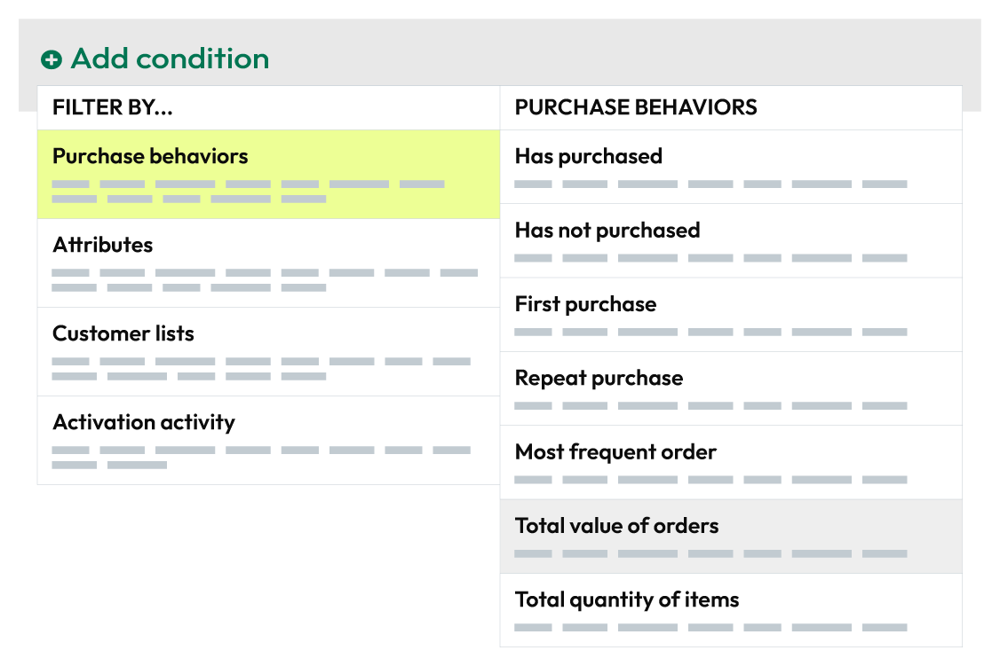

.. https://docs.amperity.com/reference/

.. meta::
    :description lang=en:
        All of the revenue for all of the items that were purchased across all orders within the selected date range.

.. meta::
    :content class=swiftype name=body data-type=text:
        All of the revenue for all of the items that were purchased across all orders within the selected date range.

.. meta::
    :content class=swiftype name=title data-type=string:
        Total value of orders

==================================================
Total value of orders
==================================================

.. attribute-purchase-behavior-total-value-of-orders-start

**Total Value of Orders** adds together all of the revenue for all of the items that customers purchased across all orders that match the value and occurred during your chosen date range. For example, return all customers who spent more than $100 during the previous six months:

After you specify a value and date range you may apply filters to associate these customers to specific products, brands, channels, and stores. For example, return all customers who spent at least 100 dollars within the previous six months on chewing gum and purchased from your website.

.. attribute-purchase-behavior-total-value-of-orders-end

.. _attribute-purchase-behavior-total-value-of-orders-howitworks:

How this attribute works
==================================================

.. attribute-purchase-behavior-total-value-of-orders-howitworks-start

**Total Value of Orders** represents a common approach people use when they build segments: find my customers by spend across a time window, and then associate those customers to specific products and brands.

**Total Value of Orders** is a *compound attribute*, which means that it's built from a combination of attributes that already exist in your data, and then appears as a single attribute that you can choose from the **Segment Editor**.

With this attribute, you can focus less on SQL and more on finding answers that align to your marketing goals and strategies. Purchase behavior attributes simplify the number of steps that are required to associate a list of customers to your products, stores, channels, and brands.

.. attribute-purchase-behavior-total-value-of-orders-howitworks-end

.. attribute-purchase-behavior-total-value-of-orders-howitworks-sql-start

.. admonition:: How does the SQL for Total Value of Orders work?

   **Total Value of Orders** is built from standard columns that are output by Amperity. The following example returns a list of customers who purchased more than $100 during the previous six months:

   .. image:: ../../images/attribute-purchase-behavior-total-value-of-orders-example.png
      :width: 500 px
      :alt: Customers who buy a lot of chewing gum every six months.
      :align: left
      :class: no-scaled-link

   The SQL for **Total Value of Orders** works like this. It uses the sum of item revenue from the **Unified Itemized Transactions** table as its starting point:

   ::

      SELECT
        amperity_id
        ,SUM(item_revenue) AS purchase_value
      FROM Unified_Itemized_Transactions

   then returns all items that match two conditions: purchase value and a date range, and then groups them by Amperity ID:

   ::

      WHERE order_datetime < DATE_TRUNC('day', CURRENT_TIMESTAMP - interval '6' month)
      AND purchase_value > 100
      GROUP BY amperity_id

   In this example, only transactions that occurred within the previous 6 months are returned, grouped by Amperity ID and aggregated by item revenue, after which they are filtered to include only customers who purchased more than $100.

   Returns and cancellations are filtered out automatically, like this:

   ::

      AND (is_return IS NULL OR (NOT is_return))
      AND (is_cancellation IS NULL OR (NOT is_cancellation))

   You may then filter this list of customers more by applying any of the product, purchase, and store filters. When you select these filters, they are added to the WHERE statement, like this:

   ::

      AND product_subcategory = 'chewing gum'
      AND purchase_channel = 'online'

.. attribute-purchase-behavior-total-value-of-orders-howitworks-sql-end

.. attribute-purchase-behavior-total-value-of-orders-view-the-real-sql-start

The SQL for **Total Value of Orders** is more complex than what is described in the previous section. This is due to the way this attribute returns *only* a list of Amperity IDs, uses a series of common table expressions (CTEs), and takes advantage of workflows that Amperity does behind the scenes to pre-filter the product, purchase, and store attributes.

You can view the full SQL for **Total Value of Orders** from the **Segment Editor**. Start a new segment and add only this attribute (along with any required conditions and filter attributes), and then click the **View SQL** link at the top of the page.

.. attribute-purchase-behavior-total-value-of-orders-view-the-real-sql-end

.. _attribute-purchase-behavior-total-value-of-orders-segments:

Add to segments
==================================================

.. attribute-purchase-behavior-total-value-of-orders-segments-start

You can add the **Total value of orders** purchase behavior to a segment from the **Segment Editor**. Click **Add condition**, choose **Purchase behaviors**, and then select **Total value of orders**.

After the **Total value of orders** purchase behavior attribute has been added, select an operator, and then finish defining the conditions for how this attribute should be applied to the segment.

.. attribute-purchase-behavior-total-value-of-orders-segments-end

.. _attribute-purchase-behavior-total-value-of-orders-relative-dates:

About relative dates
--------------------------------------------------

.. include:: ../../amperity_reference/source/segments_editor.rst
   :start-after: .. segments-editor-relative-dates-start
   :end-before: .. segments-editor-relative-dates-end

**Relative date values**

.. include:: ../../amperity_reference/source/segments_editor.rst
   :start-after: .. segments-editor-relative-date-values-start
   :end-before: .. segments-editor-relative-date-values-end

.. _attribute-purchase-behavior-total-value-of-orders-conditions:

Available operators
==================================================

.. attribute-purchase-behavior-total-value-of-orders-conditions-start

The following table lists the operators that are available to this attribute.

.. note:: Recommended operators for this attribute are identified with "|attribute-recommended| **More useful**" and operators with more limited use cases are identified with "|attribute-stop| **Less useful**".

.. list-table::
   :widths: 35 65
   :header-rows: 1

   * - Condition
     - Description
   * - **was between**
     - Returns total values that are between two specified values.

   * - **was exactly**
     - Returns total values that match the specified value.

   * - **was less than**
     - Returns total values that are less than the specified value.

   * - **was more than**
     - Returns total values that are greater than the specified value.

.. attribute-purchase-behavior-total-value-of-orders-conditions-end

.. _attribute-purchase-behavior-total-value-of-orders-filter-attributes:

Filter attributes
==================================================

.. include:: ../../amperity_reference/source/attribute_purchase_behavior_first_purchase.rst
   :start-after: .. attribute-purchase-behavior-first-purchase-filter-attributes-start
   :end-before: .. attribute-purchase-behavior-first-purchase-filter-attributes-end
