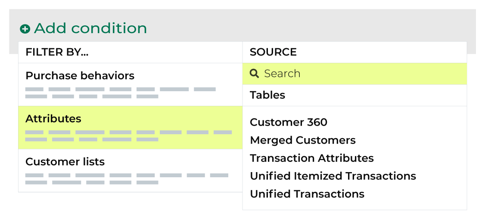

.. https://docs.amperity.com/reference/

.. meta::
    :description lang=en:
        Did your customers make a repeat purchase within the last 365 days?

.. meta::
    :content class=swiftype name=body data-type=text:
        Did your customers make a repeat purchase within the last 365 days?

.. meta::
    :content class=swiftype name=title data-type=string:
        Repeat within 365 days?

==================================================
Repeat within 365 days?
==================================================

.. include:: ../../amperity_ampiq/source/onetime_buyers.rst
   :start-after: .. onetime-buyers-about-start
   :end-before: .. onetime-buyers-about-end

.. attribute-repeat-365-start

Use the following attributes as longer-term indicators of one-time buyers transitioning into becoming repeat customers:

* :ref:`Of first order? <attribute-repeat-365-first>`
* :ref:`Of second order? <attribute-repeat-365-second>`

.. attribute-repeat-365-end

.. _attribute-repeat-365-first:

Of first order?
==================================================

.. include:: ../../shared/terms.rst
   :start-after: .. term-first-order-is-retained-start
   :end-before: .. term-first-order-is-retained-end

.. attribute-repeat-365-first-start

You can identify if a customer made a second purchase within 365 days of their second purchase by adding the **first order is retained** attribute to a segment from the **Segment Editor**. Click **Add condition**, and then choose **Attributes**.

Use the search feature to find "first order". This filters the list of available attributes. Choose **first order is retained** to add the attribute to a segment. Select an operator, and then finish defining the conditions for how this attribute should be applied to the segment.

.. attribute-repeat-365-first-end

.. _attribute-repeat-365-second:

Of second order?
==================================================

.. include:: ../../shared/terms.rst
   :start-after: .. term-second-order-is-retained-start
   :end-before: .. term-second-order-is-retained-end

.. attribute-repeat-365-second-start

You can identify if a customer made a third purchase within 365 days of their second purchase by adding the **second order is retained** attribute to a segment from the **Segment Editor**. Click **Add condition**, and then choose **Attributes**.

Use the search feature to find "second order". This filters the list of available attributes. Choose **second order is retained** to add the attribute to a segment. Select an operator, and then finish defining the conditions for how this attribute should be applied to the segment.

.. attribute-repeat-365-second-end

.. _attribute-repeat-365-conditions:

Available operators
==================================================

.. attribute-repeat-365-conditions-start

The following table lists the operators that are available to these attributes.

.. note:: These attributes have a Boolean data type. All Boolean data types share the same set of operators. Recommended operators for this attribute are identified with "|attribute-recommended| **More useful**" and operators with more limited use cases are identified with "|attribute-stop| **Less useful**".

.. list-table::
   :widths: 35 65
   :header-rows: 1

   * - Operator
     - Description
   * - **is false**
     - |attribute-recommended| **More useful**

       Returns a list of customers who do not made a repeat purchase within the specified time window.

   * - **is not NULL**
     - Returns a list of customers who did *or* did not make a repeat purchase within the specified time window.

   * - **is NULL**
     - Returns customer records that do not have information about repeat orders.

   * - **is true**
     - |attribute-recommended| **More useful**

       Returns a list of customers who have made repeat orders.

.. attribute-repeat-365-conditions-end
