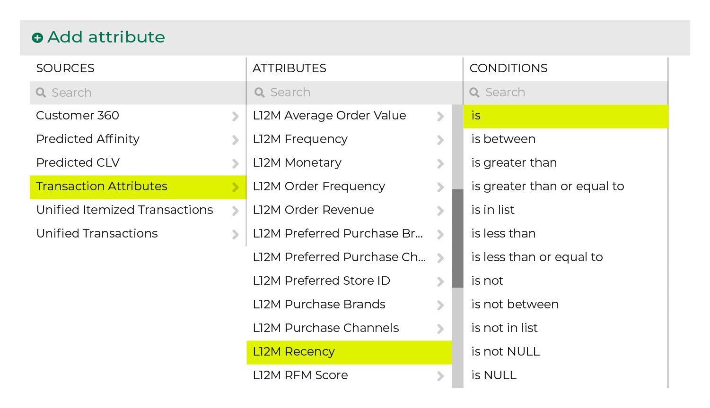
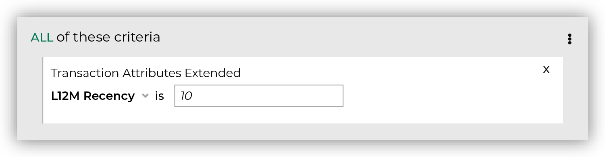
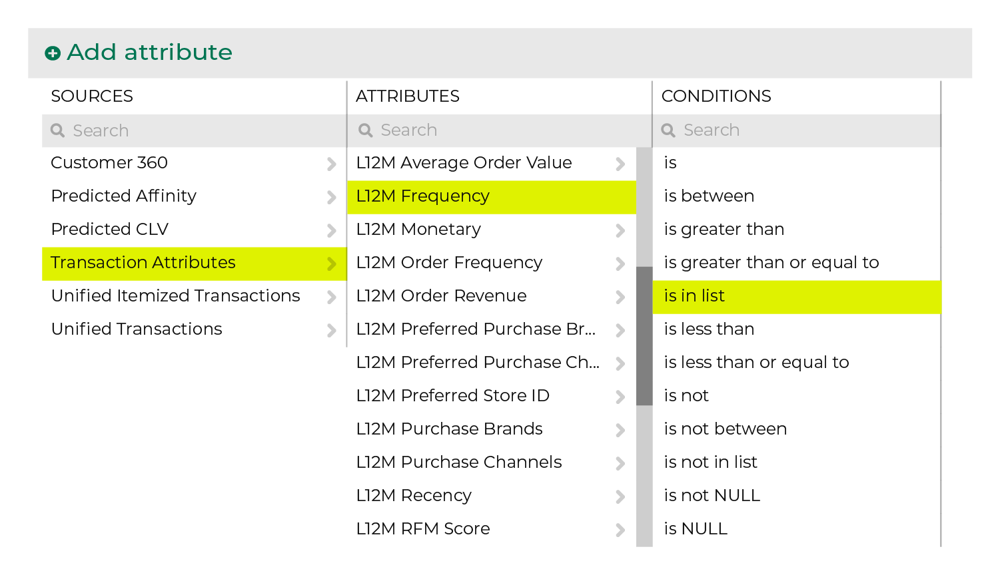
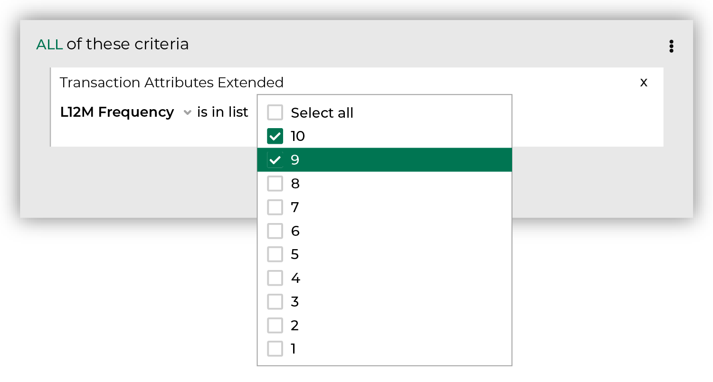
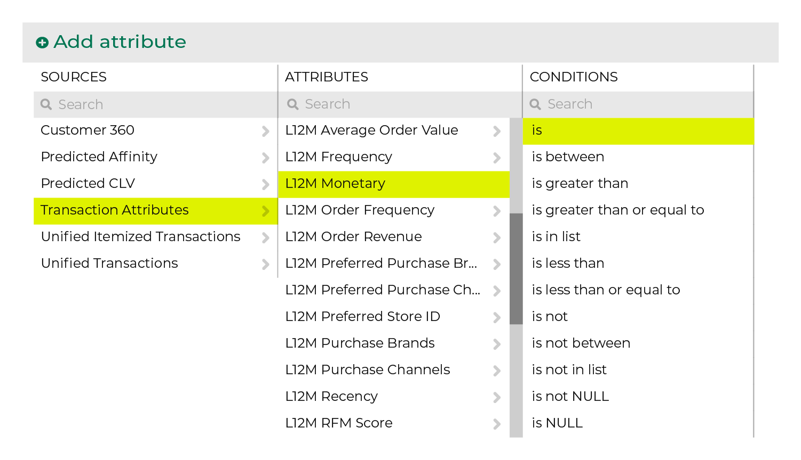
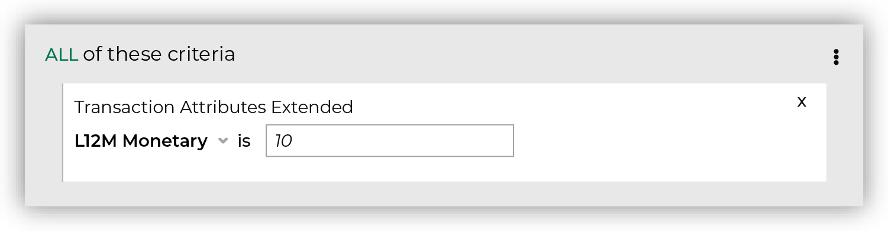
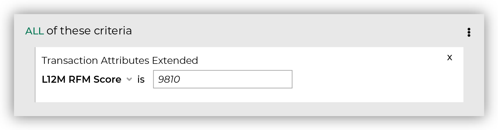
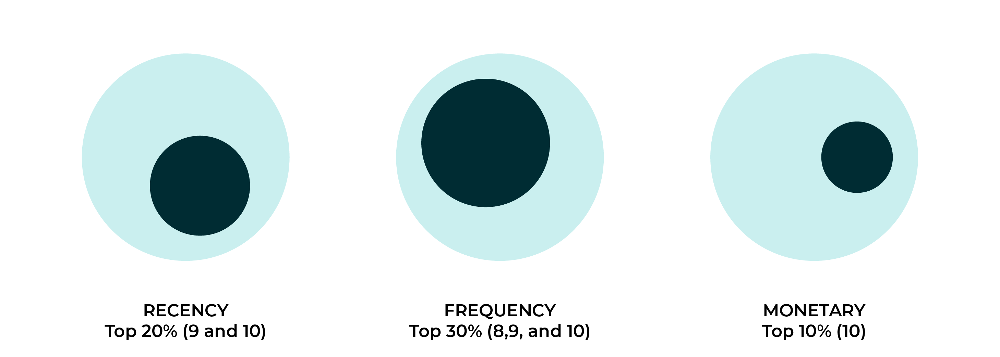

.. 
.. https://docs.amperity.com/reference/
.. 

.. meta::
    :description lang=en:
        An RFM score is an approximation that measures individual scores for recency, frequency, and monetary, along with a combined score.

.. meta::
    :content class=swiftype name=body data-type=text:
        An RFM score is an approximation that measures individual scores for recency, frequency, and monetary, along with a combined score.

.. meta::
    :content class=swiftype name=title data-type=string:
        Approximate RFM

==================================================
Approximate RFM
==================================================

.. include:: ../../shared/terms.rst
   :start-after: .. term-rfm-start
   :end-before: .. term-rfm-end

.. attribute-rfm-whatis-start

.. admonition:: What is an RFM score?

   An RFM score is an approximation that measures three data points:

   #. A :ref:`recency score (R) <attribute-rfm-recency>` that sorts customers by how recently they purchased during the previous 12 months.
   #. A :ref:`frequency score (F) <attribute-rfm-frequency>` that sorts customers by purchase frequency during the previous 12 months.
   #. A :ref:`monetary score (M) <attribute-rfm-monetary>` that score that sorts customers by spend amount during the previous 12 months.

   These individual scores can be combined into a single score (RFM).

.. attribute-rfm-whatis-end

.. attribute-rfm-start

Use approximate RFM (recency, frequency, monetary, and combined score) attributes to build segments that support many types of use cases.

Approximate RFM attributes include:

* :ref:`Attributes for recency, frequency, and monetary <attribute-rfm-individual>`, the three components of an RFM score
* :ref:`Score <attribute-rfm-score>`

.. attribute-rfm-end

.. _attribute-rfm-examples:

Examples
==================================================

.. attribute-rfm-examples-start

The following topics contain examples of using approximate RFM scores:

* |usecase_rfm_top_20_percent_revenue|

.. attribute-rfm-examples-end

.. _attribute-rfm-individual:

Recency, frequency, and monetary
==================================================

.. attribute-rfm-individual-start

You can access individual RFM scores directly from the **Segment Editor**. To add any of these attributes to your segment, To add these attributes to your segment, click **Add condition** and then **Add attribute**. Select the **Transaction Attributes Extended** source, select **L12M Frequency**, **L12M Monetary**, or **L12M Recency**, and then apply an condition.

.. attribute-rfm-individual-end

.. _attribute-rfm-recency:

L12M Recency
--------------------------------------------------

.. attribute-rfm-recency-start

**L12M Recency** is a score that sorts customers by how recently they purchased during the previous 12 months.

.. attribute-rfm-recency-end

.. include:: ../../amperity_ampiq/source/attribute_rfm.rst
   :start-after: .. attribute-rfm-scoring-start
   :end-before: .. attribute-rfm-scoring-end

.. attribute-rfm-recency-find-start

To find customers who purchased most recently, start with the **L12M Recency** attribute in the **Transaction Attributes Extended** table, set its condition to **is**, and then specify a percentile. For example, use "10" to find customers who are in the top 10% for most recent purchases.

.. attribute-rfm-recency-find-end

.. attribute-rfm-recency-filters-start

The attribute will appear in your segment like this:

.. attribute-rfm-recency-filters-end

.. _attribute-rfm-frequency:

L12M Frequency
--------------------------------------------------

.. attribute-rfm-frequency-start

**L12M Frequency** is a score that sorts customers by purchase frequency during the previous 12 months.

.. attribute-rfm-frequency-end

.. include:: ../../amperity_ampiq/source/attribute_rfm.rst
   :start-after: .. attribute-rfm-scoring-start
   :end-before: .. attribute-rfm-scoring-end

.. attribute-rfm-frequency-find-start

To find which customers purchased most frequently during the previous 12 months, start with the **L12M Frequency** attribute in the **Transaction Attributes Extended** table, set its condition to **is in list**, and then specify percentiles. For example, use "10" and "9" to find customers who are in the top 20% for purchase frequency.

.. attribute-rfm-frequency-find-end

.. attribute-rfm-frequency-filters-start

The attribute will appear in your segment like this:

.. attribute-rfm-frequency-filters-end

.. _attribute-rfm-monetary:

L12M Monetary
--------------------------------------------------

.. attribute-rfm-monetary-start

**L12M Monetary** is a score that sorts customers by spend amount during the previous 12 months.

.. attribute-rfm-monetary-end

.. include:: ../../amperity_ampiq/source/attribute_rfm.rst
   :start-after: .. attribute-rfm-scoring-start
   :end-before: .. attribute-rfm-scoring-end

.. attribute-rfm-monetary-find-start

To find customers who spent the most money during the previous 12 months, start with the **L12M Monetary** attribute in the **Transaction Attributes Extended** table, set its condition to **is**, and then specify a percentile. For example, use "10" to find customers who are in the top 10% for spend amount.

.. attribute-rfm-monetary-find-end

.. attribute-rfm-monetary-filters-start

The attribute will appear in your segment like this:

.. attribute-rfm-monetary-filters-end

.. _attribute-rfm-score:

Combined RFM scores
==================================================

.. attribute-rfm-score-start

The RFM score for the customer is based on transactions that occurred within the last 12 months. The RFM score is represented as an integer between "111" and "101010". This is a concatenated score that uses each of the individual recency, frequency, and monetary scores. The order is recency, then frequency, and then monetary.

For example, you can build an audience that contains your top 20% customers for recency, your top 30% customers for frequency, and your top 10% customers for monetary by setting the **L12M RFM Score** attribute to "9810" (or "9" for recency, "8" for frequency, and then "10" for monetary).

.. attribute-rfm-score-end

.. attribute-rfm-score-tip-start

.. note:: Unlike the individual RFM score attributes, the combined score for each attribute represents the lowest percentage group to include, and then includes all higher percentage groups. For example, if you set frequency to "8" it will return "8", "9", and "10", or your top 30%.

   This is different from the individual attributes where you could return your middle 30% by setting the **L12M Frequency** attribute to "5", "6", and "7".

   .. image:: ../../images/attribute-rfm-frequency-example-middle-30.png
      :width: 600 px
      :alt: Find approximate RFM frequency for middle 30 percent.
      :align: left
      :class: no-scaled-link

.. attribute-rfm-score-tip-end

.. attribute-rfm-score-context-start

You can access combined approximate RFM scores directly from the **Segment Editor**. To add this attribute to your segment, To add these attributes to your segment, click **Add condition** and then **Add attribute**. Select the **Transaction Attributes Extended** source, select the **L12M RFM Score** attribute, and then apply an condition.

.. attribute-rfm-score-context-end

.. _attribute-rfm-score-howitworks:

How combined RFM scores work
--------------------------------------------------

.. attribute-rfm-score-howitworks-start

A combined RFM score returns a list of customers who meet the requirement for each individual RFM score, i.e. recency AND frequency AND monetary. An RFM score of "9810" represents three individual scores. The following diagram shows individual RFM scores for individual recency ("9"), frequency ("8"), and monetary ("10"). The darker color represents the  scores:

The combined score returns customers who met each requirement. This is often a much smaller list of customers than each individual RFM score and is not a percentile. The following diagram shows the overlap and the white section represents the much smaller list of customers who met each of the individual RFM scores.

.. attribute-rfm-score-howitworks-end

.. _attribute-rfm-conditions:

Available conditions
==================================================

.. attribute-rfm-individual-conditions-start

The following table lists the conditions that are available to these attributes.

.. note:: These attributes have an Integer data type. All Integer data types share the same set of conditions. Recommended conditions for this attribute are identified with "|attribute-recommended| **More useful**" and conditions with more limited use cases are identified with "|attribute-stop| **Less useful**".

.. list-table::
   :widths: 35 65
   :header-rows: 1

   * - Condition
     - Description
   * - **is**
     - Returns customer records with an approximate RFM score that matches the specified score.

   * - **is between**
     - Returns customer records with an approximate frequency, monetary, or recency score that is between the specified scores, not including the specified score.

   * - **is greater than**
     - Returns customer records with an approximate frequency, monetary, or recency score that is greater than the specified score, not including the specified score.

   * - **is greater than or equal to**
     - Returns customer records with an approximate frequency, monetary, or recency score that is greater than or equal to the specified score, including the specified score.

   * - **is in list**
     - Returns customer records with an approximate frequency, monetary, or recency score that matches the scores that are specified in the list.

   * - **is less than**
     - Returns customer records with an approximate frequency, monetary, or recency score that is less than the specified score, not including the specified score.

   * - **is less than or equal to**
     - Returns customer records with an approximate frequency, monetary, or recency score that is less than or equal to the specified score, including the specified score.

   * - **is not**
     - |attribute-stop| **Less useful**

       Returns customer records with an approximate frequency, monetary, or recency score that does not match the specified score.

   * - **is not between**
     - |attribute-stop| **Less useful**

       Returns customer records with an approximate frequency, monetary, or recency score that is not between the specified scores, not including the specified score.

   * - **is not in list**
     - |attribute-stop| **Less useful**

       Returns customer records with an approximate frequency, monetary, or recency score that does not match the scores that are specified in the list.

   * - **is not NULL**
     - Returns customer records that have a value.

   * - **is NULL**
     - Returns customer records that do not have a value.

.. attribute-rfm-individual-conditions-end
