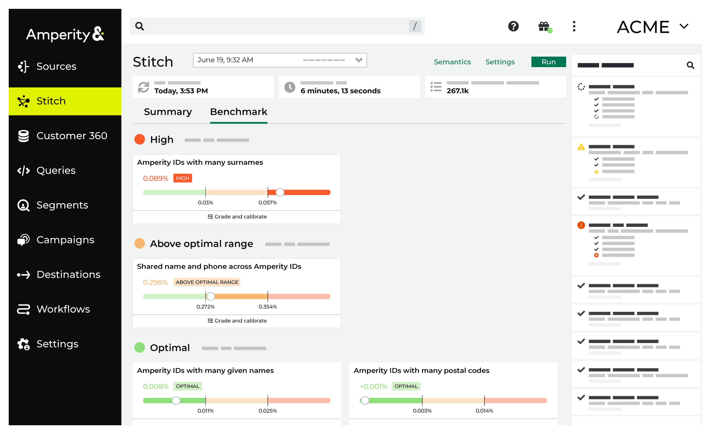
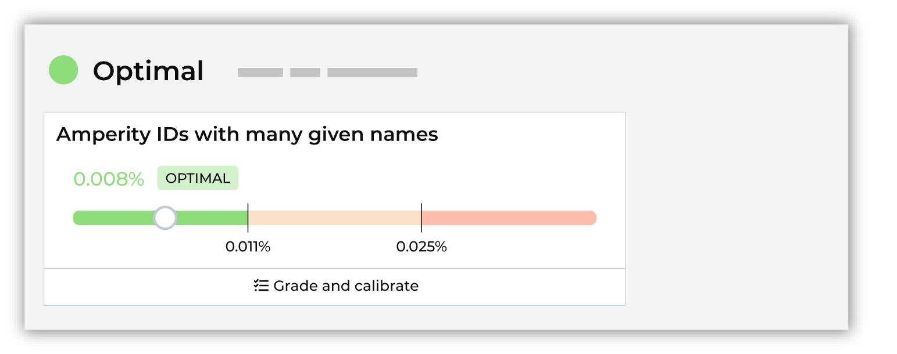
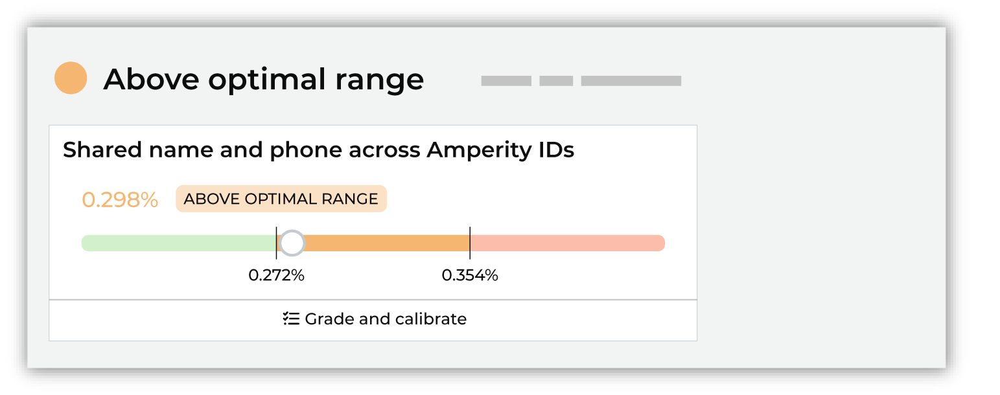
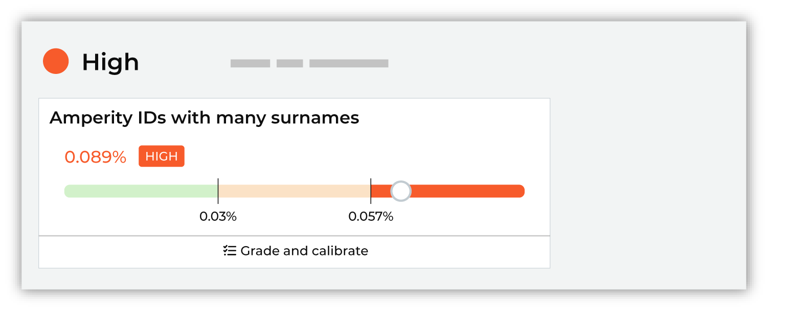
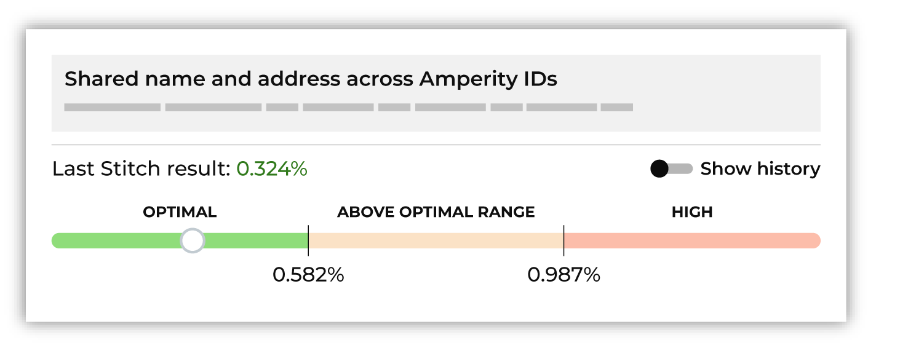
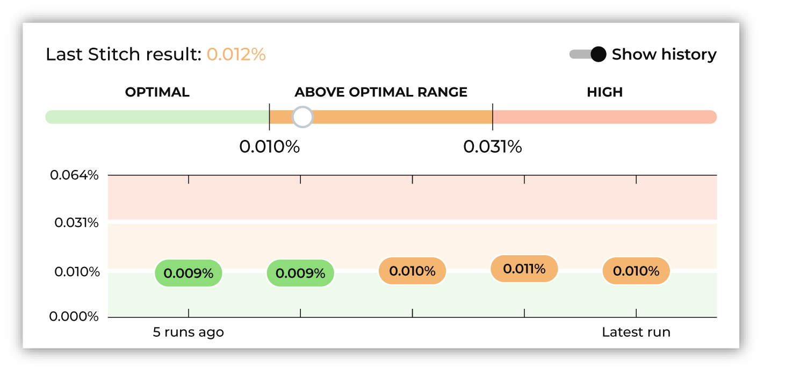

.. https://docs.amperity.com/reference/

.. meta::
    :description lang=en:
        Stitch benchmarks are heuristic scores that define the expectations for the quality of customer profiles that are output by Stitch.

.. meta::
    :content class=swiftype name=body data-type=text:
        Stitch benchmarks are heuristic scores that define the expectations for the quality of customer profiles that are output by Stitch.

.. meta::
    :content class=swiftype name=title data-type=string:
        Stitch benchmarks

==================================================
About Stitch benchmarks
==================================================

.. stitch-benchmark-start

Stitch benchmarks are heuristic scores that define the expectations for the quality of customer profiles that are output by Stitch. Each benchmark evaluates your brand's data and compares it to a baseline score.

Use benchmarks to explore data quality, directly provide feedback to the quality of Stitch results, and to explore configuration changes that can help improve the quality of customer profiles in your tenant.

.. stitch-benchmark-end

.. _stitch-benchmark-status:

Benchmark status page
==================================================

.. stitch-benchmark-status-start

Stitch benchmarks are available from the **Stitch** page in your Amperity tenant. Open the **Benchmarks** tab to review the overall status for Stitch benchmark checks in your tenant.

The outcome of Stitch benchmark checks are grouped by color on the **Benchmarks** tab.

* Red indicates that :ref:`results are high <stitch-benchmark-results-high>`.
* Orange indicates that :ref:`results are above the optimal range <stitch-benchmark-results-above-optimal>`.
* Green indicates that :ref:`results fall within the optimal range <stitch-benchmark-results-optimal>`.

For each benchmark check on the **Benchmarks** tab you can click to open the benchmark, and :ref:`explore details <stitch-benchmark-cards-details>`, the :ref:`previous five benchmark scores <stitch-benchmark-cards-history>`, :ref:`interpretations <stitch-benchmark-cards-interpretations>`, and a link to open a dialog box from which you can :ref:`review and grade a representative sample <stitch-benchmark-cards-grade-and-calibrate>` of 10 examples.

.. stitch-benchmark-status-end

.. _stitch-benchmark-checks:

Benchmark checks
==================================================

.. stitch-benchmark-checks-start

Stitch collects data that your brand has provided to Amperity, runs, and then outputs a series of tables that contain the results. There is no "ground truth" dataset for your brand against which Amperity can compare Amperity IDs to validate identity, which prevents using standard error metrics to evaluate the quality of Stitch output.

A benchmark check is a heuristic that defines how often Amperity IDs are expected to meet a certain condition. For example, Amperity expects no more than 0.011% of your Amperity IDs to be associated with more than three given names.

Each benchmark check measures the percentage of Amperity IDs meeting its respective condition and compares the result against the optimal range. A benchmark check result can fall into the optimal range, above the optimal range, or far above the optimal range (high).

For example, it is expected that most, but not all, Amperity IDs should not have more than three given names. It is possible for an Amperity ID to be correctly associated with more than three given names for valid reasons such as differences in data capture, the presence of typos, use of nicknames, name changes, and so on. A higher-than-expected rate of Amperity IDs (generally) associated with more than three given names may be an indicator that Stitch is clustering records together too aggressively.

.. stitch-benchmark-checks-end

.. stitch-benchmark-checks-important-start

.. important:: Stitch is complex and perfection of Stitch results should not be the goal. A benchmark score that falls outside of an optimal range might not be a bad score. A high benchmark score does not always need to be addressed, at least not right away.

   The purpose of benchmark scores is to provide a visible and direct way of inspecting the quality of customer profiles that exist in your tenant.

   Use benchmark scores to:

   #. Quickly assess the overall quality of customer profiles in your tenant.

   #. Explore example Amperity IDs, especially for those benchmark checks that are high, to identify ways of changing the configuration of your tenant that can lead to overall improvements in benchmark scores.

      Use a sandbox to test configuration changes. Compare the scores in the sandbox to the scores in production.

   #. Improve your understanding of how Stitch builds customer profiles based on the data sources that your brand has provided to Amperity.

   #. Identify specific areas of improvement, such as updating semantic tags in feeds or custom domain tables, changing the set of domain tables that are made available to Stitch, or identifying a foreign key or separation key that is causing issues with cluster quality.

      Look for themes and address them. For example, if a benchmark check shows 7 out of 10 examples all being wrong in the same way, that is a strong indicator that a configuration change should improve cluster quality. If all 10 examples are different you can mark them as edge cases and move on.

      Think about the big picture: the overwhelming percentage of customer profiles are accurate. Benchmark checks look at the edges of that accuracy and give you ways to extend that accuracy to a small percentage of profiles.

      For example, if you find obvious mistakes with the **Amperity IDs with many given names** benchmark check, but the results are optimal, then any changes to that benchmark are likely to have a very small affect on overall cluster quality, even if some individual profiles are incorrect.

.. stitch-benchmark-checks-important-end

.. _stitch-benchmark-results:

Benchmark results
==================================================

.. stitch-benchmark-results-start

Amperity uses benchmark checks to provide insight into the quality of your Stitch results. Results fall into one of the following categories:

* :ref:`Optimal <stitch-benchmark-results-optimal>`
* :ref:`Above optimal range <stitch-benchmark-results-above-optimal>`
* :ref:`High <stitch-benchmark-results-high>`

.. stitch-benchmark-results-end

.. _stitch-benchmark-results-optimal:

Optimal
---------------------------------------------------

.. stitch-benchmark-results-optimal-start

Optimal results represent benchmark check results that fall within the expected range. These results can be "more optimal" and they can be "less optimal".

For most tenants, most of the time, nothing needs to be done when benchmark checks are optimal. In some cases, it might be worth exploring if scores that fall on the edge of optimal scoring and are close to falling outside the optimal range can be improved.

.. stitch-benchmark-results-optimal-end

.. _stitch-benchmark-results-above-optimal:

Above optimal range
---------------------------------------------------

.. stitch-benchmark-results-above-optimal-start

Results that fall above the optimal ranges may be investigated, but it's often not necessary. Compare the history of the scores and determine if anything should be done to try to improve the benchmark results.

Was new data made available to your tenant? Were any changes made to Stitch configuration? Both of these may be the cause of scores falling above the optimal range.

In many cases nothing needs to be done with benchmark checks that fall above the optimal range beyond monitoring the result to see if it continues to increase or if it stabilizes.

.. stitch-benchmark-results-above-optimal-end

.. _stitch-benchmark-results-high:

High
---------------------------------------------------

.. stitch-benchmark-results-high-start

High results do not need to be fixed, but they should be investigated. In many cases, high results indicate that improvements to the quality of Stitch results can be made.

Review and grade the results for benchmark checks with high results by assigning thumbs up or thumbs down to the sample set of records, after which you should click **Next steps**, and then review the list of options that are available to help improve this particular benchmark result.

.. important:: Use a sandbox to make configuration changes to Stitch, and then compare the benchmark results in the sandbox to the high benchmark results in production. Also compare other benchmark results to determine if changes affected the overall quality of benchmark results.

.. stitch-benchmark-results-high-end

.. _stitch-benchmark-cards:

About benchmark cards
==================================================

.. stitch-benchmark-cards-start

Each benchmark card contains a condition summary, such as *Amperity IDs with many given names*, result ("0.125%"), outcome (**Optimal**, **Above optimal**, or **High**), along with a visualization that shows how the benchmark result compares to the optimal range.

.. stitch-benchmark-cards-end

.. _stitch-benchmark-cards-details:

Benchmark details
---------------------------------------------------

.. stitch-benchmark-cards-details-start

Benchmark details show specific information about the condition, such as *The percentage of Amperity ID clusters with more than 3 given names*, a visualization that shows the result in the context of the optimal range, a toggle to show or hide historical results, tips about how to interpret the results, along with any recommended next steps.

.. stitch-benchmark-cards-details-end

.. _stitch-benchmark-cards-history:

History
---------------------------------------------------

.. stitch-benchmark-cards-history-start

Benchmark results are refreshed after every Stitch run. You can view the 5 previous benchmark results by enabling the **Show history** option in the benchmark details dialog.

.. stitch-benchmark-cards-history-end

.. _stitch-benchmark-cards-interpretations:

Interpretations
---------------------------------------------------

.. stitch-benchmark-cards-interpretations-start

Interpretations are provided by each benchmark check. They describe the result and provide an explanation of how to interpret it. For example:

"This is above the expected range and may be an indication of overclustering. A large percentage indicates that different given names are appearing the same cluster, which indicates overclustering."

or:

"This is far above the expected range and may be an indication of overclustering. A large percentage indicates that different postal codes are appearing the same cluster, which indicates overclustering."

When a benchmark score is above the optimal range or high it is recommended to review and grade a set of 10 example clusters, after which the benchmark check will make a series of recommendations that can lead to improved benchmark results.

.. stitch-benchmark-cards-interpretations-end

.. _stitch-benchmark-cards-grade-and-calibrate:

Grade and calibrate
---------------------------------------------------

.. stitch-benchmark-cards-grade-and-calibrate-start

All benchmark checks include example Amperity IDs that can be reviewed and graded. You should periodically review and grade examples for benchmark checks with high results. This helps ensure that Stitch is always building the highest quality customer profiles and can lead to incremental improvements over time.

Depending on the outcome of reviewing and grading benchmark check examples, a series of recommendations may be shown. Stitch configuration settings can be updated directly in the benchmark check.

.. stitch-benchmark-cards-grade-and-calibrate-end

.. TODO: Need mockup here that shows one of the review/grade pages.

.. stitch-benchmark-cards-grade-and-calibrate-howitworks-start

.. admonition:: How does Amperity choose which records are available for grading?

   Amperity uses `stratified random sampling <https://en.wikipedia.org/wiki/Stratified_randomization>`__ |ext_link| to select the examples. A fresh set of examples is generated during each Stitch run.

   #. All clusters (or groups of clusters) that are flagged by the check are collected.

      For example, with the **Amperity IDs with many surnames** check, all clusters with more than 3 surnames are collected.

   #. A rules-based approach is used to determine which of these clusters are likely to be "good" identity decisions and which are likely to be "poor" identity decisions.

      The percentage of clusters that are likely to be "good" identity decisions and the percentage likely to be "poor" identity decisions are identified.

      For example: 70% good, 30% poor.

   #. 10 examples are selected at random using the same rate of "good" and "poor" clusters.

      For example, 7 records will represent "good" identity decisions and 3 records will represent "poor".

      Amperity will make a recommendation for when to rate each example as "good", but cannot identify without input which examples in the random sample represent "good" or "poor" identity decisions.

.. stitch-benchmark-cards-grade-and-calibrate-howitworks-end

.. _stitch-benchmark-check-update-config:

Update Stitch configuration
---------------------------------------------------

.. stitch-benchmark-check-update-config-start

Depending on the outcome of reviewing benchmark check results and examples, a series of recommendations may be shown. Each recommendation represents a change that you can make to Stitch configuration that should lead to improvements in benchmark results.

Changes should be made incrementally. You can review benchmark checks on a daily basis. Review the results, and then make additional incremental changes, if necessary. Monitor the benchmark results after a configuration change for signs of improvement.

.. stitch-benchmark-check-update-config-end

.. _stitch-benchmark-categories:

Benchmark categories
==================================================

.. stitch-benchmark-categories-start

The following sections list benchmark checks by category:

* :ref:`stitch-benchmark-category-overclustering`
* :ref:`stitch-benchmark-category-underclustering`

.. stitch-benchmark-categories-end

.. _stitch-benchmark-category-overclustering:

Overclustering
---------------------------------------------------

.. include:: ../../shared/terms.rst
   :start-after: .. term-overcluster-start
   :end-before: .. term-overcluster-end

.. stitch-benchmark-category-overclustering-start

Stitch benchmark checks for overclustering evaluate situations where records that likely belong to two or more individuals end up being assigned the same Amperity ID. This can occur when records with mostly different personally identifiable information (PII) are connected by a foreign key or by a small set of matching PII.

.. stitch-benchmark-category-overclustering-end

.. _stitch-benchmark-category-many-given-names:

Many given names
++++++++++++++++++++++++++++++++++++++++++++++++++

.. stitch-benchmark-category-many-given-names-start

The **Amperity IDs with many given names** benchmark computes the percentage of Amperity IDs with more than three given names.

A larger percentage implies that too many given names are being associated with the same Amperity ID at a higher-than-expected frequency.

.. stitch-benchmark-category-many-given-names-end

.. _stitch-benchmark-category-many-postal-codes:

Many postal codes
++++++++++++++++++++++++++++++++++++++++++++++++++

.. stitch-benchmark-category-many-postal-codes-start

The **Amperity IDs with many postal codes** benchmark computes the percentage of Amperity IDs with more than five postal codes.

A larger percentage implies that too many postal codes are being associated with the same Amperity ID at a higher-than-expected frequency.

.. stitch-benchmark-category-many-postal-codes-end

.. _stitch-benchmark-category-many-surnames:

Many surnames
++++++++++++++++++++++++++++++++++++++++++++++++++

.. stitch-benchmark-category-many-surnames-start

The **Amperity IDs with many surnames** benchmark computes the percentage of Amperity IDs with more than three surnames.

A larger percentage implies that too many surnames are being associated with the same Amperity ID at a higher-than-expected frequency.

.. stitch-benchmark-category-many-surnames-end

.. _stitch-benchmark-category-underclustering:

Underclustering
---------------------------------------------------

.. include:: ../../shared/terms.rst
   :start-after: .. term-undercluster-start
   :end-before: .. term-undercluster-end

.. stitch-benchmark-category-underclustering-start

Stitch benchmark checks for underclustering evaluate situations where records that likely belong to the same individual end up being assigned different Amperity IDs. This can occur when records with similar personally identifiable information (PII) are separated by a separation key or by a small set of mis-matching PII.

.. stitch-benchmark-category-underclustering-end

.. _stitch-benchmark-category-shared-names-and-emails:

Shared names and emails
++++++++++++++++++++++++++++++++++++++++++++++++++

.. stitch-benchmark-category-shared-names-and-emails-start

The **Shared names and emails across Amperity IDs** benchmark computes the ratio of unique name and email address combinations that appear in more than one Amperity ID cluster to those that appear in just one Amperity ID.

A large ratio implies that a name and email address combination is associated with multiple Amperity IDs more often than expected.

.. stitch-benchmark-category-shared-names-and-emails-end

.. _stitch-benchmark-category-shared-names-and-phones:

Shared names and phones
++++++++++++++++++++++++++++++++++++++++++++++++++

.. stitch-benchmark-category-shared-names-and-phones-start

The **Shared names and phones across Amperity IDs** benchmark computes the ratio of unique name and phone number combinations that appear in more than one Amperity ID cluster to those that appear in just one Amperity ID.

A large ratio implies that a name and phone number combination is associated with multiple Amperity IDs more than often expected.

.. stitch-benchmark-category-shared-names-and-phones-end

.. _stitch-benchmark-category-shared-names-and-addresses:

Shared names and addresses
++++++++++++++++++++++++++++++++++++++++++++++++++

.. stitch-benchmark-category-shared-names-and-addresses-start

The **Shared names and addresses across Amperity IDs** benchmark computes the ratio of unique name and address (including street, city, state, and postal code) combinations that appear in more than one Amperity ID cluster to those that appear in just one Amperity ID.

A large ratio implies that a name and address combination is associated with multiple Amperity IDs more often than expected.

.. stitch-benchmark-category-shared-names-and-addresses-end
