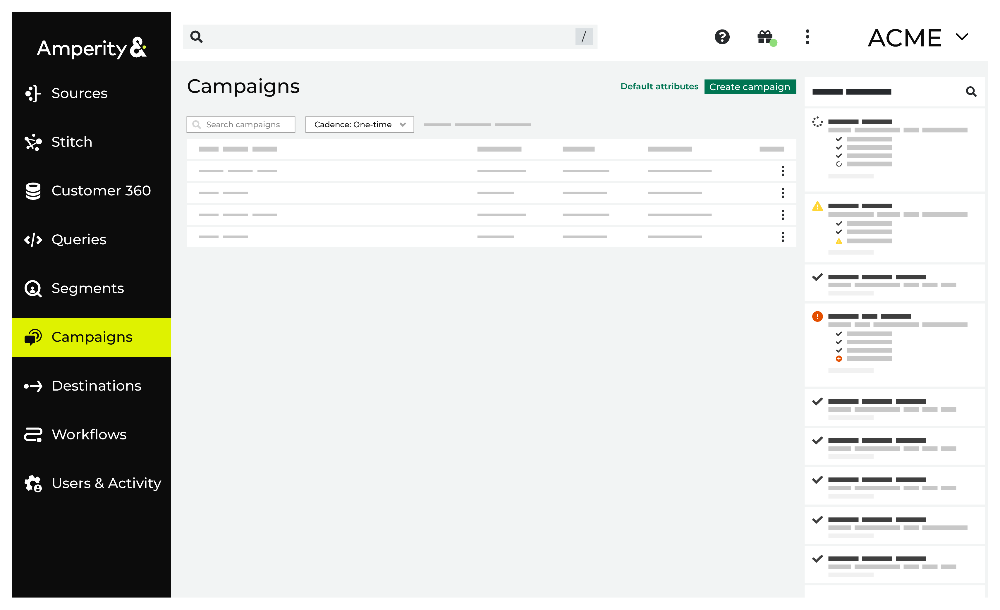
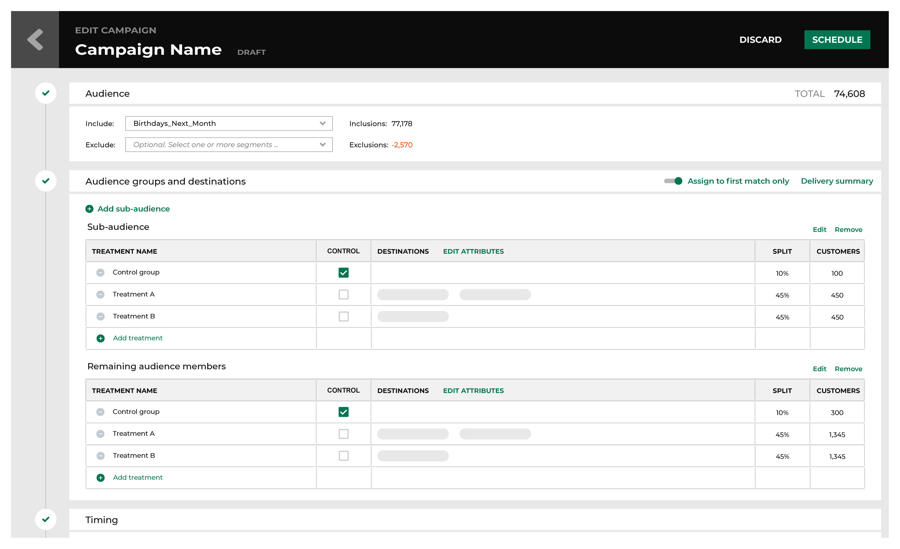
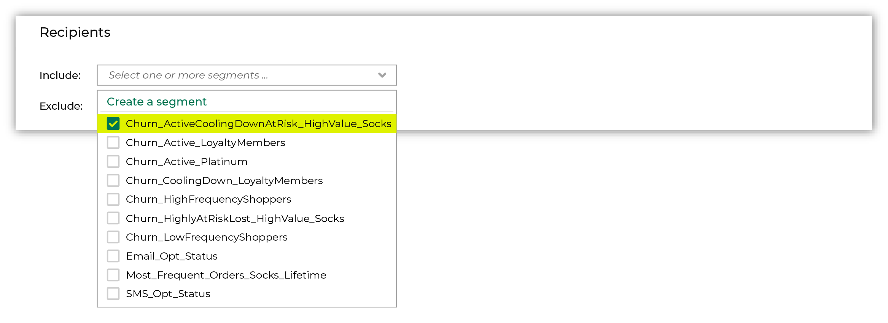
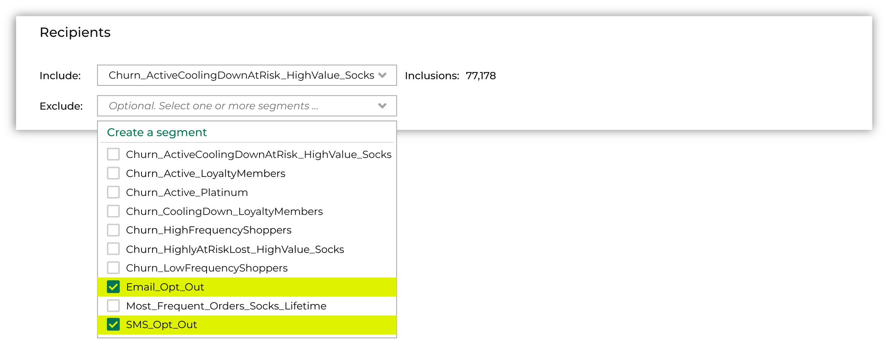
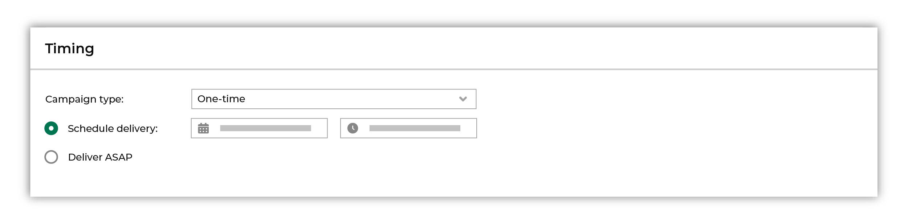
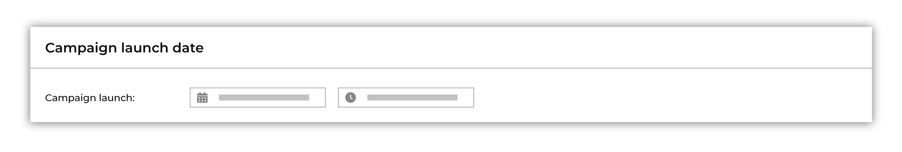
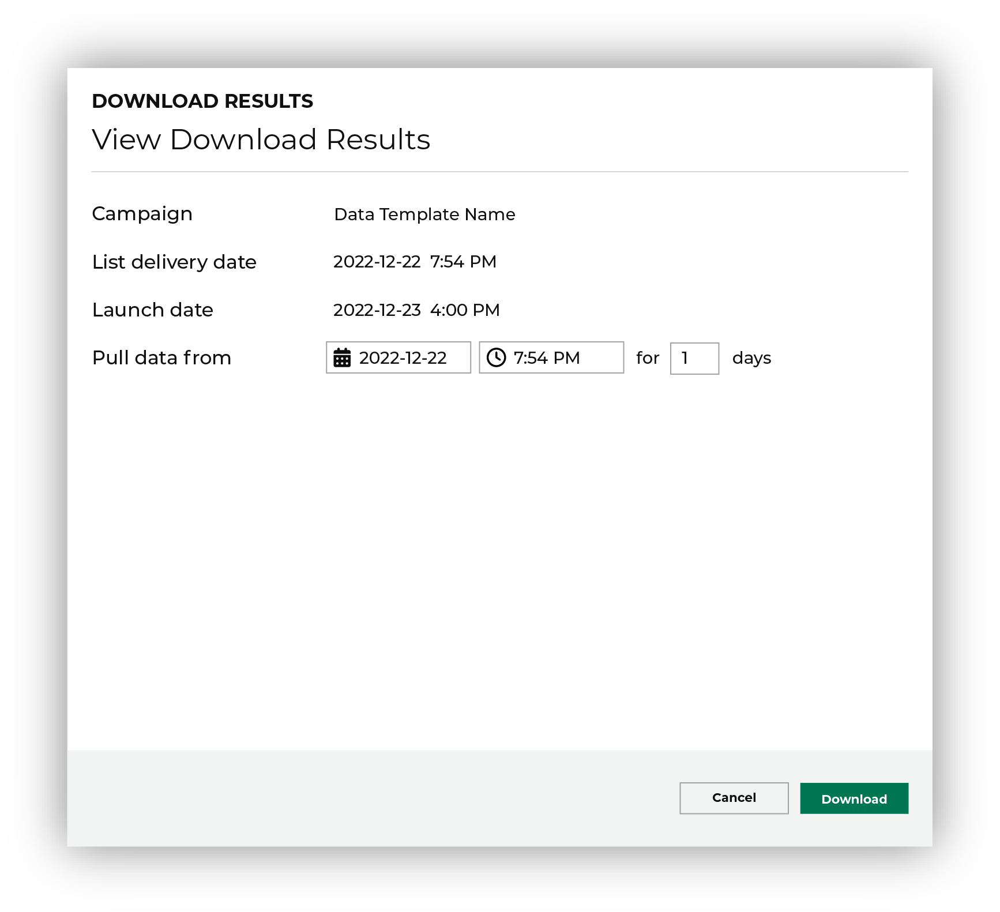
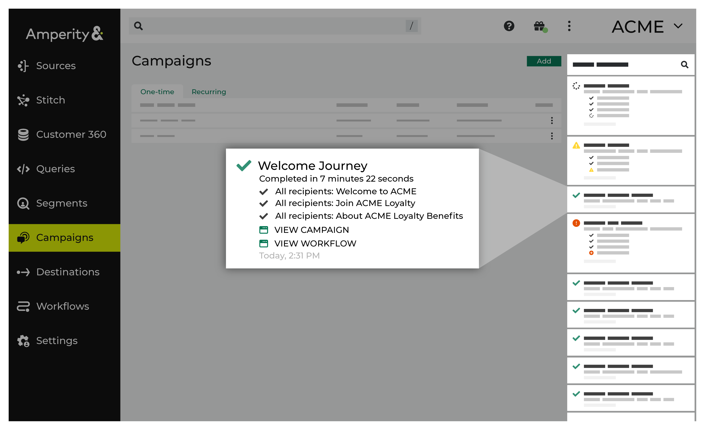

.. https://docs.amperity.com/reference/

.. meta::
    :description lang=en:
        Use campaigns to define audiences, and then send those audiences to downstream marketing workflows for customer activation.

.. meta::
    :content class=swiftype name=body data-type=text:
        Use campaigns to define audiences, and then send those audiences to downstream marketing workflows for customer activation.

.. meta::
    :content class=swiftype name=title data-type=string:
        About campaigns

==================================================
About campaigns
==================================================

.. campaigns-overview-context-start

Use the **Campaigns** page to build the audiences to which you want to send messages or offers. Configure the campaign to send those audiences to downstream marketing tools, such as email service providers, SMS providers, paid media, digital advertising, personalization, and more.

.. campaigns-overview-context-end

.. _campaigns-tab:

About the Campaigns page
==================================================

.. include:: ../../shared/terms.rst
   :start-after: .. term-campaigns-tab-start
   :end-before: .. term-campaigns-tab-end

.. campaigns-tab-about-start

Use the **Campaigns** page to activate a variety of use cases across your marketing stack. For example:

* Viewing your recently edited campaigns
* Messaging a group of high customer lifetime value (CLV) customers on Facebook for a VIP event
* Emailing customers with an affinity toward blue button down shirts for a product liquidation
* Targeting a segment of customers who are more likely to add a visit to the hotel spa
* Messaging a group of customers likely to churn without a special offer
* Showing an ad to re-engage customers who have unsubscribed from email
* Reaching out to customers that have enrolled in your loyalty program
* Identifying customers within existing lists, and then pushing targeted subsets for downstream messaging to any channel
* Using a control group, along with any number of treatment groups, to measure the quality of a campaign

.. campaigns-tab-about-end

.. _campaigns-howitworks:

How campaigns work
==================================================

.. include:: ../../amperity_ampiq/source/campaigns.rst
   :start-after: .. campaigns-howitworks-start
   :end-before: .. campaigns-howitworks-end

.. campaigns-howitworks-steps-start

Follow this sequence when building a campaign:

.. campaigns-howitworks-steps-end

.. include:: ../../amperity_ampiq/source/campaigns.rst
   :start-after: .. campaigns-howitworks-callouts-start
   :end-before: .. campaigns-howitworks-callouts-end

.. _campaigns-types:

Campaign types
==================================================

.. campaigns-types-start

Amperity supports the following types of campaign workflows:

* :ref:`campaigns-types-onetime`
* :ref:`campaigns-types-recurring`
* :ref:`campaigns-types-multi-channel`

.. campaigns-types-end

.. _campaigns-types-onetime:

One-time campaigns
--------------------------------------------------

.. include:: ../../shared/terms.rst
   :start-after: .. term-one-time-campaign-start
   :end-before: .. term-one-time-campaign-end

.. campaigns-types-onetime-start

A one-time campaign can be configured to run in a similar manner as a recurring campaign, but with the purpose being to communicate messages to customers they should see only once. For example:

* A welcome message to a customer who has joined a loyalty program.
* A message to a customer who has signed up for a credit card.

.. campaigns-types-onetime-end

.. _campaigns-types-recurring:

Recurring campaigns
--------------------------------------------------

.. include:: ../../shared/terms.rst
   :start-after: .. term-recurring-campaign-start
   :end-before: .. term-recurring-campaign-end

.. campaigns-types-recurring-start

A recurring campaign has the following components:

#. A state change that initiates a campaign message.
#. A segment that defines a list of customers to which the campaign message applies. This segment can be configured to limit the list to certain types of users, such as only business travelers, high-value customers, and so on.
#. A launch cadence that defines the frequency--daily, weekly, monthly, quarterly--at which the campaign messages are run.

.. campaigns-types-recurring-end

.. _campaigns-types-multi-channel:

Multichannel campaigns
--------------------------------------------------

.. include:: ../../shared/terms.rst
   :start-after: .. term-multi-channel-campaign-start
   :end-before: .. term-multi-channel-campaign-end

.. campaigns-types-multi-channel-start

A multichannel campaign defines combinations of sub-audiences and channels to define unique sets strategies, with each applied to a sub-audience.

A multichannel campaign has the following components:

#. A state change that initiates a campaign message.
#. A segment that defines the audience to which the multichannel campaign messages will be applied. This segment can be configured to limit the list to certain types of users, such as only business travelers, high-value customers, and so on.
#. The use of sub-audiences to partition the audience into a variety of campaign channels. Each sub-audience may be configured to have its own control group.
#. A launch cadence that defines the frequency--daily, weekly, monthly, quarterly--at which the campaign messages are run.

.. campaigns-types-multi-channel-end

.. _campaigns-features:

Campaign features
==================================================

.. campaigns-features-start

Campaigns have the following features:

* :ref:`campaigns-attributes`
* :ref:`campaigns-audiences`
* :ref:`campaigns-control-groups`
* :ref:`campaigns-destinations`
* :ref:`campaigns-exclusion-lists`
* :ref:`campaigns-treatment-groups`
* :ref:`campaigns-sub-audiences`
* :ref:`campaigns-timing-and-launch`

.. campaigns-features-end

.. _campaigns-attributes:

Attributes
--------------------------------------------------

.. campaigns-attributes-start

For many |campaign_destinations|, you may configure the list of attributes (i.e. first name, last name, state, etc.) that are sent for each sub-audience. Click the **Edit attributes** link to open the list of attributes that are available for each destination defined for the audience. Use the drop-down menu to select the destination if there is more than one.

.. campaigns-attributes-end

.. campaigns-attributes-important-start

.. important:: Some destinations only support sending specific attributes. Review the requirements for each destination to ensure that you don't attach unsupported attributes to the campaigns that you send.

.. campaigns-attributes-important-end

.. campaigns-attribute-append-start

You may append attributes that are available in any database table. Click the **+ Add attribute** link, and then name the attribute, specify from which table that attribute is sourced, and then specify the name of that attribute as it is defined in that table.

.. campaigns-attribute-append-end

.. _campaigns-audiences:

Audiences
--------------------------------------------------

.. campaigns-audiences-start

All campaigns start with an audience. Choose a segment from the **Include** drop-down list. The customers in that list will become the audience for this campaign.

.. campaigns-audiences-end

.. campaigns-audiences-tip-start

.. tip:: When a campaign starts with an audience that is defined by a single segment, you can use the segment insights for that segment as a way to measure the performance of that audience over time.

.. campaigns-audiences-tip-end

.. _campaigns-control-groups:

Control groups
--------------------------------------------------

.. include:: ../../shared/terms.rst
   :start-after: .. term-control-group-start
   :end-before: .. term-control-group-end

.. campaigns-control-groups-note-start

.. note:: A control group is a completely randomized sample of customers that is pulled from the original audience.

.. campaigns-control-groups-note-end

.. campaigns-control-groups-start

A campaign typically has a single control group, unless sub-audiences are defined within the campaign. Each sub-audience may contain a control group.

.. campaigns-control-groups-end

.. campaigns-control-groups-consistent-membership-start

.. admonition:: Does a control group have consistent audience membership?

   Amperity attempts to maintain (but does not guarantee) consistent audience membership for control groups that are associated with recurring campaigns.

   * When the audience size is unchanged across the campaigns that you send, the membership of the control group will be unchanged.

   * When the audience size changes, the size of the control group also changes. Amperity IDs are added to the control group when the audience size gets bigger and are removed when the audience size gets smaller.

   Audience members that are added to a control group may have belonged to a treatment group on the previous send.

   Audience members that are removed from the control group will belong to a treatment group on the next send.

   For example: A campaign is built using one segment, one control group, and one treatment group. The audience is refreshed weekly and contains a mostly static group of customers, but with small fluctuations in audience size.

   #. Today the size of the audience for the segment is 1200 customers and the size of the control group is 20 percent, or 240 customers. The campaign is sent to 960 customers.
   #. Next week the size of the audience is 1240, which means the size of the control group will be larger (248). The campaign is sent to 992 customers.
   #. And the following week the size of the audience is 1160, which means the size of the control group will be smaller (232). The campaign is sent to 928 customers.

.. campaigns-control-groups-consistent-membership-end

.. _campaigns-destinations:

Destinations
--------------------------------------------------

.. include:: ../../amperity_ampiq/source/destinations.rst
   :start-after: .. destinations-howitworks-start
   :end-before: .. destinations-howitworks-end

.. include:: ../../amperity_ampiq/source/destinations.rst
   :start-after: .. destinations-howitworks-callouts-start
   :end-before: .. destinations-howitworks-callouts-end

.. _campaigns-exclusion-lists:

Exclusion lists
--------------------------------------------------

.. include:: ../../shared/terms.rst
   :start-after: .. term-exclusion-list-start
   :end-before: .. term-exclusion-list-end

.. campaigns-exclusion-lists-start

Sometimes campaigns need to exclude certain members of your audience. For example, a churn prevention campaign is often configured to exclude customers who have opted-out of SMS messaging and/or who have unsubscribed from an email list.

When you need to exclude audience members, choose one (or more) segments from the **Exclude** drop-down list. The customers in an exclusion list will be removed from the audience for this campaign.

.. note:: When you select multiple exclusion lists, audience members will be excluded when they belong to *either* list. This is the same behavior as when the **OR** operator is used in SQL. "Exclude customers from this audience when they belong to segment A *OR* segment B."

.. campaigns-exclusion-lists-end

.. _campaigns-treatment-groups:

Treatment groups
--------------------------------------------------

.. include:: ../../shared/terms.rst
   :start-after: .. term-treatment-group-start
   :end-before: .. term-treatment-group-end

.. campaigns-treatment-groups-start

You may configure more than one treatment group for each audience and sub-audience within a campaign.

.. campaigns-treatment-groups-end

.. _campaigns-sub-audiences:

Sub-audiences
--------------------------------------------------

.. include:: ../../shared/terms.rst
   :start-after: .. term-sub-audience-start
   :end-before: .. term-sub-audience-end

.. campaigns-sub-audiences-start

A sub-audience enables you to measure the performance of individual communications in a campaign. A sub-audience could represent a set of users for which you have a better understanding of their marketing preferences and you would like to send them specific messaging as part of a larger campaign. For example, you can see how the jackets sub-audience marketing email performed as compared to the t-shirts sub-audience marketing email within the same campaign. Additionally, each sub-audience can be configured to use its own control and treatment groups, providing even greater control and flexibility. 

A sub-audience may define users by brand, most commonly purchased sub-brand, product affinity, product category, product type, demographics, etc.

.. note:: The limit for number of sub-audiences per campaign is 60.

.. campaigns-sub-audiences-end

.. _campaigns-timing-and-launch:

Timing and launch dates
--------------------------------------------------

.. campaigns-timing-and-launch-start

A campaign can be configured to be sent once or on a recurring basis. A campaign can also be scheduled (i.e. "to be sent at the time you choose in the future") or to be sent as soon as possible.

.. campaigns-timing-and-launch-end

.. campaigns-timing-and-launch-dates-start

Enter the date on which you plan to launch your campaign. This date helps Amperity improve results tracking and campaign results measurement.

.. campaigns-timing-and-launch-dates-end

.. _campaigns-download-recipients:

Download recipients
--------------------------------------------------

.. campaigns-download-recipients-start

The download recipients feature allows you to download and see your recipients list. This option provides you with the ability to see details about your recipients, including the Amperity ID and the Treatment ID.

.. campaigns-download-recipients-end

.. campaigns-download-recipients-manual-workflows-start

.. tip:: Downloaded files can enable ad hoc workflows in any downstream tool that supports directly uploading and/or using CSV files. For example, marketing applications like `Airship <https://docs.airship.com/guides/messaging/user-guide/audience/segmentation/audience-lists/uploaded/>`__ |ext_link|, `Attentive <https://help.attentivemobile.com/hc/en-us/articles/360051463212-Create-a-manual-segment>`__ |ext_link|, `Bluecore <https://help.bluecore.com/en/articles/3552694-import-data>`__ |ext_link|, `Braze <https://www.braze.com/docs/user_guide/data_and_analytics/user_data_collection/user_import/#csv>`__ |ext_link|, `Facebook Ads <https://www.facebook.com/business/help/170456843145568?id=2469097953376494>`__ |ext_link|, `Iterable <https://support.iterable.com/hc/en-us/articles/205694345-CSV-List-Import-Best-Practices->`__ |ext_link|, |channel_pinterest|, |channel_reddit_ads|, and `SendGrid <https://docs.sendgrid.com/ui/managing-contacts/create-and-manage-contacts>`__ |ext_link| all support directly uploading CSV files. Downloaded CSV files can be opened directly in Microsoft Excel and Google Sheets.

.. campaigns-download-recipients-manual-workflows-end

.. _campaigns-default-attributes:

Default attributes
==================================================

.. include:: ../../amperity_ampiq/source/default_attributes.rst
   :start-after: .. campaigns-default-attributes-overview-start
   :end-before: .. campaigns-default-attributes-overview-end

.. include:: ../../amperity_ampiq/source/default_attributes.rst
   :start-after: .. campaigns-default-attributes-steps-start
   :end-before: .. campaigns-default-attributes-steps-end

.. _campaigns-reference-campaign-notifications:

Email notifications
==================================================

.. campaigns-reference-campaign-notifications-start

Email notifications will alert you when there is an issue with campaign delivery. For example, email notifications are sent when Facebook Ads is missing an external identifier or two-factor authorization is not enabled for Google Ads.

Email notifications will describe the issue and the steps that are required to resolve the issue, and will provide a link to the **Workflows** page in Amperity.

.. campaigns-reference-campaign-notifications-end

.. _campaigns-results:

Campaign results
==================================================

.. campaigns-results-overview-start

The campaign results feature allows you to download and see your one-time or recurring campaign results data. This option provides you with the ability to explore campaign results data and measure performance in more detail.

Use this feature to define a performance measurement time period and then analyze these results for all sub-audience test groups across every single campaign data point. This includes the following data points:

* Revenue metrics
* Conversion rates
* Order characteristics
* Incremental lift

.. tip:: Amperity tracks the purchases of your customers in the audiences lists. The purchase information is based on purchasing behavior across channels. 

If you make any changes to this information downstream (i.e. launching a campaign on a different date then the one you entered into Amperity) they will not be reflected in Amperity.

.. campaigns-results-overview-end

.. _campaigns-results-columns:

Campaign results columns
--------------------------------------------------

.. campaigns-results-columns-start

You can finds details about the columns found in the campaign results download file in the table below.

.. campaigns-results-columns-end

.. campaigns-results-column-descriptions-start

.. list-table::
   :widths: 200 80 320
   :header-rows: 1

   * - Column name
     - Data type
     - Description
   * - **Average Order Value**
     - Decimal
     - The average dollar value per order made by purchasers during the campaign measurement period. 

       .. note:: This metric is calculated by total revenue divided by the recipients count for the specific treatment group/sub-audiences.
   * - **Average Unit Revenue**
     - Decimal
     - The average revenue per item purchased during the campaign measurement period.

       .. note:: This is calculated as the total revenue divided by the total items.

   * - **Campaign Name**
     - String
     - The name the customer gives the campaign.

   * - **Conversion Rate**
     - Decimal
     - The percentage of unique customers (associated with Amperity IDs) who performed a desired outcome (transaction or other events) during the campaign measurement period. 

       .. note:: This metric indicates the rate of recipients converted to make a purchase as a result of the campaign.

   * - **Conversion Rate Lift (Over Control)**
     - Decimal
     - The percentage difference in conversion rate by the recipients group relative to the control group. 

       .. note:: This is calculated as the difference in the incremental conversion rate divided by the total control recipients.

   * - **Delivery Date**
     - Datetime
     - The delivery date on which campaign treatment groups/sub-audiences were sent out of Amperity.

   * - **Incremental Conversion Rate (Over Control)**
     - Decimal
     - Additional percentage of recipients converted in the treatment group relative to the control group during the campaign measurement period. 

       .. note:: This column will appear as null if there is no control group.

   * - **Incremental Revenue (Over Control)**
     - Decimal
     - Additional revenue generated measured by the difference between total test revenue recipient and total control revenue per recipient and then multiply that by test recipients. 

       .. note:: This column will appear as null if there is no control group.

   * - **Incremental Revenue Per Recipient (Over Control)**
     - Decimal
     - Additional revenue per recipient in the treatment group relative to the control audience during the campaign measurement period. 

       .. note:: This column will appear as null if there is no control group.

   * - **Is Control**
     - Boolean
     - Indicates whether the treatment group is a control group. 

   * - **Items Per Order**
     - Integer
     - The average number of items per order purchased during the campaign measurement period. 

   * - **Measurement End Date**
     - Datetime
     - The end of the campaign measurement period, plus the number of days selected prior to that date. The date prior to all preceding transactions and events associated with outcomes of this campaign.

       .. note:: By default, this end date is 7 days preceding the selected measurement start date.

   * - **Measurement Start Date**
     - Datetime
     - The start of the campaign measurement period. The date following all transactions and events associated with the outcomes of this campaign.

       .. note:: By default, this is the launch date selected for the campaign in Amperity, but can be changed when downloaded.

   * - **Orders Per Purchaser**
     - Integer
     - The average number of orders per purchaser.

       .. note:: This is calculated by total orders divided by the purchaser count.

   * - **Purchaser Count**
     - Integer
     - The number of unique customers (associated with Amperity IDs) in the recipients group/sub-audience who made a purchase during the campaign measurement period.

   * - **Recipient Count**
     - Integer
     - The total number of unique customers (associated with Amperity IDs) included in the treatment group/sub-audience.

   * - **Revenue Per Recipient**
     - Decimal
     - The amount of revenue per recipient in a campaign.

       .. note:: This metric is calculated by total revenue divided by the recipients count for the specific treatment group/sub-audiences.

   * - **Revenue Per Recipient Lift (Over Control)**
     - Decimal
     - The percentage difference in revenue per recipient by the treatment group relative to the control group. 

       .. note:: This is calculated as the difference in the incremental revenue per recipient divided by the total control recipients. 

   * - **Standard Deviation Revenue**
     - Decimal
     - The standard deviation (measure of variance) of revenue for each recipient in the treatment group/sub-audience who have received the campaign (associated with Amperity IDs).

   * - **Sub-audience Name**
     - String
     - The name the customer gives the sub-audience.

   * - **Total Items**
     - Integer
     - The total quantity of items ordered by unique customers (associated with Amperity IDs) in the recipients group/sub-audience during the campaign measurement period. 

   * - **Total Orders**
     - Integer
     - The total number of purchase orders made by unique customers (associated with Amperity IDs) in the recipients group/sub-audience during the campaign measurement period. 

   * - **Total Revenue**
     - Decimal
     - The total revenue associated with Amperity IDs in the treatment group/sub-audience, during the campaign measurement period.

       .. note:: By default, the **order_revenue** field in the **Unified Transactions** table is calculated as gross revenue and the gross sales details are provided in the campaign results download file.

   * - **Treatment ID**
     - String
     - The numerical identifier Amperity assigns to the treatment group.

   * - **Treatment Name**
     - String
     - The name the customer gives the treatment group.

.. campaigns-results-column-descriptions-end

 .. _recurring-campaign-results-use-cases:
 
Use cases
--------------------------------------------------

.. campaigns-results-use-cases-start

You can use campaign results to determine how to successfully reach out to their customers for the following reasons:

* If your campaign message was effective at converting customers
* Whether one offer or treatment worked better at converting customers (i.e. A/B testing)
* If a campaign drove incremental value (i.e. via a control group holdout)

.. campaigns-results-use-cases-end

.. _campaigns-results-driving:

Driving a campaign
--------------------------------------------------

.. recurring-campaign-results-driving-start

Once you have determined which channel to use for your campaign, you need to determine which is the most effective way to approach a campaign. For instance, if a you decide to send out an email campaign to your customers, you will need to decide which type of email will be most effective. Does the email with the 10% offer bring in more customer orders or does the $10 off email offer give customers more incentive to make a purchase?

.. recurring-campaign-results-driving-end

.. _campaigns-results-amperitys-method:

Amperity's approach
--------------------------------------------------

.. campaigns-results-amperitys-method-start

Amperity creates a 360-degree view of your customers, which includes a complete transaction history. This process uses a stable identifier -- the Amperity ID -- to track customers even when their path to a purchase is non-linear.

.. include:: ../../shared/terms.rst
   :start-after: .. term-amperity-id-start
   :end-before: .. term-amperity-id-end
	  
Amperity provides marketers with the following capabilities which gives them a 360 view of their customer's behavior:

* Compares more than one set of marketing data -- via the Amperity ID -- to determine whether customer behavior has changed around a campaign.
* Tracks customer behavior through transactional data and an Amperity ID associated with a campaign.
* Automatically holds back a control group when a campaign is created to test whether a customer will buy something in a store or whether they received an email or not.
* Tracks omnichannel behavior of customers targeted in the test group, as well as the behavior of customers in the control holdout group.
* Compares the behavior of control customers to those who received the marketing treatment and calculates the incremental impact of the campaign.
* Determines whether a customer -- with an Amperity ID associated with a campaign -- has made a purchase within a timeframe set by the marketer. For instance, if a customer were to shop online or in a store. 
* Tests within smaller sub-sets of customer groups to determine how certain components within a campaign affect customer behavior. For example, how was the 10 percent email offer received by customers compared to the $10 off email offer.
* Uses people-based measurement to randomly assign customers to control and treatment groups, which gives you the ability to accurately measure the incremental effects of a campaign. To learn more about people-based measurement, refer to the |people_based_measurement| topic.

.. campaigns-results-amperitys-method-end

.. _campaigns-results-example:
 
Example
--------------------------------------------------

.. campaigns-results-example-start

A marketer downloads campaign results for a campaign that they recently sent out. The the groups that were represented in these results are as follows:

* Facebook Ads
* Postcard
* Email only (control group)

The marketer sees the following campaign results data in the .CSV file that they downloaded:

* How many users were targeted in each group
* When the campaign was launched
* See how much revenue was generated per sub-group
* See how revenue is broken down per user is
* See at a high level how much each group spent.

In this case, the marketer can see that the Facebook Ads sub-group had more conversions than any of the other sub-groups. They can also see that the Facebook Ads sub-group also purchased more items than the other sub-groups.

Thus, the marketer can determine that the Facebook Ads channel is the best option for their marketing campaign.

.. campaigns-results-example-end

.. _campaigns-how-tos:

How-tos
==================================================

.. campaigns-how-tos-start

This section describes tasks related to building campaigns in Amperity:

.. campaigns-how-tos-end

.. campaigns-how-tos-list-start

* :ref:`campaigns-add-folders`
* :ref:`campaigns-add-sub-audience`
* :ref:`campaigns-apply-exclusion-list`
* :ref:`campaigns-archive-campaign`
* :ref:`campaigns-build-audience`
* :ref:`campaigns-bulk-delete`
* :ref:`campaigns-bulk-move`
* :ref:`campaigns-choose-campaign-type`
* :ref:`campaigns-config-default-attributes`
* :ref:`campaigns-config-multi-channel-campaign`
* :ref:`campaigns-config-onetime-campaign`
* :ref:`campaigns-config-recurring-campaign`
* :ref:`campaigns-copy-campaign-id`
* :ref:`campaigns-delete-campaign`
* :ref:`campaigns-discard-campaign`
* :ref:`campaigns-duplicate-campaign`
* :ref:`campaigns-edit-attribute`
* :ref:`campaigns-edit-campaign`
* :ref:`campaigns-edit-sub-audience`
* :ref:`campaigns-enable-campaign-recipients-table`
* :ref:`campaigns-filter-a-campaign`
* :ref:`campaigns-remove-sub-audience`
* :ref:`campaigns-schedule-campaign`
* :ref:`campaigns-search-campaigns`
* :ref:`campaigns-select-destinations`
* :ref:`campaigns-send-metadata`
* :ref:`campaigns-set-launch-date`
* :ref:`campaigns-set-delivery-schedule`
* :ref:`campaigns-view-campaign`
* :ref:`campaigns-view-campaign-history`
* :ref:`campaigns-view-delivery-summary`
* :ref:`campaigns-view-notification`
* :ref:`campaigns-view-edited-campaign`
* :ref:`campaigns-view-workflow`

.. campaigns-how-tos-list-end

.. _campaigns-add-sub-audience:

Add a sub-audience
--------------------------------------------------

.. campaigns-add-sub-audience-start

You can add a sub-audience to a campaign on the **Edit Campaign** page.

.. campaigns-add-sub-audience-end

**How to add a sub-audience to a campaign**

.. campaigns-sub-audiences-steps-start

#. From the **Campaigns** page, in the **Sub-audiences and Destinations** section, click **Add Sub-audience**.
#. From the **Source** menu, select **Create custom criteria**.
#. From the **Audience Builder** window, To add these attributes to your segment, click **Add condition**.
#. From the **Sources** drop-down list, select a source.
#. From the **Attributes** drop-down list, select an attribute.
#. From the **Operators** drop-down list, select an operator.
#. To add these attributes to your segment, click **Add condition** to add more criteria.
#. When done setting your criteria, click **Save**.

The new sub-audience appears in the **Sub-audiences and Destinations** section.

.. note:: When you save your sub-audiences you will see recipient counts calculated. When you reorder your sub-audiences using drag and drop these counts are automatically updated.

.. campaigns-sub-audiences-steps-end

.. _campaigns-add-a-saved-segment-to-sub-audience:

Add a saved segment to a sub-audience
++++++++++++++++++++++++++++++++++++++++++++++++++

.. campaigns-add-a-saved-segment-to-sub-audience-start

You can add a saved segment to a sub-audience in a campaign on the **Edit Campaign** page.

.. campaigns-add-a-saved-segment-to-sub-audience-end

**To add a saved segment to a sub-audience in a campaign**

.. campaigns-add-a-saved-segment-to-sub-audience-steps-start

#. From the **Edit Campaign** page, click **Add Sub-audience**.
#. From the **Source** menu, click **Saved segments**.
#. From the **Segment(s)** list, select one or more saved segments.

The saved segment(s) appear in the **Sub-audiences and Destinations** section on the **Edit Campaign** page.

.. campaigns-add-a-saved-segment-to-sub-audience-steps-end

.. _campaigns-add-custom-attributes:

Add a custom attribute to a destination
++++++++++++++++++++++++++++++++++++++++++++++++++

.. campaigns-select-custom-attributes-start

You can add a custom attribute to a destination on the **Edit attributes** page.

.. campaigns-add-custom-attributes-end

**To add a custom attribute to a destination**

.. campaigns-add-custom-attributes-steps-start

#. From the **Edit attributes** page, in the **Source Table** column, select a source table.
#. In the **Source Attribute** column, select a custom attribute.
#. Click **Save**.

   .. note:: For the source table to appear in the **Source Table** column, it needs to appear in the segment editor and have a field with an Amperity ID.

.. campaigns-add-custom-attributes-steps-end

.. _campaigns-allocate-multiple-sub-audiences:

Allocate customers to more than one sub-audience
++++++++++++++++++++++++++++++++++++++++++++++++++

.. campaigns-allocate-multiple-sub-audiences-start

You can allocate customers (Amperity IDs) to multiple sub-audiences in a campaign on the **Edit Campaign** page.

.. note:: Amperity defaults to allocating customers (Amperity IDs) to the first (mutually exclusive) sub-audience.

.. campaigns-allocate-multiple-sub-audiences-end

**To allocate customers (Amperity IDs) multiple sub-audiences in a campaign**

.. campaigns-allocate-multiple-sub-audiences-steps-start

#. From the **Edit Campaign** page, in the **Sub-audiences and Destinations** section, switch the **Assign to first match only** toggle off.

Amperity will now allocate your customers (Amperity IDs) to multiple sub-audiences in your campaign. 

.. campaigns-allocate-multiple-sub-audiences-steps-end

.. _campaigns-build-sub-audience:

Build a sub-audience
++++++++++++++++++++++++++++++++++++++++++++++++++

.. campaigns-build-sub-audience-start

You can build a sub-audience in a campaign on the **Edit Campaign** page.

.. campaigns-build-sub-audience-end

**To build a sub-audience in a campaign**

.. campaigns-define-recipient-groups-steps-start

#. From the **Edit Campaign** page, click **Add Sub-audience**.
#. From the **Source** menu, either select a table source *or* search for a table source in the search field.
#. From the **Attribute** menu, either select an attribute *or* search for an attribute in the search field.
#. From the **Condition** menu, select a condition.
#. From the value menu, either select a value *or* search for a value from the search field.
#. Add another attribute or section.
#. Select a destination from the menus in the **Destinations** column for each group.
#. Click **Edit attributes** to edit or add attributes.
#. Click **Add Treatment** to add a treatment group.

   .. note:: You cannot edit a segment that is added as a sub-audience if it is built from a segment. To make changes to the segment, you will need to edit it directly in the **Segment Editor**.

.. campaigns-define-recipient-groups-steps-end

.. _campaigns-bulk-delete:

Bulk delete
++++++++++++++++++++++++++++++++++++++++++++++++++

.. campaigns-bulk-delete-start

You can bulk delete campaigns or folders on the **Campaigns** page.

.. campaigns-bulk-delete-end

**To bulk delete campaigns or folders**

.. campaigns-bulk-delete-steps-start

#. From the **Campaigns** page, select the campaigns or folders to delete.
#. From the bottom of the page, click **Delete**.

.. campaigns-bulk-delete-steps-end

.. _campaigns-bulk-move:

Bulk move
++++++++++++++++++++++++++++++++++++++++++++++++++

.. campaigns-bulk-move-start

You can bulk move campaigns or folders on the **Campaigns** page.

.. campaigns-bulk-move-end

**To bulk delete campaigns or folders**

.. campaigns-bulk-move-steps-start

#. From the **Campaigns** page, select the campaigns or folders to move.
#. From the bottom of the page, click **Move**.

.. campaigns-bulk-move-steps-end

.. _campaigns-define-treatment-groups:

Define treatment groups
++++++++++++++++++++++++++++++++++++++++++++++++++

.. campaigns-define-treatment-groups-start

You can define treatment groups in a campaign on the **Edit Campaign** page.

.. campaigns-define-treatment-groups-end

**To define treatment groups in a campaign**

.. campaigns-define-treatment-groups-steps-start

#. From the **Edit Campaign** page, in the **All Remaining Recipients** section, click **Add treatment**. The treatment group appears in the **Group Name** column.
#. In the **Control** column, select the checkbox associated with a control group.
#. Select a destination from the menus in the **Destinations** column for each group.
#. Click **Edit attributes** to edit or add attributes.

.. campaigns-define-treatment-groups-steps-end

.. _campaigns-set-attributes:

Select attributes
++++++++++++++++++++++++++++++++++++++++++++++++++

.. campaigns-set-attributes-start

You can select attributes in a campaign on the **Edit Campaign** page.

.. campaigns-set-attributes-end

**To select attributes in a campaign**

.. campaigns-set-attributes-steps-start

#. From the **Edit Campaign** page, click **Add Sub-audience**.
#. From the **Source** menu, either select a table source *or* search for a table source in the search field.
#. From the **Attribute** menu, either select an attribute *or* search for an attribute in the search field.
#. From the **Condition** menu, select a condition.
#. From the value menu, either select a value *or* search for a value in the search field.
#. Add another attribute or section.
#. When done, click **Save**.

.. campaigns-set-attributes-steps-end

.. _campaigns-select-query-source:

Select a query source
++++++++++++++++++++++++++++++++++++++++++++++++++

.. campaigns-select-query-source-start

You can select a query source on the **Edit attributes** page.

.. campaigns-select-query-source-end

**To select a query source**

.. campaigns-select-query-source-steps-start

#. From the **Edit attributes** page, in the **Sources** column, click on a row.
#. In the **Queries (Custom Tables)**, select a query source.
#. Click **Save**.

.. campaigns-select-query-source-steps-end

.. _campaigns-select-destination:

Select destination
++++++++++++++++++++++++++++++++++++++++++++++++++

.. campaigns-select-destination-start

You can select destinations in a campaign on the **Edit Campaign** page.

.. campaigns-select-destination-end

**To select destinations in a campaign**

.. campaigns-select-destination-steps-start

#. From the **Edit Campaign** page, in the **Sub-audiences and Destinations**, select a destination from the **Destinations** column associated with a treatment group.

The destination appears in the **Destinations** column.

.. campaigns-select-destination-steps-end

.. _campaigns-apply-exclusion-list:

Apply exclusion list
--------------------------------------------------

.. campaigns-apply-exclusion-list-start

You can apply an exclusion list in a campaign on the **Edit Campaign** page.

.. campaigns-apply-exclusion-list-end

**To apply an exclusion list in a campaign**

.. campaigns-apply-exclusion-list-steps-start

#. From the **Edit Campaign** page, in the **Sub-audiences and Destinations** section, in the **Control** column, select the checkbox associated with a control group.

The selected control group will be excluded from the campaign.

.. campaigns-apply-exclusion-list-steps-end

.. _campaigns-archive-campaign:

Archive campaign
--------------------------------------------------

.. campaigns-build-audience-start

Use the archive feature for campaigns you have actively used, but you don't need anymore.

.. note:: This action effectively deletes the campaign from your tenant. If you want to this campaign to be moved back into your tenant, please contact Amperity support.

.. campaigns-build-audience-end

**To archive a campaign**

.. campaigns-build-audience-steps-start

#. From the **Campaigns** page, click the more options button on a campaign.
#. In the menu, click **Archive**.

.. campaigns-build-audience-steps-end

.. _campaigns-build-audience:

Build audience
--------------------------------------------------

.. campaigns-build-audience-start

You can build an audience in a campaign on the **Edit Campaign** page.

.. campaigns-build-audience-end

**To build an audience in a campaign**

.. campaigns-build-audience-steps-start

#. From the **Edit Campaign** page, in the **Audience** section, in the **Include** list, select the segment(s) to include.
#. In the **Exclude** list, select the segment(s) to exclude.

   .. note:: The **Exclude** list is optional. Use the **Exclude** list to choose recipients to exclude from a campaign.
   
   .. tip:: You can select up to 10 saved segments from the same database to build inclusions and exclusions for   an audience.

The recipients group and control group appear in the **All Recipients** table in the **Sub-audiences and Destinations** section.

.. campaigns-build-audience-steps-end

.. _campaigns-choose-campaign-type:

Choose campaign type
--------------------------------------------------

.. campaigns-choose-campaign-type-start

You can choose a campaign type from the **Edit Campaign** page.

.. campaigns-choose-campaign-type-end

**To choose a campaign type in a campaign**

.. campaigns-choose-campaign-type-steps-start

#. From the **Edit Campaign** page, in the **Recipient List Delivery** section, in the **Campaign type** list, select either **One-time** *or* **Recurring** from the list: 

.. campaigns-choose-campaign-type-steps-end

.. _campaigns-config-default-attributes:

Configure default attributes
--------------------------------------------------

.. campaigns-config-default-attributes-start

You can configure default attributes from the **Campaigns** page.

.. campaigns-config-default-attributes-end

**To configure the default attributes**

.. campaigns-config-default-attributes-steps-start

#. From the **Campaigns** page, in the top-right corner of the page, click **Default attributes**.
#. From the **Default attributes** window, click **Add default attributes**.
#. From the **Destination attributes** window, select the database from the **Database** drop-down.
#. Select the destination from the **Destination** drop-down.
#. Click **Add attribute**.
#. Select the source from the drop-down.
#. Select the attribute from the drop-down.
#. Enter the destination attribute name in the field.
#. Click **Save**.

The new default attribute appears on the **Default attributes** window.

.. campaigns-config-default-attributes-steps-end

.. _campaigns-config-multi-channel-campaign:

Configure a multichannel campaign
--------------------------------------------------

.. campaigns-config-multi-channel-campaign-start

You you can configure a multichannel campaign on the **Edit Campaign** page.

.. campaigns-config-multi-channel-campaign-end

**How to configure a multichannel campaign**

.. campaigns-workflow-multi-channel-steps-start

#. Give your campaign a name.

#. Choose the segment that represents the audience to use for this campaign.

   Optional. Choose a segment that contains a list of customers to *exclude* from this campaign.

#. Configure at least one control group/treatment group set for this campaign. Rename these groups as necessary.

   A control group should be set to 10%, with the initial treatment group set to 90%. Click **Add treatment** to add more treatment groups. Rename them as necessary and adjust the percentages as appropriate.

#. For each treatment group (including the control group, if configured for this campaign), assign multiple destinations.

   .. note:: A treatment group with multiple destinations will send data to *all* of the configured destinations.

#. Optional. Add one (or more) sub-audiences. Click **Add Sub-audience** to add more sets to this campaign, and then use the **Audience Builder** to define the criteria for each sub-audience.

#. Optional. Give each sub-audience a name.

#. Optional. Assign multiple destinations to each treatment group in a sub-audience.

#. Configure recipient list delivery. One-time campaigns you have two options: at a scheduled date and time in the future or as soon as possible.

   Provide the campaign launch date. Amperity uses the campaign launch date to improve results tracking for campaigns.

#. Click **Schedule** to put this campaign into the queue.

   Amperity will process the segments, and then send the results to the configured destinations. Please allow for enough time for Amperity to complete this process before kicking off the campaign in the downstream system.

.. campaigns-workflow-multi-channel-steps-end

.. _campaigns-config-onetime-campaign:

Configure a one-time campaign
--------------------------------------------------

.. campaigns-config-onetime-campaign-start

You can configure a one-time campaign on the **Edit Campaign** page.

.. campaigns-config-onetime-campaign-end

**How to configure a one-time campaign**

.. campaigns-workflow-onetime-steps-start

#. Give your campaign a name.

#. Choose the segment that represents the audience to use for this campaign.

   Optional. Choose a segment that contains a list of customers to *exclude* from this campaign.

#. Configure at least one control group/treatment group set for this campaign. Rename these groups as necessary.

   A control group should be set to 10%, with the initial treatment group set to 90%. Click **Add treatment** to add more treatment groups. Rename them as necessary and adjust the percentages as appropriate.

#. For each treatment group (including the control group, if configured for this campaign), assign at least one destination. You may assign more than one.

   .. note:: A treatment group with more than one configuration destination will send data to *all* of the configured destinations.

#. Optional. Add one (or more) sub-audiences. Click **Add Sub-audience** to add more sets to this campaign, and then use the **Audience Builder** to define the criteria for each sub-audience.

#. Optional. Give each sub-audience a name.

#. Optional. Assign at least one destination to each treatment group in a sub-audience.

#. Configure recipient list delivery. With one-time campaigns you have two options: at a scheduled date and time in the future or as soon as possible.

   Provide the campaign launch date. Amperity uses the campaign launch date to improve results tracking for campaigns.

#. Click **Schedule** to put this campaign into the queue.

   Amperity will process the segments, and then send the results to the configured destinations. Please allow for enough time for Amperity to complete this process before kicking off the campaign in the downstream system.

.. campaigns-workflow-onetime-steps-end

.. _campaigns-config-recurring-campaign:

Configure a recurring campaign
--------------------------------------------------

.. campaigns-config-recurring-campaign-start

You you can configure a recurring campaign on the **Edit Campaign** page.

.. campaigns-config-recurring-campaign-end

**How to configure a recurring campaign**

.. campaigns-workflow-recurring-steps-start

#. Give your campaign a name.

#. Choose the segment that represents the audience to use for this campaign.

   Optional. Choose a segment that contains a list of customers to *exclude* from this campaign.

#. Configure at least one control group/treatment group set for this campaign. Rename these groups as necessary.

   A control group should be set to 10%, with the initial treatment group set to 90%. Click **Add treatment** to add more treatment groups. Rename them as necessary and adjust the percentages as appropriate.

#. For each treatment group (including the control group, if configured for this campaign), assign at least one destination. You may assign more than one.

   .. note:: A treatment group with more than one configuration destination will send data to *all* of the configured destinations.

#. Optional. Add one (or more) sub-audiences. Click **Add Sub-audience** to add more sets to this campaign, and then use the **Audience Builder** to define the criteria for each sub-audience.

#. Optional. Give each sub-audience a name.

#. Optional. Assign at least one destination to each treatment group in a sub-audience.

#. Configure recipient list delivery. Recurring campaigns require a cadence (daily or weekly), a start date and time, and then an end date. The end date has three options: never, on a specific date, or after a specified number of occurrences.

   Provide the campaign launch date. Amperity uses the campaign launch date to improve results tracking for campaigns.

#. Click **Schedule** to put this campaign into the queue.

   Amperity will process the segments, and then send the results to the configured destinations. Please allow for enough time for Amperity to complete this process before kicking off the campaign in the downstream system.

.. campaigns-workflow-recurring-steps-end

.. _campaigns-copy-campaign-id:

Copy campaign ID
--------------------------------------------------

.. campaigns-copy-campaign-id-start

You can copy a campaign ID on the **Campaigns** page.

.. campaigns-copy-campaign-id-end

**To copy a campaign ID**

.. campaigns-copy-campaign-id-steps-start

#. From the **Campaigns** page, click the more options button on a campaign.
#. In the menu, click **Copy ID**.
#. Paste the campaign ID in the appropriate location.

.. campaigns-copy-campaign-id-steps-end

.. _campaigns-delete-campaign:

Delete campaign
--------------------------------------------------

.. campaigns-delete-campaign-start

You can delete a campaign on the **Campaigns** page.

.. campaigns-delete-campaign-end

**To delete a campaign**

.. campaigns-delete-campaign-steps-start

#. From the **Campaigns** page, click the more options button on a campaign.
#. In the menu, click **Delete**.
#. The **Delete Campaign** dialogue box opens. Click **Confirm**.

The campaign no longer appears on the **Campaigns** page.

.. warning:: You can only delete a scheduled or draft campaign. Once a campaign has been delivered you can only archive it.

.. note:: Amperity has the ability to recover a campaign that has been deleted.

.. campaigns-delete-campaign-steps-end

.. _campaigns-discard-campaign:

Discard campaign
--------------------------------------------------

.. campaigns-discard-campaign-start

You can discard a campaign on the **Edit Campaign** page.

.. campaigns-discard-campaign-end

**To discard a campaign**

.. campaigns-discard-campaign-steps-start

Use the **Discard** option to remove a campaign from Amperity. This should be done carefully. Verify that both upstream and downstream processes no longer depend on this campaign prior to discarding it.

#. From the **Campaigns** page, open a campaign, and then select **Discard**.
#. The **Discard Campaign** dialog box opens. Click **Confirm**.

.. campaigns-discard-campaign-steps-end

.. _campaigns-download-results:

Download campaign results
--------------------------------------------------

.. campaigns-download-start

You can download a file that contains a list of campaign results.

For example, a daily campaign has a launch date of March 7. From the **Download results** dialog, select "March 7" and 4 days. The downloaded file will show one row of data for each treatment group for every email address (as identified by the Amperity ID) that received the campaign on March 7-10.

.. campaigns-download-end

**To download campaign results**

.. campaigns-results-how-to-start

#. From the **Campaigns** page, choose a campaign, and then from the |fa-kebab| menu, choose **Download results**. This opens the **Download results** dialog.
#. Select the list delivery date.
#. Select the date range for which you want to pull data. The first is the date from which data should begin, and the second is an integer that represents the number of days for which results should be downloaded.
#. Click **Download**.

.. campaigns-results-how-to-end

.. _campaigns-download-recipients-howto:

Download recipients
--------------------------------------------------

.. campaigns-download-recipients-overview-start

You can download a recipients list from a delivered campaign on the **Campaigns** page.

.. campaigns-download-recipients-overview-end

**To download a recipients list**

.. campaigns-download-recipients-how-to-start

#. From the **Campaigns** page, click the more options button on a delivered campaign.
#. In the menu, click **Download Recipients**.
#. On the **Download Recipients** window, select the recipient list from the **Recipients list delivery date:** drop-down menu.
#. Click **Download**. An .CSV file downloads to your Downloads folder on your computer.
#. Open the .CSV file in a program and then view the recipients list.

.. campaigns-download-recipients-how-to-end

.. _campaigns-duplicate-campaign:

Duplicate campaign
--------------------------------------------------

.. campaigns-duplicate-campaign-start

You can reuse, build, and scale campaigns with ease by utilizing a pre-existing campaign as a template. 

.. campaigns-duplicate-campaign-end

**To duplicate a campaign**

.. campaigns-duplicate-campaign-steps-start

#. From the **Campaigns** page, click the more options button on a campaign.
#. Click **Duplicate**.
#. The **Duplicate Segment** dialog box opens. Click **Confirm**.
#. On the **Edit Campaign**, make your changes, and then click **Save**.

The duplicated campaign appears on the **Campaigns** page.

.. campaigns-duplicate-campaign-steps-end

.. _campaigns-edit-attribute:

Edit attribute
--------------------------------------------------

.. campaigns-edit-attribute-start

You can edit an attribute on the **Edit Campaign** page.

.. campaigns-edit-attribute-end

**To an attribute**

.. campaigns-edit-attribute-steps-start

#. From the **Edit Campaign** page, in the **Sub-audiences and Destinations** section, click **Edit Attribute**.
#. In the **Edit attributes** window, make your changes, and then click **Save**.

.. campaigns-edit-attribute-steps-end

.. _campaigns-edit-campaign:

Edit campaign
--------------------------------------------------

.. campaigns-edit-campaign-start

You can edit a draft, scheduled, or delivered campaign on the **Campaigns** page.

.. campaigns-edit-campaign-end

**To edit a draft campaign**

.. campaigns-edit-draft-campaign-steps-start

#. On the **Campaigns** page, on a campaign, click the more options button.
#. In the menu that appears, click **Edit**.
#. On the **Edit Campaigns** page, make your changes.
#. When done, click **Schedule**.

.. campaigns-edit-draft-campaign-steps-end

**To edit a scheduled campaign**

.. campaigns-edit-scheduled-campaign-steps-start

#. On the **Campaigns** page, on a campaign, click the more options button.
#. In the menu that appears, click **Unschedule and Edit**.
#. On the **Unschedule and Edit** dialog box, click **Confirm**.
#. On the **Edit Campaigns** page, make your changes.
#. When done, click **Schedule**.

.. campaigns-edit-scheduled-campaign-steps-end

**To edit a delivered campaign**

.. campaigns-edit-delivered-campaign-steps-start

#. On the **Campaigns** page, click on a campaign.
#. On the **View Campaign** page, click **Edit**.
#. On the **Edit Campaign** page, make your changes.
#. When done, click **Schedule**.

   .. tip:: After a campaign has been delivered, you can edit and reschedule the campaign for a future delivery.

.. campaigns-edit-delivered-campaign-steps-end

.. _campaigns-edit-sub-audience:

Edit sub-audience
--------------------------------------------------

.. campaigns-campaigns-edit-sub-audience-start

You can edit a sub-audience on the **Edit Campaign** page.

.. campaigns-campaigns-edit-sub-audience-end

**To edit a sub-audience**

.. campaigns-campaigns-edit-sub-audience-steps-start

#. From the **Edit Campaign** page, in the **Sub-audiences and Destinations** section, click **Edit** to edit a sub-audience.
#. In the **Audience Builder** window, make your changes, and then click **Save**.

.. campaigns-campaigns-edit-sub-audience-steps-end

.. _campaigns-enable-campaign-recipients-table:

Enable Campaign Recipients table
--------------------------------------------------

.. include:: ../../shared/terms.rst
   :start-after: .. term-campaign-recipients-table-start
   :end-before: .. term-campaign-recipients-table-end

.. campaigns-enable-campaign-recipients-table-start

The **Campaign Recipients** table can be enabled directly from the **Campaigns** page. It may be enabled for each database that is configured in your tenant.

.. campaigns-enable-campaign-recipients-table-end

**To enable the Campaign Recipients table**

.. campaigns-enable-campaign-recipients-table-steps-start

#. Click the **Campaign settings** link next to the **Create campaign** button, and then open the **Advanced** tab.
#. Under **Campaign Recipients**, select the databases for which the **Campaign Recipients** table should be enabled.
#. Click **Save**.

.. campaigns-enable-campaign-recipients-table-steps-end

.. _campaigns-filter-a-campaign:

Filter campaigns
--------------------------------------------------

.. campaigns-filter-campaigns-start

You can filter the list of campaigns that appear on the **Campaigns** page by using any combination of the following:

* By cadence. Select **One-time** or **Recurring**.
* By status. Select any combination of **Delivered**, **Draft**, **Error** and **Scheduled**.
* By destination. Select any combination of destinations that have been configured for your tenant.
* By user. Users can be filtered by author (who created the campaign?) and by most recent update (who last edited the campaign?). Select any combination of users in your tenant.

.. campaigns-filter-campaigns-end

.. campaigns-organize-campaigns:
 
Organize campaigns
--------------------------------------------------

You can organize the campaigns shown in the **Campaigns** page:

* :ref:`Add a folder <campaigns-add-folders>`
* :ref:`Add a subfolder <campaigns-add-subfolders>`
* :ref:`Delete a folder <campaigns-delete-folder>`
* :ref:`Move a campaign to another folder <campaigns-move-campaign>`

.. _campaigns-add-folders:

Add folders
++++++++++++++++++++++++++++++++++++++++++++++++++

.. campaigns-add-a-folder-start

You can add a folder on the **Campaigns** page.

.. campaigns-add-a-folder-end

**To add a folder**

.. campaigns-add-folder-steps-start

#. From the **Campaigns** page click **Create folder**. 
#. From the **Create Folder** dialog box, enter the name for the folder.
#. Click **Create**.

The folder appears on the **Campaigns** page.

.. campaigns-add-folder-steps-end

.. _campaigns-add-subfolders:

Add subfolders
++++++++++++++++++++++++++++++++++++++++++++++++++

.. campaigns-list-organize-subfolder-start

Use the **Create folder** option in the menu to add up to three levels of subfolders. All folder names must be unique.

.. campaigns-list-organize-subfolder-end

**To add a subfolder**

.. campaigns-add-subfolder-steps-start

#. From the **Campaigns** page, open the menu for a folder, and then select **Create folder**. This opens the **Create Folder** window.
#. Enter the name for the folder.
#. Click **Create**.

.. campaigns-add-a-subfolder-steps-end

.. _campaigns-delete-folder:

Delete a campaign
++++++++++++++++++++++++++++++++++++++++++++++++++

.. campaigns-list-delete-campaign-start

You can delete a folder from the **Campaigns** page.

.. campaigns-list-delete-campaign-end

**To move a segment**

.. campaigns-delete-steps-start

#. From the **Campaigns** page, open the menu for a folder, and then select **Delete**. This opens the **Delete Folder** dialog box.
#. Click **Delete**.

The folder no longer appears on the **Campaigns** page. 

.. campaigns-delete-steps-end

.. _campaigns-move-campaign:

Move campaign
++++++++++++++++++++++++++++++++++++++++++++++++++

.. campaigns-list-move-campaign-start

Use the **Move** option to move around and organize the list of folders and campaigns. Folders may be expanded (or collapsed) to view (and hide) the list of campaigns and subfolders contained within.

.. campaigns-list-move-campaign-end

**To move a segment**

.. campaigns-move-steps-start

#. From the **Campaigns** page, open the menu for a campaign, and then select **Move**. This opens the **Move campaign** dialog box.
#. Select the name of an existing folder to which a campaign will be moved, and then click **Move**.

.. campaigns-move-steps-end

.. campaigns-move-hint-start

.. hint:: If the folder to which a campaign will be moved is not present in the list of folders, you can add it directly from the **Move campaign** dialog box. Click the **+ New folder** link, type a name for the folder, and then select it.

.. campaigns-move-hint-end

.. _campaigns-remove-sub-audience:

Remove sub-audience
--------------------------------------------------

.. campaigns-remove-sub-audience-start

You can remove a sub-audience from the **Edit Campaign** page.

.. campaigns-remove-sub-audience-end

**To remove a sub-audience**

.. campaigns-remove-sub-audience-steps-start

#. From the **Edit Campaign** page, in the **Audience groups and destinations** section, click **Remove**.

The sub-audience is removed from the **Edit Campaign** page.

.. campaigns-remove-sub-audience-steps-end

.. _campaigns-schedule-campaign:

Schedule campaign
--------------------------------------------------

.. campaigns-schedule-campaign-start

You can schedule a campaign on the **Edit Campaign** page.

.. campaigns-schedule-campaign-end

**To schedule a campaign**

.. campaigns-schedule-campaign-steps-start

#. From the **Edit Campaign** page, in the **Recipient List Delivery** section, click **Schedule delivery**.
#. The date field appears. Enter a date.
#. The time field appears. Enter a time.

.. campaigns-schedule-campaign-steps-end

.. _campaigns-search-campaigns:

Search campaigns
--------------------------------------------------

.. campaigns-search-campaigns-start

You can search for a campaign on the **Campaigns** page.

.. campaigns-search-campaigns-end

**To search for a campaign**

.. campaigns-search-campaigns-steps-start

#. From the **Campaigns** page, on the top of the page, enter the search term(s) into the search field.

The search results appear on the **Campaigns** page.

.. campaigns-search-campaigns-steps-end

.. _campaigns-select-destinations:

Select destinations
--------------------------------------------------

.. campaigns-select-destinations-start

You can select destinations on the **Edit Campaign** page.

.. campaigns-select-destinations-end

**To select a destination**

.. campaigns-select-destinations-steps-start

#. From the **Edit Campaign** page, in the **Sub-audiences and Destinations** section, select a destination associated with a group from the **Destinations** column.

.. campaigns-select-destinations-steps-end

.. _campaigns-send-metadata:

Send campaign metadata to destination
--------------------------------------------------

.. campaigns-send-metadata-start

You can send campaign metadata (i.e., Amperity IDs and names associated with each audience group) to a destination on the **Edit Campaign** page.

.. campaigns-send-metadata-end

**To send a metadata to a destination**

.. campaigns-send-metadata-steps-start

#. From the **Edit Campaign** page, in the **Sub-audiences and Destinations** section, click **Edit attributes**.
#. From the **Edit attributes** page, click **Add attribute**.
#. From the **Sources** column, select a source.
#. From the **Source Attribute** column, select a field.
#. When done, click **Save**.

.. campaigns-send-metadata-steps-end

.. _campaigns-set-launch-date:

Set campaign launch date
--------------------------------------------------

.. campaigns-set-launch-date-start

You can set a campaign launch date on the **Edit Campaign** page.

.. campaigns-set-launch-date-end

**To set a campaign launch date**

.. campaigns-set-launch-date-steps-start

#. From the **Edit Campaign** page, in the **Recipient List Delivery** section, enter the amount of days in the **Campaign launch date:** field.

.. campaigns-set-launch-date-steps-end

.. _campaigns-set-delivery-schedule:

Set delivery schedule
--------------------------------------------------

.. campaigns-set-delivery-schedule-start

You can set a delivery schedule on the **Edit Campaign** page.

.. campaigns-set-delivery-schedule-end

**To set delivery schedule**

.. campaigns-set-delivery-schedule-steps-start

#. From the **Edit Campaign** page, in the **Recipient List Delivery** section, either select **Schedule delivery** *or* **Deliver ASAP** from the menu.

.. campaigns-set-delivery-schedule-steps-end

.. _campaigns-unschedule-campaign:

Unschedule a campaign
--------------------------------------------------

.. campaigns-unschedule-campaign-start

You can unschedule a campaign on the **Campaigns** page.

.. campaigns-unschedule-campaign-end

**To unschedule a campaign**

.. campaigns-unschedule-campaign-steps-start

#. From the **Campaigns** page, click the more options button on a scheduled campaign.
#. On the menu that appears, click **Unschedule and edit**.
#. The **Unschedule and Edit** dialogue box appears. Click **Confirm**.

.. campaigns-unschedule-campaign-steps-end

.. _campaigns-view-campaign:

View campaign
--------------------------------------------------

.. campaigns-view-campaign-start

You can view a campaign on the **Campaigns** page.

.. campaigns-view-campaign-end

**To view a campaign**

.. campaigns-view-campaign-steps-start

#. From the **Campaigns** page, click the more options button on a delivered campaign.
#. On the menu that appears, click **View**.

The **Edit Campaign** page appears displaying the campaign details.

.. campaigns-view-campaign-steps-end

.. _campaigns-view-campaign-history:

View campaign history
--------------------------------------------------

.. campaigns-view-campaign-start

You can view a campaign's history on the **Campaigns** page.

.. campaigns-view-campaign-end

**To view a campaign's history**

.. campaigns-view-campaign-steps-start

#. From the **Campaigns** page, click the more options button on a delivered campaign.
#. On the menu that appears, click **History**.

The **Campaign History** dialogue box appears displaying the campaign's history details.

.. campaigns-view-campaign-steps-end

.. _campaigns-view-delivery-summary:

View delivery summary
--------------------------------------------------

.. campaigns-view-delivery-summary-start

You can view a campaign on the **View Campaign** or **Edit Campaign** pages.

.. campaigns-view-delivery-summary-end

**To view a delivery summary**

.. campaigns-view-delivery-summary-steps-start

#. From the **Edit Campaign** page, in the click **Delivery summary**.

The **Preview List Delivery Details** page appears displaying details associated with each destination.

.. campaigns-view-delivery-summary-steps-end

.. _campaigns-view-notification:

View notifications
--------------------------------------------------

.. campaigns-view-notification-start

Notifications for the **Campaigns** page appear after Amperity processes the segments, and then sends the results to the configured destinations. Notifications typically indicate successful outcomes. Less often, notifications contain details for non-successful outcomes, such as failures related to upstream or downstream processes.

.. campaigns-view-notification-end

**To view notifications**

.. campaigns-view-notifications-context-start

If a notification is about a non-successful outcome, the details for why and what happened can be found in the notification itself. Click **More** to view the full notification. Click **View Workflow** to open the workflow in the **Workflows** page.

In some cases viewing the log files may be helpful. In many cases, fix the root cause of the non-successful outcome, and then rerun the process manually. The **Workflows** page will provide a set of workflow actions that you can initiate directly.

.. campaigns-view-notifications-context-end

.. _campaigns-view-edited-campaign:

View recently edited campaigns
--------------------------------------------------

.. campaigns-view-edited-campaign-start

You can view your recently edited campaigns on the **Campaigns** page.

.. campaigns-view-edited-campaign-end

**To view your recently edited campaigns**

.. campaigns-view-edited-campaign-steps-start

#. From the **Campaigns** page, on the top of the page, view your recently edited campaigns.

.. campaigns-view-edited-campaign-steps-end

.. _campaigns-view-workflow:

View workflow
--------------------------------------------------

.. campaigns-view-workflow-start

You can access a workflow from the **Campaigns** page.

.. campaigns-view-workflow-end

**To view a workflow**

.. campaigns-view-workflow-steps-start

#. From the **Campaigns** page, click **View Workflow** next to a notification in the notifications pane.

The **Workflows** page appears displaying task status details.

.. campaigns-view-workflow-steps-end
