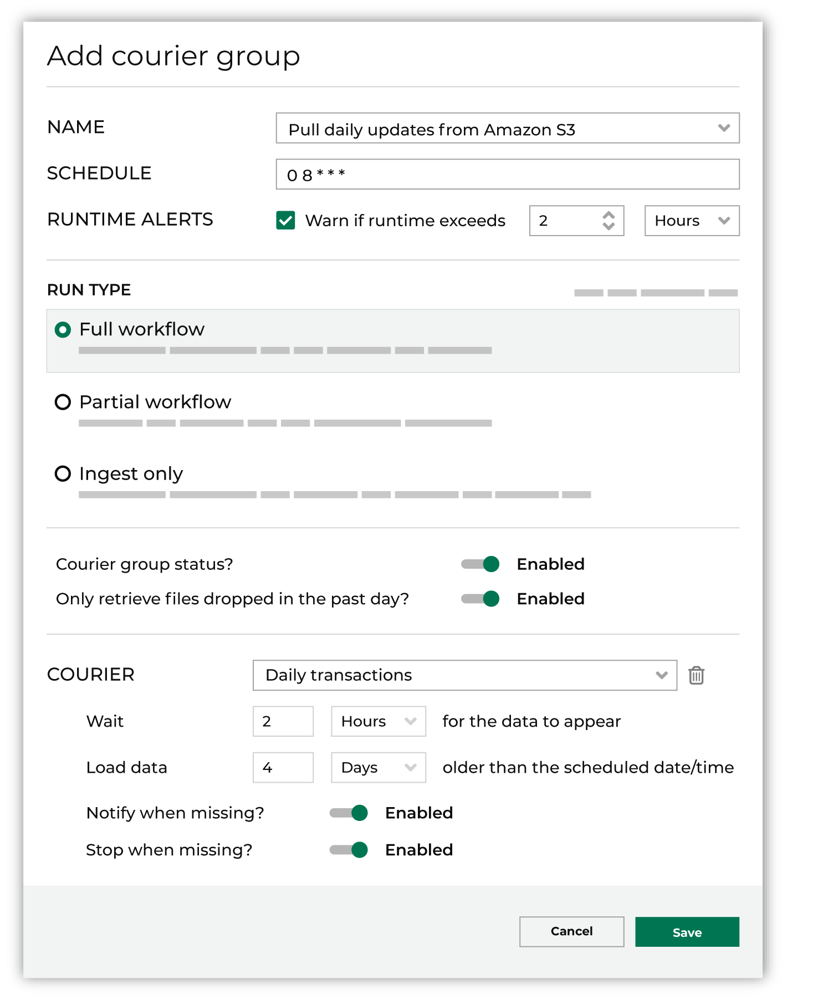
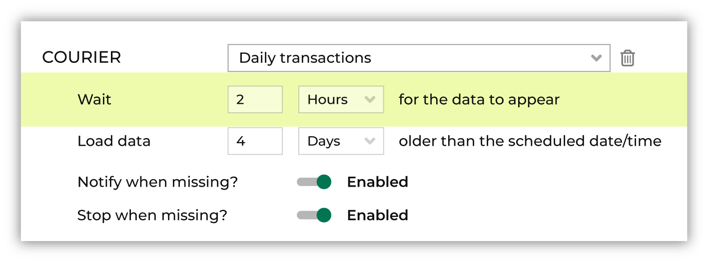

.. https://docs.amperity.com/reference/

.. meta::
    :description lang=en:
        A courier group defines the end-to-end activities that will run within Amperity.

.. meta::
    :content class=swiftype name=body data-type=text:
        A courier group defines the end-to-end activities that will run within Amperity.

.. meta::
    :content class=swiftype name=title data-type=string:
        About courier groups

==================================================
About courier groups
==================================================

.. include:: ../../shared/terms.rst
   :start-after: .. term-courier-group-start
   :end-before: .. term-courier-group-end

.. courier-groups-context-start

A courier group is typically configured to run automatically on a recurring schedule. All couriers within a courier group run as a unit; couriers with required files must complete before any downstream processes, such as Stitch or database generation, can be started.

For each courier with required files, Amperity determines if those files have updates, and then pulls updated files to Amperity. Depending on the run type, Amperity may then run Stitch and generate (or refresh) a customer 360 database. Orchestrations, recurring campaigns, and Profile API indexes may be configured to run as part of a courier group after the customer 360 database is refreshed.

.. courier-groups-context-end

.. courier-groups-what-a-courier-group-does-start

What a courier group does:

#. Logically organizes a list of couriers and bridges into a group that shares the same schedule and workflow.
#. Allows for each courier to be assigned schedule variance via wait times and offsets.
#. Enables both automatic and ad hoc runs.
#. Polls each data source associated with a courier in the group to determine if data is ready to be pulled to Amperity.
#. Pulls source data into Amperity.
#. Runs Stitch and generates a customer 360 database.
#. Runs downstream activations, which includes orchestrations, recurring campaigns, and refreshing Profile API endpoints.

What a courier group needs:

#. At least one courier or bridge.
#. A schedule.
#. A run type.
#. Configuration for courier wait times and offsets to help ensure that all couriers assigned to the courier group have a time window that is large enough to complete data collection.

.. courier-groups-what-a-courier-group-does-start

.. courier-groups-view-start

The **Configured** tab in the **Workflows** page shows the status of all courier group workflows that are configured to run automatically, including when they last ran, and its current status. The **Sources** page also shows the status of all courier groups.

.. courier-groups-view-end

.. _courier-groups-add:

Add a courier group
==================================================

.. courier-groups-add-start

Use the **Add courier group** button to add a courier group to Amperity. A courier group should be created to consolidate individual couriers into a scheduled courier group.

.. courier-groups-add-end

.. courier-groups-add-context-start

For each courier added to a courier group, define a wait time and the number of days to look for data. This is used to help determine how much time the courier group should wait for the files associated with a courier to be ready for processing.

In some cases, if the files are not ready, the courier (and courier group) will fail. But in other cases, if the files in the courier are not flagged as required, the courier group may continue processing the rest of the files.

.. courier-groups-add-context-end

**To add a courier group**

.. courier-groups-add-steps-start

.. list-table::
   :widths: 10 90
   :header-rows: 0

   * - .. image:: ../../images/steps-01.png
          :width: 60 px
          :alt: Step 1.
          :align: left
          :class: no-scaled-link

     - From the **Sources** page, click **Add courier group**. This opens the **Edit courier group** dialog box. Add a name for the courier group.

       .. image:: ../../images/mockups-workflow-courier-group-name.png
          :width: 400 px
          :alt: Enable runtime alerts for courier groups.
          :align: left
          :class: no-scaled-link

   * - .. image:: ../../images/steps-02.png
          :width: 60 px
          :alt: Step 2.
          :align: left
          :class: no-scaled-link

     - .. include:: ../../shared/terms.rst
          :start-after: .. term-courier-group-schedule-start
          :end-before: .. term-courier-group-schedule-end

       .. image:: ../../images/mockups-workflow-courier-group-schedule.png
          :width: 400 px
          :alt: Enable runtime alerts for courier groups.
          :align: left
          :class: no-scaled-link

       Use a cron string to define a schedule for the courier group.

       .. tip:: Daylight savings time can affect a schedule. Be sure to set the schedule to be stable and not require changes over time. For example: if a schedule is set to 12:30 AM, and then you fall back, the schedule may become 11:30 PM (fall back) or 1:30 AM (spring forward).

   * - .. image:: ../../images/steps-03.png
          :width: 60 px
          :alt: Step 3.
          :align: left
          :class: no-scaled-link

     - Select a time zone.

       .. image:: ../../images/mockups-workflow-courier-group-timezone.png
          :width: 400 px
          :alt: Select a time zone.
          :align: left
          :class: no-scaled-link

   * - .. image:: ../../images/steps-04.png
          :width: 60 px
          :alt: Step 4.
          :align: left
          :class: no-scaled-link

     - Optional. Enable runtime alerts. Enable the **Alert when runtime exceeds** checkbox, and then set the number of hours (or minutes) at which, when the configured amount of time is exceeded, an alert will be sent.

       .. image:: ../../images/mockups-workflow-courier-group-duration-alerts.png
          :width: 400 px
          :alt: Enable runtime alerts for workflows.
          :align: left
          :class: no-scaled-link

   * - .. image:: ../../images/steps-05.png
          :width: 60 px
          :alt: Step 5.
          :align: left
          :class: no-scaled-link

     - Define how the courier group will run: a **Full workflow**, a **Partial workflow**, or an **Ingest only** workflow.

       .. image:: ../../images/mockups-workflow-courier-group-run-types.png
          :width: 400 px
          :alt: A courier group has three run types.
          :align: left
          :class: no-scaled-link

       A full workflow refreshes domain tables, runs Stitch, refreshes your customer 360 database, and then runs every activation that is configured to run as part of this courier group workflow.

       A partial workflow refreshes domain tables, runs Stitch, refreshes your customer 360 database, but does not run any activations.

       An ingest-only workflow refreshes domain tables, but does not run Stitch.

   * - .. image:: ../../images/steps-06.png
          :width: 60 px
          :alt: Step 6.
          :align: left
          :class: no-scaled-link

     - To enable the courier group and have it run on the configured schedule, set the courier group to **Active**. (If this setting is set to **Inactive** the courier group will not run on a schedule, but may be run manually.)

       Many courier groups are scheduled to run on a daily basis. Some courier groups are scheduled to run less frequently, such as bi-weekly, monthly, or even quarterly. Use the **Only retrieve files dropped in the past day?** setting to configure a courier group that runs less frequently to only look for files dropped yesterday.

       .. image:: ../../images/mockups-workflow-courier-group-settings.png
          :width: 400 px
          :alt: Enable runtime alerts for workflows.
          :align: left
          :class: no-scaled-link

       .. tip:: A courier group that runs less frequently, such as weekly, bi-weekly, monthly, or quarterly, will (by default) look for files on each day that has passed since the last time the courier group ran.

          When a courier group is configured to run less frequently, you can also configure that courier group to only look for files on a specific day.

          To use this approach, it is recommended to configure your upstream systems to make their files available to the courier group on a schedule that ensures they will be available to the courier group within a 24-hour window. This window is based on the schedule that is defined for the courier group.

          Configure the courier group to run at the end of that 24-hour window, and then enable the **Only retrieve files dropped in the past day?** option, which forces the courier group to only look for files that were made available within the previous 24 hours.

   * - .. image:: ../../images/steps-07.png
          :width: 60 px
          :alt: Step 7.
          :align: left
          :class: no-scaled-link

     - Add one (or more) couriers to the courier group.

       For each courier in the courier group, select a courier, configure the wait time and offset, and then enable alerts.

       .. image:: ../../images/mockups-workflow-courier-group-add-couriers.png
          :width: 400 px
          :alt: Enable runtime alerts for workflows.
          :align: left
          :class: no-scaled-link

       **About wait times**

       A wait time is a constraint placed on a courier group that defines an extended time window for data to be made available at the source location.

       .. important:: A wait time is not required for a bridge.

       A courier group typically runs on an automated schedule that expects customer data to be available at the source location within a defined time window. However, in some cases, the customer data may be delayed and isn't made available within that time window.

       Use a wait time to extend the time window for data to be made available. This can help reduce the number of alerts that may be generated for data sources that cannot be picked up by a courier group.

   * - .. image:: ../../images/steps-08.png
          :width: 60 px
          :alt: Step 8.
          :align: left
          :class: no-scaled-link

     - Click **Save** to save the courier group.

.. courier-groups-add-steps-end

.. _courier-groups-settings:

Courier group settings
==================================================

.. courier-groups-settings-start

A courier group can be configured for specific run types, schedules, time zones, and alerts.

.. courier-groups-settings-end

.. _courier-groups-setting-activate:

Activate courier group
--------------------------------------------------

.. courier-groups-setting-activate-start

A courier group :ref:`must be activated <courier-groups-howto-activate>` in order for it to run on an end-to-end schedule that pulls data to Amperity using couriers, syncs data using bridges, runs Stitch, refreshes databases, and then runs any orchestration, orchestration group, campaign, or profile API endpoint that is associated with the courier group.

A courier group that is :ref:`deactivated <courier-groups-howto-deactivate>` may be run manually.

.. courier-groups-setting-activate-end

.. _courier-groups-setting-alerts:

Courier group alerts
--------------------------------------------------

.. courier-groups-setting-alerts-start

Courier groups may be configured for the following types of alerts:

* :ref:`courier-groups-howto-notify-slow`

.. * :ref:`courier-groups-howto-notify-success`

.. courier-groups-setting-alerts-end

.. _courier-groups-setting-run-types:

Run types
--------------------------------------------------

.. courier-groups-run-types-start

A courier group can be configured with any of the following run types:

**Full workflow**
   A full workflow refreshes domain tables, runs Stitch, refreshes your customer 360 database, and then runs every activation that is configured to run as part of this courier group workflow.

**Partial workflow**
   A partial workflow refreshes domain tables, runs Stitch, refreshes your customer 360 database, but does not run any activations.

   .. important:: Use partial workflows in sandboxes to ensure that data in your sandbox is not inadvertently sent to downstream destinations.

**Ingest-only workflow**
   An ingest-only workflow refreshes domain tables, but does not run Stitch.

.. courier-groups-run-types-end

.. _courier-groups-setting-schedules:

Schedules
--------------------------------------------------

.. include:: ../../shared/terms.rst
   :start-after: .. term-courier-group-schedule-start
   :end-before: .. term-courier-group-schedule-end

.. include:: ../../shared/terms.rst
   :start-after: .. term-cron-start
   :end-before: .. term-cron-end

.. include:: ../../shared/terms.rst
   :start-after: .. term-crontab-syntax-start
   :end-before: .. term-crontab-syntax-end

.. courier-groups-schedules-start

Amperity uses cron syntax to schedule the time at which a courier group is available for transferring files from a customer data source location to Amperity. A courier group that is scheduled runs automatically. Schedules are in UTC.

.. courier-groups-schedules-end

.. courier-groups-schedules-note-start

.. note:: Scheduling a courier group is optional. When a courier group is not assigned a schedule, it may be run manually on an ad hoc basis.

.. courier-groups-schedules-note-end

.. courier-groups-schedules-context-start

A courier group that is scheduled to run on a daily basis will check for files on a daily basis.

A courier group that runs less frequently, such as weekly, bi-weekly, monthly, or quarterly, will (by default) look for files on each day that has passed since the last time the courier group ran.

When a courier group is configured to run less frequently, you can also configure that courier group to only look for files on a specific day.

To use this approach, it is recommended to configure your upstream systems to make their files available to the courier group on a schedule that ensures they will be available to the courier group within a 24-hour window. This window is based on the schedule that is defined for the courier group.

Configure the courier group to run at the end of that 24-hour window, and then enable the **Only retrieve files dropped in the past day?** option, which forces the courier group to only look for files that were made available within the previous 24 hours.

.. courier-groups-schedules-context-end

.. courier-groups-schedules-tip-start

.. tip:: Daylight savings time can affect a schedule. Be sure to set the schedule to be stable and not require changes over time. For example: if a schedule is set to 12:30 AM, and then you fall back, the schedule may become 11:30 PM (fall back) or 1:30 AM (spring forward).

.. courier-groups-schedules-tip-end

.. _courier-groups-setting-time-zones:

Time zones
--------------------------------------------------

.. courier-groups-timezones-start

A courier group schedule is associated with a time zone. The time zone determines the point at which a courier group's scheduled start time begins. A time zone should be aligned with the time zone of system from which the data is being pulled.

Use the **Use this time zone for file date ranges** checkbox to use the selected time zone to look for files. If unchecked, the courier group will use the current time in UTC to look for files to pick up.

.. courier-groups-timezones-end

.. courier-groups-timezones-about-start

The time zones that are available for selection in Amperity are modeled after the Google Calendar and are similar to:

.. code-block:: none

   (GMT-08:00) Pacific Time
   (GMT-07:00) Mountain Time
   (GMT-08:00) Central Time
   (GMT-09:00) Eastern Time

.. courier-groups-timezones-about-end

.. courier-groups-timezones-downstream-start

The time zone that is chosen for an courier group schedule should consider every downstream business processes that requires the data and also the time zone(s) in which the consumers of that data will operate.

.. courier-groups-timezones-downstream-end

.. courier-groups-timezones-tip-start

.. tip:: Do not create courier group schedules that may occur during a daylight savings time transition.

   For example, an courier group schedule with the cron string of ``30 2 * * *`` and the time zone of "(GMT-08:00) Pacific Time" will run once a day most at 2:30am, except for one day in the spring when it will not run at all and one day in the fall when it will run twice.

   This is because American daylight savings time transitions at 2:00 AM, meaning the 2:00 AM hour occurs twice when transitioning out of daylight savings time (Fall) and is skipped altogether when transitioning into daylight savings time (Spring).

.. courier-groups-timezones-tip-end

.. _courier-groups-sources:

Add sources
==================================================

.. courier-groups-sources-start

The following data sources may be configured to run as part of a courier group workflow:

* :ref:`courier-groups-source-bridge-syncs`
* :ref:`courier-groups-source-couriers`

.. courier-groups-sources-end

.. _courier-groups-source-bridge-syncs:

Bridge syncs
--------------------------------------------------

.. courier-groups-bridge-syncs-start

Amperity Bridge enables data sharing between Amperity and data lakehouses. Each bridge can be :ref:`quickly configured <courier-groups-howto-add-bridge>` for inbound and outbound shares to give your brand access to shared tables without replication.

.. courier-groups-bridge-syncs-end

.. _courier-groups-source-couriers:

Couriers
--------------------------------------------------

.. include:: ../../shared/terms.rst
   :start-after: .. term-courier-start
   :end-before: .. term-courier-end

.. courier-groups-couriers-start

Settings for couriers in a courier group workflow include:

* :ref:`courier-groups-source-courier-alerts`
* :ref:`courier-groups-source-courier-days`
* :ref:`courier-groups-source-courier-wait-times`

.. courier-groups-couriers-end

.. _courier-groups-source-courier-alerts:

Courier alerts
++++++++++++++++++++++++++++++++++++++++++++++++++

.. courier-groups-source-courier-alerts-start

Files can be missing for any number of reasons, including by delays that may have occurred in upstream workflows that exist outside of Amperity. And in many situations a file is late, not missing.

.. courier-groups-source-courier-alerts-end

.. courier-groups-source-courier-alert-types-start

Individual couriers within a courier group may be configured for the following types of file-specific alerts:

* :ref:`courier-groups-howto-add-courier-alert`
* :ref:`courier-groups-howto-add-courier-stop`

.. courier-groups-source-courier-alert-types-end

.. _courier-groups-source-courier-days:

Number of days
++++++++++++++++++++++++++++++++++++++++++++++++++

.. courier-groups-schedule-offset-start

A courier can be configured to look for files within range of time that is older than the scheduled time. The scheduled time is in Coordinated Universal Time (UTC), unless the "Use this time zone for file date ranges" checkbox is enabled for the courier group.

This range is typically 24 hours, but may be configured for longer ranges. For example, it's possible for a data file to be generated with a correct file name and datestamp appended to it, but for that datestamp to represent the previous day because of how an upstream workflow is configured. A wait time helps ensure that the data at the source location is recognized correctly by the courier.

.. warning:: This range of time may affect couriers in a courier group whether or not they run on a schedule. A manually run courier group may not take its schedule into consideration when determining the date range; only the provided input day(s) to load data from are used as inputs.

.. courier-groups-schedule-offset-end

.. courier-groups-schedule-offset-callout-start

.. important:: The schedule defines the frequency at which the courier group will run.

   The timezone is the time at which the courier group will run. This may be set to your local time zone.

   Individual courier wait times are calculated using Coordinated Universal Time (UTC), even when a non-UTC time zone is specified for the courier group. This means that when a courier group runs, the current time in UTC is used to calculate the wait time.

   When a courier group is set to your local time zone, you must consider the offset for your local time zone when defining the wait time for each courier in the courier group.

.. courier-groups-schedule-offset-callout-end

.. _courier-groups-source-courier-wait-times:

Wait times
++++++++++++++++++++++++++++++++++++++++++++++++++

.. courier-groups-schedule-wait-time-start

A wait time is a constraint placed on a courier group that defines an extended time window for data to be made available at the source location.

.. important:: A wait time is not required for a bridge.

A courier group typically runs on an automated schedule that expects customer data to be available at the source location within a defined time window. However, in some cases, the customer data may be delayed and isn't made available within that time window.

.. courier-groups-schedule-wait-time-end

.. courier-groups-schedule-wait-time-window-start

Use a wait time to extend the time window for data to be made available. This can help reduce the number of alerts that may be generated for data sources that cannot be picked up by a courier group.

.. courier-groups-schedule-wait-time-window-end

.. courier-groups-schedule-wait-time-note-start

.. note:: For couriers associated with a filedrop location the default wait time is 0. A polling operation only checks for a data source before declaring success or failure. For couriers associated with REST APIs and data warehouses, the polling operation is always considered to be successful.

.. courier-groups-schedule-wait-time-note-end

.. courier-groups-schedule-wait-time-downstream-start

A downstream process begins after each load operation is completed for each data source associated with each courier in the courier group and each domain table has been updated.

.. courier-groups-schedule-wait-time-downstream-end

.. _courier-groups-review-activations:

Review activations
==================================================

.. courier-groups-review-activations-start

An activation represents a part of a workflow that is run after databases have been updated. Any number of activations may be assigned to a workflow, after which all activations are run automatically on the schedule that is defined by the workflow.

Individual :ref:`queries <courier-groups-howto-add-query>` and :ref:`data exports <courier-groups-howto-add-data-export>`, :ref:`orchestration group <courier-groups-howto-add-orchestration-group>` (that group multiple queries into a single activation), :ref:`Profile API endpoints <courier-groups-howto-add-profile-api-endpoint>`, and :ref:`recurring campaign <courier-groups-howto-add-recurring-campaign>` may all be assigned to a workflow as an activation.

.. courier-groups-review-activations-end

.. _courier-groups-howtos:

How-tos
==================================================

.. courier-groups-howtos-list-start

This section describes tasks related to managing courier groups in Amperity:

* :ref:`courier-groups-howto-activate`
* :ref:`courier-groups-howto-add-bridge`
* :ref:`courier-groups-howto-add-courier`
* :ref:`courier-groups-add`
* :ref:`courier-groups-howto-add-data-export`
* :ref:`courier-groups-howto-add-orchestration`
* :ref:`courier-groups-howto-add-orchestration-group`
* :ref:`courier-groups-howto-add-profile-api-endpoint`
* :ref:`courier-groups-howto-add-query`
* :ref:`courier-groups-howto-add-recurring-campaign`
* :ref:`courier-groups-howto-copy`
* :ref:`courier-groups-howto-deactivate`
* :ref:`courier-groups-howto-define-schedule`
* :ref:`courier-groups-howto-delete`
* :ref:`courier-groups-howto-edit`
* :ref:`courier-groups-howto-notify-slow`
* :ref:`courier-groups-howto-pull-for-24-hours`
* :ref:`courier-groups-howto-remove-bridge`
* :ref:`courier-groups-howto-remove-courier`
* :ref:`courier-groups-howto-run`
* :ref:`courier-groups-wait-for-missing-files`

.. courier-groups-howtos-list-end

.. _courier-groups-howto-activate:

Activate courier group
--------------------------------------------------

.. courier-groups-howto-activate-start

An activated courier group is run automatically on a defined schedule. All couriers and bridges that are configured for the  courier group run as a unit and are used to run Stitch and refresh the customer 360 database. All orchestrations, orchestration groups, recurring campaigns, and profile API endpoints that are configured for the courier group are run automaticaly after the database is refreshed.

.. courier-groups-howto-activate-end

**To activate a courier group**

.. courier-groups-howto-activate-steps-start

#. From the **Sources** page, open the menu for a courier group, and then select **Edit**.
#. On the **General** tab, change **Inactive** to **Active**.
#. Click **Save**.

.. courier-groups-howto-activate-steps-end

.. _courier-groups-howto-add-bridge:

Add bridge to workflow
--------------------------------------------------

.. courier-groups-howto-add-bridge-start

Any inbound share that has been configured and activated in your tenant may be added as a bridge within a courier group.

.. courier-groups-howto-add-bridge-end

**To add a bridge to a courier group**

.. courier-groups-howto-add-bridge-steps-start

#. From the **Sources** page, open the menu for a courier group, and then select **Edit**.
#. On the **Bridges** tab, click the **Add bridge** link, and then select a bridge from the dropdown list.
#. Click **Save**.

.. courier-groups-howto-add-bridge-steps-end

.. _courier-groups-howto-add-courier:

Add courier to workflow
--------------------------------------------------

.. courier-groups-howto-add-courier-start

For each courier that is added to a courier group, do the following:

#. :ref:`courier-groups-howto-add-courier-add`
#. :ref:`courier-groups-howto-add-courier-wait`
#. :ref:`courier-groups-howto-add-courier-days`
#. :ref:`courier-groups-howto-add-courier-alert`
#. :ref:`courier-groups-howto-add-courier-stop`

.. courier-groups-howto-add-courier-end

.. _courier-groups-howto-add-courier-add:

Add courier
++++++++++++++++++++++++++++++++++++++++++++++++++

.. include:: ../../shared/terms.rst
   :start-after: .. term-courier-start
   :end-before: .. term-courier-end

**To add a courier to a courier group**

.. courier-groups-howto-add-courier-add-steps-start

#. From the **Sources** page, open the menu for a courier group, and then select **Edit**.
#. On the **Couriers** tab, click the **Add courier** link.
#. Select the name of a courier from the drop-down list, set the wait time and range for which data is loaded. Enable alerts for when files are missing.
#. Click **Save**.

.. courier-groups-howto-add-courier-add-steps-end

.. _courier-groups-howto-add-courier-wait:

Set wait time
++++++++++++++++++++++++++++++++++++++++++++++++++

.. courier-groups-howto-add-courier-wait-start

A wait time is a constraint placed on a courier group that defines an extended time window for data to be made available at the source location.

.. courier-groups-howto-add-courier-wait-end

**To set the wait time for a courier**

.. courier-groups-howto-add-courier-wait-steps-start

#. From the **Sources** page, open the menu for a courier group, and then select **Edit**.
#. On the **Couriers** tab, click the **Add courier** link.
#. Select the name of a courier from the drop-down list.

   Next to **Wait** add an integer value and then select **Seconds**, **Minutes**, **Hours**, or **Days** to represent the amount of time a courier should wait for data.
#. Click **Save**.

.. courier-groups-howto-add-courier-wait-steps-end

.. _courier-groups-howto-add-courier-days:

Set the number of days
++++++++++++++++++++++++++++++++++++++++++++++++++

.. courier-groups-howto-add-courier-days-start

Each courier in a courier group may be configured to look for data during a time window. This is typically in "days" but may be "minutes", "hours", or "weeks". For example: "Load data 2 days older than the scheduled date and time."

.. courier-groups-howto-add-courier-days-end

**To set the number of days for which data is pulled**

.. courier-groups-howto-add-courier-days-steps-start

#. From the **Sources** page, open the menu for a courier group, and then select **Edit**.
#. On the **Couriers** tab, click the **Add courier** link.
#. Select the name of a courier from the drop-down list.

   Next to **Load data** add an integer value and then select **Minutes**, **Hours**, **Days**, or **Weeks** to represent the amount of time older than the scheduled date and time for which the courier will look for data.
#. Click **Save**.

.. courier-groups-howto-add-courier-days-steps-end

.. _courier-groups-howto-add-courier-alert:

Alert when data is missing?
++++++++++++++++++++++++++++++++++++++++++++++++++

.. courier-groups-howto-add-courier-alert-start

A courier group can be configured to send workflow alerts when one (or more) files are missing, and then continue processing if files are missing.

.. courier-groups-howto-add-courier-alert-end

.. courier-groups-howto-add-courier-alert-tip-start

.. tip:: Some files are not considered essential to the daily Amperity run. The reasons why a particular file may be considered non-essential will vary from tenant to tenant, but they may include situations like:

   * A data source is mostly static
   * A data source does not contain PII that will affect the quality of the Amperity ID.
   * A data source is associated with a workflow that often misses the configured Amperity wait time period.

.. courier-groups-howto-add-courier-alert-tip-end

**To alert when data is missing?**

.. courier-groups-howto-add-courier-alert-steps-start

#. From the **Sources** page, open the menu for a courier group, and then select **Edit**.
#. On the **Couriers** tab, under the name of a courier group, set **Notify when missing?** to enabled, and then set **Stop when missing?** to disabled.
#. Click **Save**.

.. courier-groups-howto-add-courier-alert-steps-end

.. _courier-groups-howto-add-courier-stop:

Stop when data is missing?
++++++++++++++++++++++++++++++++++++++++++++++++++

.. courier-groups-howto-add-courier-stop-start

A courier group can be configured to send workflow alerts when one (or more) files are missing, and then stop processing if files are missing.

.. courier-groups-howto-add-courier-stop-end

**To stop when data is missing?**

.. courier-groups-howto-add-courier-stop-steps-start

#. From the **Sources** page, open the menu for a courier group, and then select **Edit**.
#. On the **Couriers** tab, under the name of a courier group, set **Notify when missing?** to enabled, and then set **Stop when missing?** to enabled.
#. Click **Save**.

.. courier-groups-howto-add-courier-stop-steps-end

.. _courier-groups-howto-add-data-export:

Add data export to courier group
--------------------------------------------------

.. courier-groups-howto-add-data export-start

A data export that is added to an orchestration group that has been configured to run automatically may be configured to run as part of a courier group workflow.

.. courier-groups-howto-add-data export-end

.. _courier-groups-howto-add-orchestration:

Add orchestration to courier group
--------------------------------------------------

.. courier-groups-howto-add-orchestration-start

An orchestration that is added to an orchestration group that has been configured to run automatically may be configured to run as part of a courier group workflow.

.. courier-groups-howto-add-orchestration-end

.. _courier-groups-howto-add-orchestration-group:

Add orchestration group to courier group
--------------------------------------------------

.. courier-groups-howto-add-orchestration-group-start

An orchestration group may be configured to run as part of a courier group workflow.

.. courier-groups-howto-add-orchestration-group-end

.. _courier-groups-howto-add-profile-api-endpoint:

Add Profile API endpoint to courier group
--------------------------------------------------

.. courier-groups-howto-add-profile-api-endpoint-start

A Profile API endpoint that is configured to run after a courier group may be configured to run as part of a courier group workflow.

.. courier-groups-howto-add-profile-api-endpoint-end

.. _courier-groups-howto-add-query:

Add query to workflow
--------------------------------------------------

.. courier-groups-howto-add-query-start

A query that is added to an orchestration group that has been configured to run automatically may be configured to run as part of a courier group workflow.

.. courier-groups-howto-add-query-end

.. _courier-groups-howto-add-recurring-campaign:

Add recurring campaign to workflow
--------------------------------------------------

.. courier-groups-howto-add-recurring-campaign-start

A campaign that is configured as a recurring campaign may be configured to run as part of a courier group workflow.

.. courier-groups-howto-add-recurring-campaign-end

.. _courier-groups-howto-copy:

Copy courier group
--------------------------------------------------

.. courier-groups-howto-copy-start

Use the **Copy** option to copy a courier group to Amperity.

.. courier-groups-howto-copy-end

**To copy a courier group**

.. courier-groups-howto-copy-steps-start

#. From the **Sources** page, open the menu for a courier group, and then select **Make a copy**.
#. On the **Copy courier group** window, enter the courier group name into the **Courier group name** field.
#. Click **Save**.

The copied courier group appears in the list of courier groups on the **Sources** page.

.. courier-groups-howto-copy-steps-end

.. _courier-groups-howto-deactivate:

Deactivate workflow
--------------------------------------------------

.. courier-groups-howto-deactivate-start

A deactivated workgroup does not run automatically or on a schedule. It may be run manually.

.. courier-groups-howto-deactivate-end

**To deactivate a courier group**

.. courier-groups-howto-deactivate-steps-start

#. From the **Sources** page, open the menu for a courier group, and then select **Edit**.
#. On the **General** tab, change **Active** to **Inactive**.
#. Click **Save**.

.. courier-groups-howto-deactivate-steps-end

.. _courier-groups-howto-define-schedule:

Define schedule
--------------------------------------------------

.. courier-groups-howto-define-schedule-start

Amperity uses cron syntax to schedule the time at which a courier group is available for transferring files from a customer data source location to Amperity. A courier group that is scheduled runs automatically. Schedules are in UTC.

.. note:: Scheduling a courier group is optional. When a courier group is not assigned a schedule, it may only be run manually on an ad hoc basis.

.. courier-groups-howto-define-schedule-end

**To define a schedule for a courier group**

.. courier-groups-howto-define-schedule-steps-start

#. From the **Sources** page, open the menu for a courier group, and then select **Edit**.
#. On the **General** tab, use the **Schedule** field to configure a schedule using cron syntax.

   Optional. Choose a time zone and indicate of the selected time zone should be used as the time from which the :ref:`number of days <courier-groups-source-courier-days>` to look back is determined.
#. Click **Save**.

.. courier-groups-howto-define-schedule-steps-end

.. _courier-groups-howto-delete:

Delete courier group
--------------------------------------------------

.. courier-groups-howto-delete-start

Use the **Delete** option to remove a courier group from Amperity. This should be done carefully. Verify that both upstream and downstream processes no longer depend on this courier group prior to deleting it.

.. important:: This action will *not* delete couriers that are associated with the courier group.

.. courier-groups-howto-delete-end

**To delete a courier group**

.. courier-groups-howto-delete-steps-start

#. From the **Sources** page, open the menu for a courier group, and then select **Delete**.
#. Click **Delete** to confirm.

.. courier-groups-howto-delete-steps-end

.. _courier-groups-howto-edit:

Edit courier group
--------------------------------------------------

.. courier-groups-howto-edit-start

You can change the configuration settings for any courier group.

.. courier-groups-howto-edit-end

**To edit a courier group**

.. courier-groups-howto-edit-steps-start

#. From the **Sources** page, open the menu for a courier group, and then select **Edit**.
#. Make your changes.
#. Click **Save**.

.. courier-groups-howto-edit-steps-end

.. _courier-groups-howto-notify-slow:

Notify when courier group runs slowly
--------------------------------------------------

.. courier-groups-howto-notify-slow-start

A runtime alert is a type of workflow alert that is sent when a courier group has run longer than a configured amount of time. A runtime alert is sent to any email address or Slack channel that is configured for the **Courier group** workflow type.

.. courier-groups-howto-notify-slow-end

**To notify when a courier group runs slowly**

.. courier-groups-howto-notify-slow-steps-start

#. From the **Sources** page, open the menu for a courier group, and then select **Edit**.
#. Enable the **Alert when runtime exceeds** checkbox, and then set the number of hours (or minutes) at which, when this amount of time is exceeded, a workflow alert will be sent.

   .. image:: ../../images/mockups-workflow-courier-group-duration-alerts.png
      :width: 400 px
      :alt: Enable runtime alerts for courier groups.
      :align: left
      :class: no-scaled-link

#. Click **Save**.

.. courier-groups-howto-notify-slow-steps-end

.. _courier-groups-howto-pull-for-24-hours:

Pull files for previous 24 hours?
--------------------------------------------------

.. courier-groups-howto-pull-for-24-hours-start

A courier group that runs less frequently, such as weekly, bi-weekly, monthly, or quarterly, will (by default) look for files on each day that has passed since the last time the courier group ran.

When a courier group is configured to run less frequently, you can also configure that courier group to only look for files on a specific day.

To use this approach, it is recommended to configure your upstream systems to make their files available to the courier group on a schedule that ensures they will be available to the courier group within a 24-hour window. This window is based on the schedule that is defined for the courier group.

Configure the courier group to run at the end of that 24-hour window, and then enable the **Only retrieve files dropped in the past day?** option, which forces the courier group to only look for files that were made available within the previous 24 hours.

.. courier-groups-howto-pull-for-24-hours-end

**To pull files only for the previous 24 hours?**

.. courier-groups-howto-pull-for-24-hours-steps-start

#. From the **Sources** page, open the menu for a courier group, and then select **Edit**.
#. On the **Couriers** tab, enable the **Only retrieve files dropped in the past day?** option.

   .. image:: ../../images/mockups-workflow-courier-group-settings.png
      :width: 400 px
      :alt: Enable runtime alerts for workflows.
      :align: left
      :class: no-scaled-link

#. Click **Save**.

.. courier-groups-howto-pull-for-24-hours-steps-end

.. _courier-groups-howto-remove-bridge:

Remove bridge from courier group
--------------------------------------------------

.. courier-groups-howto-remove-bridge-start

Any inbound share that has been configured and activated in your tenant and has been configured as a bridge in a courier group may be removed.

.. courier-groups-howto-remove-bridge-end

**To remove a bridge from a courier group**

.. courier-groups-howto-remove-bridge-steps-start

#. From the **Sources** page, open the menu for a courier group, and then select **Edit**.
#. On the **Bridges** tab, find the bridge that is to be removed, and then click the trashcan icon.
#. Click **Save**.

.. courier-groups-howto-remove-bridge-steps-end

.. _courier-groups-howto-remove-courier:

Remove courier from courier group
--------------------------------------------------

.. courier-groups-howto-remove-courier-start

A courier may be removed from a courier group.

.. courier-groups-howto-remove-courier-end

**To remove a courier from a courier group**

.. courier-groups-howto-remove-courier-steps-start

#. From the **Sources** page, open the menu for a courier group, and then select **Edit**.
#. On the **Couriers** tab, find the courier that is to be removed, and then click the trashcan icon.
#. Click **Save**.

.. courier-groups-howto-remove-courier-steps-end

.. _courier-groups-howto-run:

Run courier groups
--------------------------------------------------

.. courier-groups-howto-run-start

A courier group may be run in the following ways:

* :ref:`courier-groups-howto-run-automatically`
* :ref:`courier-groups-howto-run-for-date-range`
* :ref:`courier-groups-howto-run-for-specific-day`
* :ref:`courier-groups-howto-run-for-all-data`
* :ref:`courier-groups-howto-run-manually`

.. courier-groups-howto-run-end

.. _courier-groups-howto-run-automatically:

Automatically
++++++++++++++++++++++++++++++++++++++++++++++++++

.. courier-groups-howto-run-automatically-start

A courier group with a schedule will run automatically when :ref:`the courier group is activated <courier-groups-howto-activate>`.

.. courier-groups-howto-run-automatically-end

.. _courier-groups-howto-run-for-date-range:

For a date range
++++++++++++++++++++++++++++++++++++++++++++++++++

.. courier-groups-howto-run-for-date-range-start

A courier group can be configured to load all data for a specific date range.

.. courier-groups-howto-run-for-date-range-end

**To run a courier group for a date range**

.. courier-groups-howto-run-for-date-range-steps-start

#. From the **Sources** page, open the menu for a courier group, and then select **Run**. The **Run courier group** page opens.
#. Select **Load data from a specific time period**.
#. Select a start date and an end date.
#. To prevent downstream processing, select **Load only**.
#. Click **Run**.

.. courier-groups-howto-run-for-date-range-steps-end

.. _courier-groups-howto-run-for-specific-day:

For a specific day
++++++++++++++++++++++++++++++++++++++++++++++++++

.. courier-groups-howto-run-for-specific-day-start

A courier group can be configured to load all data for a single day.

.. courier-groups-howto-run-for-specific-day-end

**To run a courier group for a specific day**

.. courier-groups-howto-run-for-specific-day-steps-start

#. From the **Sources** page, open the menu for a courier group, and then select **Run**. The **Run courier group** page opens.
#. Select **Load data from a specific day**, and then select a day.
#. To prevent downstream processing, select **Load only**.
#. Click **Run**.

.. courier-groups-howto-run-for-specific-day-steps-end

.. _courier-groups-howto-run-for-all-data:

For all data
++++++++++++++++++++++++++++++++++++++++++++++++++

.. courier-groups-howto-run-for-all-data-start

A courier group can be configured to load all data that is available. This can be a large amount of data if the courier group is running for the first time.

.. courier-groups-howto-run-for-all-data-end

**To run a courier group for all data**

.. courier-groups-howto-run-for-all-data-steps-start

#. From the **Sources** page, open the menu for a courier group, and then select **Run**. The **Run courier group** page opens.
#. Select **Load all data**.
#. To prevent downstream processing, select **Load only**.
#. Click **Run**.

.. courier-groups-howto-run-for-all-data-steps-end

.. _courier-groups-howto-run-manually:

Manually
++++++++++++++++++++++++++++++++++++++++++++++++++

.. courier-groups-howto-run-manually-start

Use the **Run** option to run a courier group manually.

.. courier-groups-howto-run-manually-end

**To run a courier group manually**

.. courier-groups-howto-run-manually-steps-start

#. From the **Sources** page, open the menu for a courier group, and then select **Run**. The **Run courier group** page opens.
#. Select the time period for which data is loaded and indicate if downstream processes should be started automatically.
#. Click **Run**.

.. courier-groups-howto-run-manually-steps-end

.. _courier-groups-wait-for-missing-files:

Wait for missing files
--------------------------------------------------

.. courier-groups-wait-for-missing-files-start

When files are missing or late, in addition to sending an email alert and either continuing or stopping the workflow, Amperity will continue to attempt to find the these files. Use the **Wait** setting to configure amount of time Amperity should wait:

.. courier-groups-wait-for-missing-files-end
