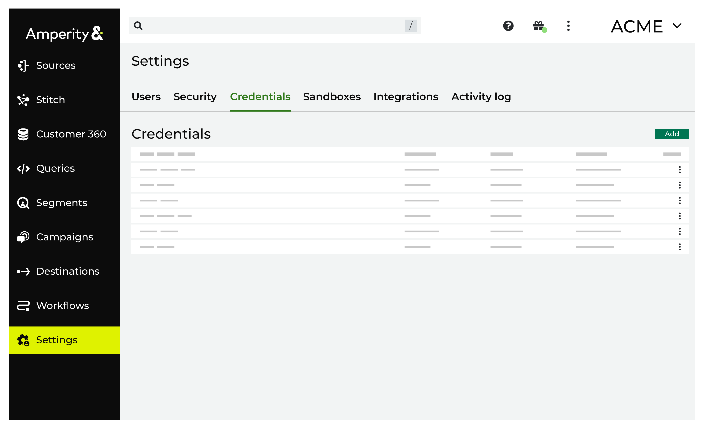

.. https://docs.amperity.com/reference/

.. |destination-name| replace:: the name of application for which credentials are configired
.. |credential-type| replace:: selected
.. |where-send| replace:: the application for which credentials are being configured
.. |sftp-hostname| replace:: "sftp.acme.com"

.. meta::
    :description lang=en:
        View and manage the credentials that are used to enable data sources and destinations.

.. meta::
    :content class=swiftype name=body data-type=text:
        View and manage the credentials that are used to enable data sources and destinations.

.. meta::
    :content class=swiftype name=title data-type=string:
        About credentials

==================================================
About credentials
==================================================

.. credentials-start

Use the **Credentials** page to view and manage credentials for data sources and destinations. Any credential that you add from the **Sources** or **Destinations** page is available from the **Credentials** page. You may also define credentials directly from this tab.

.. credentials-end

.. credentials-context-start

In some cases, sources and destinations may use the same credentials, such as for an SFTP site or Amazon S3 bucket.

.. credentials-context-end

**To add credentials**

.. credentials-common-steps-start

.. list-table::
   :widths: 10 90
   :header-rows: 0

   * - .. image:: ../../images/steps-01.png
          :width: 60 px
          :alt: Step one.
          :align: center
          :class: no-scaled-link
     - .. include:: ../../shared/credentials_settings.rst
          :start-after: .. credential-steps-add-credential-start
          :end-before: .. credential-steps-add-credential-end

   * - .. image:: ../../images/steps-02.png
          :width: 60 px
          :alt: Step two.
          :align: center
          :class: no-scaled-link
     - .. include:: ../../shared/credentials_settings.rst
          :start-after: .. credential-steps-select-type-start
          :end-before: .. credential-steps-select-type-end

   * - .. image:: ../../images/steps-03.png
          :width: 60 px
          :alt: Step three.
          :align: center
          :class: no-scaled-link
     - .. include:: ../../shared/credentials_settings.rst
          :start-after: .. credential-steps-settings-intro-start
          :end-before: .. credential-steps-settings-intro-end

       **OAuth credentials only**

       .. include:: ../../shared/credentials_settings.rst
          :start-after: .. credential-oauth-refresh-token-start
          :end-before: .. credential-oauth-refresh-token-end

.. credentials-common-steps-end

.. _credentials-by-plugin:

Credentials by plugin
==================================================

.. TODO: Update the following paragraph to include sources after updating the list of credentials to also include sources.

.. credentials-by-plugin-start

The following sections list the credentials for each of the destinations that are available in Amperity.

.. credentials-by-plugin-end

.. _credential-active-campaign:

ActiveCampaign
--------------------------------------------------

.. include:: ../../shared/terms.rst
   :start-after: .. term-active-campaign-start
   :end-before: .. term-active-campaign-end

ActiveCampaign requires the following credentials:

**API key**

.. include:: ../../shared/credentials_settings.rst
   :start-after: .. credential-active-campaign-api-key-start
   :end-before: .. credential-active-campaign-api-key-end

**Base URL**

.. include:: ../../shared/credentials_settings.rst
   :start-after: .. credential-active-campaign-url-start
   :end-before: .. credential-active-campaign-url-end

.. _credential-amazon-s3:

Amazon S3
--------------------------------------------------

.. include:: ../../shared/terms.rst
   :start-after: .. term-amazon-s3-start
   :end-before: .. term-amazon-s3-end

.. credential-amazon-s3-start

Amazon S3 supports the following credential types:

**IAM role-to-role** credentials require the name of the Amazon S3 bucket and the target role ARN. Amperity provides the values for the Amperity role ARN and the external ID.

**IAM** credentials require the name of the Amazon S3 bucket, the IAM access key, and the IAM secret key. An IAM role ARN is optional.

.. credential-amazon-s3-end

.. _credential-acxiom:

Acxiom
--------------------------------------------------

.. include:: ../../shared/terms.rst
   :start-after: .. term-acxiom-start
   :end-before: .. term-acxiom-end

:ref:`See SFTP <credentials-sftp>`.

.. _credential-adobe-campaign:

Adobe Campaign
--------------------------------------------------

.. include:: ../../shared/terms.rst
   :start-after: .. term-adobe-campaign-start
   :end-before: .. term-adobe-campaign-end

:ref:`See SFTP <credentials-sftp>`.

.. _credential-adobe-customer-attributes:

Adobe Customer Attributes
--------------------------------------------------

.. include:: ../../shared/terms.rst
   :start-after: .. term-adobe-customer-attributes-start
   :end-before: .. term-adobe-customer-attributes-end

:ref:`See SFTP <credentials-sftp>`.

.. _credential-adobe-aep:

Adobe Experience Platform
--------------------------------------------------

.. include:: ../../shared/terms.rst
   :start-after: .. term-adobe-aep-start
   :end-before: .. term-adobe-aep-end

:ref:`See SFTP <credentials-sftp>`.

.. _credential-adobe-marketo:

Adobe Marketo
--------------------------------------------------

.. include:: ../../shared/terms.rst
   :start-after: .. term-adobe-marketo-start
   :end-before: .. term-adobe-marketo-end

Adobe Marketo requires the following credentials:

**Client ID and client secret**

.. include:: ../../shared/credentials_settings.rst
   :start-after: .. credential-adobe-marketo-client-id-start
   :end-before: .. credential-adobe-marketo-client-id-end

.. include:: ../../shared/credentials_settings.rst
   :start-after: .. credential-adobe-marketo-access-token-start
   :end-before: .. credential-adobe-marketo-access-token-end

**Subdomain**

.. include:: ../../shared/credentials_settings.rst
   :start-after: .. credential-adobe-marketo-subdomain-start
   :end-before: .. credential-adobe-marketo-subdomain-end

.. _credential-airship:

Airship
--------------------------------------------------

.. include:: ../../shared/terms.rst
   :start-after: .. term-airship-start
   :end-before: .. term-airship-end

:ref:`See SFTP <credentials-sftp>`.

.. _credential-amazon-ads:

Amazon Ads
--------------------------------------------------

.. include:: ../../shared/terms.rst
   :start-after: .. term-amazon-ads-start
   :end-before: .. term-amazon-ads-end

:ref:`See OAuth <credentials-oauth>`.

.. _credential-attentive:

Attentive
--------------------------------------------------

.. credential-attentive-start

Attentive is an automation platform for email and SMS marketing. Use the `Subscriptions <https://docs.attentive.com/openapi/reference/tag/Subscribers/>`__ |ext_link| and `Custom Attributes <https://docs.attentivemobile.com/openapi/reference/tag/Custom-Attributes/>`__ |ext_link| endpoints to extend customer profiles in Attentive with attributes from Amperity.

Use the `subscriber segment upload <https://docs.attentivemobile.com/pages/developer-guides/sftp-solution/subscriber-segment-upload/#subscriber-segment-upload>`__ |ext_link| process to manage lists of customers.

.. credential-attentive-end

Attentive requires the following credentials:

**API key**

.. include:: ../../shared/credentials_settings.rst
   :start-after: .. credential-attentive-api-key-start
   :end-before: .. credential-attentive-api-key-end

.. _credential-azure-blob-storage:

Azure Blob Storage
--------------------------------------------------

.. include:: ../../shared/terms.rst
   :start-after: .. term-azure-blob-storage-start
   :end-before: .. term-azure-blob-storage-end

.. credential-azure-blob-storage-start

Azure Blob Storage supports the following credential types:

**Connection string** credentials a connection string and the name of the Azure Blob Storage container.

**Shared access signature** credentials require the account name, a shared access signature, and the name of the Azure Blob Storage container.

**Storage URI** credentials require a storage URI and the name of the Azure Blob Storage container.

.. credential-azure-blob-storage-end

.. _credential-bazaarvoice:

BazaarVoice
--------------------------------------------------

.. include:: ../../shared/terms.rst
   :start-after: .. term-bazaarvoice-start
   :end-before: .. term-bazaarvoice-end

:ref:`See SFTP <credentials-sftp>`.

.. _credential-bluecore:

Bluecore
--------------------------------------------------

.. include:: ../../shared/terms.rst
   :start-after: .. term-bluecore-start
   :end-before: .. term-bluecore-end

:ref:`See SFTP <credentials-sftp>`.

.. _credential-braze:

Braze
--------------------------------------------------

.. include:: ../../shared/terms.rst
   :start-after: .. term-braze-start
   :end-before: .. term-braze-end

Braze requires the following credentials:

**API key**

.. include:: ../../shared/credentials_settings.rst
   :start-after: .. credential-braze-api-key-start
   :end-before: .. credential-braze-api-key-end

.. _credential-camelot-smm:

Camelot SMM
--------------------------------------------------

.. include:: ../../shared/terms.rst
   :start-after: .. term-camelot-smm-start
   :end-before: .. term-camelot-smm-end

:ref:`See SFTP <credentials-sftp>`.

.. _credential-cordial:

Cordial
--------------------------------------------------

.. include:: ../../shared/terms.rst
   :start-after: .. term-cordial-start
   :end-before: .. term-cordial-end

Cordial requires the following credentials:

**API key**

.. include:: ../../shared/credentials_settings.rst
   :start-after: .. credential-cordial-api-key-start
   :end-before: .. credential-cordial-api-key-end

**API URL**

.. include:: ../../shared/credentials_settings.rst
   :start-after: .. credential-cordial-api-url-start
   :end-before: .. credential-cordial-api-url-end

.. _credential-criteo:

Criteo
--------------------------------------------------

.. include:: ../../shared/terms.rst
   :start-after: .. term-criteo-start
   :end-before: .. term-criteo-end

:ref:`See OAuth <credentials-oauth>`.

.. _credential-ccc:

Cross Country Computer
--------------------------------------------------

.. include:: ../../shared/terms.rst
   :start-after: .. term-ccc-start
   :end-before: .. term-ccc-end

:ref:`See SFTP <credentials-sftp>`.

.. _credential-dynamics-365-marketing:

Dynamics 365 Marketing
--------------------------------------------------

.. include:: ../../shared/terms.rst
   :start-after: .. term-dynamics-365-marketing-start
   :end-before: .. term-dynamics-365-marketing-end

Dynamics 365 Marketing requires the following credentials:

**Azure tenant ID**

.. include:: ../../shared/credentials_settings.rst
   :start-after: .. credential-microsoft-dynamics-365-marketing-azure-tenant-id-start
   :end-before: .. credential-microsoft-dynamics-365-marketing-azure-tenant-id-end

**Azure client ID and client secret**

.. include:: ../../shared/credentials_settings.rst
   :start-after: .. credential-microsoft-dynamics-365-marketing-azure-client-id-and-secret-start
   :end-before: .. credential-microsoft-dynamics-365-marketing-azure-client-id-and-secret-end

.. _credential-epsilon-abacus:

Epsilon Abacus
--------------------------------------------------

.. include:: ../../shared/terms.rst
   :start-after: .. term-epsilon-abacus-start
   :end-before: .. term-epsilon-abacus-end

:ref:`See SFTP <credentials-sftp>`.

.. _credential-epsilon-conversant:

Epsilon Conversant
--------------------------------------------------

.. include:: ../../shared/terms.rst
   :start-after: .. term-epsilon-conversant-start
   :end-before: .. term-epsilon-conversant-end

:ref:`See SFTP <credentials-sftp>`.

.. _credential-epsilon-targeting:

Epsilon Targeting
--------------------------------------------------

.. include:: ../../shared/terms.rst
   :start-after: .. term-epsilon-targeting-start
   :end-before: .. term-epsilon-targeting-end

:ref:`See SFTP <credentials-sftp>`.

.. _credential-experian:

Experian
--------------------------------------------------

.. include:: ../../shared/terms.rst
   :start-after: .. term-experian-start
   :end-before: .. term-experian-end

:ref:`See SFTP <credentials-sftp>`.

.. _credential-google-cloud-storage:

Google Cloud Storage
--------------------------------------------------

.. include:: ../../shared/terms.rst
   :start-after: .. term-google-cloud-storage-start
   :end-before: .. term-google-cloud-storage-end

Google Cloud Storage credentials require the name of the storage bucket and the service account key.

.. _credential-google-ads:

Google Ads
--------------------------------------------------

.. include:: ../../shared/terms.rst
   :start-after: .. term-google-ads-start
   :end-before: .. term-google-ads-end

:ref:`See OAuth <credentials-oauth>`.

.. _credential-google-customer-match:

Google Customer Match
--------------------------------------------------

.. include:: ../../shared/terms.rst
   :start-after: .. term-google-customer-match-start
   :end-before: .. term-google-customer-match-end

:ref:`See OAuth <credentials-oauth>`.

.. _credential-hubspot:

HubSpot
--------------------------------------------------

.. include:: ../../shared/terms.rst
   :start-after: .. term-hubspot-start
   :end-before: .. term-hubspot-end

:ref:`See OAuth <credentials-oauth>`.

.. _credential-infutor:

Infutor
--------------------------------------------------

.. include:: ../../shared/terms.rst
   :start-after: .. term-infutor-start
   :end-before: .. term-infutor-end

:ref:`See SFTP <credentials-sftp>`.

.. _credential-kibo:

Kibo
--------------------------------------------------

.. include:: ../../shared/terms.rst
   :start-after: .. term-kibo-start
   :end-before: .. term-kibo-end

:ref:`See SFTP <credentials-sftp>`. Previously known as Monetate.

.. _credential-klaviyo:

Klaviyo
--------------------------------------------------

.. include:: ../../shared/terms.rst
   :start-after: .. term-klaviyo-start
   :end-before: .. term-klaviyo-end

Klaviyo requires the following credentials:

**API key**

.. include:: ../../shared/credentials_settings.rst
   :start-after: .. credential-klaviyo-api-key-start
   :end-before: .. credential-klaviyo-api-key-end

.. _credential-koupon-media:

Koupon Media
--------------------------------------------------

.. include:: ../../shared/terms.rst
   :start-after: .. term-koupon-media-start
   :end-before: .. term-koupon-media-end

:ref:`See SFTP <credentials-sftp>`.

.. _credential-listrak:

Listrak Email
--------------------------------------------------

.. include:: ../../shared/terms.rst
   :start-after: .. term-listrak-start
   :end-before: .. term-listrak-end

Listrak requires the following credentials:

**Email client ID and client secret**

.. include:: ../../shared/credentials_settings.rst
   :start-after: .. credential-listrak-email-client-id-secret-start
   :end-before: .. credential-listrak-email-client-id-secret-end

.. include:: ../../shared/credentials_settings.rst
   :start-after: .. credential-listrak-client-id-secret-location-start
   :end-before: .. credential-listrak-client-id-secret-location-end

.. _credential-listrak-sms:

Listrak SMS
--------------------------------------------------

.. include:: ../../amperity_operator/source/destination_listrak_sms.rst
   :start-after: .. destination-listrak-sms-about-start
   :end-before: .. destination-listrak-sms-about-end

Listrak SMS requires the following credentials:

**SMS client ID and client secret**

.. include:: ../../shared/credentials_settings.rst
   :start-after: .. credential-listrak-sms-client-id-secret-start
   :end-before: .. credential-listrak-sms-client-id-secret-end

.. include:: ../../shared/credentials_settings.rst
   :start-after: .. credential-listrak-client-id-secret-location-start
   :end-before: .. credential-listrak-client-id-secret-location-end

.. _credential-liveramp:

LiveRamp
--------------------------------------------------

.. include:: ../../shared/terms.rst
   :start-after: .. term-liveramp-start
   :end-before: .. term-liveramp-end

:ref:`See SFTP <credentials-sftp>`.

.. _credential-mailchimp:

Mailchimp
--------------------------------------------------

.. include:: ../../shared/terms.rst
   :start-after: .. term-mailchimp-start
   :end-before: .. term-mailchimp-end

Mailchimp requires the following credentials:

**API key**

.. include:: ../../shared/credentials_settings.rst
   :start-after: .. credential-mailchimp-api-key-start
   :end-before: .. credential-mailchimp-api-key-end

.. _credential-meta-ads-manager:

Meta Ads Manager
--------------------------------------------------

.. include:: ../../shared/terms.rst
   :start-after: .. term-meta-ads-manager-start
   :end-before: .. term-meta-ads-manager-end

:ref:`See OAuth <credentials-oauth>`.

.. _credential-microsoft-ads:

Microsoft Advertising
--------------------------------------------------

.. include:: ../../shared/terms.rst
   :start-after: .. term-microsoft-ads-start
   :end-before: .. term-microsoft-ads-end

:ref:`See OAuth <credentials-oauth>`.

.. _credential-microsoft-dataverse:

Microsoft Dataverse
--------------------------------------------------

.. include:: ../../shared/terms.rst
   :start-after: .. term-microsoft-dataverse-start
   :end-before: .. term-microsoft-dataverse-end

Microsoft Dataverse requires the following credentials:

**Azure tenant ID**

.. include:: ../../shared/credentials_settings.rst
   :start-after: .. credential-microsoft-dataverse-azure-tenant-id-start
   :end-before: .. credential-microsoft-dataverse-azure-tenant-id-end

**Azure client ID and client secret**

.. include:: ../../shared/credentials_settings.rst
   :start-after: .. credential-microsoft-dataverse-azure-client-id-and-secret-start
   :end-before: .. credential-microsoft-dataverse-azure-client-id-and-secret-end

.. _credential-microsoft-dynamics:

Microsoft Dynamics
--------------------------------------------------

.. include:: ../../shared/terms.rst
   :start-after: .. term-microsoft-dynamics-start
   :end-before: .. term-microsoft-dynamics-end

Microsoft Dynamics requires the following credentials:

**Client ID and client secret**

.. include:: ../../shared/credentials_settings.rst
   :start-after: .. credential-microsoft-dynamics-client-id-and-secret-start
   :end-before: .. credential-microsoft-dynamics-client-id-and-secret-end

.. _credential-neustar:

Neustar
--------------------------------------------------

.. include:: ../../shared/terms.rst
   :start-after: .. term-neustar-start
   :end-before: .. term-neustar-end

:ref:`See SFTP <credentials-sftp>`.

.. _credentials-oauth:

OAuth
--------------------------------------------------

.. include:: ../../shared/terms.rst
   :start-after: .. term-oauth-start
   :end-before: .. term-oauth-end

.. include:: ../../shared/credentials_settings.rst
   :start-after: .. credential-oauth-refresh-token-start
   :end-before: .. credential-oauth-refresh-token-end

.. _credential-oracle-data-cloud:

Oracle Data Cloud
--------------------------------------------------

.. include:: ../../shared/terms.rst
   :start-after: .. term-oracle-data-cloud-start
   :end-before: .. term-oracle-data-cloud-end

:ref:`See SFTP <credentials-sftp>`.

.. _credential-oracle-eloqua:

Oracle Eloqua
--------------------------------------------------

.. include:: ../../shared/terms.rst
   :start-after: .. term-oracle-eloqua-start
   :end-before: .. term-oracle-eloqua-end

Oracle Eloqua requires the following credentials:

**Username**

.. include:: ../../shared/credentials_settings.rst
   :start-after: .. credential-sftp-username-start
   :end-before: .. credential-sftp-username-end

**Password**

.. include:: ../../shared/credentials_settings.rst
   :start-after: .. credential-oracle-eloqua-password-start
   :end-before: .. credential-oracle-eloqua-password-end

**Company name**

.. include:: ../../shared/credentials_settings.rst
   :start-after: .. credential-oracle-eloqua-company-name-start
   :end-before: .. credential-oracle-eloqua-company-name-end

.. _credential-oracle-responsys:

Oracle Responsys
--------------------------------------------------

.. include:: ../../shared/terms.rst
   :start-after: .. term-oracle-responsys-start
   :end-before: .. term-oracle-responsys-end

:ref:`See SFTP <credentials-sftp>`.

.. _credential-panda-printing:

Panda Printing
--------------------------------------------------

.. include:: ../../shared/terms.rst
   :start-after: .. term-panda-printing-start
   :end-before: .. term-panda-printing-end

:ref:`See SFTP <credentials-sftp>`.

.. _credential-pebblepost:

PebblePost
--------------------------------------------------

.. include:: ../../shared/terms.rst
   :start-after: .. term-pebblepost-start
   :end-before: .. term-pebblepost-end

:ref:`See SFTP <credentials-sftp>`.

.. _credential-persado:

Persado
--------------------------------------------------

.. include:: ../../shared/terms.rst
   :start-after: .. term-persado-start
   :end-before: .. term-persado-end

:ref:`See SFTP <credentials-sftp>`.

.. _credential-pinterest:

Pinterest
--------------------------------------------------

.. include:: ../../shared/terms.rst
   :start-after: .. term-pinterest-start
   :end-before: .. term-pinterest-end

:ref:`See OAuth <credentials-oauth>`.

.. _credential-powerreviews:

PowerReviews
--------------------------------------------------

.. include:: ../../shared/terms.rst
   :start-after: .. term-powerreviews-start
   :end-before: .. term-powerreviews-end

:ref:`See SFTP <credentials-sftp>`.

.. _credential-quad:

Quad
--------------------------------------------------

.. include:: ../../shared/terms.rst
   :start-after: .. term-quad-start
   :end-before: .. term-quad-end

:ref:`See SFTP <credentials-sftp>`.

.. _credential-rrd:

RR Donnelly
--------------------------------------------------

.. include:: ../../shared/terms.rst
   :start-after: .. term-rrd-start
   :end-before: .. term-rrd-end

:ref:`See SFTP <credentials-sftp>`.

.. _credential-sailthru:

Sailthru
--------------------------------------------------

.. include:: ../../shared/terms.rst
   :start-after: .. term-sailthru-start
   :end-before: .. term-sailthru-end

Sailthru requires the following credentials:

**API key**

.. include:: ../../shared/credentials_settings.rst
   :start-after: .. credential-sailthru-api-key-start
   :end-before: .. credential-sailthru-api-key-end

**API secret**

.. include:: ../../shared/credentials_settings.rst
   :start-after: .. credential-sailthru-secret-start
   :end-before: .. credential-sailthru-secret-end

.. include:: ../../shared/credentials_settings.rst
   :start-after: .. credential-sailthru-api-find-key-and-secret-start
   :end-before: .. credential-sailthru-api-find-key-and-secret-end

.. _credential-salesforce-marketing-cloud:

Salesforce Marketing Cloud
--------------------------------------------------

.. include:: ../../shared/terms.rst
   :start-after: .. term-salesforce-marketing-cloud-start
   :end-before: .. term-salesforce-marketing-cloud-end

Salesforce Marketing Cloud requires the following credentials:

**API client ID and client secret**

.. include:: ../../shared/credentials_settings.rst
   :start-after: .. credential-salesforce-marketing-cloud-api-client-secret-start
   :end-before: .. credential-salesforce-marketing-cloud-api-client-secret-end

**API authentication subdomain**

.. include:: ../../shared/credentials_settings.rst
   :start-after: .. credential-salesforce-marketing-cloud-api-subdomain-start
   :end-before: .. credential-salesforce-marketing-cloud-api-subdomain-end

**SFTP hostname**

.. include:: ../../shared/credentials_settings.rst
   :start-after: .. credential-sftp-hostname-start
   :end-before: .. credential-sftp-hostname-end

**SFTP passphrase**

.. include:: ../../shared/credentials_settings.rst
   :start-after: .. credential-sftp-passphrase-start
   :end-before: .. credential-sftp-passphrase-end

**SFTP username**

.. include:: ../../shared/credentials_settings.rst
   :start-after: .. credential-sftp-username-start
   :end-before: .. credential-sftp-username-end

.. _credential-salesforce-sales-cloud:

Salesforce Sales Cloud
--------------------------------------------------

.. include:: ../../shared/terms.rst
   :start-after: .. term-salesforce-sales-cloud-start
   :end-before: .. term-salesforce-sales-cloud-end

Salesforce Sales Cloud requires the following credentials:

**Username and password**

.. include:: ../../shared/credentials_settings.rst
   :start-after: .. credential-salesforce-sales-cloud-username-and-password-start
   :end-before: .. credential-salesforce-sales-cloud-username-and-password-end

**Security token**

.. include:: ../../shared/credentials_settings.rst
   :start-after: .. credential-salesforce-sales-cloud-security-token-start
   :end-before: .. credential-salesforce-sales-cloud-security-token-end

.. _credentials-sftp:

SFTP
--------------------------------------------------

.. include:: ../../shared/destination_settings.rst
   :start-after: .. setting-sftp-about-start
   :end-before: .. setting-sftp-about-end

SFTP sites require the following credentials, which can vary by SFTP site:

**Hostname**

.. include:: ../../shared/credentials_settings.rst
   :start-after: .. credential-sftp-hostname-start
   :end-before: .. credential-sftp-hostname-end

**Port**

.. include:: ../../shared/credentials_settings.rst
   :start-after: .. credential-sftp-port-start
   :end-before: .. credential-sftp-port-end

**Username**

.. include:: ../../shared/credentials_settings.rst
   :start-after: .. credential-sftp-username-start
   :end-before: .. credential-sftp-username-end

**Host public key**

.. include:: ../../shared/credentials_settings.rst
   :start-after: .. credential-sftp-host-public-key-start
   :end-before: .. credential-sftp-host-public-key-end

**Private key**

.. include:: ../../shared/credentials_settings.rst
   :start-after: .. credential-sftp-private-key-start
   :end-before: .. credential-sftp-private-key-end

.. include:: ../../shared/credentials_settings.rst
   :start-after: .. credential-sftp-private-key-required-start
   :end-before: .. credential-sftp-private-key-required-end

**Passphrase**

.. include:: ../../shared/credentials_settings.rst
   :start-after: .. credential-sftp-passphrase-start
   :end-before: .. credential-sftp-passphrase-end

.. _credential-smg:

SMG
--------------------------------------------------

.. include:: ../../shared/terms.rst
   :start-after: .. term-smg-start
   :end-before: .. term-smg-end

:ref:`See SFTP <credentials-sftp>`.

.. _credential-snapchat:

Snapchat
--------------------------------------------------

.. include:: ../../shared/terms.rst
   :start-after: .. term-snapchat-start
   :end-before: .. term-snapchat-end

:ref:`See OAuth <credentials-oauth>`.

.. _credential-snowflake:

Snowflake
--------------------------------------------------

.. include:: ../../shared/terms.rst
   :start-after: .. term-snowflake-start
   :end-before: .. term-snowflake-end

Snowflake running in Amazon AWS requires the following credentials:

**Username**

.. include:: ../../shared/credentials_settings.rst
   :start-after: .. credential-snowflake-username-start
   :end-before: .. credential-snowflake-username-end

**Password**

.. include:: ../../shared/credentials_settings.rst
   :start-after: .. credential-snowflake-password-start
   :end-before: .. credential-snowflake-password-end

**IAM access key**

.. include:: ../../shared/credentials_settings.rst
   :start-after: .. credential-snowflake-iam-access-key-start
   :end-before: .. credential-snowflake-iam-access-key-end

**IAM secret key**

.. include:: ../../shared/credentials_settings.rst
   :start-after: .. credential-snowflake-iam-secret-key-start
   :end-before: .. credential-snowflake-iam-secret-key-end

**IAM role ARN**

.. include:: ../../shared/credentials_settings.rst
   :start-after: .. credential-snowflake-iam-role-arn-start
   :end-before: .. credential-snowflake-iam-role-arn-end

Snowflake running in Microsoft Azure requires the following credentials:

**Username**

.. include:: ../../shared/credentials_settings.rst
   :start-after: .. credential-snowflake-username-start
   :end-before: .. credential-snowflake-username-end

**Password**

.. include:: ../../shared/credentials_settings.rst
   :start-after: .. credential-snowflake-password-start
   :end-before: .. credential-snowflake-password-end

**Account name**

.. include:: ../../shared/credentials_settings.rst
   :start-after: .. credential-snowflake-account-name-start
   :end-before: .. credential-snowflake-account-name-end

**Shared access signature**

.. include:: ../../shared/credentials_settings.rst
   :start-after: .. credential-snowflake-shared-access-signature-start
   :end-before: .. credential-snowflake-shared-access-signature-end

.. _credential-soundcommerce:

SoundCommerce
--------------------------------------------------

.. include:: ../../shared/terms.rst
   :start-after: .. term-soundcommerce-start
   :end-before: .. term-soundcommerce-end

:ref:`See SFTP <credentials-sftp>`.

.. _credential-tiktok-ads:

TikTok Ads
--------------------------------------------------

.. include:: ../../shared/terms.rst
   :start-after: .. term-tiktok-ads-start
   :end-before: .. term-tiktok-ads-end

:ref:`See OAuth <credentials-oauth>`.

.. _credential-the-trade-desk:

The Trade Desk
--------------------------------------------------

The Trade Desk is a platform for wide internet advertising and enables the use of UID 2.0 for first-party paid media advertising. You can send offline measurement data to The Trade Desk, and then use that data for attribution and targeting. Monetize your brand's ID-based audiences by making third-party audiences available to advertisers for more granular targeting.

Your brand must have a UID 2.0 agreement in-place with The Trade Desk before configuring these destinations.

The Trade Desk requires the following credentials:

**Advertiser ID**

.. include:: ../../shared/credentials_settings.rst
   :start-after: .. credential-the-trade-desk-advertiser-id-start
   :end-before: .. credential-the-trade-desk-advertiser-id-end

**Advertiser secret**

.. include:: ../../shared/credentials_settings.rst
   :start-after: .. credential-the-trade-desk-advertiser-secret-start
   :end-before: .. credential-the-trade-desk-advertiser-secret-end

.. include:: ../../shared/credentials_settings.rst
   :start-after: .. credential-the-trade-desk-find-id-and-secret-start
   :end-before: .. credential-the-trade-desk-find-id-and-secret-end

**Provider ID** (third-party only)

.. include:: ../../shared/credentials_settings.rst
   :start-after: .. credential-the-trade-desk-provider-id-start
   :end-before: .. credential-the-trade-desk-provider-id-end

**Platform API token** (third-party only)

.. include:: ../../shared/credentials_settings.rst
   :start-after: .. credential-the-trade-desk-platform-api-token-start
   :end-before: .. credential-the-trade-desk-platform-api-token-end

.. _credential-vibes:

Vibes
--------------------------------------------------

.. include:: ../../shared/terms.rst
   :start-after: .. term-vibes-start
   :end-before: .. term-vibes-end

:ref:`See SFTP <credentials-sftp>`.

.. _credential-yahoo-dsp:

Yahoo DSP
--------------------------------------------------

.. include:: ../../shared/terms.rst
   :start-after: .. term-yahoo-dsp-start
   :end-before: .. term-yahoo-dsp-end

Yahoo DSP requires the following credentials:

**Seat MDM ID**

.. include:: ../../shared/credentials_settings.rst
   :start-after: .. credential-yahoo-dsp-mdm-id-start
   :end-before: .. credential-yahoo-dsp-mdm-id-end

.. _credential-zendesk:

Zendesk
--------------------------------------------------

.. include:: ../../shared/terms.rst
   :start-after: .. term-zendesk-start
   :end-before: .. term-zendesk-end

Zendesk requires the following credentials:

**API token**

.. include:: ../../shared/credentials_settings.rst
   :start-after: .. credential-zendesk-api-token-start
   :end-before: .. credential-zendesk-api-token-end

**Email address**

.. include:: ../../shared/credentials_settings.rst
   :start-after: .. credential-zendesk-email-address-start
   :end-before: .. credential-zendesk-email-address-end
