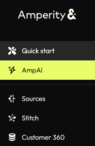
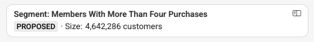
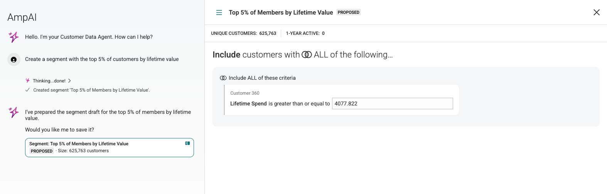
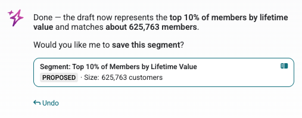
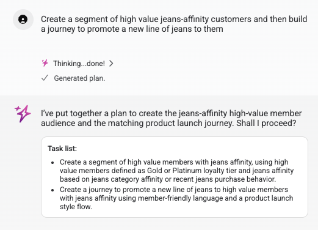

.. https://docs.amperity.com/internal/

.. meta::
    :description lang=en:
        The Customer Data Assistant helps marketers quickly move from intent to action, creating segments and journeys through natural language conversation.

.. meta::
    :content class=swiftype name=body data-type=text:
        The Customer Data Assistant helps marketers quickly move from intent to action, creating segments and journeys through natural language conversation.

.. meta::
    :content class=swiftype name=title data-type=string:
        Customer Data Assistant

==================================================
Customer Data Assistant
==================================================

.. customer-data-agent-overview-start

The **Customer Data Assistant** is a feature within the **AmpAI** suite that helps marketers move quickly from intent to action. Through natural language conversation, users can create segments, build journeys, and explore customer data without navigating manual configuration.

The **Customer Data Assistant** is designed as a starting point: describe what you want to accomplish, and the agent generates a working draft that you can review, refine, and save. Think of it as a collaborative tool that handles the initial setup work, allowing you to focus on strategic refinement.

.. customer-data-agent-overview-end

.. _customer-data-agent-access:

Access Customer Data Assistant
==================================================

.. customer-data-agent-access-start

The **Customer Data Assistant** is available to any user on a tenant with **AmpAI** enabled. Access the agent by clicking the **AmpAI** button in the UI sidebar.

.. customer-data-agent-access-end

.. customer-data-agent-access-note-start

.. note:: If **AmpAI** is not enabled for your tenant, contact your **DataGrid Operator** to request access.

.. customer-data-agent-access-note-end

.. customer-data-agent-access-custom-prompt-tip-start

.. tip:: When you click the **AmpAI** button to access the **Customer Data Assistant**, you will see a dialog box guiding you to customize **AmpAI** by writing a custom prompt. 
   
   Creating a custom prompt tailored to your business needs will help **Customer Data Assistant** and other elements of **AmpAI** provide more effective assistance. 
   
   :ref:`Learn more about creating a custom prompt.<ampai-custom-prompt>`

.. customer-data-agent-access-custom-prompt-tip-end

.. _customer-data-agent-canvas:

The Canvas
==================================================

.. customer-data-agent-canvas-start

When the **Customer Data Assistant** creates drafts of segments or journeys, it displays them in the **Canvas**, a dedicated area within the AmpAI interface that renders interactive components you can evaluate before using.

To access the **Canvas**, click into any draft that has a split-screen icon on the right-hand side. 

The Canvas allows you to:

* View proposed segments with customer counts and filter criteria
* Preview journey structures with their entry segments and channel configurations
* Switch between multiple drafts, using the hamburger icon in the top left of the **Canvas** to select from recent work.
* Access manual editing options to make fine-grained adjustments, using the **Manual edit** button in the top right of the **Canvas**.

.. note:: Selecting **Manual edit** will take you to the relevant area of Amperity. For example, if you have a draft journey and you select **Manual edit**, you will be taken to the **Journeys** editor where you can proceed with edits. 

.. customer-data-agent-canvas-end

.. _customer-data-agent-proposed-state:

Proposed state and drafting
==================================================

.. customer-data-agent-proposed-state-start

The **Customer Data Assistant** operates in a drafting model for segments: when you ask it to create or modify a segment, it generates a proposed version rather than saving directly to your tenant.

This drafting approach provides several benefits:

* **Review before saving** Inspect the draft before saving. Check segment filters, customer count, and structure.
* **Iterative refinement** Ask the agent to modify the proposal and see the updated version before saving. For example: "Actually, change the time frame to the last two months".
* **Compare versions** Click between proposed drafts in the **Customer Data Assistant** chat history to compare different iterations side-by-side.
* **Safe exploration** Experiment with different segment definitions or journey flows without affecting your production data.

Once satisfied with a proposal, explicitly ask the agent to save it. After saving, use the **Manual edit** button in the **Canvas** to open the full segment or journey editor for additional refinement.

.. note:: You cannot build a journey based on a proposed segment. You must save a proposed segment before creating a journey using that segment.

.. important:: While segments use draft proposals and need to be saved, journeys created with the **Customer Data Assistant** are automatically saved to your tenant. You can still use the **Customer Data Assistant** to edit them further, but you do not need to take the step to save them. 

.. customer-data-agent-proposed-state-end

.. _customer-data-agent-undo:

The Undo button
--------------------------------------------------

.. customer-data-agent-undo-start

After editing a segment or journey through conversational prompting, the chat dialog will show an **Undo** button that reverts the last change.

.. note:: The Undo action reverts the last modification to the proposed state, not the last text prompt in the conversation.

.. customer-data-agent-undo-end

.. _customer-data-agent-planning:

Multi-step planning
==================================================

.. customer-data-agent-planning-start

When you ask the **Customer Data Assistant** to perform multiple related actions, it automatically generates a plan, which is a task list to coordinate the work.

For example, if you ask: "Create a segment of high-value members and build a journey to promote a new product to them," the agent will:

#. Display a plan with two tasks: create the segment, then create the journey
#. Execute each task in sequence
#. Track progress through the plan, showing completed and pending items

You can interrupt a plan to ask questions about a draft mid-process without losing the agent's place. For example, after the agent creates a segment but before it builds the journey, you can ask "What's the preferred marketing channel for this segment?" The agent will answer and then continue with the journey creation.

.. customer-data-agent-planning-end

.. customer-data-agent-planning-note-start

.. note:: The agent automatically decides when to build a plan based on the complexity of your request. You do not need to use a special keyword like "plan"---simply describe what you want to accomplish, and the agent will structure the work appropriately.

.. customer-data-agent-planning-note-end

.. _customer-data-agent-dependency-protection:

Downstream dependency protection
==================================================

.. customer-data-agent-dependency-protection-start

When you ask the **Customer Data Assistant** to edit an existing segment that is used in one or more active journeys, the agent triggers a safety confirmation flow.

.. TODO: add **[screenshot for downstream dependency warning dialog box]**

Before saving the modified segment, a dialog appears showing:

* The list of journeys that use this segment
* A warning that changes to the segment will affect these journeys

You must explicitly click **Edit Segment** to proceed with the save. Clicking **Cancel** aborts the save and preserves the current segment definition.

.. customer-data-agent-dependency-protection-end

.. _customer-data-agent-capabilities:

Capabilities
==================================================

.. customer-data-agent-capabilities-start

The **Customer Data Assistant** excels at tasks involving your customer data:

.. list-table::
   :widths: 30 70
   :header-rows: 1

   * - Capability
     - Description
   * - Create segments
     - Describe your target audience in natural language, and the agent builds a segment with the appropriate filters.
   * - Create journeys
     - Ask for a marketing campaign or journey, and the agent generates the journey structure, including entry segments and channel configurations. (Asking for a "campaign" will typically result in a journey.)
   * - Modify existing segments
     - Request changes to existing segments, such as adding filters or adjusting date ranges.
   * - Answer customer data questions
     - Ask questions about your customer base, such as purchase patterns, demographics, or segment overlap.
   * - Build marketing personas
     - Describe a customer archetype, and the agent can construct a persona profile based on your data.

.. customer-data-agent-capabilities-end

.. _customer-data-agent-limitations:

Limitations
==================================================

.. customer-data-agent-limitations-start

The **Customer Data Assistant** is optimized for customer data operations. It cannot currently:

* **Answer configuration questions.** Questions like "What journeys do I currently have?" or "What destinations can I send to?" are not supported. The agent operates on customer data, not tenant configuration metadata.

* **Perform troubleshooting or error recovery.** If you encounter an error message and ask "What should I do?", the agent cannot currently diagnose the issue.

* **Modify destinations, orchestrations, or other non-segment/journey configurations.** The agent's scope is currently limited to segments and journeys.

.. customer-data-agent-limitations-end

.. _customer-data-agent-prompting:

Prompting philosophy
==================================================

.. customer-data-agent-prompting-start

Treat the **Customer Data Assistant** as a tool, not a magic answer machine. Like any tool, it performs best when you provide clear direction and iterate based on results.

**Start with your vision.** Before prompting, have a clear picture of what you want to accomplish. "I want a segment of high-value customers who haven't purchased in 90 days" is more effective than "Find me some customers to target."

**Iterate and refine.** If the first result isn't quite right, coach the agent with specific feedback:

* "The date range should be last year, not this year"
* "Add a filter for customers in the Gold loyalty tier"
* "Remove the first name filter"

**Ask the agent to explore.** When results are unexpected (like a segment returning zero customers), ask the agent to investigate:

* "Can you look into my data to see when there is purchase data around Valentine's Day?"
* "What date range has the most transaction data?"

The agent can query your data to find valid parameters, helping you build effective segments even when you're unsure of the exact values.

**Reframe the question.** If you're not getting the results you expect, try asking the same question in a different way. The framing of your question can significantly affect the response.

.. customer-data-agent-prompting-end

.. _customer-data-agent-iterative-example:

Iterative refinement example
--------------------------------------------------

.. customer-data-agent-iterative-example-start

Consider this scenario:

#. **Initial request:** "Create a segment of customers who made Valentine's Day purchases."

#. **Result:** The agent creates a segment for Valentine's Day 2026, but it only returns 5 customers.

#. **Refinement:** "Actually, can you make it the three weeks leading up to Valentine's Day?"

#. **Result:** The agent updates the segment to the new time frame, returning a larger segment, but still fewer than the desired size of at least 100.

#. **Investigation:** "Can you look into the data for the past few years to see when there are enough purchases around Valentine's Day to create a segment larger than 100 customers?"

#. **Result:** The agent explores the data and finds that Valentine's Day 2024 has substantial purchase data, then proposes a segment that includes Valentine's Day customers from the past three years.

This example illustrates how iterative prompting and asking the agent to explore your data leads to successful outcomes, even when initial assumptions are incorrect.

.. customer-data-agent-iterative-example-end

.. _customer-data-agent-pro-tips:

Pro tips
==================================================

.. customer-data-agent-pro-tips-start

.. tip:: **Build marketing personas.** Some Amperity users have found success using the **Customer Data Assistant** to build marketing personas for their segments. Describe the type of customer you're trying to reach, and the agent can construct a detailed persona profile based on your actual customer data. This helps bridge the gap between abstract marketing concepts and data-driven segment definitions.

.. tip:: **Let the agent find existing segments.** When creating a journey, the agent may identify an existing segment that matches your needs. It will ask: "I found a segment called High Value Customers that looks like it could work. Would you like to use that, or should I create a new one?" This helps avoid duplicate segments and makes good use of work already done.

.. tip:: **Set your custom prompt, and then use your tenant-specific terminology.** The agent understands common marketing and business concepts (like ROAS, loyalty tiers, and churn), but it performs best when you use terminology consistent with rules you've laid out. For example, if you've defined "high-value" in your custom prompt as "lifetime revenue > $1,500", you can use the term "high-value" for consistent results.

.. customer-data-agent-pro-tips-end

.. _customer-data-agent-relationship-to-assistants:

Relationship to AI Assistants
==================================================

.. customer-data-agent-relationship-to-assistants-start

The **Customer Data Assistant** has capabilities that overlap with the existing **AI Assistants** (Segments AI Assistant, Journeys AI Assistant, and SQL AI Assistant). However, they serve complementary purposes:

.. include:: ../../amperity_reference/source/ampai.rst
   :start-after: .. ampai-tools-overview-table-start
   :end-before: .. ampai-tools-overview-table-end

A typical workflow might start with the **Customer Data Assistant** to quickly create a segment and journey, then use the **Manual edit** option to open the specialized editors where the **AI Assistants** can help with detailed refinements.

.. customer-data-agent-relationship-to-assistants-end

