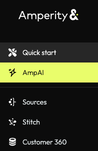
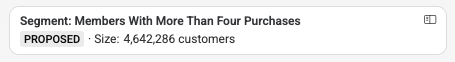
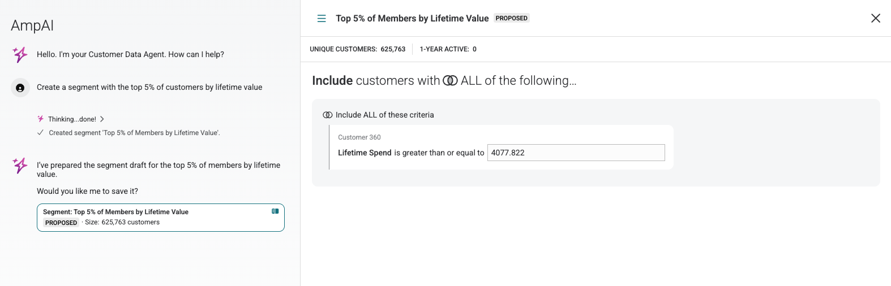
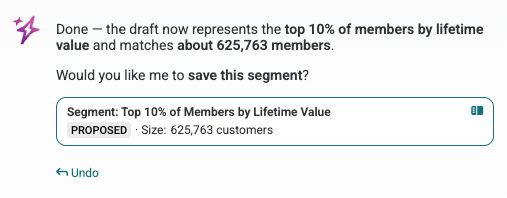
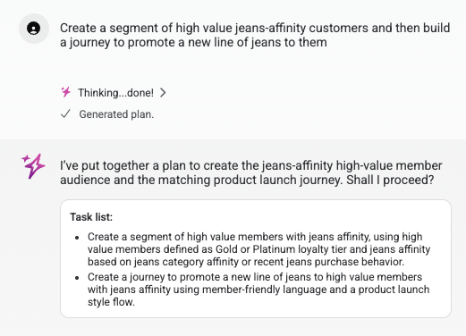

.. https://docs.amperity.com/reference/

.. meta::
    :description lang=en:
        Working with the AI Assistant: access it, work on the canvas, review proposed changes, and get good results from natural language conversation.

.. meta::
    :content class=swiftype name=body data-type=text:
        Working with the AI Assistant: access it, work on the canvas, review proposed changes, and get good results from natural language conversation.

.. meta::
    :content class=swiftype name=title data-type=string:
        Working with the AI Assistant

==================================================
Working with the AI Assistant
==================================================

.. customer-data-agent-overview-start

The **AI Assistant** helps marketers move from intent to action. Through natural language conversation, users can create segments, build journeys, and explore customer data without navigating manual configuration.

The **AI Assistant** is designed as a starting point: describe what you want to accomplish, and it generates a working draft that you can review, refine, and save. Think of it as a collaborative tool that handles the initial setup work, allowing you to focus on strategic refinement.

.. customer-data-agent-overview-end

.. _customer-data-agent-access:

Access the AI Assistant
==================================================

.. customer-data-agent-access-start

Your Amperity hosting region determines which experience is available from the **AI Assistant** button. Tenant settings and user permissions may also affect access.

If the **AI Assistant** is available for your tenant, access it by clicking the **AI Assistant** button in the UI sidebar.

.. customer-data-agent-access-end

.. customer-data-agent-access-note-start

.. note:: If the **AI Assistant** is not enabled for your tenant, contact your **DataGrid Operator** to request access.

.. customer-data-agent-access-note-end

.. customer-data-agent-access-custom-prompt-tip-start

.. tip:: When you click the **AI Assistant** button, you will see a dialog box guiding you to customize the **AI Assistant** by writing a custom prompt. 
   
   Creating a custom prompt tailored to your business needs will help the **AI Assistant** and the tool-specific **AI Assistants** provide more effective assistance. 
   
   :ref:`Learn more about creating a custom prompt.<ampai-custom-prompt>`

.. customer-data-agent-access-custom-prompt-tip-end

.. _customer-data-agent-canvas:

The Canvas
==================================================

.. customer-data-agent-canvas-start

When the **AI Assistant** creates drafts of segments or journeys, it displays them in the **Canvas**, a dedicated area within the **AI Assistant** interface that renders interactive components you can evaluate before using.

To access the **Canvas**, click into any draft that has a split-screen icon on the right-hand side. 

Use the Canvas to:

* View proposed segments with customer counts and filter criteria
* Preview journey structures with their entry segments and channel configurations
* Switch between many drafts, using the hamburger icon in the top left of the **Canvas** to select from recent work.
* Access manual editing options to make fine-grained adjustments, using the **Manual edit** button in the top right of the **Canvas**.

.. note:: Selecting **Manual edit** will take you to the relevant area of Amperity. For example, if you have a draft journey and you select **Manual edit**, you will be taken to the **Journeys** editor where you can proceed with edits. 

.. customer-data-agent-canvas-end

.. _customer-data-agent-proposed-state:

Proposed state and drafting
==================================================

.. customer-data-agent-proposed-state-start

The **AI Assistant** operates in a drafting model for segments: when you ask it to create or modify a segment, it generates a proposed version rather than saving directly to your tenant.

This drafting approach provides several benefits:

* **Review before saving** Inspect the draft before saving. Check segment filters, customer count, and structure.
* **Iterative refinement** Ask the **AI Assistant** to modify the proposal and see the updated version before saving. For example: "Actually, change the time frame to the last two months".
* **Compare versions** Click between proposed drafts in the **AI Assistant** chat history to compare different iterations side-by-side.
* **Safe exploration** Experiment with different segment definitions or journey flows without affecting your production data.

Once satisfied with a proposal, explicitly ask the **AI Assistant** to save it. After saving, use the **Manual edit** button in the **Canvas** to open the full segment or journey editor for additional refinement.

.. note:: You cannot build a journey based on a proposed segment. You must save a proposed segment before creating a journey using that segment.

.. important:: While segments use draft proposals and need to be saved, journeys created with the **AI Assistant** are automatically saved to your tenant. You can still use the **AI Assistant** to edit them further, but you do not need to take the step to save them. 

.. customer-data-agent-proposed-state-end

.. _customer-data-agent-undo:

The Undo button
--------------------------------------------------

.. customer-data-agent-undo-start

After editing a segment or journey through conversational prompting, the chat dialog will show an **Undo** button that reverts the last change.

.. note:: The Undo action reverts the last modification to the proposed state, not the last text prompt in the conversation.

.. customer-data-agent-undo-end

.. _customer-data-agent-planning:

Multi-step planning
==================================================

.. customer-data-agent-planning-start

When you ask the **AI Assistant** to perform many related actions, it automatically generates a plan, which is a task list to coordinate the work.

For example, if you ask: "Create a segment of high-value members and build a journey to promote a new product to them," the **AI Assistant** will:

#. Display a plan with two tasks: create the segment, then create the journey
#. Execute each task in sequence
#. Track progress through the plan, showing completed and pending items

You can interrupt a plan to ask questions about a draft mid-process without losing its place. For example, after the **AI Assistant** creates a segment but before it builds the journey, you can ask "What is the preferred marketing channel for this segment?" It then answers and continues with the journey creation.

.. customer-data-agent-planning-end

.. customer-data-agent-planning-note-start

.. note:: The **AI Assistant** automatically decides when to build a plan based on the complexity of your request. You do not need to use a special keyword like "plan"---simply describe what you want to accomplish, and it structures the work appropriately.

.. customer-data-agent-planning-note-end

.. _customer-data-agent-dependency-protection:

Downstream dependency protection
==================================================

.. customer-data-agent-dependency-protection-start

When you ask the **AI Assistant** to edit an existing segment that is used in one or more active journeys, it triggers a safety confirmation flow.

.. TODO: add **[screenshot for downstream dependency warning dialog box]**

Before saving the modified segment, a dialog appears showing:

* The list of journeys that use this segment
* A warning that changes to the segment will affect these journeys

You must explicitly click **Edit Segment** to proceed with the save. Clicking **Cancel** aborts the save and preserves the current segment definition.

.. customer-data-agent-dependency-protection-end

.. _customer-data-agent-capabilities:

Capabilities
==================================================

.. customer-data-agent-capabilities-start

The **AI Assistant** excels at tasks involving your customer data:

.. list-table::
   :widths: 30 70
   :header-rows: 1

   * - Capability
     - Description
   * - Create segments
     - Describe your target audience in natural language, and the **AI Assistant** builds a segment with the appropriate filters.
   * - Create journeys
     - Ask for a marketing campaign or journey, and the **AI Assistant** generates the journey structure, including entry segments and channel configurations. (Asking for a "campaign" will typically result in a journey.)
   * - Modify existing segments
     - Request changes to existing segments, such as adding filters or adjusting date ranges.
   * - Answer customer data questions
     - Ask questions about your customer base, such as purchase patterns, demographics, or segment overlap.
   * - Build marketing personas
     - Describe a customer archetype, and the **AI Assistant** can construct a persona profile based on your data.

.. customer-data-agent-capabilities-end

.. _customer-data-agent-limitations:

Limitations
==================================================

.. customer-data-agent-limitations-start

The **AI Assistant** is optimized for customer data operations. It cannot:

* **Answer configuration questions.** Questions like "What journeys do I have?" or "What destinations can I send to?" are not supported. The **AI Assistant** operates on customer data, not tenant configuration metadata.

* **Perform troubleshooting or error recovery.** If you encounter an error message and ask "What should I do?", the **AI Assistant** cannot diagnose the issue.

* **Modify destinations, orchestrations, or other non-segment/journey configurations.** Its scope is limited to segments and journeys.

.. customer-data-agent-limitations-end

.. _customer-data-agent-prompting:

.. _customer-data-agent-pro-tips:

.. _ampai-getting-good-results:

Getting good results with the AI Assistant
==================================================

.. customer-data-agent-getting-good-results-start

Treat the **AI Assistant** as a tool, not a magic answer machine. Like any tool, it performs best when you provide clear direction and iterate based on results.

.. customer-data-agent-getting-good-results-end

Write a clear prompt
--------------------------------------------------

.. customer-data-agent-write-a-clear-prompt-start

* **Start with your vision**

  Before prompting, have a clear picture of what you want to accomplish. "I want a segment of high-value customers who have not purchased in 90 days" is more effective than "Find me some customers to target."

* **Understand the question's scope**

  Define the scope of your question to avoid ambiguous results. For example, specify the timeframe, customer segments, or metrics you are analyzing.

* **Avoid overloading with questions**

  Focus on one primary question per prompt to ensure clarity and to avoid confusing results.

  For example, instead of asking how the demographics of omnichannel customers compare to single-channel customers, ask a question first about omnichannel customer demographics, and then ask a second question about single-channel customer demographics.

  This applies to questions, not to actions. A single prompt may ask for several related actions---create a segment, and then build a journey that uses it---and the **AI Assistant** plans and sequences that work for you. See :ref:`multi-step planning <customer-data-agent-planning>`.

* **Use consistent terminology**

  Stick to terminology used in your schema and business logic to align with how the **AI Assistant** understands your data.

* **Describe the customer you want to reach**

  Some Amperity users have found success using the **AI Assistant** to build marketing personas for their segments. Describe the type of customer you are trying to reach, and the **AI Assistant** can construct a detailed persona profile based on your actual customer data. This helps bridge the gap between abstract marketing concepts and data-driven segment definitions.

.. customer-data-agent-write-a-clear-prompt-end

Refine your results
--------------------------------------------------

.. customer-data-agent-refine-your-results-start

* **Iterate and refine**

  If the first result is not correct, coach the **AI Assistant** with specific feedback:

  * "The date range should be last year, not this year"
  * "Add a filter for customers in the Gold loyalty tier"
  * "Remove the first name filter"

* **Reframe the question**

  If you are not getting the results you expect, try asking the same question in a different way. The framing of your question can affect the response.

* **Ask the AI Assistant to explore**

  When results are unexpected (like a segment returning zero customers), ask it to investigate:

  * "Can you look into my data to see when there is purchase data around Valentine's Day?"
  * "What date range has the most transaction data?"

  The **AI Assistant** can query your data to find valid parameters, helping you build effective segments even when you are unsure of the exact values.

* **Let the AI Assistant find existing segments**

  When creating a journey, the **AI Assistant** may identify an existing segment that matches your needs. It will ask: "I found a segment called High Value Customers that looks like it could work. Would you like to use that, or should I create a new one?" This helps avoid duplicate segments and makes good use of work already done.

.. customer-data-agent-refine-your-results-end

.. _customer-data-agent-iterative-example:

Iterative refinement example
--------------------------------------------------

.. customer-data-agent-iterative-example-start

Consider this scenario:

#. **Initial request** "Create a segment of customers who made Valentine's Day purchases."

#. **Result** The **AI Assistant** creates a segment for Valentine's Day 2026, but it only returns 5 customers.

#. **Refinement** "Actually, can you make it the three weeks leading up to Valentine's Day?"

#. **Result** The **AI Assistant** updates the segment to the new time frame, returning a larger segment, but still fewer than the desired size of at least 100.

#. **Investigation** "Can you look into the data for the past few years to see when there are enough purchases around Valentine's Day to create a segment larger than 100 customers?"

#. **Result** The **AI Assistant** explores the data and finds that Valentine's Day 2024 has substantial purchase data, then proposes a segment that includes Valentine's Day customers from the past three years.

This example illustrates how iterative prompting and asking the **AI Assistant** to explore your data leads to successful outcomes, even when initial assumptions are incorrect.

.. customer-data-agent-iterative-example-end

Use your custom prompt
--------------------------------------------------

.. customer-data-agent-use-your-custom-prompt-start

* **Update the custom prompt often**

  The custom prompt is a powerful tool. Update the custom prompt whenever you get a result that does not align with the way your business views the world.

* **Use your tenant-specific terminology**

  Set your custom prompt, and then use your tenant-specific terminology. The **AI Assistant** understands common marketing and business concepts (like ROAS, loyalty tiers, and churn), but it performs best when you use terminology consistent with rules you have laid out. For example, if you have defined "high-value" in your custom prompt as "lifetime revenue > $1,500", you can use the term "high-value" for consistent results.

.. customer-data-agent-use-your-custom-prompt-end

.. _customer-data-agent-relationship-to-assistants:

.. _ampai-tools:

Relationship to tool-specific AI Assistants
==================================================

.. customer-data-agent-relationship-to-assistants-start

The **AI Assistant** has capabilities that overlap with the tool-specific **AI Assistants** (Segments AI Assistant, Journeys AI Assistant, and Queries AI Assistant). However, they serve complementary purposes.

.. customer-data-agent-relationship-to-assistants-end

.. ampai-tools-start

Amperity offers conversational AI at each stage of your workflow. The **AI Assistant** is a conversational starting point: describe what you want to accomplish and it generates segments or journeys from scratch. The tool-specific **AI Assistants** are embedded in individual editors for segments, journeys, and queries, where they help with detailed refinements, while **Amp Insights** helps you understand how you are using Amps.

A typical workflow might start with using the **AI Assistant** to create a segment and journey, and then using the **Manual edit** option to open the specialized editors where the tool-specific **AI Assistants** can help with detailed adjustments.

.. note:: Custom prompts and company context apply to the **AI Assistant** and to all tool-specific **AI Assistants**.

.. ampai-tools-overview-table-start

.. list-table::
   :widths: 30 35 35
   :header-rows: 1

   * - Tool
     - Best for
     - Access point
   * - AI Assistant
     - Starting from intent, creating segments and journeys from scratch, multi-step workflows
     - AI Assistant button in sidebar
   * - Segments AI Assistant
     - Fine-tuning existing segments, making precise adjustments within the segment editor
     - Within the **Segments** page
   * - Journeys AI Assistant
     - Refining journey logic, adjusting channel configurations within the journey editor
     - Within the **Journeys** page
   * - Queries AI Assistant
     - Writing and debugging SQL queries, data exploration
     - Within the **Queries** page
   * - Amp Insights
     - Monitoring Amps consumption
     - Within the **Amps** page

.. ampai-tools-overview-table-end

.. ampai-tools-links-start

Learn more about :doc:`tool-specific AI Assistants <assistant>`.

Availability varies by region and tool. Review :ref:`AI Assistant regional availability <customer-data-agent-regional-availability>` and :ref:`tool-specific AI Assistant regional availability <assistant-regional-availability>`.

.. ampai-tools-links-end

