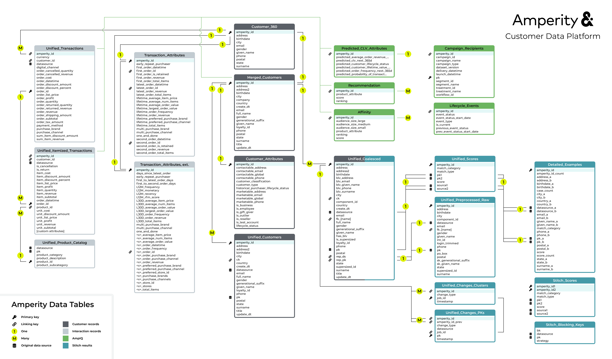
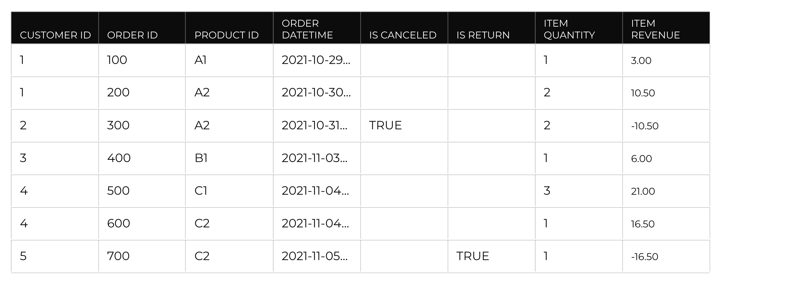

.. https://docs.amperity.com/reference/

.. meta::
    :description lang=en:
        Data tables represent a unified view of your customers, including customer profiles, transactions, and interactions they have had with your brand.

.. meta::
    :content class=swiftype name=body data-type=text:
        Data tables represent a unified view of your customers, including customer profiles, transactions, and interactions they have had with your brand.

.. meta::
    :content class=swiftype name=title data-type=string:
        About data tables

==================================================
About unified data tables
==================================================

.. include:: ../../shared/terms.rst
   :start-after: .. term-customer-360-database-start
   :end-before: .. term-customer-360-database-end

.. _data-tables-data-model:

About the data model
==================================================

.. data-tables-data-model-start

The data model represents the "out-of-the-box" tables that are available to every tenant.

.. data-tables-data-model-end

.. data-tables-data-model-important-start

.. important:: This data model represents the starting point for all tenants. It is common for a tenant to have additional tables that support specific data requirements and workflows.

.. data-tables-data-model-important-start

.. _data-tables-data-model-tables:

Data model diagram
--------------------------------------------------

.. data-tables-data-model-tables-start

The following diagram shows the data model for core tables in Amperity. Color coded sections identify which groups of tables are associated with customer profiles, interactions records, Stitch QA, and predictive modeling.

.. data-tables-data-model-tables-end

.. data-tables-data-model-tables-note-start

.. note:: Click this diagram to open it in your full browser window. Click |ext_amperity_data_tables_png| to open this diagram in a new tab or right-click that link to save a copy to your computer.

.. data-tables-data-model-tables-note-end

.. data-tables-data-model-table-types-start

There are four groups of tables in this diagram:

.. list-table::
   :widths: 100 500
   :header-rows: 1

   * - Group name
     - Description

   * - Customer records

       .. image:: ../../images/data_tables-customer-records.png
          :width: 20 px
          :alt: The color associated with the customer profile table group.
          :align: left
          :class: no-scaled-link
     - .. include:: ../../shared/terms.rst
          :start-after: .. term-customer-profile-start
          :end-before: .. term-customer-profile-end

       The :ref:`data-tables-customer-360` table represents your primary set of customer profiles and is the most common starting point for building segments. Each customer profile is built using a combination of the :ref:`data-tables-merged-customers`, :ref:`data-tables-customer-attributes`, :ref:`data-tables-unified-customers`, and :ref:`data-tables-unified-coalesced` tables.

   * - Interaction records

       .. image:: ../../images/data_tables-interaction-records.png
          :width: 20 px
          :alt: The color associated with the interaction records table group.
          :align: left
          :class: no-scaled-link
     - .. include:: ../../shared/terms.rst
          :start-after: .. term-interaction-record-start
          :end-before: .. term-interaction-record-end

       Interaction records rely on a series of tables: **Transaction Attributes Extended**, **Unified Itemized Transactions**, **Unified Transactions**, and **Unified Product Catalog**.

       Each Amperity ID in the **Customer 360** table can be associated to many rows in the **Unified Transactions** table, and then each Amperity ID in the **Unified Transactions** can be associated to many rows in the **Unified Itemized Transactions** table. Each Amperity ID in the **Customer 360** table is associated to one Amperity ID in the **Transaction Attributes Extended** table.

   * - Stitch results

       .. image:: ../../images/data_tables-stitch-results.png
          :width: 20 px
          :alt: The color associated with the Stitch results table group.
          :align: left
          :class: no-scaled-link
     - .. include:: ../../shared/terms.rst
          :start-after: .. term-stitch-qa-start
          :end-before: .. term-stitch-qa-end

       Stitch QA activities rely on a series of tables: :ref:`data-tables-unified-coalesced`, :ref:`data-tables-unified-scores`, :ref:`data-tables-detailed-examples`, :ref:`data-tables-unified-preprocessed-raw`, :ref:`data-tables-unified-changes-clusters`, and :ref:`data-tables-unified-changes-pks`. These tables are the basis for the |stitch_qa| process; the use of any specific table will vary from tenant to tenant. Together they provide visibility into how Amperity grouped (or did not group) individual customer records to a single Amperity ID.

   * - Predictive models

       .. image:: ../../images/data_tables-ampiq.png
          :width: 20 px
          :alt: The color associated with the predictive modeling table group.
          :align: left
          :class: no-scaled-link
     - Predictive modeling tables are the results of the configuration and tuning of Amperity for predictive analytics. These tables rely on the **Merged Customers**, **Unified Itemized Transactions**, and **Unified Transactions** tables for predictions, but there is not a 1-to-1 or 1-to-many relationship between those three tables and predictive modeling tables. The :ref:`data-tables-predicted-clv-attributes` table contains one row per Amperity ID, whereas the :ref:`data-tables-affinity` table contains many rows per Amperity ID.

       The :ref:`data-tables-campaign-recipients` table contains a history of all campaigns that have been sent from Amperity. This table is updated on a recurring basis and may be used like any other table in your customer 360 database.

.. data-tables-data-model-table-types-end

.. _data-tables-data-model-indicators:

Data model indicators
--------------------------------------------------

.. data-tables-data-model-indicators-start

This diagram uses the following indicators to highlight relationships between tables and to call out fields that are primary keys, establish links between tables, or associate this table back to a domain table in the **Sources** page:

.. list-table::
   :widths: 100 500
   :header-rows: 1

   * - Name
     - Description

   * - 1:1, 1:many

       .. image:: ../../images/data_tables-one.png
          :width: 26 px
          :alt: An indicator that this column has a 1:1 or 1:many relationship with another table.
          :align: left
          :class: no-scaled-link
     - Indicates that this table has a 1:1 or 1:many relationship with another table. For most tables, this relationship is based on the Amperity ID.

   * - Many:1

       .. image:: ../../images/data_tables-many.png
          :width: 26 px
          :alt: An indicator that this column has a many:1 relationship with another table.
          :align: left
          :class: no-scaled-link
     - Indicates that this table has a many:1 relationship with another table. For most tables, this relationship is based on the Amperity ID.

   * - Primary key

       .. image:: ../../images/data_tables-primary.png
          :width: 20 px
          :alt: An indicator that this column is a primary key.
          :align: left
          :class: no-scaled-link
     - Indicates this column is the primary key for this table.

   * - Linking key

       .. image:: ../../images/data_tables-linking.png
          :width: 20 px
          :alt: An indicator that this column is a linking key.
          :align: center
     - Indicates this column links customer records, such as those associated with a customer key or a foreign key that were defined as part of a feed or custom domain table from the **Sources** page.

   * - Data source

       .. image:: ../../images/data_tables-source.png
          :width: 16 px
          :alt: An indicator that this column is associated to the original data source.
          :align: left
          :class: no-scaled-link
     - Indicates this column is associated to an original customer data source in the **Sources** page, with the value of this field being the name of that data source.

.. data-tables-data-model-indicators-end

.. _data-tables-all-opted-in-emails:

All Opted In Emails
==================================================

.. include:: ../../shared/terms.rst
   :start-after: .. term-all-opted-in-emails-table-start
   :end-before: .. term-all-opted-in-emails-table-end

.. include:: ../../amperity_datagrid/source/table_all_opted_in_emails.rst
   :start-after: .. table-all-opted-in-emails-use-in-segments-warning-start
   :end-before: .. table-all-opted-in-emails-use-in-segments-warning-end

.. data-tables-all-opted-in-emails-context-start

The **All Opted In Emails** table contains the same columns as the **Email Opt Status** table. Unlike the **Email Opt Status** table, the **All Opted In Emails** table should be made available to the **Segment Editor**. This ensures that the **email** attribute in this table is available to campaigns. (Choose the **email** attribute from the **All Opted In Emails** table from the **Edit Attributes** menu.)

.. data-tables-all-opted-in-emails-context-end

.. _data-tables-campaign-recipients:

Campaign Recipients
==================================================

.. include:: ../../shared/terms.rst
   :start-after: .. term-campaign-recipients-table-start
   :end-before: .. term-campaign-recipients-table-end

.. data-tables-campaign-recipients-about-start

The **Campaign Recipients** table is generated by Amperity, and then made available as a standard database table. Use this table to access campaign attributes, perform historical campaign analysis, and to build segments and multi-stage campaigns that use the results of previous campaigns.

.. important:: Data in the **Campaign Recipients** table is updated after the next database run. If your database is configured to run once per day then data in the **Campaign Recipients** table will be available on a 1-day delayed rolling basis.

.. data-tables-campaign-recipients-about-end

.. data-tables-campaign-recipients-link-to-table-start

.. note:: See |table_campaign_recipients| for more information about how this table is built and maintained within Amperity.

.. data-tables-campaign-recipients-link-to-table-end

.. data-tables-campaign-recipients-table-about-start

The **Campaign Recipients** table contains the following columns:

.. data-tables-campaign-recipients-table-about-end

.. data-tables-campaign-recipients-table-start

.. list-table::
   :widths: 200 100 300
   :header-rows: 1

   * - Column name
     - Data type
     - Description

   * - **Amperity ID**
     - String
     - .. include:: ../../shared/terms.rst
          :start-after: .. term-amperity-id-column-start
          :end-before: .. term-amperity-id-column-end

       .. include:: ../../shared/terms.rst
          :start-after: .. term-amperity-id-format-start
          :end-before: .. term-amperity-id-format-end

   * - **Campaign ID**
     - String
     - The unique ID for a campaign.

   * - **Campaign Name**
     - String
     - The name of the campaign.

   * - **Campaign Type**
     - String
     - .. include:: ../../shared/terms.rst
          :start-after: .. term-campaign-start
          :end-before: .. term-campaign-end

       .. include:: ../../shared/terms.rst
          :start-after: .. term-campaign-type-start
          :end-before: .. term-campaign-type-end

       .. include:: ../../shared/terms.rst
          :start-after: .. term-one-time-campaign-start
          :end-before: .. term-one-time-campaign-end

       .. include:: ../../shared/terms.rst
          :start-after: .. term-recurring-campaign-start
          :end-before: .. term-recurring-campaign-end

   * - **Database ID**
     - String
     - The unique ID for the database.

   * - **Database Name**
     - String
     - The name of the database.

   * - **Dataset Version**
     - String
     - A unique ID for the dataset used with this set of campaign recipients.

   * - **Delivery Datetime**
     - Datetime
     - The date and time at which the associated campaign ID was delivered to the destination.

   * - **Destination ID**
     - String
     - The unique ID for a destination.

   * - **Destination Name**
     - String
     - The name of the destination to which the associated campaign ID was sent.

   * - **Is Control**
     - Boolean
     - A flag that indicates if the **Treatment ID** represents a control group.

   * - **Launch Datetime**
     - Datetime
     - The date and time at which the associated campaign ID was sent from Amperity to its downstream workflow.

   * - **PK**
     - String
     - .. include:: ../../shared/terms.rst
          :start-after: .. term-pk-start
          :end-before: .. term-pk-end

   * - **Segment ID**
     - String
     - The unique ID for the segment that generated the list of recipients for the associated campaign ID.

   * - **Segment Name**
     - String
     - The name of the segment used with the associated campaign ID.

   * - **Sub Audience ID**
     - String
     - The unique ID for the sub-audience to which the associated campaign was sent.

   * - **Sub Audience Name**
     - String
     - The name of the sub-audience to which the associated campaign was sent.

   * - **Target ID**
     - String
     - The unique ID for the data template that was used to send campaign data to a downstream channel or workflow.

   * - **Target Name**
     - String
     - The name of the data template that was used to send campaign data to a downstream channel or workflow.

   * - **Treatment ID**
     - String
     - .. include:: ../../shared/terms.rst
          :start-after: .. term-treatment-id-start
          :end-before: .. term-treatment-id-end

   * - **Treatment Name**
     - String
     - .. include:: ../../shared/terms.rst
          :start-after: .. term-treatment-name-start
          :end-before: .. term-treatment-name-end

   * - **Workflow ID**
     - String
     - The unique ID for the workflow that managed the associated campaign.

.. data-tables-campaign-recipients-table-end

.. _data-tables-customer-360:

Customer 360
==================================================

.. include:: ../../shared/terms.rst
   :start-after: .. term-customer360-table-start
   :end-before: .. term-customer360-table-end

.. data-tables-customer-360-link-to-table-start

.. note:: See |table_customer_360| for more information about how this table is built and maintained within the customer 360 database.

.. data-tables-customer-360-link-to-table-end

.. data-tables-customer-360-note-start

.. note:: The columns that appear in the **Customer 360** table will vary, depending on the SQL statement used to add columns to the table. The set of columns must include the Amperity ID and should include columns that contain profile (PII) data, along with columns that contain summary attributes for interaction records.

.. data-tables-customer-360-note-end

.. data-tables-customer-360-table-about-start

The following table represents a **Customer 360** table with profile data and a few summary attributes based on interaction records for transaction data:

.. data-tables-customer-360-table-about-end

.. data-tables-customer-360-table-start

.. list-table::
   :widths: 200 75 50 275
   :header-rows: 1

   * - Column Name
     - Data type
     - PII
     - Description
   * - **Amperity ID**
     - String
     - 
     - .. include:: ../../shared/terms.rst
          :start-after: .. term-amperity-id-column-start
          :end-before: .. term-amperity-id-column-end

       .. include:: ../../shared/terms.rst
          :start-after: .. term-amperity-id-format-start
          :end-before: .. term-amperity-id-format-end

   * - **Given Name**
     - String
     - |fa-checkbox|
     - .. include:: ../../shared/terms.rst
          :start-after: .. term-given-name-start
          :end-before: .. term-given-name-end

       Also in: **Merged Customers**, **Unified Coalesced**, **Unified Customer**, **Unified Preprocessed Raw**

   * - **Surname**
     - String
     - |fa-checkbox|
     - .. include:: ../../shared/terms.rst
          :start-after: .. term-surname-start
          :end-before: .. term-surname-end

       Also in: **Merged Customers**, **Unified Coalesced**, **Unified Customer**, **Unified Preprocessed Raw**

   * - **Email**
     - String
     - |fa-checkbox|
     - .. include:: ../../shared/terms.rst
          :start-after: .. term-email-start
          :end-before: .. term-email-end

       Also in: **Merged Customers**, **Unified Coalesced**, **Unified Customer**, **Unified Preprocessed Raw**

   * - **Phone**
     - String
     - |fa-checkbox|
     - .. include:: ../../shared/terms.rst
          :start-after: .. term-phone-start
          :end-before: .. term-phone-end

       Also in: **Merged Customers**, **Unified Coalesced**, **Unified Customer**, **Unified Preprocessed Raw**

   * - **Address**
     - String
     - |fa-checkbox|
     - .. include:: ../../shared/terms.rst
          :start-after: .. term-address-start
          :end-before: .. term-address-end

       Also in: **Merged Customers**, **Unified Coalesced**, **Unified Customer**, **Unified Preprocessed Raw**

   * - **City**
     - String
     - |fa-checkbox|
     - .. include:: ../../shared/terms.rst
          :start-after: .. term-city-start
          :end-before: .. term-city-end

       Also in: **Merged Customers**, **Unified Coalesced**, **Unified Customer**, **Unified Preprocessed Raw**

   * - **State**
     - String
     - |fa-checkbox|
     - .. include:: ../../shared/terms.rst
          :start-after: .. term-state-start
          :end-before: .. term-state-end

       Also in: **Merged Customers**, **Unified Coalesced**, **Unified Customer**, **Unified Preprocessed Raw**

   * - **Postal**
     - String
     - |fa-checkbox|
     - .. include:: ../../shared/terms.rst
          :start-after: .. term-postal-start
          :end-before: .. term-postal-end

       Also in: **Merged Customers**, **Unified Coalesced**, **Unified Customer**, **Unified Preprocessed Raw**

   * - **Birthdate**
     - Date
     - |fa-checkbox|
     - .. include:: ../../shared/terms.rst
          :start-after: .. term-birthdate-start
          :end-before: .. term-birthdate-end

       Also in: **Merged Customers**, **Unified Coalesced**, **Unified Customer**, **Unified Preprocessed Raw**

   * - **Gender**
     - String
     - |fa-checkbox|
     - .. include:: ../../shared/terms.rst
          :start-after: .. term-gender-start
          :end-before: .. term-gender-end

       Also in: **Merged Customers**, **Unified Coalesced**, **Unified Customer**, **Unified Preprocessed Raw**

.. data-tables-customer-360-table-end

.. _data-tables-customer-attributes:

Customer Attributes
==================================================

.. include:: ../../shared/terms.rst
   :start-after: .. term-customer-attributes-table-start
   :end-before: .. term-customer-attributes-table-end

.. data-tables-customer-attributes-table-about-start

The **Customer Attributes** table contains the following columns:

.. data-tables-customer-attributes-table-about-end

.. data-tables-customer-attributes-table-start

.. list-table::
   :widths: 200 100 300
   :header-rows: 1

   * - Column name
     - Data type
     - Description

   * - **Amperity ID**
     - String
     - .. include:: ../../shared/terms.rst
          :start-after: .. term-amperity-id-column-start
          :end-before: .. term-amperity-id-column-end

       .. include:: ../../shared/terms.rst
          :start-after: .. term-amperity-id-format-start
          :end-before: .. term-amperity-id-format-end

   * - **Churn Trigger**
     - String
     - The churn status for a customer. Possible values:

       * Active
       * Cooling down
       * At risk
       * Highly at risk
       * Lost
       * Blank

       .. tip:: Use these values as part of your churn prevention campaigns.

   * - **Churn Trigger Start Datetime**
     - Datetime
     - The date and time at which the **Churn Trigger** status begins.

   * - **Contactable Address**
     - Boolean
     - A flag that indicates if a customer can be contacted by a physical mailing address.

   * - **Contactable Email**
     - Boolean
     - A flag that indicates if a customer has an email address with a valid format.

   * - **Contactable Global**
     - Boolean
     - A flag that indicates if a customer can be contacted by phone number, email address, or physical mailing address.

   * - **Contactable Paid Social**
     - Boolean
     - A flag that indicates if a customer has personally identifiable information (PII) that could be used to contact them using paid social media channels.

   * - **Contactable Phone**
     - Boolean
     - A flag that indicates if a customer has a phone number with a valid format.

   * - **Historical Purchaser Lifecycle Status**
     - String
     - The status for a customer, based on their history and recency of interactions a brand. Possible values: "new", "active", "lapsed", "dormant", and "prospect".

       .. include:: ../../shared/terms.rst
          :start-after: .. term-customer-lifecycle-status-configure-start
          :end-before: .. term-customer-lifecycle-status-configure-end

       .. note:: The ranges for this field are customizable. The default ranges represent:

          * "New" represents customers who have purchased within the previous 30 days.
          * "Active" represents customers who have purchased within the previous 365 days.
          * "Lapsed" represents customers who have purchased between 365 and 730 days ago.
          * "Dormant" represents customers who have not purchased within the previous 730 days (two years).
          * "Prospect" represents individuals who have not made a purchase.

   * - **Is Business**
     - Boolean
     - A flag that indicates if a customer is a known or likely business.

   * - **Is Employee**
     - Boolean
     - A flag that indicates if a customer is or has been an employee of the brand at any time.

   * - **Is Gift Giver**
     - Boolean
     - A flag that indicates if a customer has purchased items as gifts.

   * - **Is No PII Amperity ID**
     - Boolean
     - A flag that indicates if the customer does not have personally identifiable information (PII) for name (given name, surname, full name), address (street address, city, state, postal code), email address, or phone number.

   * - **Is Opted Into Email**
     - Boolean
     - A flag that indicates if the customer has given consent to receive email communications from your brand.

   * - **Is Opted Into SMS**
     - Boolean
     - A flag that indicates if the customer has given consent to receive SMS messages from your brand.

   * - **Is Outlier**
     - Boolean
     - A flag that indicates if the customer has abnormally high purchase behaviors in comparison to other purchasers.

   * - **Is Primary Buyer Household**
     - Boolean
     - A flag that indicates if a customer is the individual within a household who represents the highest lifetime revenue for that household.

       .. note:: This attribute requires the **Merged Households** table.

   * - **Is Prospect**
     - Boolean
     - A flag that indicates if a customer does not have a purchase history with a brand.

   * - **Is Purchaser**
     - Boolean
     - A flag that indicates if the customer has a purchase history with a brand.

   * - **Is Reseller**
     - Boolean
     - A flag that indicates if the customer is a known or likely reseller of a product.

       .. tip:: A reseller should be defined as an early repeat purchaser with a high lifetime order frequency. Use the following fields from the **Transaction Attributes Extended** table to define a reseller: 

          * **Early Repeat Purchaser** (set to ``true``)
          * **Lifetime Order Frequency** (define an order frequency threshold, such as "greater than 50")

   * - **Is Test Account**
     - Boolean
     - A flag that indicates if the customer is a known test account for a brand.

.. data-tables-customer-attributes-table-end

.. _data-tables-detailed-examples:

Detailed Examples
==================================================

.. include:: ../../shared/terms.rst
   :start-after: .. term-detailed-examples-table-start
   :end-before: .. term-detailed-examples-table-end

.. data-tables-detailed-examples-table-note-start

.. note:: The **Detailed Examples** table is a subset of the :ref:`Unified Scores <data-tables-unified-scores>` table.

.. data-tables-detailed-examples-table-note-end

.. data-tables-detailed-examples-table-about-start

The **Detailed Examples** table contains the following columns, as its starting point. This table is typically updated to add more pairs, enable use for blocklisted values, and to support additional tenant-specific use cases.

.. data-tables-detailed-examples-table-about-end

.. data-tables-detailed-examples-table-start

.. list-table::
   :widths: 30 15 55
   :header-rows: 1

   * - Column name
     - Data type
     - Description

   * - **Amperity ID**
     - String
     - .. include:: ../../shared/terms.rst
          :start-after: .. term-amperity-id-column-start
          :end-before: .. term-amperity-id-column-end

       .. include:: ../../shared/terms.rst
          :start-after: .. term-amperity-id-format-start
          :end-before: .. term-amperity-id-format-end

   * - **Address A**

       **Address B**
     - String
     - .. include:: ../../shared/terms.rst
          :start-after: .. term-address-start
          :end-before: .. term-address-end

   * - **Birthdate A**

       **Birthdate B**
     - String
     - .. include:: ../../shared/terms.rst
          :start-after: .. term-birthdate-start
          :end-before: .. term-birthdate-end

   * - **Case Count**
     - String
     - 

   * - **City A**

       **City B**
     - String
     - .. include:: ../../shared/terms.rst
          :start-after: .. term-city-start
          :end-before: .. term-city-end

   * - **Country A**

       **Country B**
     - String
     - .. include:: ../../shared/terms.rst
          :start-after: .. term-country-start
          :end-before: .. term-country-end

   * - **Datasource A**

       **Datasource B**
     - String
     - .. include:: ../../shared/terms.rst
          :start-after: .. term-datasource-start
          :end-before: .. term-datasource-end

       .. tip:: The combination of **PK** and **Datasource** uniquely identifies a row in the **Unified Coalesced** table, which correlates to a single row in a domain table.

   * - **Email A**

       **Email B**
     - String
     - .. include:: ../../shared/terms.rst
          :start-after: .. term-email-start
          :end-before: .. term-email-end

   * - **Given Name A**

       **Given Name B**
     - String
     - .. include:: ../../shared/terms.rst
          :start-after: .. term-given-name-start
          :end-before: .. term-given-name-end

   * - **Match Category**
     - String
     - .. include:: ../../shared/terms.rst
          :start-after: .. term-match-category-start
          :end-before: .. term-match-category-end

       Also in: **Unified Scores**

   * - **Phone A**

       **Phone B**
     - String
     - .. include:: ../../shared/terms.rst
          :start-after: .. term-phone-start
          :end-before: .. term-phone-end

   * - **PK A**

       **PK B**
     - String
     - .. include:: ../../shared/terms.rst
          :start-after: .. term-pk-start
          :end-before: .. term-pk-end

       .. tip:: The combination of **PK** and **Datasource** uniquely identifies a row in the **Unified Coalesced** table, which correlates to a single row in a domain table.

   * - **Postal A**

       **Postal B**
     - String
     - .. include:: ../../shared/terms.rst
          :start-after: .. term-postal-start
          :end-before: .. term-postal-end

   * - **Score**
     - Float
     - .. include:: ../../shared/terms.rst
          :start-after: .. term-score-start
          :end-before: .. term-score-end

       .. include:: ../../shared/terms.rst
          :start-after: .. term-record-pair-score-start
          :end-before: .. term-record-pair-score-end

       .. include:: ../../shared/terms.rst
          :start-after: .. term-record-pair-strength-start
          :end-before: .. term-record-pair-strength-end

       .. note:: Scores are shown for records that end up in the same cluster, including any scores that are below threshold. Scores are not shown for records that do not end up in the same cluster.

       Also in: **Unified Scores**

   * - **Score Count**
     - String
     - 

   * - **State A**

       **State B**
     - String
     - .. include:: ../../shared/terms.rst
          :start-after: .. term-state-start
          :end-before: .. term-state-end

   * - **Surname A**

       **Surname B**
     - String
     - .. include:: ../../shared/terms.rst
          :start-after: .. term-surname-start
          :end-before: .. term-surname-end

.. data-tables-detailed-examples-table-end

.. _data-tables-email-engagement-attributes:

Email Engagement Attributes
==================================================

.. include:: ../../shared/terms.rst
   :start-after: .. term-email-engagement-attributes-table-start
   :end-before: .. term-email-engagement-attributes-table-end

.. note:: The **Email Engagement Attributes** table can be selected as a source in the **Segment Editor** to segment customers based on their email behavior.

.. data-tables-email-engagement-attributes-table-about-start

The **Email Engagement Attributes** table contains the following columns:

.. data-tables-email-engagement-attributes-table-about-end

.. data-tables-email-engagement-attributes-table-start

.. list-table::
   :widths: 30 15 55
   :header-rows: 1

   * - Column name
     - Data type
     - Description

   * - **Amperity ID**
     - String
     - |input-to-predictive-models| **This column is input to predictive modeling.**

       .. include:: ../../shared/terms.rst
          :start-after: .. term-amperity-id-column-start
          :end-before: .. term-amperity-id-column-end

       .. include:: ../../shared/terms.rst
          :start-after: .. term-amperity-id-format-start
          :end-before: .. term-amperity-id-format-end

   * - **Brand**
     - String
     - .. include:: ../../shared/email-events.rst
          :start-after: .. email-events-brand-start
          :end-before: .. email-events-brand-end
   * - **Email**
     - String
     - .. include:: ../../shared/email-events.rst
          :start-after: .. email-events-email-start
          :end-before: .. email-events-email-end
   * - **Email Clicks Last X Day**
     - Integer
     - .. include:: ../../shared/email-events.rst
          :start-after: .. email-events-clicks-x-days-start
          :end-before: .. email-events-clicks-x-days-end
   * - **Email Clicks Last X Months**
     - Integer
     - .. include:: ../../shared/email-events.rst
          :start-after: .. email-events-clicks-x-months-start
          :end-before: .. email-events-clicks-x-months-end
   * - **Email Opens Last X Day**
     - Integer
     - .. include:: ../../shared/email-events.rst
          :start-after: .. email-events-opens-x-days-start
          :end-before: .. email-events-opens-x-days-end
   * - **Email Opens Last X Months**
     - Integer
     - .. include:: ../../shared/email-events.rst
          :start-after: .. email-events-opens-x-months-start
          :end-before: .. email-events-opens-x-months-end
   * - **Engagement Frequency Last 15 Months**
     - Varchar
     - .. include:: ../../shared/email-events.rst
          :start-after: .. email-events-engagement-frequency-15-months-start
          :end-before: .. email-events-engagement-frequency-15-months-end
   * - **Engagement Status Last 15 Months**
     - Varchar
     - .. include:: ../../shared/email-events.rst
          :start-after: .. email-events-engagement-status-15-months-start
          :end-before: .. email-events-engagement-status-15-months-end
   * - **First Email Click Datetime**
     - Datetime
     - .. include:: ../../shared/email-events.rst
          :start-after: .. email-events-first-click-start
          :end-before: .. email-events-first-click-end
   * - **First Email Open Datetime**
     - Datetime
     - .. include:: ../../shared/email-events.rst
          :start-after: .. email-events-first-open-start
          :end-before: .. email-events-first-open-end
   * - **First Email Send Datetime**
     - Datetime
     - .. include:: ../../shared/email-events.rst
          :start-after: .. email-events-first-send-start
          :end-before: .. email-events-first-send-end
   * - **Most Recent Email Bounce Datetime**
     - Datetime
     - .. include:: ../../shared/email-events.rst
          :start-after: .. email-events-most-recent-bounce-start
          :end-before: .. email-events-most-recent-bounce-end
   * - **Most Recent Email Click Datetime**
     - Datetime
     - .. include:: ../../shared/email-events.rst
          :start-after: .. email-events-most-recent-click-start
          :end-before: .. email-events-most-recent-click-end
   * - **Most Recent Email Open Datetime**
     - Datetime
     - .. include:: ../../shared/email-events.rst
          :start-after: .. email-events-most-recent-open-start
          :end-before: .. email-events-most-recent-open-end
   * - **Most Recent Email Optin Datetime**
     - Datetime
     - .. include:: ../../shared/email-events.rst
          :start-after: .. email-events-most-recent-optin-start
          :end-before: .. email-events-most-recent-optin-end
   * - **Most Recent Email Optout Datetime**
     - Datetime
     - .. include:: ../../shared/email-events.rst
          :start-after: .. email-events-most-recent-optout-start
          :end-before: .. email-events-most-recent-optout-end
   * - **Most Recent Email Send Datetime**
     - Datetime
     - .. include:: ../../shared/email-events.rst
          :start-after: .. email-events-most-recent-send-start
          :end-before: .. email-events-most-recent-send-end
   * - **Purchase Before Signup**
     - Boolean
     - .. include:: ../../shared/email-events.rst
          :start-after: .. email-events-purchase-before-signup-start
          :end-before: .. email-events-purchase-before-signup-end
   * - **Signup To Purchase Days**
     - Integer
     - .. include:: ../../shared/email-events.rst
          :start-after: .. email-events-signup-to-purchase-days-start
          :end-before: .. email-events-signup-to-purchase-days-end

.. data-tables-email-engagement-attributes-table-end

.. _data-tables-email-engagement-summary:

Email Engagement Summary
==================================================

.. include:: ../../shared/terms.rst
   :start-after: .. term-email-engagement-summary-table-start
   :end-before: .. term-email-engagement-summary-table-end

.. note:: The **Email Engagement Summary** table can be used for analysis and to inform the selection of the best email in the **Email Amperity ID Assignment** table. 

.. data-tables-email-engagement-summary-table-about-start

The **Email Engagement Summary** table contains the following columns:

.. data-tables-email-engagement-summary-table-about-end

.. data-tables-email-engagement-summary-table-start

.. list-table::
   :widths: 30 15 55
   :header-rows: 1

   * - Column name
     - Data type
     - Description

   * - **Brand**
     - String
     - .. include:: ../../shared/email-events.rst
          :start-after: .. email-events-brand-start
          :end-before: .. email-events-brand-end
   * - **Email**
     - String
     - .. include:: ../../shared/email-events.rst
          :start-after: .. email-events-email-start
          :end-before: .. email-events-email-end
   * - **Email Clicks Last X Day**
     - Integer
     - .. include:: ../../shared/email-events.rst
          :start-after: .. email-events-clicks-x-days-start
          :end-before: .. email-events-clicks-x-days-end
   * - **Email Clicks Last X Months**
     - Integer
     - .. include:: ../../shared/email-events.rst
          :start-after: .. email-events-clicks-x-months-start
          :end-before: .. email-events-clicks-x-months-end
   * - **Email Opens Last X Day**
     - Integer
     - .. include:: ../../shared/email-events.rst
          :start-after: .. email-events-opens-x-days-start
          :end-before: .. email-events-opens-x-days-end
   * - **Email Opens Last X Months**
     - Integer
     - .. include:: ../../shared/email-events.rst
          :start-after: .. email-events-opens-x-months-start
          :end-before: .. email-events-opens-x-months-end
   * - **Engagement Frequency Last 15 Months**
     - Varchar
     - .. include:: ../../shared/email-events.rst
          :start-after: .. email-events-engagement-frequency-15-months-start
          :end-before: .. email-events-engagement-frequency-15-months-end
   * - **Engagement Status Last 15 Months**
     - Varchar
     - .. include:: ../../shared/email-events.rst
          :start-after: .. email-events-engagement-status-15-months-start
          :end-before: .. email-events-engagement-status-15-months-end
   * - **First Email Click Datetime**
     - Datetime
     - .. include:: ../../shared/email-events.rst
          :start-after: .. email-events-first-click-start
          :end-before: .. email-events-first-click-end
   * - **First Email Open Datetime**
     - Datetime
     - .. include:: ../../shared/email-events.rst
          :start-after: .. email-events-first-open-start
          :end-before: .. email-events-first-open-end
   * - **First Email Send Datetime**
     - Datetime
     - .. include:: ../../shared/email-events.rst
          :start-after: .. email-events-first-send-start
          :end-before: .. email-events-first-send-end
   * - **Most Recent Email Bounce Datetime**
     - Datetime
     - .. include:: ../../shared/email-events.rst
          :start-after: .. email-events-most-recent-bounce-start
          :end-before: .. email-events-most-recent-bounce-end
   * - **Most Recent Email Click Datetime**
     - Datetime
     - .. include:: ../../shared/email-events.rst
          :start-after: .. email-events-most-recent-click-start
          :end-before: .. email-events-most-recent-click-end
   * - **Most Recent Email Open Datetime**
     - Datetime
     - .. include:: ../../shared/email-events.rst
          :start-after: .. email-events-most-recent-open-start
          :end-before: .. email-events-most-recent-open-end
   * - **Most Recent Email Optin Datetime**
     - Datetime
     - .. include:: ../../shared/email-events.rst
          :start-after: .. email-events-most-recent-optin-start
          :end-before: .. email-events-most-recent-optin-end
   * - **Most Recent Email Optout Datetime**
     - Datetime
     - .. include:: ../../shared/email-events.rst
          :start-after: .. email-events-most-recent-optout-start
          :end-before: .. email-events-most-recent-optout-end
   * - **Most Recent Email Send Datetime**
     - Datetime
     - .. include:: ../../shared/email-events.rst
          :start-after: .. email-events-most-recent-send-start
          :end-before: .. email-events-most-recent-send-end
   * - **Purchase Before Signup**
     - Boolean
     - .. include:: ../../shared/email-events.rst
          :start-after: .. email-events-purchase-before-signup-start
          :end-before: .. email-events-purchase-before-signup-end
   * - **Signup To Purchase Days**
     - Integer
     - .. include:: ../../shared/email-events.rst
          :start-after: .. email-events-signup-to-purchase-days-start
          :end-before: .. email-events-signup-to-purchase-days-end

.. data-tables-email-engagement-summary-table-end

.. _data-tables-euid:

EUID
==================================================

.. include:: ../../amperity_reference/source/euid.rst
   :start-after: .. euid-overview-start
   :end-before: .. euid-overview-end

.. data-tables-euid-start

The **EUID** table contains the results of EUID token generation when enabled for your tenant.

.. data-tables-euid-end

.. data-tables-euid-table-about-start

The **EUID** table contains the following columns:

.. data-tables-euid-table-about-end

.. data-tables-euid-table-start

.. list-table::
   :widths: 200 100 300
   :header-rows: 1

   * - Column name
     - Data type
     - Description

   * - **Bucket ID**
     - String
     - A unique identifier for the salt bucket that is used to ensure that expired EUID tokens are refreshed. This value is returned in the response from the **POST /identity/map** endpoint.

       .. note:: Each EUID token is associated with a salt bucket that links that token to a specific point in time. Salt buckets expire; approximately 1/365th of all salt buckets are rotated daily. Amperity `monitors salt buckets <https://euid.eu/docs/guides/integration-advertiser-dataprovider-endpoints#5-monitor-for-salt-bucket-rotations-for-your-stored-raw-euids>`__ on a daily basis to determine which EUID tokens need to be refreshed.

   * - **Email**
     - String
     - The email address for the customer. Amperity gets this value from the **email** field in the **Unified Coalesced** table.

   * - **Normalized Email**
     - String
     - The normalized email address that was sent from Amperity to the **POST /identity/map** endpoint for mapping. This value is returned in the response from the **POST /identity/map** endpoint.

   * - **EUID**
     - String
     - The raw EUID value for the customer. This value, when encrypted, may be used as a EUID token. This value is returned in the response from the **POST /identity/map** endpoint.

.. data-tables-euid-table-end

.. _data-tables-fiscal-calendar:

Fiscal Calendar
==================================================

.. include:: ../../shared/terms.rst
   :start-after: .. term-fiscal-calendar-start
   :end-before: .. term-fiscal-calendar-end

.. include:: ../../shared/terms.rst
   :start-after: .. term-454-calendar-start
   :end-before: .. term-454-calendar-end

.. data-tables-fiscal-calendar-about-start

The **Fiscal Calendar** table is generated by Amperity when fiscal calendar semantic tags are applied to source data tables.

.. data-tables-fiscal-calendar-about-end

.. data-tables-fiscal-calendar-table-about-start

The **Fiscal Calendar** table contains the following columns:

.. data-tables-fiscal-calendar-table-about-end

.. data-tables-fiscal-calendar-table-start

.. list-table::
   :widths: 200 100 300
   :header-rows: 1

   * - Column name
     - Data type
     - Description

   * - **Calendar Date**
     - Date
     - The standard calendar date.

       .. important:: The field to which this semantic tag is applied must also be the primary key for the table.

   * - **Day Of Week**
     - String
     - The day of the week.

   * - **Fiscal Month**
     - String
     - The fiscal month that is associated with the calendar date.

   * - **Fiscal Quarter**
     - String
     - The fiscal quarter that is associated with the calendar date.

   * - **Fiscal Week End**
     - Date
     - The calendar date on which the fiscal week ends.

   * - **Fiscal Week Number**
     - Integer
     - The number of the week within the fiscal year. This field indicates on which month a fiscal year starts.

   * - **Fiscal Week Start**
     - Date
     - The calendar date on which the fiscal week starts.

   * - **Fiscal Year**
     - Integer
     - The fiscal year that is associated with the calendar date.

   * - **Holiday Sale Name**
     - String
     - The holiday date (or date range) to which this date belongs.

.. data-tables-fiscal-calendar-table-end

.. _data-tables-merged-customers:

Merged Customers
==================================================

.. include:: ../../shared/terms.rst
   :start-after: .. term-merged-customers-table-start
   :end-before: .. term-merged-customers-table-end

.. data-tables-merged-customers-link-to-table-start

.. note:: See |table_merged_customers| for more information about how this table is built and maintained within the customer 360 database.

.. data-tables-merged-customers-link-to-table-end

.. data-tables-merged-customers-table-about-start

The **Merged Customers** table contains the following columns:

.. data-tables-merged-customers-table-about-end

.. data-tables-merged-customers-table-start

.. list-table::
   :widths: 30 15 55
   :header-rows: 1

   * - Column name
     - Data type
     - Description

   * - **Amperity ID**
     - String
     - |input-to-predictive-models| **This column is input to predictive modeling.**

       .. include:: ../../shared/terms.rst
          :start-after: .. term-amperity-id-column-start
          :end-before: .. term-amperity-id-column-end

       .. include:: ../../shared/terms.rst
          :start-after: .. term-amperity-id-format-start
          :end-before: .. term-amperity-id-format-end

   * - **Address**
     - String
     - .. include:: ../../shared/terms.rst
          :start-after: .. term-address-start
          :end-before: .. term-address-end

       Also in: **Customer 360**, **Unified Coalesced**, **Unified Customer**, **Unified Preprocessed Raw**

   * - **Address2**
     - String
     - .. include:: ../../shared/terms.rst
          :start-after: .. term-address2-start
          :end-before: .. term-address2-end

       Also in: **Unified Coalesced**, **Unified Customer**

   * - **Birthdate**
     - Date
     - |input-to-predictive-models| **This column is input to predictive modeling.**

       .. include:: ../../shared/terms.rst
          :start-after: .. term-birthdate-start
          :end-before: .. term-birthdate-end

       Also in: **Customer 360**, **Unified Coalesced**, **Unified Customer**, **Unified Preprocessed Raw**

   * - **City**
     - String
     - |input-to-predictive-models| **This column is input to predictive modeling.**

       .. include:: ../../shared/terms.rst
          :start-after: .. term-city-start
          :end-before: .. term-city-end

       Also in: **Customer 360**, **Unified Coalesced**, **Unified Customer**, **Unified Preprocessed Raw**

   * - **Company**
     - String
     - .. include:: ../../shared/terms.rst
          :start-after: .. term-company-start
          :end-before: .. term-company-end

   * - **Country**
     - String
     - .. include:: ../../shared/terms.rst
          :start-after: .. term-country-start
          :end-before: .. term-country-end

       Also in: **Unified Coalesced**, **Unified Customer**

   * - **Create DT**
     - String
     - .. include:: ../../shared/terms.rst
          :start-after: .. term-create-dt-start
          :end-before: .. term-create-dt-end

       Also in: **Unified Coalesced**, **Unified Customer**

   * - **Email**
     - String
     - |input-to-predictive-models| **This column is input to predictive modeling.**

       .. include:: ../../shared/terms.rst
          :start-after: .. term-email-start
          :end-before: .. term-email-end

       Also in: **Customer 360**, **Unified Coalesced**, **Unified Customer**, **Unified Preprocessed Raw**

   * - **Full Name**
     - String
     - .. include:: ../../shared/terms.rst
          :start-after: .. term-full-name-unified-coalesced-start
          :end-before: .. term-full-name-unified-coalesced-end

       Also in: **Unified Coalesced**, **Unified Customer**

   * - **Gender**
     - String
     - |input-to-predictive-models| **This column is input to predictive modeling.**

       .. include:: ../../shared/terms.rst
          :start-after: .. term-gender-start
          :end-before: .. term-gender-end

       Also in: **Customer 360**, **Unified Coalesced**, **Unified Customer**, **Unified Preprocessed Raw**

   * - **Generational Suffix**
     - String
     - .. include:: ../../shared/terms.rst
          :start-after: .. term-generational-suffix-start
          :end-before: .. term-generational-suffix-end

       Also in: **Unified Coalesced**, **Unified Customer**

   * - **Given Name**
     - String
     - |input-to-predictive-models| **This column is input to predictive modeling.**

       .. include:: ../../shared/terms.rst
          :start-after: .. term-given-name-start
          :end-before: .. term-given-name-end

       Also in: **Customer 360**, **Unified Coalesced**, **Unified Customer**, **Unified Preprocessed Raw**

   * - **Loyalty ID**
     - String
     - .. include:: ../../shared/terms.rst
          :start-after: .. term-loyalty-id-start
          :end-before: .. term-loyalty-id-end

       This column is added when the **loyalty-id** semantic tag is applied to customer profiles.

       Also in: **Unified Coalesced**

   * - **Phone**
     - String
     - |input-to-predictive-models| **This column is input to predictive modeling.**

       .. include:: ../../shared/terms.rst
          :start-after: .. term-phone-start
          :end-before: .. term-phone-end

       Also in: **Customer 360**, **Unified Coalesced**, **Unified Customer**, **Unified Preprocessed Raw**

   * - **Postal**
     - String
     - |input-to-predictive-models| **This column is input to predictive modeling.**

       .. include:: ../../shared/terms.rst
          :start-after: .. term-postal-start
          :end-before: .. term-postal-end

       Also in: **Customer 360**, **Unified Coalesced**, **Unified Customer**, **Unified Preprocessed Raw**

   * - **State**
     - String
     - |input-to-predictive-models| **This column is input to predictive modeling.**

       .. include:: ../../shared/terms.rst
          :start-after: .. term-state-start
          :end-before: .. term-state-end

       Also in: **Customer 360**, **Unified Coalesced**, **Unified Customer**, **Unified Preprocessed Raw**

   * - **Surname**
     - String
     - |input-to-predictive-models| **This column is input to predictive modeling.**

       .. include:: ../../shared/terms.rst
          :start-after: .. term-surname-start
          :end-before: .. term-surname-end

       Also in: **Customer 360**, **Unified Coalesced**, **Unified Customer**, **Unified Preprocessed Raw**

   * - **Title**
     - String
     - .. include:: ../../shared/terms.rst
          :start-after: .. term-title-start
          :end-before: .. term-title-end

       Also in: **Unified Coalesced**, **Unified Customer**

   * - **Update DT**
     - String
     - .. include:: ../../shared/terms.rst
          :start-after: .. term-update-dt-start
          :end-before: .. term-update-dt-end

       Also in: **Unified Coalesced**, **Unified Customer**

.. data-tables-merged-customers-table-end

.. data-tables-merged-customers-table-additional-columns-start

.. admonition:: Additional columns in the Merged Customers table

   The **Merged Customers** table contains additional columns that help you understand how and why customer profile values are present in the **Merged Customers** table.

   These column names start with one of **Name**, **Address**, **Email**, **Phone**, **Birthday**, or **Gender**, and then are grouped as described in the following table. For example: **Name Completion**, **Name Datasource**, **Name PK**, **Name Priority**, and **Name Update DT**.

   .. list-table::
      :widths: 200 400
      :header-rows: 1

      * - Column Suffix
        - Description
      * - **Completion**
        - The number of NOT NULL values that are present in a set of data, as defined in **Merged Customers**. Combine the use of this column with **Priority** to understand why a record was selected.

          A name has three possible values (**Given Name**, **Surname**, and **Full Name**). When all three values are NOT NULL, the value in the **Name Completion** column will be ``3``.

          An address has four possible values (**Address**, **City**, **State**, and **postal**). When all four values are NOT NULL, the value in the **Address Completion** column will be ``4``.

          An email address has one possible value (**Email**). When this value is NOT NULL, the value in the **Email Completion** column will be ``1``.

          A phone number has one possible value (**Phone**). When this value is NOT NULL, the value in the **Phone Completion** column will be ``1``.

          A birthdate has one possible value (**Birthdate**). When this value is NOT NULL, the value in the **Birthdate Completion** column will be ``1``.

          Gender has one possible value (**Gender**). When this value is NOT NULL, the value in the **Gender Completion** column will be ``1``.

      * - **Datasource**
        - The source data table from which the customer profile value originates. Combine the use of this column with **PK** to find the record in the source domain table.
      * - **PK**
        - The primary key for the record in **Datasource**. Combine the use of this column with **Datasource** to find the record in the source domain table.
      * - **Priority**
        - The priority that is assigned to the source domain table in **Merged Customers**. Combine the use of this column with **Completion** to understand why a record was selected.
      * - **Update DT**
        - 

.. data-tables-merged-customers-table-additional-columns-end

.. _data-tables-optin-status:

Opt-in status tables
==================================================

.. data-tables-optin-status-start

Standard output tables are available that make available your customer's preferences for email and phone communications from your brand. Use these preferences to determine when and how your brand can use email and SMS to communicate with your customers.

#. Use the :ref:`Email Opt Status <data-tables-optin-status-email>` table when your brand communicates with your customers using their email address.

#. Use the :ref:`SMS Opt Status <data-tables-optin-status-sms>` table when your brand communicates with your customers using their phone number.

.. data-tables-optin-status-end

.. _data-tables-optin-status-email:

Email Opt Status
--------------------------------------------------

.. include:: ../../shared/terms.rst
   :start-after: .. term-email-opt-status-table-start
   :end-before: .. term-email-opt-status-table-end

.. data-tables-optin-status-email-start

This table is generated when **email-opt/** semantic tags are applied to data sources that contain data that describes your customer's consent status and gives insight into which customers are available to be used as part of an email-based marketing campaign.

.. data-tables-optin-status-email-end

.. data-tables-optin-status-email-not-source-of-truth-start

.. important:: Amperity is not the source of truth for email consent status. Email consent status can change quickly, including between the time of this table's most recent update and the time at which your brand wants to send your customers an email as part of a campaign.

   The source of truth for consent status exists downstream from Amperity, often directly within the marketing tool or application that you are using to configure the email campaign, such as Cordial, Braze, Klaviyo, or Attentive.

   Use this table to filter audiences in Amperity to include customers who have consented to receiving email messages, and then build a step within the downstream marketing tool that verifies consent status immediately prior to sending an email.

.. data-tables-optin-status-email-not-source-of-truth-end

.. data-tables-optin-status-email-note-start

.. note:: The **Email Opt Status** table represents every email address for which you have provided customer consent data to Amperity. There should be only one consent status by combination of email address, brand, region, or email program.

   If you have multiple brands, regions or email programs, it's possible for the same email address to have more than one customer consent status.

   If a brand, region, or email program does not exist, there should be only one customer consent status for each unique email address.

.. data-tables-optin-status-email-note-end

.. data-tables-optin-status-email-table-about-start

The **Email Opt Status** table contains the following columns:

.. data-tables-optin-status-email-table-about-end

.. data-tables-optin-status-email-table-start

.. list-table::
   :widths: 30 15 55
   :header-rows: 1

   * - Semantic Name
     - Datatype
     - Description
   * - **Amperity ID**
     - String
     - .. include:: ../../shared/terms.rst
          :start-after: .. term-amperity-id-column-start
          :end-before: .. term-amperity-id-column-end

   * - **Brand**
     - String
     - The brand to which the opt-in status applies.

   * - **Email**
     - String
     - .. include:: ../../shared/terms.rst
          :start-after: .. term-email-start
          :end-before: .. term-email-end

   * - **Email Frequency**
     - String
     - The preferred frequency for email messages.

   * - **Email Program**
     - String
     - The email program to which the customer has opted-in.

   * - **Is Email Opted In**
     - Boolean
     - Indicates whether a customer has given consent to being contacted by your brand using the customer's email address.

   * - **Language Preference**
     - String
     - The customer's preferred language for email messages.

   * - **Region**
     - String
     - The region to which the opt-in status applies.

.. data-tables-optin-status-email-table-end

.. _data-tables-optin-status-sms:

SMS Opt Status
--------------------------------------------------

.. include:: ../../shared/terms.rst
   :start-after: .. term-sms-opt-status-table-start
   :end-before: .. term-sms-opt-status-table-end

.. data-tables-optin-status-sms-start

This table is generated when **sms-opt/** semantic tags are applied to data sources that contain data that describes your customer's consent status and gives insight into which customers are available to be used as part of an SMS-based marketing campaign.

.. data-tables-optin-status-sms-end

.. data-tables-optin-status-sms-not-source-of-truth-start

.. important:: Amperity is not the source of truth for SMS consent status. SMS consent status can change quickly, including between the time of this table's most recent update and the time at which your brand wants to send your customers an SMS message as part of a campaign.

   The source of truth for consent status exists downstream from Amperity, often directly within the marketing tool or application that you are using to configure the SMS campaign, such as Cordial, Braze, Klaviyo, or Attentive.

   Use this table to filter audiences in Amperity to include customers who have consented to receiving SMS messages, and then build a step within the downstream marketing tool that verifies consent status immediately prior to sending an SMS message.

.. data-tables-optin-status-sms-not-source-of-truth-end

.. data-tables-optin-status-sms-note-start

.. note:: The **SMS Opt Status** table represents every phone number for which you have provided customer consent data to Amperity. There should be only one consent status by combination of phone number, brand, region, or SMS program.

   If you have multiple brands, regions or SMS programs, it's possible for the same phone number to have more than one customer consent status.

   If a brand, region, or SMS program does not exist, there should be only one customer consent status for each unique phone number.

.. data-tables-optin-status-sms-note-end

.. data-tables-optin-status-sms-table-about-start

The **SMS Opt Status** table contains the following columns:

.. data-tables-optin-status-sms-table-about-end

.. data-tables-optin-status-sms-table-start

.. list-table::
   :widths: 30 15 55
   :header-rows: 1

   * - Semantic Name
     - Datatype
     - Description
   * - **Amperity ID**
     - String
     - .. include:: ../../shared/terms.rst
          :start-after: .. term-amperity-id-column-start
          :end-before: .. term-amperity-id-column-end

   * - **Brand**
     - String
     - The brand to which the opt-in status applies.

   * - **Is SMS Opted In**
     - Boolean
     - Indicates whether a customer has opted-in to being contacted by your brand using the customer's phone number.

   * - **Language Preference**
     - String
     - The customer's preferred language for SMS messages.

   * - **Phone**
     - String
     - .. include:: ../../shared/terms.rst
          :start-after: .. term-phone-start
          :end-before: .. term-phone-end

   * - **Region**
     - String
     - The region to which the opt-in status applies.

   * - **SMS Frequency**
     - String
     - The preferred frequency for SMS communications.

   * - **SMS Program**
     - String
     - The SMS program to which the customer has opted-in.

.. data-tables-optin-status-sms-table-end

.. _data-tables-affinity:

Predicted Affinity
==================================================

.. include:: ../../shared/terms.rst
   :start-after: .. term-affinity-table-start
   :end-before: .. term-affinity-table-end

.. data-tables-affinity-link-to-table-start

.. note:: See |table_predicted_affinity| for more information about how this table is built and maintained within the customer 360 database.

.. data-tables-affinity-link-to-table-end

.. data-tables-affinity-table-about-start

An **Affinity** table contains the following columns:

.. data-tables-affinity-table-about-end

.. data-tables-affinity-table-start

.. list-table::
   :widths: 30 15 55
   :header-rows: 1

   * - Column name
     - Data type
     - Description

   * - **Amperity ID**
     - String
     - .. include:: ../../shared/terms.rst
          :start-after: .. term-amperity-id-column-start
          :end-before: .. term-amperity-id-column-end

       .. include:: ../../shared/terms.rst
          :start-after: .. term-amperity-id-format-start
          :end-before: .. term-amperity-id-format-end

   * - **Audience Size Large**
     - Boolean
     - A flag that indicates the recommended audience size. When this value is ``True`` the recommended audience size is large.

       A large audience is predicted to include ~90% of future purchasers, while also including a high number of non-purchasers.
   * - **Audience Size Medium**
     - Boolean
     - A flag that indicates the recommended audience size. When this value is ``True`` the recommended audience size is medium.

       A medium audience is predicted to include ~70% of future purchasers, though it may also include a moderate number of non-purchasers.
   * - **Audience Size Small**
     - Boolean
     - A flag that indicates the recommended audience size. When this value is ``True`` the recommended audience size is small.

       A small audience is predicted to include ~50% of future purchasers, while including the fewest non-purchasers. Use a small audience size to help prevent wasted spend and reduce opt-outs.
   * - **Product Attribute**
     - String
     - The field against which product affinity is measured. For example: a category, a class, or a brand.

   * - **Ranking**
     - Integer
     - A ranking of customers by their score for this product. A rank that is less than or equal to X will provide the top N customers with an affinity for this product.

   * - **Score**
     - Float
     - The strength of a customers's affinity for this product, shown as an uncalibrated probability.

       .. tip:: The score is used internally by Amperity, does not directly correlate to ranking and/or audience size, and should not be used in segments.

          Sort results by **Ranking**, and then compare those results to audience sizes. Higher rankings within smaller audience sizes correlate with stronger affinity.

.. data-tables-affinity-table-end

.. _data-tables-predicted-clv-attributes:

Predicted CLV Attributes
==================================================

.. include:: ../../shared/terms.rst
   :start-after: .. term-predicted-clv-attributes-table-start
   :end-before: .. term-predicted-clv-attributes-table-end

.. data-tables-predicted-clv-attributes-link-to-table-start

.. note:: See |table_predicted_clv_attributes| for more information about how this table is built and maintained within the customer 360 database and how it interacts with features within predictive modeling.

.. data-tables-predicted-clv-attributes-link-to-table-end

.. data-tables-predicted-clv-attributes-table-about-start

The **Predicted CLV Attributes** table contains the following columns:

.. data-tables-predicted-clv-attributes-table-about-end

.. data-tables-predicted-clv-attributes-table-start

.. list-table::
   :widths: 30 15 55
   :header-rows: 1

   * - Column name
     - Data type
     - Description

   * - **Amperity ID**
     - String
     - .. include:: ../../shared/terms.rst
          :start-after: .. term-amperity-id-column-start
          :end-before: .. term-amperity-id-column-end

       .. include:: ../../shared/terms.rst
          :start-after: .. term-amperity-id-format-start
          :end-before: .. term-amperity-id-format-end

   * - **Predicted Average Order Revenue Next 365D**
     - Decimal
     - The predicted average order revenue over the next 365 days.

   * - **Predicted CLV Next 365D**
     - Decimal
     - The total predicted customer spend over the next 365 days.

   * - **Predicted Customer Lifecycle Status**
     - String
     - A probabilistic grouping of a customer's likelihood to purchase again.

       .. include:: ../../shared/models.rst
          :start-after: .. models-churn-propensitity-tiers-repeat-start
          :end-before: .. models-churn-propensitity-tiers-repeat-end

       .. include:: ../../shared/models.rst
          :start-after: .. models-churn-propensitity-tiers-onetime-start
          :end-before: .. models-churn-propensitity-tiers-onetime-end

   * - **Predicted Customer Lifetime Value Tier**
     - String
     - A percentile grouping of customers by predicted CLV. Groupings include:

       #. Platinum: top 1% of customers
       #. Gold: top 1%-5% of customers
       #. Silver: top 5%-10% of customers
       #. Bronze: top 10%-25% of customers
       #. Medium: top 25%-50% of customers
       #. Low: bottom 50% of customers

       .. note:: This attribute returns *only* the customers who belong to the selected value tier. For example, to return all of your top 10% customers, you must choose platinum, gold, *and* silver. Silver by itself will return 5% of your customers, specifically those are in your 5-10%.

   * - **Predicted Order Frequency Next 365D**
     - Decimal
     - The predicted number of orders over the next 365 days.

   * - **Predicted Probability Of Transaction Next 365D**
     - Decimal
     - The probability a customer will purchase again in the next 365 days.

.. data-tables-predicted-clv-attributes-table-end

.. _data-tables-stitch-bad-values:

Stitch BadValues
==================================================

.. data-tables-stitch-bad-values-start

The **Stitch BadValues** table contains all of the values that were added to the bad-values blocklist.

.. data-tables-stitch-bad-values-end

.. data-tables-stitch-bad-values-table-about-start

The **Stitch BadValues** table contains the following columns:

.. data-tables-stitch-bad-values-table-about-end

.. data-tables-stitch-bad-values-table-start

.. list-table::
   :widths: 30 15 55
   :header-rows: 1

   * - Column name
     - Data type
     - Description

   * - **Datasource**
     - String
     - The name of the data source from which the value originated.

   * - **Semantic**
     - String
     - The semantic tag that is associated with the **value** that was added to the bad-values blocklist.

   * - **Value**
     - String
     - The value that was added to the bad-values blocklist.

   * - **Num Values**
     - String
     - The number of times the value appeared in the data.

   * - **Num Proxy**
     - String
     - The number of proxies to which the value was associated. When this number exceeds the threshold defined for in the blocklist a value is added to the bad-values blocklist.

   * - **Domain Table**
     - String
     - The domain table from which the value originated.

   * - **Is Preprocessed**
     - String
     - Indicates if the value was changed during pre-processing by Stitch.

       For example, phone numbers often have dashes within their values. Dashes are removed by Stitch during pre-processing. When this column is true, and a phone number **value** is "12065551212", the original value for that phone number in the associated **datasource** may be "1-206-555-1212".

.. data-tables-stitch-bad-values-table-end

.. _data-tables-stitch-blocking-keys:

Stitch Blocking Keys
==================================================

.. include:: ../../shared/terms.rst
   :start-after: .. term-stitch-blocking-keys-table-start
   :end-before: .. term-stitch-blocking-keys-table-end

.. data-tables-stitch-blocking-keys-table-about-start

The **Stitch Blocking Keys** table contains the following columns:

.. data-tables-stitch-blocking-keys-table-about-end

.. data-tables-stitch-blocking-keys-table-start

.. list-table::
   :widths: 30 15 55
   :header-rows: 1

   * - Column name
     - Data type
     - Description

   * - **BK**
     - String
     - .. include:: ../../shared/terms.rst
          :start-after: .. term-bk-start
          :end-before: .. term-bk-end

   * - **Datasource**
     - String
     - .. include:: ../../shared/terms.rst
          :start-after: .. term-datasource-start
          :end-before: .. term-datasource-end

       .. tip:: The combination of **PK** and **Datasource** uniquely identifies a row in the **Stitch Blocking Keys** table, which correlates to a single row in a domain table.

   * - **PK**
     - String
     - .. include:: ../../shared/terms.rst
          :start-after: .. term-pk-start
          :end-before: .. term-pk-end

       .. tip:: The combination of **PK** and **Datasource** uniquely identifies a row in the **Stitch Blocking Keys** table, which correlates to a single row in a domain table.

   * - **Strategy**
     - String
     - .. include:: ../../shared/terms.rst
          :start-after: .. term-blocking-strategy-start
          :end-before: .. term-blocking-strategy-end

.. data-tables-stitch-blocking-keys-table-end

.. _data-tables-stitch-blocklist-values:

Stitch BlocklistValues
==================================================

.. data-tables-stitch-blocklist-values-table-start

.. note:: The **Stitch BlocklistValues** table may be added *after* the |blocklist_bad_values| is configured for your tenant.

.. data-tables-stitch-blocklist-values-table-end

.. data-tables-stitch-blocklist-values-table-about-start

The **Stitch BlocklistValues** table contains the following columns:

.. data-tables-stitch-blocklist-values-table-about-end

.. data-tables-stitch-blocklist-values-table-start

.. list-table::
   :widths: 30 15 55
   :header-rows: 1

   * - Column name
     - Data type
     - Description

   * - **Datasource**
     - String
     - The name of the data source from which the blocklisted value originated. A value of ``*`` means a blocklisted value originated from more than one source.
   * - **Domain Table**
     - String
     - The name of the domain table from which the blocklisted value originated.
   * - **Num Proxy**
     - Integer
     - The distinct number of individuals to which **Num Values** is associated.
   * - **Num Values**
     - Integer
     - The total number of values.
   * - **PK**
     - String
     - 
   * - **Semantic**
     - String
     - The semantic type associated with the value that was blocklisted. For example: **Email**.
   * - **Value**
     - String
     - The value that was blocklisted. For example: ``paul.jackson@amperity.com``

.. data-tables-stitch-blocklist-values-table-end

.. _data-tables-stitch-scores:

Stitch Scores
==================================================

.. include:: ../../shared/terms.rst
   :start-after: .. term-stitch-scores-table-start
   :end-before: .. term-stitch-scores-table-end

.. data-tables-stitch-scores-table-about-start

The **Stitch Scores** table contains the following columns:

.. data-tables-stitch-scores-table-about-end

.. data-tables-stitch-scores-table-start

.. list-table::
   :widths: 30 15 55
   :header-rows: 1

   * - Column name
     - Data type
     - Description

   * - **Amperity ID1**
     - String
     - .. include:: ../../shared/terms.rst
          :start-after: .. term-amperity-id-column-start
          :end-before: .. term-amperity-id-column-end

       The Amperity ID for the first of two compared records.

       .. include:: ../../shared/terms.rst
          :start-after: .. term-amperity-id-format-start
          :end-before: .. term-amperity-id-format-end

   * - **Amperity ID2**
     - String
     - The Amperity ID for the second of two compared records.

   * - **Match Category**
     - String
     - .. include:: ../../shared/terms.rst
          :start-after: .. term-match-category-start
          :end-before: .. term-match-category-end

   * - **Match Type**
     - String
     - .. include:: ../../shared/terms.rst
          :start-after: .. term-match-type-start
          :end-before: .. term-match-type-end

   * - **PK1**
     - String
     - 

   * - **PK2**
     - String
     - 

   * - **Score**
     - Float
     - .. include:: ../../shared/terms.rst
          :start-after: .. term-score-start
          :end-before: .. term-score-end

       .. include:: ../../shared/terms.rst
          :start-after: .. term-record-pair-score-start
          :end-before: .. term-record-pair-score-end

       .. include:: ../../shared/terms.rst
          :start-after: .. term-record-pair-strength-start
          :end-before: .. term-record-pair-strength-end

   * - **Source1**
     - String
     - 

   * - **Source2**
     - String
     - 

.. data-tables-stitch-scores-table-end

.. _data-tables-transaction-attributes:

Transaction Attributes Extended
==================================================

.. include:: ../../shared/terms.rst
   :start-after: .. term-transaction-attributes-extended-table-start
   :end-before: .. term-transaction-attributes-extended-table-end

.. data-tables-transaction-attributes-table-about-start

The **Transaction Attributes Extended** table contains the following columns:

.. data-tables-transaction-attributes-table-about-end

.. data-tables-transaction-attributes-table-start

.. list-table::
   :widths: 30 15 55
   :header-rows: 1

   * - Column name
     - Data type
     - Description

   * - **Amperity ID**  
     - String
     - .. include:: ../../shared/terms.rst
          :start-after: .. term-amperity-id-column-start
          :end-before: .. term-amperity-id-column-end

       This column is added when a transaction is associated with an Amperity ID from the **Unified Transactions** table.

       .. include:: ../../shared/terms.rst
          :start-after: .. term-amperity-id-format-start
          :end-before: .. term-amperity-id-format-end

   * - **Early Repeat Purchaser**  
     - Boolean
     - .. include:: ../../shared/terms.rst
          :start-after: .. term-early-repeat-purchaser-start
          :end-before: .. term-early-repeat-purchaser-end

       .. tip:: Use the **Early Repeat Purchaser** attribute as a leading indicator for overall conversion rate of one-time buyers to repeat customers, even when it does not capture the total number of one-time buyers who have returned to purchase again.

       This column is calculated from the **First Order Datetime** and **Second Order Datetime** columns in the **Transaction Attributes Extended** table.

   * - **First Order Datetime**  
     - Datetime
     - .. include:: ../../shared/terms.rst
          :start-after: .. term-first-order-date-start
          :end-before: .. term-first-order-date-end

       This column is calculated from the **Order Datetime** column in the **Unified Transactions** table, which is created when the **order-datetime** semantic tag is applied to interaction records that contain transactions data.

   * - **First Order ID**  
     - String
     - .. include:: ../../shared/terms.rst
          :start-after: .. term-first-order-id-start
          :end-before: .. term-first-order-id-end

       This column is calculated from the **Order ID** column in the **Unified Transactions** and **Unified Itemized Transactions** tables, which is created when the **order-id** semantic tag is applied to interaction records that contain transactions and itemized transactions data.

   * - **First Order Is Retained**  
     - Boolean
     - .. include:: ../../shared/terms.rst
          :start-after: .. term-first-order-is-retained-start
          :end-before: .. term-first-order-is-retained-end

   * - **First Order Revenue**  
     - Decimal
     - .. include:: ../../shared/terms.rst
          :start-after: .. term-first-order-revenue-start
          :end-before: .. term-first-order-revenue-end

       This column is calculated from the **Order Revenue** column in the **Unified Transactions** table, which is created when the **order-revenue** semantic tag is applied to interaction records that contain transactions data.

   * - **First Order Total Items**  
     - Integer
     - .. include:: ../../shared/terms.rst
          :start-after: .. term-first-order-total-items-start
          :end-before: .. term-first-order-total-items-end

       This column is calculated from the **Order Quantity** column in the **Unified Transactions** table, which is created when the **order-quantity** semantic tag is applied to interaction records that contain transactions data.

   * - **Latest Order Datetime**  
     - Datetime
     - .. include:: ../../shared/terms.rst
          :start-after: .. term-latest-order-date-start
          :end-before: .. term-latest-order-date-end

       This column is calculated from the **Order Datetime** column in the **Unified Transactions** table, which is created when the **order-datetime** semantic tag is applied to interaction records that contain transactions data.

   * - **Latest Order ID**  
     - String
     - .. include:: ../../shared/terms.rst
          :start-after: .. term-latest-order-id-start
          :end-before: .. term-latest-order-id-end

       This column is calculated from the **Order ID** column in the **Unified Transactions** and **Unified Itemized Transactions** tables, which is created when the **order-id** semantic tag is applied to interaction records that contain transactions and itemized transactions data.

   * - **Latest Order Revenue**  
     - Decimal
     - .. include:: ../../shared/terms.rst
          :start-after: .. term-latest-order-revenue-start
          :end-before: .. term-latest-order-revenue-end

       This column is calculated from the **Order Revenue** column in the **Unified Transactions** table, which is created when the **order-revenue** semantic tag is applied to interaction records that contain transactions data.

   * - **Latest Order Total Items**  
     - Integer
     - .. include:: ../../shared/terms.rst
          :start-after: .. term-latest-order-total-items-start
          :end-before: .. term-latest-order-total-items-end

       This column is calculated from the **Order Quantity** column in the **Unified Transactions** table, which is created when the **order-quantity** semantic tag is applied to interaction records that contain transactions data.

   * - **Lifetime Average Item Price**  
     - Decimal
     - .. include:: ../../shared/terms.rst
          :start-after: .. term-lifetime-average-item-price-start
          :end-before: .. term-lifetime-average-item-price-end

       This column is calculated from the **Order Quantity** and **Order Revenue** columns in the **Unified Transactions** table, which are created when the **order-quantity** and **order-revenue** semantic tags are applied to interaction records that contain transactions data.

   * - **Lifetime Average Num Items**  
     - Decimal
     - .. include:: ../../shared/terms.rst
          :start-after: .. term-lifetime-average-number-of-items-start
          :end-before: .. term-lifetime-average-number-of-items-end

       This column is calculated from the **Order ID** and **Order Quantity** columns in the **Unified Transactions** table, which are created when the **order-id** and **order-quantity** semantic tags are applied to interaction records that contain transactions data.

   * - **Lifetime Average Order Value**  
     - Decimal
     - .. include:: ../../shared/terms.rst
          :start-after: .. term-lifetime-average-order-value-start
          :end-before: .. term-lifetime-average-order-value-end

       This column is calculated from the **Order ID** and **Order Revenue** columns in the **Unified Transactions** table, which are created when the **order-id** and **order-revenue** semantic tags are applied to interaction records that contain transactions data.

   * - **Lifetime Largest Order Value**  
     - Decimal
     - .. include:: ../../shared/terms.rst
          :start-after: .. term-lifetime-largest-order-value-start
          :end-before: .. term-lifetime-largest-order-value-end

       This column is calculated from the **Order Revenue** column in the **Unified Transactions** table, which is created when the **order-revenue** semantic tag is applied to interaction records that contain transactions data.

   * - **Lifetime Order Frequency**  
     - Integer
     - .. include:: ../../shared/terms.rst
          :start-after: .. term-lifetime-order-frequency-start
          :end-before: .. term-lifetime-order-frequency-end

       This column is calculated from the **Order ID** column in the **Unified Transactions** and **Unified Itemized Transactions** tables, which is created when the **order-id** semantic tag is applied to interaction records that contain transactions and itemized transactions data.

   * - **Lifetime Order Revenue**  
     - Decimal
     - .. include:: ../../shared/terms.rst
          :start-after: .. term-lifetime-order-revenue-start
          :end-before: .. term-lifetime-order-revenue-end

       This column is calculated from the **Order Revenue** column in the **Unified Transactions** table, which is created when the **order-revenue** semantic tag is applied to interaction records that contain transactions data.

   * - **Lifetime Preferred Purchase Brand**  
     - String
     - The most frequent brand for all orders.

   * - **Lifetime Preferred Purchase Channel**  
     - String
     - The most frequent purchase-channel for all orders.

   * - **Lifetime Total Items**  
     - Integer
     - .. include:: ../../shared/terms.rst
          :start-after: .. term-lifetime-total-items-start
          :end-before: .. term-lifetime-total-items-end

       This column is calculated from the **Order Quantity** column in the **Unified Transactions** table, which is created when the **order-quantity** semantic tag is applied to interaction records that contain transactions data.

   * - **Multi Purchase Brand**  
     - Boolean
     - .. include:: ../../shared/terms.rst
          :start-after: .. term-multi-brand-start
          :end-before: .. term-multi-brand-end

       This column is calculated from the **Purchase Brand** column in the **Unified Transactions** table, which is created when the **purchase-brand** semantic tag is applied to interaction records that contain transactions data.

   * - **Multi Purchase Channel**  
     - Boolean
     - .. include:: ../../shared/terms.rst
          :start-after: .. term-multi-channel-start
          :end-before: .. term-multi-channel-end

       This column is calculated from the **Purchase Channel** column in the **Unified Transactions** table, which is created when the **purchase-channel** semantic tag is applied to interaction records that contain transactions data.

   * - **One And Done**  
     - Boolean
     - .. include:: ../../shared/terms.rst
          :start-after: .. term-one-and-done-start
          :end-before: .. term-one-and-done-end

       .. important:: Amperity uses the range of data that is provided to it to identify one-time buyers. For example, if Amperity is provided data for the years 2015-2022, purchases made in 2014 are not used to identify one-time buyers.

       This column is calculated from the **Lifetime Order Frequency** column in the **Transaction Attributes Extended** table.

   * - **Second Order Datetime**  
     - Datetime
     - .. include:: ../../shared/terms.rst
          :start-after: .. term-second-order-date-start
          :end-before: .. term-second-order-date-end

       This column is calculated from the **Order Datetime** column in the **Unified Transactions** and **Unified Itemized Transactions** tables, which is created when the **order-datetime** semantic tag is applied to interaction records that contain transactions and itemized transactions data.

   * - **Second Order ID**  
     - String
     - .. include:: ../../shared/terms.rst
          :start-after: .. term-second-order-id-start
          :end-before: .. term-second-order-id-end

       This column is calculated from the **Order ID** column in the **Unified Transactions** and **Unified Itemized Transactions** tables, which are created when the **order-id** semantic tag is applied to interaction records that contain transactions and itemized transactions data.

   * - **Second Order Is Retained**  
     - Boolean
     - .. include:: ../../shared/terms.rst
          :start-after: .. term-second-order-is-retained-start
          :end-before: .. term-second-order-is-retained-end

   * - **Second Order Revenue**  
     - Decimal
     - .. include:: ../../shared/terms.rst
          :start-after: .. term-second-order-revenue-start
          :end-before: .. term-second-order-revenue-end

       This column is calculated from the **Order Revenue** column in the **Unified Transactions** table, which is created when the **order-revenue** semantic tag is applied to interaction records that contain transactions data.

   * - **Second Order Total Items**  
     - Integer
     - .. include:: ../../shared/terms.rst
          :start-after: .. term-second-order-total-items-start
          :end-before: .. term-second-order-total-items-end

       This column is calculated from the **Order Quantity** column in the **Unified Transactions** table, which is created when the **order-quantity** semantic tag is applied to interaction records that contain transactions data.

.. data-tables-transaction-attributes-table-end

.. _data-tables-transaction-attributes-extended:

Transaction attributes, calculated
==================================================

.. data-tables-transaction-attributes-extended-start

Extended transaction attributes---customer flags, customer orders, date differences, time period rollups, and RFM---are also calculated by Amperity based on data sources that contain interaction records that were tagged with transactions and itemized transaction semantics.

.. data-tables-transaction-attributes-extended-end

Extended transaction attributes are presented as a single table (with many columns), including an Amperity ID, and fit into the following categories:

* :ref:`Customer flags <data-tables-transaction-attributes-extended-customer-flags>`
* :ref:`Customer orders <data-tables-transaction-attributes-extended-customer-orders>`
* :ref:`Date differences <data-tables-transaction-attributes-extended-date-differences>`
* :ref:`Time period rollups <data-tables-transaction-attributes-extended-period-rollups>`
* :ref:`RFM <data-tables-transaction-attributes-extended-rfm>`

.. _data-tables-transaction-attributes-extended-customer-flags:

Customer flags
--------------------------------------------------

.. data-tables-transaction-attributes-extended-customer-flags-start

Each record has a set of flags that indicate if a customer has purchased, the number of brand interactions, the number of brand channels, and if that customer is an early repeat purchaser.

.. data-tables-transaction-attributes-extended-customer-flags-end

.. data-tables-transaction-attributes-extended-customer-flags-table-start

.. list-table::
   :widths: 200 75 50 275
   :header-rows: 1

   * - Column Name
     - Data type
     - PII
     - Description
   * - **Amperity ID**
     - String
     - 
     - .. include:: ../../shared/terms.rst
          :start-after: .. term-amperity-id-start
          :end-before: .. term-amperity-id-end

   * - **Early Repeat Purchaser**
     - Boolean
     - 
     - .. include:: ../../shared/terms.rst
          :start-after: .. term-early-repeat-purchaser-start
          :end-before: .. term-early-repeat-purchaser-end

       .. tip:: Use the **Early Repeat Purchaser** attribute as a leading indicator for overall conversion rate of one-time buyers to repeat customers, even when it does not capture the total number of one-time buyers who have returned to purchase again.

   * - **Multi Purchase Brand**
     - Boolean
     - 
     - .. include:: ../../shared/terms.rst
          :start-after: .. term-multi-brand-start
          :end-before: .. term-multi-brand-end

       This column is calculated from the **Purchase Brand** column in the **Unified Transactions** table, which is created when the **purchase-brand** semantic tag is applied to interaction records that contain transactions data.

   * - **Multi Purchase Channel**
     - Boolean
     - 
     - .. include:: ../../shared/terms.rst
          :start-after: .. term-multi-channel-start
          :end-before: .. term-multi-channel-end

       This column is calculated from the **Purchase Channel** column in the **Unified Transactions** table, which is created when the **purchase-channel** semantic tag is applied to interaction records that contain transactions data.

   * - **One And Done**
     - Boolean
     - 
     - .. include:: ../../shared/terms.rst
          :start-after: .. term-one-and-done-start
          :end-before: .. term-one-and-done-end

       .. important:: Amperity uses the range of data that is provided to it to identify one-time buyers. For example, if Amperity is provided data for the years 2015-2022, purchases made in 2014 are not used to identify one-time buyers.

.. data-tables-transaction-attributes-extended-customer-flags-table-end

.. _data-tables-transaction-attributes-extended-customer-orders:

Customer orders
--------------------------------------------------

.. data-tables-transaction-attributes-extended-customer-orders-start

Each record contains a subset of order data from a customers first, second, and latest order. Each set of attributes is prefixed by first, second, or latest, depending on the order data that is being summarized.

.. data-tables-transaction-attributes-extended-customer-orders-end

.. data-tables-transaction-attributes-extended-customer-orders-table-start

.. list-table::
   :widths: 200 75 50 275
   :header-rows: 1

   * - Column Name
     - Data type
     - PII
     - Description

   * - **<X> Order Datetime**
     - Datetime
     - 
     - The datetime on which the order was made. Available columns:

       * **First Order Datetime**
       * **Second Order Datetime**
       * **Latest Order Datetime**

   * - **<X> Order ID**
     - String
     - 
     - The ID of the order. Available columns:

       * **First Order ID**
       * **Second Order ID**
       * **Latest Order ID**

   * - **<X> Order Purchase Brand**
     - String
     - 
     - The brand of the order made by the customer. Available columns:

       * **First Order Purchase Brand**
       * **Second Order Purchase Brand**
       * **Latest Order Purchase Brand**

   * - **<X> Order Purchase Channel**
     - String
     - 
     - The channel in which the customer's order was made. Available columns:

       * **First Order Purchase Channel**
       * **Second Order Purchase Channel**
       * **Latest Order Purchase Channel**

   * - **<X> Order Revenue**
     - Decimal
     - 
     - The total revenue for orders at each interval. Available columns:

       * **First Order Revenue**
       * **Second Order Revenue**
       * **Latest Order Revenue**

   * - **<X> Store ID**
     - String
     - 
     - The ID of the store where the customer made their order. This value may be ``NULL`` if the associated channel is not retail or some equivalent. Available columns:

       * **First Order Store ID**
       * **Second Order Store ID**
       * **Latest Order Store ID**

   * - **<X> Total Items**
     - Integer
     - 
     - The total number of items in the order. Available columns:

       * **First Order Total Items**
       * **Second Order Total Items**
       * **Latest Order Total Items**

.. data-tables-transaction-attributes-extended-customer-orders-table-end

.. _data-tables-transaction-attributes-extended-date-differences:

Date differences
--------------------------------------------------

.. data-tables-transaction-attributes-extended-date-differences-start

Each record contains three attributes that specify the number of days between certain events.

.. data-tables-transaction-attributes-extended-date-differences-end

.. data-tables-transaction-attributes-extended-date-differences-table-start

.. list-table::
   :widths: 200 75 50 275
   :header-rows: 1

   * - Column Name
     - Data type
     - PII
     - Description
   * - **Days Since Latest Order**
     - Integer
     - 
     - .. include:: ../../shared/terms.rst
          :start-after: .. term-days-since-last-order-start
          :end-before: .. term-days-since-last-order-end

   * - **First To Latest Order Days**
     - Integer
     - 
     - .. include:: ../../shared/terms.rst
          :start-after: .. term-first-to-latest-order-days-start
          :end-before: .. term-first-to-latest-order-days-end

   * - **First To Second Order Days**
     - Integer
     - 
     - .. include:: ../../shared/terms.rst
          :start-after: .. term-first-to-second-order-days-start
          :end-before: .. term-first-to-second-order-days-end

.. data-tables-transaction-attributes-extended-date-differences-table-start

.. _data-tables-transaction-attributes-extended-period-rollups:

Time period rollups
--------------------------------------------------

.. data-tables-transaction-attributes-extended-period-rollups-start

Each record contains time period rollups of the customer's transaction history. The time periods used are lifetime, L12M (the 12 months of transaction history starting 12 months ago), LY12M (the 12 months of transaction history starting 24 months ago), and L30D (the last 30 days).

.. data-tables-transaction-attributes-extended-period-rollups-end

.. data-tables-transaction-attributes-extended-period-rollups-table-start

.. list-table::
   :widths: 200 75 50 275
   :header-rows: 1

   * - Column Name
     - Data type
     - PII
     - Description
   * - **<X> Average Item Price**
     - Decimal
     - 
     - The average item price during the time period. Available columns:

       * **L30D Average Item Price**
       * **L3M Average Item Price**
       * **L6M Average Item Price**
       * **L12M Average Item Price**
       * **LY12M Average Item Price**
       * **Lifetime Average Item Price**

   * - **<X> Average Net Item Price**
     - Decimal
     - 
     - The average net item price during the time period, minus returns, cancellations, and discounts. Available columns:

       * **L30D Average Net Item Price**
       * **L3M Average Net Item Price**
       * **L6M Average Net Item Price**
       * **L12M Average Net Item Price**
       * **LY12M Average Net Item Price**
       * **Lifetime Average Net Item Price**

       .. note:: These attributes must be enabled in the SQL template for the **Transaction Attributes Extended** table.

   * - **<x> Average Num Items**
     - Decimal
     - 
     - The average number of items during the time period. Available columns:

       * **L30D Average Num Items**
       * **L3M Average Num Items**
       * **L6M Average Num Items**
       * **L12M Average Num Items**
       * **LY12M Average Num Items**
       * **Lifetime Average Num Items**

   * - **<X> Average Order Value**
     - Decimal
     - 
     - The average order value during the time period. Available columns:

       * **L30D Average Order Value**
       * **L3M Average Order Value**
       * **L6M Average Order Value**
       * **L12M Average Order Value**
       * **LY12M Average Order Value**
       * **Lifetime Average Order Value**

   * - **<X> Largest Net Order Value**
     - Decimal
     - 
     - The total value for the largest orders in the time period, minus returns, cancellations, and discounts. Available columns:

       * **First Largest Net Order Value**
       * **Second Largest Net Order Value**
       * **Latest Largest Net Order Value**
       * **LY12M Largest Net Order Value**
       * **Lifetime Largest Net Order Value**

       .. note:: These attributes must be enabled in the SQL template for the **Transaction Attributes Extended** table.

   * - **<X> Net Order Revenue**
     - Decimal
     - 
     - The net order revenue for orders in the time period, minus returns, cancellations, and discounts. Available columns:

       * **L30D Order Revenue**
       * **L3M Order Revenue**
       * **L6M Order Revenue**
       * **L12M Order Revenue**
       * **LY12M Order Revenue**
       * **Lifetime Order Revenue**

       .. note:: These attributes must be enabled in the SQL template for the **Transaction Attributes Extended** table.

   * - **<X> Net Order Value**
     - Decimal
     - 
     - The total value for orders in the time period, minus returns, cancellations, and discounts. Available columns:

       * **L30D Net Order Value**
       * **L3M Net Order Value**
       * **L6M Net Order Value**
       * **L12M Net Order Value**
       * **LY12M Net Order Value**
       * **Lifetime Net Order Value**

       .. note:: These attributes must be enabled in the SQL template for the **Transaction Attributes Extended** table.

   * - **<X> Order Cost**
     - Datetime
     - 
     - The cost for an order during the time period. Available columns:

       * **First Order Cost**
       * **Second Order Cost**
       * **Latest Order Cost**
       * **L30D Average Order Cost**
       * **L3M Average Order Cost**
       * **L6M Average Order Cost**
       * **L12M Average Order Cost**
       * **LY12M Average Order Cost**
       * **Lifetime Average Order Cost**

   * - **<X> Order Frequency**
     - Integer
     - 
     - The count of distinct order IDs that are associated with the customer during the time period. Available columns:

       * **L30D Order Frequency**
       * **L3M Order Frequency**
       * **L6M Order Frequency**
       * **L12M Order Frequency**
       * **LY12M Order Frequency**
       * **Lifetime Order Frequency**

   * - **<X> Order Canceled Frequency**
     - Integer
     - 
     - The count of distinct order IDs that are associated with canceled items during the time period. Available columns:

       * **L30D Order Canceled Frequency**
       * **L3M Order Canceled Frequency**
       * **L6M Order Canceled Frequency**
       * **L12M Order Canceled Frequency**
       * **LY12M Order Canceled Frequency**
       * **Lifetime Order Canceled Frequency**

       .. note:: These attributes must be enabled in the SQL template for the **Transaction Attributes Extended** table.

   * - **<X> Order Returned Frequency**
     - Integer
     - 
     - The count of distinct order IDs that are associated with returned items during the time period. Available columns:

       * **L30D Order Returned Frequency**
       * **L3M Order Returned Frequency**
       * **L6M Order Returned Frequency**
       * **L12M Order Returned Frequency**
       * **LY12M Order Returned Frequency**
       * **Lifetime Order Returned Frequency**

       .. note:: These attributes must be enabled in the SQL template for the **Transaction Attributes Extended** table.

   * - **<X> Order Revenue**
     - Decimal
     - 
     - The total revenue for orders in the time period. Available columns:

       * **L30D Order Revenue**
       * **L3M Order Revenue**
       * **L6M Order Revenue**
       * **L12M Order Revenue**
       * **LY12M Order Revenue**
       * **Lifetime Order Revenue**

   * - **<X> Order canceled Revenue**
     - Decimal
     - 
     - The total revenue for canceled items in the time period. Available columns:

       * **L30D Order canceled Revenue**
       * **L3M Order canceled Revenue**
       * **L6M Order canceled Revenue**
       * **L12M Order canceled Revenue**
       * **LY12M Order canceled Revenue**
       * **Lifetime Order canceled Revenue**

       .. note:: These attributes must be enabled in the SQL template for the **Transaction Attributes Extended** table.

   * - **<X> Order Returned Revenue**
     - Decimal
     - 
     - The total revenue for returned items in the time period. Available columns:

       * **L30D Order Returned Revenue**
       * **L3M Order Returned Revenue**
       * **L6M Order Returned Revenue**
       * **L12M Order Returned Revenue**
       * **LY12M Order Returned Revenue**
       * **Lifetime Order Returned Revenue**

       .. note:: These attributes must be enabled in the SQL template for the **Transaction Attributes Extended** table.

   * - **<X> Preferred Purchase Brand**  
     - String
     - 
     - The brand with the greatest number of orders during the time period. Available columns:

       * **L30D Preferred Purchase Brand**  
       * **L3M Preferred Purchase Brand**  
       * **L6M Preferred Purchase Brand**  
       * **L12M Preferred Purchase Brand**  
       * **LY12M Preferred Purchase Brand**  
       * **Lifetime Preferred Purchase Brand**  

   * - **<X> Preferred Purchase Channel**
     - String
     - 
     - The channel with the greatest number of orders during the time period. Available columns:

       * **L30D Preferred Purchase Channel**
       * **L3M Preferred Purchase Channel**
       * **L6M Preferred Purchase Channel**
       * **L12M Preferred Purchase Channel**
       * **LY12M Preferred Purchase Channel**
       * **Lifetime Preferred Purchase Channel**

   * - **<X> Preferred Store ID**
     - String
     - 
     - The store ID with the greatest number of orders during the time period. Available columns:

       * **L30D Preferred Store ID**
       * **L3M Preferred Store ID**
       * **L6M Preferred Store ID**
       * **L12M Preferred Store ID**
       * **LY12M Preferred Store ID**
       * **Lifetime Preferred Store ID**

   * - **<X> Purchase Brands**
     - Integer
     - 
     - The count of the distinct brands a customer interacted with during the time period. Available columns:

       * **L30D Purchase Brands**
       * **L3M Purchase Brands**
       * **L6M Purchase Brands**
       * **L12M Purchase Brands**
       * **LY12M Purchase Brands**
       * **Lifetime Purchase Brands**

   * - **<X> Purchase Channels**
     - Integer
     - 
     - The count of the distinct channels (online, in store, etc.) that the customer interacted with during during the time period. Available columns:

       * **L30D Purchase Channels**
       * **L3M Purchase Channels**
       * **L6M Purchase Channels**
       * **L12M Purchase Channels**
       * **LY12M Purchase Channels**
       * **Lifetime Purchase Channels**

   * - **<X> Stores**
     - Integer
     - 
     - The count of the distinct stores that the customer interacted with during the time period. Available columns:

       * **L30D Stores**
       * **L3M Stores**
       * **L6M Stores**
       * **L12M Stores**
       * **LY12M Stores**
       * **Lifetime Stores**

   * - **<X> Total Items**
     - Integer
     - 
     - The total number of items purchased by the customer during the time period. Available columns:

       * **L30D Total Items**
       * **L3M Total Items**
       * **L6M Total Items**
       * **L12M Total Items**
       * **LY12M Total Items**
       * **Lifetime Total Items**

   * - **<X> Total canceled Items**
     - Integer
     - 
     - The total number of items canceled by the customer during the time period. Available columns:

       * **L30D Total canceled Items**
       * **L3M Total canceled Items**
       * **L6M Total canceled Items**
       * **L12M Total canceled Items**
       * **LY12M Total canceled Items**
       * **Lifetime Total canceled Items**

       .. note:: These attributes must be enabled in the SQL template for the **Transaction Attributes Extended** table.

   * - **<X> Total Returned Items**
     - Integer
     - 
     - The total number of items returned by the customer during the time period. Available columns:

       * **L30D Total Returned Items**
       * **L3M Total Returned Items**
       * **L6M Total Returned Items**
       * **L12M Total Returned Items**
       * **LY12M Total Returned Items**
       * **Lifetime Total Returned Items**

       .. note:: These attributes must be enabled in the SQL template for the **Transaction Attributes Extended** table.

.. data-tables-transaction-attributes-extended-period-rollups-table-end

.. _data-tables-transaction-attributes-extended-rfm:

RFM
--------------------------------------------------

.. data-tables-transaction-attributes-extended-rfm-start

Amperity calculates RFM scores against transactions that occurred within the last 12 months.

Each of the recency (R), frequency (F), and monetary (M) scores are represented by a number between 0 and 9. The final RFM score is a concatenation of the individual scores: recency first, then frequency, monetary last. The final RFM score is a number between 0 and 999.

.. data-tables-transaction-attributes-extended-rfm-end

.. data-tables-transaction-attributes-extended-optimize-start

.. note:: RFM uses approximate calculations to optimize the performance of the **Transaction Attributes Extended** table.

.. data-tables-transaction-attributes-extended-optimize-end

.. data-tables-transaction-attributes-extended-rfm-table-start

.. list-table::
   :widths: 200 75 50 275
   :header-rows: 1

   * - Column Name
     - Data type
     - PII
     - Description
   * - **L12M RFM Score**
     - Integer
     - 
     - .. include:: ../../amperity_reference/source/attribute_rfm.rst
          :start-after: .. attribute-rfm-score-start
          :end-before: .. attribute-rfm-score-end
   * - **L12M Recency**
     - Integer
     - 
     - .. include:: ../../amperity_reference/source/attribute_rfm.rst
          :start-after: .. attribute-rfm-recency-start
          :end-before: .. attribute-rfm-recency-end

       .. include:: ../../amperity_ampiq/source/attribute_rfm.rst
          :start-after: .. attribute-rfm-scoring-start
          :end-before: .. attribute-rfm-scoring-end

   * - **L12M Frequency**
     - Integer
     - 
     - .. include:: ../../amperity_reference/source/attribute_rfm.rst
          :start-after: .. attribute-rfm-frequency-start
          :end-before: .. attribute-rfm-frequency-end

       .. include:: ../../amperity_ampiq/source/attribute_rfm.rst
          :start-after: .. attribute-rfm-scoring-start
          :end-before: .. attribute-rfm-scoring-end
 
   * - **L12M Monetary**
     - Integer
     - 
     - .. include:: ../../amperity_reference/source/attribute_rfm.rst
          :start-after: .. attribute-rfm-monetary-start
          :end-before: .. attribute-rfm-monetary-end

       .. include:: ../../amperity_ampiq/source/attribute_rfm.rst
          :start-after: .. attribute-rfm-scoring-start
          :end-before: .. attribute-rfm-scoring-end

.. data-tables-transaction-attributes-extended-rfm-table-end

.. _data-tables-uid2:

UID2
==================================================

.. include:: ../../amperity_reference/source/uid2.rst
   :start-after: .. uid2-overview-start
   :end-before: .. uid2-overview-end

.. data-tables-uid2-start

The **UID2** table contains the results of UID2 token generation when enabled for your tenant.

.. data-tables-uid2-end

.. data-tables-uid2-table-about-start

The **UID2** table contains the following columns:

.. data-tables-uid2-table-about-end

.. data-tables-uid2-table-start

.. list-table::
   :widths: 200 100 300
   :header-rows: 1

   * - Column name
     - Data type
     - Description

   * - **Bucket ID**
     - String
     - A unique identifier for the salt bucket that is used to ensure that expired UID2 tokens are refreshed. This value is returned in the response from the **POST /identity/map** endpoint.

       .. note:: Each UID2 token is associated with a salt bucket that links that token to a specific point in time. Salt buckets expire; approximately 1/365th of all salt buckets are rotated daily. Amperity `monitors salt buckets <https://unifiedid.com/docs/guides/advertiser-dataprovider-guide#3-monitor-for-salt-bucket-rotations-related-to-your-stored-raw-uid2s>`__ on a daily basis to determine which UID2 tokens need to be refreshed.

   * - **Email**
     - String
     - The email address for the customer. Amperity gets this value from the **email** field in the **Unified Coalesced** table.

   * - **Normalized Email**
     - String
     - The normalized email address that was sent from Amperity to the **POST /identity/map** endpoint for mapping. This value is returned in the response from the **POST /identity/map** endpoint.

   * - **UID2**
     - String
     - The raw UID2 value for the customer. This value, when encrypted, may be used as a UID2 token. This value is returned in the response from the **POST /identity/map** endpoint.

.. data-tables-uid2-table-end

.. _data-tables-unified-changes-clusters:

Unified Changes Clusters
==================================================

.. include:: ../../shared/terms.rst
   :start-after: .. term-unified-changes-clusters-table-start
   :end-before: .. term-unified-changes-clusters-table-end

.. data-tables-unified-changes-clusters-table-about-start

The **Unified Changes Clusters** table contains the following columns:

.. data-tables-unified-changes-clusters-table-about-end

.. data-tables-unified-changes-clusters-table-start

.. list-table::
   :widths: 30 15 55
   :header-rows: 1

   * - Column name
     - Data type
     - Description

   * - **Amperity ID**
     - String
     - .. include:: ../../shared/terms.rst
          :start-after: .. term-amperity-id-column-start
          :end-before: .. term-amperity-id-column-end

       .. include:: ../../shared/terms.rst
          :start-after: .. term-amperity-id-format-start
          :end-before: .. term-amperity-id-format-end

   * - **Change Type**
     - String
     - The type of change that occurred within the Stitch job. Possible values include: ``added``, ``deleted``, and ``updated``:

       * The ``added`` change type indicates a new cluster was created during this run.
       * The ``deleted`` change type indicates a cluster was deleted during this run.
       * The ``updated`` change type indicates the cluster existed in the past run, and continues to exist in this run but the set of PKs that comprise it has changed.

       Also in: **Unified Changes PKS**

   * - **Job ID**
     - String
     - The job ID for database table generation. For example: ``db-gen-20210202-12345-AbCd67EFgH8``.

       Also in: **Unified Changes PKS**

   * - **Timestamp**
     - Datetime
     - The timestamp that is associated with **Job ID**. Each row that shares the same job ID will have the same value for **Timestamp**.

       Also in: **Unified Changes PKS**

.. data-tables-unified-changes-clusters-table-end

.. _data-tables-unified-changes-pks:

Unified Changes PKS
==================================================

.. include:: ../../shared/terms.rst
   :start-after: .. term-unified-changes-pks-table-start
   :end-before: .. term-unified-changes-pks-table-end

.. data-tables-unified-changes-pks-table-about-start

The **Unified Changes PKS** table contains the following columns:

.. data-tables-unified-changes-pks-table-about-end

.. data-tables-unified-changes-pks-table-start

.. list-table::
   :widths: 30 15 55
   :header-rows: 1

   * - Column name
     - Data type
     - Description

   * - **Amperity ID**
     - String
     - .. include:: ../../shared/terms.rst
          :start-after: .. term-amperity-id-column-start
          :end-before: .. term-amperity-id-column-end

       .. include:: ../../shared/terms.rst
          :start-after: .. term-amperity-id-format-start
          :end-before: .. term-amperity-id-format-end

   * - **Amperity ID Prev**
     - String
     - The Amperity ID that was previously associated with the primary key (``pk``) as of the most recent Stitch run.

   * - **Change Type**
     - String
     - The type of change that occurred within the Stitch job. Possible values include: ``added``, ``deleted``, and ``updated``:

       * The ``added`` change type indicates a primary key was added to the cluster.
       * The ``deleted`` change type indicates a primary key was deleted from the cluster.
       * The ``updated`` change type indicates the primary key existed in the past run, and continues to exist in this run but its cluster assignment has changed.

       Also in: **Unified Changes Clusters**

   * - **Datasource**
     - String
     - .. include:: ../../shared/terms.rst
          :start-after: .. term-datasource-start
          :end-before: .. term-datasource-end

       .. tip:: The combination of **PK** and **Datasource** uniquely identifies a row in the **Unified Coalesced** table, which correlates to a single row in a domain table.

   * - **Job ID**
     - String
     - The job ID for database table generation. For example: ``db-gen-20210202-12345-AbCd67EFgH8``.

       Also in: **Unified Changes Clusters**

   * - **PK**
     - String
     - .. include:: ../../shared/terms.rst
          :start-after: .. term-pk-start
          :end-before: .. term-pk-end

       .. tip:: The combination of **PK** and **Datasource** uniquely identifies a row in the **Unified Coalesced** table, which correlates to a single row in a domain table.

   * - **Timestamp**
     - Datetime
     - The timestamp that is associated with **Job ID**. Each row that shares the same job ID will have the same value for **Timestamp**.

       Also in: **Unified Changes Clusters**

.. data-tables-unified-changes-pks-table-end

.. _data-tables-unified-coalesced:

Unified Coalesced
==================================================

.. include:: ../../shared/terms.rst
   :start-after: .. term-unified-coalesced-table-start
   :end-before: .. term-unified-coalesced-table-end

.. data-tables-unified-coalesced-table-about-start

The **Unified Coalesced** table contains the following columns:

.. data-tables-unified-coalesced-table-about-end

.. data-tables-unified-coalesced-table-start

.. list-table::
   :widths: 30 15 55
   :header-rows: 1

   * - Column name
     - Data type
     - Description

   * - **Amperity ID**
     - String
     - .. include:: ../../shared/terms.rst
          :start-after: .. term-amperity-id-column-start
          :end-before: .. term-amperity-id-column-end

       .. include:: ../../shared/terms.rst
          :start-after: .. term-amperity-id-format-start
          :end-before: .. term-amperity-id-format-end

   * - **Address**
     - String
     - .. include:: ../../shared/terms.rst
          :start-after: .. term-address-start
          :end-before: .. term-address-end

       Values in this column depend on fields that are tagged with the **Address** semantic.

       Also in: **Customer 360**, **Merged Customers**, **Unified Customer**, **Unified Preprocessed Raw**

   * - **Address2**
     - String
     - .. include:: ../../shared/terms.rst
          :start-after: .. term-address2-start
          :end-before: .. term-address2-end

       Values in this column depend on fields that are tagged with the **Address2** semantic.

       Also in: **Merged Customers**, **Unified Customer**

   * - **Birthdate**
     - Date
     - .. include:: ../../shared/terms.rst
          :start-after: .. term-birthdate-start
          :end-before: .. term-birthdate-end

       Values in this column depend on fields that are tagged with the **birthdate** semantic.

       Also in: **Customer 360**, **Merged Customers**, **Unified Customer**, **Unified Preprocessed Raw**

   * - **BLV Address**
     - Boolean
     - .. include:: ../../shared/terms.rst
          :start-after: .. term-blv-address-start
          :end-before: .. term-blv-address-end

   * - **BLV Email**
     - Boolean
     - .. include:: ../../shared/terms.rst
          :start-after: .. term-blv-email-start
          :end-before: .. term-blv-email-end

   * - **BLV Given Name**
     - Boolean
     - .. include:: ../../shared/terms.rst
          :start-after: .. term-blv-given-name-start
          :end-before: .. term-blv-given-name-end

   * - **BLV Phone**
     - Boolean
     - .. include:: ../../shared/terms.rst
          :start-after: .. term-blv-phone-start
          :end-before: .. term-blv-phone-end

   * - **BLV Surname**
     - Boolean
     - .. include:: ../../shared/terms.rst
          :start-after: .. term-blv-surname-start
          :end-before: .. term-blv-surname-end

   * - **City**
     - String
     - .. include:: ../../shared/terms.rst
          :start-after: .. term-city-start
          :end-before: .. term-city-end

       Values in this column depend on fields that are tagged with the **City** semantic.

       Also in: **Customer 360**, **Merged Customers**, **Unified Customer**, **Unified Preprocessed Raw**

   * - **CK**
     - String
     - .. include:: ../../shared/terms.rst
          :start-after: .. term-ck-start
          :end-before: .. term-ck-end

       .. include:: ../../amperity_reference/source/semantics.rst
          :start-after: .. semantics-key-customer-tip-start
          :end-before: .. semantics-key-customer-tip-end

       Also in: **Unified Customer**

   * - **Component ID**
     - Integer
     - .. include:: ../../shared/terms.rst
          :start-after: .. term-component-id-start
          :end-before: .. term-component-id-end

       .. include:: ../../shared/terms.rst
          :start-after: .. term-component-id-different-start
          :end-before: .. term-component-id-different-end

       Also in: **Unified Preprocessed Raw**

   * - **Country**
     - String
     - .. include:: ../../shared/terms.rst
          :start-after: .. term-country-start
          :end-before: .. term-country-end

       Values in this column depend on fields that are tagged with the **Country** semantic.

       .. important:: The **country** field is added to the **Unified Coalesced** table when fields are tagged with the **country** profile semantic.

       Also in: **Merged Customers**, **Unified Customer**

   * - **Create DT**
     - String
     - .. include:: ../../shared/terms.rst
          :start-after: .. term-create-dt-start
          :end-before: .. term-create-dt-end

       Also in: **Merged Customers**, **Unified Customer**

   * - **Datasource**
     - String
     - .. include:: ../../shared/terms.rst
          :start-after: .. term-datasource-start
          :end-before: .. term-datasource-end

       .. tip:: The combination of **PK** and **Datasource** uniquely identifies a row in the **Unified Coalesced** table, which correlates to a single row in a domain table.

   * - **Email**
     - String
     - .. include:: ../../shared/terms.rst
          :start-after: .. term-email-start
          :end-before: .. term-email-end

       Values in this column depend on fields that are tagged with the **Email** semantic.

       Also in: **Customer 360**, **Merged Customers**, **Unified Customer**, **Unified Preprocessed Raw**

   * - **FK [Name]**
     - String
     - .. include:: ../../shared/terms.rst
          :start-after: .. term-fk-start
          :end-before: .. term-fk-end

       A column is added for each foreign key that is defined in the **Sources** page.

       .. include:: ../../amperity_datagrid/source/semantics.rst
          :start-after: .. semantics-key-foreign-tip-start
          :end-before: .. semantics-key-foreign-tip-end

       Also in: **Unified Customer**, **Unified Preprocessed Raw**

   * - **Full Name**
     - String
     - .. include:: ../../shared/terms.rst
          :start-after: .. term-full-name-unified-coalesced-start
          :end-before: .. term-full-name-unified-coalesced-end

       Also in: **Merged Customers**, **Unified Customer**

   * - **Gender**
     - String
     - .. include:: ../../shared/terms.rst
          :start-after: .. term-gender-start
          :end-before: .. term-gender-end

       Values in this column depend on fields that are tagged with the **Gender** semantic.

       Also in: **Customer 360**, **Merged Customers**, **Unified Customer**, **Unified Preprocessed Raw**

   * - **Generational Suffix**
     - String
     - .. include:: ../../shared/terms.rst
          :start-after: .. term-generational-suffix-start
          :end-before: .. term-generational-suffix-end

       Also in: **Merged Customers**, **Unified Customer**

   * - **Given Name**
     - String
     - .. include:: ../../shared/terms.rst
          :start-after: .. term-given-name-start
          :end-before: .. term-given-name-end

       Values in this column depend on fields that are tagged with the **Given Name** semantic.

       Also in: **Customer 360**, **Merged Customers**, **Unified Customer**, **Unified Preprocessed Raw**

   * - **Has BLV**
     - Boolean
     - .. include:: ../../shared/terms.rst
          :start-after: .. term-has-blv-start
          :end-before: .. term-has-blv-end

   * - **Is Supersized**
     - Boolean
     - .. include:: ../../shared/terms.rst
          :start-after: .. term-is-supersized-start
          :end-before: .. term-is-supersized-end

   * - **Loyalty ID**
     - String
     - .. include:: ../../shared/terms.rst
          :start-after: .. term-loyalty-id-start
          :end-before: .. term-loyalty-id-end

       This column is added when the **loyalty-id** semantic tag is applied to customer profiles.

       Also in: **Merged Customers**

   * - **Phone**
     - String
     - .. include:: ../../shared/terms.rst
          :start-after: .. term-phone-start
          :end-before: .. term-phone-end

       Values in this column depend on fields that are tagged with the **Phone** semantic.

       Also in: **Customer 360**, **Merged Customers**, **Unified Customer**, **Unified Preprocessed Raw**

   * - **PK**
     - String
     - .. include:: ../../shared/terms.rst
          :start-after: .. term-pk-start
          :end-before: .. term-pk-end

       .. tip:: The combination of **PK** and **Datasource** uniquely identifies a row in the **Unified Coalesced** table, which correlates to a single row in a domain table.

   * - **Postal**
     - String
     - .. include:: ../../shared/terms.rst
          :start-after: .. term-postal-start
          :end-before: .. term-postal-end

       Values in this column depend on fields that are tagged with the **postal** semantic.

       Also in: **Customer 360**, **Merged Customers**, **Unified Customer**, **Unified Preprocessed Raw**

   * - **Rep DS**
     - Integer
     - .. include:: ../../shared/terms.rst
          :start-after: .. term-rep-ds-start
          :end-before: .. term-rep-ds-end

   * - **Rep PK**
     - Integer
     - .. include:: ../../shared/terms.rst
          :start-after: .. term-rep-pk-start
          :end-before: .. term-rep-pk-end

       .. tip:: The combination of **Rep DS** and **Rep PK** represent qualified trivial duplications, which are records with enough identical PII to score 3.0 (or greater) and were grouped together by Stitch early in the identity resolution process.

          All qualified trivial duplicates are treated as a single record by downstream Stitch processes.

          The **Rep DS** and **Rep PK** fields are included in the **Unified Coalesced** table to help with situations where it's necessary to understand why two records were not clustered together.

   * - **State**
     - String
     - .. include:: ../../shared/terms.rst
          :start-after: .. term-state-start
          :end-before: .. term-state-end

       Values in this column depend on fields that are tagged with the **state** semantic.

       Also in: **Customer 360**, **Merged Customers**, **Unified Customer**, **Unified Preprocessed Raw**

   * - **Supersized ID**
     - Integer
     - .. include:: ../../shared/terms.rst
          :start-after: .. term-supersized-id-start
          :end-before: .. term-supersized-id-end

       Also in: **Unified Preprocessed Raw**

   * - **Surname**
     - String
     - .. include:: ../../shared/terms.rst
          :start-after: .. term-surname-start
          :end-before: .. term-surname-end

       Values in this column depend on fields that are tagged with the **Surname** semantic.

       Also in: **Customer 360**, **Merged Customers**, **Unified Customer**, **Unified Preprocessed Raw**

   * - **Title**
     - String
     - .. include:: ../../shared/terms.rst
          :start-after: .. term-title-start
          :end-before: .. term-title-end

       Also in: **Merged Customers**, **Unified Customer**

   * - **Update DT**
     - String
     - .. include:: ../../shared/terms.rst
          :start-after: .. term-update-dt-start
          :end-before: .. term-update-dt-end

       Also in: **Merged Customers**, **Unified Customer**

.. data-tables-unified-coalesced-table-end

.. _data-tables-unified-compliance-table:

Unified Compliance
==================================================

.. include:: ../../shared/terms.rst
   :start-after: .. term-unified-compliance-table-start
   :end-before: .. term-unified-compliance-table-end

.. data-tables-unified-compliance-table-start

.. list-table::
   :widths: 30 15 55
   :header-rows: 1

   * - Column name
     - Data type
     - Description

   * - **Request Datasource**
     - String
     - The location (database and table) from which the request to find matching records originated.

   * - **Request ID**
     - Integer
     - An identifier for the request to find matching records.

   * - **Request Type**
     - String
     - The request type for the compliance action. May be one of: **delete**, **delete_pii**, or **dsar**.

   * - **Request Strategy**
     - String
     - The request strategy for the compliance action. May be one of: **exact** or **connected_pii**.

   * - **Request Semantic**
     - String
     - The type of PII used to search for matching records. For example: **email**, **address**, or **phone**.

   * - **Request Semantic Value**
     - String
     - The value that was used to search for matching records. For example: **paul.jackson@amperity.com**.

   * - **Request Match Category**
     - String
     - The match category will be **direct** for matches on pii, **connected** for matches on the amperity-id of a direct match, and **source_key** or **linkage_table** for upstream source records.

   * - **Amperity ID**
     - String
     - .. include:: ../../shared/terms.rst
          :start-after: .. term-amperity-id-column-start
          :end-before: .. term-amperity-id-column-end

   * - **Datasource**
     - String
     - The location (database and table) in which the matched record was found.

   * - **PK**
     - String
     - The primary key for the matched record.

   * - **PII columms**
     - String
     - A series of column names. Each added PII column matches the name of a column in which matching records were found.

.. data-tables-unified-compliance-table-end

.. _data-tables-unified-compliance-overview-table:

Unified Compliance Overview
==================================================

.. include:: ../../shared/terms.rst
   :start-after: .. term-unified-compliance-overview-table-start
   :end-before: .. term-unified-compliance-overview-table-end

.. data-tables-unified-compliance-overview-table-start

.. list-table::
   :widths: 30 15 55
   :header-rows: 1

   * - Column name
     - Data type
     - Description

   * - **Request Datasource**
     - String
     - The location (database and table) from which the request to find matching records originated.

   * - **Record Completion Date**
     - Datetime
     - A timestamp that indicates when the request was completed.

   * - **Request ID**
     - String
     - An identifier for the request.

   * - **Request Type**
     - String
     - The request type for the compliance action. May be one of: **delete**, **delete_pii**, or **dsar**.

   * - **Request Strategy**
     - String
     - The request strategy for the compliance action. May be one of: **exact** or **connected_pii**.

   * - **Request Email**
     - String
     - **Optional**
       
       The email address used to match to source table records, if provided.

   * - **Request Phone**
     - String
     - **Optional**
       
       The phone number used to match to source table records, if provided.

   * - **Request Address**
     - String
     - **Optional**
       
       The street address used as part of an address group to match to source table records, if provided.

   * - **Request Address2**
     - String
     - **Optional**
       
       The address2 field used as part of an address group to match to source table records, if provided.

   * - **Request City**
     - String
     - **Optional**
       
       The city used as part of an address group to match to source table records, if provided.

   * - **Request State**
     - String
     - **Optional**
       
       The state used as part of an address group to match to source table records, if provided.

   * - **Request Postal**
     - String
     - **Optional**
       
       The postal code used as part of an address group to match to source table records, if provided.

   * - **Request Country**
     - String
     - **Optional**
       
       The country used as part of an address group to match to source table records, if provided.

   * - **Request Custom Key**
     - String
     - **Optional**
       
       The custom key used to match to source table records, if provided.

   * - **Rows Found**
     - String
     - The number of matching records that were discovered by the request.

.. data-tables-unified-compliance-overview-table-end

.. _data-tables-unified-customers:

Unified Customer
==================================================

.. include:: ../../shared/terms.rst
   :start-after: .. term-unified-customers-table-start
   :end-before: .. term-unified-customers-table-end

.. data-tables-unified-customers-link-to-table-start

.. note:: See |table_unified_customers| for more information about how this table is built and maintained within the customer 360 database.

.. data-tables-unified-customers-link-to-table-end

.. data-tables-unified-customers-note-start

.. note:: This table is similar to the **Unified Coalesced** table, but will not contain columns related to blocklists or supersized clusters.

.. data-tables-unified-customers-note-end

.. data-tables-unified-customers-table-about-start

The **Unified Customer** table contains the following columns:

.. data-tables-unified-customers-table-about-end

.. data-tables-unified-customers-table-start

.. list-table::
   :widths: 30 15 55
   :header-rows: 1

   * - Column name
     - Data type
     - Description

   * - **Amperity ID**
     - String
     - .. include:: ../../shared/terms.rst
          :start-after: .. term-amperity-id-column-start
          :end-before: .. term-amperity-id-column-end

       .. include:: ../../shared/terms.rst
          :start-after: .. term-amperity-id-format-start
          :end-before: .. term-amperity-id-format-end

   * - **Address**
     - String
     - .. include:: ../../shared/terms.rst
          :start-after: .. term-address-start
          :end-before: .. term-address-end

       Values in this column depend on fields that are tagged with the **Address** semantic.

       Also in: **Customer 360**, **Merged Customers**, **Unified Coalesced**, **Unified Preprocessed Raw**

   * - **Address2**
     - String
     - .. include:: ../../shared/terms.rst
          :start-after: .. term-address2-start
          :end-before: .. term-address2-end

       Values in this column depend on fields that are tagged with the **Address2** semantic.

       Also in: **Merged Customers**, **Unified Coalesced**

   * - **Birthdate**
     - Date
     - .. include:: ../../shared/terms.rst
          :start-after: .. term-birthdate-start
          :end-before: .. term-birthdate-end

       Values in this column depend on fields that are tagged with the **Birthdate** semantic.

       Also in: **Customer 360**, **Merged Customers**, **Unified Coalesced**, **Unified Preprocessed Raw**

   * - **City**
     - String
     - .. include:: ../../shared/terms.rst
          :start-after: .. term-city-start
          :end-before: .. term-city-end

       Values in this column depend on fields that are tagged with the **City** semantic.

       Also in: **Customer 360**, **Merged Customers**, **Unified Coalesced**, **Unified Preprocessed Raw**

   * - **CK**
     - String
     - .. include:: ../../shared/terms.rst
          :start-after: .. term-ck-start
          :end-before: .. term-ck-end

       Also in: **Unified Coalesced**

   * - **Country**
     - String
     - .. include:: ../../shared/terms.rst
          :start-after: .. term-country-start
          :end-before: .. term-country-end

       Values in this column depend on fields that are tagged with the **Country** semantic.

       Also in: **Merged Customers**, **Unified Coalesced**

   * - **Create DT**
     - String
     - .. include:: ../../shared/terms.rst
          :start-after: .. term-create-dt-start
          :end-before: .. term-create-dt-end

       Also in: **Merged Customers**, **Unified Coalesced**

   * - **Datasource**
     - String
     - .. include:: ../../shared/terms.rst
          :start-after: .. term-datasource-start
          :end-before: .. term-datasource-end

   * - **Email**
     - String
     - .. include:: ../../shared/terms.rst
          :start-after: .. term-email-start
          :end-before: .. term-email-end

       Values in this column depend on fields that are tagged with the **Email** semantic.

       Also in: **Customer 360**, **Merged Customers**, **Unified Coalesced**, **Unified Preprocessed Raw**

   * - **FK [Name]**
     - String
     - .. include:: ../../shared/terms.rst
          :start-after: .. term-fk-start
          :end-before: .. term-fk-end

       A column is added for each foreign key that is defined in the **Sources** page.

       .. include:: ../../amperity_datagrid/source/semantics.rst
          :start-after: .. semantics-key-foreign-tip-start
          :end-before: .. semantics-key-foreign-tip-end

       Also in: **Unified Coalesced**, **Unified Preprocessed Raw**

   * - **Full Name**
     - String
     - .. include:: ../../shared/terms.rst
          :start-after: .. term-full-name-unified-coalesced-start
          :end-before: .. term-full-name-unified-coalesced-end

       Also in: **Merged Customers**, **Unified Coalesced**

   * - **Gender**
     - String
     - .. include:: ../../shared/terms.rst
          :start-after: .. term-gender-start
          :end-before: .. term-gender-end

       Values in this column depend on fields that are tagged with the **Gender** semantic.

       Also in: **Customer 360**, **Merged Customers**, **Unified Coalesced**, **Unified Preprocessed Raw**

   * - **Generational Suffix**
     - String
     - .. include:: ../../shared/terms.rst
          :start-after: .. term-generational-suffix-start
          :end-before: .. term-generational-suffix-end

       Also in: **Merged Customers**, **Unified Coalesced**

   * - **Given Name**
     - String
     - .. include:: ../../shared/terms.rst
          :start-after: .. term-given-name-start
          :end-before: .. term-given-name-end

       Values in this column depend on fields that are tagged with the **given-name** semantic.

       Also in: **Customer 360**, **Merged Customers**, **Unified Coalesced**, **Unified Preprocessed Raw**

   * - **Loyalty ID**
     - String
     - .. include:: ../../shared/terms.rst
          :start-after: .. term-loyalty-id-start
          :end-before: .. term-loyalty-id-end

   * - **Phone**
     - String
     - .. include:: ../../shared/terms.rst
          :start-after: .. term-phone-start
          :end-before: .. term-phone-end

       Values in this column depend on fields that are tagged with the **Phone** semantic.

       Also in: **Customer 360**, **Merged Customers**, **Unified Coalesced**, **Unified Preprocessed Raw**

   * - **PK**
     - String
     - .. include:: ../../shared/terms.rst
          :start-after: .. term-pk-start
          :end-before: .. term-pk-end

   * - **Postal**
     - String
     - .. include:: ../../shared/terms.rst
          :start-after: .. term-postal-start
          :end-before: .. term-postal-end

       Values in this column depend on fields that are tagged with the **Postal** semantic.

       Also in: **Customer 360**, **Merged Customers**, **Unified Coalesced**, **Unified Preprocessed Raw**

   * - **State**
     - String
     - .. include:: ../../shared/terms.rst
          :start-after: .. term-state-start
          :end-before: .. term-state-end

       Values in this column depend on fields that are tagged with the **state** semantic.

       **Customer 360**, **Merged Customers**, **Unified Coalesced**, **Unified Preprocessed Raw**

   * - **Surname**
     - String
     - .. include:: ../../shared/terms.rst
          :start-after: .. term-surname-start
          :end-before: .. term-surname-end

       Values in this column depend on fields that are tagged with the **surname** semantic.

       Also in: **Customer 360**, **Merged Customers**, **Unified Coalesced**, **Unified Preprocessed Raw**

   * - **Title**
     - String
     - .. include:: ../../shared/terms.rst
          :start-after: .. term-title-start
          :end-before: .. term-title-end

       Also in: **Merged Customers**, **Unified Coalesced**

   * - **Update DT**
     - String
     - .. include:: ../../shared/terms.rst
          :start-after: .. term-update-dt-start
          :end-before: .. term-update-dt-end

       Also in: **Merged Customers**, **Unified Coalesced**

.. data-tables-unified-customers-table-end

.. _data-tables-unified-email-events-table:

Unified Email Events
==================================================

.. include:: ../../shared/terms.rst
   :start-after: .. term-unified-email-events-table-start
   :end-before: .. term-unified-email-events-table-end

.. data-tables-unified-email-events-table-important-start

.. important:: This table is only generated when **email-events** semantic tags are applied to data sources that provide at least 15 months of data for raw email events.

.. data-tables-unified-email-events-table-important-end

.. data-tables-unified-email-events-table-about-start

The **Unified Email Events** table contains the following columns:

.. data-tables-unified-email-events-table-about-end

.. data-tables-unified-email-events-table-start

.. list-table::
   :widths: 30 15 55
   :header-rows: 1

   * - Column name
     - Data type
     - Description

   * - **Brand**
     - String
     - .. include:: ../../shared/email-events.rst
          :start-after: .. email-events-brand-start
          :end-before: .. email-events-brand-end

       Values in this column depend on fields that are tagged with the **email-event/brand** semantic.

   * - **Datasource**
     - String
     - 

   * - **Email**
     - String
     - .. include:: ../../shared/email-events.rst
          :start-after: .. email-events-email-start
          :end-before: .. email-events-email-end

       Values in this column depend on fields that are tagged with the **email-event/email** semantic.

   * - **Event Datetime**
     - Datetime
     - .. include:: ../../shared/email-events.rst
          :start-after: .. email-events-datetime-start
          :end-before: .. email-events-datetime-end

       Values in this column depend on fields that are tagged with the **email-event/event-datetime** semantic.

   * - **Event Type**
     - String
     - .. include:: ../../shared/email-events.rst
          :start-after: .. email-events-type-start
          :end-before: .. email-events-type-end

       Values in this column depend on fields that are tagged with the **email-event/event-type** semantic.

   * - **PK**
     - String
     - 

   * - **Region**
     - String
     - .. include:: ../../shared/email-events.rst
          :start-after: .. email-events-region-start
          :end-before: .. email-events-region-end

       Values in this column depend on fields that are tagged with the **email-event/region** semantic.

   * - **Send ID**
     - String
     - .. include:: ../../shared/email-events.rst
          :start-after: .. email-events-send-id-start
          :end-before: .. email-events-send-id-end

       Values in this column depend on fields that are tagged with the **email-event/send-id** semantic.

.. data-tables-unified-email-events-table-end

.. _data-tables-unified-itemized-transactions:

Unified Itemized Transactions
==================================================

.. include:: ../../shared/terms.rst
   :start-after: .. term-unified-itemized-transactions-table-start
   :end-before: .. term-unified-itemized-transactions-table-end

.. data-tables-unified-itemized-transactions-note-start

.. note:: These columns are created when **txn-item** semantics are applied to interaction records that contain itemized transaction data.

.. data-tables-unified-itemized-transactions-note-end

.. data-tables-unified-itemized-transactions-example-start

The following diagram shows an example of the **Unified Itemized Transactions** table (click to view a larger diagram):

.. data-tables-unified-itemized-transactions-example-end

.. data-tables-unified-itemized-transactions-table-about-start

The **Unified Itemized Transactions** table contains the following columns:

.. data-tables-unified-itemized-transactions-table-about-end

.. data-tables-unified-itemized-transactions-table-start

.. list-table::
   :widths: 30 15 55
   :header-rows: 1

   * - Column name
     - Data type
     - Description

   * - **Amperity ID**
     - String
     - .. include:: ../../shared/terms.rst
          :start-after: .. term-amperity-id-column-start
          :end-before: .. term-amperity-id-column-end

       .. include:: ../../shared/terms.rst
          :start-after: .. term-amperity-id-format-start
          :end-before: .. term-amperity-id-format-end

   * - **Customer ID**
     - String
     - .. include:: ../../shared/terms.rst
          :start-after: .. term-customer-id-start
          :end-before: .. term-customer-id-end

       A customer ID may appear once for each unique order ID in the itemized transactions table.

       .. note:: A namespaced foreign key may be used instead of (or in addition to) a customer ID.

       Values in this column depend on fields that are tagged with the **txn-item/customer-id** semantic or a foreign key.

       Also in: **Unified Transactions**

   * - **Currency**
     - String
     - .. include:: ../../shared/terms.rst
          :start-after: .. term-currency-start
          :end-before: .. term-currency-end

       .. note::

          .. include:: ../../shared/ut-uit.rst
             :start-after: .. currency-must-be-consistent-across-orders-start
             :end-before: .. currency-must-be-consistent-across-orders-end

       Values in this column depend on fields that are tagged with the **txn-item/currency** semantic.

   * - **Digital Channel**
     - String
     - .. include:: ../../shared/terms.rst
          :start-after: .. term-digital-channel-start
          :end-before: .. term-digital-channel-end

       .. note:: This column should only have values when **purchase-channel** specifies an online channel.

       Values in this column depend on fields that are tagged with the **txn-item/digital-channel** semantic.

   * - **Is Cancellation**
     - Boolean
     - .. include:: ../../shared/terms.rst
          :start-after: .. term-is-canceled-start
          :end-before: .. term-is-canceled-end

       Values in this column depend on fields that are tagged with the **txn-item/is-cancellation** semantic.

       .. important:: This value should be ``TRUE`` when items are canceled and ``FALSE`` when items are purchases and ``NULL`` when the value is unknown.

   * - **Is Return**
     - Boolean
     - |input-to-predictive-models| **This column is input to predictive modeling.**

       .. include:: ../../shared/terms.rst
          :start-after: .. term-is-return-start
          :end-before: .. term-is-return-end

       Values in this column depend on fields that are tagged with the **txn-item/is-return** semantic.

       .. important:: This value should be ``TRUE`` when items are returns and ``FALSE`` when items are purchases and ``NULL`` when the value is unknown.

   * - **Item Cost**
     - Decimal
     - .. include:: ../../shared/terms.rst
          :start-after: .. term-item-cost-start
          :end-before: .. term-item-cost-end

       .. note::

          .. include:: ../../shared/ut-uit.rst
             :start-after: .. greater-than-or-equal-to-zero-purchases-start
             :end-before: .. greater-than-or-equal-to-zero-purchases-end

       Values in this column depend on fields that are tagged with the **txn-item/item-cost** semantic.

   * - **Item Discount Amount**
     - Decimal
     - .. include:: ../../shared/terms.rst
          :start-after: .. term-item-discount-amount-start
          :end-before: .. term-item-discount-amount-end

       This value should equal item quantity multiplied by unit discount amounts.

       This value is used by Amperity for discount sensitivity analysis.

       .. note::

          .. include:: ../../shared/ut-uit.rst
             :start-after: .. greater-than-or-equal-to-zero-purchases-start
             :end-before: .. greater-than-or-equal-to-zero-purchases-end

       Values in this column depend on fields that are tagged with the **txn-item/item-discount-amount** semantic.

   * - **Item Discount Percent**
     - Decimal
     - .. include:: ../../shared/terms.rst
          :start-after: .. term-item-discount-percent-start
          :end-before: .. term-item-discount-percent-end

       This value is used by Amperity for discount sensitivity analysis.

       .. note::

          .. include:: ../../shared/ut-uit.rst
             :start-after: .. between-zero-and-one-start
             :end-before: .. between-zero-and-one-end

       Values in this column depend on fields that are tagged with the **txn-item/item-discount-percent** semantic.

   * - **Item List Price**
     - Decimal
     - .. include:: ../../shared/terms.rst
          :start-after: .. term-item-list-price-start
          :end-before: .. term-item-list-price-end

       .. include:: ../../shared/terms.rst
          :start-after: .. term-msrp-start
          :end-before: .. term-msrp-end

       This value should equal item revenue plus item discount amount.

       .. note::

          .. include:: ../../shared/ut-uit.rst
             :start-after: .. greater-than-or-equal-to-zero-purchases-start
             :end-before: .. greater-than-or-equal-to-zero-purchases-end

       Values in this column depend on fields that are tagged with the **txn-item/item-list-price** semantic.

   * - **Item Profit**
     - Decimal
     - .. include:: ../../shared/terms.rst
          :start-after: .. term-item-profit-start
          :end-before: .. term-item-profit-end

       .. note::

          .. include:: ../../shared/ut-uit.rst
             :start-after: .. greater-than-or-equal-to-zero-purchases-start
             :end-before: .. greater-than-or-equal-to-zero-purchases-end

       Values in this column depend on fields that are tagged with the **txn-item/item-profit** semantic.

   * - **Item Quantity**
     - Integer
     - |input-to-predictive-models| **This column is input to predictive modeling.**

       .. include:: ../../shared/terms.rst
          :start-after: .. term-item-quantity-start
          :end-before: .. term-item-quantity-end

       .. note::

          .. include:: ../../shared/ut-uit.rst
             :start-after: .. less-than-or-equal-to-zero-semantic-is-return-canceled-start
             :end-before: .. less-than-or-equal-to-zero-semantic-is-return-canceled-end

       Values in this column depend on fields that are tagged with the **txn-item/item-quantity** semantic.

   * - **Item Revenue**
     - Decimal
     - |input-to-predictive-models| **This column is input to predictive modeling.**

       .. include:: ../../shared/terms.rst
          :start-after: .. term-item-revenue-start
          :end-before: .. term-item-revenue-end

       This value should equal item quantity multiplied by unit revenue.

       .. note::

          .. include:: ../../shared/ut-uit.rst
             :start-after: .. less-than-or-equal-to-zero-semantic-is-return-canceled-start
             :end-before: .. less-than-or-equal-to-zero-semantic-is-return-canceled-end

       .. tip:: A return or cancellation is stored as a separate record in the **Unified Itemized Transactions** table and is identified by a value of true in the **Is Return** or **Is Cancellation** column.

       Values in this column depend on fields that are tagged with the **txn-item/item-revenue** semantic.

   * - **Item Subtotal**
     - Decimal
     - .. include:: ../../shared/terms.rst
          :start-after: .. term-item-subtotal-start
          :end-before: .. term-item-subtotal-end

       This value should equal unit list price times item quantity.

       This value is used by Amperity for discount sensitivity analysis.

       .. note::

          .. include:: ../../shared/ut-uit.rst
             :start-after: .. greater-than-or-equal-to-zero-purchases-start
             :end-before: .. greater-than-or-equal-to-zero-purchases-end

       Values in this column depend on fields that are tagged with the **txn-item/item-subtotal** semantic.

   * - **Item Tax Amount**
     - Decimal
     - .. include:: ../../shared/terms.rst
          :start-after: .. term-item-tax-amount-start
          :end-before: .. term-item-tax-amount-end

       .. note::

          .. include:: ../../shared/ut-uit.rst
             :start-after: .. greater-than-or-equal-to-zero-purchases-start
             :end-before: .. greater-than-or-equal-to-zero-purchases-end

       Values in this column depend on fields that are tagged with the **txn-item/item-tax-amount** semantic.

   * - **Order Datetime**
     - Datetime
     - |input-to-predictive-models| **This column is input to predictive modeling.**

       .. include:: ../../shared/terms.rst
          :start-after: .. term-order-date-start
          :end-before: .. term-order-date-end

       .. note::

          .. include:: ../../shared/ut-uit.rst
             :start-after: .. related-order-dates-should-be-added-to-upc-start
             :end-before: .. related-order-dates-should-be-added-to-upc-end

       When **Is Return** is ``TRUE``, the date and time on which the order was returned.

       When **IS Cancellation** is ``TRUE``, the date and time on which the order was canceled.

       Values in this column depend on fields that are tagged with the **txn-item/order-datetime** semantic.

       This column is used to calculate the following transaction attributes:

       * **First Order Datetime**
       * **Latest Order Datetime**
       * **Second Order Datetime**

       Also in: **Unified Transactions**

   * - **Order Discount Amount**
     - Decimal
     - |input-to-predictive-models| **This column is input to predictive modeling.**

       .. include:: ../../shared/terms.rst
          :start-after: .. term-order-discount-amount-start
          :end-before: .. term-order-discount-amount-end

       .. note::

          .. include:: ../../shared/ut-uit.rst
             :start-after: .. greater-than-or-equal-to-zero-purchases-start
             :end-before: .. greater-than-or-equal-to-zero-purchases-end

       .. caution:: This value should match the customer's definition of an order-level discount. For example, some customers associate this value to order value, whereas others associate this value to a subtotal. Use domain SQL to update this field for the desired calculation.

       Also in: **Unified Transactions**

   * - **Order ID**
     - String
     - |input-to-predictive-models| **This column is input to predictive modeling.**

       .. include:: ../../shared/terms.rst
          :start-after: .. term-order-id-start
          :end-before: .. term-order-id-end

       This field is often the primary key and associated with the **pk** semantic tag.

       .. note:: For data that contains itemized transactions, where a single transaction includes more than one of the same item, the order ID will appear more than once.

       .. note::

          .. include:: ../../shared/ut-uit.rst
             :start-after: .. order-id-should-never-change-start
             :end-before: .. order-id-should-never-change-end

       .. caution::

          .. include:: ../../shared/ut-uit.rst
             :start-after: .. recycled-order-ids-not-guaranteed-to-be-unique-start
             :end-before: .. recycled-order-ids-not-guaranteed-to-be-unique-end

       Values in this column depend on fields that are tagged with the **txn-item/order-id** semantic. The combination of **Order ID** and **Product ID** must be unique for each row in this table.

       This column is used to calculate the following transaction attributes:

       * **First Order ID**
       * **L30D Average Num Items**
       * **L30D Average Order Value**
       * **L30D Order Frequency**
       * **Latest Order ID**
       * **lifetime Average Num Items**
       * **Lifetime Average Order Value**
       * **Lifetime Order Frequency**
       * **Second Order ID**

       Also in: **Unified Transactions**

   * - **Payment Method**
     - String
     - .. include:: ../../shared/terms.rst
          :start-after: .. term-payment-method-start
          :end-before: .. term-payment-method-end

       Values in this column depend on fields that are tagged with the **txn-item/payment-method** semantic.

   * - **Product Catalogs**
     - String
     - *Optional*

       Product catalog fields are added to the **Unified Itemized Transactions** table in two ways, depending on the approach your tenant used for defining your product catalog:

       #. When data sources use **txn-item/** product catalog semantic tags. 
       #. When product catalog fields are joined from the **Unified Product Catalog** table. Refer to the section in this topic about the columns that are available to product catalogs.

       .. important:: The names of the columns that are available for product catalogs are identical. For example: **Product Brand**, **Product Category**, and **Product Gender**. The difference is the outcome of the approach your tenant used to define your product catalog within Amperity.

   * - **Product ID**
     - String
     - |input-to-predictive-models| **This column is input to predictive modeling.**

       .. include:: ../../shared/terms.rst
          :start-after: .. term-product-id-start
          :end-before: .. term-product-id-end

       .. include:: ../../shared/terms.rst
          :start-after: .. term-sku-start
          :end-before: .. term-sku-end

       For example, a shirt with the same color and material, but with three different sizes would be represented by three unique SKUs and would also be represented by three unique product IDs.

       .. note:: For data that contains itemized transactions, where a single transaction includes more than one of the same product, the product ID will appear more than once.

       .. caution:: Every customer has their own definition for SKUs and product IDs. Be sure to understand this definition before applying semantic tags to fields with product IDs to ensure they accurately reflect the customer's definition.

       Values in this column depend on fields that are tagged with the **txn-item/product-id** semantic. The combination of **Order ID** and **Product ID** must be unique for each row in this table; product quantity is counted using **Item Quantity**.

       .. important:: This column is recommended when using a product catalog. A product catalog is a requirement for certain predictive features of Amperity, such as for product affinity and audience sizes.

   * - **Purchase Brand**
     - String
     - .. include:: ../../shared/terms.rst
          :start-after: .. term-purchase-brand-start
          :end-before: .. term-purchase-brand-end

       .. note:: This column should only have values when interaction records contain transactions data for more than one brand.

       Values in this column depend on fields that are tagged with the **txn-item/purchase-brand** semantic.

       This column is used to calculate the following transaction attributes: **Multi Purchase Brand**.

   * - **Purchase Channel**
     - String
     - |input-to-predictive-models| **This column is input to predictive modeling.**

       .. include:: ../../shared/terms.rst
          :start-after: .. term-purchase-channel-start
          :end-before: .. term-purchase-channel-end

       Values in this column depend on fields that are tagged with the **txn-item/purchase-channel** semantic.

   * - **Store ID**
     - String
     - .. include:: ../../shared/terms.rst
          :start-after: .. term-store-id-start
          :end-before: .. term-store-id-end

       Values in this column depend on fields that are tagged with the **txn-item/store-id** semantic.

   * - **Unit Cost**
     - Decimal
     - .. include:: ../../shared/terms.rst
          :start-after: .. term-unit-cost-start
          :end-before: .. term-unit-cost-end

       .. note::

          .. include:: ../../shared/ut-uit.rst
             :start-after: .. greater-than-or-equal-to-zero-purchases-start
             :end-before: .. greater-than-or-equal-to-zero-purchases-end

       Values in this column depend on fields that are tagged with the **txn-item/unit-cost** semantic.

   * - **Unit Discount Amount**
     - Decimal
     - .. include:: ../../shared/terms.rst
          :start-after: .. term-unit-discount-amount-start
          :end-before: .. term-unit-discount-amount-end

       This discount is often applied to all units of the same item within a single transaction.

       This value is used by Amperity for discount sensitivity analysis.

       .. note::

          .. include:: ../../shared/ut-uit.rst
             :start-after: .. greater-than-or-equal-to-zero-purchases-start
             :end-before: .. greater-than-or-equal-to-zero-purchases-end

       Values in this column depend on fields that are tagged with the **txn-item/unit-discount-amount** semantic.

   * - **Unit List Price**
     - Decimal
     - .. include:: ../../shared/terms.rst
          :start-after: .. term-unit-list-price-start
          :end-before: .. term-unit-list-price-end

       .. include:: ../../shared/terms.rst
          :start-after: .. term-msrp-start
          :end-before: .. term-msrp-end

       This value should equal the unit discount amount plus the unit subtotal.

       .. note::

          .. include:: ../../shared/ut-uit.rst
             :start-after: .. greater-than-or-equal-to-zero-purchases-start
             :end-before: .. greater-than-or-equal-to-zero-purchases-end

       Values in this column depend on fields that are tagged with the **txn-item/unit-list-price** semantic.

   * - **Unit Profit**
     - Decimal
     - .. include:: ../../shared/terms.rst
          :start-after: .. term-unit-profit-start
          :end-before: .. term-unit-profit-end

       .. note::

          .. include:: ../../shared/ut-uit.rst
             :start-after: .. greater-than-or-equal-to-zero-purchases-start
             :end-before: .. greater-than-or-equal-to-zero-purchases-end

       Values in this column depend on fields that are tagged with the **txn-item/unit-profit** semantic.

   * - **Unit Revenue**
     - Decimal
     - .. include:: ../../shared/terms.rst
          :start-after: .. term-unit-revenue-start
          :end-before: .. term-unit-revenue-end

       .. note::

          .. include:: ../../shared/ut-uit.rst
             :start-after: .. less-than-or-equal-to-zero-semantic-is-return-canceled-start
             :end-before: .. less-than-or-equal-to-zero-semantic-is-return-canceled-end

       Values in this column depend on fields that are tagged with the **txn-item/unit-revenue** semantic.

   * - **Unit Subtotal**
     - Decimal
     - .. include:: ../../shared/terms.rst
          :start-after: .. term-unit-subtotal-start
          :end-before: .. term-unit-subtotal-end

       This value is used by Amperity for discount sensitivity analysis.

       .. note::

          .. include:: ../../shared/ut-uit.rst
             :start-after: .. greater-than-or-equal-to-zero-purchases-start
             :end-before: .. greater-than-or-equal-to-zero-purchases-end

       Values in this column depend on fields that are tagged with the **txn-item/unit-subtotal** semantic.

   * - **Unit Tax Amount**
     - Decimal
     - .. include:: ../../shared/terms.rst
          :start-after: .. term-unit-tax-amount-start
          :end-before: .. term-unit-tax-amount-end

       .. note::

          .. include:: ../../shared/ut-uit.rst
             :start-after: .. greater-than-or-equal-to-zero-purchases-start
             :end-before: .. greater-than-or-equal-to-zero-purchases-end

       Values in this column depend on fields that are tagged with the **txn-item/unit-tax-amount** semantic.

   * - Custom attributes
     - Varies
     - You may extend the **Unified Itemized Transactions** table to define custom attributes for use with a product catalog.

       .. important:: This column is recommended when using a product catalog. A product catalog is a requirement for certain predictive features of Amperity, such as for product affinity and audience sizes.

       Add custom attributes to the **Unified Itemized Transactions** table by extending it to add columns that support using a product catalog. Custom attributes should include the columns to which product catalog semantic tags were applied, but may include additional custom attributes that are unique to your tenant and your brands.

       .. include:: ../../shared/terms.rst
          :start-after: .. term-unified-product-catalog-table-with-ampiq-start
          :end-before: .. term-unified-product-catalog-table-with-ampiq-end

.. data-tables-unified-itemized-transactions-table-end

.. _data-tables-unified-loyalty:

Unified Loyalty
==================================================

.. include:: ../../shared/terms.rst
   :start-after: .. term-unified-loyalty-table-start
   :end-before: .. term-unified-loyalty-table-end

.. data-tables-unified-loyalty-about-start

The **Unified Loyalty** table contains the following columns:

.. data-tables-unified-loyalty-about-end

.. data-tables-unified-loyalty-table-start

.. list-table::
   :widths: 30 15 55
   :header-rows: 1

   * - Column name
     - Data type
     - Description

   * - **Amperity ID**
     - String
     - .. include:: ../../shared/terms.rst
          :start-after: .. term-amperity-id-column-start
          :end-before: .. term-amperity-id-column-end

       .. include:: ../../amperity_reference/source/semantics.rst
          :start-after: .. semantics-loyalty-profiles-make-available-to-stitch-start
          :end-before: .. semantics-loyalty-profiles-make-available-to-stitch-end

   * - **Birthdate**
     - Date
     - .. include:: ../../shared/loyalty-events.rst
          :start-after: .. loyalty-birthdate-start
          :end-before: .. loyalty-birthdate-end

   * - **Current Balance**
     - Integer
     - .. include:: ../../shared/loyalty-events.rst
          :start-after: .. loyalty-current-balance-start
          :end-before: .. loyalty-current-balance-end

   * - **Current Balance Expiration Datetime**
     - Datetime
     - .. include:: ../../shared/loyalty-events.rst
          :start-after: .. loyalty-current-balance-expiration-datetime-start
          :end-before: .. loyalty-current-balance-expiration-datetime-end

   * - **Current Tier**
     - String
     - .. include:: ../../shared/loyalty-events.rst
          :start-after: .. loyalty-current-tier-start
          :end-before: .. loyalty-current-tier-end

   * - **Current Tier Expiration Datetime**
     - Datetime
     - .. include:: ../../shared/loyalty-events.rst
          :start-after: .. loyalty-current-tier-expiration-datetime-start
          :end-before: .. loyalty-current-tier-expiration-datetime-end

   * - **Current Tier Start Datetime**
     - Datetime
     - .. include:: ../../shared/loyalty-events.rst
          :start-after: .. loyalty-current-tier-start-datetime-start
          :end-before: .. loyalty-current-tier-start-datetime-end

   * - **Email**
     - String
     - .. include:: ../../shared/loyalty-events.rst
          :start-after: .. loyalty-email-start
          :end-before: .. loyalty-email-end

       Also in: **Unified Loyalty Events**

   * - **Is Opted-in**
     - Boolean
     - |checkmark-required| **Required**.

       .. include:: ../../shared/loyalty-events.rst
          :start-after: .. loyalty-is-opted-in-start
          :end-before: .. loyalty-is-opted-in-end

   * - **Latest Opt-out Datetime**
     - Datetime
     - .. include:: ../../shared/loyalty-events.rst
          :start-after: .. loyalty-latest-opt-out-datetime-start
          :end-before: .. loyalty-latest-opt-out-datetime-end

   * - **Latest Opted-in Datetime**
     - Datetime
     - |checkmark-required| **Required**.

       .. include:: ../../shared/loyalty-events.rst
          :start-after: .. loyalty-latest-opted-in-datetime-start
          :end-before: .. loyalty-latest-opted-in-datetime-end

   * - **Latest Update Datetime**
     - Datetime
     - .. include:: ../../shared/loyalty-events.rst
          :start-after: .. loyalty-latest-update-datetime-start
          :end-before: .. loyalty-latest-update-datetime-end

   * - **Lifetime Balance**
     - Integer
     - .. include:: ../../shared/loyalty-events.rst
          :start-after: .. loyalty-lifetime-balance-start
          :end-before: .. loyalty-lifetime-balance-end

   * - **Loyalty ID**
     - String
     - |checkmark-required| **Required**.

       .. include:: ../../shared/loyalty-events.rst
          :start-after: .. loyalty-id-start
          :end-before: .. loyalty-id-end

       Also in: **Unified Loyalty Events**

   * - **Next Tier**
     - String
     - .. include:: ../../shared/loyalty-events.rst
          :start-after: .. loyalty-next-tier-start
          :end-before: .. loyalty-next-tier-end

   * - **Sign-up Channel**
     - String
     - .. include:: ../../shared/loyalty-events.rst
          :start-after: .. loyalty-sign-up-channel-start
          :end-before: .. loyalty-sign-up-channel-end

   * - **Sign-up Method**
     - String
     - .. include:: ../../shared/loyalty-events.rst
          :start-after: .. loyalty-sign-up-method-start
          :end-before: .. loyalty-sign-up-method-end

   * - **Spend To Keep Tier**
     - Decimal
     - .. include:: ../../shared/loyalty-events.rst
          :start-after: .. loyalty-spend-to-keep-tier-start
          :end-before: .. loyalty-spend-to-keep-tier-end

   * - **Spend To Next Tier**
     - Decimal
     - .. include:: ../../shared/loyalty-events.rst
          :start-after: .. loyalty-spend-to-next-tier-start
          :end-before: .. loyalty-spend-to-next-tier-end

.. data-tables-unified-loyalty-table-end

.. _data-tables-unified-loyalty-events:

Unified Loyalty Events
==================================================

.. include:: ../../shared/terms.rst
   :start-after: .. term-unified-loyalty-events-table-start
   :end-before: .. term-unified-loyalty-events-table-end

.. data-tables-unified-loyalty-events-about-start

The **Unified Loyalty Events** table contains the following columns:

.. data-tables-unified-loyalty-events-about-end

.. data-tables-unified-loyalty-events-table-start

.. list-table::
   :widths: 30 15 55
   :header-rows: 1

   * - Column name
     - Data type
     - Description

   * - **Amperity ID**
     - String
     - .. include:: ../../shared/terms.rst
          :start-after: .. term-amperity-id-column-start
          :end-before: .. term-amperity-id-column-end

       .. include:: ../../amperity_reference/source/semantics.rst
          :start-after: .. semantics-loyalty-events-make-available-to-stitch-start
          :end-before: .. semantics-loyalty-events-make-available-to-stitch-end

   * - **Accrual Amount**
     - Integer
     - .. include:: ../../shared/loyalty-events.rst
          :start-after: .. loyalty-event-accrual-amount-start
          :end-before: .. loyalty-event-accrual-amount-end

   * - **Accrual Datetime**
     - Datetime
     - .. include:: ../../shared/loyalty-events.rst
          :start-after: .. loyalty-event-accrual-datetime-start
          :end-before: .. loyalty-event-accrual-datetime-end

   * - **Award ID**
     - String
     - .. include:: ../../shared/loyalty-events.rst
          :start-after: .. loyalty-event-award-id-start
          :end-before: .. loyalty-event-award-id-end

   * - **Current Point Balance**
     - Integer
     - .. include:: ../../shared/loyalty-events.rst
          :start-after: .. loyalty-event-current-balance-start
          :end-before: .. loyalty-event-current-balance-end

   * - **Current Tier**
     - String
     - .. include:: ../../shared/loyalty-events.rst
          :start-after: .. loyalty-event-current-tier-start
          :end-before: .. loyalty-event-current-tier-end

   * - **Email**
     - String
     - .. include:: ../../shared/loyalty-events.rst
          :start-after: .. loyalty-email-start
          :end-before: .. loyalty-email-end

       Also in: **Unified Loyalty**

   * - **Event Datetime**
     - Datetime
     - |checkmark-required| **Required**.

       .. include:: ../../shared/loyalty-events.rst
          :start-after: .. loyalty-event-datetime-start
          :end-before: .. loyalty-event-datetime-end

   * - **Event Description**
     - String
     - .. include:: ../../shared/loyalty-events.rst
          :start-after: .. loyalty-event-description-start
          :end-before: .. loyalty-event-description-end

   * - **Event Type**
     - String
     - |checkmark-required| **Required**.

       .. include:: ../../shared/loyalty-events.rst
          :start-after: .. loyalty-event-type-start
          :end-before: .. loyalty-event-type-end

   * - **Expiration Datetime**
     - Datetime
     - .. include:: ../../shared/loyalty-events.rst
          :start-after: .. loyalty-event-expiration-datetime-start
          :end-before: .. loyalty-event-expiration-datetime-end

   * - **Loyalty ID**
     - String
     - |checkmark-required| **Required**.

       .. include:: ../../shared/loyalty-events.rst
          :start-after: .. loyalty-id-start
          :end-before: .. loyalty-id-end

       Also in: **Unified Loyalty**

   * - **Order Datetime**
     - Datetime
     - .. include:: ../../shared/loyalty-events.rst
          :start-after: .. loyalty-event-order-datetime-start
          :end-before: .. loyalty-event-order-datetime-end

   * - **Order ID**
     - String
     - .. include:: ../../shared/loyalty-events.rst
          :start-after: .. loyalty-event-order-id-start
          :end-before: .. loyalty-event-order-id-end

   * - **Previous Point Balance**
     - Integer
     - .. include:: ../../shared/loyalty-events.rst
          :start-after: .. loyalty-event-previous-balance-start
          :end-before: .. loyalty-event-previous-balance-end

   * - **Previous Tier**
     - String
     - .. include:: ../../shared/loyalty-events.rst
          :start-after: .. loyalty-event-previous-tier-start
          :end-before: .. loyalty-event-previous-tier-end

   * - **Redemption Amount**
     - Decimal
     - .. include:: ../../shared/loyalty-events.rst
          :start-after: .. loyalty-event-redemption-amount-start
          :end-before: .. loyalty-event-redemption-amount-end

   * - **Redemption Datetime**
     - Datetime
     - .. include:: ../../shared/loyalty-events.rst
          :start-after: .. loyalty-event-redemption-datetime-start
          :end-before: .. loyalty-event-redemption-datetime-end

   * - **Reservation Datetime**
     - Datetime
     - .. include:: ../../shared/loyalty-events.rst
          :start-after: .. loyalty-event-reservation-datetime-start
          :end-before: .. loyalty-event-reservation-datetime-end

   * - **Reservation ID**
     - String
     - .. include:: ../../shared/loyalty-events.rst
          :start-after: .. loyalty-event-reservation-id-start
          :end-before: .. loyalty-event-reservation-id-end

   * - **Tier End Datetime**
     - Datetime
     - .. include:: ../../shared/loyalty-events.rst
          :start-after: .. loyalty-event-tier-end-datetime-start
          :end-before: .. loyalty-event-tier-end-datetime-end

   * - **Tier Start Datetime**
     - Datetime
     - .. include:: ../../shared/loyalty-events.rst
          :start-after: .. loyalty-event-tier-start-datetime-start
          :end-before: .. loyalty-event-tier-start-datetime-end

.. data-tables-unified-loyalty-events-table-end

.. _data-tables-unified-preprocessed-raw:

Unified Preprocessed Raw
==================================================

.. include:: ../../shared/terms.rst
   :start-after: .. term-unified-preprocessed-raw-table-start
   :end-before: .. term-unified-preprocessed-raw-table-end

.. data-tables-unified-preprocessed-raw-tip-start

.. tip:: Because there is only one row per trivial duplicate, join this table on the **Unified Coalesced** table for ongoing usage. For example:

   ::

      SELECT * 
      FROM Unified_Coalesced uc 
      JOIN Unified_Preprocessed_Raw up 
      ON uc.rep_ds=up.datasource AND uc.rep_pk=up.pk

.. data-tables-unified-preprocessed-raw-tip-end

.. data-tables-unified-preprocessed-raw-about-start

The **Unified Preprocessed Raw** table contains the following columns:

.. data-tables-unified-preprocessed-raw-about-end

.. data-tables-unified-preprocessed-raw-table-start

.. list-table::
   :widths: 30 15 55
   :header-rows: 1

   * - Column name
     - Data type
     - Description

   * - **Amperity ID**
     - String
     - .. include:: ../../shared/terms.rst
          :start-after: .. term-amperity-id-column-start
          :end-before: .. term-amperity-id-column-end

       .. include:: ../../shared/terms.rst
          :start-after: .. term-amperity-id-format-start
          :end-before: .. term-amperity-id-format-end

   * - **Address**
     - String
     - .. include:: ../../shared/terms.rst
          :start-after: .. term-address-start
          :end-before: .. term-address-end

       Also in: **Customer 360**, **Merged Customers**, **Unified Coalesced**, **Unified Customer**

   * - **Birthdate**
     - Date
     - .. include:: ../../shared/terms.rst
          :start-after: .. term-birthdate-start
          :end-before: .. term-birthdate-end

       Also in: **Customer 360**, **Merged Customers**, **Unified Coalesced**, **Unified Customer**

   * - **City**
     - String
     - .. include:: ../../shared/terms.rst
          :start-after: .. term-city-start
          :end-before: .. term-city-end

       Also in: **Customer 360**, **Merged Customers**, **Unified Coalesced**, **Unified Customer**

   * - **Component ID**
     - Integer
     - .. include:: ../../shared/terms.rst
          :start-after: .. term-component-id-start
          :end-before: .. term-component-id-end

       .. tip:: Use this field during the Stitch QA process to help identify why certain records were grouped (or not grouped) together.

       Also in: **Unified Preprocessed Raw**

   * - **Datasource**
     - String
     - .. include:: ../../shared/terms.rst
          :start-after: .. term-datasource-start
          :end-before: .. term-datasource-end

       .. tip:: The combination of **PK** and **Datasource** uniquely identifies a row in the **Unified Preprocessed Raw** table, which correlates to a single row in a domain table.

   * - **Email**
     - String
     - .. include:: ../../shared/terms.rst
          :start-after: .. term-email-start
          :end-before: .. term-email-end

       Also in: **Customer 360**, **Merged Customers**, **Unified Coalesced**, **Unified Customer**

   * - **FK [Name]**
     - String
     - .. include:: ../../shared/terms.rst
          :start-after: .. term-fk-start
          :end-before: .. term-fk-end

       A column is added for each foreign key that is defined in the **Sources** page.

       .. include:: ../../amperity_datagrid/source/semantics.rst
          :start-after: .. semantics-key-foreign-note-trivial-duplicates-start
          :end-before: .. semantics-key-foreign-note-trivial-duplicates-end

       Also in: **Unified Coalesced**, **Unified Customer**

   * - **Gender**
     - String
     - .. include:: ../../shared/terms.rst
          :start-after: .. term-gender-start
          :end-before: .. term-gender-end

       Also in: **Customer 360**, **Merged Customers**, **Unified Coalesced**, **Unified Customer**

   * - **Given Name**
     - String
     - .. include:: ../../shared/terms.rst
          :start-after: .. term-given-name-start
          :end-before: .. term-given-name-end

       Also in: **Customer 360**, **Merged Customers**, **Unified Coalesced**, **Unified Customer**

   * - **Int ID**
     - Integer
     - An identifier that represents a unique combination of **datasource** and **pk** (primary key) and their position in the Stitch record sort order *after* Stitch has identified (and removed) trivial duplicates.

       .. important:: This identifier is based on Stitch record sort order and is determined each time Stitch runs. Records will not always have the same position in the record sort order; you should not expect this ID to be stable over time.

       .. tip:: Use this field during the Stitch QA process to help identify why certain records were grouped (or not grouped) together.

   * - **Login Trimmed**
     - String
     - 

   * - **Phone**
     - String
     - .. include:: ../../shared/terms.rst
          :start-after: .. term-phone-start
          :end-before: .. term-phone-end

       Also in: **Customer 360**, **Merged Customers**, **Unified Coalesced**, **Unified Customer**

   * - **PK**
     - String
     - .. include:: ../../shared/terms.rst
          :start-after: .. term-pk-start
          :end-before: .. term-pk-end

       .. tip:: The combination of **PK** and **Datasource** uniquely identifies a row in the **Unified Preprocessed Raw** table, which correlates to a single row in a domain table.

   * - **PO Box**
     - String
     - .. include:: ../../shared/terms.rst
          :start-after: .. term-address2-start
          :end-before: .. term-address2-end

   * - **Postal**
     - String
     - .. include:: ../../shared/terms.rst
          :start-after: .. term-postal-start
          :end-before: .. term-postal-end

       Also in: **Customer 360**, **Merged Customers**, **Unified Coalesced**, **Unified Customer**

   * - **SK Generational Suffix**
     - String
     - 

   * - **SK Given Name**
     - String
     - 

   * - **State**
     - String
     - .. include:: ../../shared/terms.rst
          :start-after: .. term-state-start
          :end-before: .. term-state-end

       Also in: **Customer 360**, **Merged Customers**, **Unified Coalesced**, **Unified Customer**

   * - **Supersized ID**
     - Integer
     - The identifier for a supersized record.

       .. include:: ../../shared/terms.rst
          :start-after: .. term-is-supersized-start
          :end-before: .. term-is-supersized-end

       Also in: **Unified Coalesced**

   * - **Surname**
     - String
     - .. include:: ../../shared/terms.rst
          :start-after: .. term-surname-start
          :end-before: .. term-surname-end

       Also in: **Customer 360**, **Merged Customers**, **Unified Coalesced**, **Unified Customer**

.. data-tables-unified-preprocessed-raw-table-end

.. _data-tables-unified-product-catalog:

Unified Product Catalog
==================================================

.. include:: ../../shared/terms.rst
   :start-after: .. term-unified-product-catalog-table-start
   :end-before: .. term-unified-product-catalog-table-end

.. include:: ../../shared/terms.rst
   :start-after: .. term-unified-product-catalog-table-with-ampiq-start
   :end-before: .. term-unified-product-catalog-table-with-ampiq-end

.. data-tables-unified-product-catalog-table-about-start

The **Unified Product Catalog** table contains the following columns:

.. data-tables-unified-product-catalog-table-about-end

.. data-tables-unified-product-catalog-table-start

.. list-table::
   :widths: 30 15 55
   :header-rows: 1

   * - Column name
     - Data type
     - Description

   * - **Datasource**
     - String
     - .. include:: ../../shared/terms.rst
          :start-after: .. term-datasource-start
          :end-before: .. term-datasource-end

       .. tip:: The combination of **PK** and **Datasource** uniquely identifies a row in the **Unified Coalesced** table, which correlates to a single row in a domain table.
   * - **PK**
     - String
     - .. include:: ../../shared/terms.rst
          :start-after: .. term-pk-start
          :end-before: .. term-pk-end

       .. tip:: The combination of **PK** and **Datasource** uniquely identifies a row in the **Unified Coalesced** table, which correlates to a single row in a domain table.
   * - **Product Brand**
     - String
     - The brand name of a product or item.
   * - **Product Brand ID**
     - String
     - The ID for the brand name of a product or item.
   * - **Product Category**
     - String
     - |input-to-predictive-models| **This column is input to predictive modeling when joined to Unified Itemized Transactions.**

       A category to which the product belongs.
   * - **Product Category ID**
     - String
     - The ID for the category to which a product belongs.
   * - **Product Class**
     - String
     - The name of the class (or grouping) to which a product or item belongs.
   * - **Product Class ID**
     - String
     - The ID for the name of the class (or grouping) to which a product or item belongs.
   * - **Product Collection**
     - String
     - The name of the collection to which a product or item belongs.
   * - **Product Collection ID**
     - String
     - The ID for the name of the collection to which a product or item belongs.
   * - **Product Color**
     - String
     - The color of a product or item.
   * - **Product Color ID**
     - String
     - The ID for the color of a product or item.
   * - **Product Department**
     - String
     - The department to which a product or item belongs.
   * - **Product Department ID**
     - String
     - The ID for the department to which a product or item belongs.
   * - **Product Description**
     - String
     - |input-to-predictive-models| **This column is input to predictive modeling when joined to Unified Itemized Transactions.**

       A description of the product.
   * - **Product Division**
     - String
     - The division to which a product or item belongs.
   * - **Product Division ID**
     - String
     - The ID for the division to which a product or item belongs.
   * - **Product Fabric**
     - String
     - The fabric used for a product or item.
   * - **Product Fabric ID**
     - String
     - The ID for the fabric used for a product or item.
   * - **Product Gender**
     - String
     - A list of gender options for products. For example: F, M, unisex, NULL (for unknown).
   * - **Product Group**
     - String
     - The group to which a product or item belongs.
   * - **Product ID**
     - String
     - .. include:: ../../shared/terms.rst
          :start-after: .. term-product-id-start
          :end-before: .. term-product-id-end

       Values in this column depend on fields that are tagged with the **pc/product-id** semantic.
   * - **Product Material**
     - String
     - The material used for a product or item.
   * - **Product Material ID**
     - String
     - The ID for the material used for a product or item.
   * - **Product MSRP**
     - String
     - The manufacturer's suggested retail price (MSRP) for a product or item.

       .. include:: ../../shared/terms.rst
          :start-after: .. term-msrp-start
          :end-before: .. term-msrp-end

   * - **Product Name**
     - String
     - The name of the product or item.
   * - **Product Season**
     - String
     - The season to which a product or item is associated.
   * - **Product Season ID**
     - String
     - The ID for the season to which a product or item is associated.
   * - **Product Silhouette**
     - String
     - 
   * - **Product Size**
     - String
     - The size of a product or item.
   * - **Product Size ID**
     - String
     - The ID for the size of a product or item.
   * - **Product Sku**
     - String
     - The stock keeping unit, or SKU, for the product or item.

       .. include:: ../../shared/terms.rst
          :start-after: .. term-sku-start
          :end-before: .. term-sku-end
   * - **Product Style**
     - String
     - The style of a product or item.
   * - **Product Subcategory**
     - String
     - |input-to-predictive-models| **This column is input to predictive modeling when joined to Unified Itemized Transactions.**

       A subcategory or secondary variant to which a product belongs.

   * - **Product Subcategory ID**
     - String
     - The ID for the subcategory or secondary variant to which a product belongs.
   * - **Product Subclass**
     - String
     - The subclass to which a product or item is assigned.
   * - **Product Subclass ID**
     - String
     - The ID for the subclass to which a product or item is assigned.
   * - **Product Subdepartment**
     - String
     - The sub-department to which a product or item is assigned.
   * - **Product Subdepartment ID**
     - String
     - The ID for the sub-department to which a product or item is assigned.
   * - **Product Type**
     - String
     - The type assigned to a product or item.
   * - **Product UPC**
     - String
     - The UPC code for the product or item.

       .. include:: ../../shared/terms.rst
          :start-after: .. term-upc-code-start
          :end-before: .. term-upc-code-end

.. data-tables-unified-product-catalog-table-end

.. _data-tables-unified-scores:

Unified Scores
==================================================

.. include:: ../../shared/terms.rst
   :start-after: .. term-unified-scores-table-start
   :end-before: .. term-unified-scores-table-end

.. data-tables-unified-scores-link-to-table-start

.. note:: See |table_unified_scores| for more information about how this table is built and maintained within the customer 360 database.

.. data-tables-unified-scores-link-to-table-end

.. data-tables-unified-scores-table-about-start

The **Unified Scores** table contains the following columns:

.. data-tables-unified-scores-table-about-end

.. data-tables-unified-scores-table-start

.. list-table::
   :widths: 200 75 50 275
   :header-rows: 1

   * - Column Name
     - Data type
     - PII
     - Description
   * - **Amperity ID**
     - String
     - |fa-checkbox|
     - .. include:: ../../shared/terms.rst
          :start-after: .. term-amperity-id-column-start
          :end-before: .. term-amperity-id-column-end

       .. include:: ../../shared/terms.rst
          :start-after: .. term-amperity-id-format-start
          :end-before: .. term-amperity-id-format-end

   * - **Source1**
     - String
     - 
     - 
   * - **Source2**
     - String
     - 
     - 
   * - **PK1**
     - String
     - 
     - 
   * - **PK2**
     - String
     - 
     - 
   * - **Score**
     - Float
     - 
     - .. include:: ../../shared/terms.rst
          :start-after: .. term-score-start
          :end-before: .. term-score-end

       .. include:: ../../shared/terms.rst
          :start-after: .. term-record-pair-score-start
          :end-before: .. term-record-pair-score-end

       .. include:: ../../shared/terms.rst
          :start-after: .. term-record-pair-strength-start
          :end-before: .. term-record-pair-strength-end

       .. note:: Scores are shown for records that end up in the same cluster, including any scores that are below threshold. Scores are not shown for records that do not end up in the same cluster.

       Also in: **Detailed Examples**

   * - **Match Category**
     - String
     - 
     - .. include:: ../../shared/terms.rst
          :start-after: .. term-match-category-start
          :end-before: .. term-match-category-end

       Also in: **Detailed Examples**

   * - **Match Type**
     - String 
     - 
     - .. include:: ../../shared/terms.rst
          :start-after: .. term-match-type-start
          :end-before: .. term-match-type-end

       A match is assigned "scored_transitive" when that match was not identified during blocking. For example: three records (A, B, and C). If records A and B and records B and C were identified as matching during blocking, all three records will end up in the same group of records for pairwise comparison. Records A and C have a transitive connection.

.. data-tables-unified-scores-table-end

.. _data-tables-unified-transactions:

Unified Transactions
==================================================

.. include:: ../../shared/terms.rst
   :start-after: .. term-unified-transactions-table-start
   :end-before: .. term-unified-transactions-table-end

.. data-tables-unified-transactions-example-start

The following diagram shows an example of the **Unified Transactions** table (click to view a larger diagram):

.. data-tables-unified-transactions-example-end

.. image:: ../../images/data_table_example_ut.png
   :width: 640 px
   :alt: An example of the Unified Transactions data table.
   :align: left

.. data-tables-unified-transactions-table-about-start

The **Unified Transactions** table contains the following columns:

.. data-tables-unified-transactions-table-about-end

.. data-tables-unified-transactions-table-start

.. list-table::
   :widths: 30 15 55
   :header-rows: 1

   * - Column name
     - Data type
     - Description

   * - **Amperity ID**
     - String
     - |input-to-predictive-models| **This column is input to predictive modeling.**

       .. include:: ../../shared/terms.rst
          :start-after: .. term-amperity-id-column-start
          :end-before: .. term-amperity-id-column-end

       .. include:: ../../shared/terms.rst
          :start-after: .. term-amperity-id-format-start
          :end-before: .. term-amperity-id-format-end

   * - **Currency**
     - String
     - .. include:: ../../shared/terms.rst
          :start-after: .. term-currency-start
          :end-before: .. term-currency-end

       .. note::

          .. include:: ../../shared/ut-uit.rst
             :start-after: .. currency-must-be-consistent-across-orders-start
             :end-before: .. currency-must-be-consistent-across-orders-end

   * - **Customer ID**
     - String
     - .. include:: ../../shared/terms.rst
          :start-after: .. term-customer-id-start
          :end-before: .. term-customer-id-end

       A customer ID may appear once for each order ID in the transactions table. When a foreign key is not present, the customer ID is used to join interaction records (transactions and itemized transactions) to tables that contain the Amperity ID.

       .. note:: A namespaced foreign key should be used along with a customer ID. When a foreign key is added to transactions data it:

          * Must match a foreign key in a table that is output by Stitch
          * Must be well-distributed across the data source (a high percentage of values must not be 0)
          * May contain a NULL value
          * Must be unique for each order ID in the **Unified Transactions** table.

       Also in: **Unified Itemized Transactions**

   * - **Digital Channel**
     - String
     - .. include:: ../../shared/terms.rst
          :start-after: .. term-digital-channel-start
          :end-before: .. term-digital-channel-end

       .. note:: This column should only have values when **purchase-channel** specifies an online channel.

   * - **Fiscal Calendars**
     - Varies
     - .. include:: ../../shared/terms.rst
          :start-after: .. term-fiscal-calendar-start
          :end-before: .. term-fiscal-calendar-end

       The SQL template for the **Unified Transaction** table contains a series of fields for use with fiscal calendars. For example:

       * **Fiscal Year**
       * **Fiscal Quarter**
       * **Fiscal Month**
       * **Fiscal Week Number**
       * **Fiscal Week Start**
       * **Fiscal Day of Week**
       * **Holiday Sale Name**

       Before you can use fiscal calendar attributes in the **Unified Transactions** table you must configure the SQL template for your brand's fiscal calendar.

   * - **Net Order Revenue**
     - Decimal
     - Net order revenue is total revenue minus costs, returns, and discounts.

       This value must be configured in the SQL template for the **Unified Transaction** table.

   * - **Order Canceled Quantity**
     - Integer
     - |input-to-predictive-models| **This column is input to predictive modeling.**

       .. include:: ../../shared/terms.rst
          :start-after: .. term-order-canceled-quantity-start
          :end-before: .. term-order-canceled-quantity-end

       This value should match the sum of all items in the itemized transactions that were canceled for the same order ID.

       .. important::

          .. include:: ../../shared/ut-uit.rst
             :start-after: .. less-than-or-equal-to-zero-is-canceled-start
             :end-before: .. less-than-or-equal-to-zero-is-canceled-end

   * - **Order Canceled Revenue**
     - Decimal
     - |input-to-predictive-models| **This column is input to predictive modeling.**

       .. include:: ../../shared/terms.rst
          :start-after: .. term-order-canceled-revenue-start
          :end-before: .. term-order-canceled-revenue-end

       This value should match the sum of the revenue for all items in the itemized transactions that were canceled.

       .. important::

          .. include:: ../../shared/ut-uit.rst
             :start-after: .. less-than-or-equal-to-zero-is-canceled-start
             :end-before: .. less-than-or-equal-to-zero-is-canceled-end

   * - **Order Cost**
     - Decimal
     - .. include:: ../../shared/terms.rst
          :start-after: .. term-order-cost-start
          :end-before: .. term-order-cost-end

       .. include:: ../../shared/terms.rst
          :start-after: .. term-cogs-start
          :end-before: .. term-cogs-end

       This value must be configured in the SQL template for the **Unified Transaction** table.

       .. note::

          .. include:: ../../shared/ut-uit.rst
             :start-after: .. greater-than-or-equal-to-zero-purchases-start
             :end-before: .. greater-than-or-equal-to-zero-purchases-end

       .. warning:: Only one of **order-profit** and **order-cost** may be present for a transaction.

   * - **Order Datetime**
     - Datetime
     - |input-to-predictive-models| **This column is input to predictive modeling.**

       .. include:: ../../shared/terms.rst
          :start-after: .. term-order-date-start
          :end-before: .. term-order-date-end

       The order date:

       * Must have a consistent time zone across all dates in the transactions data.
       * Should be a local time zone.
       * Should be a timestamp, which is converted to datetime automatically when a date is present in the timestamp.

       .. note::

          .. include:: ../../shared/ut-uit.rst
             :start-after: .. related-order-dates-should-be-added-to-upc-start
             :end-before: .. related-order-dates-should-be-added-to-upc-end

       This column is used to calculate the following transaction attributes:

       * **First Order Datetime**
       * **Latest Order Datetime**
       * **Second Order Datetime**

       Also in: **Unified Itemized Transactions**

   * - **Order Discount Amount**
     - Decimal
     - |input-to-predictive-models| **This column is input to predictive modeling.**

       .. include:: ../../shared/terms.rst
          :start-after: .. term-order-discount-amount-start
          :end-before: .. term-order-discount-amount-end

       .. note::

          .. include:: ../../shared/ut-uit.rst
             :start-after: .. greater-than-or-equal-to-zero-purchases-start
             :end-before: .. greater-than-or-equal-to-zero-purchases-end

       This value is used by Amperity for discount sensitivity analysis and must be configured in the SQL template for the **Unified Transaction** table.

       .. caution:: This value should match the customer's definition of an order-level discount. For example, some customers associate this value to order value, whereas others associate this value to a subtotal. Use domain SQL to update this field for the desired calculation.

       Also in: **Unified Itemized Transactions**

   * - **Order Discount Percent**
     - Decimal
     - .. include:: ../../shared/terms.rst
          :start-after: .. term-order-discount-percent-start
          :end-before: .. term-order-discount-percent-end

       This value may be used as an input to order discount amount. 

       .. note::

          .. include:: ../../shared/ut-uit.rst
             :start-after: .. between-zero-and-one-start
             :end-before: .. between-zero-and-one-end

       This value is used by Amperity for discount sensitivity analysis.

       .. caution:: This value should match the customer's definition of an order-level discount percentage. For example, some customers associate this value to order value, whereas others associate this value to a subtotal. Use domain SQL to update this field for the desired calculation.

   * - **Order ID**
     - String
     - |input-to-predictive-models| **This column is input to predictive modeling.**

       .. include:: ../../shared/terms.rst
          :start-after: .. term-order-id-start
          :end-before: .. term-order-id-end

       This column is the primary key and must be associated with the **PK** semantic tag. Each unique order ID must:

       * Appear only once in the **Unified Transactions**.
       * Match an order ID in the **Unified Itemized Transactions** table. (This order ID might be associated to multiple items within a single transactions.)

       .. note::

          .. include:: ../../shared/ut-uit.rst
             :start-after: .. order-id-should-never-change-start
             :end-before: .. order-id-should-never-change-end

       .. caution::

          .. include:: ../../shared/ut-uit.rst
             :start-after: .. recycled-order-ids-not-guaranteed-to-be-unique-start
             :end-before: .. recycled-order-ids-not-guaranteed-to-be-unique-end

       This column is used to calculate the following transaction attributes:

       * **First Order ID**
       * **L30D Average Num Items**
       * **L30D Average Order Value**
       * **L30D Order Frequency**
       * **Latest Order ID**
       * **Lifetime Average Num Items**
       * **Lifetime Average Order Value**
       * **Lifetime Order Frequency**
       * **Second Order ID**

       Also in: **Unified Itemized Transactions**

   * - **Order List Price**
     - Decimal
     - .. include:: ../../shared/terms.rst
          :start-after: .. term-order-list-price-start
          :end-before: .. term-order-list-price-end

       .. include:: ../../shared/terms.rst
          :start-after: .. term-msrp-start
          :end-before: .. term-msrp-end

       This value should match the sum of item list price amounts in the itemized transactions that are associated with the same order ID.

       .. note::

          .. include:: ../../shared/ut-uit.rst
             :start-after: .. greater-than-or-equal-to-zero-purchases-start
             :end-before: .. greater-than-or-equal-to-zero-purchases-end

   * - **Order Profit**
     - Decimal
     - .. include:: ../../shared/terms.rst
          :start-after: .. term-order-profit-start
          :end-before: .. term-order-profit-end

       .. note::

          .. include:: ../../shared/ut-uit.rst
             :start-after: .. greater-than-or-equal-to-zero-purchases-start
             :end-before: .. greater-than-or-equal-to-zero-purchases-end

       .. warning:: Only one of **order-profit** and **order-cost** may be present for a transaction.

   * - **Order Quantity**
     - Integer
     - |input-to-predictive-models| **This column is input to predictive modeling.**

       .. include:: ../../shared/terms.rst
          :start-after: .. term-order-quantity-start
          :end-before: .. term-order-quantity-end

       This value should match the sum of all items in the itemized transactions that have not been returned or canceled for the same order ID.

       .. note::

          .. include:: ../../shared/ut-uit.rst
             :start-after: .. greater-than-or-equal-to-zero-purchases-start
             :end-before: .. greater-than-or-equal-to-zero-purchases-end

       This column is used to calculate the following transaction attributes:

       * **First Order Total Items**
       * **L30D Average Item Price**
       * **L30D Average Num Items**
       * **L30D Total Items**
       * **Latest Order Total Items**
       * **Lifetime Average Item Price**
       * **Lifetime Average Num Items**
       * **Lifetime Total Items**
       * **Second Order Total Items**

   * - **Order Returned Quantity**
     - Integer
     - |input-to-predictive-models| **This column is input to predictive modeling.**

       .. include:: ../../shared/terms.rst
          :start-after: .. term-order-returned-quantity-start
          :end-before: .. term-order-returned-quantity-end

       This value should match the sum of all items in the itemized transaction that were returned for the same order ID.

       .. note::

          .. include:: ../../shared/ut-uit.rst
             :start-after: .. less-than-or-equal-to-zero-purchases-start
             :end-before: .. less-than-or-equal-to-zero-purchases-end

       .. important::

          .. include:: ../../shared/ut-uit.rst
             :start-after: .. less-than-or-equal-to-zero-is-return-start
             :end-before: .. less-than-or-equal-to-zero-is-return-end

   * - **Order Returned Revenue**
     - Decimal
     - |input-to-predictive-models| **This column is input to predictive modeling.**

       .. include:: ../../shared/terms.rst
          :start-after: .. term-order-returned-revenue-start
          :end-before: .. term-order-returned-revenue-end

       This value should match the sum of the revenue for all items in the itemized transactions that were returned.

       .. important::

          .. include:: ../../shared/ut-uit.rst
             :start-after: .. less-than-or-equal-to-zero-is-return-start
             :end-before: .. less-than-or-equal-to-zero-is-return-end

   * - **Order Revenue**
     - Decimal
     - |input-to-predictive-models| **This column is input to predictive modeling.**

       .. include:: ../../shared/terms.rst
          :start-after: .. term-order-revenue-start
          :end-before: .. term-order-revenue-end

       .. note::

          .. include:: ../../shared/ut-uit.rst
             :start-after: .. greater-than-or-equal-to-zero-purchases-start
             :end-before: .. greater-than-or-equal-to-zero-purchases-end

       This column is used to calculate the following transaction attributes:

       * **First Order Revenue**
       * **L30D Average Item Price**
       * **L30D Average Order Value**
       * **L30D Largest Order Value**
       * **L30D Order Revenue**
       * **Latest Order Revenue**
       * **Lifetime Average Item Price**
       * **Lifetime Average Order Value**
       * **Lifetime Largest Order Value**
       * **Lifetime Order Revenue**
       * **Second Order Revenue**

   * - **Order Shipping Amount**
     - Decimal
     - .. include:: ../../shared/terms.rst
          :start-after: .. term-order-shipping-amount-start
          :end-before: .. term-order-shipping-amount-end

       .. note::

          .. include:: ../../shared/ut-uit.rst
             :start-after: .. greater-than-or-equal-to-zero-purchases-start
             :end-before: .. greater-than-or-equal-to-zero-purchases-end

   * - **Order Subtotal**
     - Decimal
     - .. include:: ../../shared/terms.rst
          :start-after: .. term-order-subtotal-start
          :end-before: .. term-order-subtotal-end

       This value should match the sum of item subtotal revenue in the itemized transactions that are associated with the same order ID.

   * - **Order Tax Amount**
     - Decimal
     - .. include:: ../../shared/terms.rst
          :start-after: .. term-order-tax-amount-start
          :end-before: .. term-order-tax-amount-end

       .. note::

          .. include:: ../../shared/ut-uit.rst
             :start-after: .. greater-than-or-equal-to-zero-purchases-start
             :end-before: .. greater-than-or-equal-to-zero-purchases-end

   * - **Payment Method**
     - String
     - .. include:: ../../shared/terms.rst
          :start-after: .. term-payment-method-start
          :end-before: .. term-payment-method-end

   * - **Purchase Brand**
     - String
     - |input-to-predictive-models| **This column is input to predictive modeling.**

       .. include:: ../../shared/terms.rst
          :start-after: .. term-purchase-brand-start
          :end-before: .. term-purchase-brand-end

       .. note:: This column should only have values when interaction records contain transactions data for more than one brand.

       This column is used to calculate the following transaction attributes: **Multi Purchase Brand**.

   * - **Purchase Channel**
     - String
     - |input-to-predictive-models| **This column is input to predictive modeling.**

       .. include:: ../../shared/terms.rst
          :start-after: .. term-purchase-channel-start
          :end-before: .. term-purchase-channel-end

   * - **Store ID**
     - String
     - |input-to-predictive-models| **This column is input to predictive modeling.**

       .. include:: ../../shared/terms.rst
          :start-after: .. term-store-id-start
          :end-before: .. term-store-id-end

   * - **Sum Item Discount Amount**
     - Decimal
     - .. include:: ../../shared/terms.rst
          :start-after: .. term-sum-of-discount-amounts-start
          :end-before: .. term-sum-of-discount-amounts-end

       This value should match the sum of item discount amounts in the itemized transactions that are associated with the same order ID.

   * - **Sum Item Revenue**
     - Decimal
     - .. include:: ../../shared/terms.rst
          :start-after: .. term-sum-of-itemized-revenue-start
          :end-before: .. term-sum-of-itemized-revenue-end

       This value may be used as an input to order revenue. This value should match the sum of item revenue in the itemized transactions that are associated with the same order ID.

       .. note::

          .. include:: ../../shared/ut-uit.rst
             :start-after: .. greater-than-or-equal-to-zero-purchases-start
             :end-before: .. greater-than-or-equal-to-zero-purchases-end

.. data-tables-unified-transactions-table-end
