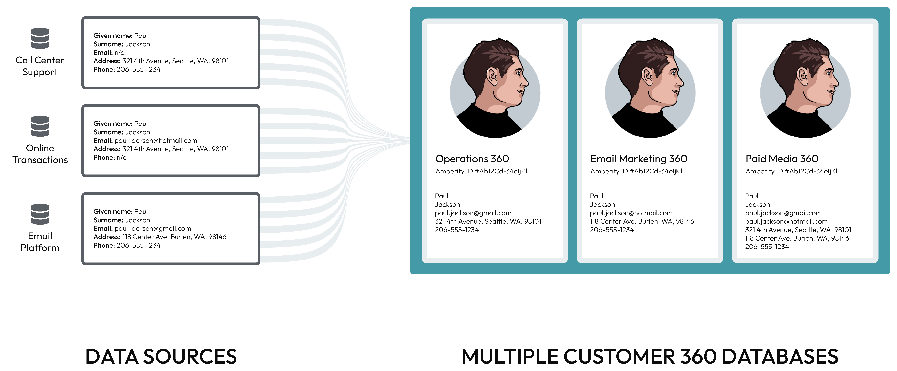

.. https://docs.amperity.com/reference/

.. meta::
    :description lang=en:
        Databases built from unified customer profiles help your brand better understand your customers.

.. meta::
    :content class=swiftype name=body data-type=text:
        Databases built from unified customer profiles help your brand better understand your customers.

.. meta::
    :content class=swiftype name=title data-type=string:
        About databases

==================================================
About databases
==================================================

.. databases-overview-start

Build databases against unified customer profiles built by Amperity to help your brand better understand your customers. Use Spark SQL to build any type of database that your brand requires, including customer 360-focused databases with complete customer profiles to fuel your brand's marketing activity and quality-focused databases that help your brand's data experts better understand each of your customer's unique profiles.

.. databases-overview-end

.. databases-customer-360-page-start

The **Customer 360** page provides:

* Visibility into the data that is behind your brand's customer profiles and interactions along with access to the **Data Explorer**, from which you can explore your brand's unified customer data
* Access to building and managing databases
* Visibility into what comprises your brand's set of standard core tables--building blocks for all of your brand's databases--and access to building and managing custom core tables

.. databases-customer-360-page-end

.. _databases-profiles:

Customer profiles
==================================================

.. databases-profiles-start

Customer profile details are pulled from the **Customer 360** table that is located in your brand's primary customer 360 database. Customer profile details include:

* Names (first name, last name), email address, physical address, phone numbers
* Transaction details (first purchases, last purchases, total purchases, etc.)
* Other custom profile values that are unique to your company

These details can be accessed from the **Profile** tab on the **Customer 360** page.

The **Profiles** tab shows the date on which the primary customer 360 database was last updated, how long it took to complete the update, and the number of customer profiles in the database.

.. databases-profiles-end

.. image:: ../../images/mockup-customer360-tab-customer-profile.png
   :width: 600 px
   :alt: Customer 360 page, customer profile
   :align: left
   :class: no-scaled-link

.. databases-profiles-context-start

Each customer profile is a collection of common attributes, transaction attributes, and other custom values that are unique to each customer's data set. These details are summarized on the **Customer 360** page under **Customer Profile**.

.. databases-profiles-context-end

.. _databases-profiles-about-attributes:

About profile attributes
--------------------------------------------------

.. include:: ../../shared/terms.rst
   :start-after: .. term-pii-start
   :end-before: .. term-pii-end

.. databases-profiles-about-attributes-list-start

PII profile attributes commonly available as part of the customer profile include:

.. list-table::
   :widths: 25 175 375
   :header-rows: 1

   * - Icon
     - Attribute Name
     - Description

   * - |fa-semantic-given-name|
     - **First Name**
     - .. include:: ../../shared/terms.rst
          :start-after: .. term-given-name-start
          :end-before: .. term-given-name-end

   * - |fa-semantic-surname|
     - **Last Name**
     - .. include:: ../../shared/terms.rst
          :start-after: .. term-surname-start
          :end-before: .. term-surname-end

   * - |fa-semantic-email|
     - **Email**
     - .. include:: ../../shared/terms.rst
          :start-after: .. term-email-start
          :end-before: .. term-email-end

   * - |fa-semantic-phone|
     - **Phone**
     - .. include:: ../../shared/terms.rst
          :start-after: .. term-phone-start
          :end-before: .. term-phone-end

   * - |fa-semantic-address|
     - **Address**
     - .. include:: ../../shared/terms.rst
          :start-after: .. term-address-start
          :end-before: .. term-address-end

   * - |fa-semantic-city|
     - **City**
     - .. include:: ../../shared/terms.rst
          :start-after: .. term-city-start
          :end-before: .. term-city-end

   * - |fa-semantic-state|
     - **State**
     - .. include:: ../../shared/terms.rst
          :start-after: .. term-state-start
          :end-before: .. term-state-end

   * - |fa-semantic-postal|
     - **Zip Code**
     - .. include:: ../../shared/terms.rst
          :start-after: .. term-postal-start
          :end-before: .. term-postal-end

   * - |fa-semantic-birthdate|
     - **Birthdate**
     - .. include:: ../../shared/terms.rst
          :start-after: .. term-birthdate-start
          :end-before: .. term-birthdate-end

   * - |fa-semantic-gender|
     - **Gender**
     - .. include:: ../../shared/terms.rst
          :start-after: .. term-gender-start
          :end-before: .. term-gender-end

.. databases-profiles-about-attributes-list-end

.. databases-profiles-about-attributes-note-start

.. note:: The profile attribute names that are shown in the profile attributes section are the same strings that were entered as friendly names when creating the **Customer 360** database table in the primary customer 360 database.

   These strings will default to the same as the field name if not specified as friendly names, including lower-case strings and underscores. The list of profile attributes will also depend on the SQL query that is used to create the **Merged Customers** table.

.. databases-profiles-about-attributes-note-end

.. _databases-profiles-refresh-icons:

Refresh customer profile icons
--------------------------------------------------

.. databases-profiles-refresh-icons-start

Profile icons are shown on the **Profiles** tab in the **Customer 360** page. Use profile icons to assign a visual element to important fields in the customer profile.

You can refresh these icons by updating the icons that are configured in the **Customer 360** table for the database that is configured as the primary customer 360 database for your tenant.

Open the **Customer 360** table, and then select the icon to show for the customer profile attribute from the **Icon** column on the **Configure and save** page within the **Database Editor**. Profile icons are applied automatically, but you may configure them when building or editing the **Customer 360** table.

.. databases-profiles-refresh-icons-end

**To apply icons to a field**

.. databases-profiles-apply-icons-start

#. Open the **Customer 360** table in the database editor.
#. Click **Next**.
#. Click the icon or empty space in the **Icon** column to open the **Select an Icon** dialog box, after which you can choose an icon or search for additional icons on the `Font Awesome <https://fontawesome.com/v5/search>`__ |ext_link| website.

   .. include:: ../../shared/databases.rst
      :start-after: .. databases-font-awesome-picker-useany-start
      :end-before: .. databases-font-awesome-picker-useany-end

#. Click **Refresh Semantics** to apply the a default icon to all profile attributes.
#. Click **Save**.

.. databases-profiles-apply-icons-end

.. _databases-database:

Databases
==================================================

.. databases-database-start

Use the **Databases** tab on the **Customer 360** page to define any number of individual databases. Each database have its own collection of tables and attributes. Some databases may be configured as "customer 360" databases, and then others may be configured as a "Stitch QA" database or a custom database to support any of your brand's use cases.

.. databases-database-end

.. image:: ../../images/mockup-customer360-tab-all-databases.png
   :width: 600 px
   :alt: All databases, from the Customer 360 page.
   :align: left
   :class: no-scaled-link

.. _databases-flexible-merge-rules:

Flexible merge rules
--------------------------------------------------

.. databases-flexible-merge-rules-start

Some customer data platforms require using an inflexible merge rule across multiple fields, which results in lower quality data across your customer 360 profile. This problem is magnified when that inflexible merge rule must also be applied to multiple databases.

Amperity combines the use of flexible merge rules with a patented system that allows multiple databases to exist within the same tenant. This ensures that:

#. Merge rules are 100% configurable
#. Each field can have its own merge rule
#. Each database can have its own set of merge rules
#. Each tenant can support a variety of merge rules to meet all of the requirements for any individual use case

For example, data sources from call centers, online transactions, and email platforms may contain slightly different sets of customer profile data.

.. image:: ../../images/use-cases-c360-flexible-merge-rules.png
   :width: 600 px
   :alt: Use flexible merge rules to support many databases.
   :align: left
   :class: no-scaled-link

After loading this data to Amperity and assigning the Amperity ID to each of your customers, you can use flexible merge rules to support multiple customer 360 databases.

* Your operations teams can combine prioritizing the most common values for each customer with deterministic matching
* Your email marketing team can combine prioritizing customer profile values from your email platform with probabilistic matching
* Your paid media team can combine all possible values to improve match rates on platforms like Google Ads and Facebook

Ask your Amperity implementation team for recommendations and best practices for how you can configure flexible merge rules to support all of your use cases.

.. databases-flexible-merge-rules-end

.. _databases-database-types:

Database types
--------------------------------------------------

.. databases-database-types-start

Databases belong to one of the following types:

* :ref:`databases-database-type-c360`
* :ref:`databases-database-type-empty`
* :ref:`databases-database-type-multiple-customer-360`
* :ref:`databases-database-type-passthrough`
* :ref:`databases-database-type-stitchqa`

.. databases-database-types-end

.. _databases-database-type-c360:

Customer 360 database
++++++++++++++++++++++++++++++++++++++++++++++++++

.. databases-database-type-c360-start

A customer 360 database contains customer profiles that are tied to all of their interactions with your company or brand. You may configure Amperity to support multiple customer 360 databases.

For example: a customer 360 database that contains all customer profiles and all interactions, and then a customer 360 database for each specific brand in your company's brand portfolio.

.. note:: A customer 360 database has specific requirements on tables that must be included within that database.

   Some of these tables are added as standard core tables, such as **Unified Itemized Transactions**, while others, such as **Merged Customers**, **Unified Transactions**, and **Customer 360** must be configured within each customer 360 database.

   Other use cases may require additional tables, such as for email engagement or predictive modeling.

.. databases-database-type-c360-end

.. databases-database-type-c360-required-start

Tables that are requred by a customer 360 database include:

* :ref:`data-tables-customer-360`
* :ref:`data-tables-customer-attributes`
* :ref:`data-tables-merged-customers`
* :ref:`data-tables-transaction-attributes`
* :ref:`data-tables-unified-coalesced`
* :ref:`data-tables-unified-customers`
* :ref:`data-tables-unified-itemized-transactions`
* :ref:`data-tables-unified-scores`
* :ref:`data-tables-unified-transactions`

Your brand can extend a customer 360 database to support additional use cases, such as behavioral data, clickstream, website events, email events and responses, campaign responses, and advertising performance.

.. databases-database-type-c360-required-end

.. _databases-database-type-empty:

Empty database
++++++++++++++++++++++++++++++++++++++++++++++++++

.. databases-database-type-empty-start

An empty database is not built from a template and does not contain any tables, as a starting point. Use an empty database to build tables to support any of your brand's non-customer 360 use cases.

.. databases-database-type-empty-end

.. _databases-database-type-multiple-customer-360:

Multiple customer 360 databases
++++++++++++++++++++++++++++++++++++++++++++++++++

.. databases-database-type-multiple-start

You may configure more than one database to be a customer 360 database. Each database contains its own set of standard tables, and then each may be configured to have its own combination of standard core tables and/or domain tables that are added as passthrough tables.

.. databases-database-type-multiple-end

.. _databases-database-type-passthrough:

Passthrough database
++++++++++++++++++++++++++++++++++++++++++++++++++

.. databases-database-type-passthrough-start

A passthrough database contains *all* stitched domain tables and *all* non-stitched domain tables passed through into a standalone database.

.. databases-database-type-passthrough-end

.. _databases-database-type-stitchqa:

Stitch QA database
++++++++++++++++++++++++++++++++++++++++++++++++++

.. databases-database-type-stitchqa-start

A Stitch QA database contains a series of Amperity-generated tables that can be used to validate the Amperity ID assignment to customer profiles.

Use the Stitch QA database template to quickly build a Stitch QA database for your tenant.

.. databases-database-type-stitchqa-end

.. _databases-database-table-types:

Database table types
--------------------------------------------------

.. databases-database-table-types-start

Database tables belong to one of the following broad categories:

* :ref:`databases-database-table-type-sql`
* :ref:`databases-database-table-type-passthrough`
* :ref:`databases-database-table-type-template`

.. databases-database-table-types-end

.. _databases-database-table-type-sql:

Custom SQL
++++++++++++++++++++++++++++++++++++++++++++++++++

.. databases-database-table-type-sql-start

A custom SQL table uses Spark SQL and a **SELECT** statement to reference any core table, domain table, or database table, including tables that represent files that were uploaded to that database.

.. tip:: You can use a SQL template with custom SQL tables as a starting point for certain types of tables that are required by Amperity customer 360 databases.

   Select a template from the **Apply template** dropdown. Most templates require some configuration and all templates may be extended for your brand's use cases.

.. databases-database-table-type-sql-end

.. _databases-database-table-type-passthrough:

Passthrough
++++++++++++++++++++++++++++++++++++++++++++++++++

.. databases-database-table-type-passthrough-start

A passthrough table allows a domain table to be used within the Amperity database layer. A passthrough uses a stitched domain table when it is available.

.. databases-database-table-type-passthrough-end

.. _databases-database-table-type-template:

Visual templates
++++++++++++++++++++++++++++++++++++++++++++++++++

.. databases-database-table-type-template-start

Use a visual template to build database tables without writing SQL. The visual template interface shows only the configurable components within a database table.

.. databases-database-table-type-template-end

.. _databases-database-table-howtos:

Database how-tos
--------------------------------------------------

.. databases-database-table-howtos-start

**Databases**

* :ref:`databases-database-howto-activate`
* :ref:`databases-database-howto-add-database-customer360`
* :ref:`databases-database-howto-add-database-empty`
* :ref:`databases-database-howto-add-database-passthrough`
* :ref:`databases-database-howto-add-database-stitchqa`
* :ref:`databases-database-howto-configure-permissions`
* :ref:`databases-database-howto-delete-database`
* :ref:`databases-database-howto-download-schema`
* :ref:`databases-database-howto-duplicate-database`
* :ref:`databases-database-howto-edit-database`
* :ref:`databases-database-howto-explore`
* :ref:`databases-database-howto-export-database`
* :ref:`databases-database-howto-run`
* :ref:`databases-database-howto-view-all-databases`
* :ref:`databases-database-howto-view-database`
* :ref:`databases-database-howto-view-permissions`
* :ref:`databases-database-howto-view-recent-activity`
* :ref:`databases-database-howto-view-run-history`

**Tables**

* :ref:`databases-database-howto-add-table-override`
* :ref:`databases-database-howto-add-table-custom`
* :ref:`databases-database-howto-add-table-passthrough`
* :ref:`databases-database-howto-add-table-template`
* :ref:`databases-database-howto-allow-tables-in-segments`
* :ref:`databases-database-howto-apply-table-semantic`
* :ref:`databases-database-howto-copy-table`
* :ref:`databases-database-howto-delete-table`
* :ref:`databases-database-howto-discard-draft-tables`
* :ref:`databases-database-howto-edit-table`
* :ref:`databases-database-howto-enforce-static-schemas`
* :ref:`databases-database-howto-export-table`
* :ref:`databases-database-howto-hide-table`
* :ref:`databases-database-howto-mark-columns-as-pii`
* :ref:`databases-database-howto-pick-list`
* :ref:`databases-database-howto-set-validation-rules`

.. databases-database-table-howtos-end

.. _databases-core:

Core tables
==================================================

.. include:: ../../shared/terms.rst
   :start-after: .. term-core-tables-start
   :end-before: .. term-core-tables-end

.. databases-core-table-list-start

There are two types of core tables:

#. :ref:`Standard core tables <databases-core-table-type-standard>`
#. :ref:`Custom core tables <databases-core-table-type-custom>`

.. databases-core-table-list-end

.. _databases-core-table-type-standard:

Standard core tables
--------------------------------------------------

.. include:: ../../shared/terms.rst
   :start-after: .. term-core-tables-standard-start
   :end-before: .. term-core-tables-standard-end

.. databases-core-table-type-standard-start

Standard core tables belong to one of the following broad categories:

.. list-table::
   :widths: 30 70
   :header-rows: 0

   * - **Stitched domain tables**
     - .. include:: ../../shared/terms.rst
          :start-after: .. term-domain-table-stitched-start
          :end-before: .. term-domain-table-stitched-end

       .. image:: ../../images/howitworks-standard-core-table.png
          :width: 440 px
          :alt: Standard core tables.
          :align: left
          :class: no-scaled-link

       .. include:: ../../amperity_reference/source/domain_tables.rst
          :start-after: .. domain-tables-stitched-context-start
          :end-before: .. domain-tables-stitched-context-end

   * - **Unified tables**
     - .. include:: ../../shared/terms.rst
          :start-after: .. term-unified-tables-start
          :end-before: .. term-unified-tables-end

       The collection of unified tables that is generated within your tenant depends on the types of semantic tags that were applied to feeds and/or custom domain tables in the **Sources** tab.

   * - **Stitch QA tables**
     - .. include:: ../../shared/terms.rst
          :start-after: .. term-stitch-qa-tables-start
          :end-before: .. term-stitch-qa-tables-end

       Some Stitch QA tables are required by databases that are configured as customer 360 databases; most are only available from databases that are configured as a Stitch QA database.

.. databases-core-table-type-standard-end

.. _databases-core-table-type-custom:

Custom core tables
--------------------------------------------------

.. include:: ../../shared/terms.rst
   :start-after: .. term-core-tables-custom-start
   :end-before: .. term-core-tables-custom-end

.. _databases-core-table-howtos:

Core table how-tos
--------------------------------------------------

.. databases-core-table-howtos-start

* :ref:`databases-core-howtos-add-custom`
* :ref:`databases-core-howtos-delete-custom`
* :ref:`databases-core-howtos-edit-custom`
* :ref:`databases-core-howtos-search`
* :ref:`databases-core-howtos-view`
* :ref:`databases-core-howtos-view-sql`

.. databases-core-table-howtos-end

.. _databases-realtime:

Real time tables
==================================================

.. databases-realtime-start

Real-time tables contain the data that is streamed to Amperity. Real-time tables are available alongside customer profiles in your brand's customer 360 database. Real-time tables complement the daily batch process that is used to build and maintain complete and durable customer profiles over longer timeframes by enabling use cases that require the use of data that is updated more frequently.

.. databases-realtime-end

.. databases-realtime-howtos-start

This section describes tasks related to managing real-time tables in Amperity:

* :ref:`databases-realtime-howtos-add`
* :ref:`databases-realtime-howtos-delete`
* :ref:`databases-realtime-howtos-edit`
* :ref:`databases-realtime-howtos-update-data-format`
* :ref:`databases-realtime-howtos-update-schema`

.. databases-realtime-howtos-end

.. _databases-realtime-howtos-add:

Add real-time table
--------------------------------------------------

.. databases-realtime-howtos-add-start

A real-time table collects data that is streamed to Amperity, and then makes that streamed data available to databases and queries. Use the **Real-time tables** tab on the **Databases** page to manage real-time tables.

.. databases-realtime-howtos-add-end

**To add a real-time table**

.. databases-realtime-howtos-add-steps-start

#. Open the **Customer 360** page, and then select the **Real-time tables** tab.

   Click **Add table**.

#. In the **Create real-time table** dialog, do the following:

   Give the real-time table a name. Use a naming convention that associates the real-time table with its related streaming endpoint, and then identifies the type of data in the real-time table and/or the use case.

   Define the schema for the real-time table. Each field in the schema must exist in the list of fields that are streamed to Amperity by the streaming endpoint that is associated with this table. The field names in the real-time table must match the fields that are defined for the streamed endpoint. Refer to the feed associated with the streamed endpoint to 

   .. note:: The schema for every real-time table contains two additional fields: **received_at** (the time at which data arrived at the streaming endpoint) and **written_at** (the time at which data was written to the real-time table).

   Choose the data format for streaming data to the real-time table: "JSON" or "XML". If "XML" is selected a **Row tag** must be specified, which must identify a single row of XML data.

   .. image:: ../../images/mockup-databases-table-realtime-add-01.png
      :width: 420 px
      :alt: Batch and streaming layers.
      :align: left
      :class: no-scaled-link

   Click **Next**.

#. In the **Create real-time table** dialog, continue:

   Select the streaming endpoint that will stream data to the real-time table. The streaming endpoint must already exist and be available from the dropdown list.

   Select the databases for which this real-time table will be available from the **Queries** page.

   .. image:: ../../images/mockup-databases-table-realtime-add-02.png
      :width: 420 px
      :alt: Batch and streaming layers.
      :align: left
      :class: no-scaled-link

   Click **Active**.

   .. important:: Real-time tables must be setto **Active** before they can be accessed from the **Queries** page.

#. Run all of the databases for which this real-time table will be available. When this step is complete, open the **Queries** page and verify that the real-time table is available for queries and that data in the real-time table can be returned in the results.

.. databases-realtime-howtos-add-steps-end

.. _databases-realtime-howtos-delete:

Delete real-time table
--------------------------------------------------

.. databases-realtime-howtos-delete-start

Use the **Delete** option to remove a real-time table from Amperity. This should be done carefully. Verify that both upstream and downstream processes are not relying on the real-time table before you delete it.

.. databases-realtime-howtos-delete-end

**To delete a real-time table**

.. databases-realtime-howtos-delete-steps-start

#. Open the **Customer 360** page, and then select the **Real-time tables** tab.
#. For a real-time table, open the |fa-kebab| menu and click **Delete**.
#. Confirm that you want to delete the real-time table.

.. databases-realtime-howtos-delete-steps-end

.. _databases-realtime-howtos-edit:

Edit real-time table name
--------------------------------------------------

.. databases-realtime-howtos-edit-start

Use the **Edit** option to rename a real-time table.

.. important:: You cannot change the schema or data format for a real-time table. To change the schema or data format, create a new real-time table, and then align that table to the data format and/or schema, and then associate that table with the correct streaming endpoint.

.. databases-realtime-howtos-edit-end

**To edit a real-time table**

.. databases-realtime-howtos-edit-steps-start

#. Open the **Customer 360** page, and then select the **Real-time tables** tab.
#. For a real-time table, open the |fa-kebab| menu and click **Edit**.
#. Rename the table, and then click **Save**.

.. databases-realtime-howtos-edit-steps-end

.. _databases-realtime-howtos-update-data-format:

Update real-time data format
--------------------------------------------------

.. databases-realtime-howtos-update-data-format-start

You cannot update the data format for a real-time table. Instead, create a new real-time table that defines the updated data format. You may associate this real-time table to an existing streaming endpoint or to a new streaming endpoint.

.. databases-realtime-howtos-update-data-format-end

.. _databases-realtime-howtos-update-schema:

Update real-time table schema
--------------------------------------------------

.. databases-realtime-howtos-update-schema-start

You cannot update the schema for a real-time table. Instead, create a new real-time table that defines the updated schema. You may associate this real-time table to an existing streaming endpoint or to a new streaming endpoint.

.. databases-realtime-howtos-update-schema-end

.. _databases-database-howtos-databasese:

How-tos
==================================================

.. databases-databases-howtos-databasese-start

This section describes tasks related to building and managing databases in Amperity.

.. databases-databases-howtos-databasese-end

* :ref:`databases-database-howto-activate`
* :ref:`databases-database-howto-add-table-override`
* :ref:`databases-core-howtos-add-custom`
* :ref:`databases-database-howto-add-table-custom`
* :ref:`databases-database-howto-add-database-customer360`
* :ref:`databases-database-howto-add-database-empty`
* :ref:`databases-database-howto-add-database-passthrough`
* :ref:`databases-database-howto-add-table-passthrough`
* :ref:`databases-database-howto-add-database-stitchqa`
* :ref:`databases-database-howto-add-table-template`
* :ref:`databases-database-howto-allow-tables-in-segments`
* :ref:`databases-database-howto-apply-table-semantic`
* :ref:`databases-database-howto-choose-currency`
* :ref:`databases-database-howto-configure-permissions`
* :ref:`databases-database-howto-pick-list`
* :ref:`databases-database-howto-copy-table`
* :ref:`databases-core-howtos-delete-custom`
* :ref:`databases-database-howto-delete-database`
* :ref:`databases-database-howto-delete-table`
* :ref:`databases-database-howto-discard-draft-tables`
* :ref:`databases-database-howto-download-schema`
* :ref:`databases-database-howto-duplicate-database`
* :ref:`databases-core-howtos-edit-custom`
* :ref:`databases-database-howto-edit-database`
* :ref:`databases-database-howto-edit-table`
* :ref:`databases-database-howto-enable-table-versioning`
* :ref:`databases-database-howto-enforce-static-schemas`
* :ref:`databases-database-howto-explore`
* :ref:`databases-database-howto-export-database`
* :ref:`databases-database-howto-export-table`
* :ref:`databases-database-howto-hide-table`
* :ref:`databases-database-howto-mark-columns-as-pii`
* :ref:`databases-database-howto-run`
* :ref:`databases-core-howtos-search`
* :ref:`databases-database-howto-set-validation-rules`
* :ref:`databases-database-howto-view-all-databases`
* :ref:`databases-core-howtos-view`
* :ref:`databases-database-howto-view-database`
* :ref:`databases-database-howto-view-permissions`
* :ref:`databases-database-howto-view-recent-activity`
* :ref:`databases-database-howto-view-run-history`
* :ref:`databases-core-howtos-view-sql`

.. _databases-database-howto-activate:

Activate database
--------------------------------------------------

.. databases-database-howto-active-vs-draft-start

A database may be in one of the following states: active and draft:

* .. include:: ../../shared/terms.rst
     :start-after: .. term-active-database-start
     :end-before: .. term-active-database-end

* .. include:: ../../shared/terms.rst
     :start-after: .. term-draft-database-start
     :end-before: .. term-draft-database-end

.. databases-database-howto-active-vs-draft-end

.. databases-database-howto-activate-start

Only databases in an **Active** state may be run against stitched data. Activation is a required step--"Click the **Activate** button."--at the end of any process that adds or edits a database.

.. databases-database-howto-activate-end

.. _databases-core-howtos-add-custom:

Add custom core table
--------------------------------------------------

.. databases-core-howtos-add-custom-start

You may add custom core tables using Spark SQL and the **Custom Core Table** SQL editor. Start with a SELECT statement, and then use a series of LEFT JOINs to reference core tables and/or domain tables. Use a sandbox to validate any workflows that will depend on the custom core table.

.. databases-core-howtos-add-custom-end

**To add a custom core table**

.. databases-core-howtos-add-custom-steps-start

#. From the **Customer 360** page, open the **Core tables** tab.
#. Click the **Add table** button. This opens the **Custom Core Table** SQL editor.
#. Use a **SELECT** statement to build the custom core table.
#. Click **Validate** to verify that the SQL query runs correctly, and then **Next** to review the settings for the custom core table.
#. Click **Activate** to add the custom core table.

.. databases-core-howtos-add-custom-steps-end

.. _databases-database-howto-add-databases:

Add databases
--------------------------------------------------

.. databases-database-howto-add-databases-start

Amperity supports a wide variety of database types, including customer 360- and quality-focused databases your brand can build from templates, to help your brand (or brands) better understand your customers.

.. databases-database-howto-add-databases-end

* :ref:`databases-database-howto-add-database-customer360`
* :ref:`databases-database-howto-add-database-empty`
* :ref:`databases-database-howto-add-database-passthrough`
* :ref:`databases-database-howto-add-database-stitchqa`

.. _databases-database-howto-add-database-customer360:

Add customer 360 database
++++++++++++++++++++++++++++++++++++++++++++++++++

.. include:: ../../shared/terms.rst
   :start-after: .. term-customer-360-database-start
   :end-before: .. term-customer-360-database-end

**To add a customer 360 database**

.. databases-database-howto-add-database-customer360-steps-start

#. From the **Customer 360** page, open the **Databases** tab.
#. Click **Create Database**.
#. Give the database a name, set the value for **Template** to "Customer 360", and set the permissions that determine which users will be able to access this database, and then click **Create**.

   .. important:: A |add_customer_360_database| requires additional configuration after the database is created.

.. databases-database-howto-add-database-customer360-steps-end

.. _databases-database-howto-add-database-empty:

Add empty database
++++++++++++++++++++++++++++++++++++++++++++++++++

.. databases-database-howto-add-database-empty-start

Add an empty database for use cases that do not require customer 360 profiles or Stitch QA validation activities. Start with an empty database, and then add tables.

For example, after creating the empty database use the passthrough functionality to add one or more domain tables, and then use Spark SQL to build custom database tables against a subset of standard core tables and/or stitched domain tables to build a series of tables that support a series of non-marketing use cases.

.. databases-database-howto-add-database-empty-end

**To add an empty database**

.. databases-database-howto-add-database-empty-steps-start

#. From the **Customer 360** page, open the **Databases** tab.
#. Click **Create Database**.
#. Give the database a name, set the value for **Template** to "None", and set the permissions that determine which users will be able to access this database, and then click **Create**.
#. Use the **Database Editor** to add tables to the empty database.

.. databases-database-howto-add-database-empty-steps-end

.. _databases-database-howto-add-database-passthrough:

Add passthrough database
++++++++++++++++++++++++++++++++++++++++++++++++++

.. include:: ../../shared/terms.rst
   :start-after: .. term-passthrough-database-start
   :end-before: .. term-passthrough-database-end

.. databases-database-howto-add-database-passthrough-context-start

Stitched domain tables have an added column for the Amperity ID and replace the source domain table in a passthrough database, but are otherwise identical to the source domain table.

.. databases-database-howto-add-database-passthrough-context-end

**To add a passthrough database**

.. databases-database-howto-add-database-passthrough-steps-start

#. From the **Customer 360** page, open the **Databases** tab.
#. Click **Create Database**.
#. Give the database a name, set the value for **Template** to "Passthrough", and set the permissions that determine which users will be able to access this database, and then click **Create**.
#. Use the **Database Editor** to extend the passthrough database with custom SQL tables.

.. databases-database-howto-add-database-passthrough-steps-end

.. _databases-database-howto-add-database-stitchqa:

Add Stitch QA database
++++++++++++++++++++++++++++++++++++++++++++++++++

.. include:: ../../shared/terms.rst
   :start-after: .. term-stitch-qa-start
   :end-before: .. term-stitch-qa-end

.. databases-database-howto-add-database-stitchqa-context-start

A Stitch QA database loaded from a template contains a list of pre-loaded SQL queries that may be used to help validate the quality of Stitch output.

.. databases-database-howto-add-database-stitchqa-context-end

**To add a Stitch QA database**

.. databases-database-howto-add-database-stitchqa-steps-start

#. From the **Customer 360** page, open the **Databases** tab.
#. Click **Create Database**.
#. Give the database a name, set the value for **Template** to "Passthrough", and set the permissions that determine which users will be able to access this database, and then click **Create**.
#. Use the **Database Editor** to extend the passthrough database with custom SQL tables.

.. databases-database-howto-add-database-stitchqa-steps-end

.. _databases-database-howto-add-tables:

Add tables
--------------------------------------------------

.. databases-database-howto-add-tables-start

Use the followging types of tables to build databases to support your brand's use cases.

.. databases-database-howto-add-tables-end

* :ref:`databases-database-howto-add-table-override`
* :ref:`databases-database-howto-add-table-custom`
* :ref:`databases-database-howto-add-table-passthrough`
* :ref:`databases-database-howto-add-table-template`

.. _databases-database-howto-add-table-override:

Add core table override
++++++++++++++++++++++++++++++++++++++++++++++++++

.. databases-database-howto-add-table-override-start

A :ref:`core table <databases-core>` forms the foundation of your brand's databases. Standard core tables are output by Stitch and provide unified data structures for all data sources to which semantic tags were applied or in which foreign keys are present that allow rows in that table to be associated with an Amperity ID.

Some use cases require a database table to have different information in a database table than what is in a core table.

.. databases-database-howto-add-table-override-end

**To override a core table**

.. databases-database-howto-add-table-override-start

#. From the **Customer 360** page, open the **Databases** tab.
#. Open a database in **Edit** mode, and then click **Add Table**.

   .. important:: The table name must be the same as the original standard database table.
#. Set **Build Mode** to "Custom SQL".
#. Add SQL using Spark SQL, a **SELECT** statement that references one or more standard core tables, database tables, or passed-through domain tables using a series of functions, operators, and clauses.

   .. important:: The custom definition must refer to the original table, that is “must refer to the table that is being overridden”. In some cases, this requires using a placeholder reference. For example:

      .. code-block:: sql

         WITH placeholder AS (
           SELECT *
           FROM override_allowed_table
           LIMIT 1
         )
         ...

         SELECT *
         FROM unrelated_table

   For example, the **Unified Itemized Transactions** table requires a product ID. The **product_id** column is created by applying the **product-id** semantic tag to itemized interactions records.

   However, in some cases another table contains the preferred product ID. The following example shows how to override the standard **Unified Itemized Transactions** table and to join more complete product ID information, such as what may be in the **Unified Product Catalog** table:

      .. code-block:: sql

         SELECT
           uit.*
           ,upc.product_category AS `product_category`
           ,upc.product_description AS `product_description`
           ,upc.product_subcategory AS `product_subcategory`
         FROM
           Unified_Itemized_Transactions uit
           LEFT JOIN Unified_Product_Catalog upc
           ON uit.product_id = upc.product_id

#. Click **Validate** to verify that the SQL query runs correctly and returns the desired results. Adjust the query as necessary. When finished, click **Next**.
#. Verify the configuration settings for the table, including semantic tags, field descriptions, and availablility to the **Segment Editor**.
#. Click **Save** to add the table to the database.

.. databases-database-howto-add-table-override-end

.. _databases-database-howto-add-table-custom:

Add custom SQL table
++++++++++++++++++++++++++++++++++++++++++++++++++

.. include:: ../../shared/terms.rst
   :start-after: .. term-sql-360-table-start
   :end-before: .. term-sql-360-table-end

.. databases-database-howto-add-table-custom-tip-start

.. tip:: You can associate the Amperity ID to a unique ID in a custom SQL table. For example, "CCUST" associates a unique ID in a table to the Amperity ID:

   .. code-block:: sql

      SELECT
        CCUST.amperity_id
        ,CTX.customer_id
        ,CTX.orderid
        ,CTX.purchasedate
        ,CTX.transactiontotal
        ,CTX.pointsearned
        ,CTX.numberofitems
        ,CTX.avgitemprice
        ,CTX.productcode
        ,CTX.productcategory
        ,CTX.storeorwebid
      FROM POS_Transactions AS CTX
      LEFT JOIN POS_Customers AS CCUST
      ON (CCUST.customer_id = CTX.customer_id)

.. databases-database-howto-add-table-custom-tip-end

**To add a custom SQL table**

.. databases-database-howto-add-table-custom-steps-start

#. From the **Customer 360** page, open the **Databases** tab.
#. Open a database in **Edit** mode, and then click **Add Table**.
#. Set **Build Mode** to "Custom SQL".

   .. note:: Click the **Apply SQL template** to select a SQL template as a starting point for the custom SQL table.

      Templates are provided for all standard tables (**Customer 360**, **Merged Customers**, **Transaction Attributes Extended**, **Unified Transactions**, and **Customer Attributes**) along with additional templates for use with multibrand databases and and tables that support use cases like joining transaction attributes to the **Customer 360** table, merged households, and customer lifecycle events.

#. Add SQL using Spark SQL, a **SELECT** statement that references one or more standard core tables, database tables, or passed-through domain tables using a series of functions, operators, and clauses.
#. Click **Validate** to verify that the SQL query runs correctly and returns the desired results. Adjust the query as necessary. When finished, click **Next**.
#. Verify the configuration settings for the table, including semantic tags, field descriptions, and availablility to the **Segment Editor**.
#. Click **Save** to add the table to the database.

.. databases-database-howto-add-table-custom-steps-end

.. _databases-database-howto-add-table-passthrough:

Add passthrough table
++++++++++++++++++++++++++++++++++++++++++++++++++

.. include:: ../../shared/terms.rst
   :start-after: .. term-passthrough-360-table-start
   :end-before: .. term-passthrough-360-table-end

.. databases-database-howto-add-table-passthrough-start

.. important:: Stitched versions of domain tables have an added column for the Amperity ID and replace the source domain table within Amperity for all downstream use cases, but are otherwise identical to the source domain table.

.. databases-database-howto-add-table-passthrough-end

**To add a domain table passthrough**

.. databases-database-howto-add-table-passthrough-steps-start

#. From the **Customer 360** page, open the **Databases** tab.
#. Open a database in **Edit** mode, and then click **Add Table**.
#. Set **Build Mode** to "Passthrough", and then select a table from the **Source table** dropdown.
#. Click **Validate** to verify that the SQL query runs correctly and returns the desired results. Adjust the query as necessary. When finished, click **Next**.
#. Verify the configuration settings for the table, including semantic tags, field descriptions, and availablility to the **Segment Editor**.
#. Click **Save** to add the table to the database.

.. databases-database-howto-add-table-passthrough-steps-end

.. _databases-database-howto-add-table-template:

Add visual template table
++++++++++++++++++++++++++++++++++++++++++++++++++

.. databases-database-howto-add-table-template-start

A visual template provides a user interface for specific configuration settings within a SQL table. A visual template is available for the following tables in the **Databases** tab within the **Customer 360** page:

* |table_merged_customers|

.. databases-database-howto-add-table-template-end

**To add a table using a visual template**

.. .. databases-database-howto-add-table-template-steps-start

#. From the **Customer 360** page, open the **Databases** tab.
#. Open a database in **Edit** mode, and then click **Add Table**.
#. Set **Build Mode** to "Visual template", and then select a table from the **Target table** dropdown.
#. Follow the directions in the visual template page for the selected table.

   Update the list of domain tables under **General source priority** to contain *at least one* domain table with fields tagged for PII semantics.

   Optional. You may define priority by semantic tag.

   When finished, click **Next**.
#. Click **Validate** to verify that the SQL query runs correctly and returns the desired results. Adjust the query as necessary. When finished, click **Next**.
#. Verify the configuration settings for the table, including semantic tags, field descriptions, and availablility to the **Segment Editor**.
#. Click **Save** to add the table to the database.

.. databases-database-howto-add-table-template-steps-end

.. _databases-database-howto-allow-tables-in-segments:

Allow table in segments
--------------------------------------------------

.. databases-database-howto-allow-tables-in-segments-start

A database must be made visible to non-admin users of Amperity so they may access database tables from the **Segments** page. Visibility is required to build segments via the **Segment Editor** or the **SQL Segment Editor**. To make a database visible to non-admin users, enable the **Make available in visual Segment Editor** checkbox within the table editor *or* select the checkbox in the **In VSE?** column from the list of tables in a database.

.. admonition:: What is the visual Segment Editor?

   .. include:: ../../shared/terms.rst
      :start-after: .. term-visual-segment-editor-start
      :end-before: .. term-visual-segment-editor-end

.. important:: Only tables that contain an Amperity ID can be made available to the **Segment Editor**. The **Customer 360** table is made available to the **Segment Editor** automatically. Other tables may be made available by selecting the checkbox in the **In VSE?** column from the list of tables in a database.

.. databases-database-howto-allow-tables-in-segments-end

**To allow tables in segments**

.. databases-database-howto-allow-tables-in-segments-steps-start

#. From the **Customer 360** page, open the **Databases** tab.
#. Open a database in **Edit** mode.
#. Select the checkbox in the **In VSE?** column to make the table available to the visual **Segment Editor**
#. Click **Activate**.

.. databases-database-howto-allow-tables-in-segments-steps-end

.. _databases-database-howto-apply-table-semantic:

Apply table semantic tags
--------------------------------------------------

.. databases-database-howto-apply-table-semantic-start

A semantic tag associates a table in a database with a table requirement for the database. For example: "Customer 360", "Unified Customers", or "Unified Scores". Tags *should* be assigned by Amperity automatically as tables are built. You can see which tag is assigned to a table from the **Tag** column in the **Database Viewer** and can set the semantic tag in the table editor from the **Table semantics** dropdown.

.. databases-database-howto-apply-table-semantic-end

.. _databases-database-howto-choose-currency:

Choose currency symbol
--------------------------------------------------

.. databases-database-howto-choose-currency-start

The currency symbol to show for metrics and segment insights is configurable. The following currency symbols are in the dropdown list:

.. list-table::
   :widths: 50 25 25
   :header-rows: 0

   * - **Australian Dollar**
     - AUD
     - |u-dollar|
   * - **Canadian Dollar**
     - CAD
     - |u-dollar|
   * - **United States Dollar**
     - USD
     - |u-dollar|
   * - **Mexican Peso**
     - MXN
     - |u-peso|
   * - **British Pound**
     - GBP
     - |u-pound|
   * - **Euro**
     - EUR
     - |u-euro|
   * - **Indian Rupee**
     - INR
     - |u-rupee|
   * - **Japanese Yen**
     - JPY
     - |u-yen|

.. tip:: You may configure custom currency symbols, for example South Korean Won (KRW, |u-won|).

.. databases-database-howto-choose-currency-end

**To choose the currency for a database**

.. databases-database-howto-choose-currency-steps-start

#. From the **Customer 360** page, open the **Databases** tab.
#. Select a database and open it in **Edit** mode.
#. In the right-side navigation pane, under **Currency**, select the currency symbol to show for metrics and segment insights for this database.

   .. tip:: Choose "Custom symbol" to apply a currency symbol that is not in the dropdown list.

      For example, to use South Korean Won (KRW) as the currency symbol, choose "Custom symbol", and then enter "|u-won|" in the **Custom currency symbol** field.

      If you want a space to be present in-between the currency symbol and the monetary value shown, use "Custom symbol" and then add a space after the currency symbol: "|u-won| ".

   .. note:: Unicode, hex, HTML code, and HTML entity values are not supported.

#. Click **Activate**.

.. databases-database-howto-choose-currency-steps-end

.. _databases-database-howto-configure-permissions:

Configure permissions
--------------------------------------------------

.. databases-database-howto-configure-permissions-start

Access to databases can be configured to allow only administrators, users who belong to a custom resource group, or everyone. 

.. databases-database-howto-configure-permissions-end

* :ref:`databases-database-howto-configure-permission-admin`
* :ref:`databases-database-howto-configure-permission-resource-group`
* :ref:`databases-database-howto-configure-permission-everyone`

.. _databases-database-howto-configure-permission-admin:

Allow only admins
++++++++++++++++++++++++++++++++++++++++++++++++++

.. databases-database-howto-configure-permission-admin-start

A database that is configured for **Admin only** access restricts access to the database and tables within the database to only users who are assigned the **DataGrid Administrator** or **DataGrid Operator** policies.

.. databases-database-howto-configure-permission-admin-end

**To restrict access to only admins**

.. databases-database-howto-configure-permission-admin-steps-start

#. From the **Customer 360** page, open the **Databases** tab.
#. Choose a database, and then from the |fa-kebab| menu, select **Permissions**. This opens the **Permissions** dialog.
#. Select **Standard**, and then choose "Admin-only".
#. Click **Save**

.. databases-database-howto-configure-permission-admin-steps-end

.. _databases-database-howto-configure-permission-resource-group:

Allow resource group
++++++++++++++++++++++++++++++++++++++++++++++++++

.. databases-database-howto-configure-permission-resource-group-start

A database that is configured for **Standard** access may restrict access to a datbase to only users who belong to a :doc:`resource group <resource_groups>` that is configured in Amperity.

.. databases-database-howto-configure-permission-resource-group-end

**To restrict access to a single resource group**

.. databases-database-howto-configure-permission-resource-group-steps-start

#. From the **Customer 360** page, open the **Databases** tab.
#. Choose a database, and then from the |fa-kebab| menu, select **Permissions**. This opens the **Permissions** dialog.
#. Select **Standard**, and then choose a resource group.
#. Click **Save**

.. databases-database-howto-configure-permission-resource-group-steps-end

.. _databases-database-howto-configure-permission-everyone:

Allow everyone
++++++++++++++++++++++++++++++++++++++++++++++++++

.. include:: ../../amperity_reference/source/resource_groups.rst
   :start-after: .. settings-security-resource-groups-all-start
   :end-before: .. settings-security-resource-groups-all-end

.. databases-database-howto-configure-permission-everyone-start

A database that is configured for **Standard** access may allow access to everyone. When resource groups are configured in Amperity, choose the "No resource group" option from the dropdown. When resource groups are not configured, choose the the **Standard** radio button.

.. databases-database-howto-configure-permission-everyone-end

**To allow everyone access to a database**

.. databases-database-howto-configure-permission-everyone-steps-start

#. From the **Customer 360** page, open the **Databases** tab.
#. Choose a database, and then from the |fa-kebab| menu, select **Permissions**. This opens the **Permissions** dialog.
#. Select **Standard**, and then choose "No resource group".
#. Click **Save**

.. databases-database-howto-configure-permission-everyone-steps-end

.. _databases-database-howto-pick-list:

Configure pick-lists
--------------------------------------------------

.. databases-database-howto-pick-list-start

A pick-list is a pre-generated list of available options for a column and is presented as a dropdown list in the visual **Query Editor**. A pick-list is configured when building tables in the **Customer 360** page.

.. databases-database-howto-pick-list-end

* :ref:`databases-database-howto-pick-list-define-custom`
* :ref:`databases-database-howto-pick-list-delete`
* :ref:`databases-database-howto-pick-list-edit`
* :ref:`databases-database-howto-pick-list-alphabetical`
* :ref:`databases-database-howto-pick-list-natural`
* :ref:`databases-database-howto-pick-list-most-frequent`

.. _databases-database-howto-pick-list-define-custom:

Define custom values and frequencies
++++++++++++++++++++++++++++++++++++++++++++++++++

.. databases-database-howto-pick-list-define-custom-start

A pick-list may be configured with custom values, where each item in the pick-list is specified on its own line.

.. caution:: Using custom values in a pick-list is uncommon. It is generally best to use automatically generated values.

.. databases-database-howto-pick-list-define-custom-end

**To define custom values for a pick-list**

.. databases-database-howto-pick-list-define-custom-steps-start

#. From the **Customer 360** page, open the **Databases** tab.
#. Open a database in **Edit** mode.
#. Open a table, and then click **Next** to move to the second step in the table editor.
#. Select the checkbox in the **Pick-list** column in the row for which a picklist is to be created.
#. Click the **Setup** link next to the checkbox. This opens the **Configure Pick-List** dialog box.
#. Select a sort order.
#. Select the **Custom** method for the pick-list, and then enter each custom value on a new line. For example:

   ::

      Value one
      Value two
      Value three
      ...

#. Click **Save**.

.. databases-database-howto-pick-list-define-custom-steps-end

.. _databases-database-howto-pick-list-delete:

Delete pick-list
++++++++++++++++++++++++++++++++++++++++++++++++++

.. databases-database-howto-pick-list-delete-start

A pick-list may be deleted. This will disable any selection options in the visual **Query Editor**.

.. databases-database-howto-pick-list-delete-end

**To delete a pick-list**

.. databases-database-howto-pick-list-delete-steps-start

#. From the **Customer 360** page, open the **Databases** tab.
#. Open a database in **Edit** mode.
#. Open a table, and then click **Next** to move to the second step in the table editor.
#. De-select the checkbox in the **Pick-list** column in the row for which a picklist is to be deleted.
#. Click **Save**.

.. databases-database-howto-pick-list-delete-steps-end

.. _databases-database-howto-pick-list-edit:

Edit pick-list
++++++++++++++++++++++++++++++++++++++++++++++++++

.. databases-database-howto-pick-list-edit-start

Many pick-lists remain static over time, but if the data inputs change, you may reconfigure the items in a pick-list.

.. databases-database-howto-pick-list-edit-end

**To edit a pick-list**

.. databases-database-howto-pick-list-edit-steps-start

#. From the **Customer 360** page, open the **Databases** tab.
#. Open a database in **Edit** mode.
#. Open a table, and then click **Next** to move to the second step in the table editor.
#. Click the **Setup** link next to the checkbox. This opens the **Configure Pick-List** dialog box.
#. Make your changes.
#. Click **Save**.

.. databases-database-howto-pick-list-edit-steps-end

.. _databases-database-howto-pick-list-alphabetical:

Sort by alphabet
++++++++++++++++++++++++++++++++++++++++++++++++++

.. databases-database-howto-pick-list-alphabetical-start

A alphabetical sort order is best for strings, such as for columns with values for cities, states, and proper names. For example:

* 1, 11, 2, and 3
* a, b, and c

.. databases-database-howto-pick-list-alphabetical-end

**To add a pick-list with an alphabetical sort order**

.. databases-database-howto-pick-list-alphabetical-steps-start

#. From the **Customer 360** page, open the **Databases** tab.
#. Open a database in **Edit** mode.
#. Open a table, and then click **Next** to move to the second step in the table editor.
#. Select the checkbox in the **Pick-list** column in the row for which a picklist is to be created.
#. Click the **Setup** link next to the checkbox. This opens the **Configure Pick-List** dialog box.
#. Select the **Alphabetical** sort order.
#. Select the method with which pick-list values are applied. In nearly all situations, you should use pick-list values that are generated **Automatically**.
#. Click **Save**.

.. databases-database-howto-pick-list-alphabetical-steps-end

.. _databases-database-howto-pick-list-natural:

Sort by alphanumeric
++++++++++++++++++++++++++++++++++++++++++++++++++

.. databases-database-howto-pick-list-natural-start

A natural sort order is best for alphanumeric lists, such as for columns with scores and rankings. For example:

* 1, 2, 3, and 11
* a, b, and c

.. databases-database-howto-pick-list-natural-end

**To add a pick-list with a natural sort order**

.. databases-database-howto-pick-list-natural-steps-start

#. From the **Customer 360** page, open the **Databases** tab.
#. Open a database in **Edit** mode.
#. Open a table, and then click **Next** to move to the second step in the table editor.
#. Select the checkbox in the **Pick-list** column in the row for which a picklist is to be created.
#. Click the **Setup** link next to the checkbox. This opens the **Configure Pick-List** dialog box.
#. Select the **Natural** sort order.
#. Select the method with which pick-list values are applied. In nearly all situations, you should use pick-list values that are generated **Automatically**.
#. Click **Save**.

.. databases-database-howto-pick-list-natural-steps-end

.. _databases-database-howto-pick-list-most-frequent:

Sort by most frequent
++++++++++++++++++++++++++++++++++++++++++++++++++

.. databases-database-howto-pick-list-most-frequent-start

A most frequent sort order is best for columns with a smaller selection of frequently selected items, such as for columns with values for loyalty tiers, acquisition channels, or shopping preferences. 

.. note:: Most frequent is the default sorting option for pick-lists.

.. databases-database-howto-pick-list-most-frequent-end

**To add a pick-list with a most frequent sort order**

.. databases-database-howto-pick-list-most-frequent-steps-start

#. From the **Customer 360** page, open the **Databases** tab.
#. Open a database in **Edit** mode.
#. Open a table, and then click **Next** to move to the second step in the table editor.
#. Select the checkbox in the **Pick-list** column in the row for which a picklist is to be created.
#. Click the **Setup** link next to the checkbox. This opens the **Configure Pick-List** dialog box.
#. Select the **Most Frequent** sort order.
#. Select the method with which pick-list values are applied. In nearly all situations, you should use pick-list values that are generated **Automatically**.
#. Click **Save**.

.. databases-database-howto-pick-list-most-frequent-steps-end

.. _databases-database-howto-copy-table:

Copy database table
--------------------------------------------------

.. databases-database-howto-copy-table-start

You can create a table by copying an existing table.

.. databases-database-howto-copy-database-end

**To copy a table**

.. databases-database-howto-copy-table-steps-start

#. From the **Customer 360** page, open the **Databases** tab.
#. Open a database in **Edit** mode.
#. Choose a table, and then from the |fa-kebab| menu, select **Copy**.
#. Click **Save**.

.. databases-database-howto-copy-table-steps-end

.. _databases-core-howtos-delete-custom:

Delete custom core table
--------------------------------------------------

.. databases-core-howtos-delete-custom-start

Custom core tables may be deleted. Use a sandbox to validate workflows to ensure that any dependencies on the deleted custom core table are identified and fixed before promoting changes to production.

.. databases-core-howtos-delete-custom-end

**To delete a custom core table**

.. databases-core-howtos-delete-custom-steps-start

#. From the **Customer 360** page, open the **Core tables** tab.
#. From the list of custom core tables, open the menu for the core table you want to edit, select **Delete**.
#. Confirm that you want to delete the custom core table.

.. databases-core-howtos-delete-custom-steps-end

.. _databases-database-howto-delete-database:

Delete database
--------------------------------------------------

.. databases-database-howto-delete-database-start

A database may be deleted. This should not be done without considering the upstream and downstream effects of those changes. If the database is required by a downstream process, that process fails. If an upstream process cannot find the database, that process fails.

.. databases-database-howto-delete-database-end

**To delete a database**

.. databases-database-howto-delete-database-steps-start

#. From the **Customer 360** page, open the **Databases** tab.
#. Choose a database, and then from the |fa-kebab| menu, select **Delete**.
#. Click **Delete** to confirm.

.. databases-database-howto-delete-database-steps-end

.. _databases-database-howto-delete-table:

Delete database table
--------------------------------------------------

.. databases-database-howto-delete-table-start

A table in a database may be deleted. This should not be done without considering the upstream and downstream effects of those changes. If the table is required by a downstream process, such as a query, the process fails. If an upstream process cannot find the table or the schema does not match, that process fails.

.. databases-database-howto-delete-table-end

**To delete a table**

.. databases-database-howto-delete-table-steps-start

#. From the **Customer 360** page, open the **Databases** tab.
#. From the menu for the database you want to view, select **Edit**. The **Database Editor** page opens.
#. Under **Database Tables**, from the menu for the table you want to delete, select **Delete**.
#. Click **Delete** to confirm.

.. databases-database-howto-delete-table-steps-end

.. _databases-database-howto-discard-draft-tables:

Discard draft table
--------------------------------------------------

.. databases-database-howto-discard-draft-tables-start

A table that has not been activated may be discarded. When draft tables are present in a database an alert appears at the top of the editor that is similar to "You have 1 table draft saved locally.", along with a link to view the draft tables.

Click **View drafts**, and then review the listed tables. To discard a draft table, click **Discard** or **Discard all** to remove all tables in the list.

.. databases-database-howto-discard-draft-tables-end

.. _databases-database-howto-download-schema:

Download schema
--------------------------------------------------

.. databases-database-howto-download-schema-start

You can download the schema for your customer 360 database. This download is configurable, but may contain all of the tables in your database. For each included table, a description of each column in that table is also provided (when that description is defined within Amperity), dependencies that may exist for each table, along with examples of the data in each column.

.. databases-database-howto-download-schema-end

**To download a database schema**

.. databases-database-howto-download-schema-steps-start

#. From the **Customer 360** page, open the **Databases** tab.
#. Click **Explore** for the database for which you want to download the schema. This opens the **Data Explorer**.
#. Click **Download schema**. This opens the **Download schema** dialog.
#. From the **Download schema** dialog, select the tables you want to include in the downloaded schema, and then click **Download**.
#. An XSLX file is downloaded to your local machine's "Downloads" directory. You may open this up in any application that supports that file type.

.. databases-database-howto-download-schema-steps-end

.. _databases-database-howto-duplicate-database:

Duplicate database
--------------------------------------------------

.. databases-database-howto-duplicate-database-start

You can create a database by duplicating an existing database.

.. databases-database-howto-duplicate-database-end

**To duplicate a database**

.. databases-database-howto-duplicate-database-steps-start

#. From the **Customer 360** page, open the **Databases** tab.
#. Choose a database, and then from the |fa-kebab| menu, select **Duplicate**.

.. databases-database-howto-duplicate-database-steps-end

.. _databases-core-howtos-edit-custom:

Edit custom core table
--------------------------------------------------

.. databases-core-howtos-edit-custom-start

Custom core tables may be edited. Before making changes consider the upstream and downstream effects of those changes, and then use a sandbox to validate the changes before promoting changes to production.

.. databases-core-howtos-edit-custom-end

**To edit a custom core table**

.. databases-core-howtos-edit-custom-steps-start

#. From the **Customer 360** page, open the **Core tables** tab.
#. From the list of custom core tables, open the menu for the core table you want to edit, select **Edit**. The **Custom Core Table** editor opens.
#. Make your changes, and then click **Save**.

.. databases-core-howtos-edit-custom-steps-end

.. _databases-database-howto-edit-database:

Edit database
--------------------------------------------------

.. databases-database-howto-edit-database-start

A database may be edited. This should not be done without considering the upstream and downstream effects of those changes. If the database is required by a downstream process, that process fails. If an upstream process cannot find the database, that process fails.

.. databases-database-howto-edit-database-end

**To edit a database**

.. databases-database-howto-edit-database-steps-start

#. From the **Customer 360** page, open the **Databases** tab.
#. Choose a database, and then from the |fa-kebab| menu, select **Edit**.
#. Make your changes.
#. Click **Activate**.

.. databases-database-howto-edit-database-steps-end

.. _databases-database-howto-edit-table:

Edit database table
--------------------------------------------------

.. databases-database-howto-edit-table-start

Tables in a database may be edited. This should not be done without considering the upstream and downstream effects of those changes. Changes may have unintended consequences: semantics, column names, pick-lists, and so on may not be immediately available to a downstream process, which may cause that downstream process to fail. If an upstream process cannot find the table or the schema does not match, that process fails.

.. databases-database-howto-edit-table-end

**To edit a table**

.. databases-database-howto-edit-table-steps-start

#. From the **Customer 360** page, open the **Databases** tab.
#. Open a database in **Edit** mode.
#. Open a table and make your changes.
#. Click **Save**.

.. databases-database-howto-edit-table-steps-end

.. _databases-database-howto-enable-table-versioning:

Enable table versioning
--------------------------------------------------

.. databases-database-howto-enable-table-versioning-start

A version is created for a table configured for table versioning each time the customer 360 database is run, regardless of database run type (express, normal, or full) and whether or not updates to data in the table occurred. The **amperity_version** column is appended to each versioned table.

.. databases-database-howto-enable-table-versioning-end

.. databases-database-howto-enable-table-versioning-important-start

.. important:: The maximum number of versions is 10. A version must have been created within the last 14 days. The frequency at which the customer 360 database is run will affect the total number of versions. For example:

   * If the customer 360 database runs once per day, over a 14 days there will be a rolling count of 10 versions.
   * If the customer 360 database runs every other day, the maximum number of versions will be 7.
   * If the customer 360 database runs twice per day, the maximum number of versions will be 10, but all created within the last 7 days.

.. databases-database-howto-enable-table-versioning-important-end

.. databases-database-howto-enable-table-versioning-caution-start

.. caution:: Changes to columns within a table that is enabled for table versioning changes the schema and will cause incompatible versions to be dropped. To avoid this, add columns to the end of the table *or* :ref:`enforce static table schemas <databases-database-howto-enforce-static-schemas>`.

.. databases-database-howto-enable-table-versioning-caution-end

**To enable table versioning**

.. databases-database-howto-enable-table-versioning-steps-start

#. From the **Customer 360** page open a database.
#. From the **Database Table** editor, select a table.
#. In the **Settings** pane for the selected table, under **Advanced Settings**, expand **Version history**.
#. Select **Enable table version history**.

   .. note:: Version history allows queries to be made against older versions of this table. Adding or removing columns within the table will cause incompatible versions to be dropped.

      |attribute-recommended| Enforce static table schemas when using table versioning to ensure versions are not dropped from the table's version history.

#. Click **Save**.

.. databases-database-howto-enable-table-versioning-steps-end

.. _databases-database-howto-enforce-static-schemas:

Enforce static table schemas
--------------------------------------------------

.. databases-database-howto-enforce-static-schemas-start

To prevent table schemas from being updated automatically you can enforce a static schema for the database table. When enabled, a user cannot save, activate, or run a database table when there is inconsistency between the database table's current schema and its upstream dependency.

.. databases-database-howto-enforce-static-schemas-end

.. databases-database-howto-enforce-static-schemas-example-start

.. admonition:: Example for static schema enforcement

   For example, a custom domain table with three fields is used to build a custom database table using ``SELECT * FROM Custom_Domain_Table``. With this pattern, if the custom domain table is updated to have four fields the custom database table is not updated when static table schemas are enforced.

   To resolve this inconsistency, do one of the following:

   #. Disable static schema enforcement for the custom database table.
   #. Update the schema in the custom database table to match the updated schema in the custom domain table.
   #. Update the schema in the custom domain table to match the schema required by the custom database table.
   #. Enable static schema enforcement for the custom domain table.

.. databases-database-howto-enforce-static-schemas-example-end

**To enforce a static table schema**

.. databases-database-howto-enforce-static-schemas-steps-start

#. From the **Customer 360** page open a database.
#. From the **Database Table** editor, select a table.
#. In the **Settings** pane for the selected table, under **Advanced Settings**, expand **Table Schema**.
#. Select **Enforce static schema**.

   .. note:: A table's schema cannot be changed when this option is enabled.

#. Click **Save**.

.. databases-database-howto-enforce-static-schemas-steps-end

.. _databases-database-howto-explore:

Explore database
--------------------------------------------------

.. include:: ../../shared/terms.rst
   :start-after: .. term-data-explorer-start
   :end-before: .. term-data-explorer-end

.. databases-database-howto-explore-start

A full-screen mode for the data explorer is available from most areas within Amperity that show data tables in the database. This mode enables detailed exploration of each table, including an overview, the data table schema, examples of data, and source table details.

.. databases-database-howto-explore-end

.. image:: ../../images/mockup-customer360-tab-data-explorer.png
   :width: 600 px
   :alt: The data explorer, as opened from within the Stitch page in Amperity.
   :align: left
   :class: no-scaled-link

.. databases-database-howto-explore-tip-start

.. tip:: You can search for databases and columns in the database from the search bar in the **Data Explorer**. Search results are filtered automatically, grouped by database table, then by column name, and then by database property.

.. databases-database-howto-explore-tip-end

**To open the Data Explorer**

.. databases-database-howto-explore-steps-start

#. From the **Customer 360** page, open the **Databases** tab.
#. Choose a database, and then click **Explore**.

   This opens the **Data Explorer**.

.. databases-database-howto-explore-steps-end

.. _databases-database-howto-explore-data-lineage:

Explore data lineage
++++++++++++++++++++++++++++++++++++++++++++++++++

.. include:: ../../shared/terms.rst
   :start-after: .. term-data-lineage-start
   :end-before: .. term-data-lineage-end

.. image:: ../../images/data-lineage.png
   :width: 600 px
   :alt: Data lineage is a graph visualization of data within your tenant.
   :align: left
   :class: no-scaled-link

.. include:: ../../amperity_reference/source/data_lineage.rst
   :start-after: .. data-lineage-context-start
   :end-before: .. data-lineage-context-end

**To explore data lineage**

.. databases-database-howto-explore-data-lineage-steps-start

#. From the **Customer 360** page, open the **Databases** tab.
#. Choose a database, and then from the |fa-kebab| menu, select **Data lineage**.

   This opens the **Data lineage** page.

.. databases-database-howto-explore-data-lineage-steps-end

.. _databases-database-howto-explore-details:

Explore details
++++++++++++++++++++++++++++++++++++++++++++++++++

.. databases-database-howto-explore-details-start

The **Details** view in the **Data Explorer** shows summary data about the table, along with information about which source tables were used to build it.

.. databases-database-howto-explore-details-end

**To view database details**

.. databases-database-howto-explore-details-steps-start

#. From the **Customer 360** page, open the **Databases** tab.
#. Choose a database, and then from the |fa-kebab| menu, select **Data Explorer**.

   This opens the **Data Explorer** page.
#. Click the name of a table.
#. Click the **Details** tab at the top of the table.
#. When finished browsing the table details, click **Close**.

.. databases-database-howto-explore-details-steps-end

.. _databases-database-howto-explore-example-data:

Explore example data
++++++++++++++++++++++++++++++++++++++++++++++++++

.. databases-database-howto-explore-example-data-start

The **Examples** view in the **Data Explorer** shows actual data for a randomly selected set of rows in the data table.

.. note:: Users with restricted access to PII will not see data for PII-restricted columns, but will see data for all other columns.

.. databases-database-howto-explore-example-data-end

**Cardinality vs. uniqueness**

.. include:: ../../shared/terms.rst
   :start-after: .. term-cardinality-start
   :end-before: .. term-cardinality-end

.. include:: ../../shared/terms.rst
   :start-after: .. term-uniqueness-start
   :end-before: .. term-uniqueness-end

.. databases-database-howto-explore-example-data-context-start

Use cardinality and uniqueness to help guide the creation of well-behaved JOIN operations when authoring SQL queries.

* Avoid using **JOIN** operations when columns have lower cardinality. The high frequency of duplicate values will result in a row for every possible match.
* Columns with low uniqueness values as keys on both sides of a **JOIN** operation runs more slowly and is less likely to return the desired results.
* Empty fields, including **NULL** values, are counted as duplicates, that is "not unique". For example: a field with 90% completion and 90% uniqueness has different values for each of the non-empty rows.

.. databases-database-howto-explore-example-data-context-end

**Completion percentages**

.. include:: ../../shared/terms.rst
   :start-after: .. term-completion-start
   :end-before: .. term-completion-end

**To view example data**

.. databases-database-howto-explore-example-data-steps-start

#. From the **Customer 360** page, open the **Databases** tab.
#. Choose a database, and then from the |fa-kebab| menu, select **Data Explorer**.

   This opens the **Data Explorer** page.
#. Click the name of a table.
#. Click the **Examples** tab at the top of the table.
#. When finished browsing example data, click **Close**.

.. databases-database-howto-explore-example-data-steps-end

.. _databases-database-howto-explore-data-schema:

Explore table schema
++++++++++++++++++++++++++++++++++++++++++++++++++

.. databases-database-howto-explore-data-schema-start

The **Schemas** view in the **Data Explorer** displays information about each column in the table, along with an example, and information about completion, uniqueness, and cardinality.

.. databases-database-howto-explore-data-schema-end

**To view database table schemas**

.. databases-database-howto-explore-data-schema-steps-start

#. From the **Customer 360** page, open the **Databases** tab.
#. Choose a database, and then from the |fa-kebab| menu, select **Data Explorer**.

   This opens the **Data Explorer** page.
#. Click the name of a table.
#. Click the **Schema** tab at the top of the table.
#. When finished browsing the table schema, click **Close**.

.. databases-database-howto-explore-data-schema-steps-end

.. _databases-database-howto-export-database:

Export database
--------------------------------------------------

.. TODO: Keep similar to the opening paragraph in data_exports.rst

.. databases-database-howto-export-database-start

A database may be configured to :ref:`export one or more tables (or even the entire database) <data-exports-add>` from Amperity. Each database export must be assigned a unique name, and then is :ref:`configured to select one or more tables <data-exports-add-tables>` to be included in the export. A database export must be :ref:`associated with a configured destination and must be added to an orchestration <data-exports-add-to-orchestration>`.

.. databases-database-howto-export-database-end

.. _databases-database-howto-export-table:

Export database table
--------------------------------------------------

.. databases-database-howto-export-table-start

The process for exporting tables is the same as :ref:`exporting databases <databases-database-howto-export-database>`.

.. databases-database-howto-export-table-end

.. _databases-database-howto-hide-table:

Hide database table
--------------------------------------------------

.. databases-database-howto-hide-table-start

A table may be hidden from users when they access the **Data Explorer** or **Queries** page.

.. important:: This setting does not prevent users from directly querying the table in the **Queries** page by referencing it by name.

.. databases-database-howto-hide-table-end

**To hide a table from users**

.. databases-database-howto-hide-table-steps-start

#. From the **Customer 360** page, open the **Databases** tab.
#. Open a database in **Edit** mode.
#. Open a table, and then click **Next** to move to the second step in the table editor.
#. Under **Advanced Settings**, expand **Visibility and Access**.
#. Select the box next to **Hide in Data Explorer and Queries page**.
#. Click **Activate**.

.. databases-database-howto-hide-table-steps-end

.. _databases-database-howto-mark-columns-as-pii:

Mark columns as PII
--------------------------------------------------

.. databases-database-howto-mark-columns-as-pii-start

Columns that contain PII--names (first, last, and full), addresses, phone numbers, email addresses, birthdates, gender, and other profile details--should be marked for all database tables.

.. databases-database-howto-mark-columns-as-pii-end

.. admonition:: What is restricted PII access?

   .. include:: ../../amperity_reference/source/policies.rst
      :start-after: .. policies-option-restrict-pii-context-start
      :end-before: .. policies-option-restrict-pii-context-end

**To mark columns as PII**

.. databases-database-howto-mark-columns-as-pii-steps-start

#. From the **Customer 360** page, open the **Databases** tab.
#. Open a database in **Edit** mode.
#. Open a table, and then click **Next** to move to the second step in the table editor.
#. For each field that contains PII, verify that the box in the **PII** column is selected.

   Amperity automatically selects the **PII** checkbox for columns that were tagged with profile (PII) semantics. Verify that all columns associated with PII have the checkbox selected in the **PII** column.
#. Activate the table. Restricted access to PII is updated the next time this database table is refreshed.

.. databases-database-howto-mark-columns-as-pii-steps-end

.. _databases-database-howto-run:

Run database
--------------------------------------------------

.. databases-database-howto-run-start

Amperity supports a variety of run options for each database your brand adds to Amperity. The primary customer 360 database may be run by clicking the **Run** link on the **Profiles** tab of the **Customer 360** page. Additional databases may be run after selecting the **Run** option from that database's |fa-kebab| menu.

.. databases-database-howto-run-end

.. databases-database-howto-run-options-start

Individual databases have the following run options:

* :ref:`databases-database-howto-run-express`
* :ref:`databases-database-howto-run-full`
* :ref:`databases-database-howto-run-normal`
* :ref:`databases-database-howto-run-sequentially`
* :ref:`databases-database-howto-run-stop`

.. databases-database-howto-run-options-end

.. _databases-database-howto-run-express:

Express refresh
++++++++++++++++++++++++++++++++++++++++++++++++++

.. databases-database-howto-run-express-start

An express refresh will only update database tables and custom domain tables with new domain data or table definitions. This is the fastest option and is the recommended option for testing incremental changes.

.. note:: When a database is run, any custom domain table that has changed is run first, and then Stitch runs if any of those custom domain tables are configured for Stitch. If there are no changes to custom domain tables *or* if custom domain tables have changed that are *not* configured for Stitch, Stitch will not run.

.. databases-database-howto-run-express-end

**To run a database with express refresh**

.. databases-database-howto-run-express-steps-start

#. From the **Customer 360** page, open the **Databases** tab.
#. Open the menu for the database you want to run.
#. Select **Run**. The **Run <Database>** dialog box opens.
#. Under **Run Options**, select **Express**.
#. Under **Databases to Run**, select one or more databases to be run.
#. Click **Run**.

.. databases-database-howto-run-express-steps-end

.. _databases-database-howto-run-full:

Full refresh
++++++++++++++++++++++++++++++++++++++++++++++++++

.. databases-database-howto-run-full-start

A full refresh updates all tables, including custom domain tables. This is the slowest option and is best used for estimating runtime performance.

.. note:: When a database is run, any custom domain table that has changed is run first, and then Stitch runs if any of those custom domain tables are configured for Stitch. If there are no changes to custom domain tables *or* if custom domain tables have changed that are *not* configured for Stitch, Stitch will not run.

.. databases-database-howto-run-full-end

**To run a database with full refresh**

.. databases-database-howto-run-full-steps-start

#. From the **Customer 360** page, open the **Databases** tab.
#. Open the menu for the database you want to run.
#. Select **Run**. The **Run <Database>** dialog box opens.
#. Under **Run Options**, select **Full Refresh**.
#. Under **Databases to Run**, select one or more databases to be run.
#. Click **Run**.

.. databases-database-howto-run-full-steps-end

.. _databases-database-howto-run-normal:

Normal refresh
++++++++++++++++++++++++++++++++++++++++++++++++++

.. databases-database-howto-run-normal-start

Any table with new data, new table definitions, or time-dependent clauses will be refreshed. A normal refresh is the default option.

.. note:: When a database is run, any custom domain table that has changed is run first, and then Stitch runs if any of those custom domain tables are configured for Stitch. If there are no changes to custom domain tables *or* if custom domain tables have changed that are *not* configured for Stitch, Stitch will not run.

Time-dependent clauses include any query that uses the :ref:`CURRENT_DATE() <sql-spark-function-current-date>`, :ref:`CURRENT_TIMESTAMP() <sql-spark-function-current-timestamp>`, :ref:`UNIX_TIMESTAMP() <sql-spark-function-unix-timestamp>`, or :ref:`RAND() <sql-spark-function-rand>` functions.

.. databases-database-howto-run-normal-end

**To run a database with normal refresh**

.. databases-database-howto-run-normal-steps-start

#. From the **Customer 360** page, open the **Databases** tab.
#. Open the menu for the database you want to run.
#. Select **Run**. The **Run <Database>** dialog box opens.
#. Under **Run Options**, select **Normal**.
#. Under **Databases to Run**, select one or more databases to be run.
#. Click **Run**.

.. databases-database-howto-run-normal-steps-end

.. _databases-database-howto-run-sequentially:

Sequentially
++++++++++++++++++++++++++++++++++++++++++++++++++

.. databases-database-howto-run-sequentially-start

Run tables sequentially in the selected databases, rather than in parallel, to help identify tables that may be causing issues in your database.

.. note:: When a database is run, the system computes the tables in parallel by default. If you choose the option to run tables sequentially, this may increase the duration of the database run and should be used for debugging purposes only.

Run tables sequentially in the selected databases to do the following: 

* Identify a specific table that is causing issues in your database.
* Optimize resource capacity. 
* Review individual table run times to identify issues. 

.. note:: When you run a database in this mode, the duration of the database run may increase substantially.

.. databases-database-howto-run-sequentially-end

**To run tables sequentially**

.. databases-database-howto-run-sequentially-steps-start

#. From the **Customer 360** page, open the **Databases** tab.
#. Open the menu for the database you want to run.
#. Select **Run**. The **Run <Database>** dialog box opens.
#. At the bottom of the dialog box, expand the **Advanced Options** section.
#. Select the **Disable parallel table execution** checkbox to apply this setting to the current database run.
#. Click **Run**.

.. databases-database-howto-run-sequentially-steps-end

.. _databases-database-howto-run-stop:

Stop
++++++++++++++++++++++++++++++++++++++++++++++++++

.. databases-database-howto-run-stop-start

You can stop a database that is running from the **Workflows** page.

.. databases-database-howto-run-stop-end

**To stop running a database**

.. databases-database-howto-run-stop-steps-start

#. Open the **Workflows** page.
#. In the list of workflows, find the workflow for the database that is running.
#. From the |fa-kebab| menu, select **Stop workflow**.

.. databases-database-howto-run-stop-steps-end

.. _databases-core-howtos-search:

Search core tables
--------------------------------------------------

.. databases-core-howtos-search-start

Use the search box to filter the list of standard core tables to match the string that is typed in the search box. The list of standard core tables automatically filters the list as the string is typed.

.. databases-core-howtos-search-end

.. _databases-database-howto-set-validation-rules:

Set validation rules
--------------------------------------------------

.. databases-database-howto-set-validation-rules-start

A field in a database table may be flagged as required, as unique, or as both required *and* unique. These flags are validated by Amperity. When the validation conditions are not met a warning is raised.

Use flags to help ensure that data within Amperity remains healthy and to help ensure that downstream workflows are built on top of the correct data. Database field semantics are preceded by a **db/** in the dropdown menu for semantics in the **Database Editor**.

.. databases-database-howto-set-validation-rules-end

.. databases-database-howto-set-validation-rules-warning-start

.. warning:: Validation warnings appear in the **Notifications** pane as part of the notification for a database update. Each validation warning specifies the table name and the field name that failed validation.

.. databases-database-howto-set-validation-rules-warning-end

**To set validation rules**

.. databases-database-howto-set-validation-rules-steps-start

#. From the **Customer 360** page, open the **Databases** tab.
#. Open a database in **Edit** mode.
#. Open a table, and then click **Next** to move to the second step in the table editor.
#. Select the combination of validation rules for each field.

   .. list-table::
      :widths: 30 70
      :header-rows: 1

      * - columnName
        - columnName
      * - **db/unique**
        - A field that is assigned the **unique** semantic requires every value for that field within the same table to be unique. Fields with NULL values are ignored by validation, but all other values, including zero-length strings, must pass.

          For a field that is unique, apply the **db/unique** semantic tag.

      * - **db/required**
        - A field that is assigned the **required** semantic requires every value for that field within the same table to have a non-NULL value, but does not require values to be unique. NULL values will cause an error during validation. All other values, including zero-length strings, will pass validation.

          For a field that is required, apply the **db/required** semantic tag.

      * - **db/unique** AND **db/required**
        - A field may be assigned the **db/required** *and* **db/unique** semantics. Use this only for fields that must be present *and* unique, such as for the Amperity ID.

          Some fields, such as **amperity_id**, are both unique *and* required. Apply both database semantic tags to these fields. Most fields do not require *any* validation rules.

#. Click **Save**.

.. databases-database-howto-set-validation-rules-steps-end

.. _databases-database-howto-view-all-databases:

View all databases
--------------------------------------------------

.. databases-database-howto-view-all-databases-start

In addition to the primary customer 360 database, the **Customer 360** page may contain additional databases. The **Databases** tab on the **Customer 360** page lists all of the databases that have been created, including both active and draft states.

.. databases-database-howto-view-all-databases-end

.. image:: ../../images/mockup-customer360-tab-all-databases.png
   :width: 600 px
   :alt: All databases, from the Customer 360 page.
   :align: left
   :class: no-scaled-link

.. databases-database-howto-view-all-databases-other-start

Other databases may be created to support any desired use case. Each database has a specific schema, which is a collection of tables and attributes. This is called a data model. The data model and individual database tables Amperity provides should make data easy to understand and explore for its specific use case and client.

.. databases-database-howto-view-all-databases-other-end

.. databases-database-howto-view-all-databases-note-start

.. note:: Only databases in an **Active** state may be run against stitched data.

.. databases-database-howto-view-all-databases-note-end

.. _databases-core-howtos-view:

View core tables
--------------------------------------------------

.. databases-core-howtos-view-start

Core tables are available from the **Core tables** tab on the **Customer 360** page.

.. databases-core-howtos-view-end

.. _databases-database-howto-view-database:

View database
--------------------------------------------------

.. databases-database-howto-view-database-start

From the **Customer 360** page, under **All Databases**, open the menu for the database you want to view, select **View**. The **Database Viewer** page opens.

.. databases-database-howto-view-database-end

.. _databases-database-howto-view-permissions:

View permissions
--------------------------------------------------

.. databases-database-howto-view-permissions-start

Access to databases can be configured to allow only administrators, users who belong to a custom resource group, or everyone.

.. databases-database-howto-view-permissions-end

**To view the configured permissions for a database**

.. databases-database-howto-view-permissions-steps-start

#. From the **Customer 360** page, open the **Databases** tab.
#. Open the |fa-kebab| menu for a database, and then select **Permissions**.

   The **Permissions** window appears with details about how this database is configured to allow access to users in your tenant.

.. databases-database-howto-view-permissions-steps-end

.. _databases-database-howto-view-recent-activity:

View recent activity
--------------------------------------------------

.. databases-database-howto-view-recent-activity-start

Notifications for databases that run in the **Customer 360** page appear after Amperity has processed data for that database. Notifications typically indicate successful outcomes. Less often, notifications contain details for non-successful outcomes, such as failures related to upstream or downstream processes.

.. databases-database-howto-view-recent-activity-end

.. image:: ../../images/mockup-notifications-databases.png
   :width: 600 px
   :alt: The notifications pane sits on the right side of the Customer 360 page.
   :align: left
   :class: no-scaled-link

**To view recent activity**

.. databases-database-howto-view-recent-activity-context-start

If a notification is about a non-successful outcome, the details for why and what happened can be found in the notification itself. Click **More** to view the full notification. Click **View Workflow** to open the workflow in the **Workflows** page.

In some cases viewing the log files may be helpful. In many cases, fix the root cause of the non-successful outcome, and then rerun the process manually. The **Workflows** page provides a set of workflow actions that you can initiate directly.

.. databases-database-howto-view-recent-activity-context-end

.. _databases-database-howto-view-run-history:

View run history
--------------------------------------------------

.. databases-database-howto-view-run-history-start

You can view the run history for any database in the **Customer 360** page.

.. databases-database-howto-view-run-history-end

**To view the run history of a database**

.. databases-database-howto-view-run-history-steps-start

#. From the **Customer 360** page, open the **Databases** tab.
#. Open the |fa-kebab| menu for a database, and then select **View run history**.

   The **Run History** window appears with details about the run history of the database.

   .. tip:: You can view the workflow information associated with the database by clicking on **View Workflow** on the top-right corner of the **Run History** window.

.. databases-database-howto-view-run-history-steps-end

.. _databases-core-howtos-view-sql:

View SQL for core table
--------------------------------------------------

.. databases-core-howtos-view-sql-start

View the SQL for a standard core table to understand how the table was built.

.. databases-core-howtos-view-sql-end

**To view the SQL for core tables**

.. databases-core-howtos-view-sql-steps-start

#. From the **Customer 360** page, open the **Core tables** tab.
#. From the list of custom core tables, open the menu for the core table you want to edit, select **View** (for custom core tables) or **View SQL** for standard core tables.
#. This opens the **Custom Core Table** editor for custom core tables or the **View SQL** dialog box for standard core tables.

.. databases-core-howtos-view-sql-steps-end
